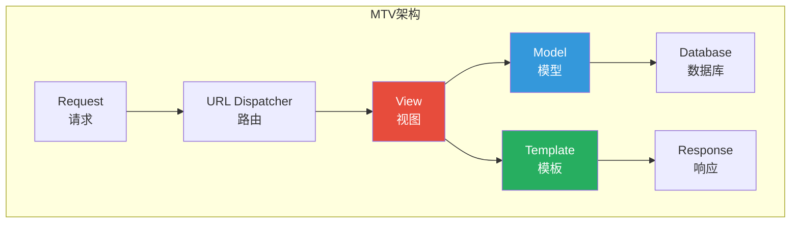
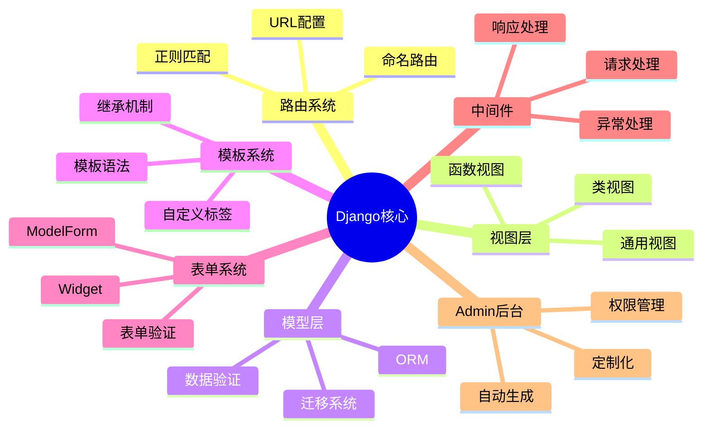
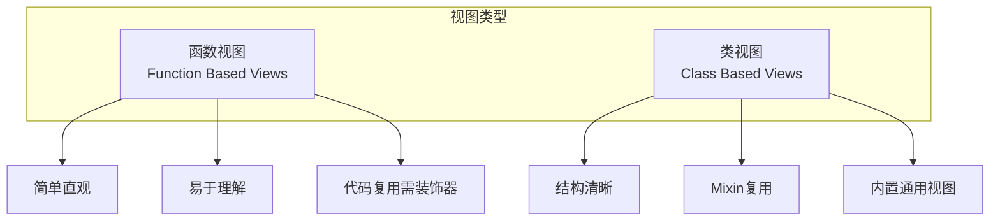
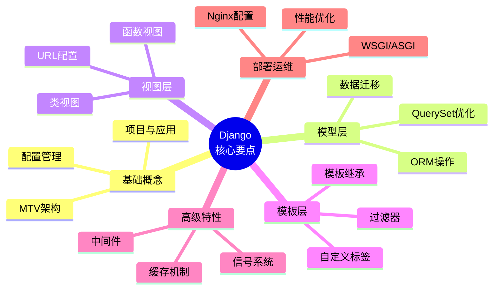

# Django Web框架完全指南：从入门到项目实战

---

## 引言

Django是Python世界中最成熟、最流行的Web框架，以"开箱即用"和"快速开发"著称。从Instagram到Pinterest，从Mozilla到Disqus，无数知名产品都选择Django作为技术栈。

> "The web framework for perfectionists with deadlines" —— Django的设计哲学

无论你是初学者还是经验丰富的开发者，Django都能帮你快速构建安全、可扩展的Web应用。

---

## 一、Django全景认知

### 1.1 Django架构：MTV模式



### 1.2 Django核心组件



### 1.3 Django优势

| 特性 | Django优势 | 其他框架 |
|-----|-----------|---------|
| 开发速度 | 内置Admin、ORM、Auth | 需要额外配置 |
| 安全性 | 自动防护CSRF、XSS、SQL注入 | 需手动处理 |
| 可扩展性 | 组件化设计，易于替换 | 耦合度高 |
| 文档质量 | 文档详尽，社区活跃 | 参差不齐 |
| 生态系统 | 丰富的第三方包 | 需要自己寻找 |

---

## 二、快速入门：创建第一个项目

### 2.1 安装与环境配置

```bash
# 安装Django
pip install django

# 指定版本安装
pip install django==4.2

# 验证安装
python -m django --version
```

### 2.2 创建项目与应用

```bash
# 创建项目
django-admin startproject mysite

# 项目结构
# mysite/
# ├── manage.py           # 项目管理脚本
# └── mysite/
#     ├── __init__.py
#     ├── settings.py     # 项目配置
#     ├── urls.py         # 主路由配置
#     ├── asgi.py         # ASGI服务器入口
#     └── wsgi.py         # WSGI服务器入口

# 创建应用
cd mysite
python manage.py startapp blog

# 应用结构
# blog/
# ├── __init__.py
# ├── admin.py           # Admin配置
# ├── apps.py            # 应用配置
# ├── models.py          # 数据模型
# ├── tests.py           # 测试文件
# ├── views.py           # 视图函数
# └── migrations/        # 数据库迁移
#     └── __init__.py
```

### 2.3 配置settings.py

```python
# mysite/settings.py

INSTALLED_APPS = [
    'django.contrib.admin',
    'django.contrib.auth',
    'django.contrib.contenttypes',
    'django.contrib.sessions',
    'django.contrib.messages',
    'django.contrib.staticfiles',
    
    # 添加自定义应用
    'blog.apps.BlogConfig',
]

# 数据库配置（默认SQLite）
DATABASES = {
    'default': {
        'ENGINE': 'django.db.backends.postgresql',
        'NAME': 'mydb',
        'USER': 'myuser',
        'PASSWORD': 'mypassword',
        'HOST': 'localhost',
        'PORT': '5432',
    }
}

# 语言和时区
LANGUAGE_CODE = 'zh-hans'
TIME_ZONE = 'Asia/Shanghai'
USE_I18N = True
USE_TZ = True

# 静态文件
STATIC_URL = '/static/'
STATICFILES_DIRS = [BASE_DIR / 'static']

# 媒体文件
MEDIA_URL = '/media/'
MEDIA_ROOT = BASE_DIR / 'media'

# 允许的主机
ALLOWED_HOSTS = ['localhost', '127.0.0.1', '*.example.com']
```

### 2.4 第一个视图

```python
# blog/views.py
from django.http import HttpResponse, JsonResponse
from django.shortcuts import render

# 函数视图
def hello(request):
    """简单的Hello World视图"""
    return HttpResponse("Hello, Django!")

def home(request):
    """渲染模板"""
    context = {
        'title': '首页',
        'message': '欢迎来到Django世界！'
    }
    return render(request, 'blog/home.html', context)

def api_data(request):
    """返回JSON数据"""
    data = {
        'name': 'Django',
        'version': '4.2',
        'features': ['ORM', 'Admin', 'Auth']
    }
    return JsonResponse(data)
```

```python
# blog/urls.py
from django.urls import path
from . import views

app_name = 'blog'

urlpatterns = [
    path('', views.home, name='home'),
    path('hello/', views.hello, name='hello'),
    path('api/data/', views.api_data, name='api_data'),
]
```

```python
# mysite/urls.py
from django.contrib import admin
from django.urls import path, include
from django.conf import settings
from django.conf.urls.static import static

urlpatterns = [
    path('admin/', admin.site.urls),
    path('blog/', include('blog.urls')),
]

# 开发环境下提供静态文件服务
if settings.DEBUG:
    urlpatterns += static(settings.STATIC_URL, document_root=settings.STATIC_ROOT)
    urlpatterns += static(settings.MEDIA_URL, document_root=settings.MEDIA_ROOT)
```

### 2.5 启动开发服务器

```bash
# 运行迁移
python manage.py migrate

# 创建超级用户
python manage.py createsuperuser

# 启动开发服务器
python manage.py runserver

# 指定端口
python manage.py runserver 8080

# 允许外部访问
python manage.py runserver 0.0.0.0:8000
```

---

## 三、模型层：ORM深入解析

### 3.1 模型定义

```python
# blog/models.py
from django.db import models
from django.contrib.auth.models import User
from django.urls import reverse
from django.utils import timezone

class Category(models.Model):
    """文章分类"""
    name = models.CharField('分类名称', max_length=100)
    slug = models.SlugField('URL别名', unique=True)
    description = models.TextField('分类描述', blank=True)
    
    class Meta:
        verbose_name = '分类'
        verbose_name_plural = verbose_name
        ordering = ['name']
    
    def __str__(self):
        return self.name
    
    def get_absolute_url(self):
        return reverse('blog:category', args=[self.slug])

class Tag(models.Model):
    """文章标签"""
    name = models.CharField('标签名', max_length=50)
    slug = models.SlugField('URL别名', unique=True)
    
    class Meta:
        verbose_name = '标签'
        verbose_name_plural = verbose_name
    
    def __str__(self):
        return self.name

class Article(models.Model):
    """文章模型"""
    STATUS_CHOICES = [
        ('draft', '草稿'),
        ('published', '已发布'),
    ]
    
    title = models.CharField('标题', max_length=200)
    slug = models.SlugField('URL别名', unique_for_date='publish')
    author = models.ForeignKey(
        User,
        on_delete=models.CASCADE,
        related_name='articles',
        verbose_name='作者'
    )
    category = models.ForeignKey(
        Category,
        on_delete=models.SET_NULL,
        null=True,
        related_name='articles',
        verbose_name='分类'
    )
    tags = models.ManyToManyField(Tag, blank=True, verbose_name='标签')
    content = models.TextField('内容')
    cover = models.ImageField('封面图', upload_to='article/covers/%Y/%m/', blank=True)
    status = models.CharField('状态', max_length=10, choices=STATUS_CHOICES, default='draft')
    publish = models.DateTimeField('发布时间', default=timezone.now)
    created = models.DateTimeField('创建时间', auto_now_add=True)
    updated = models.DateTimeField('更新时间', auto_now=True)
    views = models.PositiveIntegerField('阅读量', default=0)
    
    class Meta:
        verbose_name = '文章'
        verbose_name_plural = verbose_name
        ordering = ['-publish']
        indexes = [
            models.Index(fields=['-publish']),
            models.Index(fields=['status']),
        ]
    
    def __str__(self):
        return self.title
    
    def get_absolute_url(self):
        return reverse('blog:article_detail', args=[
            self.publish.year,
            self.publish.month,
            self.publish.day,
            self.slug
        ])
    
    def increase_views(self):
        """增加阅读量"""
        self.views += 1
        self.save(update_fields=['views'])

class Comment(models.Model):
    """评论模型"""
    article = models.ForeignKey(
        Article,
        on_delete=models.CASCADE,
        related_name='comments',
        verbose_name='文章'
    )
    author = models.ForeignKey(
        User,
        on_delete=models.CASCADE,
        verbose_name '评论者'
    )
    body = models.TextField('评论内容')
    created = models.DateTimeField('创建时间', auto_now_add=True)
    active = models.BooleanField('是否显示', default=True)
    
    class Meta:
        verbose_name = '评论'
        verbose_name_plural = verbose_name
        ordering = ['created']
    
    def __str__(self):
        return f'Comment by {self.author} on {self.article}'
```

### 3.2 字段类型详解

```python
from django.db import models

class FieldTypeDemo(models.Model):
    """字段类型演示"""
    
    # 字符串字段
    char_field = models.CharField(max_length=100)
    text_field = models.TextField()
    slug_field = models.SlugField()
    email_field = models.EmailField()
    url_field = models.URLField()
    
    # 数字字段
    integer_field = models.IntegerField()
    small_integer = models.SmallIntegerField()
    big_integer = models.BigIntegerField()
    positive_int = models.PositiveIntegerField()
    float_field = models.FloatField()
    decimal_field = models.DecimalField(max_digits=10, decimal_places=2)
    
    # 布尔字段
    boolean_field = models.BooleanField()
    null_boolean = models.BooleanField(null=True)
    
    # 日期时间字段
    date_field = models.DateField()
    time_field = models.TimeField()
    datetime_field = models.DateTimeField()
    duration_field = models.DurationField()
    
    # 文件字段
    file_field = models.FileField(upload_to='files/')
    image_field = models.ImageField(upload_to='images/')
    
    # 关系字段
    foreign_key = models.ForeignKey('self', on_delete=models.CASCADE)
    one_to_one = models.OneToOneField('self', on_delete=models.CASCADE)
    many_to_many = models.ManyToManyField('self')
    
    # 其他字段
    uuid_field = models.UUIDField()
    json_field = models.JSONField()
    ip_address = models.GenericIPAddressField()
```

### 3.3 QuerySet操作

```python
# blog/views.py
from django.shortcuts import get_object_or_404
from django.db.models import Q, F, Count, Sum, Avg, Max, Min
from .models import Article, Category, Tag

def queryset_examples(request):
    """QuerySet操作示例"""
    
    # ========== 基础查询 ==========
    
    # 获取所有对象
    articles = Article.objects.all()
    
    # 过滤
    published = Article.objects.filter(status='published')
    drafts = Article.objects.exclude(status='published')
    
    # 链式过滤
    recent_published = Article.objects.filter(
        status='published',
        category__name='技术'
    ).filter(publish__year=2024)
    
    # 获取单个对象
    article = Article.objects.get(pk=1)
    article = get_object_or_404(Article, pk=1)
    
    # 切片
    latest_five = Article.objects.all()[:5]
    
    # ========== 查找条件 ==========
    
    # 精确匹配
    Article.objects.filter(title='Hello World')
    Article.objects.filter(title__exact='Hello World')
    Article.objects.filter(title__iexact='hello world')  # 忽略大小写
    
    # 包含
    Article.objects.filter(title__contains='Django')
    Article.objects.filter(title__icontains='django')
    
    # 开头/结尾
    Article.objects.filter(title__startswith='Django')
    Article.objects.filter(title__endswith='Tutorial')
    
    # 正则表达式
    Article.objects.filter(title__regex=r'^Django')
    
    # 比较
    Article.objects.filter(views__gt=100)    # 大于
    Article.objects.filter(views__gte=100)   # 大于等于
    Article.objects.filter(views__lt=100)    # 小于
    Article.objects.filter(views__lte=100)   # 小于等于
    
    # 范围
    Article.objects.filter(views__range=[100, 500])
    Article.objects.filter(publish__range=['2024-01-01', '2024-12-31'])
    
    # 在列表中
    Article.objects.filter(category__in=[1, 2, 3])
    
    # 空值
    Article.objects.filter(category__isnull=True)
    Article.objects.filter(category__isnull=False)
    
    # 日期
    Article.objects.filter(publish__year=2024)
    Article.objects.filter(publish__month=1)
    Article.objects.filter(publish__day=1)
    Article.objects.filter(publish__date__gt='2024-01-01')
    
    # ========== 复杂查询 ==========
    
    # Q对象（OR查询）
    Article.objects.filter(
        Q(title__contains='Django') | Q(title__contains='Python')
    )
    
    # Q对象组合
    Article.objects.filter(
        Q(category__name='技术') & (Q(status='published') | Q(author=request.user))
    )
    
    # F对象（字段比较）
    Article.objects.filter(views__gt=F('comments__count'))
    Article.objects.update(views=F('views') + 1)
    
    # ========== 聚合与分组 ==========
    
    # 聚合
    from django.db.models import Count, Sum, Avg, Max, Min
    
    # 整体聚合
    stats = Article.objects.aggregate(
        total_views=Sum('views'),
        avg_views=Avg('views'),
        max_views=Max('views'),
        article_count=Count('id')
    )
    
    # 分组聚合
    category_stats = Category.objects.annotate(
        article_count=Count('articles'),
        total_views=Sum('articles__views')
    )
    
    # ========== 性能优化 ==========
    
    # select_related（外键、一对一）
    articles = Article.objects.select_related('author', 'category').all()
    # 避免N+1查询
    
    # prefetch_related（多对多、反向关系）
    articles = Article.objects.prefetch_related('tags').all()
    
    # only（只加载指定字段）
    Article.objects.only('title', 'publish')
    
    # defer（排除指定字段）
    Article.objects.defer('content')
    
    # bulk_create（批量创建）
    articles = [Article(title=f'Article {i}') for i in range(100)]
    Article.objects.bulk_create(articles)
    
    # bulk_update（批量更新）
    Article.objects.bulk_update(articles, ['title', 'status'])
    
    return JsonResponse({'message': 'QuerySet示例演示完成'})
```

### 3.4 数据库迁移

```bash
# 生成迁移文件
python manage.py makemigrations

# 指定应用生成迁移
python manage.py makemigrations blog

# 查看迁移SQL
python manage.py sqlmigrate blog 0001

# 执行迁移
python manage.py migrate

# 迁移到指定版本
python manage.py migrate blog 0001

# 查看迁移状态
python manage.py showmigrations

# 伪造迁移（不实际执行）
python manage.py migrate --fake blog 0002
```

---

## 四、视图层：请求处理

### 4.1 函数视图 vs 类视图



### 4.2 函数视图

```python
# blog/views.py
from django.shortcuts import render, get_object_or_404, redirect
from django.http import HttpResponse, HttpResponseRedirect
from django.contrib.auth.decorators import login_required
from django.views.decorators.http import require_http_methods, require_GET, require_POST
from django.contrib import messages
from django.core.paginator import Paginator, EmptyPage, PageNotAnInteger

from .models import Article, Category
from .forms import ArticleForm

# 基础视图
def article_list(request):
    """文章列表"""
    article_list = Article.objects.filter(status='published')
    
    # 分页
    paginator = Paginator(article_list, 10)  # 每页10条
    page = request.GET.get('page', 1)
    
    try:
        articles = paginator.page(page)
    except PageNotAnInteger:
        articles = paginator.page(1)
    except EmptyPage:
        articles = paginator.page(paginator.num_pages)
    
    return render(request, 'blog/article_list.html', {
        'articles': articles,
        'page': page
    })

def article_detail(request, year, month, day, slug):
    """文章详情"""
    article = get_object_or_404(
        Article,
        slug=slug,
        status='published',
        publish__year=year,
        publish__month=month,
        publish__day=day
    )
    
    # 增加阅读量
    article.increase_views()
    
    # 获取相关文章
    related_articles = Article.objects.filter(
        category=article.category,
        status='published'
    ).exclude(pk=article.pk)[:5]
    
    return render(request, 'blog/article_detail.html', {
        'article': article,
        'related_articles': related_articles
    })

# 需要登录的视图
@login_required(login_url='/login/')
def article_create(request):
    """创建文章"""
    if request.method == 'POST':
        form = ArticleForm(request.POST, request.FILES)
        if form.is_valid():
            article = form.save(commit=False)
            article.author = request.user
            article.save()
            form.save_m2m()  # 保存多对多关系
            messages.success(request, '文章创建成功！')
            return redirect(article.get_absolute_url())
    else:
        form = ArticleForm()
    
    return render(request, 'blog/article_form.html', {'form': form})

@login_required
def article_update(request, pk):
    """更新文章"""
    article = get_object_or_404(Article, pk=pk, author=request.user)
    
    if request.method == 'POST':
        form = ArticleForm(request.POST, request.FILES, instance=article)
        if form.is_valid():
            article = form.save()
            messages.success(request, '文章更新成功！')
            return redirect(article.get_absolute_url())
    else:
        form = ArticleForm(instance=article)
    
    return render(request, 'blog/article_form.html', {
        'form': form,
        'article': article
    })

@login_required
@require_POST
def article_delete(request, pk):
    """删除文章"""
    article = get_object_or_404(Article, pk=pk, author=request.user)
    article.delete()
    messages.success(request, '文章删除成功！')
    return redirect('blog:article_list')

# HTTP方法限制
@require_http_methods(["GET", "POST"])
def article_action(request):
    """限制HTTP方法"""
    if request.method == 'GET':
        return HttpResponse("GET请求")
    elif request.method == 'POST':
        return HttpResponse("POST请求")
```

### 4.3 类视图

```python
# blog/views.py
from django.views.generic import (
    ListView, DetailView, CreateView, UpdateView, DeleteView,
    TemplateView, FormView, View
)
from django.contrib.auth.mixins import LoginRequiredMixin, UserPassesTestMixin
from django.urls import reverse_lazy
from django.contrib.messages.views import SuccessMessageMixin

from .models import Article
from .forms import ArticleForm

# ListView - 列表视图
class ArticleListView(ListView):
    model = Article
    template_name = 'blog/article_list.html'
    context_object_name = 'articles'
    paginate_by = 10
    ordering = ['-publish']
    
    def get_queryset(self):
        """自定义查询集"""
        queryset = super().get_queryset().filter(status='published')
        
        # 分类过滤
        category_slug = self.request.GET.get('category')
        if category_slug:
            queryset = queryset.filter(category__slug=category_slug)
        
        return queryset
    
    def get_context_data(self, **kwargs):
        """添加额外上下文"""
        context = super().get_context_data(**kwargs)
        context['categories'] = Category.objects.all()
        return context

# DetailView - 详情视图
class ArticleDetailView(DetailView):
    model = Article
    template_name = 'blog/article_detail.html'
    context_object_name = 'article'
    
    def get_object(self, queryset=None):
        """自定义获取对象逻辑"""
        obj = super().get_object(queryset=queryset)
        obj.increase_views()  # 增加阅读量
        return obj
    
    def get_context_data(self, **kwargs):
        context = super().get_context_data(**kwargs)
        context['related_articles'] = Article.objects.filter(
            category=self.object.category
        ).exclude(pk=self.object.pk)[:5]
        return context

# CreateView - 创建视图
class ArticleCreateView(LoginRequiredMixin, SuccessMessageMixin, CreateView):
    model = Article
    form_class = ArticleForm
    template_name = 'blog/article_form.html'
    success_message = '文章创建成功！'
    
    def form_valid(self, form):
        """表单验证通过时调用"""
        form.instance.author = self.request.user
        return super().form_valid(form)
    
    def get_success_url(self):
        return self.object.get_absolute_url()

# UpdateView - 更新视图
class ArticleUpdateView(LoginRequiredMixin, UserPassesTestMixin, SuccessMessageMixin, UpdateView):
    model = Article
    form_class = ArticleForm
    template_name = 'blog/article_form.html'
    success_message = '文章更新成功！'
    
    def test_func(self):
        """权限检查"""
        article = self.get_object()
        return self.request.user == article.author
    
    def get_success_url(self):
        return self.object.get_absolute_url()

# DeleteView - 删除视图
class ArticleDeleteView(LoginRequiredMixin, UserPassesTestMixin, DeleteView):
    model = Article
    template_name = 'blog/article_confirm_delete.html'
    success_url = reverse_lazy('blog:article_list')
    
    def test_func(self):
        article = self.get_object()
        return self.request.user == article.author

# 自定义类视图
class ArticleToggleLikeView(LoginRequiredMixin, View):
    """点赞/取消点赞"""
    
    def post(self, request, pk):
        article = get_object_or_404(Article, pk=pk)
        
        if request.user in article.likes.all():
            article.likes.remove(request.user)
            liked = False
        else:
            article.likes.add(request.user)
            liked = True
        
        return JsonResponse({
            'liked': liked,
            'count': article.likes.count()
        })
```

### 4.4 URL配置进阶

```python
# blog/urls.py
from django.urls import path, re_path
from . import views

app_name = 'blog'

urlpatterns = [
    # 文章列表
    path('', views.ArticleListView.as_view(), name='article_list'),
    
    # 文章详情（多种方式）
    path('article/<int:pk>/', views.ArticleDetailView.as_view(), name='article_detail'),
    path('article/<slug:slug>/', views.ArticleDetailView.as_view(), name='article_detail_by_slug'),
    
    # 正则表达式URL
    re_path(r'^article/(?P<year>\d{4})/(?P<month>\d{2})/(?P<day>\d{2})/(?P<slug>[-\w]+)/$',
            views.ArticleDetailView.as_view(), name='article_detail_by_date'),
    
    # 文章操作
    path('article/create/', views.ArticleCreateView.as_view(), name='article_create'),
    path('article/<int:pk>/update/', views.ArticleUpdateView.as_view(), name='article_update'),
    path('article/<int:pk>/delete/', views.ArticleDeleteView.as_view(), name='article_delete'),
    
    # 分类
    path('category/<slug:slug>/', views.CategoryDetailView.as_view(), name='category'),
    
    # API接口
    path('api/articles/', views.ArticleAPIList.as_view(), name='api_article_list'),
    path('api/article/<int:pk>/like/', views.ArticleToggleLikeView.as_view(), name='api_article_like'),
]
```

---

## 五、模板系统

### 5.1 模板基础

```html
<!-- templates/base.html -->
<!DOCTYPE html>
<html lang="zh-CN">
<head>
    <meta charset="UTF-8">
    <meta name="viewport" content="width=device-width, initial-scale=1.0">
    <title>我的博客</title>
    
    <!-- 加载静态文件 -->
    
    <link rel="stylesheet" href="">
    
</head>
<body>
    <!-- 导航栏 -->
    <nav class="navbar">
        <div class="container">
            <a class="navbar-brand" href="">我的博客</a>
            <ul class="navbar-nav">
                <li><a href="">首页</a></li>
                
                    <li><a href="">写文章</a></li>
                    <li><a href="">退出</a></li>
                
                    <li><a href="">登录</a></li>
                    <li><a href="">注册</a></li>
                
            </ul>
        </div>
    </nav>
    
    <!-- 消息提示 -->
    
    <div class="messages">
        
        <div class="alert alert-{{ message.tags }}">
            {{ message }}
        </div>
        
    </div>
    
    
    <!-- 主要内容 -->
    <main class="container">
        
    </main>
    
    <!-- 页脚 -->
    <footer class="footer">
        <div class="container">
            <p>&copy;  我的博客. All rights reserved.</p>
        </div>
    </footer>
    
    <script src=""></script>
    
</body>
</html>
```

### 5.2 模板继承

```html
<!-- templates/blog/article_list.html -->


文章列表 - {{ block.super }}


<div class="article-list">
    <h1>文章列表</h1>
    
    <!-- 文章列表 -->
    
    <article class="article-item">
        <h2>
            <a href="{{ article.get_absolute_url }}">
                {{ article.title }}
            </a>
        </h2>
        
        <div class="meta">
            <span class="author">
                <i class="icon-user"></i> {{ article.author.username }}
            </span>
            <span class="date">
                <i class="icon-calendar"></i> {{ article.publish|date:"Y年m月d日" }}
            </span>
            <span class="views">
                <i class="icon-eye"></i> {{ article.views }} 阅读
            </span>
        </div>
        
        <div class="category">
            <a href="{{ article.category.get_absolute_url }}">
                {{ article.category.name }}
            </a>
        </div>
        
        <!-- 标签 -->
        
        <span class="tag">{{ tag.name }}</span>
        
        <span class="no-tags">暂无标签</span>
        
    </article>
    
    <p class="no-articles">暂无文章</p>
    
    
    <!-- 分页 -->
    
    <nav class="pagination">
        
        <a href="?page={{ articles.previous_page_number }}">上一页</a>
        
        
        <span class="current">第 {{ articles.number }} 页 / 共 {{ articles.paginator.num_pages }} 页</span>
        
        
        <a href="?page={{ articles.next_page_number }}">下一页</a>
        
    </nav>
    
</div>

```

### 5.3 自定义模板标签和过滤器

```python
# blog/templatetags/blog_tags.py
from django import template
from django.db.models import Count
from ..models import Article, Category, Tag

register = template.Library()

# 自定义过滤器
@register.filter(name='markdown')
def markdown_filter(text):
    """Markdown转HTML"""
    import markdown
    return markdown.markdown(text, extensions=[
        'markdown.extensions.extra',
        'markdown.extensions.codehilite',
    ])

@register.filter
def truncate_content(content, length=100):
    """截取内容"""
    if len(content) > length:
        return content[:length] + '...'
    return content

@register.simple_tag
def total_articles():
    """获取文章总数"""
    return Article.objects.filter(status='published').count()

@register.simple_tag
def get_categories():
    """获取所有分类及其文章数"""
    return Category.objects.annotate(
        article_count=Count('articles')
    ).filter(article_count__gt=0)

@register.inclusion_tag('blog/latest_articles.html')
def show_latest_articles(count=5):
    """显示最新文章"""
    latest_articles = Article.objects.filter(
        status='published'
    ).order_by('-publish')[:count]
    return {'latest_articles': latest_articles}

@register.inclusion_tag('blog/most_viewed_articles.html')
def show_most_viewed_articles(count=5):
    """显示最热文章"""
    most_viewed = Article.objects.filter(
        status='published'
    ).order_by('-views')[:count]
    return {'most_viewed': most_viewed}
```

```html
<!-- 在模板中使用自定义标签 -->


<!-- 使用过滤器 -->
{{ article.content|markdown|safe }}
{{ article.content|truncate_content:200 }}

<!-- 使用简单标签 -->
 篇文章

<!-- 使用包含标签 -->


```

---

## 六、Admin后台定制

### 6.1 基础Admin配置

```python
# blog/admin.py
from django.contrib import admin
from django.utils.html import format_html
from django.urls import reverse
from django.contrib import messages
from .models import Article, Category, Tag, Comment

@admin.register(Category)
class CategoryAdmin(admin.ModelAdmin):
    list_display = ['name', 'slug', 'article_count', 'created']
    prepopulated_fields = {'slug': ('name',)}
    search_fields = ['name', 'description']
    
    def article_count(self, obj):
        return obj.articles.count()
    article_count.short_description = '文章数'

@admin.register(Tag)
class TagAdmin(admin.ModelAdmin):
    list_display = ['name', 'slug']
    prepopulated_fields = {'slug': ('name',)}
    search_fields = ['name']

@admin.register(Article)
class ArticleAdmin(admin.ModelAdmin):
    list_display = ['title', 'author', 'category', 'status', 'publish', 'views', 'show_tags']
    list_filter = ['status', 'category', 'created', 'publish', 'author']
    search_fields = ['title', 'content']
    prepopulated_fields = {'slug': ('title',)}
    raw_id_fields = ['author']
    date_hierarchy = 'publish'
    ordering = ['-publish']
    filter_horizontal = ['tags']
    
    # 编辑页面字段布局
    fieldsets = (
        (None, {
            'fields': ('title', 'slug', 'author', 'category', 'tags')
        }),
        ('内容', {
            'fields': ('content', 'cover')
        }),
        ('状态', {
            'fields': ('status', 'publish'),
            'classes': ['collapse']
        }),
        ('统计', {
            'fields': ('views',),
            'classes': ['collapse']
        }),
    )
    
    def show_tags(self, obj):
        """显示标签"""
        return ', '.join([tag.name for tag in obj.tags.all()])
    show_tags.short_description = '标签'
    
    def save_model(self, request, obj, form, change):
        """保存时自动设置作者"""
        if not change:
            obj.author = request.user
        super().save_model(request, obj, form, change)
    
    # 自定义操作
    actions = ['make_published', 'make_draft', 'export_as_csv']
    
    @admin.action(description='将选中文章标记为已发布')
    def make_published(self, request, queryset):
        count = queryset.update(status='published')
        self.message_user(request, f'成功发布 {count} 篇文章', messages.SUCCESS)
    
    @admin.action(description='将选中文章标记为草稿')
    def make_draft(self, request, queryset):
        count = queryset.update(status='draft')
        self.message_user(request, f'成功转为草稿 {count} 篇文章', messages.SUCCESS)
    
    @admin.action(description='导出为CSV')
    def export_as_csv(self, request, queryset):
        import csv
        from django.http import HttpResponse
        
        response = HttpResponse(content_type='text/csv')
        response['Content-Disposition'] = 'attachment; filename="articles.csv"'
        
        writer = csv.writer(response)
        writer.writerow(['标题', '作者', '状态', '发布时间', '阅读量'])
        
        for article in queryset:
            writer.writerow([
                article.title,
                article.author.username,
                article.get_status_display(),
                article.publish.strftime('%Y-%m-%d %H:%M'),
                article.views
            ])
        
        return response

@admin.register(Comment)
class CommentAdmin(admin.ModelAdmin):
    list_display = ['author', 'article', 'created', 'active']
    list_filter = ['active', 'created']
    search_fields = ['author__username', 'article__title', 'body']
    actions = ['disable_comments', 'enable_comments']
    
    @admin.action(description='隐藏选中评论')
    def disable_comments(self, request, queryset):
        queryset.update(active=False)
    
    @admin.action(description='显示选中评论')
    def enable_comments(self, request, queryset):
        queryset.update(active=True)
```

### 6.2 自定义Admin站点

```python
# mysite/admin.py
from django.contrib import admin
from django.utils.translation import gettext_lazy as _

class MyAdminSite(admin.AdminSite):
    site_header = "我的博客管理后台"
    site_title = "博客管理"
    index_title = "欢迎来到管理后台"
    
    # 自定义索引视图
    def index(self, request, extra_context=None):
        extra_context = extra_context or {}
        extra_context['custom_stats'] = self.get_stats()
        return super().index(request, extra_context)
    
    def get_stats(self):
        """获取统计数据"""
        from blog.models import Article
        return {
            'total_articles': Article.objects.count(),
            'published_articles': Article.objects.filter(status='published').count(),
        }

# 创建自定义Admin站点实例
admin_site = MyAdminSite(name='myadmin')

# 在URL中使用
# urlpatterns = [
#     path('myadmin/', admin_site.urls),
# ]
```

---

## 七、中间件与信号

### 7.1 自定义中间件

```python
# blog/middleware.py
import time
import logging
from django.http import JsonResponse
from django.conf import settings

logger = logging.getLogger(__name__)

class RequestLoggingMiddleware:
    """请求日志中间件"""
    
    def __init__(self, get_response):
        self.get_response = get_response
    
    def __call__(self, request):
        # 请求前
        start_time = time.time()
        
        # 处理请求
        response = self.get_response(request)
        
        # 请求后
        duration = time.time() - start_time
        
        logger.info(
            f'{request.method} {request.path} - '
            f'{response.status_code} - {duration:.2f}s'
        )
        
        return response

class IPRestrictionMiddleware:
    """IP访问限制中间件"""
    
    ALLOWED_IPS = [
        '127.0.0.1',
        '192.168.1.0/24',
    ]
    
    def __init__(self, get_response):
        self.get_response = get_response
    
    def __call__(self, request):
        ip = self.get_client_ip(request)
        
        if not self.is_allowed(ip):
            return JsonResponse(
                {'error': 'IP访问受限'},
                status=403
            )
        
        return self.get_response(request)
    
    def get_client_ip(self, request):
        x_forwarded_for = request.META.get('HTTP_X_FORWARDED_FOR')
        if x_forwarded_for:
            return x_forwarded_for.split(',')[0]
        return request.META.get('REMOTE_ADDR')
    
    def is_allowed(self, ip):
        # 简化实现，实际需要处理网段
        return ip in self.ALLOWED_IPS

class ExceptionHandlingMiddleware:
    """异常处理中间件"""
    
    def __init__(self, get_response):
        self.get_response = get_response
    
    def __call__(self, request):
        return self.get_response(request)
    
    def process_exception(self, request, exception):
        """处理未捕获的异常"""
        logger.exception(f"未处理的异常: {exception}")
        
        if settings.DEBUG:
            return None  # 使用默认的错误页面
        
        return JsonResponse(
            {'error': '服务器内部错误'},
            status=500
        )
```

```python
# settings.py
MIDDLEWARE = [
    'django.middleware.security.SecurityMiddleware',
    'django.contrib.sessions.middleware.SessionMiddleware',
    'django.middleware.common.CommonMiddleware',
    'django.middleware.csrf.CsrfViewMiddleware',
    'django.contrib.auth.middleware.AuthenticationMiddleware',
    'django.contrib.messages.middleware.MessageMiddleware',
    'django.middleware.clickjacking.XFrameOptionsMiddleware',
    
    # 自定义中间件
    'blog.middleware.RequestLoggingMiddleware',
    'blog.middleware.IPRestrictionMiddleware',
    'blog.middleware.ExceptionHandlingMiddleware',
]
```

### 7.2 信号系统

```python
# blog/signals.py
from django.db.models.signals import post_save, pre_save, post_delete
from django.dispatch import receiver
from django.contrib.auth.models import User
from django.core.mail import send_mail
from django.conf import settings
import logging

from .models import Article, Comment

logger = logging.getLogger(__name__)

# 文章保存信号
@receiver(pre_save, sender=Article)
def article_pre_save(sender, instance, **kwargs):
    """文章保存前"""
    if instance.pk:
        # 更新操作
        old_instance = Article.objects.get(pk=instance.pk)
        instance._old_status = old_instance.status
    else:
        # 创建操作
        instance._old_status = None

@receiver(post_save, sender=Article)
def article_post_save(sender, instance, created, **kwargs):
    """文章保存后"""
    if created:
        logger.info(f'新文章创建: {instance.title} by {instance.author}')
        
        # 发送通知邮件
        if instance.status == 'published':
            send_article_notification(instance)
    else:
        # 状态变化检测
        if hasattr(instance, '_old_status'):
            if instance._old_status != instance.status:
                logger.info(
                    f'文章状态变更: {instance.title} '
                    f'{instance._old_status} -> {instance.status}'
                )

def send_article_notification(article):
    """发送文章通知"""
    subject = f'新文章发布: {article.title}'
    message = f'{article.author.username} 发布了新文章:\n\n{article.title}\n\n{article.content[:200]}...'
    
    # 这里可以发送邮件给订阅用户
    # send_mail(subject, message, settings.DEFAULT_FROM_EMAIL, recipient_list)

# 评论信号
@receiver(post_save, sender=Comment)
def comment_post_save(sender, instance, created, **kwargs):
    """评论保存后"""
    if created:
        logger.info(f'新评论: {instance.author} 评论了 {instance.article.title}')
        
        # 通知文章作者
        if instance.author != instance.article.author:
            send_comment_notification(instance)

def send_comment_notification(comment):
    """发送评论通知"""
    # 发送邮件通知文章作者
    pass

# 用户信号
@receiver(post_save, sender=User)
def create_user_profile(sender, instance, created, **kwargs):
    """创建用户时自动创建用户资料"""
    if created:
        from .models import Profile
        Profile.objects.create(user=instance)

@receiver(post_save, sender=User)
def save_user_profile(sender, instance, **kwargs):
    """保存用户时保存用户资料"""
    instance.profile.save()
```

```python
# blog/apps.py
from django.apps import AppConfig

class BlogConfig(AppConfig):
    default_auto_field = 'django.db.models.BigAutoField'
    name = 'blog'
    
    def ready(self):
        # 导入信号
        import blog.signals
```

---

## 八、部署与优化

### 8.1 生产环境配置

```python
# settings/production.py
from .base import *
import os

DEBUG = False
ALLOWED_HOSTS = ['www.example.com', 'example.com']

# 安全设置
SECURE_SSL_REDIRECT = True
SECURE_PROXY_SSL_HEADER = ('HTTP_X_FORWARDED_PROTO', 'https')
SESSION_COOKIE_SECURE = True
CSRF_COOKIE_SECURE = True
SECURE_BROWSER_XSS_FILTER = True
SECURE_CONTENT_TYPE_NOSNIFF = True
X_FRAME_OPTIONS = 'DENY'

# 静态文件
STATIC_ROOT = '/var/www/static/'
MEDIA_ROOT = '/var/www/media/'

# 数据库
DATABASES = {
    'default': {
        'ENGINE': 'django.db.backends.postgresql',
        'NAME': os.environ.get('DB_NAME'),
        'USER': os.environ.get('DB_USER'),
        'PASSWORD': os.environ.get('DB_PASSWORD'),
        'HOST': os.environ.get('DB_HOST'),
        'PORT': os.environ.get('DB_PORT', '5432'),
    }
}

# 缓存
CACHES = {
    'default': {
        'BACKEND': 'django.core.cache.backends.redis.RedisCache',
        'LOCATION': 'redis://127.0.0.1:6379/1',
    }
}

# 日志
LOGGING = {
    'version': 1,
    'disable_existing_loggers': False,
    'formatters': {
        'verbose': {
            'format': '{levelname} {asctime} {module} {message}',
            'style': '{',
        },
    },
    'handlers': {
        'file': {
            'level': 'ERROR',
            'class': 'logging.FileHandler',
            'filename': '/var/log/django/error.log',
            'formatter': 'verbose',
        },
    },
    'loggers': {
        'django': {
            'handlers': ['file'],
            'level': 'ERROR',
            'propagate': True,
        },
    },
}
```

### 8.2 Gunicorn + Nginx部署

```bash
# 安装Gunicorn
pip install gunicorn

# 启动Gunicorn
gunicorn mysite.wsgi:application \
    --bind 127.0.0.1:8000 \
    --workers 4 \
    --threads 2 \
    --timeout 60 \
    --access-logfile /var/log/gunicorn/access.log \
    --error-logfile /var/log/gunicorn/error.log
```

```nginx
# /etc/nginx/sites-available/mysite
server {
    listen 80;
    server_name example.com www.example.com;
    return 301 https://$server_name$request_uri;
}

server {
    listen 443 ssl http2;
    server_name example.com www.example.com;

    ssl_certificate /etc/letsencrypt/live/example.com/fullchain.pem;
    ssl_certificate_key /etc/letsencrypt/live/example.com/privkey.pem;

    location /static/ {
        alias /var/www/static/;
        expires 30d;
    }

    location /media/ {
        alias /var/www/media/;
        expires 7d;
    }

    location / {
        proxy_pass http://127.0.0.1:8000;
        proxy_set_header Host $host;
        proxy_set_header X-Real-IP $remote_addr;
        proxy_set_header X-Forwarded-For $proxy_add_x_forwarded_for;
        proxy_set_header X-Forwarded-Proto $scheme;
    }
}
```

### 8.3 性能优化清单

```python
# 性能优化建议

# 1. 数据库优化
# - 使用select_related和prefetch_related
# - 添加适当的索引
# - 使用数据库连接池

# 2. 缓存策略
from django.views.decorators.cache import cache_page
from django.views.decorators.vary import vary_on_cookie

@cache_page(60 * 15)  # 缓存15分钟
@vary_on_cookie
def article_list(request):
    pass

# 3. 查询优化
# - 使用only()和defer()
# - 避免N+1查询
# - 使用count()而不是len(queryset)

# 4. 静态文件
# - 使用Whitenoise或CDN
# - 压缩CSS/JS
# - 启用浏览器缓存

# 5. 数据库连接池
# pip install django-db-geventpool
DATABASES = {
    'default': {
        'ENGINE': 'django_db_geventpool.backends.postgresql_psycopg2',
        'OPTIONS': {
            'MAX_CONNS': 20,
            'REUSE_CONNS': 10
        }
    }
}
```

---



### 核心要点回顾：

1. **MTV架构**：理解Model-Template-View的设计模式
2. **ORM精通**：熟练使用QuerySet和数据库优化
3. **视图灵活**：根据场景选择函数视图或类视图
4. **模板复用**：使用继承和自定义标签提高效率
5. **部署安全**：掌握生产环境配置和性能优化

---