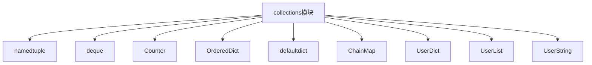

# Python标准库-collections模块完全参考手册

## 概述

`collections` 模块提供了Python内置容器类型（`dict`, `list`, `set`, `tuple`）的专用替代实现，提供了更多功能和更好的性能。该模块包含了一系列高效、专用的容器数据类型，能够解决各种编程问题。

collections模块的核心功能包括：
- 专用的容器数据类型
- 更高效的数据结构
- 更方便的API接口
- 线程安全的实现
- 内存优化的存储方式



## namedtuple() 工厂函数

`namedtuple()` 工厂函数创建具有命名字段的元组子类，使代码更具可读性和自文档化。

### 语法

```python
collections.namedtuple(typename, field_names, *, rename=False, defaults=None, module=None)
```

### 基本使用

```python
from collections import namedtuple

# 创建一个Point命名元组
Point = namedtuple('Point', ['x', 'y'])
p = Point(1, 2)
print(p)  # Point(x=1, y=2)
print(p.x, p.y)  # 1 2

# 使用字符串格式的字段名
Person = namedtuple('Person', 'name age city')
person = Person('Alice', 30, 'New York')
print(person)  # Person(name='Alice', age=30, city='New York')
```

### 高级功能

#### 默认值

```python
from collections import namedtuple

# 为右边的参数设置默认值
Person = namedtuple('Person', ['name', 'age', 'city'], defaults=['Unknown', 0])
p1 = Person('Alice')
print(p1)  # Person(name='Alice', age='Unknown', city=0)

p2 = Person('Bob', 25, 'Boston')
print(p2)  # Person(name='Bob', age=25, city='Boston')
```

#### 自动重命名无效字段

```python
from collections import namedtuple

# 自动重命名无效字段名
Record = namedtuple('Record', ['name', 'age', 'class', 'def'], rename=True)
print(Record._fields)  # ['name', 'age', '_2', '_3']

r = Record('Alice', 25, 'A', 'default')
print(r)  # Record(name='Alice', age=25, _2='A', _3='default')
```

### 实例方法

#### _make(iterable)

从可迭代对象创建实例：

```python
from collections import namedtuple

Point = namedtuple('Point', ['x', 'y'])
p = Point._make([1, 2])
print(p)  # Point(x=1, y=2)
```

#### _asdict()

将命名元组转换为有序字典：

```python
from collections import namedtuple

Person = namedtuple('Person', ['name', 'age'])
person = Person('Alice', 25)
print(person._asdict())  # {'name': 'Alice', 'age': 25}
```

#### _replace(**kwargs)

返回指定字段替换后的新实例：

```python
from collections import namedtuple

Person = namedtuple('Person', ['name', 'age'])
person = Person('Alice', 25)
new_person = person._replace(age=26)
print(new_person)  # Person(name='Alice', age=26)
```

## deque类

`deque`（双端队列）是栈和队列的泛化，支持线程安全的、内存高效的从两端添加和弹出操作，性能为O(1)。

### 构造函数

```python
collections.deque([iterable [, maxlen]])
```

### 基本使用

```python
from collections import deque

# 创建deque
d = deque([1, 2, 3])
print(d)  # deque([1, 2, 3])

# 从两端添加
d.append(4)       # 右端添加
d.appendleft(0)   # 左端添加
print(d)  # deque([0, 1, 2, 3, 4])

# 从两端弹出
print(d.pop())      # 4 (右端弹出)
print(d.popleft())  # 0 (左端弹出)
print(d)  # deque([1, 2, 3])
```

### 限制大小的deque

```python
from collections import deque

# 创建有限大小的deque
d = deque(maxlen=3)
for i in range(5):
    d.append(i)
    print(d)

# 输出:
# deque([0], maxlen=3)
# deque([0, 1], maxlen=3)
# deque([0, 1, 2], maxlen=3)
# deque([1, 2, 3], maxlen=3)
# deque([2, 3, 4], maxlen=3)
```

### 主要方法

#### append(item)

在右端添加元素：

```python
from collections import deque

d = deque([1, 2, 3])
d.append(4)
print(d)  # deque([1, 2, 3, 4])
```

#### appendleft(item)

在左端添加元素：

```python
from collections import deque

d = deque([1, 2, 3])
d.appendleft(0)
print(d)  # deque([0, 1, 2, 3])
```

#### extend(iterable)

在右端扩展多个元素：

```python
from collections import deque

d = deque([1, 2, 3])
d.extend([4, 5, 6])
print(d)  # deque([1, 2, 3, 4, 5, 6])
```

#### extendleft(iterable)

在左端扩展多个元素：

```python
from collections import deque

d = deque([1, 2, 3])
d.extendleft([0, -1, -2])
print(d)  # deque([-2, -1, 0, 1, 2, 3])
```

#### pop()

弹出并返回右端元素：

```python
from collections import deque

d = deque([1, 2, 3])
item = d.pop()
print(item)  # 3
print(d)  # deque([1, 2])
```

#### popleft()

弹出并返回左端元素：

```python
from collections import deque

d = deque([1, 2, 3])
item = d.popleft()
print(item)  # 1
print(d)  # deque([2, 3])
```

#### rotate(n)

旋转deque：

```python
from collections import deque

d = deque([1, 2, 3, 4, 5])
d.rotate(2)  # 向右旋转2步
print(d)  # deque([4, 5, 1, 2, 3])

d.rotate(-1)  # 向左旋转1步
print(d)  # deque([5, 1, 2, 3, 4])
```

#### remove(value)

移除第一个匹配的值：

```python
from collections import deque

d = deque([1, 2, 3, 2, 4])
d.remove(2)
print(d)  # deque([1, 3, 2, 4])
```

### 应用示例

#### 滑动窗口

```python
from collections import deque

def moving_window(iterable, window_size):
    """滑动窗口"""
    window = deque(maxlen=window_size)
    for item in iterable:
        window.append(item)
        if len(window) == window_size:
            yield list(window)

# 使用示例
data = [1, 2, 3, 4, 5, 6, 7, 8]
for window in moving_window(data, 3):
    print(window)

# 输出:
# [1, 2, 3]
# [2, 3, 4]
# [3, 4, 5]
# [4, 5, 6]
# [5, 6, 7]
# [6, 7, 8]
```

#### 广度优先搜索

```python
from collections import deque

def bfs(graph, start):
    """广度优先搜索"""
    visited = set()
    queue = deque([start])
    visited.add(start)

    while queue:
        vertex = queue.popleft()
        print(vertex, end=' ')

        for neighbor in graph[vertex]:
            if neighbor not in visited:
                visited.add(neighbor)
                queue.append(neighbor)

# 使用示例
graph = {
    'A': ['B', 'C'],
    'B': ['D', 'E'],
    'C': ['F'],
    'D': [],
    'E': ['F'],
    'F': []
}

bfs(graph, 'A')  # A B C D E F
```

## Counter类

`Counter` 是 `dict` 的子类，用于计数可哈希对象。它是一个集合，其中元素被存储为字典键，它们的计数被存储为字典值。

### 构造函数

```python
collections.Counter([iterable-or-mapping])
```

### 基本使用

```python
from collections import Counter

# 从可迭代对象创建
c = Counter('hello world')
print(c)  # Counter({'l': 3, 'o': 2, 'h': 1, 'e': 1, ' ': 1, 'w': 1, 'r': 1, 'd': 1})

# 从字典创建
c = Counter({'apple': 4, 'banana': 2})
print(c)  # Counter({'apple': 4, 'banana': 2})

# 从关键字参数创建
c = Counter(apple=4, banana=2)
print(c)  # Counter({'apple': 4, 'banana': 2})
```

### 主要方法

#### most_common(n)

返回n个最常见的元素：

```python
from collections import Counter

c = Counter('hello world')
print(c.most_common(3))  # [('l', 3), ('o', 2), ('h', 1)]
```

#### elements()

返回元素迭代器：

```python
from collections import Counter

c = Counter('aabbbc')
print(list(c.elements()))  # ['a', 'a', 'b', 'b', 'b', 'c']
```

#### update()

更新计数：

```python
from collections import Counter

c = Counter('aab')
c.update('bbc')
print(c)  # Counter({'b': 3, 'a': 2, 'c': 1})
```

#### subtract()

减去计数：

```python
from collections import Counter

c = Counter('aabbbc')
c.subtract('ab')
print(c)  # Counter({'b': 2, 'a': 1, 'c': 1})
```

#### total()

返回所有计数的总和：

```python
from collections import Counter

c = Counter({'a': 3, 'b': 2, 'c': 1})
print(c.total())  # 6
```

### 数学运算

```python
from collections import Counter

c1 = Counter(a=3, b=1)
c2 = Counter(a=1, b=2)

# 加法
print(c1 + c2)  # Counter({'a': 4, 'b': 3})

# 减法
print(c1 - c2)  # Counter({'a': 2})

# 交集
print(c1 & c2)  # Counter({'a': 1, 'b': 1})

# 并集
print(c1 | c2)  # Counter({'a': 3, 'b': 2})

# 一元运算
c = Counter(a=2, b=-4)
print(+c)  # Counter({'a': 2})
print(-c)  # Counter({'b': 4})
```

### 应用示例

#### 单词计数

```python
from collections import Counter
import re

def count_words(text):
    """统计单词频率"""
    words = re.findall(r'\w+', text.lower())
    return Counter(words)

# 使用示例
text = "Hello world! Hello Python! Python is great. Hello again!"
word_counts = count_words(text)
print(word_counts.most_common(3))
# [('hello', 3), ('python', 2), ('is', 1)]
```

#### 统计字符频率

```python
from collections import Counter

def char_frequency(text):
    """统计字符频率"""
    return Counter(text)

# 使用示例
text = "programming"
freq = char_frequency(text)
print(freq)
# Counter({'r': 2, 'g': 2, 'm': 2, 'p': 1, 'o': 1, 'a': 1, 'i': 1, 'n': 1})
```

## defaultdict类

`defaultdict` 是 `dict` 的子类，当访问不存在的键时，会自动调用工厂函数创建默认值。

### 构造函数

```python
collections.defaultdict(default_factory)
```

### 基本使用

```python
from collections import defaultdict

# 使用list作为默认工厂
d = defaultdict(list)
d['key1'].append(1)
d['key1'].append(2)
print(d)  # defaultdict(<class 'list'>, {'key1': [1, 2]})

# 使用int作为默认工厂
d = defaultdict(int)
d['key1'] += 1
print(d)  # defaultdict(<class 'int'>, {'key1': 1})

# 使用set作为默认工厂
d = defaultdict(set)
d['key1'].add(1)
d['key1'].add(2)
print(d)  # defaultdict(<class 'set'>, {'key1': {1, 2}})
```

### 应用示例

#### 分组数据

```python
from collections import defaultdict

def group_by_key(data):
    """按键分组"""
    grouped = defaultdict(list)
    for key, value in data:
        grouped[key].append(value)
    return dict(grouped)

# 使用示例
data = [
    ('fruit', 'apple'),
    ('fruit', 'banana'),
    ('vegetable', 'carrot'),
    ('fruit', 'orange'),
    ('vegetable', 'potato')
]

grouped = group_by_key(data)
print(grouped)
# {'fruit': ['apple', 'banana', 'orange'], 'vegetable': ['carrot', 'potato']}
```

#### 统计频率

```python
from collections import defaultdict

def count_frequencies(items):
    """统计频率"""
    counts = defaultdict(int)
    for item in items:
        counts[item] += 1
    return dict(counts)

# 使用示例
items = ['apple', 'banana', 'apple', 'orange', 'banana', 'apple']
counts = count_frequencies(items)
print(counts)  # {'apple': 3, 'banana': 2, 'orange': 1}
```

## OrderedDict类

`OrderedDict` 是 `dict` 的子类，记住添加元素的顺序。

### 基本使用

```python
from collections import OrderedDict

# 创建有序字典
od = OrderedDict()
od['a'] = 1
od['b'] = 2
od['c'] = 3
print(od)  # OrderedDict([('a', 1), ('b', 2), ('c', 3)])

# 保持插入顺序
for key, value in od.items():
    print(key, value)

# 输出:
# a 1
# b 2
# c 3
```

### 特殊方法

#### move_to_end(key, last=True)

将键移动到有序字典的末尾：

```python
from collections import OrderedDict

od = OrderedDict([('a', 1), ('b', 2), ('c', 3)])
od.move_to_end('a')
print(od)  # OrderedDict([('b', 2), ('c', 3), ('a', 1)])

od.move_to_end('a', last=False)
print(od)  # OrderedDict([('a', 1), ('b', 2), ('c', 3)])
```

#### popitem(last=True)

弹出并返回最后一个键值对：

```python
from collections import OrderedDict

od = OrderedDict([('a', 1), ('b', 2), ('c', 3)])
item = od.popitem()
print(item)  # ('c', 3)
print(od)  # OrderedDict([('a', 1), ('b', 2)])

item = od.popitem(last=False)
print(item)  # ('a', 1)
print(od)  # OrderedDict([('b', 2)])
```

## ChainMap类

`ChainMap` 类用于将多个字典或映射组合在一起，创建一个单一的、可更新的视图。

### 构造函数

```python
collections.ChainMap(*maps)
```

### 基本使用

```python
from collections import ChainMap

dict1 = {'a': 1, 'b': 2}
dict2 = {'b': 3, 'c': 4}

chain = ChainMap(dict1, dict2)
print(chain['a'])  # 1 (从dict1获取)
print(chain['b'])  # 2 (从dict1获取，优先级更高)
print(chain['c'])  # 4 (从dict2获取)
```

### 主要属性和方法

#### maps

存储底层映射的列表：

```python
from collections import ChainMap

dict1 = {'a': 1, 'b': 2}
dict2 = {'c': 3}

chain = ChainMap(dict1, dict2)
print(chain.maps)  # [{'a': 1, 'b': 2}, {'c': 3}]
```

#### new_child(m=None)

创建新的子上下文：

```python
from collections import ChainMap

chain = ChainMap({'a': 1})
child = chain.new_child({'b': 2})
print(child)  # ChainMap({'b': 2}, {'a': 1})
```

#### parents

返回除第一个映射外的所有映射：

```python
from collections import ChainMap

dict1 = {'a': 1, 'b': 2}
dict2 = {'c': 3}

chain = ChainMap(dict1, dict2)
parents = chain.parents
print(parents)  # ChainMap({'c': 3})
```

### 应用示例

#### 配置管理

```python
from collections import ChainMap

# 默认配置
defaults = {'color': 'red', 'size': 'medium'}

# 用户配置
user_config = {'color': 'blue'}

# 环境配置
env_config = {'size': 'large'}

# 组合配置
config = ChainMap(user_config, env_config, defaults)
print(config['color'])  # blue (用户配置优先)
print(config['size'])   # large (环境配置其次)
print(config['border'])  # red (默认配置最后)
```

#### 作用域模拟

```python
from collections import ChainMap
import builtins

# 模拟Python查找链
lookup = ChainMap(locals(), globals(), vars(builtins))

# 查找变量
print(lookup['int'])  # <class 'int'>
```

## 实战应用

### 1. 实现LRU缓存

```python
from collections import OrderedDict

class LRUCache:
    """最近最少使用缓存"""

    def __init__(self, capacity=128):
        self.cache = OrderedDict()
        self.capacity = capacity

    def get(self, key):
        if key not in self.cache:
            return None

        # 移动到末尾（标记为最近使用）
        self.cache.move_to_end(key)
        return self.cache[key]

    def put(self, key, value):
        if key in self.cache:
            # 更新现有键
            self.cache.move_to_end(key)
        self.cache[key] = value

        # 如果超出容量，删除最旧的项
        if len(self.cache) > self.capacity:
            self.cache.popitem(last=False)

# 使用示例
cache = LRUCache(3)
cache.put('a', 1)
cache.put('b', 2)
cache.put('c', 3)
cache.get('a')  # 访问a，使其变为最近使用
cache.put('d', 4)  # 添加d，删除最旧的b
print(cache.cache)  # OrderedDict([('c', 3), ('a', 1), ('d', 4)])
```

### 2. 实现简单的优先队列

```python
from collections import deque
import heapq

class PriorityQueue:
    """优先队列"""

    def __init__(self):
        self._queue = deque()

    def push(self, item, priority):
        heapq.heappush(self._queue, (priority, item))

    def pop(self):
        priority, item = heapq.heappop(self._queue)
        return item

    def is_empty(self):
        return len(self._queue) == 0

# 使用示例
pq = PriorityQueue()
pq.push('task1', 3)
pq.push('task2', 1)
pq.push('task3', 2)

while not pq.is_empty():
    task = pq.pop()
    print(f"执行: {task}")

# 输出:
# 执行: task2
# 执行: task3
# 执行: task1
```

### 3. 实现多级缓存

```python
from collections import defaultdict

class MultiLevelCache:
    """多级缓存"""

    def __init__(self):
        self.l1_cache = {}  # 一级缓存
        self.l2_cache = {}  # 二级缓存
        self.stats = defaultdict(int)

    def get(self, key):
        # 尝试从一级缓存获取
        if key in self.l1_cache:
            self.stats['l1_hits'] += 1
            return self.l1_cache[key]

        # 尝试从二级缓存获取
        if key in self.l2_cache:
            self.stats['l2_hits'] += 1
            value = self.l2_cache.pop(key)
            self.l1_cache[key] = value
            return value

        self.stats['misses'] += 1
        return None

    def set(self, key, value):
        self.l1_cache[key] = value

    def get_stats(self):
        return dict(self.stats)

# 使用示例
cache = MultiLevelCache()
cache.set('key1', 'value1')
cache.set('key2', 'value2')

print(cache.get('key1'))  # value1 (l1命中)
print(cache.get_stats())  # {'l1_hits': 1}
```

### 4. 实现简单的图数据结构

```python
from collections import defaultdict

class Graph:
    """图数据结构"""

    def __init__(self):
        self.graph = defaultdict(list)

    def add_edge(self, u, v):
        self.graph[u].append(v)

    def bfs(self, start):
        """广度优先搜索"""
        visited = set()
        queue = [start]
        visited.add(start)

        result = []

        while queue:
            vertex = queue.pop(0)
            result.append(vertex)

            for neighbor in self.graph[vertex]:
                if neighbor not in visited:
                    visited.add(neighbor)
                    queue.append(neighbor)

        return result

    def dfs(self, start):
        """深度优先搜索"""
        visited = set()
        result = []

        def dfs_util(vertex):
            visited.add(vertex)
            result.append(vertex)

            for neighbor in self.graph[vertex]:
                if neighbor not in visited:
                    dfs_util(neighbor)

        dfs_util(start)
        return result

# 使用示例
g = Graph()
g.add_edge(0, 1)
g.add_edge(0, 2)
g.add_edge(1, 2)
g.add_edge(2, 0)
g.add_edge(2, 3)
g.add_edge(3, 3)

print("BFS:", g.bfs(2))  # BFS: [2, 0, 3, 1]
print("DFS:", g.dfs(2))  # DFS: [2, 0, 1, 3]
```

### 5. 实现简单的任务队列

```python
from collections import deque
import threading
import time

class TaskQueue:
    """任务队列"""

    def __init__(self):
        self.queue = deque()
        self.lock = threading.Lock()
        self.condition = threading.Condition(self.lock)

    def put(self, task):
        with self.condition:
            self.queue.append(task)
            self.condition.notify()

    def get(self):
        with self.condition:
            while not self.queue:
                self.condition.wait()
            return self.queue.popleft()

    def task_done(self):
        with self.condition:
            self.condition.notify_all()

# 使用示例
task_queue = TaskQueue()

def worker():
    while True:
        task = task_queue.get()
        print(f"执行任务: {task}")
        task_queue.task_done()
        time.sleep(1)

# 启动工作线程
import threading
worker_thread = threading.Thread(target=worker, daemon=True)
worker_thread.start()

# 添加任务
task_queue.put("任务1")
task_queue.put("任务2")
task_queue.put("任务3")

time.sleep(3)  # 等待任务完成
```

## 性能优化

### 1. 选择合适的容器类型

```python
from collections import deque, Counter, defaultdict

# 对于频繁的两端操作，使用deque
# 不好的做法
list_ops = []
list_ops.insert(0, 1)  # O(n)操作
list_ops.pop(0)  # O(n)操作

# 好的做法
deque_ops = deque()
deque_ops.appendleft(1)  # O(1)操作
deque_ops.popleft()  # O(1)操作

# 对于计数操作，使用Counter
# 不好的做法
counts = {}
for item in items:
    counts[item] = counts.get(item, 0) + 1

# 好的做法
counts = Counter(items)

# 对于默认值，使用defaultdict
# 不好的做法
groups = {}
for key, value in data:
    if key not in groups:
        groups[key] = []
    groups[key].append(value)

# 好的做法
groups = defaultdict(list)
for key, value in data:
    groups[key].append(value)
```

## 最佳实践

### 1. 使用namedtuple替代索引访问

```python
# 不好的做法
coordinates = (1, 2)
x = coordinates[0]
y = coordinates[1]

# 好的做法
from collections import namedtuple
Point = namedtuple('Point', ['x', 'y'])
coordinates = Point(1, 2)
x = coordinates.x
y = coordinates.y
```

### 2. 使用deque替代list进行两端操作

```python
# 不好的做法（性能差）
stack = []
stack.insert(0, item)  # O(n)
item = stack.pop(0)  # O(n)

# 好的做法（性能好）
from collections import deque
stack = deque()
stack.appendleft(item)  # O(1)
item = stack.popleft()  # O(1)
```

### 3. 使用Counter进行计数操作

```python
# 不好的做法
counts = {}
for item in items:
    if item in counts:
        counts[item] += 1
    else:
        counts[item] = 1

# 好的做法
from collections import Counter
counts = Counter(items)
```

## 常见问题

### Q1: OrderedDict和普通dict有什么区别？

**A**: 从Python 3.7开始，普通dict也保持插入顺序。但OrderedDict提供了额外的功能，如`move_to_end()`和`popitem(last=False)`，以及对顺序操作的更好支持。

### Q2: deque和list有什么区别？

**A**: deque在两端操作的性能为O(1)，而list在头部操作的性能为O(n)。deque还支持限制大小，自动移除旧元素。

### Q3: Counter和defaultdict有什么区别？

**A**: Counter专门用于计数，提供了计数相关的操作（如most_common()、数学运算等）。defaultdict则更通用，可以指定任意类型的默认值。

`collections` 模块是Python中最实用的模块之一，提供了：

1. **namedtuple**: 创建具有命名字段的元组
2. **deque**: 高效的双端队列
3. **Counter**: 专门的计数器
4. **OrderedDict**: 有序字典
5. **defaultdict**: 带默认值的字典
6. **ChainMap**: 组合多个字典

通过掌握 `collections` 模块，您可以：
- 编写更简洁、更易读的代码
- 提高程序性能
- 减少代码错误
- 更好地组织数据结构

`collections` 模块是Python高级编程的基础，掌握它将大大提升您的编程能力和代码质量。无论是简单的数据结构还是复杂的算法实现，`collections` 都能提供强大而灵活的解决方案。