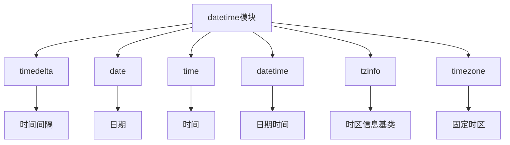

# Python标准库-datetime模块完全参考手册

## 概述

`datetime` 模块是Python标准库中用于处理日期和时间的核心模块，提供了日期和时间的操作、格式化、计算等功能。该模块支持时区感知的日期时间对象，并提供了丰富的类和方法来处理各种日期时间需求。

datetime模块的核心功能包括：
- 日期和时间的创建与操作
- 日期时间的格式化和解析
- 时间间隔和持续时间计算
- 时区支持和时间转换
- 日期时间的比较和运算



## 模块常量

### datetime.UTC

UTC时区的别名，等同于 `datetime.timezone.utc`：

```python
from datetime import UTC

print(UTC)  # UTC
```

## timedelta类

`timedelta` 对象表示持续时间，即两个 `date` 或 `datetime` 实例之间的差值。

### 构造函数

```python
datetime.timedelta(days=0, seconds=0, microseconds=0, milliseconds=0, minutes=0, hours=0, weeks=0)
```

所有参数都是可选的，默认为0。参数可以是整数或浮点数，可以是正数或负数。

```python
from datetime import timedelta

# 基本使用
delta = timedelta(days=5, hours=3, minutes=30)
print(delta)  # 5 days, 3:30:00

# 使用负数
delta = timedelta(days=-2)
print(delta)  # -2 days, 0:00:00

# 使用浮点数
delta = timedelta(hours=2.5)
print(delta)  # 2:30:00
```

### 类属性

#### timedelta.max

最大可能的 `timedelta` 对象：

```python
from datetime import timedelta

print(timedelta.max)  # 999999999 days, 23:59:59.999999
```

#### timedelta.resolution

非相等 `timedelta` 对象之间最小的可能差异：

```python
from datetime import timedelta

print(timedelta.resolution)  # 0:00:00.000001
```

### 实例属性

#### days

天数，范围在 -999,999,999 到 999,999,999 之间：

```python
from datetime import timedelta

delta = timedelta(days=5, hours=3)
print(delta.days)  # 5
```

#### seconds

秒数，范围在 0 到 86,399 之间：

```python
from datetime import timedelta

delta = timedelta(days=1, hours=2, minutes=30)
print(delta.seconds)  # 9000 (2小时30分钟 = 9000秒)
```

#### microseconds

微秒数，范围在 0 到 999,999 之间：

```python
from datetime import timedelta

delta = timedelta(microseconds=123456)
print(delta.microseconds)  # 123456
```

### 实例方法

#### total_seconds()

返回持续时间中的总秒数：

```python
from datetime import timedelta

delta = timedelta(hours=2, minutes=30)
print(delta.total_seconds())  # 9000.0

delta = timedelta(days=1)
print(delta.total_seconds())  # 86400.0
```

### 支持的操作

```python
from datetime import timedelta

# 加法
delta1 = timedelta(days=1)
delta2 = timedelta(hours=12)
result = delta1 + delta2
print(result)  # 1 day, 12:00:00

# 减法
result = delta1 - delta2
print(result)  # 12:00:00

# 乘法
result = delta1 * 3
print(result)  # 3 days, 0:00:00

# 除法
result = delta1 / 2
print(result)  # 12:00:00

# 绝对值
delta = timedelta(days=-2)
print(abs(delta))  # 2 days, 0:00:00

# 字符串表示
delta = timedelta(days=1, hours=2, minutes=30)
print(str(delta))  # 1 day, 2:30:00
```

## date类

`date` 对象表示理想化历法中的日期（年、月、日）。

### 构造函数

```python
datetime.date(year, month, day)
```

所有参数都是必需的，必须是整数。

```python
from datetime import date

# 创建日期
d = date(2024, 1, 15)
print(d)  # 2024-01-15
```

### 类方法

#### today()

返回当前本地日期：

```python
from datetime import date

today = date.today()
print(today)  # 2024-01-15 (示例)
```

#### fromtimestamp(timestamp)

返回对应于POSIX时间戳的本地日期：

```python
from datetime import date
import time

timestamp = time.time()
d = date.fromtimestamp(timestamp)
print(d)  # 当前日期
```

#### fromordinal(ordinal)

返回对应于公历序数的日期：

```python
from datetime import date

d = date.fromordinal(730920)
print(d)  # 2002-03-11
```

#### fromisoformat(date_string)

从ISO格式字符串创建日期：

```python
from datetime import date

d = date.fromisoformat('2024-01-15')
print(d)  # 2024-01-15
```

#### fromisocalendar(year, week, day)

从ISO日历日期创建日期：

```python
from datetime import date

d = date.fromisocalendar(2024, 3, 1)  # 2024年第3周第1天
print(d)  # 2024-01-15
```

#### strptime(date_string, format)

根据格式字符串解析日期：

```python
from datetime import date

d = date.strptime('2024-01-15', '%Y-%m-%d')
print(d)  # 2024-01-15
```

### 类属性

#### min

最早可表示的日期：

```python
from datetime import date

print(date.min)  # 0001-01-01
```

#### max

最晚可表示的日期：

```python
from datetime import date

print(date.max)  # 9999-12-31
```

#### resolution

非相等日期对象之间最小的可能差异：

```python
from datetime import date

print(date.resolution)  # 1 day, 0:00:00
```

### 实例属性

#### year

年份：

```python
from datetime import date

d = date(2024, 1, 15)
print(d.year)  # 2024
```

#### month

月份：

```python
from datetime import date

d = date(2024, 1, 15)
print(d.month)  # 1
```

#### day

日：

```python
from datetime import date

d = date(2024, 1, 15)
print(d.day)  # 15
```

### 实例方法

#### replace(year=self.year, month=self.month, day=self.day)

返回一个具有相同值的新日期对象，但更新了指定的参数：

```python
from datetime import date

d = date(2024, 1, 15)
new_d = d.replace(day=20)
print(new_d)  # 2024-01-20
```

#### timetuple()

返回 `time.struct_time`：

```python
from datetime import date

d = date(2024, 1, 15)
print(d.timetuple())  # time.struct_time(tm_year=2024, tm_mon=1, tm_mday=15, ...)
```

#### toordinal()

返回公历序数：

```python
from datetime import date

d = date(2024, 1, 15)
print(d.toordinal())  # 738887
```

#### weekday()

返回星期几，其中Monday是0，Sunday是6：

```python
from datetime import date

d = date(2024, 1, 15)
print(d.weekday())  # 0 (Monday)
```

#### isoweekday()

返回星期几，其中Monday是1，Sunday是7：

```python
from datetime import date

d = date(2024, 1, 15)
print(d.isoweekday())  # 1 (Monday)
```

#### isocalendar()

返回包含ISO日历日期的命名元组：

```python
from datetime import date

d = date(2024, 1, 15)
iso = d.isocalendar()
print(iso)  # datetime.IsoCalendarDate(year=2024, week=3, weekday=1)
```

#### isoformat()

返回ISO 8601格式的字符串：

```python
from datetime import date

d = date(2024, 1, 15)
print(d.isoformat())  # 2024-01-15
```

#### ctime()

返回表示日期的字符串：

```python
from datetime import date

d = date(2024, 1, 15)
print(d.ctime())  # Mon Jan 15 00:00:00 2024
```

#### strftime(format)

根据格式字符串返回表示日期的字符串：

```python
from datetime import date

d = date(2024, 1, 15)
print(d.strftime('%Y-%m-%d'))  # 2024-01-15
print(d.strftime('%A, %B %d, %Y'))  # Monday, January 15, 2024
```

### 支持的操作

```python
from datetime import date, timedelta

# 加法（与timedelta）
d = date(2024, 1, 15)
delta = timedelta(days=7)
result = d + delta
print(result)  # 2024-01-22

# 减法（与timedelta）
result = d - delta
print(result)  # 2024-01-08

# 减法（与date）
d1 = date(2024, 1, 15)
d2 = date(2024, 1, 10)
result = d1 - d2
print(result)  # 5 days, 0:00:00

# 比较
d1 = date(2024, 1, 15)
d2 = date(2024, 1, 20)
print(d1 < d2)  # True
print(d1 == d2)  # False
```

## time类

`time` 对象表示理想化时间，独立于任何特定日期。

### 构造函数

```python
datetime.time(hour=0, minute=0, second=0, microsecond=0, tzinfo=None, fold=0)
```

```python
from datetime import time

# 创建时间
t = time(14, 30, 45)
print(t)  # 14:30:45

# 带微秒的时间
t = time(14, 30, 45, 123456)
print(t)  # 14:30:45.123456

# 带时区的时间
from datetime import timezone
t = time(14, 30, 45, tzinfo=timezone.utc)
print(t)  # 14:30:45+00:00
```

### 实例属性

#### hour

小时数（0-23）：

```python
from datetime import time

t = time(14, 30, 45)
print(t.hour)  # 14
```

#### minute

分钟数（0-59）：

```python
from datetime import time

t = time(14, 30, 45)
print(t.minute)  # 30
```

#### second

秒数（0-59）：

```python
from datetime import time

t = time(14, 30, 45)
print(t.second)  # 45
```

#### microsecond

微秒数（0-999999）：

```python
from datetime import time

t = time(14, 30, 45, 123456)
print(t.microsecond)  # 123456
```

#### tzinfo

时区信息：

```python
from datetime import time, timezone

t = time(14, 30, 45, tzinfo=timezone.utc)
print(t.tzinfo)  # UTC
```

### 实例方法

#### replace()

返回具有相同值的新时间对象：

```python
from datetime import time

t = time(14, 30, 45)
new_t = t.replace(hour=15)
print(new_t)  # 15:30:45
```

#### isoformat()

返回ISO格式的字符串：

```python
from datetime import time

t = time(14, 30, 45)
print(t.isoformat())  # 14:30:45

# 带时区的时间
from datetime import timezone
t = time(14, 30, 45, tzinfo=timezone.utc)
print(t.isoformat())  # 14:30:45+00:00
```

#### strftime(format)

根据格式字符串返回表示时间的字符串：

```python
from datetime import time

t = time(14, 30, 45)
print(t.strftime('%H:%M:%S'))  # 14:30:45
print(t.strftime('%I:%M %p'))  # 02:30 PM
```

## datetime类

`datetime` 对象是包含 `date` 对象和 `time` 对象所有信息的单个对象。

### 构造函数

```python
datetime.datetime(year, month, day, hour=0, minute=0, second=0, microsecond=0, tzinfo=None, *, fold=0)
```

```python
from datetime import datetime

# 创建datetime对象
dt = datetime(2024, 1, 15, 14, 30, 45)
print(dt)  # 2024-01-15 14:30:45

# 带时区的datetime对象
from datetime import timezone
dt = datetime(2024, 1, 15, 14, 30, 45, tzinfo=timezone.utc)
print(dt)  # 2024-01-15 14:30:45+00:00
```

### 类方法

#### today()

返回当前本地日期和时间：

```python
from datetime import datetime

dt = datetime.today()
print(dt)  # 2024-01-15 14:30:45.123456 (示例)
```

#### now(tz=None)

返回当前本地日期和时间：

```python
from datetime import datetime, timezone

# 本地时间
dt = datetime.now()
print(dt)  # 2024-01-15 14:30:45.123456 (示例)

# UTC时间
dt = datetime.now(timezone.utc)
print(dt)  # 2024-01-15 06:30:45.123456+00:00 (示例)
```

#### utcnow()

返回当前UTC日期和时间（已弃用）：

```python
from datetime import datetime

# 不推荐使用
dt = datetime.utcnow()
print(dt)  # 2024-01-15 06:30:45.123456 (示例)

# 推荐使用
dt = datetime.now(timezone.utc)
print(dt)  # 2024-01-15 06:30:45.123456+00:00 (示例)
```

#### fromtimestamp(timestamp, tz=None)

从时间戳创建datetime对象：

```python
from datetime import datetime
import time

timestamp = time.time()
dt = datetime.fromtimestamp(timestamp)
print(dt)  # 当前本地时间

# UTC时间
dt = datetime.fromtimestamp(timestamp, tz=timezone.utc)
print(dt)  # 当前UTC时间
```

#### fromordinal(ordinal)

从公历序数创建datetime对象：

```python
from datetime import datetime

dt = datetime.fromordinal(730920)
print(dt)  # 2002-03-11 00:00:00
```

#### combine(date, time, tzinfo=time.tzinfo)

组合date和time对象：

```python
from datetime import datetime, date, time

d = date(2024, 1, 15)
t = time(14, 30, 45)
dt = datetime.combine(d, t)
print(dt)  # 2024-01-15 14:30:45
```

#### fromisoformat(date_string)

从ISO格式字符串创建datetime对象：

```python
from datetime import datetime

dt = datetime.fromisoformat('2024-01-15T14:30:45')
print(dt)  # 2024-01-15 14:30:45

# 带时区
dt = datetime.fromisoformat('2024-01-15T14:30:45+00:00')
print(dt)  # 2024-01-15 14:30:45+00:00
```

#### strptime(date_string, format)

根据格式字符串解析datetime：

```python
from datetime import datetime

dt = datetime.strptime('2024-01-15 14:30:45', '%Y-%m-%d %H:%M:%S')
print(dt)  # 2024-01-15 14:30:45
```

### 实例属性

#### year, month, day, hour, minute, second, microsecond

各时间分量：

```python
from datetime import datetime

dt = datetime(2024, 1, 15, 14, 30, 45, 123456)
print(dt.year)  # 2024
print(dt.month)  # 1
print(dt.day)  # 15
print(dt.hour)  # 14
print(dt.minute)  # 30
print(dt.second)  # 45
print(dt.microsecond)  # 123456
```

#### tzinfo

时区信息：

```python
from datetime import datetime, timezone

dt = datetime(2024, 1, 15, 14, 30, 45, tzinfo=timezone.utc)
print(dt.tzinfo)  # UTC
```

### 实例方法

#### date()

返回date部分：

```python
from datetime import datetime

dt = datetime(2024, 1, 15, 14, 30, 45)
d = dt.date()
print(d)  # 2024-01-15
```

#### time()

返回time部分：

```python
from datetime import datetime

dt = datetime(2024, 1, 15, 14, 30, 45)
t = dt.time()
print(t)  # 14:30:45
```

#### replace()

返回具有相同值的新datetime对象：

```python
from datetime import datetime

dt = datetime(2024, 1, 15, 14, 30, 45)
new_dt = dt.replace(hour=15)
print(new_dt)  # 2024-01-15 15:30:45
```

#### astimezone(tz)

转换为指定时区：

```python
from datetime import datetime, timezone, timedelta

# 创建时区
eastern = timezone(timedelta(hours=-5))

dt = datetime(2024, 1, 15, 14, 30, 45, tzinfo=timezone.utc)
eastern_dt = dt.astimezone(eastern)
print(eastern_dt)  # 2024-01-15 09:30:45-05:00
```

#### utcoffset()

返回时区偏移量：

```python
from datetime import datetime, timezone, timedelta

tz = timezone(timedelta(hours=-5))
dt = datetime(2024, 1, 15, 14, 30, 45, tzinfo=tz)
print(dt.utcoffset())  # -1 day, 19:00:00
```

#### tzname()

返回时区名称：

```python
from datetime import datetime, timezone

dt = datetime(2024, 1, 15, 14, 30, 45, tzinfo=timezone.utc)
print(dt.tzname())  # UTC
```

#### timestamp()

返回POSIX时间戳：

```python
from datetime import datetime, timezone

dt = datetime(2024, 1, 15, 14, 30, 45, tzinfo=timezone.utc)
print(dt.timestamp())  # 1705318645.0 (示例)
```

#### weekday(), isoweekday(), isocalendar()

与date类相同的方法：

```python
from datetime import datetime

dt = datetime(2024, 1, 15, 14, 30, 45)
print(dt.weekday())  # 0 (Monday)
print(dt.isoweekday())  # 1 (Monday)
print(dt.isocalendar())  # datetime.IsoCalendarDate(year=2024, week=3, weekday=1)
```

#### isoformat()

返回ISO格式的字符串：

```python
from datetime import datetime

dt = datetime(2024, 1, 15, 14, 30, 45)
print(dt.isoformat())  # 2024-01-15T14:30:45
```

#### ctime()

返回表示datetime的字符串：

```python
from datetime import datetime

dt = datetime(2024, 1, 15, 14, 30, 45)
print(dt.ctime())  # Mon Jan 15 14:30:45 2024
```

#### strftime(format)

根据格式字符串返回表示datetime的字符串：

```python
from datetime import datetime

dt = datetime(2024, 1, 15, 14, 30, 45)
print(dt.strftime('%Y-%m-%d %H:%M:%S'))  # 2024-01-15 14:30:45
print(dt.strftime('%A, %B %d, %Y at %I:%M %p'))  # Monday, January 15, 2024 at 02:30 PM
```

### 支持的操作

```python
from datetime import datetime, timedelta

# 加法（与timedelta）
dt = datetime(2024, 1, 15, 14, 30, 45)
delta = timedelta(days=7, hours=3)
result = dt + delta
print(result)  # 2024-01-22 17:30:45

# 减法（与timedelta）
result = dt - delta
print(result)  # 2024-01-08 11:30:45

# 减法（与datetime）
dt1 = datetime(2024, 1, 15, 14, 30, 45)
dt2 = datetime(2024, 1, 10, 10, 15, 30)
result = dt1 - dt2
print(result)  # 5 days, 4:15:15

# 比较
dt1 = datetime(2024, 1, 15, 14, 30, 45)
dt2 = datetime(2024, 1, 20, 10, 15, 30)
print(dt1 < dt2)  # True
print(dt1 == dt2)  # False
```

## timezone类

`timezone` 类实现了 `tzinfo` 抽象基类，作为UTC的固定偏移量。

### 构造函数

```python
datetime.timezone(offset, name=None)
```

```python
from datetime import timezone, timedelta

# 创建时区
tz = timezone(timedelta(hours=-5))
print(tz)  # UTC-05:00

# 带名称的时区
tz = timezone(timedelta(hours=-5), "EST")
print(tz)  # EST
```

### 类属性

#### utc

UTC时区：

```python
from datetime import timezone, UTC

print(timezone.utc)  # UTC
print(UTC)  # UTC
```

### 实例方法

#### utcoffset(dt)

返回时区偏移量：

```python
from datetime import timezone, timedelta, datetime

tz = timezone(timedelta(hours=-5))
dt = datetime(2024, 1, 15, 14, 30, 45, tzinfo=tz)
print(tz.utcoffset(dt))  # -1 day, 19:00:00
```

#### tzname(dt)

返回时区名称：

```python
from datetime import timezone, timedelta, datetime

tz = timezone(timedelta(hours=-5), "EST")
dt = datetime(2024, 1, 15, 14, 30, 45, tzinfo=tz)
print(tz.tzname(dt))  # EST
```

## 实战应用

### 1. 计算日期差

```python
from datetime import datetime, date

# 计算两个日期之间的天数
date1 = date(2024, 1, 15)
date2 = date(2024, 1, 20)
delta = date2 - date1
print(f"相差天数: {delta.days}")  # 相差天数: 5

# 计算年龄
birth_date = date(1990, 6, 15)
today = date.today()
age = today.year - birth_date.year

# 检查是否已经过了生日
if (today.month, today.day) < (birth_date.month, birth_date.day):
    age -= 1

print(f"年龄: {age}岁")
```

### 2. 日期时间格式化

```python
from datetime import datetime

# 当前时间
now = datetime.now()

# 各种格式
formats = {
    '标准格式': now.strftime('%Y-%m-%d %H:%M:%S'),
    '中文格式': now.strftime('%Y年%m月%d日 %H时%M分%S秒'),
    '短格式': now.strftime('%Y/%m/%d'),
    '星期': now.strftime('%A'),
    '英文格式': now.strftime('%B %d, %Y %I:%M %p'),
    'ISO格式': now.isoformat(),
}

for name, formatted in formats.items():
    print(f"{name}: {formatted}")
```

### 3. 时间段计算

```python
from datetime import datetime, timedelta

# 计算未来或过去的日期
today = datetime.now()

# 未来7天
future_7_days = today + timedelta(days=7)
print(f"7天后: {future_7_days.strftime('%Y-%m-%d')}")

# 过去30天
past_30_days = today - timedelta(days=30)
print(f"30天前: {past_30_days.strftime('%Y-%m-%d')}")

# 工作日计算（简单版本）
def add_workdays(start_date, days):
    """添加工作日"""
    current_date = start_date
    while days > 0:
        current_date += timedelta(days=1)
        if current_date.weekday() < 5:  # Monday=0, Friday=4
            days -= 1
    return current_date

result = add_workdays(datetime.now(), 10)
print(f"10个工作日后: {result.strftime('%Y-%m-%d')}")
```

### 4. 时区转换

```python
from datetime import datetime, timezone, timedelta

# 创建不同时区
utc = timezone.utc
eastern = timezone(timedelta(hours=-5))
pacific = timezone(timedelta(hours=-8))

# UTC时间
utc_time = datetime.now(utc)
print(f"UTC时间: {utc_time.strftime('%Y-%m-%d %H:%M:%S %Z')}")

# 转换为东部时间
eastern_time = utc_time.astimezone(eastern)
print(f"东部时间: {eastern_time.strftime('%Y-%m-%d %H:%M:%S %Z')}")

# 转换为太平洋时间
pacific_time = utc_time.astimezone(pacific)
print(f"太平洋时间: {pacific_time.strftime('%Y-%m-%d %H:%M:%S %Z')}")
```

### 5. 日期解析

```python
from datetime import datetime

# 解析各种格式的日期
date_strings = [
    "2024-01-15",
    "15/01/2024",
    "January 15, 2024",
    "20240115"
]

formats = [
    "%Y-%m-%d",
    "%d/%m/%Y",
    "%B %d, %Y",
    "%Y%m%d"
]

for date_str, fmt in zip(date_strings, formats):
    try:
        parsed = datetime.strptime(date_str, fmt)
        print(f"解析 '{date_str}' -> {parsed.strftime('%Y-%m-%d')}")
    except ValueError as e:
        print(f"无法解析 '{date_str}': {e}")
```

### 6. 日期验证

```python
from datetime import datetime

def validate_date(date_str, date_format='%Y-%m-%d'):
    """验证日期格式"""
    try:
        datetime.strptime(date_str, date_format)
        return True
    except ValueError:
        return False

# 测试
test_dates = [
    "2024-01-15",  # 有效
    "2024-02-30",  # 无效（2月没有30日）
    "2024-13-01",  # 无效（月份超出范围）
    "2024-01-32",  # 无效（日期超出范围）
    "invalid-date"  # 无效格式
]

for date_str in test_dates:
    is_valid = validate_date(date_str)
    print(f"'{date_str}': {'有效' if is_valid else '无效'}")
```

### 7. 日期范围生成

```python
from datetime import datetime, timedelta

def date_range(start, end, step=timedelta(days=1)):
    """生成日期范围"""
    current = start
    while current <= end:
        yield current
        current += step

# 使用示例
start_date = datetime(2024, 1, 1)
end_date = datetime(2024, 1, 7)

for date in date_range(start_date, end_date):
    print(date.strftime('%Y-%m-%d (%A)'))

# 输出:
# 2024-01-01 (Monday)
# 2024-01-02 (Tuesday)
# 2024-01-03 (Wednesday)
# 2024-01-04 (Thursday)
# 2024-01-05 (Friday)
# 2024-01-06 (Saturday)
# 2024-01-07 (Sunday)
```

### 8. 时间段统计

```python
from datetime import datetime, timedelta

class TimeTracker:
    """时间跟踪器"""

    def __init__(self):
        self.intervals = []

    def start(self):
        """开始计时"""
        self.start_time = datetime.now()

    def stop(self, description=""):
        """停止计时"""
        if hasattr(self, 'start_time'):
            end_time = datetime.now()
            duration = end_time - self.start_time
            self.intervals.append({
                'description': description,
                'start': self.start_time,
                'end': end_time,
                'duration': duration
            })
            return duration
        return None

    def get_total_duration(self):
        """获取总持续时间"""
        total = sum((interval['duration'] for interval in self.intervals), timedelta())
        return total

    def print_report(self):
        """打印报告"""
        print("时间跟踪报告:")
        print("-" * 50)

        for i, interval in enumerate(self.intervals, 1):
            print(f"{i}. {interval['description']}")
            print(f"   开始: {interval['start'].strftime('%H:%M:%S')}")
            print(f"   结束: {interval['end'].strftime('%H:%M:%S')}")
            print(f"   持续时间: {interval['duration']}")

        print("-" * 50)
        print(f"总计: {self.get_total_duration()}")

# 使用示例
tracker = TimeTracker()

tracker.start()
# 执行一些任务...
import time
time.sleep(1)  # 模拟工作
tracker.stop("任务1")

tracker.start()
time.sleep(2)  # 模拟工作
tracker.stop("任务2")

tracker.print_report()
```

## 性能优化

### 1. 避免重复创建对象

```python
from datetime import datetime, timedelta

# 不好的做法
def process_date_bad():
    for i in range(1000):
        now = datetime.now()  # 每次都创建新对象
        # 处理日期...

# 好的做法
def process_date_good():
    now = datetime.now()  # 只创建一次
    for i in range(1000):
        # 使用相同的now对象
        # 处理日期...
```

### 2. 使用date而不是datetime（如果只需要日期）

```python
from datetime import datetime, date

# 不好的做法（如果只需要日期）
def process_dates_bad(dates):
    return [d.strftime('%Y-%m-%d') for d in dates]  # 使用datetime

# 好的做法
def process_dates_good(dates):
    return [d.isoformat() for d in dates]  # 使用date
```

## 最佳实践

### 1. 使用时区感知的datetime对象

```python
from datetime import datetime, timezone

# 不好的做法（朴素时间）
dt = datetime.now()

# 好的做法（时区感知）
dt = datetime.now(timezone.utc)
```

### 2. 使用ISO格式进行存储和传输

```python
from datetime import datetime

# 存储为ISO格式
dt = datetime.now()
iso_string = dt.isoformat()

# 从ISO格式解析
parsed_dt = datetime.fromisoformat(iso_string)
```

### 3. 使用timedelta进行时间计算

```python
from datetime import datetime, timedelta

# 不好的做法（手动计算）
dt = datetime(2024, 1, 15)
future = datetime(dt.year, dt.month, dt.day + 7)  # 可能出错

# 好的做法（使用timedelta）
dt = datetime(2024, 1, 15)
future = dt + timedelta(days=7)
```

## 常见问题

### Q1: date和datetime有什么区别？

**A**: `date` 只表示日期（年、月、日），而 `datetime` 表示日期和时间（年、月、日、时、分、秒、微秒）。如果只需要日期，使用 `date` 更合适。

### Q2: 什么是朴素时间和时区感知时间？

**A**: 朴素时间（naive）不包含时区信息，而时区感知时间（aware）包含时区信息。对于需要跨时区的应用，应该使用时区感知时间。

### Q3: 如何处理夏令时？

**A**: 使用时区感知的datetime对象，并使用 `zoneinfo` 模块来正确处理夏令时。

`datetime` 模块是Python中处理日期和时间的强大工具，提供了：

1. **丰富的类**: timedelta、date、time、datetime、timezone
2. **灵活的操作**: 日期时间计算、比较、转换
3. **完整的格式化**: 支持各种日期时间格式的输出和解析
4. **时区支持**: 处理跨时区的日期时间问题
5. **精确的时间**: 支持微秒级精度

通过掌握 `datetime` 模块，您可以：
- 处理各种日期时间计算
- 格式化和解析日期时间字符串
- 处理时区转换问题
- 实现时间跟踪和统计
- 验证和处理日期输入

`datetime` 模块是Python中最常用的模块之一，掌握它对于任何需要处理日期和时间的应用都至关重要。