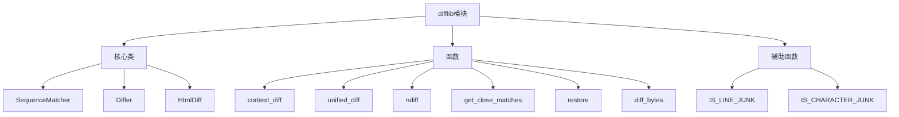

# Python标准库-difflib模块完全参考手册

## 概述

`difflib` 模块是Python标准库中用于比较序列差异的核心模块，提供了计算序列之间差异的类和函数。该模块可以用于比较文件、文本等，并生成各种格式的差异信息，包括HTML格式、上下文差异和统一差异格式。

difflib模块的核心功能包括：
- 比较任意类型的序列差异
- 生成人类可读的差异报告
- 支持多种差异格式（HTML、context、unified）
- 提供序列相似度计算
- 支持文件和目录比较



## SequenceMatcher类

`SequenceMatcher` 是一个灵活的类，用于比较任意类型的序列对，只要序列元素是可哈希的。

### 构造函数

```python
class difflib.SequenceMatcher(isjunk=None, a='', b='', autojunk=True)
```

参数说明：
- `isjunk`: 可选参数，必须为 `None` 或一个单参数函数，用于判断元素是否为"垃圾"（junk）
- `a`, `b`: 要比较的两个序列，默认为空字符串
- `autojunk`: 可选参数，是否启用自动垃圾启发式算法，默认为 `True`

```python
import difflib

# 基本使用
s = difflib.SequenceMatcher(None, "apple", "apricot")
print(f"相似度: {s.ratio():.3f}")  # 相似度: 0.533

# 使用垃圾过滤
# 将空格视为垃圾，不参与匹配
s = difflib.SequenceMatcher(lambda x: x == " ", "a b c", "abc")
print(f"相似度: {s.ratio():.3f}")  # 相似度: 1.000

# 禁用自动垃圾启发式
s = difflib.SequenceMatcher(None, "a" * 300 + "b", "a" * 200 + "b", autojunk=False)
```

### 主要方法

#### 1. set_seqs(a, b)

设置要比较的两个序列：

```python
import difflib

s = difflib.SequenceMatcher()
s.set_seqs("hello", "hello world")
print(s.ratio())  # 0.7142857142857143
```

#### 2. set_seq1(a)

设置第一个要比较的序列：

```python
import difflib

s = difflib.SequenceMatcher(None, "", "hello world")
s.set_seq1("hello")
print(s.ratio())  # 0.7142857142857143
```

#### 3. set_seq2(b)

设置第二个要比较的序列：

```python
import difflib

s = difflib.SequenceMatcher(None, "hello", "")
s.set_seq2("hello world")
print(s.ratio())  # 0.7142857142857143
```

#### 4. find_longest_match(alo=0, ahi=None, blo=0, bhi=None)

在指定范围内查找最长的匹配块：

```python
import difflib

s = difflib.SequenceMatcher(None, " abcd", "abcd abcd")
match = s.find_longest_match(0, 5, 0, 9)
print(f"Match: a[{match.a}:{match.a + match.size}] == b[{match.b}:{match.b + match.size}]")
# Match: a[0:5] == b[4:9]

# 使用垃圾过滤
s = difflib.SequenceMatcher(lambda x: x == " ", " abcd", "abcd abcd")
match = s.find_longest_match(0, 5, 0, 9)
print(f"Match: a[{match.a}:{match.a + match.size}] == b[{match.b}:{match.b + match.size}]")
# Match: a[1:5] == b[0:4]
```

#### 5. get_matching_blocks()

返回描述非重叠匹配子序列的三元组列表：

```python
import difflib

s = difflib.SequenceMatcher(None, "abxcd", "abcd")
blocks = s.get_matching_blocks()

for block in blocks:
    print(f"a[{block.a}:{block.a + block.size}] == b[{block.b}:{block.b + block.size}]")

# 输出:
# a[0:2] == b[0:2]
# a[3:5] == b[2:4]
# a[5:5] == b[4:4]  # 最后一个总是虚拟块
```

#### 6. get_opcodes()

返回描述如何将序列a转换为序列b的5元组列表：

```python
import difflib

a = "qabxcd"
b = "abycdf"
s = difflib.SequenceMatcher(None, a, b)

opcodes = s.get_opcodes()
for tag, i1, i2, j1, j2 in opcodes:
    print(f"{tag:7} a[{i1}:{i2}] --> b[{j1}:{j2}] {a[i1:i2]!r:>8} --> {b[j1:j2]!r}")

# 输出:
# delete a[0:1] --> b[0:0]     'q' --> ''
# equal  a[1:3] --> b[0:2]    'ab' --> 'ab'
# replace a[3:4] --> b[2:3]     'x' --> 'y'
# equal  a[4:6] --> b[3:5]    'cd' --> 'cd'
# insert a[6:6] --> b[5:6]      '' --> 'f'
```

操作码类型：
- `'replace'`: `a[i1:i2]` 应该被 `b[j1:j2]` 替换
- `'delete'`: `a[i1:i2]` 应该被删除
- `'insert'`: `b[j1:j2]` 应该被插入到 `a[i1:i1]`
- `'equal'`: `a[i1:i2]` 等于 `b[j1:j2]`

#### 7. get_grouped_opcodes(n=3)

返回分组操作码，最多包含n行上下文：

```python
import difflib

a = ["line1\n", "line2\n", "line3\n", "line4\n", "line5\n"]
b = ["line1\n", "modified\n", "line3\n", "line4\n", "line5\n"]

s = difflib.SequenceMatcher(None, a, b)
groups = list(s.get_grouped_opcodes(n=1))

for group in groups:
    for tag, i1, i2, j1, j2 in group:
        print(f"{tag:7} a[{i1}:{i2}] --> b[{j1}:{j2}]")
    print("---")
```

#### 8. ratio()

返回序列相似度的度量值，范围在[0, 1]之间：

```python
import difflib

# 完全相同
s = difflib.SequenceMatcher(None, "hello", "hello")
print(s.ratio())  # 1.0

# 完全不同
s = difflib.SequenceMatcher(None, "hello", "world")
print(s.ratio())  # 0.0

# 部分相似
s = difflib.SequenceMatcher(None, "hello", "hallo")
print(s.ratio())  # 0.8

# 计算公式: 2.0 * M / T
# M = 匹配元素数量
# T = 两个序列中元素总数
```

#### 9. quick_ratio()

快速计算相似度上限：

```python
import difflib

s = difflib.SequenceMatcher(None, "abcd", "bcde")
print(f"ratio(): {s.ratio()}")
print(f"quick_ratio(): {s.quick_ratio()}")
print(f"real_quick_ratio(): {s.real_quick_ratio()}")
```

#### 10. real_quick_ratio()

快速计算相似度上限（更快但更不精确）：

```python
import difflib

s = difflib.SequenceMatcher(None, "abcd", "bcde")
print(f"real_quick_ratio(): {s.real_quick_ratio()}")
```

### SequenceMatcher应用示例

#### 1. 代码相似度检测

```python
import difflib

def code_similarity(code1, code2):
    """计算代码相似度"""
    s = difflib.SequenceMatcher(None, code1, code2)
    return s.ratio()

code1 = """
def add(a, b):
    return a + b
"""

code2 = """
def add(a, b):
    return a + b
"""

code3 = """
def subtract(a, b):
    return a - b
"""

print(f"Code1 vs Code2: {code_similarity(code1, code2):.3f}")
print(f"Code1 vs Code3: {code_similarity(code1, code3):.3f}")
```

#### 2. 拼写检查

```python
import difflib

def suggest_corrections(word, dictionary, n=3, cutoff=0.6):
    """建议拼写纠正"""
    return difflib.get_close_matches(word, dictionary, n=n, cutoff=cutoff)

dictionary = ["apple", "banana", "orange", "grape", "peach"]
word = "aple"

suggestions = suggest_corrections(word, dictionary)
print(f"Did you mean: {', '.join(suggestions)}?")  # Did you mean: apple?
```

## Differ类

`Differ` 类用于比较文本行序列，并生成人类可读的差异或增量。

### 构造函数

```python
class difflib.Differ(linejunk=None, charjunk=None)
```

参数说明：
- `linejunk`: 可选参数，用于过滤垃圾行的函数
- `charjunk`: 可选参数，用于过滤垃圾字符的函数

```python
import difflib

# 创建Differ对象
d = difflib.Differ()

# 使用垃圾过滤
def is_junk_line(line):
    return line.strip() == '' or line.strip().startswith('#')

d = difflib.Differ(linejunk=is_junk_line)
```

### 主要方法

#### 1. compare(a, b)

比较两个行序列，生成差异增量：

```python
import difflib

text1 = [
    "Beautiful is better than ugly.",
    "Explicit is better than implicit.",
    "Simple is better than complex.",
    "Complex is better than complicated."
]

text2 = [
    "Beautiful is better than ugly.",
    "Simple is better than complex.",
    "Complicated is better than complex.",
    "Flat is better than nested."
]

d = difflib.Differ()
result = d.compare(text1, text2)

for line in result:
    print(line)

# 输出:
#   Beautiful is better than ugly.
# - Explicit is better than implicit.
# - Simple is better than complex.
# + Simple is better than complex.
# ?     ++
# - Complex is better than complicated.
# ?            ^                     ---- ^
# + Complicated is better than complex.
# ?           ++++ ^                      ^
# + Flat is better than nested.
```

差异代码说明：
- `- `: 仅在序列1中出现的行
- `+ `: 仅在序列2中出现的行
- `  `: 两个序列共有的行
- `? `: 不在任一输入序列中的行（用于指示行内差异）

### Differ应用示例

#### 1. 文件比较

```python
import difflib

def compare_files(file1_path, file2_path):
    """比较两个文件"""
    with open(file1_path, 'r') as f1:
        lines1 = f1.readlines()

    with open(file2_path, 'r') as f2:
        lines2 = f2.readlines()

    d = difflib.Differ()
    diff = d.compare(lines1, lines2)

    print(''.join(diff))

# 使用示例（假设有两个文件）
# compare_files('file1.txt', 'file2.txt')
```

## HtmlDiff类

`HtmlDiff` 类用于创建HTML表格（或包含表格的完整HTML文件），显示文本的逐行比较。

### 构造函数

```python
class difflib.HtmlDiff(tabsize=8, wrapcolumn=None, linejunk=None, charjunk=IS_CHARACTER_JUNK)
```

参数说明：
- `tabsize`: 可选参数，制表符间距，默认为8
- `wrapcolumn`: 可选参数，换行列号，默认为None（不换行）
- `linejunk`: 可选参数，用于过滤垃圾行的函数
- `charjunk`: 可选参数，用于过滤垃圾字符的函数，默认为 `IS_CHARACTER_JUNK`

### 主要方法

#### 1. make_file(fromlines, tolines, fromdesc='', todesc='', context=False, numlines=5, **, charset='utf-8')

比较两个行列表，返回包含差异表格的完整HTML文件：

```python
import difflib

text1 = [
    "Beautiful is better than ugly.",
    "Explicit is better than implicit.",
    "Simple is better than complex."
]

text2 = [
    "Beautiful is better than ugly.",
    "Simple is better than complex.",
    "Flat is better than nested."
]

html_diff = difflib.HtmlDiff()
html = html_diff.make_file(text1, text2, fromdesc="Original", todesc="Modified")

# 保存到文件
with open('diff.html', 'w', encoding='utf-8') as f:
    f.write(html)
```

#### 2. make_table(fromlines, tolines, fromdesc='', todesc='', context=False, numlines=5)

比较两个行列表，返回HTML表格：

```python
import difflib

text1 = ["Line 1", "Line 2", "Line 3"]
text2 = ["Line 1", "Modified", "Line 3"]

html_diff = difflib.HtmlDiff()
table = html_diff.make_table(text1, text2, fromdesc="Original", todesc="Modified")

print(table)
```

### HtmlDiff应用示例

#### 1. 生成HTML差异报告

```python
import difflib
from datetime import datetime

def generate_html_diff(file1_path, file2_path, output_path):
    """生成HTML差异报告"""
    with open(file1_path, 'r', encoding='utf-8') as f1:
        lines1 = f1.readlines()

    with open(file2_path, 'r', encoding='utf-8') as f2:
        lines2 = f2.readlines()

    html_diff = difflib.HtmlDiff()

    html = html_diff.make_file(
        lines1,
        lines2,
        fromdesc=file1_path,
        todesc=file2_path,
        context=True,
        numlines=3
    )

    with open(output_path, 'w', encoding='utf-8') as f:
        f.write(html)

    print(f"HTML diff generated: {output_path}")

# 使用示例
# generate_html_diff('original.py', 'modified.py', 'diff.html')
```

## 函数

### 1. context_diff(a, b, fromfile='', tofile='', fromfiledate='', tofiledate='', n=3, lineterm='\n')

比较两个行列表，返回上下文差异格式的增量：

```python
import difflib

text1 = [
    "line1",
    "line2",
    "line3",
    "line4",
    "line5"
]

text2 = [
    "line1",
    "modified",
    "line3",
    "line4",
    "line5"
]

diff = difflib.context_diff(text1, text2, fromfile='original.txt', tofile='modified.txt')
print(''.join(diff))

# 输出:
# *** original.txt
# --- modified.txt
# ***************
# *** 1,5 ****
#  line1
# ! line2
#  line3
#  line4
#  line5
# --- 1,5 ----
#  line1
# ! modified
#  line3
#  line4
#  line5
```

### 2. unified_diff(a, b, fromfile='', tofile='', fromfiledate='', tofiledate='', n=3, lineterm='\n')

比较两个行列表，返回统一差异格式的增量：

```python
import difflib

text1 = [
    "line1",
    "line2",
    "line3",
    "line4",
    "line5"
]

text2 = [
    "line1",
    "modified",
    "line3",
    "line4",
    "line5"
]

diff = difflib.unified_diff(text1, text2, fromfile='original.txt', tofile='modified.txt')
print(''.join(diff))

# 输出:
# --- original.txt
# +++ modified.txt
# @@ -1,5 +1,5 @@
#  line1
# -line2
# +modified
#  line3
#  line4
#  line5
```

### 3. ndiff(a, b, linejunk=None, charjunk=IS_CHARACTER_JUNK)

比较两个行列表，返回 `Differ` 风格的增量：

```python
import difflib

text1 = [
    "line1",
    "line2",
    "line3"
]

text2 = [
    "line1",
    "modified",
    "line3"
]

diff = difflib.ndiff(text1, text2)
print(''.join(diff))

# 输出:
#   line1
# - line2
# ?  ^
# + modified
# ?  ++++
#   line3
```

### 4. get_close_matches(word, possibilities, n=3, cutoff=0.6)

返回最佳"足够好"的匹配列表：

```python
import difflib

word = "appel"
possibilities = ["ape", "apple", "peach", "puppy", "applet", "apply"]

matches = difflib.get_close_matches(word, possibilities, n=3, cutoff=0.6)
print(f"Close matches for '{word}': {matches}")
# Close matches for 'appel': ['apple', 'apply', 'applet']

# Python关键字匹配
import keyword
matches = difflib.get_close_matches("while", keyword.kwlist)
print(f"Close matches for 'while': {matches}")
# Close matches for 'while': ['while']
```

### 5. restore(sequence, which)

从增量中恢复生成增量的两个序列之一：

```python
import difflib

text1 = [
    "one",
    "two",
    "three"
]

text2 = [
    "ore",
    "tree",
    "emu"
]

diff = list(difflib.ndiff(text1, text2))

# 恢复第一个序列
restored1 = difflib.restore(diff, 1)
print(f"Restored sequence 1: {list(restored1)}")
# Restored sequence 1: ['one', 'two', 'three']

# 恢复第二个序列
restored2 = difflib.restore(diff, 2)
print(f"Restored sequence 2: {list(restored2)}")
# Restored sequence 2: ['ore', 'tree', 'emu']
```

### 6. diff_bytes(dfunc, a, b, fromfile=b'', tofile=b'', fromfiledate=b'', tofiledate=b'', n=3, lineterm=b'\n')

使用指定的差异函数比较bytes对象列表：

```python
import difflib

a = [b"line1\n", b"line2\n", b"line3\n"]
b = [b"line1\n", b"modified\n", b"line3\n"]

diff = difflib.diff_bytes(difflib.unified_diff, a, b, fromfile=b'original', tofile=b'modified')
print(b''.join(diff).decode('utf-8'))
```

## 辅助函数

### 1. IS_LINE_JUNK(line)

判断是否为可忽略的行：

```python
import difflib

print(difflib.IS_LINE_JUNK(""))          # True
print(difflib.IS_LINE_JUNK("# comment"))  # True
print(difflib.IS_LINE_JUNK("code"))      # False
```

### 2. IS_CHARACTER_JUNK(ch)

判断是否为可忽略的字符：

```python
import difflib

print(difflib.IS_CHARACTER_JUNK(" "))   # True
print(difflib.IS_CHARACTER_JUNK("\t"))  # True
print(difflib.IS_CHARACTER_JUNK("a"))   # False
```

## 实战应用

### 1. 文件差异比较工具

```python
import difflib
import argparse
from datetime import datetime, timezone
import os

def file_mtime(path):
    """获取文件修改时间"""
    t = datetime.fromtimestamp(os.stat(path).st_mtime, timezone.utc)
    return t.astimezone().isoformat()

def compare_files(file1, file2, output_format='unified', context_lines=3):
    """比较两个文件"""
    with open(file1, 'r', encoding='utf-8') as f:
        lines1 = f.readlines()

    with open(file2, 'r', encoding='utf-8') as f:
        lines2 = f.readlines()

    fromdate = file_mtime(file1)
    todate = file_mtime(file2)

    if output_format == 'context':
        diff = difflib.context_diff(
            lines1, lines2,
            fromfile=file1, tofile=file2,
            fromfiledate=fromdate, tofiledate=todate,
            n=context_lines
        )
    elif output_format == 'unified':
        diff = difflib.unified_diff(
            lines1, lines2,
            fromfile=file1, tofile=file2,
            fromfiledate=fromdate, tofiledate=todate,
            n=context_lines
        )
    elif output_format == 'html':
        html_diff = difflib.HtmlDiff()
        diff = html_diff.make_file(
            lines1, lines2,
            fromdesc=file1, todesc=file2,
            context=True, numlines=context_lines
        )
    else:  # ndiff
        diff = difflib.ndiff(lines1, lines2)

    print(''.join(diff))

# 使用示例
if __name__ == '__main__':
    parser = argparse.ArgumentParser(description='文件差异比较工具')
    parser.add_argument('file1', help='第一个文件')
    parser.add_argument('file2', help='第二个文件')
    parser.add_argument('-f', '--format', choices=['context', 'unified', 'html', 'ndiff'],
                        default='unified', help='输出格式')
    parser.add_argument('-n', '--lines', type=int, default=3,
                        help='上下文行数')

    args = parser.parse_args()
    compare_files(args.file1, args.file2, args.format, args.lines)
```

### 2. 代码相似度分析器

```python
import difflib
import os

class CodeSimilarityAnalyzer:
    """代码相似度分析器"""

    def __init__(self):
        self.files = {}

    def load_file(self, filepath):
        """加载文件"""
        with open(filepath, 'r', encoding='utf-8') as f:
            self.files[filepath] = f.read()

    def calculate_similarity(self, file1, file2):
        """计算两个文件的相似度"""
        code1 = self.files.get(file1)
        code2 = self.files.get(file2)

        if not code1 or not code2:
            return 0.0

        s = difflib.SequenceMatcher(None, code1, code2)
        return s.ratio()

    def find_similar_files(self, threshold=0.7):
        """查找相似的文件"""
        similar_pairs = []
        files = list(self.files.keys())

        for i in range(len(files)):
            for j in range(i + 1, len(files)):
                file1 = files[i]
                file2 = files[j]
                similarity = self.calculate_similarity(file1, file2)

                if similarity >= threshold:
                    similar_pairs.append({
                        'file1': file1,
                        'file2': file2,
                        'similarity': similarity
                    })

        return sorted(similar_pairs, key=lambda x: x['similarity'], reverse=True)

# 使用示例
analyzer = CodeSimilarityAnalyzer()

# 加载多个文件
analyzer.load_file('file1.py')
analyzer.load_file('file2.py')
analyzer.load_file('file3.py')

# 查找相似文件
similar = analyzer.find_similar_files(threshold=0.5)

for pair in similar:
    print(f"{pair['file1']} vs {pair['file2']}: {pair['similarity']:.2%}")
```

### 3. 拼写纠正建议

```python
import difflib

class SpellChecker:
    """拼写检查器"""

    def __init__(self, dictionary):
        self.dictionary = dictionary

    def suggest(self, word, n=3, cutoff=0.6):
        """建议纠正"""
        return difflib.get_close_matches(word, self.dictionary, n=n, cutoff=cutoff)

    def check(self, text):
        """检查文本中的拼写"""
        words = text.split()
        suggestions = {}

        for word in words:
            # 清理标点符号
            clean_word = ''.join(c for c in word if c.isalnum())
            if clean_word and clean_word not in self.dictionary:
                corrections = self.suggest(clean_word)
                if corrections:
                    suggestions[word] = corrections

        return suggestions

# 使用示例
dictionary = [
    "python", "programming", "language", "computer", "science",
    "algorithm", "data", "structure", "function", "variable",
    "class", "object", "method", "attribute", "import"
]

checker = SpellChecker(dictionary)

text = "I love pythn programing and algoritm"
suggestions = checker.check(text)

for word, corrections in suggestions.items():
    print(f"'{word}' -> {', '.join(corrections)}")
```

### 4. 版本控制系统差异查看器

```python
import difflib
from datetime import datetime

class VersionDiffViewer:
    """版本差异查看器"""

    def __init__(self):
        self.versions = {}

    def add_version(self, version_id, content):
        """添加版本"""
        self.versions[version_id] = content

    def compare_versions(self, version1, version2, format='unified'):
        """比较两个版本"""
        if version1 not in self.versions or version2 not in self.versions:
            raise ValueError("Version not found")

        lines1 = self.versions[version1].splitlines(keepends=True)
        lines2 = self.versions[version2].splitlines(keepends=True)

        if format == 'unified':
            diff = difflib.unified_diff(
                lines1, lines2,
                fromfile=f'Version {version1}',
                tofile=f'Version {version2}'
            )
        elif format == 'context':
            diff = difflib.context_diff(
                lines1, lines2,
                fromfile=f'Version {version1}',
                tofile=f'Version {version2}'
            )
        else:
            diff = difflib.ndiff(lines1, lines2)

        return ''.join(diff)

# 使用示例
viewer = VersionDiffViewer()

viewer.add_version('v1.0', """
def hello():
    print("Hello, World!")
""")

viewer.add_version('v2.0', """
def hello(name="World"):
    print(f"Hello, {name}!")
""")

diff = viewer.compare_versions('v1.0', 'v2.0', format='unified')
print(diff)
```

### 5. 文本去重工具

```python
import difflib

class TextDeduplicator:
    """文本去重工具"""

    def __init__(self, similarity_threshold=0.9):
        self.threshold = similarity_threshold

    def is_duplicate(self, text1, text2):
        """判断是否为重复"""
        s = difflib.SequenceMatcher(None, text1, text2)
        return s.ratio() >= self.threshold

    def deduplicate(self, texts):
        """去重"""
        unique_texts = []

        for text in texts:
            is_duplicate = False
            for unique in unique_texts:
                if self.is_duplicate(text, unique):
                    is_duplicate = True
                    break

            if not is_duplicate:
                unique_texts.append(text)

        return unique_texts

# 使用示例
texts = [
    "This is a sample text.",
    "This is a sample text.",  # 完全相同
    "This is an example text.",  # 相似
    "Completely different text.",
    "This is a sample text!"  # 几乎相同
]

deduplicator = TextDeduplicator(threshold=0.8)
unique = deduplicator.deduplicate(texts)

print(f"Original: {len(texts)}, Unique: {len(unique)}")
for i, text in enumerate(unique, 1):
    print(f"{i}. {text}")
```

## 性能优化

### 1. 重用SequenceMatcher对象

```python
import difflib
import time

# 不好的做法 - 每次都创建新对象
def compare_bad(base, targets):
    results = []
    for target in targets:
        s = difflib.SequenceMatcher(None, base, target)
        results.append(s.ratio())
    return results

# 好的做法 - 重用对象
def compare_good(base, targets):
    s = difflib.SequenceMatcher(None, base)
    results = []
    for target in targets:
        s.set_seq2(target)
        results.append(s.ratio())
    return results

# 性能测试
base = "a" * 1000
targets = ["a" * 1000 for _ in range(100)]

start = time.time()
results_bad = compare_bad(base, targets)
bad_time = time.time() - start

start = time.time()
results_good = compare_good(base, targets)
good_time = time.time() - start

print(f"Bad: {bad_time:.4f}s, Good: {good_time:.4f}s")
```

### 2. 使用垃圾过滤提高性能

```python
import difflib
import time

text1 = "a" * 1000 + " " * 1000 + "b" * 1000
text2 = "a" * 1000 + " " * 1000 + "c" * 1000

# 不使用垃圾过滤
start = time.time()
s1 = difflib.SequenceMatcher(None, text1, text2)
ratio1 = s1.ratio()
time1 = time.time() - start

# 使用垃圾过滤
start = time.time()
s2 = difflib.SequenceMatcher(lambda x: x == " ", text1, text2)
ratio2 = s2.ratio()
time2 = time.time() - start

print(f"Without junk filter: {time1:.6f}s, ratio: {ratio1:.3f}")
print(f"With junk filter: {time2:.6f}s, ratio: {ratio2:.3f}")
```

## 最佳实践

### 1. 选择合适的差异格式

```python
import difflib

# 上下文差异 - 适合人类阅读
diff = difflib.context_diff(lines1, lines2)

# 统一差异 - 适合版本控制系统
diff = difflib.unified_diff(lines1, lines2)

# ndiff - 详细显示行内差异
diff = difflib.ndiff(lines1, lines2)

# HTML - 适合Web显示
html_diff = difflib.HtmlDiff()
diff = html_diff.make_file(lines1, lines2)
```

### 2. 使用命名变量提高可读性

```python
import difflib

# 不好的做法
for tag, i1, i2, j1, j2 in s.get_opcodes():
    print(tag, i1, i2, j1, j2)

# 好的做法
for operation, a_start, a_end, b_start, b_end in s.get_opcodes():
    print(f"{operation}: a[{a_start}:{a_end}] -> b[{b_start}:{b_end}]")
```

### 3. 处理大文件

```python
import difflib

def compare_large_files(file1, file2, chunk_size=1000):
    """分块比较大文件"""
    with open(file1, 'r') as f1, open(file2, 'r') as f2:
        while True:
            chunk1 = f1.readlines(chunk_size)
            chunk2 = f2.readlines(chunk_size)

            if not chunk1 or not chunk2:
                break

            diff = difflib.unified_diff(chunk1, chunk2)
            print(''.join(diff), end='')
```

## 常见问题

### Q1: SequenceMatcher的ratio()结果为什么可能不对称？

**A**: 因为 `ratio()` 的计算考虑了匹配块的顺序和位置。对于某些输入，顺序可能会影响结果。如果需要对称的相似度度量，可以考虑使用其他算法。

### Q2: 如何处理非常大的文件比较？

**A**: 对于非常大的文件，建议：
1. 使用分块处理
2. 启用垃圾过滤
3. 考虑使用专门的差异比较工具
4. 对于二进制文件，使用 `diff_bytes()` 函数

### Q3: HtmlDiff生成的HTML如何自定义样式？

**A**: 可以通过CSS来自定义HtmlDiff生成的HTML样式。HtmlDiff生成的HTML包含标准的HTML表格标签，可以使用CSS进行样式定制。

`difflib` 模块是Python中处理序列比较和差异的强大工具，提供了：

1. **灵活的序列比较**：`SequenceMatcher` 支持任意可哈希序列的比较
2. **多种差异格式**：支持context、unified、ndiff和HTML格式
3. **人类可读的输出**：`Differ` 类生成易于理解的差异报告
4. **相似度计算**：提供序列相似度度量
5. **实用工具函数**：如 `get_close_matches()` 用于模糊匹配

通过掌握 `difflib` 模块，您可以：
- 开发文件比较工具
- 实现代码相似度检测
- 创建版本控制系统
- 构建拼写检查工具
- 进行文本去重和相似性分析

`difflib` 模块是文本处理和版本控制应用的基础，掌握它将大大提升您处理文本差异的能力。