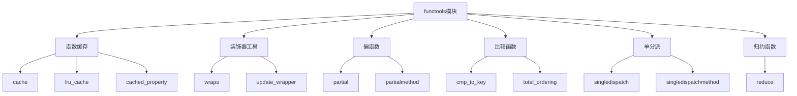

# Python标准库-functools模块完全参考手册

## 概述

`functools` 模块用于高阶函数：作用于或返回其他函数的函数。该模块提供了丰富的函数式编程工具，包括函数缓存、偏函数、装饰器工具、比较函数转换等。

functools模块的核心功能包括：
- 函数缓存（cache、lru_cache）
- 装饰器工具（wraps、update_wrapper、cached_property）
- 偏函数（partial、partialmethod）
- 比较函数（cmp_to_key、total_ordering）
- 单分派函数（singledispatch、singledispatchmethod）
- 归约函数（reduce）



## 函数缓存

### cache - 无限缓存

```python
from functools import cache

# 基本缓存
@cache
def fibonacci(n):
    if n < 2:
        return n
    return fibonacci(n - 1) + fibonacci(n - 2)

print(f"fibonacci(10) = {fibonacci(10)}")
print(f"fibonacci(15) = {fibonacci(15)}")

# 递归缓存示例
@cache
def factorial(n):
    if n <= 1:
        return 1
    return n * factorial(n - 1)

print(f"factorial(5) = {factorial(5)}")
print(f"factorial(10) = {factorial(10)}")

# 复杂计算缓存
@cache
def expensive_calculation(x):
    import time
    time.sleep(0.1)  # 模拟耗时操作
    return x * x * x

print(f"expensive_calculation(5) = {expensive_calculation(5)}")
# 第二次调用会直接从缓存获取，不会等待
print(f"cached result = {expensive_calculation(5)}")
```

### lru_cache - 最近最少使用缓存

```python
from functools import lru_cache

# 基本LRU缓存
@lru_cache(maxsize=128)
def get_data(key):
    print(f"Fetching data for {key}")
    return f"data_{key}"

print(f"get_data('A') = {get_data('A')}")
print(f"get_data('A') = {get_data('A')}")  # 第二次调用使用缓存

# 无限缓存
@lru_cache(maxsize=None)
def unlimited_cache(x):
    return x * x

print(f"unlimited_cache(10) = {unlimited_cache(10)}")

# 查看缓存信息
@lru_cache(maxsize=10)
def cached_function(x):
    return x ** 2

# 生成一些缓存调用
for i in range(15):
    cached_function(i % 10)

print(f"缓存信息: {cached_function.cache_info()}")

# 清除缓存
cached_function.cache_clear()
print(f"清除后缓存信息: {cached_function.cache_info()}")

# 类型感知缓存
@lru_cache(maxsize=10, typed=True)
def typed_cache(x):
    return x + 1

print(f"typed_cache(1) = {typed_cache(1)}")
print(f"typed_cache(1.0) = {typed_cache(1.0)}")  # 不同类型
```

### cached_property - 缓存属性

```python
from functools import cached_property

class DataSet:
    def __init__(self, data):
        self.data = data
    
    @cached_property
    def mean(self):
        print("计算平均值...")
        return sum(self.data) / len(self.data)
    
    @cached_property
    def max_value(self):
        print("计算最大值...")
        return max(self.data)
    
    @cached_property
    def min_value(self):
        print("计算最小值...")
        return min(self.data)

# 使用示例
dataset = DataSet([1, 2, 3, 4, 5, 6, 7, 8, 9, 10])
print(f"平均值: {dataset.mean}")  # 第一次调用会计算
print(f"平均值: {dataset.mean}")  # 第二次调用使用缓存
print(f"最大值: {dataset.max_value}")
print(f"最小值: {dataset.min_value}")

# 清除缓存
del dataset.__dict__['mean']
print(f"清除后的平均值: {dataset.mean}")  # 重新计算
```

## 装饰器工具

### wraps - 装饰器包装器

```python
from functools import wraps

def timing_decorator(func):
    """计时装饰器"""
    @wraps(func)
    def wrapper(*args, **kwargs):
        import time
        start = time.time()
        result = func(*args, **kwargs)
        end = time.time()
        print(f"{func.__name__} 执行时间: {end - start:.4f}秒")
        return result
    return wrapper

@timing_decorator
def slow_function():
    import time
    time.sleep(1)
    return "完成"

print(f"函数名: {slow_function.__name__}")
print(f"文档字符串: {slow_function.__doc__}")
result = slow_function()

# 带参数的装饰器
def repeat_decorator(times):
    def decorator(func):
        @wraps(func)
        def wrapper(*args, **kwargs):
            results = []
            for _ in range(times):
                results.append(func(*args, **kwargs))
            return results
        return wrapper
    return decorator

@repeat_decorator(3)
def greet(name):
    return f"Hello, {name}!"

print(f"重复调用: {greet('Alice')}")
```

### update_wrapper - 包装器更新

```python
from functools import update_wrapper

def logging_decorator(func):
    """日志装饰器"""
    def wrapper(*args, **kwargs):
        print(f"调用函数: {func.__name__}")
        print(f"参数: args={args}, kwargs={kwargs}")
        result = func(*args, **kwargs)
        print(f"结果: {result}")
        return result
    
    # 更新包装器属性
    update_wrapper(wrapper, func)
    return wrapper

@logging_decorator
def add(a, b):
    """加法函数"""
    return a + b

print(f"函数名: {add.__name__}")
print(f"文档字符串: {add.__doc__}")
result = add(3, 5)

# 自定义属性更新
def custom_decorator(func):
    def wrapper(*args, **kwargs):
        return func(*args, **kwargs)
    
    update_wrapper(wrapper, func, assigned=('__name__', '__doc__'))
    return wrapper

@custom_decorator
def multiply(a, b):
    """乘法函数"""
    return a * b

print(f"乘法函数名: {multiply.__name__}")
```

## 偏函数

### partial - 偏函数

```python
from functools import partial

# 基本偏函数
def power(base, exponent):
    return base ** exponent

square = partial(power, exponent=2)
cube = partial(power, exponent=3)

print(f"square(5) = {square(5)}")
print(f"cube(5) = {cube(5)}")

# 字符串格式化
def format_string(template, *args, **kwargs):
    return template.format(*args, **kwargs)

greeting = partial(format_string, "Hello, {}!")
print(f"greeting('World') = {greeting('World')}")

# 内置函数偏应用
add_five = partial(int, base=5)
print(f"add_five('101') = {add_five('101')}")  # 二进制101转换为十进制

# 多参数偏应用
def multiply(a, b, c):
    return a * b * c

partial_multiply = partial(multiply, 2, 3)
print(f"partial_multiply(4) = {partial_multiply(4)}")

# 占位符使用
from functools import Placeholder as _

def remove_char(s, char, count=-1):
    return s.replace(char, '', count)

remove_spaces = partial(remove_char, _, ' ')
remove_first_space = partial(remove_char, _, ' ', 1)

text = "Hello World Python"
print(f"remove_spaces(text) = {remove_spaces(text)}")
print(f"remove_first_space(text) = {remove_first_space(text)}")
```

### partialmethod - 偏方法

```python
from functools import partialmethod

class Button:
    def __init__(self, label):
        self.label = label
        self.clicked = False
    
    def click(self, times):
        """点击按钮"""
        self.clicked = True
        print(f"按钮 '{self.label}' 被点击了 {times} 次")
    
    # 创建偏方法
    single_click = partialmethod(click, 1)
    double_click = partialmethod(click, 2)

# 使用示例
button1 = Button("提交")
button2 = Button("取消")

button1.single_click()  # 点击一次
button2.double_click()  # 点击两次

# 类方法偏应用
class DataProcessor:
    def __init__(self):
        self.data = []
    
    def add_item(self, item, priority=0):
        """添加数据项"""
        self.data.append({'item': item, 'priority': priority})
    
    add_high_priority = partialmethod(add_item, priority=10)
    add_low_priority = partialmethod(add_item, priority=1)

processor = DataProcessor()
processor.add_item("普通数据")
processor.add_high_priority("重要数据")
processor.add_low_priority("普通数据2")

print(f"数据: {processor.data}")
```

## 比较函数

### cmp_to_key - 比较函数转换

```python
from functools import cmp_to_key

# 旧式比较函数
def compare_strings(a, b):
    """字符串比较"""
    if a < b:
        return -1
    elif a > b:
        return 1
    else:
        return 0

# 转换为key函数
key_func = cmp_to_key(compare_strings)
words = ['banana', 'apple', 'cherry', 'date']
sorted_words = sorted(words, key=key_func)
print(f"排序结果: {sorted_words}")

# 复杂对象比较
class Person:
    def __init__(self, name, age):
        self.name = name
        self.age = age
    
    def __repr__(self):
        return f"{self.name}({self.age})"

def compare_people(a, b):
    """人员比较：先按年龄，再按姓名"""
    if a.age != b.age:
        return -1 if a.age < b.age else 1
    return -1 if a.name < b.name else 1 if a.name > b.name else 0

people = [
    Person('Alice', 30),
    Person('Bob', 25),
    Person('Charlie', 25),
    Person('David', 35)
]

sorted_people = sorted(people, key=cmp_to_key(compare_people))
print(f"排序后人员: {sorted_people}")
```

### total_ordering - 全序比较

```python
from functools import total_ordering

@total_ordering
class Student:
    def __init__(self, name, score):
        self.name = name
        self.score = score
    
    def __eq__(self, other):
        if not isinstance(other, Student):
            return NotImplemented
        return self.score == other.score
    
    def __lt__(self, other):
        if not isinstance(other, Student):
            return NotImplemented
        return self.score < other.score
    
    def __repr__(self):
        return f"Student({self.name}, {self.score})"

# 使用示例
students = [
    Student('Alice', 85),
    Student('Bob', 92),
    Student('Charlie', 78),
    Student('David', 92)
]

print(f"排序前: {students}")
sorted_students = sorted(students)
print(f"排序后: {sorted_students}")

# 比较操作
student1 = Student('Alice', 85)
student2 = Student('Bob', 92)

print(f"student1 < student2: {student1 < student2}")
print(f"student1 <= student2: {student1 <= student2}")
print(f"student1 > student2: {student1 > student2}")
print(f"student1 >= student2: {student1 >= student2}")
print(f"student1 == student2: {student1 == student2}")
print(f"student1 != student2: {student1 != student2}")
```

## 单分派函数

### singledispatch - 单分派函数

```python
from functools import singledispatch

@singledispatch
def process_data(data):
    """默认数据处理"""
    print(f"默认处理: {data}")
    return data

# 注册int类型处理
@process_data.register
def _(data: int):
    print(f"整数处理: {data * 2}")
    return data * 2

# 注册str类型处理
@process_data.register
def _(data: str):
    print(f"字符串处理: {data.upper()}")
    return data.upper()

# 注册list类型处理
@process_data.register
def _(data: list):
    print(f"列表处理: 长度={len(data)}")
    return len(data)

# 注册dict类型处理
@process_data.register
def _(data: dict):
    print(f"字典处理: 键数={len(data)}")
    return list(data.keys())

# 使用示例
print(f"整数: {process_data(42)}")
print(f"字符串: {process_data('hello')}")
print(f"列表: {process_data([1, 2, 3])}")
print(f"字典: {process_data({'a': 1, 'b': 2})}")
print(f"默认: {process_data(3.14)}")

# 查看注册类型
print(f"注册类型: {list(process_data.registry.keys())}")
```

### singledispatchmethod - 单分派方法

```python
from functools import singledispatchmethod

class ShapeProcessor:
    @singledispatchmethod
    def process_shape(self, shape):
        """默认形状处理"""
        print(f"未知形状: {shape}")
    
    @process_shape.register
    def _(self, shape: dict):
        """处理字典形状"""
        print(f"字典形状: {shape['type']}")
    
    @process_shape.register
    def _(self, shape: str):
        """处理字符串形状"""
        print(f"字符串形状: {shape.upper()}")

# 使用示例
processor = ShapeProcessor()
processor.process_shape({'type': 'circle', 'radius': 5})
processor.process_shape('triangle')
processor.process_shape([1, 2, 3])

# 类方法分派
class MathOperations:
    @singledispatchmethod
    @classmethod
    def operate(cls, value):
        """默认操作"""
        return f"默认操作: {value}"
    
    @operate.register
    @classmethod
    def _(cls, value: int):
        """整数操作"""
        return f"整数平方: {value ** 2}"
    
    @operate.register
    @classmethod
    def _(cls, value: float):
        """浮点数操作"""
        return f"浮点数开方: {value ** 0.5}"

print(f"整数: {MathOperations.operate(5)}")
print(f"浮点数: {MathOperations.operate(4.0)}")
print(f"字符串: {MathOperations.operate('hello')}")
```

## 归约函数

### reduce - 归约操作

```python
from functools import reduce

# 基本归约
numbers = [1, 2, 3, 4, 5]
total = reduce(lambda x, y: x + y, numbers)
print(f"求和: {total}")

# 带初始值
total = reduce(lambda x, y: x + y, numbers, 100)
print(f"求和(初始值100): {total}")

# 乘积
product = reduce(lambda x, y: x * y, numbers)
print(f"乘积: {product}")

# 最大值
maximum = reduce(lambda x, y: x if x > y else y, numbers)
print(f"最大值: {maximum}")

# 连接字符串
words = ['Hello', 'World', 'Python']
sentence = reduce(lambda x, y: x + ' ' + y, words)
print(f"连接字符串: {sentence}")

# 列表展平
nested = [[1, 2], [3, 4], [5, 6]]
flattened = reduce(lambda x, y: x + y, nested, [])
print(f"展平列表: {flattened}")

# 查找满足条件的元素
data = [1, 2, 3, 4, 5, 6, 7, 8, 9, 10]
even_first = reduce(lambda x, y: x if x % 2 == 0 else y, data)
print(f"第一个偶数: {even_first}")
```

## 实战应用

### 1. 性能优化工具

```python
from functools import lru_cache, wraps
import time
import hashlib

class PerformanceOptimizer:
    """性能优化工具"""
    
    @staticmethod
    def memoize(func):
        """通用记忆化装饰器"""
        cache = {}
        
        @wraps(func)
        def wrapper(*args, **kwargs):
            key = (args, frozenset(kwargs.items()))
            if key not in cache:
                cache[key] = func(*args, **kwargs)
            return cache[key]
        
        return wrapper
    
    @staticmethod
    def rate_limiter(max_calls, time_window):
        """速率限制器"""
        calls = []
        
        def decorator(func):
            @wraps(func)
            def wrapper(*args, **kwargs):
                nonlocal calls
                current_time = time.time()
                
                # 清理过期调用
                calls = [call_time for call_time in calls if current_time - call_time < time_window]
                
                if len(calls) >= max_calls:
                    wait_time = time_window - (current_time - calls[0])
                    raise Exception(f"速率限制: 请等待 {wait_time:.2f} 秒")
                
                calls.append(current_time)
                return func(*args, **kwargs)
            
            return wrapper
        return decorator
    
    @staticmethod
    def retry(max_attempts, delay=1):
        """重试装饰器"""
        def decorator(func):
            @wraps(func)
            def wrapper(*args, **kwargs):
                for attempt in range(max_attempts):
                    try:
                        return func(*args, **kwargs)
                    except Exception as e:
                        if attempt == max_attempts - 1:
                            raise
                        time.sleep(delay)
            return wrapper
        return decorator

# 使用示例
optimizer = PerformanceOptimizer()

# 记忆化
@optimizer.memoize
def expensive_computation(x, y):
    time.sleep(0.1)
    return x + y

print(f"第一次调用: {expensive_computation(1, 2)}")
print(f"第二次调用(缓存): {expensive_computation(1, 2)}")

# 速率限制
@optimizer.rate_limiter(max_calls=3, time_window=5)
def api_call():
    print("API调用成功")

try:
    for i in range(5):
        api_call()
        time.sleep(0.5)
except Exception as e:
    print(f"速率限制: {e}")

# 重试机制
@optimizer.retry(max_attempts=3, delay=1)
def unreliable_operation():
    import random
    if random.random() < 0.7:
        raise Exception("操作失败")
    return "成功"

result = unreliable_operation()
print(f"重试结果: {result}")
```

### 2. 数据处理管道

```python
from functools import reduce, partial
import operator

class DataPipeline:
    """数据处理管道"""
    
    @staticmethod
    def create_pipeline(functions):
        """创建处理管道"""
        def pipeline(data):
            return reduce(lambda x, f: f(x), functions, data)
        return pipeline
    
    @staticmethod
    def batch_processor(items, batch_size, processor):
        """批量处理器"""
        batches = [items[i:i + batch_size] for i in range(0, len(items), batch_size)]
        return [processor(batch) for batch in batches]
    
    @staticmethod
    def parallel_mapper(data, mapper_func, workers=4):
        """并行映射器"""
        from concurrent.futures import ThreadPoolExecutor
        
        with ThreadPoolExecutor(max_workers=workers) as executor:
            results = list(executor.map(mapper_func, data))
        
        return results
    
    @staticmethod
    def data_aggregator(data, key_func, value_func, aggregate_func):
        """数据聚合器"""
        grouped = {}
        
        for item in data:
            key = key_func(item)
            value = value_func(item)
            
            if key not in grouped:
                grouped[key] = []
            grouped[key].append(value)
        
        return {key: aggregate_func(values) for key, values in grouped.items()}

# 使用示例
pipeline = DataPipeline()

# 创建处理管道
data = "Hello World Python"

processing_functions = [
    str.lower,
    str.split,
    lambda words: [len(word) for word in words],
    sum
]

pipe = pipeline.create_pipeline(processing_functions)
result = pipe(data)
print(f"管道处理结果: {result}")

# 批量处理
numbers = list(range(1, 101))
def process_batch(batch):
    return sum(batch) / len(batch)

batch_results = pipeline.batch_processor(numbers, 25, process_batch)
print(f"批量处理结果: {batch_results}")

# 数据聚合
transactions = [
    {'product': 'A', 'amount': 100},
    {'product': 'B', 'amount': 200},
    {'product': 'A', 'amount': 150},
    {'product': 'B', 'amount': 300}
]

aggregated = pipeline.data_aggregator(
    transactions,
    key_func=lambda x: x['product'],
    value_func=lambda x: x['amount'],
    aggregate_func=sum
)
print(f"聚合结果: {aggregated}")
```

### 3. 函数式编程工具

```python
from functools import partial, reduce, lru_cache
import operator

class FunctionalProgramming:
    """函数式编程工具"""
    
    @staticmethod
    def compose(*functions):
        """函数组合"""
        return reduce(lambda f, g: lambda x: f(g(x)), functions, lambda x: x)
    
    @staticmethod
    def pipe(data, *functions):
        """管道操作"""
        return reduce(lambda x, f: f(x), functions, data)
    
    @staticmethod
    def map_filter(data, map_func, filter_func):
        """映射-过滤组合"""
        return [map_func(item) for item in data if filter_func(item)]
    
    @staticmethod
    def curry(func, num_args):
        """柯里化"""
        def curried(*args):
            if len(args) >= num_args:
                return func(*args[:num_args])
            return lambda *more_args: curried(*args, *more_args)
        return curried
    
    @staticmethod
    def memoize(func):
        """记忆化"""
        cache = {}
        
        def wrapper(*args):
            if args not in cache:
                cache[args] = func(*args)
            return cache[args]
        
        return wrapper

# 使用示例
fp = FunctionalProgramming()

# 函数组合
add = lambda x: x + 1
multiply = lambda x: x * 2
square = lambda x: x ** 2

composed = fp.compose(square, multiply, add)
print(f"函数组合: composed(3) = {composed(3)}")

# 管道操作
result = fp.pipe(5, add, multiply, square)
print(f"管道操作: {result}")

# 映射-过滤
numbers = range(1, 11)
result = fp.map_filter(numbers, lambda x: x ** 2, lambda x: x % 2 == 0)
print(f"偶数的平方: {result}")

# 柯里化
def add_three(a, b, c):
    return a + b + c

curried_add = fp.curry(add_three, 3)
add_two = curried_add(1)
add_one = add_two(2)
result = add_one(3)
print(f"柯里化结果: {result}")

# 记忆化
@fp.memoize
def fibonacci(n):
    if n <= 1:
        return n
    return fibonacci(n - 1) + fibonacci(n - 2)

print(f"记忆化fibonacci(10) = {fibonacci(10)}")
```

### 4. API客户端

```python
from functools import lru_cache, wraps
import time

class APIClient:
    """API客户端"""
    
    def __init__(self, base_url):
        self.base_url = base_url
    
    @lru_cache(maxsize=100)
    def get_user(self, user_id):
        """获取用户信息（带缓存）"""
        print(f"从API获取用户 {user_id}")
        # 模拟API调用
        time.sleep(0.1)
        return {'id': user_id, 'name': f'User{user_id}'}
    
    def cache_invalidation(self):
        """缓存失效"""
        self.get_user.cache_clear()
        print("缓存已清除")
    
    @staticmethod
    def exponential_backoff(func, max_retries=3, base_delay=1):
        """指数退避装饰器"""
        @wraps(func)
        def wrapper(*args, **kwargs):
            for attempt in range(max_retries):
                try:
                    return func(*args, **kwargs)
                except Exception as e:
                    if attempt == max_retries - 1:
                        raise
                    delay = base_delay * (2 ** attempt)
                    print(f"重试 {attempt + 1}/{max_retries}，等待 {delay} 秒")
                    time.sleep(delay)
        return wrapper
    
    def make_api_call(self, endpoint):
        """API调用"""
        @self.exponential_backoff
        def _call():
            # 模拟API调用
            import random
            if random.random() < 0.7:  # 70%失败率
                raise Exception("API调用失败")
            return f"数据: {endpoint}"
        
        return _call()

# 使用示例
client = APIClient("https://api.example.com")

# 缓存调用
print(f"第一次调用: {client.get_user(1)}")
print(f"第二次调用(缓存): {client.get_user(1)}")
print(f"缓存信息: {client.get_user.cache_info()}")

# 指数退避
try:
    result = client.make_api_call("/data")
    print(f"API调用结果: {result}")
except Exception as e:
    print(f"API调用失败: {e}")
```

### 5. 类装饰器工具

```python
from functools import wraps

class ClassDecoratorTools:
    """类装饰器工具"""
    
    @staticmethod
    def singleton(cls):
        """单例模式"""
        instances = {}
        
        @wraps(cls)
        def get_instance(*args, **kwargs):
            if cls not in instances:
                instances[cls] = cls(*args, **kwargs)
            return instances[cls]
        
        return get_instance
    
    @staticmethod
    def count_calls(cls):
        """调用计数装饰器"""
        class WrappedClass:
            def __init__(self, *args, **kwargs):
                self._instance = cls(*args, **kwargs)
                self._call_counts = {}
            
            def __getattr__(self, name):
                attr = getattr(self._instance, name)
                if callable(attr):
                    def counted_method(*args, **kwargs):
                        if name not in self._call_counts:
                            self._call_counts[name] = 0
                        self._call_counts[name] += 1
                        return attr(*args, **kwargs)
                    return counted_method
                return attr
            
            def get_call_counts(self):
                return self._call_counts
        
        return WrappedClass
    
    @staticmethod
    def validate_inputs(**validators):
        """输入验证装饰器"""
        def decorator(cls):
            for attr_name, validator in validators.items():
                original_method = getattr(cls, attr_name)
                
                @wraps(original_method)
                def validated_method(self, *args, **kwargs):
                    for arg in args:
                        if not validator(arg):
                            raise ValueError(f"参数验证失败: {arg}")
                    return original_method(self, *args, **kwargs)
                
                setattr(cls, attr_name, validated_method)
            
            return cls
        
        return decorator

# 使用示例
tools = ClassDecoratorTools()

# 单例模式
@tools.singleton
class DatabaseConnection:
    def __init__(self):
        print("创建数据库连接")

db1 = DatabaseConnection()
db2 = DatabaseConnection()
print(f"单例检查: {db1 is db2}")

# 调用计数
@tools.count_calls
class CounterService:
    def method1(self):
        return "方法1"
    
    def method2(self):
        return "方法2"

service = CounterService()
service.method1()
service.method1()
service.method2()
print(f"调用计数: {service.get_call_counts()}")

# 输入验证
def positive_number(value):
    return isinstance(value, (int, float)) and value > 0

@tools.validate_inputs(amount=positive_number)
class BankService:
    def deposit(self, amount):
        return f"存入 {amount}"
    
    def withdraw(self, amount):
        return f"取出 {amount}"

bank = BankService()
print(f"存款: {bank.deposit(100)}")
```

## 性能优化技巧

### 1. 缓存策略

```python
from functools import lru_cache
import time

# LRU缓存调优
@lru_cache(maxsize=256, typed=False)
def optimized_cache_function(x):
    """优化缓存函数"""
    time.sleep(0.01)
    return x * x

# 预热缓存
for i in range(10):
    optimized_cache_function(i)

print(f"缓存信息: {optimized_cache_function.cache_info()}")

# 多级缓存
class MultiLevelCache:
    def __init__(self):
        self.l1_cache = {}  # 热数据
        self.l2_cache = {}  # 温数据
    
    def get(self, key, compute_func):
        if key in self.l1_cache:
            return self.l1_cache[key]
        
        if key in self.l2_cache:
            value = self.l2_cache.pop(key)
            self.l1_cache[key] = value
            return value
        
        value = compute_func(key)
        self.l2_cache[key] = value
        return value

# 使用示例
cache = MultiLevelCache()
result = cache.get(5, lambda x: x ** 2)
print(f"多级缓存结果: {result}")
```

### 2. 延迟计算

```python
from functools import partial

def lazy_evaluation():
    """延迟计算"""
    def expensive_computation(x):
        print(f"计算 {x}...")
        return x ** 3
    
    # 创建偏函数，但不立即计算
    deferred_computations = [
        partial(expensive_computation, i) for i in range(5)
    ]
    
    # 延迟执行
    print("准备执行延迟计算...")
    results = [comp() for comp in deferred_computations]
    print(f"计算结果: {results}")

lazy_evaluation()
```

## 常见问题

### Q1: cache和lru_cache有什么区别？

**A**: cache是无限缓存，不会清除旧缓存，适合数据量小且需要长期缓存的情况。lru_cache有大小限制，使用LRU策略清除最近最少使用的缓存，适合数据量大且需要限制内存使用的情况。

### Q2: partial和普通函数有什么优势？

**A**: partial可以预设函数的部分参数，创建更简单的函数接口。这在函数式编程、回调函数、事件处理等场景中非常有用，可以提高代码的可读性和可维护性。

### Q3: singledispatch和if-elif-else有什么区别？

**A**: singledispatch提供了更优雅的类型分发机制，支持运行时类型判断，代码更清晰，易于扩展。当需要根据参数类型执行不同逻辑时，比传统的if-elif-else更易维护和扩展。

`functools` 模块是Python函数式编程的核心工具，提供了：

1. **高效的缓存机制**: 提升重复计算的性能
2. **强大的装饰器工具**: 简化装饰器开发
3. **灵活的偏函数**: 创建专门的函数变体
4. **优雅的类型分发**: 实现多态函数
5. **函数式编程支持**: 支持函数组合和管道
6. **性能优化工具**: 提升代码执行效率

通过掌握 `functools` 模块，您可以：
- 编写更高效的代码
- 实现优雅的函数式编程
- 创建灵活的API接口
- 优化重复计算
- 简化复杂逻辑
- 提升代码可维护性

`functools` 模块是Python高级编程的重要工具。无论是性能优化、API设计，还是函数式编程，`functools` 都能提供强大的支持。掌握这些工具将大大提升您的Python编程能力和代码质量。