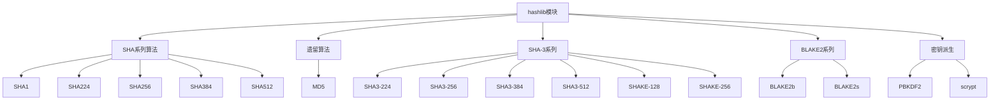

# Python标准库-hashlib模块完全参考手册

## 概述

`hashlib` 模块提供了多种安全哈希和消息摘要算法的通用接口。它实现了联邦信息处理标准（FIPS）中定义的安全哈希算法，包括SHA-2系列、SHA-3系列，以及遗留算法如SHA1和MD5。

hashlib模块的核心功能包括：
- 多种加密哈希算法
- 消息摘要计算
- 文件哈希计算
- 密钥派生函数
- BLAKE2哈希算法
- 安全的密码哈希



## 可用算法

### 保证可用的算法

```python
import hashlib

# 所有平台都保证可用的算法
print("保证可用的算法:")
print(hashlib.algorithms_guaranteed)
# {'sha256', 'sha384', 'sha512', 'sha1', 'sha224', 'md5', 'sha3_224', 'sha3_256', 'sha3_384', 'sha3_512', 'shake_128', 'shake_256', 'blake2b', 'blake2s'}
```

### 当前平台可用的算法

```python
import hashlib

# 当前平台可用的算法
print("当前平台可用的算法:")
print(hashlib.algorithms_available)
# 可能包含更多算法，取决于OpenSSL版本
```

## 基本使用

### 哈希字符串

```python
import hashlib

# 创建哈希对象
hash_obj = hashlib.sha256()

# 更新数据
hash_obj.update(b"Hello")
hash_obj.update(b" ")
hash_obj.update(b"World")

# 获取摘要
digest = hash_obj.digest()
hex_digest = hash_obj.hexdigest()

print(f"摘要: {digest}")
print(f"十六进制摘要: {hex_digest}")

# 简写方式
hash_obj = hashlib.sha256(b"Hello World")
print(f"十六进制摘要: {hash_obj.hexdigest()}")
```

### 不同算法的哈希

```python
import hashlib

data = b"Hello World"

# MD5（不推荐用于安全用途）
md5_hash = hashlib.md5(data).hexdigest()
print(f"MD5: {md5_hash}")

# SHA1（不推荐用于安全用途）
sha1_hash = hashlib.sha1(data).hexdigest()
print(f"SHA1: {sha1_hash}")

# SHA256（推荐）
sha256_hash = hashlib.sha256(data).hexdigest()
print(f"SHA256: {sha256_hash}")

# SHA384
sha384_hash = hashlib.sha384(data).hexdigest()
print(f"SHA384: {sha384_hash}")

# SHA512
sha512_hash = hashlib.sha512(data).hexdigest()
print(f"SHA512: {sha512_hash}")

# SHA3-256
sha3_256_hash = hashlib.sha3_256(data).hexdigest()
print(f"SHA3-256: {sha3_256_hash}")
```

## SHA-3系列算法

### SHA-3-224, SHA-3-256, SHA-3-384, SHA3-512

```python
import hashlib

data = b"Hello World"

# SHA3-224
sha3_224 = hashlib.sha3_224(data).hexdigest()
print(f"SHA3-224: {sha3_224}")

# SHA3-256
sha3_256 = hashlib.sha3_256(data).hexdigest()
print(f"SHA3-256: {sha3_256}")

# SHA3-384
sha3_384 = hashlib.sha3_384(data).hexdigest()
print(f"SHA3-384: {sha3_384}")

# SHA3-512
sha3_512 = hashlib.sha3_512(data).hexdigest()
print(f"SHA3-512: {sha3_512}")
```

### SHAKE算法（可变长度输出）

```python
import hashlib

data = b"Hello World"

# SHAKE-128
shake_128 = hashlib.shake_128(data)
print(f"SHAKE-128 (20字节): {shake_128.hexdigest(20)}")
print(f"SHAKE-128 (32字节): {shake_128.hexdigest(32)}")

# SHAKE-256
shake_256 = hashlib.shake_256(data)
print(f"SHAKE-256 (20字节): {shake_256.hexdigest(20)}")
print(f"SHAKE-256 (64字节): {shake_256.hexdigest(64)}")
```

## BLAKE2算法

### BLAKE2b和BLAKE2s

```python
import hashlib

data = b"Hello World"

# BLAKE2b（64位平台优化）
blake2b_hash = hashlib.blake2b(data).hexdigest()
print(f"BLAKE2b: {blake2b_hash}")

# BLAKE2s（8-32位平台优化）
blake2s_hash = hashlib.blake2s(data).hexdigest()
print(f"BLAKE2s: {blake2s_hash}")

# 自定义摘要长度
blake2b_20 = hashlib.blake2b(data, digest_size=20).hexdigest()
print(f"BLAKE2b(20字节): {blake2b_20}")

blake2s_10 = hashlib.blake2s(data, digest_size=10).hexdigest()
print(f"BLAKE2s(10字节): {blake2s_10}")
```

### BLAKE2密钥模式

```python
import hashlib

# 密钥哈希
key = b'secret_key'
message = b'important message'

# BLAKE2b密钥模式
blake2b_keyed = hashlib.blake2b(key=key, digest_size=16)
blake2b_keyed.update(message)
mac = blake2b_keyed.hexdigest()
print(f"MAC: {mac}")

# BLAKE2s密钥模式
blake2s_keyed = hashlib.blake2s(key=key, digest_size=16)
blake2s_keyed.update(message)
mac = blake2s_keyed.hexdigest()
print(f"MAC: {mac}")
```

## 文件哈希

### 基本文件哈希

```python
import hashlib

def file_hash(filename, algorithm='sha256'):
    """计算文件哈希"""
    hash_obj = hashlib.new(algorithm)
    
    with open(filename, 'rb') as f:
        # 分块读取大文件
        for chunk in iter(lambda: f.read(4096), b''):
            hash_obj.update(chunk)
    
    return hash_obj.hexdigest()

# 使用示例
hash_value = file_hash('example.txt', 'sha256')
print(f"文件SHA256: {hash_value}")
```

### 使用file_digest函数（Python 3.11+）

```python
import hashlib

def file_hash_fast(filename):
    """快速计算文件哈希"""
    with open(filename, 'rb') as f:
        digest = hashlib.file_digest(f, 'sha256')
        return digest.hexdigest()

# 使用示例
hash_value = file_hash_fast('example.txt')
print(f"文件SHA256: {hash_value}")
```

## 密钥派生

### PBKDF2

```python
import hashlib
import os

# 密码哈希
password = b'my_secure_password'
salt = os.urandom(16)
iterations = 100000

# PBKDF2密钥派生
derived_key = hashlib.pbkdf2_hmac(
    'sha256',
    password,
    salt,
    iterations,
    dklen=32  # 32字节密钥
)

print(f"派生密钥: {derived_key.hex()}")
```

### scrypt

```python
import hashlib
import os

# 密码哈希
password = b'my_secure_password'
salt = os.urandom(16)
n = 16384  # CPU/内存成本因子
r = 8      # 块大小
p = 1      # 并行化因子

# scrypt密钥派生
derived_key = hashlib.scrypt(
    password,
    salt=salt,
    n=n,
    r=r,
    p=p
)

print(f"派生密钥: {derived_key.hex()}")
```

## 实战应用

### 1. 密码安全存储

```python
import hashlib
import os
import secrets

class PasswordManager:
    """密码安全管理器"""

    def __init__(self):
        self.iterations = 100000
        self.hash_name = 'sha256'

    def hash_password(self, password):
        """安全哈希密码"""
        if isinstance(password, str):
            password = password.encode('utf-8')
        
        # 生成随机盐
        salt = os.urandom(16)
        
        # 使用PBKDF2派生密钥
        hashed = hashlib.pbkdf2_hmac(
            self.hash_name,
            password,
            salt,
            self.iterations,
            dklen=32
        )
        
        # 存储格式: iterations$salt$hashed
        return f"{self.iterations}${salt.hex()}${hashed.hex()}"

    def verify_password(self, stored_hash, password):
        """验证密码"""
        if isinstance(password, str):
            password = password.encode('utf-8')
        
        try:
            # 解析存储的哈希
            iterations, salt_hex, hash_hex = stored_hash.split('$')
            iterations = int(iterations)
            salt = bytes.fromhex(salt_hex)
            expected_hash = bytes.fromhex(hash_hex)
            
            # 计算新哈希
            new_hash = hashlib.pbkdf2_hmac(
                self.hash_name,
                password,
                salt,
                iterations,
                dklen=32
            )
            
            # 使用恒定时间比较（防止时序攻击）
            import hmac
            return hmac.compare_digest(expected_hash, new_hash)
        
        except (ValueError, TypeError):
            return False

    def generate_secure_token(self, length=32):
        """生成安全令牌"""
        return secrets.token_urlsafe(length)

# 使用示例
password_manager = PasswordManager()

# 存储密码
stored_hash = password_manager.hash_password("my_password123")
print(f"存储的密码哈希: {stored_hash}")

# 验证密码
is_valid = password_manager.verify_password(stored_hash, "my_password123")
print(f"密码验证: {'成功' if is_valid else '失败'}")

# 生成安全令牌
token = password_manager.generate_secure_token()
print(f"安全令牌: {token}")
```

### 2. 文件完整性验证

```python
import hashlib
import json
from pathlib import Path

class FileIntegrityChecker:
    """文件完整性检查器"""

    def __init__(self, checksum_file='checksums.json'):
        self.checksum_file = Path(checksum_file)
        self.checksums = self._load_checksums()

    def _load_checksums(self):
        """加载校验和"""
        if self.checksum_file.exists():
            with open(self.checksum_file, 'r') as f:
                return json.load(f)
        return {}

    def _save_checksums(self):
        """保存校验和"""
        with open(self.checksum_file, 'w') as f:
            json.dump(self.checksums, f, indent=2)

    def calculate_checksum(self, filepath, algorithm='sha256'):
        """计算文件校验和"""
        filepath = Path(filepath)
        if not filepath.exists():
            raise FileNotFoundError(f"文件不存在: {filepath}")
        
        hash_obj = hashlib.new(algorithm)
        with open(filepath, 'rb') as f:
            for chunk in iter(lambda: f.read(8192), b''):
                hash_obj.update(chunk)
        
        return hash_obj.hexdigest()

    def add_file(self, filepath, algorithm='sha256'):
        """添加文件到校验列表"""
        filepath = Path(filepath)
        checksum = self.calculate_checksum(filepath, algorithm)
        
        self.checksums[str(filepath)] = {
            'algorithm': algorithm,
            'checksum': checksum,
            'timestamp': filepath.stat().st_mtime
        }
        
        self._save_checksums()
        return checksum

    def verify_file(self, filepath, expected_checksum=None):
        """验证文件完整性"""
        filepath = Path(filepath)
        
        if expected_checksum is None:
            # 从存储的校验和中获取
            file_info = self.checksums.get(str(filepath))
            if not file_info:
                raise ValueError(f"文件不在校验列表中: {filepath}")
            expected_checksum = file_info['checksum']
        
        # 计算当前校验和
        current_checksum = self.calculate_checksum(filepath)
        
        # 比较
        import hmac
        return hmac.compare_digest(expected_checksum, current_checksum)

# 使用示例
checker = FileIntegrityChecker()

# 添加文件（需要实际文件存在）
# checksum = checker.add_file('example.txt')
# print(f"文件校验和: {checksum}")

# 验证文件
# is_valid = checker.verify_file('example.txt')
# print(f"文件完整性: {'有效' if is_valid else '无效'}")
```

## 性能优化

### 1. 分块处理大文件

```python
import hashlib

def hash_large_file(file_path, chunk_size=8192):
    """分块处理大文件"""
    hash_obj = hashlib.sha256()
    
    with open(file_path, 'rb') as f:
        while True:
            chunk = f.read(chunk_size)
            if not chunk:
                break
            hash_obj.update(chunk)
    
    return hash_obj.hexdigest()
```

### 2. 批量哈希计算

```python
import hashlib
from concurrent.futures import ThreadPoolExecutor

def hash_file(filename):
    """计算单个文件哈希"""
    hash_obj = hashlib.sha256()
    with open(filename, 'rb') as f:
        for chunk in iter(lambda: f.read(8192), b''):
            hash_obj.update(chunk)
    return filename, hash_obj.hexdigest()

def batch_hash_files(file_list, max_workers=4):
    """批量计算文件哈希"""
    results = {}
    
    with ThreadPoolExecutor(max_workers=max_workers) as executor:
        futures = {executor.submit(hash_file, f): f for f in file_list}
        
        for future in futures:
            try:
                filename, hash_value = future.result()
                results[filename] = hash_value
            except Exception as e:
                results[filename] = f"错误: {str(e)}"
    
    return results
```

## 安全考虑

### 1. 密码安全哈希

```python
import hashlib
import os

# 错误的做法（不要这样做）
def insecure_password_hash(password):
    """不安全的密码哈希"""
    return hashlib.md5(password).hexdigest()

# 正确的做法
def secure_password_hash(password):
    """安全的密码哈希"""
    if isinstance(password, str):
        password = password.encode('utf-8')
    
    salt = os.urandom(16)
    iterations = 100000
    
    hashed = hashlib.pbkdf2_hmac(
        'sha256',
        password,
        salt,
        iterations,
        dklen=32
    )
    
    return f"{iterations}${salt.hex()}${hashed.hex()}"
```

### 2. 密码长度限制

```python
import hashlib

def safe_password_hash(password, max_length=1024):
    """安全的密码哈希，限制密码长度"""
    if isinstance(password, str):
        password = password.encode('utf-8')
    
    if len(password) > max_length:
        raise ValueError(f"密码长度超过限制: {max_length}字节")
    
    # 后续哈希逻辑...
```

## 常见问题

### Q1: MD5和SHA1为什么不安全？

**A**: MD5和SHA1都存在已知的碰撞漏洞，攻击者可以构造出相同哈希值的不同输入。对于安全敏感的应用，应该使用SHA-256或更强的算法。

### Q2: 如何选择合适的哈希算法？

**A**: 一般用途使用SHA-256；需要更高安全性时使用SHA-384或SHA-512；最新算法选择SHA-3-256。密码哈希应该使用PBKDF2或scrypt等专门的密码哈希算法。

### Q3: 为什么不能直接哈希密码？

**A**: 直接哈希容易受到彩虹表攻击。应该使用PBKDF2、scrypt等密钥派生函数，这些函数包含盐和多次迭代，大大增加了暴力破解的难度。

`hashlib` 模块是Python中最重要和最安全的哈希计算模块，提供了：

1. **多种安全算法**: SHA-2系列、SHA-3系列、BLAKE2系列
2. **密码安全**: PBKDF2、scrypt等密钥派生函数
3. **文件哈希**: 支持流式处理和大文件哈希计算
4. **高性能**: 多线程支持和分块处理
5. **灵活性**: 支持自定义摘要长度和参数
6. **平台兼容**: 跨平台支持，算法保证可用

通过掌握 `hashlib` 模块，您可以：
- 实现安全的密码存储系统
- 构建文件完整性验证机制
- 创建内容寻址存储系统
- 实现数据完整性验证
- 生成安全的令牌和密钥
- 优化大文件哈希计算

`hashlib` 模块是Python安全编程的基础，掌握它将使您的应用程序更加安全可靠。无论是密码管理、数据完整性验证还是加密通信，`hashlib` 都提供了必要的工具和算法支持。在现代安全要求越来越高的环境下，正确使用`hashlib`是每个Python开发者必备的技能。