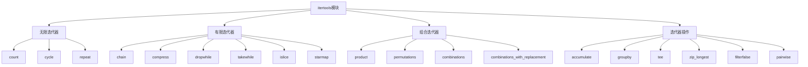

# Python标准库-itertools模块完全参考手册

## 概述

`itertools` 模块实现了许多快速、内存高效的迭代器工具，这些工具受到 APL、Haskell 和 SML 等语言的启发。它们可以单独使用，也可以组合使用，形成"迭代器代数"，能够简洁高效地构建专门的工具。

itertools模块的核心功能包括：
- 无限迭代器（count、cycle、repeat）
- 有限迭代器（chain、compress、dropwhile等）
- 组合迭代器（product、permutations、combinations等）
- 迭代器操作（tee、islice、groupby等）
- 高级迭代器配方



## 无限迭代器

### count - 计数器

```python
import itertools

# 基本计数
counter = itertools.count(start=0, step=1)
print(f"前10个计数: {[next(counter) for _ in range(10)]}")

# 自定义起始值和步长
counter = itertools.count(start=10, step=2)
print(f"从10开始，步长为2: {[next(counter) for _ in range(5)]}")

# 浮点数计数
counter = itertools.count(start=0.5, step=0.5)
print(f"浮点数计数: {[next(counter) for _ in range(5)]}")

# 与map结合使用
numbers = list(map(lambda x: x ** 2, itertools.count(1, 1)))
print(f"平方数序列: {numbers[:10]}")
```

### cycle - 循环迭代

```python
import itertools

# 基本循环
cycler = itertools.cycle(['A', 'B', 'C'])
print(f"循环序列: {[next(cycler) for _ in range(8)]}")

# 无限循环颜色
colors = itertools.cycle(['红', '绿', '蓝'])
print(f"颜色循环: {[next(colors) for _ in range(6)]}")

# 创建重复模式
pattern = itertools.cycle([1, 2, 3, 4])
print(f"模式重复: {[next(pattern) for _ in range(10)]}")
```

### repeat - 重复元素

```python
import itertools

# 无限重复
repeater = itertools.repeat('Hello')
print(f"前5次重复: {[next(repeater) for _ in range(5)]}")

# 有限重复
repeater = itertools.repeat('Python', 3)
print(f"重复3次: {list(repeater)}")

# 与map结合使用
powers = list(map(pow, range(5), itertools.repeat(2)))
print(f"平方数: {powers}")

# 与zip结合使用
zipped = list(zip(['a', 'b', 'c'], itertools.repeat(1)))
print(f"配对结果: {zipped}")
```

## 有限迭代器

### chain - 连接迭代器

```python
import itertools

# 连接多个可迭代对象
result = list(itertools.chain('ABC', 'DEF', 'GHI'))
print(f"连接字符串: {result}")

# 连接列表
result = list(itertools.chain([1, 2, 3], [4, 5, 6], [7, 8, 9]))
print(f"连接列表: {result}")

# chain.from_iterable
data = [[1, 2, 3], [4, 5], [6, 7, 8, 9]]
result = list(itertools.chain.from_iterable(data))
print(f"扁平化列表: {result}")

# 展平嵌套结构
nested = [['a', 'b'], ['c'], ['d', 'e', 'f']]
flat = list(itertools.chain.from_iterable(nested))
print(f"扁平化结果: {flat}")
```

### compress - 压缩选择

```python
import itertools

# 基本使用
data = 'ABCDEFG'
selectors = [1, 0, 1, 0, 1, 1, 0]
result = list(itertools.compress(data, selectors))
print(f"压缩结果: {result}")

# 布尔选择
data = ['A', 'B', 'C', 'D', 'E']
selectors = [True, False, True, False, True]
result = list(itertools.compress(data, selectors))
print(f"布尔选择: {result}")

# 条件过滤
numbers = range(10)
even_selectors = [x % 2 == 0 for x in numbers]
even_numbers = list(itertools.compress(numbers, even_selectors))
print(f"偶数: {even_numbers}")
```

### dropwhile 和 takewhile

```python
import itertools

# dropwhile - 删除满足条件的元素
data = [1, 2, 3, 4, 5, 6, 7, 8, 9, 10]
result = list(itertools.dropwhile(lambda x: x < 5, data))
print(f"dropwhile结果: {result}")

# takewhile - 保留满足条件的元素
result = list(itertools.takewhile(lambda x: x < 5, data))
print(f"takewhile结果: {result}")

# 处理文本行
text_lines = ["# 这是一个注释", "", "实际内容1", "实际内容2"]
content_lines = list(itertools.dropwhile(lambda x: x.startswith('#') or x.strip() == '', text_lines))
print(f"过滤注释和空行: {content_lines}")
```

### islice - 切片迭代器

```python
import itertools

# 基本切片
data = 'ABCDEFGH'
result = list(itertools.islice(data, 3))
print(f"前3个元素: {result}")

# 带起始和结束
result = list(itertools.islice(data, 2, 5))
print(f"索引2-4: {result}")

# 带步长
result = list(itertools.islice(data, 0, None, 2))
print(f"每隔一个: {result}")

# 无限迭代器切片
infinite = itertools.count()
result = list(itertools.islice(infinite, 5, 10))
print(f"无限迭代器切片: {result}")
```

### starmap - 星号映射

```python
import itertools

# 基本使用
data = [(2, 3), (3, 2), (10, 3)]
result = list(itertools.starmap(pow, data))
print(f"幂运算结果: {result}")

# 与map对比
points = [(1, 2), (3, 4), (5, 6)]
starmap_result = list(itertools.starmap(lambda x, y: x ** 2 + y ** 2, points))
print(f"距离平方: {starmap_result}")

# 函数调用
functions = [
    (lambda x: x * 2, 5),
    (lambda x: x ** 2, 3),
    (lambda x: x + 10, 7)
]
result = list(itertools.starmap(lambda f, x: f(x), functions))
print(f"函数调用结果: {result}")
```

### filterfalse - 过滤假值

```python
import itertools

# 过滤偶数
numbers = range(10)
result = list(itertools.filterfalse(lambda x: x % 2, numbers))
print(f"偶数: {result}")

# 过滤空字符串
data = ['hello', '', 'world', '', 'python']
result = list(itertools.filterfalse(None, data))
print(f"非空字符串: {result}")

# 过滤负数
numbers = [-5, -3, -1, 0, 1, 3, 5]
result = list(itertools.filterfalse(lambda x: x > 0, numbers))
result = list(itertools.filterfalse(lambda x: x > 0, numbers))
result = list(itertools.filterfalse(lambda x: x > 0, numbers))
positive = list(itertools.filterfalse(lambda x: x <= 0, numbers))
print(f"正数: {positive}")
```

## 组合迭代器

### product - 笛卡尔积

```python
import itertools

# 基本笛卡尔积
result = list(itertools.product('ABCD', 'xy'))
print(f"笛卡尔积: {result}")

# 多个序列
result = list(itertools.product([1, 2], ['a', 'b'], ['X', 'Y']))
print(f"三重笛卡尔积: {result}")

# repeat参数
result = list(itertools.product([1, 2], repeat=3))
print(f"自笛卡尔积: {result}")

# 生成所有可能的密码组合
digits = '0123456789'
passwords = list(itertools.product(digits, repeat=3))
print(f"3位数字密码数量: {len(passwords)}")
print(f"前5个密码: {passwords[:5]}")
```

### permutations - 排列

```python
import itertools

# 基本排列
result = list(itertools.permutations('ABC', 2))
print(f"2元素排列: {result}")

# 全排列
result = list(itertools.permutations('ABC'))
print(f"全排列: {result}")

# 数字排列
result = list(itertools.permutations([1, 2, 3]))
print(f"数字排列: {result}")

# 排列计数
items = 'ABCD'
perm_count = len(list(itertools.permutations(items)))
print(f"{len(items)}个元素的全排列数: {perm_count}")
```

### combinations - 组合

```python
import itertools

# 基本组合
result = list(itertools.combinations('ABC', 2))
print(f"2元素组合: {result}")

# 3元素组合
result = list(itertools.combinations('ABCD', 3))
print(f"3元素组合: {result}")

# 数字组合
result = list(itertools.combinations(range(5), 3))
print(f"5选3组合: {result}")

# 组合计数
from math import comb
n, r = 10, 3
comb_count = comb(n, r)
print(f"{n}选{r}的组合数: {comb_count}")
```

### combinations_with_replacement - 可重复组合

```python
import itertools

# 基本可重复组合
result = list(itertools.combinations_with_replacement('ABC', 2))
print(f"2元素可重复组合: {result}")

# 投骰子结果
result = list(itertools.combinations_with_replacement([1, 2, 3, 4, 5, 6], 2))
print(f"两次投骰子结果数: {len(result)}")

# 颜色组合
colors = ['红', '绿', '蓝']
result = list(itertools.combinations_with_replacement(colors, 2))
print(f"颜色组合: {result}")
```

## 迭代器操作

### accumulate - 累积

```python
import itertools
import operator

# 基本累加
numbers = [1, 2, 3, 4, 5]
result = list(itertools.accumulate(numbers))
print(f"累加结果: {result}")

# 乘法累积
result = list(itertools.accumulate(numbers, operator.mul))
print(f"乘法累积: {result}")

# 最大值累积
data = [3, 4, 6, 2, 1, 9, 0, 7, 5, 8]
result = list(itertools.accumulate(data, max))
print(f"最大值累积: {result}")

# 带初始值
result = list(itertools.accumulate(numbers, initial=100))
print(f"带初始值累加: {result}")

# 自定义函数
result = list(itertools.accumulate(numbers, lambda x, y: x + y ** 2))
print(f"自定义累积: {result}")
```

### groupby - 分组

```python
import itertools

# 基本分组
data = 'AAAABBBCCDAABBB'
groups = [(key, list(group)) for key, group in itertools.groupby(data)]
print(f"分组结果: {groups}")

# 按属性分组
students = [
    {'name': 'Alice', 'grade': 'A'},
    {'name': 'Bob', 'grade': 'B'},
    {'name': 'Charlie', 'grade': 'A'},
    {'name': 'David', 'grade': 'C'}
]
sorted_students = sorted(students, key=lambda x: x['grade'])
groups = {key: list(group) for key, group in itertools.groupby(sorted_students, key=lambda x: x['grade'])}
print(f"按成绩分组: {groups}")

# 连续相同值分组
numbers = [1, 1, 2, 2, 2, 3, 1, 1, 4]
groups = [(key, len(list(group))) for key, group in itertools.groupby(numbers)]
print(f"连续相同值: {groups}")
```

### tee - 分叉迭代器

```python
import itertools

# 基本分叉
iterator = iter([1, 2, 3, 4, 5])
it1, it2 = itertools.tee(iterator, 2)
print(f"迭代器1: {list(it1)}")
print(f"迭代器2: {list(it2)}")

# 多次分叉
iterator = range(5)
it1, it2, it3 = itertools.tee(iterator, 3)
print(f"迭代器1: {list(it1)}")
print(f"迭代器2: {list(it2)}")
print(f"迭代器3: {list(it3)}")

# 提前查看
data = range(10)
it1, it2 = itertools.tee(data, 2)
first_value = next(it1)
print(f"第一个值: {first_value}")
print(f"完整数据: {list(it1)}")
```

### zip_longest - 长度不等zip

```python
import itertools

# 基本使用
result = list(itertools.zip_longest('ABCD', 'xy', fillvalue='-'))
print(f"不等长zip: {result}")

# 多个序列
result = list(itertools.zip_longest('ABC', '12', 'XYZ', fillvalue='*'))
print(f"多个序列: {result}")

# 自定义填充值
names = ['Alice', 'Bob', 'Charlie']
ages = [25, 30]
result = dict(itertools.zip_longest(names, ages, fillvalue=0))
print(f"名字-年龄字典: {result}")
```

### pairwise - 相邻配对

```python
import itertools

# 基本配对
data = 'ABCDEFG'
result = list(itertools.pairwise(data))
print(f"相邻配对: {result}")

# 数字差分
numbers = [1, 4, 9, 16, 25]
differences = [b - a for a, b in itertools.pairwise(numbers)]
print(f"差分: {differences}")

# 检查有序性
data = [1, 2, 3, 5, 8, 13]
is_sorted = all(a < b for a, b in itertools.pairwise(data))
print(f"是否递增: {is_sorted}")
```

### batched - 批处理

```python
import itertools

# 基本批处理
data = [1, 2, 3, 4, 5, 6, 7, 8, 9, 10]
result = list(itertools.batched(data, 3))
print(f"批处理: {result}")

# 字符串批处理
text = "abcdefghijklmnopqrstuvwxyz"
result = list(itertools.batched(text, 5))
print(f"字符串批处理: {result}")

# 严格模式（最后一批必须满）
try:
    result = list(itertools.batched(data, 3, strict=True))
    print(f"严格批处理: {result}")
except ValueError as e:
    print(f"严格模式错误: {e}")
```

## 实战应用

### 1. 数据流处理

```python
import itertools
import operator

class DataStreamProcessor:
    """数据流处理器"""
    
    @staticmethod
    def moving_average(data, window_size):
        """移动平均"""
        return itertools.starmap(
            lambda values: sum(values) / len(values),
            itertools.batched(data, window_size)
        )
    
    @staticmethod
    def chunk_by_key(data, key_func):
        """按键分块"""
        sorted_data = sorted(data, key=key_func)
        return [
            (key, list(group))
            for key, group in itertools.groupby(sorted_data, key=key_func)
        ]
    
    @staticmethod
    def find_consecutive_groups(data, condition):
        """查找连续满足条件的组"""
        groups = []
        current_group = []
        
        for item in data:
            if condition(item):
                current_group.append(item)
            else:
                if current_group:
                    groups.append(current_group)
                    current_group = []
        
        if current_group:
            groups.append(current_group)
        
        return groups
    
    @staticmethod
    def sliding_window_analysis(data, window_size):
        """滑动窗口分析"""
        windows = list(itertools.batched(data, window_size))
        return [
            {
                'window': window,
                'sum': sum(window),
                'average': sum(window) / len(window),
                'min': min(window),
                'max': max(window)
            }
            for window in windows
        ]

# 使用示例
processor = DataStreamProcessor()

# 移动平均
data = list(range(1, 21))
averages = list(processor.moving_average(data, 5))
print(f"移动平均: {averages}")

# 按键分块
students = [
    {'name': 'Alice', 'grade': 'A'},
    {'name': 'Bob', 'grade': 'B'},
    {'name': 'Charlie', 'grade': 'A'},
    {'name': 'David', 'grade': 'C'}
]
grouped = processor.chunk_by_key(students, lambda x: x['grade'])
print(f"按成绩分组: {grouped}")

# 查找连续满足条件的组
numbers = [1, 2, 3, 5, 6, 7, 9, 10, 11, 12]
groups = processor.find_consecutive_groups(numbers, lambda x: x % 2 != 0)
print(f"连续奇数组: {groups}")
```

### 2. 组合算法

```python
import itertools

class CombinationAlgorithm:
    """组合算法"""
    
    @staticmethod
    def all_subsets(iterable):
        """生成所有子集"""
        items = list(iterable)
        for r in range(len(items) + 1):
            yield from itertools.combinations(items, r)
    
    @staticmethod
    def power_set(iterable):
        """幂集"""
        return list(itertools.chain.from_iterable(
            itertools.combinations(iterable, r)
            for r in range(len(iterable) + 1)
        ))
    
    @staticmethod
    def all_partitions(iterable):
        """生成所有分区"""
        def helper(remaining, current):
            if not remaining:
                yield current
                return
            
            first, *rest = remaining
            # 新建一个包含first的块
            for result in helper(rest, current + [[first]]):
                yield result
            # 将first添加到最后一个块
            if current:
                new_current = current[:-1] + [current[-1] + [first]]
                for result in helper(rest, new_current):
                    yield result
        
        return helper(iterable, [])
    
    @staticmethod
    def knapsack_problem(items, capacity):
        """背包问题"""
        best_value = 0
        best_combination = []
        
        for r in range(1, len(items) + 1):
            for combination in itertools.combinations(items, r):
                total_weight = sum(item['weight'] for item in combination)
                total_value = sum(item['value'] for item in combination)
                
                if total_weight <= capacity and total_value > best_value:
                    best_value = total_value
                    best_combination = combination
        
        return {'value': best_value, 'items': best_combination}
    
    @staticmethod
    def shortest_path_hamiltonian(cities, distances):
        """旅行商问题（简化版）"""
        shortest_distance = float('inf')
        best_path = None
        
        for path in itertools.permutations(cities):
            distance = 0
            for i in range(len(path) - 1):
                distance += distances[path[i]][path[i + 1]]
            
            if distance < shortest_distance:
                shortest_distance = distance
                best_path = path
        
        return {'path': best_path, 'distance': shortest_distance}

# 使用示例
algorithm = CombinationAlgorithm()

# 生成所有子集
items = ['A', 'B', 'C']
subsets = algorithm.power_set(items)
print(f"所有子集: {subsets}")

# 背包问题
items = [
    {'name': 'A', 'weight': 2, 'value': 3},
    {'name': 'B', 'weight': 3, 'value': 4},
    {'name': 'C', 'weight': 4, 'value': 5},
    {'name': 'D', 'weight': 5, 'value': 6}
]
capacity = 8
result = algorithm.knapsack_problem(items, capacity)
print(f"背包问题结果: {result}")
```

### 3. 文本和字符串处理

```python
import itertools

class TextProcessor:
    """文本处理器"""
    
    @staticmethod
    def word_frequency(text):
        """词频统计"""
        words = text.lower().split()
        sorted_words = sorted(words)
        
        frequency = {
            word: len(list(group))
            for word, group in itertools.groupby(sorted_words)
        }
        
        return frequency
    
    @staticmethod
    def find_repeating_patterns(text, min_length=3):
        """查找重复模式"""
        n = len(text)
        patterns = set()
        
        for length in range(min_length, n // 2 + 1):
            for start in range(n - length + 1):
                pattern = text[start:start + length]
                if pattern in text[start + length:]:
                    patterns.add(pattern)
        
        return patterns
    
    @staticmethod
    def ngrams(text, n):
        """生成n-grams"""
        words = text.split()
        return list(itertools.pairwise(words)) if n == 2 else \
               list(itertools.batched(words, n))
    
    @staticmethod
    def sliding_window_checksum(data, window_size):
        """滑动窗口校验和"""
        window_sums = list(itertools.accumulate(data))
        checksums = [
            window_sums[i + window_size] - window_sums[i]
            for i in range(len(data) - window_size + 1)
        ]
        return checksums
    
    @staticmethod
    def compress_runs(sequence):
        """压缩连续相同的值"""
        return [(key, len(list(group))) for key, group in itertools.groupby(sequence)]

# 使用示例
processor = TextProcessor()

# 词频统计
text = "hello world hello python world is great world"
frequency = processor.word_frequency(text)
print(f"词频统计: {frequency}")

# 查找重复模式
pattern_text = "abcabcxyzxyzababc"
patterns = processor.find_repeating_patterns(pattern_text)
print(f"重复模式: {patterns}")

# n-grams
ngram_text = "I love Python programming"
ngrams = processor.ngrams(ngram_text, 2)
print(f"2-grams: {ngrams}")

# 压缩连续值
data = [1, 1, 1, 2, 2, 3, 3, 3, 3, 1, 1]
compressed = processor.compress_runs(data)
print(f"压缩结果: {compressed}")
```

### 4. 数值计算工具

```python
import itertools
import math

class NumericalCalculator:
    """数值计算器"""
    
    @staticmethod
    def generate_fibonacci(n):
        """生成斐波那契数列"""
        def fib():
            a, b = 0, 1
            while True:
                yield a
                a, b = b, a + b
        
        return list(itertools.islice(fib(), n))
    
    @staticmethod
    def generate_primes(n):
        """生成质数"""
        def is_prime(num):
            if num < 2:
                return False
            for i in range(2, int(math.sqrt(num)) + 1):
                if num % i == 0:
                    return False
            return True
        
        return list(itertools.filterfalse(lambda x: not is_prime(x), range(2, n + 1)))
    
    @staticmethod
    def partial_sums(series):
        """部分和"""
        return list(itertools.accumulate(series))
    
    @staticmethod
    def weighted_moving_average(data, weights):
        """加权移动平均"""
        return list(itertools.starmap(
            lambda values: sum(w * v for w, v in zip(weights, values)) / sum(weights),
            itertools.batched(data, len(weights))
        ))
    
    @staticmethod
    def convergence_test(sequence, tolerance=1e-6, max_iterations=1000):
        """收敛测试"""
        differences = itertools.pairwise(sequence)
        converged = itertools.takewhile(
            lambda pair: abs(pair[1] - pair[0]) > tolerance,
            differences
        )
        
        count = sum(1 for _ in converged)
        return count < max_iterations

# 使用示例
calculator = NumericalCalculator()

# 斐波那契数列
fib_sequence = calculator.generate_fibonacci(10)
print(f"斐波那契数列: {fib_sequence}")

# 质数生成
primes = calculator.generate_primes(50)
print(f"50以内的质数: {primes}")

# 部分和
numbers = [1, 2, 3, 4, 5]
partial_sums = calculator.partial_sums(numbers)
print(f"部分和: {partial_sums}")

# 加权移动平均
data = [1, 2, 3, 4, 5, 6, 7, 8, 9, 10]
weights = [0.1, 0.2, 0.3, 0.4]
wma = calculator.weighted_moving_average(data, weights)
print(f"加权移动平均: {wma}")
```

### 5. 游戏和模拟

```python
import itertools
import random

class GameSimulation:
    """游戏模拟"""
    
    @staticmethod
    def dice_combinations(num_dice, sides):
        """骰子组合"""
        return list(itertools.product(range(1, sides + 1), repeat=num_dice))
    
    @staticmethod
    def card_hands(deck_size, hand_size):
        """扑克牌手牌"""
        deck = list(range(deck_size))
        return list(itertools.combinations(deck, hand_size))
    
    @staticmethod
    def tournament_schedule(teams):
        """锦标赛赛程"""
        if len(teams) % 2 != 0:
            teams.append('轮空')
        
        rounds = len(teams) - 1
        schedule = []
        
        for round_num in range(rounds):
            round_matches = []
            for i in range(len(teams) // 2):
                team1 = teams[i]
                team2 = teams[len(teams) - 1 - i]
                round_matches.append((team1, team2))
            
            schedule.append(round_matches)
            # 旋转队伍
            teams.insert(1, teams.pop())
        
        return schedule
    
    @staticmethod
    def rock_paper_scissors_outcomes():
        """石头剪刀布结果"""
        choices = ['石头', '剪刀', '布']
        outcomes = []
        
        for player1, player2 in itertools.product(choices, repeat=2):
            if player1 == player2:
                result = '平局'
            elif (player1 == '石头' and player2 == '剪刀') or \
                 (player1 == '剪刀' and player2 == '布') or \
                 (player1 == '布' and player2 == '石头'):
                result = '玩家1胜'
            else:
                result = '玩家2胜'
            
            outcomes.append({'player1': player1, 'player2': player2, 'result': result})
        
        return outcomes

# 使用示例
simulation = GameSimulation()

# 骰子组合
dice_combos = simulation.dice_combinations(2, 6)
print(f"2个骰子的组合数: {len(dice_combos)}")

# 扑克牌手牌
hands = simulation.card_hands(52, 5)
print(f"5张牌的手牌组合数: {len(hands)}")

# 锦标赛赛程
teams = ['A队', 'B队', 'C队', 'D队']
schedule = simulation.tournament_schedule(teams)
print(f"锦标赛赛程: {schedule}")

# 石头剪刀布结果
outcomes = simulation.rock_paper_scissors_outcomes()
print(f"石头剪刀布结果: {outcomes}")
```

## 高级技巧

### 1. 迭代器链

```python
import itertools
import operator

def iterator_chain_example():
    """迭代器链示例"""
    
    # 复杂数据处理管道
    numbers = range(1, 101)
    
    # 1. 过滤出偶数
    evens = itertools.filterfalse(lambda x: x % 2, numbers)
    
    # 2. 计算平方
    squares = itertools.starmap(pow, zip(evens, itertools.repeat(2)))
    
    # 3. 累积求和
    running_sums = itertools.accumulate(squares)
    
    # 4. 只保留前10个
    result = list(itertools.islice(running_sums, 10))
    
    print(f"偶数平方的累积和: {result}")

# 使用示例
iterator_chain_example()
```

### 2. 内存优化

```python
import itertools

def memory_efficient_processing():
    """内存高效处理"""
    
    # 处理大文件
    def process_large_file(file_path):
        with open(file_path, 'r') as f:
            for line in itertools.islice(f, 100):  # 只处理前100行
                yield line.strip()
    
    # 批量处理大数据
    def batch_process(data, batch_size):
        for batch in itertools.batched(data, batch_size):
            # 处理每个批次
            yield [item * 2 for item in batch]
    
    # 延迟计算
    data = range(1000000)
    processed = batch_process(data, 1000)
    
    # 只处理需要的部分
    first_batch = next(processed)
    print(f"第一批处理结果: {first_batch[:5]}")

# 使用示例
memory_efficient_processing()
```

## 常见问题

### Q1: itertools和生成器有什么区别？

**A**: itertools提供了预构建的高效迭代器工具，而生成器是自定义的迭代器。itertools函数返回的是迭代器对象，可以组合使用形成复杂的迭代器链，而生成器是通过yield语句自定义的。

### Q2: 如何处理无限迭代器？

**A**: 使用islice、takewhile或其他限制函数来截取无限迭代器的部分内容。例如：`list(islice(count(), 10))` 只获取前10个元素。

### Q3: tee函数会消耗内存吗？

**A**: 是的，tee函数会存储已经访问的元素，如果其中一个迭代器消耗了所有元素而另一个还没有开始，就需要存储所有数据。在这种情况下，使用list()可能更高效。

`itertools` 模块是Python迭代器编程的核心工具，提供了：

1. **高效的迭代器工具**: 内存高效，性能优化
2. **灵活的组合能力**: 可以组合形成复杂的迭代器链
3. **丰富的功能集合**: 从基本操作到高级算法
4. **函数式编程支持**: 支持函数式编程范式
5. **数据处理管道**: 构建高效的数据处理流程
6. **算法实现基础**: 组合数学、搜索算法等

通过掌握 `itertools` 模块，您可以：
- 编写更高效的Python代码
- 处理大规模数据集
- 实现复杂的算法
- 构建数据处理管道
- 优化内存使用
- 简化常见编程模式

`itertools` 模块是Python标准库中最强大和最有用的模块之一。无论您是处理数据、实现算法，还是优化性能，`itertools` 都能提供强大的支持。掌握这些工具将大大提升您的Python编程能力。