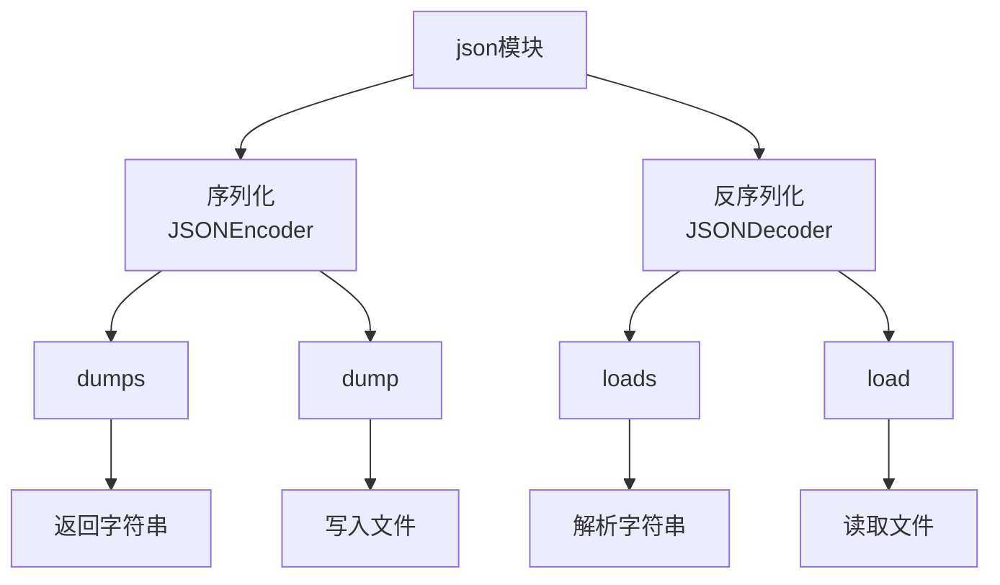

# Python标准库-json模块完全参考手册

## 概述

`json` 模块提供了Python对象和JSON数据格式之间的转换功能。JSON（JavaScript Object Notation）是一种轻量级的数据交换格式，易于人类阅读和编写，同时也易于机器解析和生成。

json模块的核心功能包括：
- 将Python对象序列化为JSON字符串
- 将JSON字符串反序列化为Python对象
- 支持自定义编码器和解码器
- 处理复杂数据类型
- 提供流式API处理大型JSON数据



## 基本类型转换

### Python到JSON转换表

| Python类型 | JSON类型 |
|-----------|---------|
| dict      | object  |
| list, tuple | array  |
| str       | string  |
| int, float, int- & float-derived Enums | number |
| True      | true    |
| False     | false   |
| None      | null    |

### JSON到Python转换表

| JSON类型 | Python类型 |
|---------|-----------|
| object  | dict      |
| array   | list      |
| string  | str       |
| number (int) | int  |
| number (real) | float |
| true    | True      |
| false   | False     |
| null    | None      |

## 序列化函数

### json.dump()

将Python对象序列化为JSON格式的流，写入文件。

```python
json.dump(obj, fp, *, skipkeys=False, ensure_ascii=True, 
          check_circular=True, allow_nan=True, cls=None, 
          indent=None, separators=None, default=None, 
          sort_keys=False, **kw)
```

#### 参数说明

- **obj**: 要序列化的Python对象
- **fp**: 文件类对象（支持`.write()`方法）
- **skipkeys**: 如果为True，跳过非基本类型的键，否则抛出TypeError
- **ensure_ascii**: 如果为True，确保所有非ASCII字符都被转义
- **check_circular**: 如果为True，检查循环引用
- **allow_nan**: 如果为True，允许序列化NaN, Infinity等值
- **cls**: 自定义JSONEncoder子类
- **indent**: 缩进级别（整数或字符串）
- **separators**: 分隔符元组`(item_separator, key_separator)`
- **default**: 处理无法序列化对象的函数
- **sort_keys**: 如果为True，按键排序字典

#### 基本使用

```python
import json

data = {
    "name": "张三",
    "age": 25,
    "scores": [85, 90, 78],
    "active": True,
    "metadata": None
}

# 写入文件
with open('data.json', 'w', encoding='utf-8') as f:
    json.dump(data, f, ensure_ascii=False, indent=2)

# data.json内容:
# {
#   "name": "张三",
#   "age": 25,
#   "scores": [
#     85,
#     90,
#     78
#   ],
#   "active": true,
#   "metadata": null
# }
```

### json.dumps()

将Python对象序列化为JSON格式的字符串。

```python
json.dumps(obj, *, skipkeys=False, ensure_ascii=True, 
           check_circular=True, allow_nan=True, cls=None, 
           indent=None, separators=None, default=None, 
           sort_keys=False, **kw)
```

#### 基本使用

```python
import json

data = {
    "name": "张三",
    "age": 25,
    "scores": [85, 90, 78]
}

# 序列化为字符串
json_str = json.dumps(data, ensure_ascii=False)
print(json_str)
# {"name": "张三", "age": 25, "scores": [85, 90, 78]}

# 美化输出
pretty_json = json.dumps(data, ensure_ascii=False, indent=2)
print(pretty_json)
# {
#   "name": "张三",
#   "age": 25,
#   "scores": [
#     85,
#     90,
#     78
#   ]
# }

# 最紧凑输出
compact_json = json.dumps(data, separators=(',', ':'))
print(compact_json)
# {"name":"张三","age":25,"scores":[85,90,78]}
```

## 反序列化函数

### json.load()

从文件读取JSON数据并反序列化为Python对象。

```python
json.load(fp, *, cls=None, object_hook=None, parse_float=None, 
          parse_int=None, parse_constant=None, object_pairs_hook=None, **kw)
```

#### 参数说明

- **fp**: 文件类对象（支持`.read()`方法）
- **cls**: 自定义JSONDecoder子类
- **object_hook**: 处理JSON对象的函数
- **parse_float**: 解析JSON浮点数的函数
- **parse_int**: 解析JSON整数的函数
- **parse_constant**: 解析JSON常量（NaN, Infinity等）的函数
- **object_pairs_hook**: 处理JSON对象键值对列表的函数

#### 基本使用

```python
import json

# 从文件读取
with open('data.json', 'r', encoding='utf-8') as f:
    data = json.load(f)

print(data)
# {'name': '张三', 'age': 25, 'scores': [85, 90, 78], 'active': True, 'metadata': None}
```

### json.loads()

从字符串解析JSON数据并反序列化为Python对象。

```python
json.loads(s, *, cls=None, object_hook=None, parse_float=None, 
           parse_int=None, parse_constant=None, object_pairs_hook=None, **kw)
```

#### 基本使用

```python
import json

json_str = '{"name": "张三", "age": 25, "scores": [85, 90, 78]}'

# 解析字符串
data = json.loads(json_str)
print(data)
# {'name': '张三', 'age': 25, 'scores': [85, 90, 78]}

# 访问数据
print(data['name'])  # 张三
print(data['scores'][0])  # 85
```

## 自定义编码器和解码器

### 自定义编码器

#### 方法1: 使用default参数

```python
import json
from datetime import datetime

def datetime_serializer(obj):
    """自定义日期时间序列化"""
    if isinstance(obj, datetime):
        return obj.isoformat()
    raise TypeError(f"Type {type(obj)} not serializable")

data = {
    "name": "张三",
    "created_at": datetime.now(),
    "updated_at": datetime(2024, 1, 15, 14, 30, 45)
}

json_str = json.dumps(data, default=datetime_serializer, ensure_ascii=False)
print(json_str)
# {"name": "张三", "created_at": "2024-01-15T14:30:45.123456", "updated_at": "2024-01-15T14:30:45"}
```

#### 方法2: 继承JSONEncoder

```python
import json
from datetime import datetime

class DateTimeEncoder(json.JSONEncoder):
    """自定义日期时间编码器"""
    def default(self, obj):
        if isinstance(obj, datetime):
            return {
                '__datetime__': True,
                'value': obj.isoformat()
            }
        return super().default(obj)

data = {
    "name": "张三",
    "created_at": datetime.now()
}

json_str = json.dumps(data, cls=DateTimeEncoder, ensure_ascii=False, indent=2)
print(json_str)
# {
#   "name": "张三",
#   "created_at": {
#     "__datetime__": true,
#     "value": "2024-01-15T14:30:45.123456"
#   }
# }
```

### 自定义解码器

#### 方法1: 使用object_hook参数

```python
import json
from datetime import datetime

def datetime_deserializer(dct):
    """自定义日期时间反序列化"""
    if '__datetime__' in dct:
        return datetime.fromisoformat(dct['value'])
    return dct

json_str = '{"name": "张三", "created_at": {"__datetime__": true, "value": "2024-01-15T14:30:45"}}'

data = json.loads(json_str, object_hook=datetime_deserializer)
print(data)
# {'name': '张三', 'created_at': datetime.datetime(2024, 1, 15, 14, 30, 45)}
```

#### 方法2: 处理特殊数值类型

```python
import json
import decimal

def decimal_decoder(dct):
    """处理Decimal类型"""
    for key, value in dct.items():
        if isinstance(value, str):
            try:
                dct[key] = decimal.Decimal(value)
            except decimal.InvalidOperation:
                pass
    return dct

json_str = '{"price": "123.45", "quantity": "10"}'

data = json.loads(json_str, object_hook=decimal_decoder)
print(data)
# {'price': Decimal('123.45'), 'quantity': Decimal('10')}
```

## 高级功能

### 处理复杂数据类型

```python
import json
from datetime import datetime, date
from decimal import Decimal

def complex_serializer(obj):
    """处理复杂数据类型的序列化"""
    if isinstance(obj, datetime):
        return {'__datetime__': obj.isoformat()}
    elif isinstance(obj, date):
        return {'__date__': obj.isoformat()}
    elif isinstance(obj, Decimal):
        return {'__decimal__': str(obj)}
    elif isinstance(obj, set):
        return {'__set__': list(obj)}
    raise TypeError(f"Type {type(obj)} not serializable")

data = {
    "name": "张三",
    "birth_date": date(1998, 5, 15),
    "balance": Decimal("12345.67"),
    "tags": {"python", "json", "database"}
}

json_str = json.dumps(data, default=complex_serializer, ensure_ascii=False, indent=2)
print(json_str)
```

### 处理循环引用

```python
import json

data = {}
data['self'] = data  # 创建循环引用

try:
    json.dumps(data)
except RecursionError as e:
    print(f"捕获到循环引用: {e}")

# 使用check_circular=False跳过检查（不推荐）
try:
    result = json.dumps(data, check_circular=False)
    print(f"跳过循环检查的结果: {result}")
except RecursionError as e:
    print(f"仍然会失败: {e}")
```

### 处理NaN和Infinity

```python
import json

data = {
    "normal": 42,
    "nan": float('nan'),
    "infinity": float('inf'),
    "negative_infinity": float('-inf')
}

# 默认允许NaN和Infinity
print(json.dumps(data))
# {"normal": 42, "nan": NaN, "infinity": Infinity, "negative_infinity": -Infinity}

# 禁止NaN和Infinity
try:
    json.dumps(data, allow_nan=False)
except ValueError as e:
    print(f"禁止NaN和Infinity时出错: {e}")
```

## 实战应用

### 1. 配置文件管理

```python
import json
import os
from pathlib import Path

class ConfigManager:
    """配置文件管理器"""

    def __init__(self, config_file='config.json'):
        self.config_file = Path(config_file)
        self.config = self._load_config()

    def _load_config(self):
        """加载配置文件"""
        if self.config_file.exists():
            with open(self.config_file, 'r', encoding='utf-8') as f:
                return json.load(f)
        return self._default_config()

    def _default_config(self):
        """默认配置"""
        return {
            "database": {
                "host": "localhost",
                "port": 5432,
                "name": "mydb"
            },
            "api": {
                "timeout": 30,
                "retry_count": 3
            },
            "features": {
                "debug": False,
                "logging": True
            }
        }

    def save_config(self):
        """保存配置文件"""
        with open(self.config_file, 'w', encoding='utf-8') as f:
            json.dump(self.config, f, ensure_ascii=False, indent=2)

    def get(self, key, default=None):
        """获取配置值"""
        keys = key.split('.')
        value = self.config
        for k in keys:
            if isinstance(value, dict) and k in value:
                value = value[k]
            else:
                return default
        return value

    def set(self, key, value):
        """设置配置值"""
        keys = key.split('.')
        config = self.config
        for k in keys[:-1]:
            if k not in config:
                config[k] = {}
            config = config[k]
        config[keys[-1]] = value

# 使用示例
config = ConfigManager()
print(config.get('database.host'))  # localhost
config.set('api.timeout', 60)
config.save_config()
```

### 2. API数据交换

```python
import json
import requests
from datetime import datetime

class APIClient:
    """API客户端"""

    def __init__(self, base_url):
        self.base_url = base_url
        self.session = requests.Session()

    def get_data(self, endpoint, params=None):
        """获取数据"""
        url = f"{self.base_url}/{endpoint}"
        response = self.session.get(url, params=params)
        response.raise_for_status()
        return response.json()

    def post_data(self, endpoint, data):
        """发送数据"""
        url = f"{self.base_url}/{endpoint}"
        headers = {'Content-Type': 'application/json'}
        response = self.session.post(url, json=data, headers=headers)
        response.raise_for_status()
        return response.json()

    def serialize_request(self, data):
        """序列化请求数据"""
        return json.dumps(data, ensure_ascii=False, indent=2)

    def deserialize_response(self, json_str):
        """反序列化响应数据"""
        return json.loads(json_str)

# 使用示例
api = APIClient('https://api.example.com')

# 获取用户数据
user_data = api.get_data('users/1')
print(f"用户数据: {user_data}")

# 创建新用户
new_user = {
    "name": "张三",
    "email": "zhangsan@example.com",
    "age": 25,
    "created_at": datetime.now().isoformat()
}

response = api.post_data('users', new_user)
print(f"创建响应: {response}")
```

### 3. 数据备份和恢复

```python
import json
import gzip
from datetime import datetime
from pathlib import Path

class BackupManager:
    """备份管理器"""

    def __init__(self, backup_dir='backups'):
        self.backup_dir = Path(backup_dir)
        self.backup_dir.mkdir(exist_ok=True)

    def create_backup(self, data, name=None):
        """创建备份"""
        if name is None:
            name = f"backup_{datetime.now().strftime('%Y%m%d_%H%M%S')}.json"

        backup_file = self.backup_dir / name
        with gzip.open(backup_file, 'wt', encoding='utf-8') as f:
            json.dump(data, f, ensure_ascii=False, indent=2)

        return backup_file

    def restore_backup(self, name):
        """恢复备份"""
        backup_file = self.backup_dir / name
        with gzip.open(backup_file, 'rt', encoding='utf-8') as f:
            return json.load(f)

    def list_backups(self):
        """列出所有备份"""
        return sorted(self.backup_dir.glob('*.json'))

    def delete_backup(self, name):
        """删除备份"""
        backup_file = self.backup_dir / name
        backup_file.unlink()

# 使用示例
backup_manager = BackupManager()

# 备份数据
data = {
    "users": [
        {"id": 1, "name": "张三", "email": "zhangsan@example.com"},
        {"id": 2, "name": "李四", "email": "lisi@example.com"}
    ],
    "metadata": {
        "version": "1.0",
        "backup_date": datetime.now().isoformat()
    }
}

backup_file = backup_manager.create_backup(data)
print(f"备份创建成功: {backup_file}")

# 恢复备份
restored_data = backup_manager.restore_backup(backup_file.name)
print(f"恢复的数据: {restored_data}")
```

### 4. 日志记录和分析

```python
import json
from datetime import datetime
from collections import defaultdict
import jsonlines

class LogAnalyzer:
    """日志分析器"""

    def __init__(self, log_file='app.log'):
        self.log_file = log_file
        self.logs = []

    def log(self, level, message, **kwargs):
        """记录日志"""
        log_entry = {
            "timestamp": datetime.now().isoformat(),
            "level": level,
            "message": message,
            **kwargs
        }
        self.logs.append(log_entry)

        # 写入文件
        with open(self.log_file, 'a', encoding='utf-8') as f:
            json.dump(log_entry, f, ensure_ascii=False)
            f.write('\n')

    def load_logs(self):
        """加载日志"""
        self.logs = []
        try:
            with open(self.log_file, 'r', encoding='utf-8') as f:
                for line in f:
                    if line.strip():
                        self.logs.append(json.loads(line))
        except FileNotFoundError:
            pass

    def analyze_logs(self):
        """分析日志"""
        stats = defaultdict(int)
        level_stats = defaultdict(int)
        hour_stats = defaultdict(int)

        for log in self.logs:
            level_stats[log['level']] += 1

            # 按小时统计
            try:
                hour = datetime.fromisoformat(log['timestamp']).hour
                hour_stats[hour] += 1
            except (ValueError, KeyError):
                pass

        return {
            "total_logs": len(self.logs),
            "level_distribution": dict(level_stats),
            "hourly_distribution": dict(hour_stats)
        }

    def export_logs(self, output_file):
        """导出日志"""
        with open(output_file, 'w', encoding='utf-8') as f:
            json.dump(self.logs, f, ensure_ascii=False, indent=2)

# 使用示例
analyzer = LogAnalyzer()

# 记录日志
analyzer.log("INFO", "应用启动", version="1.0")
analyzer.log("DEBUG", "处理请求", user_id=123, request_time=0.05)
analyzer.log("ERROR", "数据库连接失败", error_code=500)
analyzer.log("INFO", "请求处理完成", response_time=0.15)

# 分析日志
stats = analyzer.analyze_logs()
print(f"日志统计: {json.dumps(stats, ensure_ascii=False, indent=2)}")
```

### 5. 数据验证和清理

```python
import json
from typing import Dict, Any, List
from datetime import datetime

class DataValidator:
    """数据验证器"""

    def __init__(self, schema):
        self.schema = schema

    def validate(self, data: Dict[str, Any]) -> bool:
        """验证数据"""
        try:
            self._validate_dict(data, self.schema)
            return True
        except (TypeError, ValueError) as e:
            print(f"验证失败: {e}")
            return False

    def _validate_dict(self, data: Dict[str, Any], schema: Dict[str, Any]):
        """验证字典"""
        if not isinstance(data, dict):
            raise TypeError(f"期望字典类型，得到 {type(data)}")

        for key, value_schema in schema.items():
            if key not in data:
                if value_schema.get('required', False):
                    raise ValueError(f"缺少必需字段: {key}")
                continue

            value = data[key]
            value_type = value_schema.get('type')

            if value_type is not None:
                if not isinstance(value, value_type):
                    raise TypeError(f"字段 {key} 期望 {value_type}，得到 {type(value)}")

            # 验证嵌套对象
            if 'properties' in value_schema:
                self._validate_dict(value, value_schema['properties'])

            # 验证数组
            if 'items' in value_schema:
                if not isinstance(value, list):
                    raise TypeError(f"字段 {key} 期望列表类型")
                for item in value:
                    self._validate_dict(item, value_schema['items'])

    def clean_data(self, data: Dict[str, Any]) -> Dict[str, Any]:
        """清理数据"""
        cleaned = {}
        for key, value_schema in self.schema.items():
            if key not in data:
                if 'default' in value_schema:
                    cleaned[key] = value_schema['default']
                continue

            value = data[key]
            # 可以添加各种清理逻辑
            cleaned[key] = value

        return cleaned

# 使用示例
user_schema = {
    "name": {
        "type": str,
        "required": True
    },
    "age": {
        "type": int,
        "required": True,
        "default": 0
    },
    "email": {
        "type": str,
        "required": False
    },
    "metadata": {
        "type": dict,
        "properties": {
            "created_at": {"type": str},
            "updated_at": {"type": str}
        }
    }
}

validator = DataValidator(user_schema)

# 验证数据
valid_data = {
    "name": "张三",
    "age": 25,
    "email": "zhangsan@example.com",
    "metadata": {
        "created_at": datetime.now().isoformat()
    }
}

if validator.validate(valid_data):
    print("数据验证通过")
    json_str = json.dumps(valid_data, ensure_ascii=False, indent=2)
    print(json_str)
```

## 性能优化

### 1. 使用更快的JSON库

```python
import json
import time

# 对于大型数据，可以考虑使用ujson或orjson
try:
    import ujson as fast_json
    print("使用ujson")
except ImportError:
    fast_json = None
    print("ujson不可用，使用标准json")

# 性能比较
data = {"key" + str(i): "value" + str(i) for i in range(10000)}

# 标准json
start = time.time()
json_str = json.dumps(data)
json.loads(json_str)
print(f"标准json: {time.time() - start:.4f}秒")

# 如果可用，使用ujson
if fast_json:
    start = time.time()
    json_str = fast_json.dumps(data)
    fast_json.loads(json_str)
    print(f"ujson: {time.time() - start:.4f}秒")
```

### 2. 优化序列化参数

```python
import json

data = {"key" + str(i): i for i in range(1000)}

# 使用紧凑格式
compact = json.dumps(data, separators=(',', ':'))
print(f"紧凑格式长度: {len(compact)}")

# 使用标准格式
standard = json.dumps(data)
print(f"标准格式长度: {len(standard)}")

# 使用美化格式
pretty = json.dumps(data, indent=2)
print(f"美化格式长度: {len(pretty)}")
```

## 安全考虑

### 1. 验证JSON数据

```python
import json

def safe_json_loads(json_str, max_size=1024*1024):
    """安全地加载JSON"""
    # 检查数据大小
    if len(json_str) > max_size:
        raise ValueError(f"JSON数据过大: {len(json_str)} > {max_size}")

    try:
        return json.loads(json_str)
    except json.JSONDecodeError as e:
        print(f"JSON解析错误: {e}")
        return None

# 使用示例
malicious_json = "A" * (1024*1024 + 1)  # 超过限制的JSON数据

try:
    result = safe_json_loads(malicious_json)
except ValueError as e:
    print(f"安全检查: {e}")
```

### 2. 处理不受信任的数据

```python
import json

def parse_json_safe(json_str):
    """安全解析JSON"""
    try:
        data = json.loads(json_str)

        # 验证顶层类型
        if not isinstance(data, (dict, list, str, int, float, bool, type(None))):
            raise ValueError("无效的顶层类型")

        return data
    except json.JSONDecodeError as e:
        print(f"JSON解析失败: {e}")
        return None

# 使用示例
valid_json = '{"name": "张三", "age": 25}'
result = parse_json_safe(valid_json)
print(f"解析结果: {result}")
```

## 常见问题

### Q1: 如何处理JSON中的日期时间？

**A**: JSON标准不支持日期时间类型，需要自定义序列化和反序列化逻辑。通常将日期时间转换为ISO格式字符串，然后解析时再转换回来。

### Q2: 为什么中文字符被转义了？

**A**: 默认情况下，`ensure_ascii=True`会将所有非ASCII字符转义。设置`ensure_ascii=False`可以保留原始字符。

### Q3: 如何处理大型JSON文件？

**A**: 对于大型JSON文件，可以使用流式处理或分块处理。也可以考虑使用更高效的JSON库如ujson或orjson。

`json` 模块是Python中处理JSON数据的核心工具，提供了：

1. **简单的API**: `dumps/dump`和`loads/load`四个主要函数
2. **灵活的自定义**: 支持自定义编码器和解码器
3. **丰富的选项**: 提供多种参数控制序列化过程
4. **安全可靠**: 内置错误处理和验证机制
5. **广泛兼容**: 遵循JSON标准，与各种系统兼容

通过掌握 `json` 模块，您可以：
- 轻松处理JSON格式的数据交换
- 实现配置文件管理
- 进行API数据交互
- 处理日志和备份
- 实现数据验证和清理

`json` 模块是现代Python开发中不可或缺的工具，掌握它将大大提升您处理数据的能力。无论是Web开发、数据处理还是系统集成，`json` 都能提供强大而灵活的解决方案。