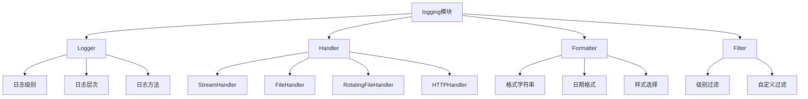

# Python标准库-logging模块完全参考手册

## 概述

`logging` 模块是Python标准库中用于记录事件日志的灵活系统。它为应用程序和库提供了灵活的事件日志记录功能，使得所有Python模块都可以参与日志记录，从而将应用程序的日志与第三方模块的消息集成在一起。

logging模块的核心功能包括：
- 分层日志记录系统
- 灵活的日志级别控制
- 多种输出处理器
- 自定义格式化器
- 线程安全日志记录
- 配置和管理能力



## 日志级别

### 预定义级别

```python
import logging

# 日志级别
print(f"NOTSET: {logging.NOTSET}")    # 0
print(f"DEBUG: {logging.DEBUG}")      # 10
print(f"INFO: {logging.INFO}")        # 20
print(f"WARNING: {logging.WARNING}")  # 30
print(f"ERROR: {logging.ERROR}")      # 40
print(f"CRITICAL: {logging.CRITICAL}") # 50
```

### 级别说明

| 级别 | 数值 | 说明 | 使用场景 |
|-----|-----|-----|---------|
| DEBUG | 10 | 调试信息 | 开发调试时使用，通常只在开发环境启用 |
| INFO | 20 | 一般信息 | 确认程序按预期工作 |
| WARNING | 30 | 警告信息 | 意外情况或潜在问题 |
| ERROR | 40 | 错误信息 | 严重问题，软件无法执行某些功能 |
| CRITICAL | 50 | 严重错误 | 程序可能无法继续运行 |

## 基本使用

### 简单配置

```python
import logging

# 基本配置
logging.basicConfig(
    level=logging.INFO,           # 设置日志级别
    format='%(asctime)s - %(name)s - %(levelname)s - %(message)s',
    filename='app.log',           # 输出到文件
    filemode='w'                 # 写入模式
)

# 记录日志
logging.debug('这是调试信息')      # 不会显示（级别太低）
logging.info('这是一般信息')       # 会显示
logging.warning('这是警告信息')    # 会显示
logging.error('这是错误信息')      # 会显示
logging.critical('这是严重错误')   # 会显示
```

### 控制台输出

```python
import logging

# 配置为控制台输出
logging.basicConfig(
    level=logging.DEBUG,
    format='%(asctime)s - %(name)s - %(levelname)s - %(message)s'
)

logger = logging.getLogger(__name__)
logger.debug('调试信息')
logger.info('一般信息')
```

## Logger对象

### 创建Logger

```python
import logging

# 创建logger（推荐使用模块名）
logger = logging.getLogger(__name__)

# 创建子logger
child_logger = logger.getChild('child')

# 创建独立logger
independent_logger = logging.getLogger('myapp.custom')

print(f"Logger名称: {logger.name}")
print(f"子Logger名称: {child_logger.name}")
```

### Logger方法

```python
import logging

logger = logging.getLogger(__name__)

# 不同级别的日志记录
logger.debug('调试信息')
logger.info('一般信息')
logger.warning('警告信息')
logger.error('错误信息')
logger.critical('严重错误')

# 使用log方法
logger.log(logging.WARNING, '使用log方法的警告')

# 记录异常信息
try:
    1 / 0
except Exception as e:
    logger.exception('发生异常')  # 自动包含异常信息

# 带参数的日志记录
logger.info('用户 %s 登录系统，IP: %s', '张三', '192.168.1.1')

# 带额外参数的日志记录
logger.info('用户登录', extra={'username': '张三', 'ip': '192.168.1.1'})
```

### Logger配置

```python
import logging

logger = logging.getLogger(__name__)

# 设置日志级别
logger.setLevel(logging.DEBUG)

# 获取有效级别
effective_level = logger.getEffectiveLevel()
print(f"有效级别: {effective_level}")

# 检查是否启用某个级别
if logger.isEnabledFor(logging.INFO):
    print("INFO级别已启用")

# 添加处理器
console_handler = logging.StreamHandler()
logger.addHandler(console_handler)

# 移除处理器
logger.removeHandler(console_handler)
```

## Handler对象

### StreamHandler

```python
import logging

# 创建控制台处理器
console_handler = logging.StreamHandler()
console_handler.setLevel(logging.INFO)

# 创建logger并添加处理器
logger = logging.getLogger(__name__)
logger.setLevel(logging.DEBUG)
logger.addHandler(console_handler)

# 记录日志
logger.info('这条信息会显示')
logger.debug('这条信息不会显示')
```

### FileHandler

```python
import logging

# 创建文件处理器
file_handler = logging.FileHandler('app.log', mode='a')
file_handler.setLevel(logging.DEBUG)

# 设置格式化器
formatter = logging.Formatter('%(asctime)s - %(name)s - %(levelname)s - %(message)s')
file_handler.setFormatter(formatter)

# 添加到logger
logger = logging.getLogger(__name__)
logger.addHandler(file_handler)

# 记录日志
logger.info('信息写入文件')
```

### RotatingFileHandler

```python
import logging
from logging.handlers import RotatingFileHandler

# 创建滚动文件处理器（按大小滚动）
rotating_handler = RotatingFileHandler(
    'app.log',
    maxBytes=1024*1024,  # 1MB
    backupCount=5,       # 保留5个备份
    encoding='utf-8'
)
rotating_handler.setLevel(logging.DEBUG)

# 创建logger
logger = logging.getLogger(__name__)
logger.addHandler(rotating_handler)
logger.setLevel(logging.DEBUG)

# 测试
for i in range(1000):
    logger.info(f'日志记录 {i}')
```

### TimedRotatingFileHandler

```python
import logging
from logging.handlers import TimedRotatingFileHandler

# 创建滚动文件处理器（按时间滚动）
timed_handler = TimedRotatingFileHandler(
    'app.log',
    when='midnight',  # 每天午夜滚动
    interval=1,       # 间隔
    backupCount=7,    # 保留7天
    encoding='utf-8'
)
timed_handler.setLevel(logging.INFO)

# 创建logger
logger = logging.getLogger(__name__)
logger.addHandler(timed_handler)
logger.info('按时间滚动的日志记录')
```

### 其他Handler

```python
import logging
from logging.handlers import (
    SocketHandler,      # 网络socket处理器
    DatagramHandler,   # UDP数据包处理器
    HTTPHandler,       # HTTP处理器
    SMTPHandler,       # 邮件处理器
    SysLogHandler,     # 系统日志处理器
    NTEventLogHandler, # Windows事件日志
    MemoryHandler      # 内存处理器
)

# SocketHandler示例
socket_handler = SocketHandler('localhost', logging.handlers.DEFAULT_TCP_LOGGING_PORT)

# HTTPHandler示例
http_handler = HTTPHandler('localhost:8080', '/log')

# SMTPHandler示例
smtp_handler = SMTPHandler('smtp.example.com', 'from@example.com', 'to@example.com', 'Error Notification')
```

## Formatter对象

### 基本格式化

```python
import logging

# 创建格式化器
formatter = logging.Formatter(
    fmt='%(asctime)s - %(name)s - %(levelname)s - %(message)s',
    datefmt='%Y-%m-%d %H:%M:%S'
)

# 应用到handler
handler = logging.StreamHandler()
handler.setFormatter(formatter)

# 创建logger
logger = logging.getLogger(__name__)
logger.addHandler(handler)
logger.setLevel(logging.INFO)

logger.info('格式化后的日志信息')
```

### 格式化属性

```python
import logging

# 可用的格式化属性
format_string = '''
%(name)s       - Logger名称
%(levelname)s   - 日志级别
%(levelno)s    - 日志级别数值
%(pathname)s   - 完整文件路径
%(filename)s   - 文件名
%(module)s     - 模块名
%(lineno)d     - 行号
%(funcName)s   - 函数名
%(created)f    - 日志创建时间戳
%(asctime)s    - 格式化的创建时间
%(msecs)d      - 毫秒部分
%(thread)d     - 线程ID
%(threadName)s - 线程名称
%(process)d    - 进程ID
%(message)s    - 日志消息
%(processName)s- 进程名称
'''

formatter = logging.Formatter(format_string.strip())
print(formatter.formatTime)
```

### 自定义格式化

```python
import logging

class CustomFormatter(logging.Formatter):
    """自定义格式化器"""
    
    # 颜色代码
    COLORS = {
        'DEBUG': '\033[36m',      # 青色
        'INFO': '\033[32m',       # 绿色
        'WARNING': '\033[33m',    # 黄色
        'ERROR': '\033[31m',      # 红色
        'CRITICAL': '\033[35m',   # 紫色
        'RESET': '\033[0m'        # 重置
    }
    
    def format(self, record):
        # 获取原始格式化文本
        log_message = super().format(record)
        
        # 添加颜色
        levelname = record.levelname
        if levelname in self.COLORS:
            log_message = log_message.replace(
                levelname,
                f"{self.COLORS[levelname]}{levelname}{self.COLORS['RESET']}"
            )
        
        return log_message

# 使用自定义格式化器
formatter = CustomFormatter('%(asctime)s - %(levelname)s - %(message)s')
handler = logging.StreamHandler()
handler.setFormatter(formatter)

logger = logging.getLogger(__name__)
logger.addHandler(handler)
logger.setLevel(logging.DEBUG)

logger.debug('彩色的调试信息')
logger.info('彩色的一般信息')
logger.warning('彩色的警告信息')
logger.error('彩色的错误信息')
```

## Filter对象

### 基本Filter

```python
import logging

class CustomFilter(logging.Filter):
    """自定义过滤器"""
    
    def __init__(self, name=None):
        super().__init__(name)
    
    def filter(self, record):
        # 只允许特定名称的logger通过
        if hasattr(record, 'name') and 'myapp' in record.name:
            return True
        return False

# 创建并添加过滤器
logger = logging.getLogger('myapp')
logger.addFilter(CustomFilter())

logger.info('这条信息会被记录')
```

### 上下文Filter

```python
import logging

class ContextFilter(logging.Filter):
    """上下文过滤器"""
    
    def __init__(self, context_key, context_value):
        super().__init__()
        self.context_key = context_key
        self.context_value = context_value
    
    def filter(self, record):
        # 添加上下文信息
        setattr(record, self.context_key, self.context_value)
        return True

# 添加上下文过滤器
logger = logging.getLogger(__name__)
logger.addFilter(ContextFilter('user_id', '12345'))

# 设置格式化器包含上下文
formatter = logging.Formatter('%(asctime)s - %(user_id)s - %(message)s')
handler = logging.StreamHandler()
handler.setFormatter(formatter)
logger.addHandler(handler)

logger.info('包含用户ID的日志')
```

## 配置系统

### 字典配置

```python
import logging
import logging.config

# 配置字典
LOGGING_CONFIG = {
    'version': 1,
    'disable_existing_loggers': False,
    'formatters': {
        'standard': {
            'format': '%(asctime)s [%(levelname)s] %(name)s: %(message)s'
        },
        'detailed': {
            'format': '%(asctime)s [%(levelname)s] %(name)s [%(filename)s:%(lineno)d] %(message)s'
        }
    },
    'handlers': {
        'console': {
            'class': 'logging.StreamHandler',
            'level': 'INFO',
            'formatter': 'standard',
            'stream': 'ext://sys.stdout'
        },
        'file': {
            'class': 'logging.FileHandler',
            'level': 'DEBUG',
            'formatter': 'detailed',
            'filename': 'app.log',
            'mode': 'a'
        }
    },
    'loggers': {
        '': {  # root logger
            'handlers': ['console'],
            'level': 'INFO',
            'propagate': False
        },
        'myapp': {
            'handlers': ['console', 'file'],
            'level': 'DEBUG',
            'propagate': False
        }
    }
}

# 应用配置
logging.config.dictConfig(LOGGING_CONFIG)

# 使用logger
logger = logging.getLogger('myapp')
logger.debug('调试信息')
logger.info('一般信息')
```

### 文件配置

```python
import logging.config

# 从文件加载配置
logging.config.fileConfig('logging.conf')

# 使用logger
logger = logging.getLogger(__name__)
logger.info('从配置文件加载的日志')
```

## 实战应用

### 1. 应用日志系统

```python
import logging
import logging.handlers
from pathlib import Path
from datetime import datetime

class ApplicationLogger:
    """应用程序日志系统"""

    def __init__(self, app_name, log_dir='logs'):
        self.app_name = app_name
        self.log_dir = Path(log_dir)
        self.log_dir.mkdir(exist_ok=True)
        
        self._setup_logging()

    def _setup_logging(self):
        """设置日志系统"""
        # 创建logger
        self.logger = logging.getLogger(self.app_name)
        self.logger.setLevel(logging.DEBUG)
        
        # 防止重复添加处理器
        if self.logger.handlers:
            return
        
        # 控制台处理器
        console_handler = logging.StreamHandler()
        console_handler.setLevel(logging.INFO)
        console_formatter = logging.Formatter(
            '%(asctime)s [%(levelname)s] %(name)s: %(message)s',
            datefmt='%Y-%m-%d %H:%M:%S'
        )
        console_handler.setFormatter(console_formatter)
        self.logger.addHandler(console_handler)
        
        # 文件处理器
        today = datetime.now().strftime('%Y-%m-%d')
        file_handler = logging.FileHandler(
            self.log_dir / f'{self.app_name}_{today}.log',
            encoding='utf-8'
        )
        file_handler.setLevel(logging.DEBUG)
        file_formatter = logging.Formatter(
            '%(asctime)s [%(levelname)s] %(name)s [%(filename)s:%(lineno)d] %(message)s',
            datefmt='%Y-%m-%d %H:%M:%S'
        )
        file_handler.setFormatter(file_formatter)
        self.logger.addHandler(file_handler)
        
        # 错误文件处理器
        error_handler = logging.FileHandler(
            self.log_dir / f'{self.app_name}_error.log',
            encoding='utf-8'
        )
        error_handler.setLevel(logging.ERROR)
        error_handler.setFormatter(file_formatter)
        self.logger.addHandler(error_handler)

    def get_logger(self, name=None):
        """获取子logger"""
        if name:
            return self.logger.getChild(name)
        return self.logger

# 使用示例
app_logger = ApplicationLogger('myapp')

# 获取主logger
logger = app_logger.get_logger()
logger.info('应用程序启动')

# 获取子logger
module_logger = app_logger.get_logger('database')
module_logger.info('数据库连接成功')
```

### 2. 请求跟踪日志

```python
import logging
import uuid
from contextlib import contextmanager

class RequestLogger:
    """请求跟踪日志"""

    def __init__(self):
        self.logger = logging.getLogger('request')
        self.logger.setLevel(logging.INFO)
        
        if not self.logger.handlers:
            handler = logging.StreamHandler()
            formatter = logging.Formatter(
                '%(asctime)s [%(request_id)s] [%(user_id)s] %(message)s'
            )
            handler.setFormatter(formatter)
            self.logger.addHandler(handler)

    @contextmanager
    def request_context(self, user_id='anonymous'):
        """请求上下文管理器"""
        request_id = str(uuid.uuid4())
        
        # 添加上下文过滤器
        class RequestContextFilter(logging.Filter):
            def __init__(self, request_id, user_id):
                super().__init__()
                self.request_id = request_id
                self.user_id = user_id
            
            def filter(self, record):
                record.request_id = self.request_id
                record.user_id = self.user_id
                return True
        
        filter_obj = RequestContextFilter(request_id, user_id)
        self.logger.addFilter(filter_obj)
        
        try:
            yield request_id
        finally:
            self.logger.removeFilter(filter_obj)

    def log_request(self, message, **kwargs):
        """记录请求日志"""
        self.logger.info(message, extra=kwargs)

# 使用示例
request_logger = RequestLogger()

def process_request(user_data):
    """处理请求"""
    with request_logger.request_context(user_data.get('user_id', 'anonymous')) as request_id:
        request_logger.log_request('开始处理请求')
        
        try:
            # 处理请求逻辑
            result = perform_business_logic(user_data)
            request_logger.log_request('请求处理成功', result=result)
            return result
        except Exception as e:
            request_logger.log_request('请求处理失败', error=str(e))
            raise

def perform_business_logic(data):
    """业务逻辑"""
    return {'status': 'success', 'data': data}
```

### 3. 性能监控日志

```python
import logging
import time
import functools
from typing import Callable

class PerformanceLogger:
    """性能监控日志"""

    def __init__(self):
        self.logger = logging.getLogger('performance')
        self.logger.setLevel(logging.INFO)
        
        if not self.logger.handlers:
            handler = logging.StreamHandler()
            formatter = logging.Formatter(
                '%(asctime)s [%(function_name)s] 耗时: %(elapsed_time).4f秒 - %(message)s'
            )
            handler.setFormatter(formatter)
            self.logger.addHandler(handler)

    def monitor(self, func: Callable) -> Callable:
        """性能监控装饰器"""
        @functools.wraps(func)
        def wrapper(*args, **kwargs):
            start_time = time.time()
            try:
                result = func(*args, **kwargs)
                elapsed_time = time.time() - start_time
                self.logger.info(f'{func.__name__} 执行完成', 
                               function_name=func.__name__,
                               elapsed_time=elapsed_time)
                return result
            except Exception as e:
                elapsed_time = time.time() - start_time
                self.logger.error(f'{func.__name__} 执行失败: {str(e)}', 
                                function_name=func.__name__,
                                elapsed_time=elapsed_time)
                raise
        return wrapper

    def log_performance(self, operation_name, elapsed_time, success=True):
        """记录性能信息"""
        level = logging.INFO if success else logging.ERROR
        self.logger.log(level, f'{operation_name} {"成功" if success else "失败"}',
                     function_name=operation_name,
                     elapsed_time=elapsed_time)

# 使用示例
perf_logger = PerformanceLogger()

@perf_logger.monitor
def process_large_data():
    """处理大量数据"""
    time.sleep(1.5)  # 模拟耗时操作
    return {'result': 'success'}

# 手动记录性能
start_time = time.time()
try:
    # 执行一些操作
    time.sleep(0.5)
    perf_logger.log_performance('数据查询', time.time() - start_time, success=True)
except Exception:
    perf_logger.log_performance('数据查询', time.time() - start_time, success=False)
```

### 4. 多环境日志配置

```python
import logging
import os
from pathlib import Path

class EnvironmentLogger:
    """多环境日志配置"""

    def __init__(self, environment=None):
        self.environment = environment or os.getenv('ENVIRONMENT', 'development')
        self._setup_logging()

    def _setup_logging(self):
        """根据环境设置日志"""
        log_level = self._get_log_level()
        log_file = self._get_log_file()
        
        # 创建root logger
        root_logger = logging.getLogger()
        root_logger.setLevel(log_level)
        
        # 清除现有处理器
        root_logger.handlers.clear()
        
        # 根据环境添加处理器
        if self.environment == 'development':
            # 开发环境：详细日志，控制台输出
            console_handler = logging.StreamHandler()
            console_handler.setLevel(logging.DEBUG)
            formatter = logging.Formatter(
                '%(asctime)s [%(levelname)s] %(name)s [%(filename)s:%(lineno)d] %(message)s',
                datefmt='%Y-%m-%d %H:%M:%S'
            )
            console_handler.setFormatter(formatter)
            root_logger.addHandler(console_handler)
        
        elif self.environment == 'production':
            # 生产环境：INFO级别，文件输出
            file_handler = logging.FileHandler(log_file, encoding='utf-8')
            file_handler.setLevel(logging.INFO)
            formatter = logging.Formatter(
                '%(asctime)s [%(levelname)s] %(name)s: %(message)s',
                datefmt='%Y-%m-%d %H:%M:%S'
            )
            file_handler.setFormatter(formatter)
            root_logger.addHandler(file_handler)
            
            # 错误单独记录
            error_handler = logging.FileHandler(
                log_file.replace('.log', '_error.log'),
                encoding='utf-8'
            )
            error_handler.setLevel(logging.ERROR)
            error_handler.setFormatter(formatter)
            root_logger.addHandler(error_handler)
        
        else:
            # 默认环境：INFO级别，控制台输出
            console_handler = logging.StreamHandler()
            console_handler.setLevel(logging.INFO)
            formatter = logging.Formatter(
                '%(asctime)s [%(levelname)s] %(name)s: %(message)s'
            )
            console_handler.setFormatter(formatter)
            root_logger.addHandler(console_handler)

    def _get_log_level(self):
        """获取日志级别"""
        level_map = {
            'development': logging.DEBUG,
            'testing': logging.INFO,
            'staging': logging.INFO,
            'production': logging.INFO
        }
        return level_map.get(self.environment, logging.INFO)

    def _get_log_file(self):
        """获取日志文件路径"""
        log_dir = Path('logs')
        log_dir.mkdir(exist_ok=True)
        return log_dir / f'app_{self.environment}.log'

    def get_logger(self, name):
        """获取logger"""
        return logging.getLogger(name)

# 使用示例
env_logger = EnvironmentLogger('production')
logger = env_logger.get_logger(__name__)
logger.info('生产环境日志')
logger.debug('这条调试信息不会显示')
```

### 5. 日志轮转和归档

```python
import logging
import logging.handlers
from pathlib import Path
from datetime import datetime, timedelta
import gzip
import shutil

class LogArchiver:
    """日志归档器"""

    def __init__(self, log_dir='logs', archive_dir='archive', days_to_keep=30):
        self.log_dir = Path(log_dir)
        self.archive_dir = Path(archive_dir)
        self.days_to_keep = days_to_keep
        
        self.archive_dir.mkdir(exist_ok=True)

    def setup_rotating_handler(self, app_name):
        """设置滚动处理器"""
        # 按大小滚动的处理器
        rotating_handler = logging.handlers.RotatingFileHandler(
            self.log_dir / f'{app_name}.log',
            maxBytes=10*1024*1024,  # 10MB
            backupCount=10,
            encoding='utf-8'
        )
        
        # 设置格式化器
        formatter = logging.Formatter(
            '%(asctime)s [%(levelname)s] %(name)s: %(message)s'
        )
        rotating_handler.setFormatter(formatter)
        
        return rotating_handler

    def setup_timed_handler(self, app_name):
        """设置定时滚动处理器"""
        # 按天滚动的处理器
        timed_handler = logging.handlers.TimedRotatingFileHandler(
            self.log_dir / f'{app_name}.log',
            when='midnight',
            interval=1,
            backupCount=30,
            encoding='utf-8'
        )
        
        # 设置格式化器
        formatter = logging.Formatter(
            '%(asctime)s [%(levelname)s] %(name)s: %(message)s'
        )
        timed_handler.setFormatter(formatter)
        
        return timed_handler

    def archive_old_logs(self):
        """归档旧日志"""
        cutoff_date = datetime.now() - timedelta(days=self.days_to_keep)
        
        # 查找需要归档的日志文件
        for log_file in self.log_dir.glob('*.log.*'):
            try:
                # 从文件名提取日期
                file_date = datetime.strptime(log_file.stem.split('.')[-1], '%Y-%m-%d')
                
                if file_date < cutoff_date:
                    # 压缩并归档
                    archive_path = self.archive_dir / log_file.name
                    with open(log_file, 'rb') as f_in:
                        with gzip.open(archive_path + '.gz', 'wb') as f_out:
                            shutil.copyfileobj(f_in, f_out)
                    
                    # 删除原始文件
                    log_file.unlink()
                    print(f"已归档: {log_file.name}")
            
            except (ValueError, IndexError) as e:
                print(f"无法解析文件日期: {log_file.name}: {e}")

    def cleanup_archives(self):
        """清理过期的归档文件"""
        cutoff_date = datetime.now() - timedelta(days=self.days_to_keep * 2)
        
        for archive_file in self.archive_dir.glob('*.gz'):
            try:
                # 从文件名提取日期
                date_str = archive_file.stem.split('.')[-2]
                file_date = datetime.strptime(date_str, '%Y-%m-%d')
                
                if file_date < cutoff_date:
                    archive_file.unlink()
                    print(f"已删除过期归档: {archive_file.name}")
            
            except (ValueError, IndexError) as e:
                print(f"无法解析归档文件日期: {archive_file.name}: {e}")

# 使用示例
archiver = LogArchiver()

# 设置滚动日志处理器
handler = archiver.setup_rotating_handler('myapp')
logger = logging.getLogger('myapp')
logger.addHandler(handler)
logger.setLevel(logging.INFO)

# 归档旧日志
archiver.archive_old_logs()
archiver.cleanup_archives()
```

## 性能优化

### 1. 延迟日志记录

```python
import logging

class LazyFormatter:
    """延迟格式化器"""
    
    def __init__(self, fmt):
        self.fmt = fmt
    
    def __str__(self):
        # 只在需要时才进行格式化
        import time
        return self.fmt.format(timestamp=time.time())

# 使用延迟格式化
logger = logging.getLogger(__name__)
logger.info(LazyFormatter("时间戳: {timestamp}"))
```

### 2. 条件日志记录

```python
import logging

logger = logging.getLogger(__name__)

# 检查日志级别后再执行昂贵的操作
if logger.isEnabledFor(logging.DEBUG):
    expensive_data = perform_expensive_operation()
    logger.debug(f"调试数据: {expensive_data}")
```

### 3. 异步日志记录

```python
import logging
import queue
import threading

class AsyncLogHandler(logging.Handler):
    """异步日志处理器"""
    
    def __init__(self, handler):
        super().__init__()
        self.handler = handler
        self.queue = queue.Queue()
        self.thread = threading.Thread(target=self._process, daemon=True)
        self.thread.start()
    
    def emit(self, record):
        self.queue.put(record)
    
    def _process(self):
        while True:
            record = self.queue.get()
            self.handler.emit(record)
    
    def close(self):
        self.queue.put(None)
        self.thread.join()
        super().close()

# 使用异步处理器
file_handler = logging.FileHandler('app.log')
async_handler = AsyncLogHandler(file_handler)

logger = logging.getLogger(__name__)
logger.addHandler(async_handler)
logger.info('异步日志记录')
```

## 安全考虑

### 1. 防止日志注入

```python
import logging

class SafeFormatter(logging.Formatter):
    """安全的格式化器"""
    
    def format(self, record):
        # 清理用户输入中的潜在恶意内容
        if hasattr(record, 'msg'):
            record.msg = str(record.msg).replace('\n', '\\n').replace('\r', '\\r')
        return super().format(record)

# 使用安全格式化器
formatter = SafeFormatter('%(asctime)s - %(message)s')
handler = logging.StreamHandler()
handler.setFormatter(formatter)
```

### 2. 敏感信息过滤

```python
import logging

class SensitiveDataFilter(logging.Filter):
    """敏感数据过滤器"""
    
    SENSITIVE_PATTERNS = [
        r'password["\s]*[:=]["\s]*\S+',  # 密码
        r'token["\s]*[:=]["\s]*\S+',     # 令牌
        r'api[_-]?key["\s]*[:=]["\s]*\S+', # API密钥
    ]
    
    def filter(self, record):
        import re
        msg = str(record.msg)
        
        for pattern in self.SENSITIVE_PATTERNS:
            msg = re.sub(pattern, '******', msg, flags=re.IGNORECASE)
        
        record.msg = msg
        return True

# 添加敏感信息过滤器
logger = logging.getLogger(__name__)
logger.addFilter(SensitiveDataFilter())
logger.info('password=secret123 and token=abc456')
# 输出: password=****** and token=******
```

## 常见问题

### Q1: 如何避免日志重复记录？

**A**: 检查logger的`propagate`属性和handler配置。避免给父子logger都添加相同的handler，或者设置`propagate=False`。

### Q2: 如何在生产环境中优化日志性能？

**A**: 使用适当的日志级别，避免在生产环境中使用DEBUG级别，考虑使用异步日志记录，并设置合理的日志轮转策略。

### Q3: 如何在日志中记录调用栈信息？

**A**: 使用`stack_info=True`参数或在异常处理器中记录异常信息。可以使用`logger.exception()`在异常上下文中自动记录堆栈跟踪。

`logging` 模块是Python中最重要和最强大的日志记录系统，提供了：

1. **分层日志系统**: Logger层次结构，便于模块化日志管理
2. **灵活的级别控制**: 五个预定义级别，支持自定义级别
3. **多种处理器**: 控制台、文件、网络、邮件等多种输出方式
4. **强大的格式化**: 支持自定义格式、颜色输出、结构化日志
5. **高级过滤功能**: 支持内容过滤、级别过滤、上下文过滤
6. **线程安全**: 天然支持多线程环境
7. **配置灵活**: 支持代码配置、字典配置、文件配置

通过掌握 `logging` 模块，您可以：
- 构建企业级日志系统
- 实现请求跟踪和性能监控
- 支持多环境日志配置
- 实现日志轮转和归档
- 进行日志安全防护
- 优化日志性能

`logging` 模块是专业Python应用程序的必备工具，掌握它将使您的应用程序更加健壮、可维护和可调试。无论是开发小型脚本还是大型系统，`logging` 模块都能提供完善的日志记录解决方案。