# Python标准库-math模块完全参考手册

## 概述

`math` 模块提供了对C标准中定义的常见数学函数和常量的访问。该模块提供了丰富的数学计算功能，涵盖了从基本运算到高级数学函数的各个方面。

math模块的核心功能包括：
- 数论函数（阶乘、组合、排列等）
- 浮点数运算（取整、绝对值、模运算等）
- 浮点数操作（复制符号、分解等）
- 幂运算和对数函数
- 求和和乘积函数
- 三角函数
- 双曲函数
- 特殊函数（误差函数、伽马函数等）
- 数学常量

```mermaid
graph TD
    A[math模块] --> B[数论函数]
    A --> C[浮点运算]
    A --> D[浮点操作]
    A --> E[幂和对数]
    A --> F[求和乘积]
    A --> G[三角函数]
    A --> H[双曲函数]
    A --> I[特殊函数]
    A --> J[数学常量]
    
    B --> B1[factorial]
    B --> B2[comb]
    B --> B3[perm]
    B --> B4[gcd]
    B --> B5[lcm]
    
    C --> C1[ceil]
    C --> C2[floor]
    C --> C3[fabs]
    C --> C4[modf]
    
    D --> D1[copysign]
    D --> D2[frexp]
    D --> D3[isclose]
    D --> D4[isnan]
    
    E --> E1[pow]
    E --> E2[exp]
    E --> E3[log]
    E --> E4[sqrt]
    
    F --> F1[fsum]
    F --> F2[prod]
    F --> F3[sumprod]
    
    G --> G1[sin]
    G --> G2[cos]
    G --> G3[tan]
    G --> G4[atan2]
    
    H --> H1[sinh]
    H --> H2[cosh]
    H --> H3[tanh]
    
    I --> I1[erf]
    I --> I2[gamma]
    
    J --> J1[pi]
    J --> J2[e]
    J --> J3[tau]
    J --> J4[inf]
    J --> J5[nan]
```



## 数论函数

### 基本数论运算

```python
import math

# 阶乘函数
print(f"5的阶乘: {math.factorial(5)}")  # 120
print(f"10的阶乘: {math.factorial(10)}")  # 3628800

# 组合数：从n个中选k个
print(f"从5个中选2个的组合数: {math.comb(5, 2)}")  # 10
print(f"从10个中选3个的组合数: {math.comb(10, 3)}")  # 120

# 排列数：从n个中选k个有序排列
print(f"从5个中选2个的排列数: {math.perm(5, 2)}")  # 20
print(f"5个的全排列: {math.perm(5)}")  # 120

# 最大公约数
print(f"12和18的最大公约数: {math.gcd(12, 18)}")  # 6
print(f"24, 36, 48的最大公约数: {math.gcd(24, 36, 48)}")  # 12

# 最小公倍数
print(f"12和18的最小公倍数: {math.lcm(12, 18)}")  # 36
print(f"4, 6, 8的最小公倍数: {math.lcm(4, 6, 8)}")  # 24

# 整数平方根
print(f"16的整数平方根: {math.isqrt(16)}")  # 4
print(f"20的整数平方根: {math.isqrt(20)}")  # 4
print(f"100的整数平方根: {math.isqrt(100)}")  # 10
```

### 组合数学应用

```python
import math

class CombinatoricsCalculator:
    """组合数学计算器"""
    
    @staticmethod
    def binomial_probability(n, k, p):
        """二项分布概率"""
        return math.comb(n, k) * (p ** k) * ((1 - p) ** (n - k))
    
    @staticmethod
    def permutations(n, r):
        """排列数计算"""
        return math.perm(n, r)
    
    @staticmethod
    def combinations(n, r):
        """组合数计算"""
        return math.comb(n, r)
    
    @staticmethod
    def pascal_triangle_row(n):
        """生成帕斯卡三角形第n行"""
        return [math.comb(n, k) for k in range(n + 1)]
    
    @staticmethod
    def factorial_range(n):
        """生成1到n的阶乘序列"""
        return [math.factorial(i) for i in range(1, n + 1)]

# 使用示例
calc = CombinatoricsCalculator()

# 二项分布概率（抛硬币10次，正好5次正面）
prob = calc.binomial_probability(10, 5, 0.5)
print(f"抛硬币10次正好5次正面的概率: {prob:.4f}")

# 帕斯卡三角形
print(f"帕斯卡三角形第5行: {calc.pascal_triangle_row(5)}")

# 阶乘序列
print(f"1到5的阶乘: {calc.factorial_range(5)}")
```

## 浮点数运算

### 基本浮点运算

```python
import math

# 向上取整
print(f"ceil(3.2) = {math.ceil(3.2)}")  # 4
print(f"ceil(-3.2) = {math.ceil(-3.2)}")  # -3
print(f"ceil(3.0) = {math.ceil(3.0)}")  # 3

# 向下取整
print(f"floor(3.2) = {math.floor(3.2)}")  # 3
print(f"floor(-3.2) = {math.floor(-3.2)}")  # -4
print(f"floor(3.0) = {math.floor(3.0)}")  # 3

# 截断（向零取整）
print(f"trunc(3.7) = {math.trunc(3.7)}")  # 3
print(f"trunc(-3.7) = {math.trunc(-3.7)}")  # -3

# 绝对值
print(f"fabs(-5.5) = {math.fabs(-5.5)}")  # 5.5
print(f"fabs(5.5) = {math.fabs(5.5)}")  # 5.5

# 分解整数和小数部分
integer_part, fractional_part = math.modf(3.14159)
print(f"modf(3.14159): 整数部分={integer_part}, 小数部分={fractional_part}")

integer_part, fractional_part = math.modf(-3.14159)
print(f"modf(-3.14159): 整数部分={integer_part}, 小数部分={fractional_part}")
```

### 高级浮点运算

```python
import math

# 模运算（浮点数）
print(f"fmod(5.3, 2) = {math.fmod(5.3, 2)}")  # 1.3
print(f"fmod(-5.3, 2) = {math.fmod(-5.3, 2)}")  # -1.3

# IEEE 754风格的余数
print(f"remainder(7.5, 2.0) = {math.remainder(7.5, 2.0)}")  # -0.5
print(f"remainder(7.0, 2.0) = {math.remainder(7.0, 2.0)}")  # 1.0

# 融合乘加运算 (x * y) + z
result = math.fma(2.0, 3.0, 4.0)  # (2 * 3) + 4 = 10
print(f"fma(2.0, 3.0, 4.0) = {result}")  # 10.0

# 比较直接运算
direct_result = (2.0 * 3.0) + 4.0
print(f"直接计算 (2.0 * 3.0) + 4.0 = {direct_result}")
```

## 浮点数操作

### 浮点数分析和比较

```python
import math

# 复制符号
print(f"copysign(3.0, -2.0) = {math.copysign(3.0, -2.0)}")  # -3.0
print(f"copysign(-3.0, 2.0) = {math.copysign(-3.0, 2.0)}")  # 3.0

# 分解尾数和指数
mantissa, exponent = math.frexp(12.0)
print(f"frexp(12.0): 尾数={mantissa}, 指数={exponent}")
print(f"验证: {mantissa} * 2^{exponent} = {mantissa * (2 ** exponent)}")

# 浮点数比较
print(f"isclose(1.0000001, 1.0) = {math.isclose(1.0000001, 1.0)}")  # True
print(f"isclose(1.001, 1.0, rel_tol=0.001) = {math.isclose(1.001, 1.0, rel_tol=0.001)}")  # True
print(f"isclose(1.1, 1.0, abs_tol=0.1) = {math.isclose(1.1, 1.0, abs_tol=0.1)}")  # True

# 特殊值检查
print(f"isfinite(1.0) = {math.isfinite(1.0)}")  # True
print(f"isfinite(float('inf')) = {math.isfinite(float('inf'))}")  # False
print(f"isinf(float('inf')) = {math.isinf(float('inf'))}")  # True
print(f"isnan(float('nan')) = {math.isnan(float('nan'))}")  # True

# 下一个浮点数
print(f"nextafter(1.0, 2.0) = {math.nextafter(1.0, 2.0)}")  # 1.0000000000000002
print(f"nextafter(1.0, 0.0) = {math.nextafter(1.0, 0.0)}")  # 0.9999999999999999

# 最小精度单位
print(f"ulp(1.0) = {math.ulp(1.0)}")  # 2.220446049250313e-16
print(f"ulp(100.0) = {math.ulp(100.0)}")  # 1.4210854715202004e-14
```

### 数值精度处理

```python
import math

class PrecisionCalculator:
    """精度计算器"""
    
    @staticmethod
    def safe_divide(a, b):
        """安全除法"""
        if b == 0:
            return float('inf') if a > 0 else float('-inf') if a < 0 else float('nan')
        return a / b
    
    @staticmethod
    def compare_with_tolerance(a, b, rel_tol=1e-9, abs_tol=0.0):
        """带容差的比较"""
        return math.isclose(a, b, rel_tol=rel_tol, abs_tol=abs_tol)
    
    @staticmethod
    def round_to_significant_digits(x, digits):
        """四舍五入到有效数字"""
        if x == 0:
            return 0.0
        return round(x, digits - int(math.floor(math.log10(abs(x)))) - 1)
    
    @staticmethod
    def is_valid_number(x):
        """检查是否为有效数字"""
        return math.isfinite(x) and not math.isnan(x)

# 使用示例
calc = PrecisionCalculator()

print(f"安全除法 10/3 = {calc.safe_divide(10, 3)}")
print(f"安全除法 10/0 = {calc.safe_divide(10, 0)}")
print(f"比较 1.0000001 和 1.0: {calc.compare_with_tolerance(1.0000001, 1.0)}")
print(f"四舍五入到3位有效数字: {calc.round_to_significant_digits(123.456, 3)}")
print(f"是否为有效数字: {calc.is_valid_number(3.14)}")
```

## 幂运算和对数函数

### 基本幂运算

```python
import math

# 幂运算
print(f"pow(2, 3) = {math.pow(2, 3)}")  # 8.0
print(f"pow(2, 10) = {math.pow(2, 10)}")  # 1024.0
print(f"pow(9, 0.5) = {math.pow(9, 0.5)}")  # 3.0

# 平方根
print(f"sqrt(16) = {math.sqrt(16)}")  # 4.0
print(f"sqrt(2) = {math.sqrt(2)}")  # 1.4142135623730951
print(f"sqrt(0.25) = {math.sqrt(0.25)}")  # 0.5

# 立方根
print(f"cbrt(8) = {math.cbrt(8)}")  # 2.0
print(f"cbrt(27) = {math.cbrt(27)}")  # 3.0
print(f"cbrt(-8) = {math.cbrt(-8)}")  # -2.0

# 指数函数
print(f"exp(1) = {math.exp(1)}")  # 2.718281828459045
print(f"exp(2) = {math.exp(2)}")  # 7.38905609893065
print(f"exp(0) = {math.exp(0)}")  # 1.0

# exp2: 2的幂
print(f"exp2(8) = {math.exp2(8)}")  # 256.0
print(f"exp2(10) = {math.exp2(10)}")  # 1024.0

# expm1: e^x - 1 (提高小数值精度)
print(f"expm1(0.001) = {math.expm1(0.001)}")  # 更精确的结果
print(f"exp(0.001) - 1 = {math.exp(0.001) - 1}")  # 可能有精度损失
```

### 对数函数

```python
import math

# 自然对数
print(f"log(e) = {math.log(math.e)}")  # 1.0
print(f"log(1) = {math.log(1)}")  # 0.0
print(f"log(10) = {math.log(10)}")  # 2.302585092994046

# 以2为底的对数
print(f"log2(8) = {math.log2(8)}")  # 3.0
print(f"log2(16) = {math.log2(16)}")  # 4.0
print(f"log2(1024) = {math.log2(1024)}")  # 10.0

# 以10为底的对数
print(f"log10(10) = {math.log10(10)}")  # 1.0
print(f"log10(100) = {math.log10(100)}")  # 2.0
print(f"log10(1000) = {math.log10(1000)}")  # 3.0

# 指定底数的对数
print(f"log(8, 2) = {math.log(8, 2)}")  # 3.0
print(f"log(100, 10) = {math.log(100, 10)}")  # 2.0

# log1p: log(1+x) (提高小数值精度)
print(f"log1p(0.001) = {math.log1p(0.001)}")  # 更精确的结果
print(f"log(1.001) = {math.log(1.001)}")  # 可能有精度损失
```

### 实际应用示例

```python
import math

class FinancialCalculator:
    """金融计算器"""
    
    @staticmethod
    def compound_interest(principal, rate, years):
        """复利计算"""
        return principal * math.pow(1 + rate, years)
    
    @staticmethod
    def continuous_compound_interest(principal, rate, years):
        """连续复利计算"""
        return principal * math.exp(rate * years)
    
    @staticmethod
    def present_value(future_value, rate, years):
        """现值计算"""
        return future_value / math.pow(1 + rate, years)
    
    @staticmethod
    def rule_of_72(rate):
        """72法则：估算翻倍时间"""
        return 72 / rate * 100 if rate > 0 else float('inf')
    
    @staticmethod
    def logarithmic_growth(initial_value, growth_rate, time):
        """对数增长模型"""
        return initial_value * math.log1p(growth_rate * time)

# 使用示例
financial = FinancialCalculator()

principal = 10000
rate = 0.05  # 5%
years = 10

compound_result = financial.compound_interest(principal, rate, years)
print(f"复利计算: {principal}元，{rate*100}%利率，{years}年 = {compound_result:.2f}元")

continuous_result = financial.continuous_compound_interest(principal, rate, years)
print(f"连续复利: {principal}元，{rate*100}%利率，{years}年 = {continuous_result:.2f}元")

doubling_time = financial.rule_of_72(rate)
print(f"72法则估算翻倍时间: {doubling_time:.1f}年")
```

## 求和和乘积函数

### 求和函数

```python
import math

# 精确浮点求和
numbers = [0.1, 0.2, 0.3, 0.4, 0.5]
print(f"fsum求和: {math.fsum(numbers)}")  # 1.5 (精确)
print(f"直接求和: {sum(numbers)}")  # 可能有小误差

# 欧几里得距离（两点间距离）
point1 = (0, 0)
point2 = (3, 4)
distance = math.dist(point1, point2)
print(f"距离: {distance}")  # 5.0

# 3D距离
point3d1 = (1, 2, 3)
point3d2 = (4, 6, 9)
distance_3d = math.dist(point3d1, point3d2)
print(f"3D距离: {distance_3d}")  # 7.0710678118654755

# 欧几里得范数（向量长度）
vector = [3, 4]
norm = math.hypot(*vector)
print(f"向量 [3, 4] 的长度: {norm}")  # 5.0

# 高维向量范数
high_dim_vector = [1, 2, 3, 4, 5]
high_dim_norm = math.hypot(*high_dim_vector)
print(f"向量 {high_dim_vector} 的长度: {high_dim_norm}")  # 7.416198487095663
```

### 乘积函数

```python
import math

# 计算乘积
numbers = [1, 2, 3, 4, 5]
print(f"乘积: {math.prod(numbers)}")  # 120

# 使用起始值
print(f"乘积（起始值为2）: {math.prod(numbers, start=2)}")  # 240

# 计算阶乘的另一种方式
def factorial(n):
    return math.prod(range(1, n + 1))

print(f"阶乘计算: factorial(5) = {factorial(5)}")  # 120

# 内积计算（点积）
vector1 = [1, 2, 3, 4]
vector2 = [5, 6, 7, 8]
dot_product = math.sumprod(vector1, vector2)
print(f"内积: {dot_product}")  # 70

# 计算方式验证
manual_dot_product = sum(a * b for a, b in zip(vector1, vector2))
print(f"手动计算内积: {manual_dot_product}")  # 70
```

### 统计计算应用

```python
import math

class StatisticalCalculator:
    """统计计算器"""
    
    @staticmethod
    def mean(numbers):
        """平均值"""
        return math.fsum(numbers) / len(numbers)
    
    @staticmethod
    def standard_deviation(numbers):
        """标准差"""
        if len(numbers) < 2:
            return 0.0
        
        avg = math.fsum(numbers) / len(numbers)
        variance = math.fsum((x - avg) ** 2 for x in numbers) / (len(numbers) - 1)
        return math.sqrt(variance)
    
    @staticmethod
    def geometric_mean(numbers):
        """几何平均数"""
        if any(x <= 0 for x in numbers):
            raise ValueError("几何平均数要求所有数为正数")
        return math.prod(numbers) ** (1 / len(numbers))
    
    @staticmethod
    def euclidean_distance_squared(point1, point2):
        """欧几里得距离平方"""
        return math.sumprod((a - b) for a, b in zip(point1, point2), (a - b) for a, b in zip(point1, point2))
    
    @staticmethod
    def cosine_similarity(vector1, vector2):
        """余弦相似度"""
        dot_product = math.sumprod(vector1, vector2)
        norm1 = math.hypot(*vector1)
        norm2 = math.hypot(*vector2)
        
        if norm1 == 0 or norm2 == 0:
            return 0.0
        
        return dot_product / (norm1 * norm2)

# 使用示例
stats = StatisticalCalculator()

numbers = [1, 2, 3, 4, 5, 6, 7, 8, 9, 10]
print(f"平均值: {stats.mean(numbers)}")
print(f"标准差: {stats.standard_deviation(numbers)}")
print(f"几何平均数: {stats.geometric_mean([2, 8])}")

vector_a = [1, 2, 3]
vector_b = [4, 5, 6]
print(f"余弦相似度: {stats.cosine_similarity(vector_a, vector_b)}")
```

## 三角函数

### 基本三角函数

```python
import math

# 弧度制
angle_rad = math.pi / 4  # 45度
print(f"sin(π/4) = {math.sin(angle_rad)}")  # 0.7071067811865476
print(f"cos(π/4) = {math.cos(angle_rad)}")  # 0.7071067811865476
print(f"tan(π/4) = {math.tan(angle_rad)}")  # 0.9999999999999999

# 反三角函数
value = 0.5
print(f"asin(0.5) = {math.asin(value)} rad = {math.degrees(math.asin(value))}°")  # 30°
print(f"acos(0.5) = {math.acos(value)} rad = {math.degrees(math.acos(value))}°")  # 60°
print(f"atan(1) = {math.atan(1)} rad = {math.degrees(math.atan(1))}°")  # 45°

# atan2: 计算反正切，考虑象限
x, y = 1, 1
angle = math.atan2(y, x)
print(f"atan2(1, 1) = {angle} rad = {math.degrees(angle)}°")  # 45°

x, y = -1, -1
angle = math.atan2(y, x)
print(f"atan2(-1, -1) = {angle} rad = {math.degrees(angle)}°")  # -135°

# 角度转换
print(f"90° = {math.radians(90)} rad")  # 1.5707963267948966 rad
print(f"π rad = {math.degrees(math.pi)}°")  # 180.0°
```

### 三角函数应用

```python
import math

class TrigonometryCalculator:
    """三角函数计算器"""
    
    @staticmethod
    def distance_to_point(origin_x, origin_y, target_x, target_y):
        """计算原点到目标的距离和角度"""
        dx = target_x - origin_x
        dy = target_y - origin_y
        
        distance = math.hypot(dx, dy)
        angle = math.degrees(math.atan2(dy, dx))
        
        return distance, angle
    
    @staticmethod
    def projectile_motion(velocity, angle_deg, gravity=9.8):
        """抛物线运动"""
        angle_rad = math.radians(angle_deg)
        
        # 水平距离
        range_distance = (velocity ** 2) * math.sin(2 * angle_rad) / gravity
        
        # 最大高度
        max_height = (velocity ** 2) * (math.sin(angle_rad) ** 2) / (2 * gravity)
        
        # 飞行时间
        flight_time = 2 * velocity * math.sin(angle_rad) / gravity
        
        return {
            'range': range_distance,
            'max_height': max_height,
            'flight_time': flight_time
        }
    
    @staticmethod
    def circle_circumference(radius):
        """圆周长"""
        return 2 * math.pi * radius
    
    @staticmethod
    def circle_area(radius):
        """圆面积"""
        return math.pi * (radius ** 2)
    
    @staticmethod
    def sphere_volume(radius):
        """球体积"""
        return (4 / 3) * math.pi * (radius ** 3)
    
    @staticmethod
    def sphere_surface_area(radius):
        """球表面积"""
        return 4 * math.pi * (radius ** 2)

# 使用示例
trig = TrigonometryCalculator()

# 距离和角度计算
distance, angle = trig.distance_to_point(0, 0, 3, 4)
print(f"从(0,0)到(3,4): 距离={distance}, 角度={angle}°")

# 抛物线运动
projectile = trig.projectile_motion(50, 45)
print(f"抛物线运动: 射程={projectile['range']:.2f}m, 最大高度={projectile['max_height']:.2f}m, 飞行时间={projectile['flight_time']:.2f}s")

# 几何计算
print(f"半径为5的圆周长: {trig.circle_circumference(5):.2f}")
print(f"半径为5的圆面积: {trig.circle_area(5):.2f}")
print(f"半径为5的球体积: {trig.sphere_volume(5):.2f}")
```

## 双曲函数

### 基本双曲函数

```python
import math

# 双曲函数
x = 1.0
print(f"sinh(1) = {math.sinh(x)}")  # 1.1752011936438014
print(f"cosh(1) = {math.cosh(x)}")  # 1.5430806348152437
print(f"tanh(1) = {math.tanh(x)}")  # 0.7615941559557649

# 反双曲函数
print(f"asinh(1) = {math.asinh(x)}")  # 0.881373587019543
print(f"acosh(1.5) = {math.acosh(1.5)}")  # 0.9624236501192069
print(f"atanh(0.5) = {math.atanh(0.5)}")  # 0.5493061443340548

# 双曲函数特性验证
x = 2.0
print(f"cosh²({x}) - sinh²({x}) = {math.cosh(x)**2 - math.sinh(x)**2}")  # 应该接近1
```

### 双曲函数应用

```python
import math

class HyperbolicCalculator:
    """双曲函数计算器"""
    
    @staticmethod
    def catenary_curve(a, x):
        """悬链线: y = a * cosh(x/a)"""
        return a * math.cosh(x / a)
    
    @staticmethod
    def relativistic_velocity_addition(v1, v2):
        """相对论速度叠加"""
        c = 299792458  # 光速 m/s
        return (v1 + v2) / (1 + (v1 * v2) / (c ** 2))
    
    @staticmethod
    def logistic_growth(growth_rate, time, carrying_capacity):
        """逻辑斯谛增长"""
        return carrying_capacity / (1 + math.exp(-growth_rate * time))
    
    @staticmethod
    def sigmoid(x):
        """Sigmoid函数"""
        return 1 / (1 + math.exp(-x))

# 使用示例
hyperbolic = HyperbolicCalculator()

# 悬链线
print(f"悬链线(高度a=2, x=1): {hyperbolic.catenary_curve(2, 1):.4f}")

# Sigmoid函数
for x in range(-3, 4):
    print(f"sigmoid({x}) = {hyperbolic.sigmoid(x):.4f}")

# 逻辑斯谛增长
for t in range(0, 11):
    population = hyperbolic.logistic_growth(0.5, t, 1000)
    print(f"时间{t}: 人口={population:.1f}")
```

## 特殊函数

### 误差函数和伽马函数

```python
import math

# 误差函数
print(f"erf(0) = {math.erf(0)}")  # 0.0
print(f"erf(1) = {math.erf(1)}")  # 0.8427007929497149
print(f"erf(2) = {math.erf(2)}")  # 0.9953222650189527

# 补充误差函数
print(f"erfc(0) = {math.erfc(0)}")  # 1.0
print(f"erfc(1) = {math.erfc(1)}")  # 0.15729920705028513

# 伽马函数
print(f"gamma(1) = {math.gamma(1)}")  # 1.0
print(f"gamma(5) = {math.gamma(5)}")  # 24.0 (4!)
print(f"gamma(0.5) = {math.gamma(0.5)}")  # sqrt(π)

# 伽马函数的自然对数
print(f"lgamma(5) = {math.lgamma(5)}")  # ln(24) ≈ 3.1780538303479458
print(f"ln(24) = {math.log(24)}")  # 3.1780538303479458
```

### 统计分布函数

```python
import math

class StatisticalDistribution:
    """统计分布函数"""
    
    @staticmethod
    def normal_cdf(x):
        """标准正态分布累积分布函数"""
        return (1.0 + math.erf(x / math.sqrt(2.0))) / 2.0
    
    @staticmethod
    def normal_pdf(x):
        """标准正态分布概率密度函数"""
        return math.exp(-0.5 * x ** 2) / math.sqrt(2 * math.pi)
    
    @staticmethod
    def chi_square_pdf(k, x):
        """卡方分布概率密度函数"""
        if x <= 0 or k <= 0:
            return 0.0
        return (x ** (k / 2 - 1) * math.exp(-x / 2)) / (2 ** (k / 2) * math.exp(math.lgamma(k / 2)))

# 使用示例
dist = StatisticalDistribution()

# 标准正态分布
for x in range(-3, 4):
    cdf_value = dist.normal_cdf(x)
    pdf_value = dist.normal_pdf(x)
    print(f"标准正态分布: x={x}, CDF={cdf_value:.4f}, PDF={pdf_value:.4f}")

# 卡方分布
print(f"卡方分布(k=5, x=3): {dist.chi_square_pdf(5, 3):.6f}")
```

## 数学常量

### 基本数学常量

```python
import math

# 圆周率
print(f"π = {math.pi}")  # 3.141592653589793
print(f"π的前10位: {math.pi:.10f}")

# 自然常数
print(f"e = {math.e}")  # 2.718281828459045
print(f"e的前10位: {math.e:.10f}")

# 圆周常数 (2π)
print(f"τ = {math.tau}")  # 6.283185307179586
print(f"2π = {2 * math.pi}")  # 6.283185307179586

# 无穷大
print(f"正无穷: {math.inf}")
print(f"负无穷: {-math.inf}")
print(f"inf * 2 = {math.inf * 2}")  # inf
print(f"inf / inf = {math.inf / math.inf}")  # nan

# 非数字
print(f"nan = {math.nan}")
print(f"nan + 1 = {math.nan + 1}")  # nan
print(f"nan == nan = {math.nan == math.nan}")  # False
print(f"isnan(nan) = {math.isnan(math.nan)}")  # True
```

### 常量应用

```python
import math

class ConstantsCalculator:
    """常量计算器"""
    
    @staticmethod
    def circle_properties(radius):
        """圆的属性"""
        circumference = 2 * math.pi * radius
        area = math.pi * radius ** 2
        return {
            'circumference': circumference,
            'area': area,
            'diameter': 2 * radius
        }
    
    @staticmethod
    def exponential_growth(initial_amount, rate, time):
        """指数增长"""
        return initial_amount * math.exp(rate * time)
    
    @staticmethod
    def periodic_function(frequency, time):
        """周期函数"""
        return math.sin(2 * math.pi * frequency * time)
    
    @staticmethod
    def golden_ratio():
        """黄金比例"""
        return (1 + math.sqrt(5)) / 2
    
    @staticmethod
    def euler_identity():
        """欧拉恒等式: e^(iπ) + 1 = 0"""
        # 注意：这里需要使用cmath模块处理复数
        return math.e ** (1j * math.pi) + 1  # 需要使用cmath

# 使用示例
constants = ConstantsCalculator()

# 圆的属性
circle = constants.circle_properties(5)
print(f"半径为5的圆: 周长={circle['circumference']:.2f}, 面积={circle['area']:.2f}")

# 指数增长
population = constants.exponential_growth(1000, 0.02, 10)
print(f"10年后的人口: {population:.2f}")

# 黄金比例
golden_ratio = constants.golden_ratio()
print(f"黄金比例: {golden_ratio:.10f}")

# 周期函数
for t in range(0, 11):
    value = constants.periodic_function(0.1, t)
    print(f"时间{t}: {value:.4f}")
```

## 实战应用

### 1. 科学计算工具

```python
import math

class ScientificCalculator:
    """科学计算器"""
    
    @staticmethod
    def quadratic_equation(a, b, c):
        """一元二次方程求解"""
        discriminant = b ** 2 - 4 * a * c
        
        if discriminant > 0:
            sqrt_discriminant = math.sqrt(discriminant)
            x1 = (-b + sqrt_discriminant) / (2 * a)
            x2 = (-b - sqrt_discriminant) / (2 * a)
            return {'roots': [x1, x2], 'type': 'real'}
        elif discriminant == 0:
            x = -b / (2 * a)
            return {'roots': [x], 'type': 'double'}
        else:
            return {'roots': [], 'type': 'complex'}
    
    @staticmethod
    def triangle_area(a, b, c):
        """海伦公式计算三角形面积"""
        s = (a + b + c) / 2
        area_squared = s * (s - a) * (s - b) * (s - c)
        
        if area_squared < 0:
            return None  # 不能构成三角形
        
        return math.sqrt(area_squared)
    
    @staticmethod
    def heron_formula(a, b, c):
        """海伦公式验证"""
        area = ScientificCalculator.triangle_area(a, b, c)
        if area is not None:
            # 使用余弦定理验证
            cos_a = (b ** 2 + c ** 2 - a ** 2) / (2 * b * c)
            angle_a = math.degrees(math.acos(cos_a))
            return {'area': area, 'angle_a': angle_a}
        return None
    
    @staticmethod
    def binomial_coefficient(n, k):
        """二项式系数"""
        return math.comb(n, k)

# 使用示例
calc = ScientificCalculator()

# 一元二次方程
result = calc.quadratic_equation(1, -5, 6)
print(f"方程 x² - 5x + 6 = 0 的解: {result}")

# 三角形面积
triangle = calc.triangle_area(3, 4, 5)
print(f"边长为3,4,5的三角形面积: {triangle}")

# 二项式系数
print(f"(x + y)⁵展开的系数: {[calc.binomial_coefficient(5, k) for k in range(6)]}")
```

### 2. 图形几何计算

```python
import math

class GeometryCalculator:
    """几何计算器"""
    
    @staticmethod
    def distance_point_to_line(point, line_point1, line_point2):
        """点到直线的距离"""
        x0, y0 = point
        x1, y1 = line_point1
        x2, y2 = line_point2
        
        # 直线方程: Ax + By + C = 0
        A = y2 - y1
        B = x1 - x2
        C = x2 * y1 - x1 * y2
        
        # 点到直线距离公式
        distance = abs(A * x0 + B * y0 + C) / math.sqrt(A ** 2 + B ** 2)
        
        return distance
    
    @staticmethod
    def angle_between_vectors(v1, v2):
        """向量夹角"""
        dot_product = math.sumprod(v1, v2)
        norm1 = math.hypot(*v1)
        norm2 = math.hypot(*v2)
        
        if norm1 == 0 or norm2 == 0:
            return 0.0
        
        cos_angle = dot_product / (norm1 * norm2)
        # 确保cos_angle在[-1, 1]范围内
        cos_angle = max(-1.0, min(1.0, cos_angle))
        
        angle_rad = math.acos(cos_angle)
        return math.degrees(angle_rad)
    
    @staticmethod
    def polygon_area(vertices):
        """多边形面积（鞋带公式）"""
        n = len(vertices)
        area = 0.0
        
        for i in range(n):
            x1, y1 = vertices[i]
            x2, y2 = vertices[(i + 1) % n]
            area += x1 * y2 - x2 * y1
        
        return abs(area) / 2
    
    @staticmethod
    def centroid(vertices):
        """多边形重心"""
        n = len(vertices)
        if n == 0:
            return None
        
        x_sum = math.fsum(v[0] for v in vertices)
        y_sum = math.fsum(v[1] for v in vertices)
        
        return (x_sum / n, y_sum / n)

# 使用示例
geometry = GeometryCalculator()

# 点到直线距离
distance = geometry.distance_point_to_line((1, 1), (0, 0), (2, 2))
print(f"点(1,1)到直线(0,0)-(2,2)的距离: {distance}")

# 向量夹角
angle = geometry.angle_between_vectors([1, 0], [1, 1])
print(f"向量[1,0]和[1,1]的夹角: {angle:.2f}°")

# 多边形面积
triangle_vertices = [(0, 0), (3, 0), (0, 4)]
area = geometry.polygon_area(triangle_vertices)
print(f"三角形面积: {area}")

# 多边形重心
centroid = geometry.centroid(triangle_vertices)
print(f"三角形重心: {centroid}")
```

### 3. 物理计算工具

```python
import math

class PhysicsCalculator:
    """物理计算器"""
    
    @staticmethod
    def gravitational_force(m1, m2, distance):
        """万有引力"""
        G = 6.67430e-11  # 万有引力常数
        if distance == 0:
            return float('inf')
        return G * m1 * m2 / (distance ** 2)
    
    @staticmethod
    def kinetic_energy(mass, velocity):
        """动能"""
        return 0.5 * mass * (velocity ** 2)
    
    @staticmethod
    def potential_energy(mass, height, gravity=9.8):
        """势能"""
        return mass * gravity * height
    
    @staticmethod
    def circular_orbit_velocity(mass_center, orbit_radius):
        """圆轨道速度"""
        G = 6.67430e-11
        return math.sqrt(G * mass_center / orbit_radius)
    
    @staticmethod
    def escape_velocity(mass_center, radius):
        """逃逸速度"""
        G = 6.67430e-11
        return math.sqrt(2 * G * mass_center / radius)
    
    @staticmethod
    def pendulum_period(length, gravity=9.8):
        """单摆周期"""
        return 2 * math.pi * math.sqrt(length / gravity)
    
    @staticmethod
    def simple_harmonic_motion(amplitude, frequency, time):
        """简谐运动"""
        omega = 2 * math.pi * frequency
        return amplitude * math.cos(omega * time)

# 使用示例
physics = PhysicsCalculator()

# 万有引力
force = physics.gravitational_force(5.972e24, 7.348e22, 384400000)  # 地球和月球
print(f"地球和月球之间的引力: {force:.2e} N")

# 动能和势能
mass = 10  # kg
velocity = 20  # m/s
height = 50  # m

ke = physics.kinetic_energy(mass, velocity)
pe = physics.potential_energy(mass, height)
print(f"动能: {ke} J, 势能: {pe} J")

# 圆轨道速度
orbit_velocity = physics.circular_orbit_velocity(5.972e24, 6371000 + 400000)  # 400km高度
print(f"400km高度的圆轨道速度: {orbit_velocity:.2f} m/s")

# 逃逸速度
escape_vel = physics.escape_velocity(5.972e24, 6371000)  # 地球表面
print(f"地球表面的逃逸速度: {escape_vel:.2f} m/s")

# 单摆周期
period = physics.pendulum_period(1.0)  # 1米长的单摆
print(f"1米长单摆的周期: {period:.2f} s")

# 简谐运动
for t in range(0, 11):
    position = physics.simple_harmonic_motion(1.0, 0.5, t)
    print(f"时间{t}s: 位置={position:.4f}")
```

### 4. 信号处理工具

```python
import math

class SignalProcessor:
    """信号处理器"""
    
    @staticmethod
    def sine_wave(frequency, amplitude, phase, time):
        """正弦波"""
        omega = 2 * math.pi * frequency
        return amplitude * math.sin(omega * time + phase)
    
    @staticmethod
    def cosine_wave(frequency, amplitude, phase, time):
        """余弦波"""
        omega = 2 * math.pi * frequency
        return amplitude * math.cos(omega * time + phase)
    
    @staticmethod
    def square_wave(frequency, amplitude, time):
        """方波"""
        period = 1 / frequency
        cycle_time = time % period
        return amplitude if cycle_time < period / 2 else -amplitude
    
    @staticmethod
    def sawtooth_wave(frequency, amplitude, time):
        """锯齿波"""
        period = 1 / frequency
        cycle_time = time % period
        return amplitude * (2 * cycle_time / period - 1)
    
    @staticmethod
    def rms(signal_samples):
        """均方根值"""
        squared_sum = math.fsum(x ** 2 for x in signal_samples)
        return math.sqrt(squared_sum / len(signal_samples))
    
    @staticmethod
    def db_to_linear(db_value):
        """分贝转线性值"""
        return 10 ** (db_value / 10)
    
    @staticmethod
    def linear_to_db(linear_value):
        """线性值转分贝"""
        if linear_value <= 0:
            return float('-inf')
        return 10 * math.log10(linear_value)

# 使用示例
processor = SignalProcessor()

# 生成正弦波
print("正弦波采样:")
for t in range(0, 11):
    sample = processor.sine_wave(1.0, 1.0, 0.0, t * 0.1)
    print(f"时间{t*0.1:.1f}s: {sample:.4f}")

# 均方根值计算
signal = [processor.sine_wave(1.0, 1.0, 0.0, t * 0.1) for t in range(0, 100)]
rms_value = processor.rms(signal)
print(f"正弦波的均方根值: {rms_value:.4f}")

# 分贝转换
db_value = 3.0
linear_value = processor.db_to_linear(db_value)
print(f"{db_value} dB = {linear_value:.4f} (线性值)")

linear_value = 2.0
db_value = processor.linear_to_db(linear_value)
print(f"{linear_value} (线性值) = {db_value:.4f} dB")
```

## 性能优化

### 1. 批量计算优化

```python
import math
import time

def optimized_calculations():
    """优化计算示例"""
    
    # 预计算常用值
    PI = math.pi
    E = math.e
    
    # 批量生成正弦波
    def generate_sine_wave_batch(frequency, amplitude, sample_count, sample_rate):
        """批量生成正弦波"""
        omega = 2 * PI * frequency
        time_step = 1.0 / sample_rate
        
        return [
            amplitude * math.sin(omega * i * time_step)
            for i in range(sample_count)
        ]
    
    # 批量计算平方根
    def batch_sqrt(numbers):
        """批量计算平方根"""
        return [math.sqrt(num) for num in numbers]
    
    # 性能测试
    numbers = [i * 0.1 for i in range(1000)]
    
    start = time.time()
    square_roots = batch_sqrt(numbers)
    end = time.time()
    
    print(f"批量计算{len(numbers)}个平方根耗时: {end - start:.6f}秒")

# 使用示例
optimized_calculations()
```

## 常见问题

### Q1: math.sqrt(-1)会报错，如何计算负数的平方根？

**A**: math模块只处理实数，负数的平方根需要使用cmath模块处理复数。例如：
```python
import cmath
result = cmath.sqrt(-1)  # 1j
```

### Q2: 为什么使用math.fsum而不是sum？

**A**: math.fsum使用精确的浮点算法，避免了浮点数累加时的精度损失。对于大量浮点数求和，math.fsum更精确。

### Q3: math.pow和**操作符有什么区别？

**A**: math.pow总是返回浮点数，而**操作符会根据输入类型返回相应类型。对于整数运算，**操作符可能返回整数，而math.pow总是返回浮点数。

`math` 模块是Python数学计算的核心模块，提供了：

1. **完整的数学函数库**: 从基础运算到高级数学函数
2. **高精度计算**: 避免浮点数精度损失
3. **丰富的常数支持**: π、e、τ等重要数学常量
4. **工程计算功能**: 三角函数、双曲函数、特殊函数
5. **统计分析工具**: 概率分布、统计函数
6. **物理计算支持**: 运动学、力学、波动学计算

通过掌握 `math` 模块，您可以：
- 进行精确的数学计算
- 实现科学计算算法
- 处理工程数学问题
- 开发统计和数据分析工具
- 实现物理模拟和计算
- 进行信号处理和波形生成

`math` 模块是Python科学计算的基础，无论是简单的数学运算还是复杂的科学计算，`math` 都能提供可靠的数学支持。对于更高级的数学和科学计算，还可以结合numpy、scipy等第三方库使用。