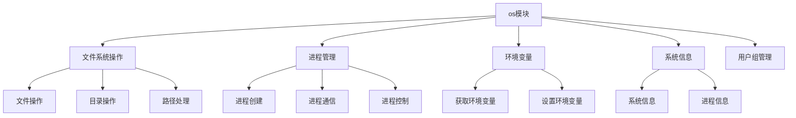

# Python标准库-os模块完全参考手册

## 概述

`os` 模块提供了与操作系统相关的各种功能，是Python中最重要和最常用的模块之一。它提供了一个可移植的方式来使用依赖于操作系统的功能，包括文件系统操作、进程管理、环境变量处理等。

os模块的核心功能包括：
- 文件和目录操作
- 进程管理
- 环境变量访问
- 系统信息获取
- 文件路径操作
- 用户和组管理



## 模块常量

### os.name

返回导入的操作系统相关模块的名称：

```python
import os

print(os.name)  # 'posix' (Unix/Linux), 'nt' (Windows), 'java' (Jython)
```

### os.environ

环境变量字典：

```python
import os

# 获取环境变量
print(os.environ['HOME'])  # 用户主目录
print(os.environ.get('PATH', ''))  # PATH环境变量

# 设置环境变量
os.environ['MY_VAR'] = 'my_value'

# 删除环境变量
del os.environ['MY_VAR']
```

## 文件和目录操作

### 路径操作

#### os.getcwd()

返回当前工作目录：

```python
import os

cwd = os.getcwd()
print(f"当前工作目录: {cwd}")
```

#### os.chdir(path)

更改当前工作目录：

```python
import os

os.chdir('/tmp')
print(f"新的工作目录: {os.getcwd()}")
```

#### os.listdir(path)

返回指定目录中的条目列表：

```python
import os

entries = os.listdir('.')
print(f"当前目录内容: {entries}")

# 获取特定目录的内容
entries = os.listdir('/tmp')
print(f"临时目录内容: {entries}")
```

#### os.mkdir(path, mode=0o777)

创建目录：

```python
import os

# 创建单个目录
os.mkdir('new_directory')

# 创建带有权限的目录
os.mkdir('secure_dir', mode=0o700)
```

#### os.makedirs(path, mode=0o777, exist_ok=False)

递归创建目录：

```python
import os

# 创建多级目录
os.makedirs('parent/child/grandchild', exist_ok=True)
```

#### os.rmdir(path)

删除空目录：

```python
import os

# 删除空目录
os.rmdir('empty_directory')
```

#### os.removedirs(path)

递归删除空目录：

```python
import os

# 删除多级空目录
os.removedirs('parent/child/grandchild')
```

### 文件操作

#### os.remove(path)

删除文件：

```python
import os

# 删除文件
os.remove('file.txt')
```

#### os.rename(src, dst)

重命名文件或目录：

```python
import os

# 重命名文件
os.rename('old_name.txt', 'new_name.txt')

# 移动文件
os.rename('path/to/file.txt', 'new_path/to/file.txt')
```

#### os.renames(old, new)

递归重命名：

```python
import os

# 递归重命名目录
os.renames('old/path/to/dir', 'new/path/to/dir')
```

#### os.stat(path)

获取文件状态信息：

```python
import os
import time

# 获取文件状态
stat_info = os.stat('file.txt')

print(f"文件大小: {stat_info.st_size} 字节")
print(f"最后访问时间: {time.ctime(stat_info.st_atime)}")
print(f"最后修改时间: {time.ctime(stat_info.st_mtime)}")
print(f"创建时间: {time.ctime(stat_info.st_ctime)}")
```

#### os.chmod(path, mode)

更改文件权限：

```python
import os

# 更改文件权限
os.chmod('file.txt', 0o644)  # rw-r--r--

# 更改目录权限
os.chmod('directory', 0o755)  # rwxr-xr-x
```

#### os.utime(path, times)

设置文件访问和修改时间：

```python
import os
import time

# 设置文件时间
current_time = time.time()
os.utime('file.txt', (current_time, current_time))
```

### 路径操作

#### os.path.join(path, *paths)

智能连接路径组件：

```python
import os

# 连接路径
path = os.path.join('folder', 'subfolder', 'file.txt')
print(path)  # folder/subfolder/file.txt (Unix) 或 folder\subfolder\file.txt (Windows)
```

#### os.path.split(path)

分割路径为目录和文件名：

```python
import os

# 分割路径
head, tail = os.path.split('/path/to/file.txt')
print(f"目录: {head}")  # /path/to
print(f"文件名: {tail}")  # file.txt
```

#### os.path.dirname(path)

返回目录名：

```python
import os

# 获取目录名
dirname = os.path.dirname('/path/to/file.txt')
print(dirname)  # /path/to
```

#### os.path.basename(path)

返回文件名：

```python
import os

# 获取文件名
basename = os.path.basename('/path/to/file.txt')
print(basename)  # file.txt
```

#### os.path.splitext(path)

分割文件扩展名：

```python
import os

# 分割扩展名
root, ext = os.path.splitext('document.pdf')
print(f"根: {root}")  # document
print(f"扩展名: {ext}")  # .pdf
```

#### os.path.exists(path)

检查路径是否存在：

```python
import os

# 检查路径是否存在
if os.path.exists('file.txt'):
    print("文件存在")
else:
    print("文件不存在")
```

#### os.path.isfile(path)

检查是否为文件：

```python
import os

# 检查是否为文件
if os.path.isfile('file.txt'):
    print("这是一个文件")
```

#### os.path.isdir(path)

检查是否为目录：

```python
import os

# 检查是否为目录
if os.path.isdir('folder'):
    print("这是一个目录")
```

#### os.path.islink(path)

检查是否为符号链接：

```python
import os

# 检查是否为符号链接
if os.path.islink('link'):
    print("这是一个符号链接")
```

#### os.path.isabs(path)

检查是否为绝对路径：

```python
import os

# 检查是否为绝对路径
print(os.path.isabs('/path/to/file.txt'))  # True
print(os.path.isabs('relative/path.txt'))  # False
```

#### os.path.abspath(path)

返回绝对路径：

```python
import os

# 获取绝对路径
abs_path = os.path.abspath('relative/path.txt')
print(abs_path)  # /current/working/dir/relative/path.txt
```

#### os.path.normpath(path)

规范化路径：

```python
import os

# 规范化路径
norm_path = os.path.normpath('folder/../folder/./file.txt')
print(norm_path)  # folder/file.txt
```

#### os.path.getsize(path)

返回文件大小：

```python
import os

# 获取文件大小
size = os.path.getsize('file.txt')
print(f"文件大小: {size} 字节")
```

#### os.path.getmtime(path)

返回最后修改时间：

```python
import os
import time

# 获取最后修改时间
mtime = os.path.getmtime('file.txt')
print(f"最后修改时间: {time.ctime(mtime)}")
```

## 进程管理

### 进程信息

#### os.getpid()

返回当前进程ID：

```python
import os

pid = os.getpid()
print(f"当前进程ID: {pid}")
```

#### os.getppid()

返回父进程ID：

```python
import os

ppid = os.getppid()
print(f"父进程ID: {ppid}")
```

#### os.getuid() & os.geteuid()

返回用户ID（Unix）：

```python
import os

# 返回实际用户ID
uid = os.getuid()
print(f"实际用户ID: {uid}")

# 返回有效用户ID
euid = os.geteuid()
print(f"有效用户ID: {euid}")
```

#### os.getgid() & os.getegid()

返回组ID（Unix）：

```python
import os

# 返回实际组ID
gid = os.getgid()
print(f"实际组ID: {gid}")

# 返回有效组ID
egid = os.getegid()
print(f"有效组ID: {egid}")
```

### 进程创建

#### os.system(command)

在子shell中执行命令：

```python
import os

# 执行系统命令
exit_code = os.system('ls -la')
print(f"退出码: {exit_code}")

# 在Windows上
exit_code = os.system('dir')
```

#### os.exec系列函数

替换当前进程：

```python
import os

# 执行新程序，替换当前进程
# os.execvp('python', ['python', 'script.py'])

# 这些函数不会返回，因为当前进程被替换
```

#### os.spawn系列函数

在子进程中执行程序：

```python
import os

# 在子进程中执行程序
pid = os.spawnvp(os.P_WAIT, 'python', ['python', 'script.py'])
print(f"子进程ID: {pid}")
```

### 进程控制

#### os.kill(pid, sig)

发送信号给进程（Unix）：

```python
import os
import signal

# 发送SIGTERM信号
os.kill(pid, signal.SIGTERM)

# 发送SIGKILL信号
os.kill(pid, signal.SIGKILL)
```

#### os.wait()

等待子进程终止（Unix）：

```python
import os

# 等待子进程
pid, exit_status = os.wait()
print(f"子进程ID: {pid}, 退出状态: {exit_status}")
```

#### os.waitpid(pid, options)

等待特定子进程（Unix）：

```python
import os

# 等待特定子进程
pid, exit_status = os.waitpid(pid, 0)
print(f"子进程ID: {pid}, 退出状态: {exit_status}")
```

## 环境变量

### 获取环境变量

#### os.getenv(key, default=None)

获取环境变量：

```python
import os

# 获取环境变量
path = os.getenv('PATH', '')
print(f"PATH: {path}")

# 使用默认值
custom_var = os.getenv('MY_VAR', 'default_value')
print(f"MY_VAR: {custom_var}")
```

#### os.environ

环境变量字典：

```python
import os

# 访问环境变量
print(os.environ['HOME'])

# 安全访问
print(os.environ.get('MY_VAR', 'not_set'))

# 遍历所有环境变量
for key, value in os.environ.items():
    print(f"{key}: {value}")
```

### 设置环境变量

#### os.putenv(key, value)

设置环境变量：

```python
import os

# 设置环境变量
os.putenv('MY_VAR', 'my_value')

# 验证设置
print(os.getenv('MY_VAR'))  # 可能返回None，因为environ是缓存的
```

#### os.environ字典

通过字典操作设置环境变量：

```python
import os

# 设置环境变量
os.environ['MY_VAR'] = 'my_value'

# 验证设置
print(os.environ['MY_VAR'])  # 'my_value'

# 删除环境变量
del os.environ['MY_VAR']
```

#### os.unsetenv(key)

删除环境变量：

```python
import os

# 删除环境变量
os.unsetenv('MY_VAR')
```

### 环境变量刷新

#### os.reload_environ()

刷新环境变量缓存：

```python
import os

# 在外部修改环境变量后刷新缓存
os.reload_environ()
```

## 系统信息

### 系统信息

#### os.uname()

返回系统信息（Unix）：

```python
import os

# 获取系统信息
uname = os.uname()
print(f"系统名称: {uname.sysname}")
print(f"节点名称: {uname.nodename}")
print(f"发行版本: {uname.release}")
print(f"版本信息: {uname.version}")
print(f"硬件标识: {uname.machine}")
```

#### os.statvfs(path)

获取文件系统统计信息（Unix）：

```python
import os

# 获取文件系统信息
stats = os.statvfs('/')
print(f"总块数: {stats.f_blocks}")
print(f"可用块数: {stats.f_bavail}")
print(f"块大小: {stats.f_frsize}")
```

### 错误处理

#### os.strerror(code)

返回错误码对应的错误消息：

```python
import os
import errno

# 获取错误消息
error_msg = os.strerror(errno.ENOENT)
print(f"错误消息: {error_msg}")  # No such file or directory
```

## 文件描述符操作

### 文件描述符操作

#### os.open(path, flags, mode=0o777)

打开文件并返回文件描述符：

```python
import os

# 打开文件
fd = os.open('file.txt', os.O_RDWR | os.O_CREAT, 0o644)

# 写入数据
os.write(fd, b'Hello, World!')

# 关闭文件描述符
os.close(fd)
```

#### os.close(fd)

关闭文件描述符：

```python
import os

# 关闭文件描述符
os.close(fd)
```

#### os.read(fd, n)

从文件描述符读取：

```python
import os

# 打开文件
fd = os.open('file.txt', os.O_RDONLY)

# 读取数据
data = os.read(fd, 1024)
print(data)

# 关闭文件描述符
os.close(fd)
```

#### os.write(fd, str)

写入文件描述符：

```python
import os

# 打开文件
fd = os.open('file.txt', os.O_WRONLY | os.O_CREAT, 0o644)

# 写入数据
bytes_written = os.write(fd, b'Hello, World!')
print(f"写入字节数: {bytes_written}")

# 关闭文件描述符
os.close(fd)
```

#### os.lseek(fd, pos, how)

移动文件描述符位置：

```python
import os

# 打开文件
fd = os.open('file.txt', os.O_RDWR)

# 移动到文件开头
os.lseek(fd, 0, os.SEEK_SET)

# 移动到文件末尾
os.lseek(fd, 0, os.SEEK_END)

# 相对当前位置移动
os.lseek(fd, 10, os.SEEK_CUR)

# 关闭文件描述符
os.close(fd)
```

#### os.dup(fd)

复制文件描述符：

```python
import os

# 复制文件描述符
new_fd = os.dup(fd)
print(f"新文件描述符: {new_fd}")

# 关闭文件描述符
os.close(new_fd)
```

#### os.dup2(fd, fd2)

复制文件描述符到指定描述符：

```python
import os

# 复制文件描述符
os.dup2(fd, 3)

# 关闭文件描述符
os.close(3)
```

## 实战应用

### 1. 文件备份工具

```python
import os
import shutil
from datetime import datetime
from pathlib import Path

class FileBackup:
    """文件备份工具"""

    def __init__(self, source_dir, backup_dir):
        self.source_dir = Path(source_dir)
        self.backup_dir = Path(backup_dir)
        self.backup_dir.mkdir(parents=True, exist_ok=True)

    def backup_files(self, pattern="*"):
        """备份文件"""
        timestamp = datetime.now().strftime('%Y%m%d_%H%M%S')
        backup_subdir = self.backup_dir / f"backup_{timestamp}"
        backup_subdir.mkdir(exist_ok=True)

        for file_path in self.source_dir.glob(pattern):
            if file_path.is_file():
                backup_path = backup_subdir / file_path.name
                shutil.copy2(file_path, backup_path)
                print(f"备份: {file_path.name} -> {backup_path}")

        return backup_subdir

    def list_backups(self):
        """列出所有备份"""
        backups = sorted(self.backup_dir.glob('backup_*'))
        return backups

    def restore_backup(self, backup_name):
        """恢复备份"""
        backup_path = self.backup_dir / backup_name
        if backup_path.exists():
            for file_path in backup_path.glob('*'):
                dest_path = self.source_dir / file_path.name
                shutil.copy2(file_path, dest_path)
                print(f"恢复: {file_path.name} -> {dest_path}")
        else:
            print(f"备份不存在: {backup_name}")

# 使用示例
backup = FileBackup('./data', './backups')
backup.backup_files('*.txt')
print("所有备份:")
for b in backup.list_backups():
    print(f"  {b.name}")
```

### 2. 进程监控器

```python
import os
import time
import psutil

class ProcessMonitor:
    """进程监控器"""

    def __init__(self, pid):
        self.pid = pid
        try:
            self.process = psutil.Process(pid)
        except psutil.NoSuchProcess:
            self.process = None

    def get_process_info(self):
        """获取进程信息"""
        if not self.process:
            return None

        try:
            return {
                'pid': self.process.pid,
                'name': self.process.name(),
                'status': self.process.status(),
                'cpu_percent': self.process.cpu_percent(),
                'memory_percent': self.process.memory_percent(),
                'create_time': self.process.create_time(),
                'num_threads': self.process.num_threads(),
                'connections': len(self.process.connections()),
            }
        except psutil.NoSuchProcess:
            return None

    def is_running(self):
        """检查进程是否运行"""
        return self.process is not None and self.process.is_running()

    def terminate(self):
        """终止进程"""
        if self.process:
            self.process.terminate()
            return True
        return False

    def kill(self):
        """强制终止进程"""
        if self.process:
            self.process.kill()
            return True
        return False

# 使用示例
current_pid = os.getpid()
monitor = ProcessMonitor(current_pid)

info = monitor.get_process_info()
if info:
    print("进程信息:")
    for key, value in info.items():
        print(f"  {key}: {value}")
else:
    print("进程不存在")
```

### 3. 日志文件清理器

```python
import os
import time
from pathlib import Path

class LogCleaner:
    """日志文件清理器"""

    def __init__(self, log_dir, max_age_days=7, max_size_mb=100):
        self.log_dir = Path(log_dir)
        self.max_age = max_age_days * 24 * 3600  # 转换为秒
        self.max_size = max_size_mb * 1024 * 1024  # 转换为字节

    def get_dir_size(self):
        """获取目录大小"""
        total_size = 0
        for file_path in self.log_dir.rglob('*'):
            if file_path.is_file():
                total_size += file_path.stat().st_size
        return total_size

    def clean_old_logs(self):
        """清理旧日志"""
        current_time = time.time()
        deleted_files = []

        for log_file in self.log_dir.glob('*.log'):
            file_age = current_time - log_file.stat().st_mtime
            if file_age > self.max_age:
                log_file.unlink()
                deleted_files.append(log_file.name)

        return deleted_files

    def clean_by_size(self):
        """按大小清理"""
        deleted_files = []
        current_size = self.get_dir_size()

        if current_size > self.max_size:
            # 获取所有日志文件并按修改时间排序
            log_files = sorted(
                self.log_dir.glob('*.log'),
                key=lambda f: f.stat().st_mtime
            )

            # 从最旧的开始删除
            for log_file in log_files:
                if current_size <= self.max_size:
                    break
                file_size = log_file.stat().st_size
                log_file.unlink()
                current_size -= file_size
                deleted_files.append(log_file.name)

        return deleted_files

    def clean_all(self):
        """执行所有清理"""
        old_logs = self.clean_old_logs()
        size_logs = self.clean_by_size()

        print(f"删除了 {len(old_logs)} 个旧日志文件")
        print(f"删除了 {len(size_logs)} 个日志文件以节省空间")

# 使用示例
cleaner = LogCleaner('./logs', max_age_days=7, max_size_mb=100)
cleaner.clean_all()
```

### 4. 环境变量管理器

```python
import os
from pathlib import Path
import json

class EnvManager:
    """环境变量管理器"""

    def __init__(self, env_file='.env'):
        self.env_file = Path(env_file)
        self.env_vars = self._load_env_file()

    def _load_env_file(self):
        """加载环境变量文件"""
        if self.env_file.exists():
            with open(self.env_file, 'r') as f:
                env_vars = json.load(f)
                # 设置环境变量
                for key, value in env_vars.items():
                    os.environ[key] = value
                return env_vars
        return {}

    def save_env_file(self):
        """保存环境变量文件"""
        with open(self.env_file, 'w') as f:
            json.dump(self.env_vars, f, indent=2)

    def set(self, key, value):
        """设置环境变量"""
        os.environ[key] = value
        self.env_vars[key] = value
        self.save_env_file()

    def get(self, key, default=None):
        """获取环境变量"""
        return os.environ.get(key, default)

    def unset(self, key):
        """删除环境变量"""
        if key in os.environ:
            del os.environ[key]
        if key in self.env_vars:
            del self.env_vars[key]
        self.save_env_file()

    def list_all(self):
        """列出所有环境变量"""
        return dict(os.environ)

# 使用示例
env = EnvManager('.env')
env.set('API_KEY', 'your_api_key')
env.set('DEBUG', 'true')

print(f"API_KEY: {env.get('API_KEY')}")
print(f"DEBUG: {env.get('DEBUG')}")

env.unset('DEBUG')
print(f"DEBUG (after unset): {env.get('DEBUG')}")
```

### 5. 跨平台路径处理

```python
import os
from pathlib import Path

class PathHandler:
    """跨平台路径处理器"""

    @staticmethod
    def join(*paths):
        """智能连接路径"""
        return os.path.join(*paths)

    @staticmethod
    def normalize(path):
        """规范化路径"""
        return os.path.normpath(path)

    @staticmethod
    def absolute(path):
        """获取绝对路径"""
        return os.path.abspath(path)

    @staticmethod
    def relative(path, start):
        """获取相对路径"""
        return os.path.relpath(path, start)

    @staticmethod
    def ensure_dir(path):
        """确保目录存在"""
        Path(path).mkdir(parents=True, exist_ok=True)

    @staticmethod
    def safe_filename(filename):
        """生成安全的文件名"""
        # 替换不安全字符
        unsafe_chars = '<>:"/\\|?*'
        safe_name = filename
        for char in unsafe_chars:
            safe_name = safe_name.replace(char, '_')
        return safe_name

    @staticmethod
    def get_unique_filename(directory, filename):
        """获取唯一的文件名"""
        path = Path(directory) / filename
        
        if not path.exists():
            return str(path)

        # 添加计数器
        stem = path.stem
        suffix = path.suffix
        counter = 1

        while True:
            new_filename = f"{stem}_{counter}{suffix}"
            new_path = path.parent / new_filename
            if not new_path.exists():
                return str(new_path)
            counter += 1

# 使用示例
handler = PathHandler()

# 连接路径
full_path = handler.join('folder', 'subfolder', 'file.txt')
print(f"完整路径: {full_path}")

# 规范化路径
norm_path = handler.normalize('folder/../folder/./file.txt')
print(f"规范化路径: {norm_path}")

# 确保目录存在
handler.ensure_dir('./data/output')

# 生成安全文件名
safe_name = handler.safe_filename('file:with|unsafe*chars.txt')
print(f"安全文件名: {safe_name}")

# 获取唯一文件名
unique_path = handler.get_unique_filename('./data', 'test.txt')
print(f"唯一路径: {unique_path}")
```

## 性能优化

### 1. 使用pathlib替代os.path

```python
# 不好的做法（使用os.path）
import os
path = os.path.join('folder', 'subfolder', 'file.txt')
abs_path = os.path.abspath(path)
dirname = os.path.dirname(abs_path)

# 好的做法（使用pathlib）
from pathlib import Path
path = Path('folder') / 'subfolder' / 'file.txt'
abs_path = path.absolute()
dirname = abs_path.parent
```

### 2. 批量文件操作

```python
import os
from pathlib import Path

# 不好的做法（逐个操作）
for filename in os.listdir('large_dir'):
    filepath = os.path.join('large_dir', filename)
    if os.path.isfile(filepath):
        # 处理文件
        pass

# 好的做法（使用glob和Path对象）
for filepath in Path('large_dir').glob('*'):
    if filepath.is_file():
        # 处理文件
        pass
```

## 安全考虑

### 1. 路径遍历攻击防护

```python
import os

def safe_join(base_path, *paths):
    """安全的路径连接"""
    full_path = os.path.abspath(os.path.join(base_path, *paths))
    if not full_path.startswith(os.path.abspath(base_path)):
        raise ValueError("路径遍历攻击被阻止")
    return full_path

# 使用示例
try:
    user_path = safe_join('/safe/directory', '../etc/passwd')
    print(user_path)
except ValueError as e:
    print(f"安全错误: {e}")
```

### 2. 文件权限检查

```python
import os

def check_file_permissions(filepath, required_perms):
    """检查文件权限"""
    if not os.path.exists(filepath):
        return False

    actual_perms = os.stat(filepath).st_mode & 0o777

    return (actual_perms & required_perms) == required_perms

# 使用示例
if check_file_permissions('config.json', 0o600):  # 只读权限
    print("文件权限正确")
else:
    print("文件权限不正确")
```

## 常见问题

### Q1: os.path和pathlib有什么区别？

**A**: `os.path`是传统的路径操作模块，而`pathlib`是Python 3.4引入的面向对象路径操作库。`pathlib`提供了更现代、更直观的API，推荐在新代码中使用。

### Q2: 如何处理Windows和Unix的路径差异？

**A**: 使用`os.path`模块或`pathlib`来自动处理不同操作系统的路径差异。它们会自动使用正确的路径分隔符和路径格式。

### Q3: 如何安全地执行系统命令？

**A**: 使用`subprocess`模块而不是`os.system`，它提供了更好的控制和安全性。避免直接使用用户输入作为命令参数。

`os` 模块是Python中最基础和最重要的模块之一，提供了：

1. **文件系统操作**: 创建、删除、移动文件和目录
2. **进程管理**: 创建、控制和监控进程
3. **环境变量**: 访问和修改系统环境变量
4. **系统信息**: 获取操作系统和进程信息
5. **路径操作**: 处理文件路径的各种操作
6. **跨平台支持**: 提供可移植的操作系统接口

通过掌握 `os` 模块，您可以：
- 开发跨平台的应用程序
- 实现文件管理和备份功能
- 创建系统工具和实用程序
- 处理进程间通信
- 管理系统资源和权限

`os` 模块是Python系统编程的基础，掌握它将使您能够编写强大而灵活的系统级应用程序。无论是开发服务器、工具软件还是系统管理脚本，`os` 模块都是不可或缺的工具。