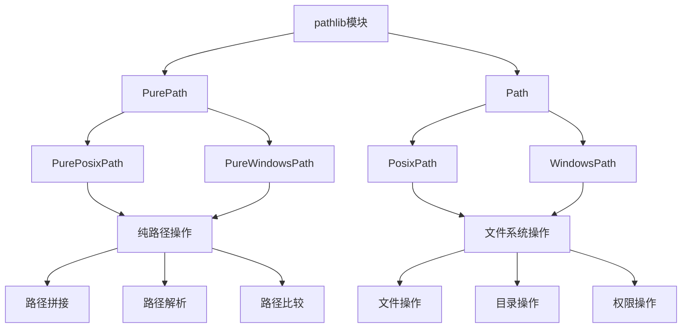

# Python标准库-pathlib模块完全参考手册

## 概述

`pathlib` 模块提供了面向对象的文件系统路径操作接口，旨在替代传统的 `os.path` 模块。它提供了跨平台的路径处理功能，将路径操作变得更加直观和安全。

pathlib模块的核心功能包括：
- 面向对象的路径操作
- 跨平台路径处理
- 文件和目录操作
- 路径遍历和匹配
- 文件系统查询
- 路径解析和规范化



## 基本使用

### 创建路径对象

```python
from pathlib import Path

# 创建路径对象
path1 = Path('/home/user/documents')
path2 = Path('data', 'files', 'example.txt')
path3 = Path.cwd() / 'subdir' / 'file.txt'

# 打印路径
print(f"路径1: {path1}")
print(f"路径2: {path2}")
print(f"路径3: {path3}")
```

### 路径操作

```python
from pathlib import Path

# 路径拼接
base = Path('/home/user')
result = base / 'documents' / 'file.txt'
print(f"拼接路径: {result}")

# 路径分解
path = Path('/home/user/documents/file.txt')
print(f"驱动器: {path.drive}")
print(f"根目录: {path.root}")
print(f"锚点: {path.anchor}")
print(f"父目录: {path.parent}")
print(f"文件名: {path.name}")
print(f"扩展名: {path.suffix}")
print(f"无扩展名: {path.stem}")
```

### 路径信息

```python
from pathlib import Path

path = Path('/home/user/documents/file.txt')

# 路径部分
print(f"路径部分: {path.parts}")
print(f"父目录列表: {list(path.parents)}")

# 路径属性
print(f"是否绝对路径: {path.is_absolute()}")
print(f"字符串形式: {str(path)}")
print(f"POSIX形式: {path.as_posix()}")

# 文件信息
print(f"是否存在: {path.exists()}")
print(f"是否文件: {path.is_file()}")
print(f"是否目录: {path.is_dir()}")
```

## 文件操作

### 文件读写

```python
from pathlib import Path

# 写入文件
file_path = Path('example.txt')
file_path.write_text('Hello, World!', encoding='utf-8')

# 读取文件
content = file_path.read_text(encoding='utf-8')
print(f"文件内容: {content}")

# 二进制操作
binary_data = file_path.read_bytes()
print(f"二进制数据: {binary_data}")

file_path.write_bytes(b'Binary data')
```

### 文件创建和删除

```python
from pathlib import Path

# 创建文件
file_path = Path('new_file.txt')
file_path.touch()
print(f"文件创建: {file_path.exists()}")

# 复制文件
src_file = Path('source.txt')
dst_file = Path('destination.txt')

if src_file.exists():
    import shutil
    shutil.copy(src_file, dst_file)

# 删除文件
if file_path.exists():
    file_path.unlink()
    print(f"文件已删除")

# 重命名文件
old_name = Path('old_name.txt')
new_name = Path('new_name.txt')

if old_name.exists():
    old_name.rename(new_name)
```

### 文件信息查询

```python
from pathlib import Path
import datetime

file_path = Path('example.txt')

if file_path.exists():
    # 获取文件状态
    stat_info = file_path.stat()
    
    print(f"文件大小: {stat_info.st_size} 字节")
    print(f"创建时间: {datetime.datetime.fromtimestamp(stat_info.st_ctime)}")
    print(f"修改时间: {datetime.datetime.fromtimestamp(stat_info.st_mtime)}")
    print(f"访问时间: {datetime.datetime.fromtimestamp(stat_info.st_atime)}")
    
    # 检查文件类型
    print(f"是否符号链接: {file_path.is_symlink()}")
    print(f"是否套接字: {file_path.is_socket()}")
    print(f"是否FIFO: {file_path.is_fifo()}")
```

## 目录操作

### 目录创建和删除

```python
from pathlib import Path

# 创建目录
dir_path = Path('new_directory')
dir_path.mkdir(exist_ok=True)
print(f"目录创建: {dir_path.exists()}")

# 创建多级目录
nested_path = Path('parent', 'child', 'grandchild')
nested_path.mkdir(parents=True, exist_ok=True)

# 删除目录
if dir_path.exists():
    dir_path.rmdir()
    print(f"目录已删除")

# 删除非空目录（使用shutil）
import shutil
if nested_path.parent.exists():
    shutil.rmtree(nested_path.parent)
```

### 目录遍历

```python
from pathlib import Path

# 列出目录内容
dir_path = Path('.')
for item in dir_path.iterdir():
    print(f"{'目录' if item.is_dir() else '文件'}: {item.name}")

# 递归遍历
print("\n递归遍历:")
for path in dir_path.rglob('*.py'):
    print(f"Python文件: {path}")

# 匹配文件
print("\n匹配.txt文件:")
for path in dir_path.glob('*.txt'):
    print(f"文本文件: {path}")
```

### 目录树遍历

```python
from pathlib import Path

def print_directory_tree(path, indent=0):
    """打印目录树"""
    if path.is_dir():
        print('  ' * indent + f"📁 {path.name}/")
        for item in sorted(path.iterdir()):
            print_directory_tree(item, indent + 1)
    else:
        print('  ' * indent + f"📄 {path.name}")

# 使用示例
current_dir = Path('.')
print_directory_tree(current_dir)
```

## 路径解析

### 路径规范化

```python
from pathlib import Path

# 相对路径
relative_path = Path('data/../file.txt')
print(f"相对路径: {relative_path}")

# 解析路径（消除..）
resolved_path = relative_path.resolve()
print(f"解析路径: {resolved_path}")

# 绝对路径
absolute_path = Path('file.txt').absolute()
print(f"绝对路径: {absolute_path}")

# 展开用户目录
user_path = Path('~/Documents').expanduser()
print(f"用户目录: {user_path}")
```

### 路径比较

```python
from pathlib import Path

path1 = Path('/home/user/docs')
path2 = Path('/home/user/data')
path3 = Path('/home/user/docs')

# 路径比较
print(f"path1 == path3: {path1 == path3}")
print(f"path1 != path2: {path1 != path2}")

# 相对路径计算
relative = path1.relative_to('/home/user')
print(f"相对路径: {relative}")

# 检查关系
print(f"path2在path1的子目录中: {path2.is_relative_to(path1.parent)}")
```

### 路径匹配

```python
from pathlib import Path

# 模式匹配
file_path = Path('/home/user/documents/report.pdf')

# 简单匹配
print(f"匹配.pdf: {file_path.match('*.pdf')}")
print(f"匹配report: {file_path.match('report.*')}")

# 完整匹配
print(f"完整匹配: {file_path.full_match('**/*.pdf')}")

# 在目录中查找
current_dir = Path('.')
print("\n查找Python文件:")
for path in current_dir.glob('**/*.py'):
    if path.match('*.py'):
        print(f"  {path}")
```

## 实战应用

### 1. 文件备份工具

```python
import shutil
from pathlib import Path
from datetime import datetime

class FileBackup:
    """文件备份工具"""
    
    def __init__(self, source_dir, backup_dir):
        self.source_dir = Path(source_dir)
        self.backup_dir = Path(backup_dir)
        self.backup_dir.mkdir(parents=True, exist_ok=True)
    
    def backup_file(self, file_path):
        """备份单个文件"""
        source_file = self.source_dir / file_path
        if not source_file.exists():
            print(f"文件不存在: {source_file}")
            return False
        
        # 创建时间戳目录
        timestamp = datetime.now().strftime('%Y%m%d_%H%M%S')
        backup_subdir = self.backup_dir / timestamp
        backup_subdir.mkdir(exist_ok=True)
        
        # 复制文件
        backup_file = backup_subdir / source_file.name
        shutil.copy2(source_file, backup_file)
        
        print(f"备份成功: {backup_file}")
        return True
    
    def backup_directory(self):
        """备份整个目录"""
        timestamp = datetime.now().strftime('%Y%m%d_%H%M%S')
        backup_subdir = self.backup_dir / timestamp
        
        try:
            shutil.copytree(self.source_dir, backup_subdir)
            print(f"目录备份成功: {backup_subdir}")
            return True
        except Exception as e:
            print(f"备份失败: {e}")
            return False
    
    def restore_file(self, backup_file, restore_path=None):
        """恢复文件"""
        backup_path = Path(backup_file)
        
        if not backup_path.exists():
            print(f"备份文件不存在: {backup_path}")
            return False
        
        if restore_path is None:
            restore_path = self.source_dir / backup_path.name
        else:
            restore_path = Path(restore_path)
        
        # 确保目标目录存在
        restore_path.parent.mkdir(parents=True, exist_ok=True)
        
        # 复制文件
        shutil.copy2(backup_path, restore_path)
        print(f"恢复成功: {restore_path}")
        return True

# 使用示例
backup = FileBackup('source_data', 'backup_data')

# 备份单个文件
backup.backup_file('important.txt')

# 备份整个目录
backup.backup_directory()
```

### 2. 文件整理工具

```python
from pathlib import Path
import shutil

class FileOrganizer:
    """文件整理工具"""
    
    def __init__(self, base_dir):
        self.base_dir = Path(base_dir)
    
    def organize_by_extension(self):
        """按扩展名整理文件"""
        if not self.base_dir.exists():
            print(f"目录不存在: {self.base_dir}")
            return
        
        for file_path in self.base_dir.iterdir():
            if file_path.is_file():
                # 获取文件扩展名
                ext = file_path.suffix.lower()
                
                if ext:
                    # 创建目标目录
                    target_dir = self.base_dir / ext[1:]  # 去掉点
                    target_dir.mkdir(exist_ok=True)
                    
                    # 移动文件
                    target_path = target_dir / file_path.name
                    shutil.move(str(file_path), str(target_path))
                    print(f"移动: {file_path.name} -> {target_dir}/")
    
    def organize_by_date(self):
        """按修改日期整理文件"""
        if not self.base_dir.exists():
            print(f"目录不存在: {self.base_dir}")
            return
        
        for file_path in self.base_dir.iterdir():
            if file_path.is_file():
                # 获取修改时间
                stat_info = file_path.stat()
                mtime = stat_info.st_mtime
                date = datetime.datetime.fromtimestamp(mtime)
                
                # 创建目标目录
                target_dir = self.base_dir / date.strftime('%Y-%m')
                target_dir.mkdir(exist_ok=True)
                
                # 移动文件
                target_path = target_dir / file_path.name
                shutil.move(str(file_path), str(target_path))
                print(f"移动: {file_path.name} -> {target_dir}/")
    
    def find_duplicates(self):
        """查找重复文件"""
        file_hashes = {}
        duplicates = []
        
        for file_path in self.base_dir.rglob('*'):
            if file_path.is_file():
                try:
                    # 计算文件哈希
                    file_hash = self._calculate_hash(file_path)
                    
                    if file_hash in file_hashes:
                        duplicates.append({
                            'original': file_hashes[file_hash],
                            'duplicate': file_path
                        })
                    else:
                        file_hashes[file_hash] = file_path
                except Exception as e:
                    print(f"处理文件错误 {file_path}: {e}")
        
        return duplicates
    
    def _calculate_hash(self, file_path):
        """计算文件哈希"""
        import hashlib
        hash_obj = hashlib.md5()
        
        with open(file_path, 'rb') as f:
            for chunk in iter(lambda: f.read(8192), b''):
                hash_obj.update(chunk)
        
        return hash_obj.hexdigest()

# 使用示例
organizer = FileOrganizer('messy_folder')

# 按扩展名整理
organizer.organize_by_extension()

# 查找重复文件
duplicates = organizer.find_duplicates()
if duplicates:
    print(f"找到 {len(duplicates)} 个重复文件:")
    for dup in duplicates:
        print(f"  {dup['duplicate']} 与 {dup['original']} 重复")
```

### 3. 目录清理工具

```python
from pathlib import Path
import datetime
import tempfile

class DirectoryCleaner:
    """目录清理工具"""
    
    def __init__(self, target_dir):
        self.target_dir = Path(target_dir)
    
    def clean_empty_dirs(self):
        """清理空目录"""
        removed_count = 0
        
        for dir_path in sorted(self.target_dir.rglob('*'), reverse=True):
            if dir_path.is_dir():
                try:
                    # 检查目录是否为空
                    if not list(dir_path.iterdir()):
                        dir_path.rmdir()
                        removed_count += 1
                        print(f"删除空目录: {dir_path}")
                except Exception as e:
                    print(f"删除目录失败 {dir_path}: {e}")
        
        print(f"总共删除了 {removed_count} 个空目录")
        return removed_count
    
    def clean_temp_files(self, days=7):
        """清理临时文件"""
        cutoff_time = datetime.datetime.now() - datetime.timedelta(days=days)
        removed_count = 0
        
        # 临时文件模式
        temp_patterns = ['*.tmp', '*.temp', '~*', '*.bak', '*.cache']
        
        for pattern in temp_patterns:
            for file_path in self.target_dir.rglob(pattern):
                if file_path.is_file():
                    try:
                        stat_info = file_path.stat()
                        mtime = datetime.datetime.fromtimestamp(stat_info.st_mtime)
                        
                        if mtime < cutoff_time:
                            file_path.unlink()
                            removed_count += 1
                            print(f"删除临时文件: {file_path}")
                    except Exception as e:
                        print(f"删除文件失败 {file_path}: {e}")
        
        # 清理系统临时目录
        temp_dir = Path(tempfile.gettempdir())
        for item in temp_dir.iterdir():
            try:
                if item.is_file():
                    stat_info = item.stat()
                    mtime = datetime.datetime.fromtimestamp(stat_info.st_mtime)
                    
                    if mtime < cutoff_time:
                        item.unlink()
                        removed_count += 1
                        print(f"删除系统临时文件: {item}")
            except Exception as e:
                print(f"删除系统临时文件失败 {item}: {e}")
        
        print(f"总共删除了 {removed_count} 个临时文件")
        return removed_count
    
    def clean_old_files(self, days=30, pattern='*'):
        """清理旧文件"""
        cutoff_time = datetime.datetime.now() - datetime.timedelta(days=days)
        removed_count = 0
        
        for file_path in self.target_dir.rglob(pattern):
            if file_path.is_file():
                try:
                    stat_info = file_path.stat()
                    mtime = datetime.datetime.fromtimestamp(stat_info.st_mtime)
                    
                    if mtime < cutoff_time:
                        file_path.unlink()
                        removed_count += 1
                        print(f"删除旧文件: {file_path}")
                except Exception as e:
                    print(f"删除文件失败 {file_path}: {e}")
        
        print(f"总共删除了 {removed_count} 个旧文件")
        return removed_count
    
    def get_directory_size(self):
        """获取目录大小"""
        total_size = 0
        file_count = 0
        dir_count = 0
        
        for path in self.target_dir.rglob('*'):
            if path.is_file():
                total_size += path.stat().st_size
                file_count += 1
            elif path.is_dir():
                dir_count += 1
        
        return {
            'total_size': total_size,
            'file_count': file_count,
            'dir_count': dir_count,
            'size_mb': total_size / (1024 * 1024)
        }

# 使用示例
cleaner = DirectoryCleaner('large_directory')

# 清理空目录
cleaner.clean_empty_dirs()

# 清理临时文件
cleaner.clean_temp_files(days=7)

# 获取目录大小
size_info = cleaner.get_directory_size()
print(f"目录大小: {size_info['size_mb']:.2f} MB")
print(f"文件数量: {size_info['file_count']}")
print(f"目录数量: {size_info['dir_count']}")
```

### 4. 文件搜索工具

```python
from pathlib import Path
import re
from datetime import datetime

class FileSearcher:
    """文件搜索工具"""
    
    def __init__(self, base_dir):
        self.base_dir = Path(base_dir)
    
    def search_by_name(self, pattern, case_sensitive=False):
        """按文件名搜索"""
        results = []
        flags = 0 if case_sensitive else re.IGNORECASE
        
        for file_path in self.base_dir.rglob('*'):
            if file_path.is_file():
                if re.search(pattern, file_path.name, flags):
                    results.append({
                        'path': file_path,
                        'name': file_path.name,
                        'size': file_path.stat().st_size
                    })
        
        return results
    
    def search_by_content(self, pattern, file_pattern='*'):
        """按内容搜索"""
        results = []
        
        for file_path in self.base_dir.rglob(file_pattern):
            if file_path.is_file():
                try:
                    content = file_path.read_text(encoding='utf-8', errors='ignore')
                    if pattern in content:
                        results.append({
                            'path': file_path,
                            'name': file_path.name,
                            'matches': content.count(pattern)
                        })
                except Exception as e:
                    print(f"读取文件失败 {file_path}: {e}")
        
        return results
    
    def search_by_size(self, min_size=None, max_size=None):
        """按大小搜索"""
        results = []
        
        for file_path in self.base_dir.rglob('*'):
            if file_path.is_file():
                try:
                    size = file_path.stat().st_size
                    
                    if min_size is not None and size < min_size:
                        continue
                    if max_size is not None and size > max_size:
                        continue
                    
                    results.append({
                        'path': file_path,
                        'name': file_path.name,
                        'size': size,
                        'size_mb': size / (1024 * 1024)
                    })
                except Exception as e:
                    print(f"获取文件信息失败 {file_path}: {e}")
        
        return results
    
    def search_by_date(self, start_date=None, end_date=None):
        """按日期搜索"""
        results = []
        
        for file_path in self.base_dir.rglob('*'):
            if file_path.is_file():
                try:
                    stat_info = file_path.stat()
                    mtime = datetime.datetime.fromtimestamp(stat_info.st_mtime)
                    
                    if start_date and mtime < start_date:
                        continue
                    if end_date and mtime > end_date:
                        continue
                    
                    results.append({
                        'path': file_path,
                        'name': file_path.name,
                        'modified_time': mtime
                    })
                except Exception as e:
                    print(f"获取文件信息失败 {file_path}: {e}")
        
        return results
    
    def search_by_extension(self, extensions):
        """按扩展名搜索"""
        if isinstance(extensions, str):
            extensions = [extensions]
        
        results = []
        for file_path in self.base_dir.rglob('*'):
            if file_path.is_file():
                if file_path.suffix.lower() in [ext.lower() for ext in extensions]:
                    results.append({
                        'path': file_path,
                        'name': file_path.name,
                        'extension': file_path.suffix
                    })
        
        return results

# 使用示例
searcher = FileSearcher('project_directory')

# 按文件名搜索
name_results = searcher.search_by_name(r'test.*\.py')
print(f"找到 {len(name_results)} 个匹配文件")

# 按内容搜索
content_results = searcher.search_by_content('import')
print(f"找到 {len(content_results)} 个包含'import'的文件")

# 按大小搜索（大于1MB的文件）
size_results = searcher.search_by_size(min_size=1024*1024)
print(f"找到 {len(size_results)} 个大文件")

# 按扩展名搜索
ext_results = searcher.search_by_extension(['.py', '.txt', '.md'])
print(f"找到 {len(ext_results)} 个特定扩展名文件")
```

### 5. 批量文件处理器

```python
from pathlib import Path
import concurrent.futures
import time

class BatchFileProcessor:
    """批量文件处理器"""
    
    def __init__(self, base_dir, max_workers=4):
        self.base_dir = Path(base_dir)
        self.max_workers = max_workers
    
    def process_files(self, file_pattern, process_func):
        """批量处理文件"""
        files = list(self.base_dir.rglob(file_pattern))
        results = []
        
        with concurrent.futures.ThreadPoolExecutor(max_workers=self.max_workers) as executor:
            # 提交任务
            future_to_file = {
                executor.submit(process_func, file_path): file_path 
                for file_path in files
            }
            
            # 收集结果
            for future in concurrent.futures.as_completed(future_to_file):
                file_path = future_to_file[future]
                try:
                    result = future.result()
                    results.append({
                        'file': file_path,
                        'result': result,
                        'success': True
                    })
                except Exception as e:
                    results.append({
                        'file': file_path,
                        'error': str(e),
                        'success': False
                    })
        
        return results
    
    def convert_text_files(self, source_encoding, target_encoding='utf-8'):
        """批量转换文本文件编码"""
        def convert_file(file_path):
            content = file_path.read_text(encoding=source_encoding)
            file_path.write_text(content, encoding=target_encoding)
            return f"转换成功: {file_path.name}"
        
        return self.process_files('*.txt', convert_file)
    
    def compress_images(self, quality=85):
        """批量压缩图片"""
        def compress_image(file_path):
            try:
                from PIL import Image
                
                img = Image.open(file_path)
                img.save(file_path, quality=quality, optimize=True)
                return f"压缩成功: {file_path.name}"
            except Exception as e:
                return f"压缩失败: {e}"
        
        image_patterns = ['*.jpg', '*.jpeg', '*.png', '*.gif']
        all_results = []
        
        for pattern in image_patterns:
            results = self.process_files(pattern, compress_image)
            all_results.extend(results)
        
        return all_results
    
    def generate_file_list(self, output_file='file_list.txt'):
        """生成文件列表"""
        file_list = []
        
        for file_path in self.base_dir.rglob('*'):
            if file_path.is_file():
                stat_info = file_path.stat()
                file_info = {
                    'path': str(file_path),
                    'name': file_path.name,
                    'size': stat_info.st_size,
                    'modified': datetime.datetime.fromtimestamp(stat_info.st_mtime)
                }
                file_list.append(file_info)
        
        # 写入文件
        output_path = self.base_dir / output_file
        with open(output_path, 'w', encoding='utf-8') as f:
            for item in sorted(file_list, key=lambda x: x['path']):
                f.write(f"{item['path']}\t{item['size']}\t{item['modified']}\n")
        
        return len(file_list)

# 使用示例
processor = BatchFileProcessor('data_directory', max_workers=4)

# 批量处理文本文件
results = processor.process_files('*.txt', lambda f: f.read_text())
print(f"处理了 {len(results)} 个文件")

# 生成文件列表
file_count = processor.generate_file_list()
print(f"生成了包含 {file_count} 个文件的列表")
```

## 性能优化

### 1. 使用生成器

```python
from pathlib import Path

# 不好的做法（加载所有文件到内存）
def find_files_bad(directory):
    all_files = []
    for file_path in Path(directory).rglob('*'):
        if file_path.is_file():
            all_files.append(file_path)
    return all_files

# 好的做法（使用生成器）
def find_files_good(directory):
    for file_path in Path(directory).rglob('*'):
        if file_path.is_file():
            yield file_path
```

### 2. 批量操作

```python
from pathlib import Path

# 不好的做法（多次文件系统访问）
def process_files_sequential(files):
    results = []
    for file_path in files:
        if file_path.exists():
            content = file_path.read_text()
            processed = content.upper()
            results.append(processed)
    return results

# 好的做法（批量操作）
def process_files_batch(files):
    results = []
    for file_path in files:
        try:
            content = file_path.read_text()
            processed = content.upper()
            results.append(processed)
        except Exception:
            continue
    return results
```

## 安全考虑

### 1. 路径验证

```python
from pathlib import Path

def safe_path_join(base_path, user_path):
    """安全的路径拼接"""
    base = Path(base_path).resolve()
    user = Path(user_path).resolve()
    
    # 确保用户路径在基础路径下
    try:
        user.relative_to(base)
        return base / user_path
    except ValueError:
        raise ValueError(f"路径 {user_path} 超出基础路径 {base_path}")

# 使用示例
try:
    safe_path = safe_path_join('/home/user', '../../../etc/passwd')
except ValueError as e:
    print(f"安全错误: {e}")
```

### 2. 权限检查

```python
from pathlib import Path
import os

def safe_file_operation(file_path, operation):
    """安全的文件操作"""
    path = Path(file_path)
    
    # 检查文件是否存在
    if not path.exists():
        raise FileNotFoundError(f"文件不存在: {path}")
    
    # 检查读写权限
    if operation == 'read':
        if not os.access(path, os.R_OK):
            raise PermissionError(f"无读取权限: {path}")
    elif operation == 'write':
        if not os.access(path, os.W_OK):
            raise PermissionError(f"无写入权限: {path}")
    
    return True
```

## 常见问题

### Q1: Path和os.path有什么区别？

**A**: Path是面向对象的，提供了更直观的API，支持跨平台操作，并且可以直接进行文件系统操作。os.path是基于字符串的，功能相对有限。Path是推荐的现代选择。

### Q2: 如何处理不同操作系统的路径分隔符？

**A**: Path会自动处理不同操作系统的路径分隔符。使用 `/` 运算符拼接路径，Path会自动转换为正确的分隔符。使用 `as_posix()` 方法可以强制使用正斜杠。

### Q3: 如何判断路径是否存在但区分文件和目录？

**A**: 使用 `exists()` 检查是否存在，然后使用 `is_file()` 和 `is_dir()` 区分类型。也可以使用 `stat()` 方法获取详细的状态信息。

`pathlib` 模块是Python中最现代和最推荐的文件系统路径操作模块，提供了：

1. **面向对象API**: 直观易用的路径操作接口
2. **跨平台支持**: 自动处理不同操作系统的路径差异
3. **文件系统操作**: 读写、创建、删除等完整功能
4. **路径解析**: 规范化、解析、比较等高级功能
5. **模式匹配**: 强大的文件搜索和匹配功能
6. **类型安全**: 明确的类型提示和错误处理

通过掌握 `pathlib` 模块，您可以：
- 编写更清晰、更安全的文件操作代码
- 轻松处理跨平台路径问题
- 实现复杂的文件管理功能
- 高效地搜索和组织文件
- 构建可靠的文件处理系统
- 优化文件操作性能

`pathlib` 模块是现代Python开发中文件系统操作的首选工具，它将复杂的路径操作变得简单直观。无论是简单的文件读写还是复杂的文件管理系统，`pathlib` 都能提供强大而优雅的解决方案。在新的Python项目中，强烈推荐使用 `pathlib` 替代传统的 `os.path` 模块。