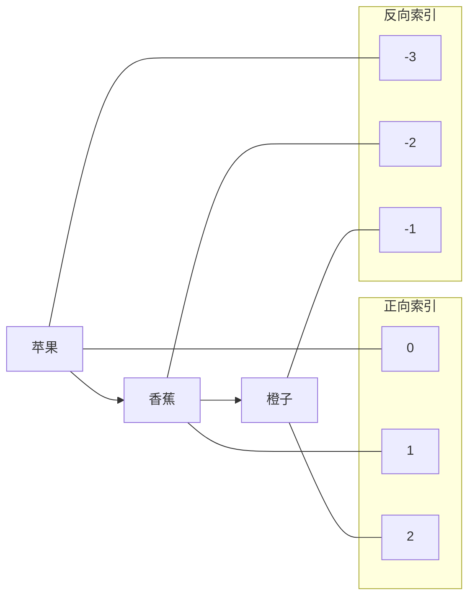
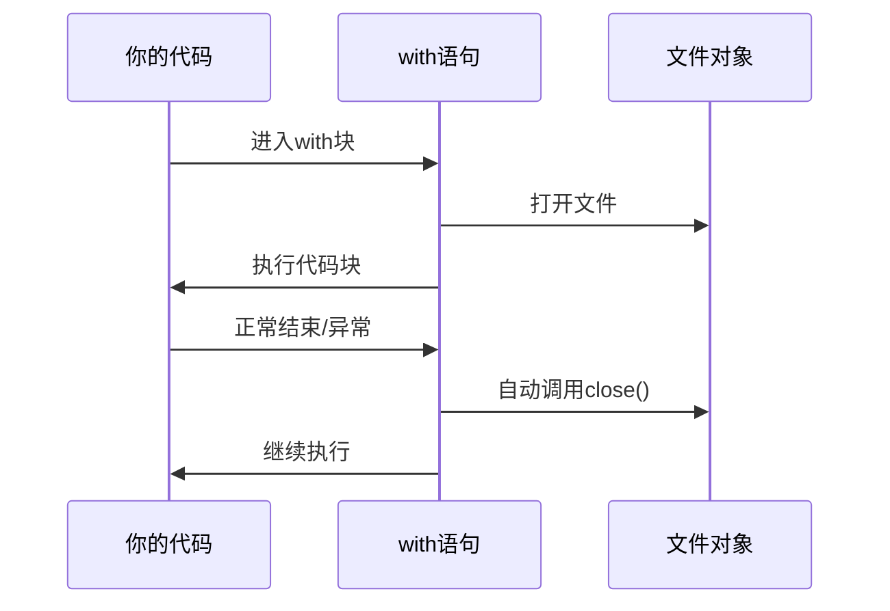
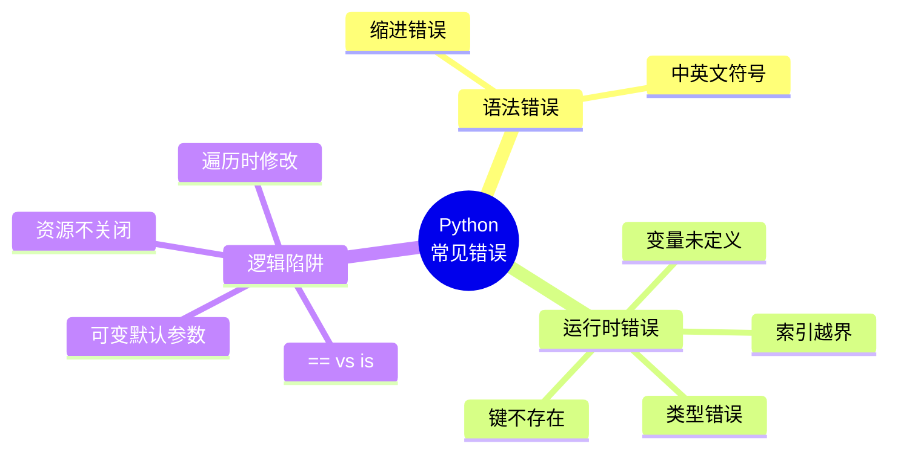

# Python初学者最常犯的10个错误，你中了几个？

> 作者：编程小助手 | 阅读时间：15分钟

---

## 写在前面

大家好！我是你们的编程小助手。

还记得我刚开始学Python的时候，写个"Hello World"都能报错，那种挫败感至今难忘。后来我发现，**80%的错误都是那几类问题**来表示代码块，这是它和其他语言最大的不同。很多从C、Java转过来的同学会不习惯。

**关键点：**
- 同一个代码块的缩进必须一致
- 推荐用**4个空格**，不要用Tab（虽然可以，但混用会出问题）
- if、for、while、def、class后面都要缩进

### 常见场景

```python
# 错误示范1：混用Tab和空格
if True:
→   print("A")  # Tab缩进
    print("B")  # 空格缩进

# 错误示范2：忘记缩进
for i in range(5):
print(i)  # 报错！

# 错误示范3：多余缩进
    print("我没在代码块里")  # 莫名其妙缩进
```

### 避坑技巧

1. 设置编辑器显示空格和Tab
2. 配置编辑器自动将Tab转为4个空格
3. 遇到IndentationError，检查上一行末尾的冒号

---

## 错误二：中英文符号混用（SyntaxError）

### 典型报错

```python
SyntaxError: invalid character '"' (U+201C)
```

### 错误代码示例

```python
print("Hello")  # 用了中文引号""
```

### 正确写法

```python
print("Hello")  # 英文引号""
```

### 深度解析

这是最让新手抓狂的错误！肉眼根本看不出区别，但Python就是报错。

**容易混淆的符号：**

| 中文符号 | 英文符号 | 用途 |
|---------|---------|------|
| " " | " " | 字符串 |
| ' ' | ' ' | 字符串 |
| ， | , | 分隔参数 |
| 。 | . | 调用方法 |
| （） | () | 括号 |
| ： | : | 冒号 |

### 真实案例

```python
# 错误
print("你好"，"世界")  # 中文逗号

name = "张三"．lower()  # 中文句号

if x > 5：  # 中文冒号
    print("大")
```

### 避坑技巧

1. 切换英文输入法写代码
2. 报错信息里有Unicode编码（如U+201C），大概率是中文符号
3. 养成习惯：写代码前按一下Shift，确保英文状态

---

## 错误三：变量未定义就使用（NameError）

### 典型报错

```python
NameError: name 'x' is not defined
```

### 错误代码示例

```python
print(message)  # message是什么？从来没定义过！
```

### 正确写法

```python
message = "Hello World"
print(message)
```

### 深度解析

Python是**动态类型语言**，变量不需要声明类型，但**必须先赋值再使用**。

### 常见场景分析

```python
# 场景1：拼写错误
count = 10
print(coutn)  # 手滑打错，Python以为是新变量

# 场景2：作用域问题
def test():
    local_var = "我在函数里"

test()
print(local_var)  # 函数外访问不了！

# 场景3：条件分支未覆盖
if user_input == "yes":
    result = "同意"
print(result)  # 如果输入不是yes，result就不存在
```

### 避坑技巧

1. 仔细核对变量名拼写
2. 理解**局部变量**和**全局变量**的区别
3. 使用IDE的自动补全功能
4. 养成先赋值后使用的习惯

---

## 错误四：字符串和数字直接拼接（TypeError）

### 典型报错

```python
TypeError: can only concatenate str (not "int") to str
```

### 错误代码示例

```python
age = 18
print("我今年" + age + "岁")  # 数字不能直接和字符串相加！
```

### 正确写法（三种方式）

```python
age = 18

# 方法1：str()转换
print("我今年" + str(age) + "岁")

# 方法2：逗号分隔（推荐新手）
print("我今年", age, "岁")

# 方法3：f-string（最优雅，Python 3.6+）
print(f"我今年{age}岁")
```

### 深度解析

Python是**强类型语言**，不同类型的数据不能直接运算。

### 类型转换对照表

```python
# 字符串转数字
num = int("100")      # 100（整数）
price = float("9.9")  # 9.9（浮点数）

# 数字转字符串
s1 = str(100)         # "100"
s2 = str(3.14)        # "3.14"

# 其他转换
lst = list("abc")     # ['a', 'b', 'c']
t = tuple([1, 2, 3])  # (1, 2, 3)
```

### 避坑技巧

1. 记住：input()获取的都是字符串，计算前要转换
2. 优先使用f-string，清晰又方便
3. 不确定类型时，用`type()`查看

```python
data = input("请输入数字：")
print(type(data))  # <class 'str'>
```

---

## 错误五：列表索引越界（IndexError）

### 典型报错

```python
IndexError: list index out of range
```

### 错误代码示例

```python
fruits = ["苹果", "香蕉", "橙子"]
print(fruits[3])  # 只有0,1,2三个索引，3越界了！
```

### 正确写法

```python
fruits = ["苹果", "香蕉", "橙子"]
print(fruits[2])   # 橙子（最后一个元素）
print(fruits[-1])  # 橙子（负数索引从后往前）
```

### 深度解析

Python索引从**0**开始，这是编程界的惯例（但和日常计数习惯不同）。

### 索引系统图解



### 常见场景

```python
# 场景1：循环越界
for i in range(4):  # 0,1,2,3
    print(fruits[i])  # i=3时报错！

# 正确做法
for i in range(len(fruits)):  # 0,1,2
    print(fruits[i])

# 更Pythonic的做法
for fruit in fruits:
    print(fruit)

# 场景2：空列表
empty = []
print(empty[0])  # 报错！

# 安全检查
if len(empty) > 0:
    print(empty[0])
```

### 避坑技巧

1. 记住：长度为n的列表，有效索引是0到n-1
2. 取最后一个元素用`-1`，不用算长度
3. 不确定时先用`len()`检查

---

## 错误六：字典键不存在（KeyError）

### 典型报错

```python
KeyError: 'age'
```

### 错误代码示例

```python
user = {"name": "张三"}
print(user["age"])  # 字典里没有age这个键！
```

### 正确写法（三种方式）

```python
user = {"name": "张三"}

# 方法1：先用in检查
if "age" in user:
    print(user["age"])
else:
    print("年龄未知")

# 方法2：get()方法（推荐）
age = user.get("age", "未知")  # 不存在返回默认值
print(age)

# 方法3：setdefault()
user.setdefault("age", 18)  # 不存在就设置默认值
print(user["age"])
```

### 深度解析

字典是**键值对**的集合，访问不存在的键会直接报错。

### 字典操作全解

```python
# 创建
person = {
    "name": "李四",
    "age": 25,
    "city": "北京"
}

# 安全获取
name = person.get("name")           # "李四"
phone = person.get("phone")         # None（不会报错）
phone = person.get("phone", "无")   # "无"（自定义默认值）

# 安全添加/修改
person["email"] = "li@example.com"  # 新增
person["age"] = 26                   # 修改

# 删除（也可能报错）
del person["city"]  # 如果city不存在会报错
# 安全删除
person.pop("city", None)  # 不存在返回None，不报错
```

### 避坑技巧

1. 优先使用`get()`方法
2. 批量获取时用`dict.get()`配合列表推导
3. 遍历字典时用`.items()`

```python
for key, value in person.items():
    print(f"{key}: {value}")
```

---

## 错误七：修改字典时遍历（RuntimeError）

### 典型报错

```python
RuntimeError: dictionary changed size during iteration
```

### 错误代码示例

```python
scores = {"小明": 85, "小红": 90, "小刚": 78}

for name in scores:
    if scores[name] < 80:
        del scores[name]  # 遍历时删除，报错！
```

### 正确写法

```python
scores = {"小明": 85, "小红": 90, "小刚": 78}

# 方法1：先收集要删除的键
to_delete = []
for name in scores:
    if scores[name] < 80:
        to_delete.append(name)

for name in to_delete:
    del scores[name]

# 方法2：字典推导式（更Pythonic）
scores = {k: v for k, v in scores.items() if v >= 80}
```

### 深度解析

这个错误很隐蔽！遍历时修改容器（字典、列表、集合）会导致迭代器失效。

### 列表也有同样问题

```python
# 错误：遍历列表时删除
numbers = [1, 2, 3, 4, 5]
for n in numbers:
    if n % 2 == 0:
        numbers.remove(n)  # 危险！

# 结果可能是 [1, 3, 5]，也可能不对，取决于具体情况

# 正确做法：倒序删除
for i in range(len(numbers) - 1, -1, -1):
    if numbers[i] % 2 == 0:
        del numbers[i]

# 或者创建新列表
numbers = [n for n in numbers if n % 2 != 0]
```

### 避坑技巧

1. **黄金法则**：不要边遍历边修改
2. 需要过滤时，用推导式创建新容器
3. 必须原地修改时，先收集再处理

---

## 错误八：默认参数是可变对象（坑中之坑！）

### 诡异现象

```python
def add_item(item, items=[]):
    items.append(item)
    return items

print(add_item(1))  # [1]  ✓
print(add_item(2))  # [1, 2]  等等，1怎么还在？！
```

### 正确写法

```python
def add_item(item, items=None):
    if items is None:
        items = []
    items.append(item)
    return items

print(add_item(1))  # [1]
print(add_item(2))  # [2]  ✓ 符合预期
```

### 深度解析

这是Python最著名的"坑"之一！

**原理：**
- 默认参数在**函数定义时**就创建了，不是每次调用时创建
- 可变的默认参数（列表、字典）会在多次调用间共享

### 内存模型图解

```mermaid
graph TD
    subgraph 第一次调用 add_item
        A[函数定义] --> B[创建空列表<br/>内存地址: 0x1000]
        B --> C[添加1<br/>列表变为[1]]
    end
    
    subgraph 第二次调用 add_item
        D[函数定义] --> E[使用已有列表<br/>还是0x1000]
        E --> F[添加2<br/>列表变为[1,2]]
    end
    
    B -.-> E
```

### 更多陷阱

```python
# 陷阱1：字典默认参数
def update_dict(key, value, data={}):
    data[key] = value
    return data

# 陷阱2：时间戳默认参数
import time
def log(msg, timestamp=time.time()):
    print(f"{timestamp}: {msg}")

# timestamp永远是导入模块时的时间！
```

### 避坑技巧

1. **永远不要用可变对象作为默认参数**
2. 用`None`作为占位符，函数内部再创建
3. 需要默认值时，用不可变类型（元组、字符串）

---

## 错误九：== 和 is 混淆

### 诡异现象

```python
a = [1, 2, 3]
b = [1, 2, 3]

print(a == b)   # True  ✓ 值相等
print(a is b)   # False ？内容一样啊！
```

### 深度解析

| 运算符 | 比较内容 | 使用场景 |
|-------|---------|---------|
| `==` | 值是否相等 | 比较内容 |
| `is` | 内存地址是否相同 | 判断是否是同一个对象 |

### 内存模型对比

```mermaid
graph LR
    subgraph 使用 ==
        A1["a = [1,2,3]"] --> M1[内存地址: 0x1000<br/>内容: [1,2,3]]
        B1["b = [1,2,3]"] --> M2[内存地址: 0x2000<br/>内容: [1,2,3]]
    end
    
    subgraph 使用 is
        A2["a = [1,2,3]"] --> M3[内存地址: 0x1000]
        B2["b = a"] --> M3
    end
```

### 经典面试题

```python
# 小整数缓存（-5到256）
a = 100
b = 100
print(a is b)  # True（缓存机制）

c = 1000
d = 1000
print(c is d)  # False（可能，取决于实现）

# 字符串驻留
s1 = "hello"
s2 = "hello"
print(s1 is s2)  # True（被驻留了）

s3 = "hello world!"
s4 = "hello world!"
print(s3 is s4)  # False（通常不驻留长字符串）
```

### 避坑技巧

1. 比较值用`==`，不要用`is`
2. 判断None时用`is None`（这是唯一应该用is的场景）
3. 不要依赖小整数缓存，把它当优化细节就行

---

## 错误十：文件操作不关闭（资源泄漏）

### 错误代码

```python
f = open("data.txt", "r")
content = f.read()
# 忘记关闭了！
```

### 正确写法

```python
# 方法1：try-finally（传统）
f = open("data.txt", "r")
try:
    content = f.read()
finally:
    f.close()

# 方法2：with语句（强烈推荐！）
with open("data.txt", "r") as f:
    content = f.read()
# 自动关闭，即使出错也会关闭
```

### 深度解析

不关闭文件会导致：
1. **资源泄漏**：系统文件句柄有限，用完不还会耗尽
2. **数据丢失**：写入的内容可能还在缓冲区，没真正写到磁盘
3. **其他程序无法访问**：文件被占用

### with语句原理



### 更多with用法

```python
# 同时打开多个文件
with open("input.txt") as fin, open("output.txt", "w") as fout:
    fout.write(fin.read())

# 自定义上下文管理器
from contextlib import contextmanager

@contextmanager
def managed_resource():
    print("资源初始化")
    yield "资源"
    print("资源清理")

with managed_resource() as r:
    print(f"使用{r}")
```

### 避坑技巧

1. **永远用with语句操作文件**
2. 处理多个资源时，一个with可以管理多个
3. 记住：网络连接、数据库连接同理

---



---

## 给新手的建议

### 1. 善用错误信息

Python的错误信息其实很友好：

```
Traceback (most recent call last):
  File "test.py", line 3, in <module>
    print(x)
          ^
NameError: name 'x' is not defined
```

- **File**：哪个文件出错
- **line**：第几行
- **^**：具体位置
- **错误类型**：NameError、TypeError等

### 2. 养成好习惯

- 写一行测一行，不要攒一堆代码再运行
- 使用IDE（VS Code、PyCharm），有语法高亮和错误提示
- 多print调试，确认每一步的结果

### 3. 学会搜索

把错误信息复制到搜索引擎，前面加上"Python"，99%的问题都有人遇到过。

---

## 写在最后

犯错是学习编程的必经之路。我列出的这些错误，每一个我都踩过不止一遍。

**重要的是：**
- 不要灰心，每个大神都是从报错中成长起来的
- 建立错题本，把遇到的错误和解决方法记下来
- 多动手，代码量是提升编程能力的最短路径

如果你觉得这篇文章有帮助，欢迎：
- 点赞、在看、转发给需要的朋友
- 收藏起来，报错时翻出来对照
- 留言告诉我，你还遇到过什么奇葩错误

我们下期见！

---

> 关注「编程小助手」，每天进步一点点
> 
> 回复"资料"获取Python学习大礼包

---

*本文首发于微信公众号「编程小助手」，未经授权禁止转载*

---

# Python标准库-threading模块完全参考手册
## 概述
`threading` 模块提供了基于线程的并行处理功能，在低级 `_thread` 模块之上构建了更高级的线程接口。它允许在单个进程中并发运行多个线程，共享内存空间，特别适用于I/O密集型任务。
threading模块的核心功能包括：
- 线程创建和管理
- 线程同步原语（锁、条件变量、信号量等）
- 线程本地数据
- 线程间通信
- 守护线程支持
    A[threading模块] --> B[Thread类]
    A --> C[同步原语]
    A --> D[线程本地数据]
    A --> E[工具函数]
    B --> B1[线程创建]
    B --> B2[线程启动]
    B --> B3[线程同步]
    B --> B4[线程信息]
    C --> C1[Lock/RLock]
    C --> C2[Condition]
    C --> C3[Semaphore]
    C --> C4[Event]
    C --> C5[Barrier]
    D --> D1[local]
    E --> E1[active_count]
    E --> E2[current_thread]
    E --> E3[enumerate]
    E --> E4[main_thread]
## 线程基础
### 创建和启动线程
import threading
def worker(name, delay):
    """工作线程函数"""
    print(f"线程 {name} 开始")
    time.sleep(delay)
    print(f"线程 {name} 结束")
# 创建线程
thread1 = threading.Thread(target=worker, args=("张三", 2))
thread2 = threading.Thread(target=worker, args=("李四", 1))
# 启动线程
thread1.start()
thread2.start()
# 等待线程完成
thread1.join()
thread2.join()
print("主线程结束")
### 继承Thread类
import threading
class MyThread(threading.Thread):
    """自定义线程类"""
    def __init__(self, name, delay):
        super().__init__(name=name)
        self.delay = delay
    def run(self):
        """线程执行的主方法"""
        print(f"线程 {self.name} 开始")
        time.sleep(self.delay)
        print(f"线程 {self.name} 结束")
# 创建并启动线程
thread1 = MyThread("线程1", 2)
thread2 = MyThread("线程2", 1)
thread1.start()
thread2.start()
thread1.join()
thread2.join()
print("主线程结束")
### 线程属性
import threading
def worker():
    """工作线程"""
    print(f"线程ID: {threading.get_ident()}")
    print(f"原生线程ID: {threading.get_native_id()}")
    print(f"线程名称: {threading.current_thread().name}")
    time.sleep(1)
thread = threading.Thread(target=worker, name="工作线程")
print(f"线程名称: {thread.name}")
print(f"是否守护线程: {thread.daemon}")
thread.start()
# 检查线程状态
print(f"线程是否存活: {thread.is_alive()}")
print(f"线程ID: {thread.ident}")
thread.join()
print(f"线程结束后是否存活: {thread.is_alive()}")
## 线程同步
### Lock（锁）
import threading
# 创建锁
lock = threading.Lock()
def worker(name):
    """工作线程"""
    with lock:  # 自动获取和释放锁
        print(f"线程 {name} 获得锁")
        time.sleep(1)
        print(f"线程 {name} 释放锁")
# 创建多个线程
threads = []
for i in range(3):
    thread = threading.Thread(target=worker, args=(f"线程{i+1}",))
    threads.append(thread)
    thread.start()
# 等待所有线程完成
for thread in threads:
    thread.join()
print("所有线程完成")
### RLock（可重入锁）
import threading
# 创建可重入锁
rlock = threading.RLock()
def worker(name):
    """工作线程"""
    with rlock:
        print(f"线程 {name} 第一次获得锁")
        with rlock:  # 同一线程可以多次获取
            print(f"线程 {name} 第二次获得锁")
            time.sleep(1)
        print(f"线程 {name} 释放第二次锁")
    print(f"线程 {name} 释放第一次锁")
thread1 = threading.Thread(target=worker, args=("线程1",))
thread2 = threading.Thread(target=worker, args=("线程2",))
thread1.start()
thread2.start()
thread1.join()
thread2.join()
print("所有线程完成")
### Condition（条件变量）
import threading
import random
# 创建条件变量
condition = threading.Condition()
def producer():
    """生产者"""
    for i in range(5):
        with condition:
            items.append(f"商品{i+1}")
            print(f"生产者生产了: 商品{i+1}")
            condition.notify()  # 通知消费者
            time.sleep(random.random())
def consumer():
    """消费者"""
    while True:
        with condition:
            if not items:
                print("消费者等待商品...")
                condition.wait()  # 等待生产者通知
            if items:
                item = items.pop(0)
                print(f"消费者消费了: {item}")
        if item == "商品5":
            break
producer_thread = threading.Thread(target=producer)
consumer_thread = threading.Thread(target=consumer)
producer_thread.start()
consumer_thread.start()
producer_thread.join()
consumer_thread.join()
print("生产消费完成")
### Semaphore（信号量）
import threading
# 创建信号量（最多3个线程同时访问）
semaphore = threading.Semaphore(3)
def worker(name):
    """工作线程"""
    print(f"线程 {name} 等待访问资源")
    with semaphore:
        print(f"线程 {name} 获得访问权限")
        time.sleep(2)
        print(f"线程 {name} 释放资源")
threads = []
for i in range(6):
    thread = threading.Thread(target=worker, args=(f"线程{i+1}",))
    threads.append(thread)
    thread.start()
for thread in threads:
    thread.join()
print("所有线程完成")
### Event（事件）
import threading
# 创建事件
event = threading.Event()
def worker(name):
    """工作线程"""
    print(f"线程 {name} 等待事件")
    event.wait()  # 等待事件被设置
    print(f"线程 {name} 收到事件，继续执行")
threads = []
for i in range(3):
    thread = threading.Thread(target=worker, args=(f"线程{i+1}",))
    threads.append(thread)
    thread.start()
# 模拟一些工作
time.sleep(2)
print("设置事件")
event.set()  # 设置事件，唤醒所有等待的线程
for thread in threads:
    thread.join()
print("所有线程完成")
### Barrier（屏障）
import threading
# 创建屏障（等待3个线程到达）
barrier = threading.Barrier(3)
def worker(name):
    """工作线程"""
    print(f"线程 {name} 开始工作")
    time.sleep(1)
    print(f"线程 {name} 到达屏障")
    try:
        barrier.wait()  # 等待其他线程
        print(f"线程 {name} 通过屏障，继续执行")
    except threading.BrokenBarrierError:
        print(f"线程 {name} 屏障被破坏")
threads = []
for i in range(3):
    thread = threading.Thread(target=worker, args=(f"线程{i+1}",))
    threads.append(thread)
    thread.start()
for thread in threads:
    thread.join()
print("所有线程完成")
## 线程本地数据
### 使用local
import threading
# 创建线程本地数据
thread_local = threading.local()
def worker(name):
    """工作线程"""
    # 设置线程本地数据
    thread_local.name = name
    thread_local.value = 0
    for i in range(3):
        thread_local.value += 1
        print(f"线程 {name}: {thread_local.value}")
threads = []
for i in range(3):
    thread = threading.Thread(target=worker, args=(f"线程{i+1}",))
    threads.append(thread)
    thread.start()
for thread in threads:
    thread.join()
print("所有线程完成")
### 自定义local类
import threading
class MyLocal(threading.local):
    """自定义线程本地数据类"""
    def __init__(self):
        super().__init__()
        self.counter = 0
    def increment(self):
        self.counter += 1
        return self.counter
# 创建自定义线程本地数据
my_local = MyLocal()
def worker(name):
    """工作线程"""
    for i in range(3):
        count = my_local.increment()
        print(f"线程 {name}: 计数 {count}")
threads = []
for i in range(3):
    thread = threading.Thread(target=worker, args=(f"线程{i+1}",))
    threads.append(thread)
    thread.start()
for thread in threads:
    thread.join()
print("所有线程完成")
## 工具函数
### 线程信息
import threading
def worker():
    """工作线程"""
    print(f"当前线程: {threading.current_thread().name}")
    print(f"主线程: {threading.main_thread().name}")
    time.sleep(1)
thread = threading.Thread(target=worker, name="工作线程")
thread.start()
# 获取活动线程数
print(f"活动线程数: {threading.active_count()}")
# 枚举所有线程
print("所有活动线程:")
for t in threading.enumerate():
    print(f"  - {t.name} (ID: {t.ident})")
thread.join()
print("主线程结束")
### 守护线程
import threading
def worker():
    """守护线程"""
    while True:
        print("守护线程运行中...")
        time.sleep(1)
# 创建守护线程
daemon_thread = threading.Thread(target=worker, name="守护线程")
daemon_thread.daemon = True  # 设置为守护线程
daemon_thread.start()
# 主线程运行一段时间
time.sleep(3)
print("主线程结束")
# 当主线程结束时，守护线程会自动终止
## 实战应用
### 1. 线程池
import threading
import queue
class ThreadPool:
    """简单线程池"""
    def __init__(self, max_workers=4):
        self.max_workers = max_workers
        self.queue = queue.Queue()
        self.workers = []
        self.shutdown = False
        # 创建工作线程
        for i in range(max_workers):
            worker = threading.Thread(target=self._worker, name=f"Worker-{i+1}")
            worker.daemon = True
            worker.start()
            self.workers.append(worker)
    def _worker(self):
        """工作线程"""
        while not self.shutdown:
            try:
                # 从队列获取任务
                task, args, kwargs = self.queue.get(timeout=1)
                try:
                    task(*args, **kwargs)
                finally:
                    self.queue.task_done()
            except queue.Empty:
                continue
    def submit(self, task, *args, **kwargs):
        """提交任务"""
        self.queue.put((task, args, kwargs))
    def shutdown_pool(self):
        """关闭线程池"""
        self.shutdown = True
        for worker in self.workers:
            worker.join()
def worker_task(name, duration):
    """工作线程任务"""
    print(f"任务 {name} 开始")
    time.sleep(duration)
    print(f"任务 {name} 完成")
# 使用示例
pool = ThreadPool(max_workers=3)
# 提交任务
    pool.submit(worker_task, f"任务{i+1}", 1)
# 等待所有任务完成
pool.queue.join()
# 关闭线程池
pool.shutdown_pool()
print("所有任务完成")
### 2. 生产者-消费者模式
import threading
import queue
import random
class ProducerConsumer:
    """生产者-消费者模式"""
    def __init__(self, max_size=10):
        self.queue = queue.Queue(maxsize=max_size)
        self.lock = threading.Lock()
        self.count = 0
    def producer(self, name):
        """生产者"""
        while True:
            item = f"商品{self.count}"
            with self.lock:
                self.count += 1
            try:
                self.queue.put(item, timeout=1)
                print(f"生产者 {name} 生产了: {item}")
            except queue.Full:
                print(f"生产者 {name} 队列已满")
            time.sleep(random.random())
    def consumer(self, name):
        """消费者"""
        while True:
            try:
                item = self.queue.get(timeout=1)
                print(f"消费者 {name} 消费了: {item}")
                self.queue.task_done()
            except queue.Empty:
                print(f"消费者 {name} 队列为空")
            time.sleep(random.random())
pc = ProducerConsumer(max_size=5)
# 创建生产者和消费者
producers = [threading.Thread(target=pc.producer, args=(f"生产者{i+1}",)) 
             for i in range(2)]
consumers = [threading.Thread(target=pc.consumer, args=(f"消费者{i+1}",)) 
             for i in range(3)]
# 启动所有线程
for thread in producers + consumers:
    thread.daemon = True
    thread.start()
# 运行一段时间
time.sleep(5)
print("主线程结束")
### 3. 任务调度器
import threading
import datetime
class TaskScheduler:
    """任务调度器"""
    def __init__(self):
        self.tasks = []
        self.lock = threading.Lock()
        self.running = False
        self.thread = None
    def add_task(self, task, interval=None, start_time=None):
        """添加任务"""
        with self.lock:
            self.tasks.append({
                'task': task,
                'interval': interval,
                'start_time': start_time,
                'last_run': None
            })
    def _scheduler_loop(self):
        """调度循环"""
        while self.running:
            current_time = datetime.datetime.now()
            with self.lock:
                for task_info in self.tasks:
                    task = task_info['task']
                    interval = task_info['interval']
                    start_time = task_info['start_time']
                    last_run = task_info['last_run']
                    should_run = False
                    if start_time and not last_run:
                        if current_time >= start_time:
                            should_run = True
                    elif interval and last_run:
                        if (current_time - last_run).total_seconds() >= interval:
                            should_run = True
                    if should_run:
                        try:
                            task()
                            task_info['last_run'] = current_time
                        except Exception as e:
                            print(f"任务执行失败: {e}")
            time.sleep(1)
    def start(self):
        """启动调度器"""
        if not self.running:
            self.running = True
            self.thread = threading.Thread(target=self._scheduler_loop)
            self.thread.daemon = True
            self.thread.start()
    def stop(self):
        """停止调度器"""
        self.running = False
        if self.thread:
            self.thread.join()
def task1():
    """定时任务1"""
    print(f"定时任务1执行: {datetime.datetime.now()}")
def task2():
    """定时任务2"""
    print(f"定时任务2执行: {datetime.datetime.now()}")
# 创建调度器
scheduler = TaskScheduler()
# 添加任务
scheduler.add_task(task1, interval=3)  # 每3秒执行一次
scheduler.add_task(task2, interval=5)  # 每5秒执行一次
# 启动调度器
scheduler.start()
time.sleep(15)
# 停止调度器
scheduler.stop()
print("调度器停止")
### 4. 资源管理器
import threading
from collections import defaultdict
class ResourceManager:
    """资源管理器"""
    def __init__(self, max_resources=5):
        self.max_resources = max_resources
        self.available_resources = list(range(max_resources))
        self.allocated_resources = {}
        self.lock = threading.Lock()
        self.condition = threading.Condition(self.lock)
    def acquire(self, request_id, count=1):
        """获取资源"""
        with self.condition:
            while len(self.available_resources) < count:
                print(f"请求 {request_id} 等待资源...")
                self.condition.wait()
            # 分配资源
            resources = self.available_resources[:count]
            self.available_resources = self.available_resources[count:]
            self.allocated_resources[request_id] = resources
            print(f"请求 {request_id} 获得资源: {resources}")
            return resources
    def release(self, request_id):
        """释放资源"""
        with self.condition:
            if request_id in self.allocated_resources:
                resources = self.allocated_resources.pop(request_id)
                self.available_resources.extend(resources)
                self.available_resources.sort()
                print(f"请求 {request_id} 释放资源: {resources}")
                self.condition.notify_all()
def worker(name, manager):
    """工作线程"""
    try:
        # 获取资源
        resources = manager.acquire(name, count=2)
        # 使用资源
        time.sleep(2)
        print(f"请求 {name} 使用资源完成")
    finally:
        # 释放资源
        manager.release(name)
manager = ResourceManager(max_resources=5)
# 创建工作线程
threads = []
    thread = threading.Thread(target=worker, args=(f"请求{i+1}", manager))
    threads.append(thread)
    thread.start()
for thread in threads:
    thread.join()
print("所有请求完成")
### 5. 并行文件处理
import threading
import queue
import os
from pathlib import Path
class ParallelFileProcessor:
    """并行文件处理器"""
    def __init__(self, max_workers=4):
        self.max_workers = max_workers
        self.queue = queue.Queue()
        self.results = {}
        self.lock = threading.Lock()
        self.workers = []
        self.shutdown = False
        # 创建工作线程
        for i in range(max_workers):
            worker = threading.Thread(target=self._worker, name=f"Processor-{i+1}")
            worker.daemon = True
            worker.start()
            self.workers.append(worker)
    def _worker(self):
        """工作线程"""
        while not self.shutdown:
            try:
                file_path = self.queue.get(timeout=1)
                try:
                    result = self._process_file(file_path)
                    with self.lock:
                        self.results[file_path] = result
                finally:
                    self.queue.task_done()
            except queue.Empty:
                continue
    def _process_file(self, file_path):
        """处理单个文件"""
        try:
            size = os.path.getsize(file_path)
            return {
                'success': True,
                'size': size,
                'lines': self._count_lines(file_path)
            }
        except Exception as e:
            return {
                'success': False,
                'error': str(e)
            }
    def _count_lines(self, file_path):
        """计算文件行数"""
        count = 0
        with open(file_path, 'r', encoding='utf-8') as f:
            for _ in f:
                count += 1
        return count
    def add_file(self, file_path):
        """添加文件"""
        self.queue.put(file_path)
    def wait_complete(self):
        """等待所有文件处理完成"""
        self.queue.join()
    def get_results(self):
        """获取结果"""
        return self.results
def process_directory(directory, pattern="*.txt"):
    """处理目录中的文件"""
    processor = ParallelFileProcessor(max_workers=4)
    # 添加所有文件
    directory_path = Path(directory)
    for file_path in directory_path.glob(pattern):
        processor.add_file(str(file_path))
    # 等待处理完成
    processor.wait_complete()
    # 获取结果
    results = processor.get_results()
    # 打印结果
    for file_path, result in results.items():
        if result['success']:
            print(f"{file_path}: {result['size']} 字节, {result['lines']} 行")
        else:
            print(f"{file_path}: 处理失败 - {result['error']}")
    return results
if __name__ == '__main__':
    # 处理当前目录中的所有.txt文件
    results = process_directory('.', '*.txt')
    print(f"处理了 {len(results)} 个文件")
## 性能优化
### 1. 避免过多的锁竞争
import threading
# 不好的做法
class CounterBad:
    """不好的计数器实现"""
    def __init__(self):
        self.lock = threading.Lock()
        self.count = 0
    def increment(self):
        with self.lock:
            self.count += 1
# 好的做法（使用局部变量减少锁竞争）
class CounterGood:
    """好的计数器实现"""
    def __init__(self):
        self.lock = threading.Lock()
        self.count = 0
        self.local_counts = {}
        self.local_lock = threading.Lock()
    def increment(self):
        thread_id = threading.get_ident()
        # 获取线程本地计数
        with self.local_lock:
            if thread_id not in self.local_counts:
                self.local_counts[thread_id] = 0
            self.local_counts[thread_id] += 1
            local_count = self.local_counts[thread_id]
        # 定期同步到主计数器
        if local_count >= 100:
            with self.lock:
                self.count += local_count
                self.local_counts[thread_id] = 0
### 2. 使用线程本地存储
import threading
class DataProcessor:
    """数据处理器"""
    def __init__(self):
        self.local_data = threading.local()
    def process(self, data):
        # 线程本地数据初始化
        if not hasattr(self.local_data, 'buffer'):
            self.local_data.buffer = []
            self.local_data.count = 0
        # 处理数据
        self.local_data.buffer.append(data)
        self.local_data.count += 1
        # 定期清理
        if self.local_data.count >= 100:
            result = self._flush_buffer()
            return result
        return None
    def _flush_buffer(self):
        """清理缓冲区"""
        buffer = self.local_data.buffer
        self.local_data.buffer = []
        self.local_data.count = 0
        return f"处理了 {len(buffer)} 条数据"
## 安全考虑
### 1. 线程安全的数据结构
import threading
from collections import deque
class ThreadSafeQueue:
    """线程安全队列"""
    def __init__(self):
        self.queue = deque()
        self.lock = threading.Lock()
        self.not_empty = threading.Condition(self.lock)
        self.not_full = threading.Condition(self.lock)
        self.max_size = 100
    def put(self, item):
        """放入项目"""
        with self.not_full:
            while len(self.queue) >= self.max_size:
                self.not_full.wait()
            self.queue.append(item)
            self.not_empty.notify()
    def get(self):
        """获取项目"""
        with self.not_empty:
            while len(self.queue) == 0:
                self.not_empty.wait()
            item = self.queue.popleft()
            self.not_full.notify()
            return item
    def size(self):
        """获取队列大小"""
        with self.lock:
            return len(self.queue)
### 2. 死锁预防
import threading
class DeadlockSafeLocks:
    """死锁安全的锁管理"""
    def __init__(self):
        self.lock1 = threading.Lock()
        self.lock2 = threading.Lock()
    def operation1(self):
        """操作1"""
        # 始终按照相同顺序获取锁
        with self.lock1:
            time.sleep(0.1)
            with self.lock2:
                print("操作1完成")
    def operation2(self):
        """操作2"""
        # 与操作1相同的获取顺序
        with self.lock1:
            time.sleep(0.1)
            with self.lock2:
                print("操作2完成")
safe_locks = DeadlockSafeLocks()
thread1 = threading.Thread(target=safe_locks.operation1)
thread2 = threading.Thread(target=safe_locks.operation2)
thread1.start()
thread2.start()
thread1.join()
thread2.join()
## 常见问题
### Q1: 什么是GIL（全局解释器锁）？
**A**: GIL是Python解释器的全局锁，确保同一时刻只有一个线程执行Python字节码。这意味着即使在多核CPU上，Python多线程也无法实现真正的并行计算。对于CPU密集型任务，建议使用`multiprocessing`模块。
### Q2: 如何选择线程和进程？
**A**: 对于I/O密集型任务（网络请求、文件操作等），使用线程；对于CPU密集型任务，使用进程。线程开销小，进程开销大但能充分利用多核CPU。
### Q3: 如何避免死锁？
**A**: 避免嵌套锁，按固定顺序获取锁，使用超时机制，或使用更高级的同步原语如`RLock`。良好的代码设计和测试也是预防死锁的重要方法。
`threading` 模块是Python中最重要和最强大的并发编程模块之一，提供了：
1. **线程管理**: 创建、启动、同步和销毁线程
2. **同步原语**: Lock、RLock、Condition、Semaphore、Event、Barrier
3. **线程本地数据**: 线程特定的数据存储
4. **工具函数**: 线程信息获取和管理
5. **灵活性**: 支持多种并发模式和生产消费模型
6. **易用性**: 提供高级抽象简化并发编程
通过掌握 `threading` 模块，您可以：
- 实现高效的并发I/O操作
- 构建生产者-消费者系统
- 开发任务调度器
- 管理共享资源
- 优化程序性能
- 处理复杂的同步场景
`threading` 模块是Python并发编程的基础，掌握它将使您的应用程序更加高效和响应。虽然是受GIL限制，但它在I/O密集型应用中仍然非常有用。对于需要真正并行计算的场景，可以考虑`multiprocessing`或`concurrent.futures`模块。