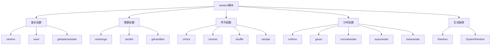

# Python标准库-random模块完全参考手册

## 概述

`random` 模块实现了各种分布的伪随机数生成器。它为整数提供了范围内的均匀选择，为序列提供了随机元素选择、随机排列生成和随机抽样功能。在实数范围内，提供了计算均匀、正态、对数正态、负指数、Gamma和Beta分布的函数。

random模块的核心功能包括：
- 基本随机数生成
- 整数随机操作
- 序列随机操作
- 各种概率分布
- 随机状态管理
- 自定义随机数生成器



## 基本使用

### 基本随机数

```python
import random

# 生成0.0到1.0之间的随机浮点数
random_float = random.random()
print(f"随机浮点数: {random_float}")

# 设置随机种子（可重现结果）
random.seed(42)
reproducible_float = random.random()
print(f"可重现的随机数: {reproducible_float}")
```

### 随机字节

```python
import random

# 生成随机字节
random_bytes = random.randbytes(10)
print(f"随机字节: {random_bytes}")
print(f"十六进制: {random_bytes.hex()}")
```

## 整数随机操作

### randrange

```python
import random

# 随机整数（0到n-1）
num1 = random.randrange(10)
print(f"0-9: {num1}")

# 指定范围（start到stop-1）
num2 = random.randrange(1, 10)
print(f"1-9: {num2}")

# 带步长
num3 = random.randrange(0, 10, 2)
print(f"0-9偶数: {num3}")
```

### randint

```python
import random

# 随机整数（包含边界）
num = random.randint(1, 100)
print(f"1-100: {num}")
```

### getrandbits

```python
import random

# 生成指定位数的随机整数
random_bits = random.getrandbits(8)
print(f"8位随机数: {random_bits}")
print(f"二进制: {bin(random_bits)}")
```

## 序列随机操作

### choice

```python
import random

# 随机选择一个元素
colors = ['red', 'green', 'blue', 'yellow']
selected_color = random.choice(colors)
print(f"随机颜色: {selected_color}")
```

### choices（带权重）

```python
import random

# 加权随机选择
items = ['A', 'B', 'C', 'D']
weights = [10, 30, 50, 10]

# 单次选择
selected = random.choices(items, weights=weights)[0]
print(f"加权选择: {selected}")

# 多次选择（允许重复）
multiple_selected = random.choices(items, weights=weights, k=5)
print(f"多次选择: {multiple_selected}")

# 使用累积权重
cum_weights = [10, 40, 90, 100]
selected_cum = random.choices(items, cum_weights=cum_weights, k=3)
print(f"累积权重选择: {selected_cum}")
```

### shuffle

```python
import random

# 原地打乱列表顺序
cards = ['A', 'K', 'Q', 'J', '10', '9', '8', '7']
print(f"原始顺序: {cards}")

random.shuffle(cards)
print(f"打乱后: {cards}")
```

### sample（不重复抽样）

```python
import random

# 随机抽样（不重复）
population = range(1, 50)
sampled = random.sample(population, 6)
print(f"彩票号码: {sorted(sampled)}")

# 使用counts参数指定重复元素
colors = ['red', 'blue']
counted_sample = random.sample(colors, counts=[5, 3], k=4)
print(f"计数抽样: {counted_sample}")
```

## 概率分布

### 均匀分布

```python
import random

# 均匀分布浮点数
uniform_num = random.uniform(1.0, 10.0)
print(f"均匀分布: {uniform_num}")

# 三角分布
triangular_num = random.triangular(0, 1, 0.5)
print(f"三角分布: {triangular_num}")
```

### 正态分布

```python
import random

# 正态分布（高斯分布）
gaussian_num = random.gauss(0, 1)
print(f"标准正态分布: {gaussian_num}")

# 正态分布（指定均值和标准差）
normal_num = random.normalvariate(50, 10)
print(f"正态分布: {normal_num}")
```

### 其他分布

```python
import random

# 指数分布
exp_num = random.expovariate(1.0)
print(f"指数分布: {exp_num}")

# Beta分布
beta_num = random.betavariate(2, 5)
print(f"Beta分布: {beta_num}")

# Gamma分布
gamma_num = random.gammavariate(2, 2)
print(f"Gamma分布: {gamma_num}")

# 对数正态分布
lognorm_num = random.lognormvariate(0, 1)
print(f"对数正态分布: {lognorm_num}")

# 帕累托分布
pareto_num = random.paretovariate(2)
print(f"帕累托分布: {pareto_num}")

# 威布尔分布
weibull_num = random.weibullvariate(1, 2)
print(f"威布尔分布: {weibull_num}")

# 冯·米塞斯分布（角度分布）
von_mises_num = random.vonmisesvariate(0, 1)
print(f"冯·米塞斯分布: {von_mises_num}")

# 二项分布（Python 3.12+）
binomial_num = random.binomialvariate(10, 0.5)
print(f"二项分布: {binomial_num}")
```

## 随机状态管理

### 保存和恢复状态

```python
import random

# 保存当前随机状态
state = random.getstate()

# 生成一些随机数
numbers = [random.random() for _ in range(5)]
print(f"第一组随机数: {numbers}")

# 恢复随机状态
random.setstate(state)

# 再次生成随机数（会得到相同结果）
repeat_numbers = [random.random() for _ in range(5)]
print(f"重复的随机数: {repeat_numbers}")
```

### 可重现的随机序列

```python
import random

# 设置种子以确保可重现性
random.seed(12345)

# 生成可重现的随机序列
sequence1 = [random.randint(1, 100) for _ in range(10)]
print(f"序列1: {sequence1}")

# 使用相同的种子重置
random.seed(12345)

sequence2 = [random.randint(1, 100) for _ in range(10)]
print(f"序列2: {sequence2}")

print(f"序列是否相同: {sequence1 == sequence2}")
```

## 自定义生成器

### Random类

```python
import random

# 创建独立的随机数生成器
rng1 = random.Random(42)
rng2 = random.Random(42)

# 两个生成器使用相同种子，会产生相同序列
print(f"生成器1: {rng1.random()}")
print(f"生成器2: {rng2.random()}")

# 与全局生成器不同
print(f"全局生成器: {random.random()}")
```

### SystemRandom（使用操作系统熵源）

```python
import random

# 使用系统随机数生成器（更安全，但不可重现）
secure_rng = random.SystemRandom()

secure_num = secure_rng.random()
print(f"安全随机数: {secure_num}")

# 随机选择
secure_choice = secure_rng.choice(['A', 'B', 'C', 'D'])
print(f"安全选择: {secure_choice}")
```

## 实战应用

### 1. 模拟掷骰子

```python
import random

def roll_dice(num_dice=2, sides=6):
    """掷骰子"""
    rolls = [random.randint(1, sides) for _ in range(num_dice)]
    return rolls

def roll_with_advantage():
    """有优势的投掷（取最高值）"""
    roll1 = random.randint(1, 20)
    roll2 = random.randint(1, 20)
    return max(roll1, roll2)

def roll_with_disadvantage():
    """有劣势的投掷（取最低值）"""
    roll1 = random.randint(1, 20)
    roll2 = random.randint(1, 20)
    return min(roll1, roll2)

# 使用示例
print(f"普通掷骰子: {roll_dice()}")
print(f"有优势的投掷: {roll_with_advantage()}")
print(f"有劣势的投掷: {roll_with_disadvantage()}")

# 模拟多次投掷统计
def simulate_dice_rolls(num_rolls=1000):
    """模拟多次掷骰子"""
    results = {}
    
    for _ in range(num_rolls):
        total = sum(roll_dice(2, 6))
        results[total] = results.get(total, 0) + 1
    
    # 计算概率
    probabilities = {total: count/num_rolls for total, count in results.items()}
    
    return probabilities

probabilities = simulate_dice_rolls()
print("骰子点数概率:")
for total in sorted(probabilities.keys()):
    print(f"  {total}: {probabilities[total]:.3f}")
```

### 2. 随机密码生成器

```python
import random
import string

class PasswordGenerator:
    """密码生成器"""
    
    def __init__(self):
        self.lowercase = string.ascii_lowercase
        self.uppercase = string.ascii_uppercase
        self.digits = string.digits
        self.symbols = string.punctuation
    
    def generate_password(self, length=12, use_uppercase=True, 
                         use_digits=True, use_symbols=True):
        """生成随机密码"""
        charset = self.lowercase
        
        if use_uppercase:
            charset += self.uppercase
        if use_digits:
            charset += self.digits
        if use_symbols:
            charset += self.symbols
        
        # 确保包含至少一个每种要求的字符类型
        password = []
        password.append(random.choice(self.lowercase))
        
        if use_uppercase:
            password.append(random.choice(self.uppercase))
        if use_digits:
            password.append(random.choice(self.digits))
        if use_symbols:
            password.append(random.choice(self.symbols))
        
        # 填充剩余长度
        remaining_length = length - len(password)
        password.extend(random.choices(charset, k=remaining_length))
        
        # 打乱顺序
        random.shuffle(password)
        
        return ''.join(password)
    
    def generate_memorable_password(self, num_words=4):
        """生成易记密码（单词组合）"""
        word_list = [
            'apple', 'banana', 'cherry', 'dragon', 'elephant',
            'forest', 'garden', 'happy', 'island', 'jungle',
            'knight', 'lemon', 'mountain', 'ocean', 'planet',
            'queen', 'river', 'star', 'tiger', 'umbrella'
        ]
        
        words = random.sample(word_list, num_words)
        
        # 添加随机数字
        password = '-'.join(words)
        password += str(random.randint(10, 99))
        
        return password

# 使用示例
generator = PasswordGenerator()

# 生成强密码
strong_password = generator.generate_password(
    length=16, 
    use_uppercase=True, 
    use_digits=True, 
    use_symbols=True
)
print(f"强密码: {strong_password}")

# 生成易记密码
memorable_password = generator.generate_memorable_password(4)
print(f"易记密码: {memorable_password}")
```

### 3. 随机抽样调查

```python
import random
from collections import defaultdict

class SurveySampler:
    """调查抽样器"""
    
    def __init__(self, population):
        self.population = list(population)
    
    def simple_random_sample(self, sample_size):
        """简单随机抽样"""
        if sample_size > len(self.population):
            raise ValueError("样本大小不能超过总体大小")
        
        return random.sample(self.population, sample_size)
    
    def stratified_sample(self, strata, sample_per_stratum):
        """分层抽样"""
        results = []
        
        for stratum_name, stratum_pop in strata.items():
            if len(stratum_pop) < sample_per_stratum:
                # 如果层样本不足，使用全部
                sample = stratum_pop
            else:
                sample = random.sample(stratum_pop, sample_per_stratum)
            
            results.extend([(stratum_name, item) for item in sample])
        
        return results
    
    def weighted_sample(self, sample_size, weights):
        """加权抽样"""
        if len(weights) != len(self.population):
            raise ValueError("权重数量必须与总体数量相同")
        
        return random.choices(self.population, weights=weights, k=sample_size)
    
    def bootstrap_sample(self, sample_size=None):
        """自助法抽样（有放回抽样）"""
        if sample_size is None:
            sample_size = len(self.population)
        
        return random.choices(self.population, k=sample_size)

# 使用示例
# 模拟总体
population = [f"用户{i+1}" for i in range(1000)]

# 创建抽样器
sampler = SurveySampler(population)

# 简单随机抽样
sample = sampler.simple_random_sample(50)
print(f"简单随机抽样: {len(sample)} 个样本")

# 分层抽样
strata = {
    'A组': [f"A{i+1}" for i in range(400)],
    'B组': [f"B{i+1}" for i in range(300)],
    'C组': [f"C{i+1}" for i in range(300)]
}

stratified_sample = sampler.stratified_sample(strata, 10)
print(f"分层抽样: {len(stratified_sample)} 个样本")

# 加权抽样（根据某种重要性）
weights = [random.random() for _ in range(1000)]
weighted_sample = sampler.weighted_sample(30, weights)
print(f"加权抽样: {len(weighted_sample)} 个样本")

# 自助法抽样
bootstrap_sample = sampler.bootstrap_sample(100)
print(f"自助法抽样: {len(bootstrap_sample)} 个样本")
```

### 4. 蒙特卡洛模拟

```python
import random
import math

class MonteCarloSimulator:
    """蒙特卡洛模拟器"""
    
    def estimate_pi(self, num_points=1000000):
        """估计π值"""
        inside_circle = 0
        
        for _ in range(num_points):
            # 在单位正方形内随机选择点
            x = random.uniform(-1, 1)
            y = random.uniform(-1, 1)
            
            # 检查是否在单位圆内
            if x**2 + y**2 <= 1:
                inside_circle += 1
        
        # π = 4 * (圆内点数 / 总点数)
        estimated_pi = 4 * inside_circle / num_points
        
        return estimated_pi
    
    def estimate_e(self, num_samples=100000):
        """估计e值"""
        total = 0
        
        for _ in range(num_samples):
            # 生成随机数，直到和超过1
            sum_random = 0
            count = 0
            
            while sum_random < 1:
                sum_random += random.random()
                count += 1
            
            total += count
        
        # e ≈ 平均所需的随机数数量
        estimated_e = total / num_samples
        
        return estimated_e
    
    def simulate_dice_game(self, num_games=10000):
        """模拟骰子游戏"""
        results = []
        
        for _ in range(num_games):
            # 掷两个骰子
            roll1 = random.randint(1, 6)
            roll2 = random.randint(1, 6)
            total = roll1 + roll2
            
            results.append(total)
        
        # 统计结果
        from collections import Counter
        counts = Counter(results)
        
        # 计算概率
        probabilities = {total: count/num_games 
                        for total, count in counts.items()}
        
        return probabilities
    
    def simulate_coin_toss(self, num_tosses=1000):
        """模拟抛硬币"""
        results = {'heads': 0, 'tails': 0}
        
        for _ in range(num_tosses):
            if random.random() < 0.5:
                results['heads'] += 1
            else:
                results['tails'] += 1
        
        probabilities = {
            'heads': results['heads'] / num_tosses,
            'tails': results['tails'] / num_tosses
        }
        
        return probabilities

# 使用示例
simulator = MonteCarloSimulator()

# 估计π值
estimated_pi = simulator.estimate_pi(100000)
print(f"π的估计值: {estimated_pi}")
print(f"π的实际值: {math.pi}")
print(f"误差: {abs(estimated_pi - math.pi):.6f}")

# 估计e值
estimated_e = simulator.estimate_e(10000)
print(f"\ne的估计值: {estimated_e}")
print(f"e的实际值: {math.e}")
print(f"误差: {abs(estimated_e - math.e):.6f}")

# 模拟骰子游戏
dice_probabilities = simulator.simulate_dice_game()
print(f"\n骰子点数概率:")
for total in sorted(dice_probabilities.keys()):
    print(f"  {total}: {dice_probabilities[total]:.3f}")

# 模拟抛硬币
coin_probabilities = simulator.simulate_coin_toss()
print(f"\n硬币正反面概率:")
print(f"  正面: {coin_probabilities['heads']:.3f}")
print(f"  反面: {coin_probabilities['tails']:.3f}")
```

### 5. 随机数据生成器

```python
import random
import string
from datetime import datetime, timedelta

class RandomDataGenerator:
    """随机数据生成器"""
    
    def __init__(self):
        self.rng = random.Random()
    
    def generate_name(self, gender=None):
        """生成随机姓名"""
        first_names_male = ['张', '王', '李', '赵', '陈', '刘', '杨', '黄', '周', '吴']
        first_names_female = ['李', '王', '张', '刘', '陈', '杨', '赵', '黄', '周', '吴']
        last_names = ['伟', '芳', '娜', '敏', '静', '丽', '强', '磊', '洋', '勇']
        
        if gender == 'male':
            first_name = random.choice(first_names_male)
        elif gender == 'female':
            first_name = random.choice(first_names_female)
        else:
            first_name = random.choice(first_names_male + first_names_female)
        
        last_name = random.choice(last_names)
        
        return first_name + last_name
    
    def generate_email(self, name=None):
        """生成随机邮箱"""
        if name is None:
            name = self.generate_name()
        
        domains = ['qq.com', '163.com', 'gmail.com', 'hotmail.com', 'outlook.com']
        domain = random.choice(domains)
        
        # 简化处理，实际应该更复杂
        email = f"{name}@{domain}"
        
        return email
    
    def generate_phone(self):
        """生成随机手机号"""
        # 中国手机号格式
        prefixes = ['130', '131', '132', '133', '134', '135', '136', '137', 
                   '138', '139', '150', '151', '152', '153', '155', '156',
                   '157', '158', '159', '180', '181', '182', '183', '185',
                   '186', '187', '188', '189']
        
        prefix = random.choice(prefixes)
        suffix = ''.join(random.choices(string.digits, k=8))
        
        return f"{prefix}{suffix}"
    
    def generate_date(self, start_year=1990, end_year=2005):
        """生成随机日期"""
        start_date = datetime(start_year, 1, 1)
        end_date = datetime(end_year, 12, 31)
        
        time_between = end_date - start_date
        days_between = time_between.days
        
        random_days = random.randrange(days_between)
        random_date = start_date + timedelta(days=random_days)
        
        return random_date.strftime('%Y-%m-%d')
    
    def generate_address(self):
        """生成随机地址"""
        cities = ['北京', '上海', '广州', '深圳', '杭州', '南京', '成都', '武汉']
        districts = ['朝阳区', '海淀区', '浦东新区', '南山区', '西湖区', '鼓楼区']
        streets = ['人民路', '解放路', '建设路', '和平路', '胜利路', '友谊路']
        
        city = random.choice(cities)
        district = random.choice(districts)
        street = random.choice(streets)
        number = random.randint(1, 999)
        
        return f"{city}{district}{street}{number}号"
    
    def generate_user_profile(self):
        """生成完整的用户资料"""
        profile = {
            'name': self.generate_name(),
            'email': self.generate_email(),
            'phone': self.generate_phone(),
            'birthday': self.generate_date(),
            'address': self.generate_address(),
            'gender': random.choice(['male', 'female']),
            'age': random.randint(18, 65)
        }
        
        return profile
    
    def generate_dataset(self, num_records=100):
        """生成数据集"""
        dataset = []
        
        for _ in range(num_records):
            profile = self.generate_user_profile()
            dataset.append(profile)
        
        return dataset

# 使用示例
generator = RandomDataGenerator()

# 生成单个用户资料
user_profile = generator.generate_user_profile()
print("用户资料:")
for key, value in user_profile.items():
    print(f"  {key}: {value}")

# 生成数据集
dataset = generator.generate_dataset(10)
print(f"\n生成了 {len(dataset)} 条用户数据")
```

## 性能优化

### 1. 预先生成随机数

```python
import random

# 不好的做法（每次调用都生成）
def process_items_bad(items):
    results = []
    for item in items:
        random_value = random.random()
        if random_value > 0.5:
            results.append(item)
    return results

# 好的做法（预先生成）
def process_items_good(items):
    random_values = [random.random() for _ in range(len(items))]
    results = []
    
    for item, random_value in zip(items, random_values):
        if random_value > 0.5:
            results.append(item)
    
    return results
```

### 2. 使用局部生成器

```python
import random

# 在多线程环境中，每个线程使用独立的生成器
def worker_function(data):
    # 每个线程有自己的随机数生成器
    local_rng = random.Random()
    
    results = []
    for item in data:
        if local_rng.random() > 0.5:
            results.append(item)
    
    return results
```

## 安全考虑

### 1. 密码学安全的随机数

```python
import random
import secrets

# ❌ 错误：用于密码学目的
def generate_token_bad():
    return ''.join(random.choices(string.ascii_letters + string.digits, k=32))

# ✅ 正确：使用secrets模块
def generate_token_good():
    return secrets.token_urlsafe(32)

# ✅ 也可以使用SystemRandom
def generate_token_secure():
    secure_rng = random.SystemRandom()
    return ''.join(secure_rng.choices(string.ascii_letters + string.digits, k=32))

print(f"不安全的令牌: {generate_token_bad()}")
print(f"安全的令牌: {generate_token_good()}")
print(f"SystemRandom令牌: {generate_token_secure()}")
```

### 2. 避免可预测的种子

```python
import random
import time

# ❌ 错误：使用可预测的种子
random.seed(int(time.time()))  # 可预测

# ✅ 正确：使用操作系统提供的随机性
# 对于密码学用途，使用secrets模块
# 对于模拟用途，可以使用random.seed(None)（默认行为）
```

## 常见问题

### Q1: random模块和secrets模块有什么区别？

**A**: random模块使用伪随机数生成器，用于模拟和统计用途，速度快但可预测。secrets模块使用操作系统提供的真随机源，适合密码学用途，更安全但可能较慢。

### Q2: 如何确保随机序列的可重现性？

**A**: 使用相同的种子值调用random.seed()，或者保存和恢复随机数生成器的状态（使用getstate()和setstate()）。

### Q3: 在多线程环境中使用random模块安全吗？

**A**: random模块是线程安全的，但在多线程环境中可能有性能问题。建议每个线程使用独立的Random实例，或者使用锁来保护随机数生成。

`random` 模块是Python中最重要和最常用的随机数生成模块，提供了：

1. **基本随机数**: 均匀分布的浮点数和整数
2. **序列操作**: 随机选择、打乱、抽样等功能
3. **概率分布**: 多种统计分布函数
4. **状态管理**: 可重现的随机序列
5. **自定义生成器**: 独立的随机数生成器实例
6. **安全选项**: SystemRandom用于更安全的需求

通过掌握 `random` 模块，您可以：
- 进行科学计算和统计模拟
- 实现随机抽样和调查
- 生成测试数据
- 创建游戏和模拟系统
- 进行蒙特卡洛模拟
- 实现各种随机算法

`random` 模块是Python中处理随机性问题的首选工具，它提供了从简单到复杂的各种随机功能。无论是基础的随机选择还是复杂的统计模拟，`random` 模块都能提供强大而灵活的解决方案。对于密码学用途，应该使用专门的`secrets`模块来确保安全性。