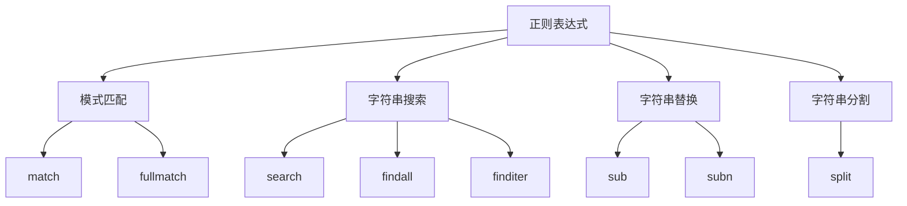

# Python标准库-re模块完全参考手册

## 概述

`re` 模块是Python标准库中提供正则表达式操作的核心模块，其功能类似于Perl中的正则表达式。正则表达式是一种强大的文本处理工具，能够通过模式匹配来查找、替换和验证字符串。

re模块的核心功能包括：
- 编译正则表达式模式
- 执行字符串匹配和搜索
- 执行字符串替换和分割
- 提供匹配对象和分组信息
- 支持Unicode和8位字符串

## 正则表达式基础

### 正则表达式概念

正则表达式（Regular Expression，简称regex或RE）是一种描述字符串模式的语法。一个正则表达式指定了一组与之匹配的字符串。re模块中的函数允许您检查特定字符串是否与给定的正则表达式匹配。



### 原始字符串的使用

在Python中编写正则表达式时，强烈建议使用原始字符串（raw string）表示法。因为正则表达式使用反斜杠字符（`'\'`）来表示特殊形式，而Python的字符串字面量也使用反斜杠作为转义字符。

```python
# 不好的做法 - 需要双重转义
pattern = "\\\\n"  # 实际匹配的是 "\n"

# 好的做法 - 使用原始字符串
pattern = r"\\n"   # 实际匹配的是 "\n"

# 示例：匹配字面反斜杠
import re
text = "C:\\Users\\username"

# 不使用原始字符串（复杂）
pattern = "\\\\\\\\"

# 使用原始字符串（简单）
pattern = r"\\"

matches = re.findall(pattern, text)
print(matches)  # ['\\', '\\']
```

### Unicode和8位字符串

re模块支持Unicode字符串（`str`）和8位字符串（`bytes`），但不能混合使用：

```python
import re

# Unicode字符串匹配
text = "Hello, 世界!"
pattern = r"[\u4e00-\u9fff]+"  # 匹配中文字符
matches = re.findall(pattern, text)
print(matches)  # ['世界']

# 8位字符串匹配
text = b"Hello, World!"
pattern = rb"[A-Z]+"
matches = re.findall(pattern, text)
print(matches)  # [b'Hello', b'World']

# 不能混合使用（会报错）
try:
    re.search(r"pattern", b"bytes")
except TypeError as e:
    print(f"Error: {e}")  # Error: cannot use a string pattern on a bytes-like object
```

## 正则表达式语法

### 特殊字符

正则表达式中的特殊字符具有特殊含义，需要特殊处理：

```mermaid
graph LR
    A[特殊字符] --> B[单字符匹配]
    A --> C[位置锚定]
    A --> D[重复限定]
    A --> E[分组和选择]
    A --> F[其他]

    B --> B1[.]
    B --> B2[[]]
    B --> B3[\d\D\s\S\w\W]

    C --> C1[^]
    C --> C2[$]
    C --> C3[\A\Z\z]

    D --> D1[*+?]
    D --> D2[{m,n}]

    E --> E1[()]
    E --> E2[|]

    F --> F1[\]
    F --> F2[\number]
```

#### 1. 点号（.）

在默认模式下，点号匹配除换行符外的任意字符。如果指定了 `DOTALL` 标志，则匹配包括换行符在内的任意字符。

```python
import re

text = "Hello\nWorld"

# 默认模式
matches = re.findall(r".", text)
print(matches)  # ['H', 'e', 'l', 'l', 'o', 'W', 'o', 'r', 'l', 'd']

# DOTALL模式
matches = re.findall(r".", text, re.DOTALL)
print(matches)  # ['H', 'e', 'l', 'l', 'o', '\n', 'W', 'o', 'r', 'l', 'd']
```

#### 2. 插入符号（^）

匹配字符串的开始，在 `MULTILINE` 模式下也匹配每个换行符之后的位置。

```python
import re

text = "Line 1\nLine 2\nLine 3"

# 默认模式
matches = re.findall(r"^Line", text)
print(matches)  # ['Line']

# MULTILINE模式
matches = re.findall(r"^Line", text, re.MULTILINE)
print(matches)  # ['Line', 'Line', 'Line']
```

#### 3. 美元符号（$）

匹配字符串的末尾，在 `MULTILINE` 模式下也匹配每个换行符之前的位置。

```python
import re

text = "Line 1\nLine 2\nLine 3"

# 默认模式
matches = re.findall(r"Line \d+$", text)
print(matches)  # ['Line 3']

# MULTILINE模式
matches = re.findall(r"Line \d+$", text, re.MULTILINE)
print(matches)  # ['Line 1', 'Line 2', 'Line 3']
```

#### 4. 重复限定符

- `*` - 匹配0次或多次（贪婪）
- `+` - 匹配1次或多次（贪婪）
- `?` - 匹配0次或1次（贪婪）
- `*?`, `+?`, `??` - 非贪婪版本
- `*+`, `++`, `?+` - 占有版本（不回溯）

```python
import re

text = "<a> b <c>"

# 贪婪匹配
matches = re.findall(r"<.*>", text)
print(matches)  # ['<a> b <c>']

# 非贪婪匹配
matches = re.findall(r"<.*?>", text)
print(matches)  # ['<a>', '<c>']

# 精确匹配
text = "aaaa"
matches = re.findall(r"a{2,4}", text)
print(matches)  # ['aaaa']

# 非贪婪精确匹配
matches = re.findall(r"a{2,4}?", text)
print(matches)  # ['aa', 'aa']
```

#### 5. 字符类（[]）

用于表示一组字符的集合：

```python
import re

text = "Hello, World! 123"

# 匹配单个字符
matches = re.findall(r"[aeiou]", text)
print(matches)  # ['e', 'o', 'o']

# 匹配范围
matches = re.findall(r"[a-z]", text)
print(matches)  # ['e', 'l', 'l', 'o', 'o', 'r', 'l', 'd']

# 匹配多个范围
matches = re.findall(r"[A-Za-z0-9]", text)
print(matches)  # ['H', 'e', 'l', 'l', 'o', 'W', 'o', 'r', 'l', 'd', '1', '2', '3']

# 取反
matches = re.findall(r"[^a-z]", text)
print(matches)  # ['H', ',', ' ', 'W', '!', ' ', '1', '2', '3']

# 转义特殊字符
text = "a-b c[d"
matches = re.findall(r"[a\-c\[]", text)
print(matches)  # ['a', '-', 'c', '[']
```

#### 6. 选择符（|）

表示"或"关系，匹配左边或右边的表达式：

```python
import re

text = "cat dog bat rat"

# 匹配多个选项
matches = re.findall(r"cat|dog|rat", text)
print(matches)  # ['cat', 'dog', 'rat']

# 在分组中使用
matches = re.findall(r"(cat|dog|bat)", text)
print(matches)  # ['cat', 'dog', 'bat']
```

#### 7. 分组（(...)）

用于分组和捕获匹配的子字符串：

```python
import re

text = "John: 25, Jane: 30, Bob: 35"

# 捕获分组
matches = re.findall(r"(\w+): (\d+)", text)
print(matches)  # [('John', '25'), ('Jane', '30'), ('Bob', '35')]

# 嵌套分组
text = "(123) 456-7890"
matches = re.findall(r"\((\d{3})\) (\d{3})-(\d{4})", text)
print(matches)  # [('123', '456', '7890')]
```

### 特殊序列

特殊序列由 `'\'` 和一个字符组成，具有特殊含义：

#### 1. 数字类

- `\d` - 匹配任何十进制数字
- `\D` - 匹配任何非十进制数字字符

```python
import re

text = "Phone: 123-456-7890"

# 匹配数字
matches = re.findall(r"\d", text)
print(matches)  # ['1', '2', '3', '4', '5', '6', '7', '8', '9', '0']

# 匹配非数字
matches = re.findall(r"\D", text)
print(matches)  # ['P', 'h', 'o', 'n', 'e', ':', ' ', '-', '-']
```

#### 2. 空白字符类

- `\s` - 匹配任何空白字符
- `\S` - 匹配任何非空白字符

```python
import re

text = "Hello World\tTest\nNew Line"

# 匹配空白字符
matches = re.findall(r"\s", text)
print(matches)  # [' ', '\t', '\n']

# 匹配非空白字符
matches = re.findall(r"\S", text)
print(matches)  # ['H', 'e', 'l', 'l', 'o', 'W', 'o', 'r', 'l', 'd', 'T', 'e', 's', 't', 'N', 'e', 'w', 'L', 'i', 'n', 'e']
```

#### 3. 单词字符类

- `\w` - 匹配任何单词字符（字母、数字、下划线）
- `\W` - 匹配任何非单词字符

```python
import re

text = "Hello, World! 123"

# 匹配单词字符
matches = re.findall(r"\w", text)
print(matches)  # ['H', 'e', 'l', 'l', 'o', 'W', 'o', 'r', 'l', 'd', '1', '2', '3']

# 匹配非单词字符
matches = re.findall(r"\W", text)
print(matches)  # [',', ' ', '!', ' ']
```

#### 4. 边界类

- `\A` - 只匹配字符串的开始
- `\Z` 或 `\z` - 只匹配字符串的结束
- `\b` - 匹配单词边界
- `\B` - 匹配非单词边界

```python
import re

text = "Hello, World! Hello again"

# 匹配字符串开始
matches = re.findall(r"\AHello", text)
print(matches)  # ['Hello']

# 匹配字符串结束
matches = re.findall(r"again\Z", text)
print(matches)  # ['again']

# 匹配单词边界
matches = re.findall(r"\bHello\b", text)
print(matches)  # ['Hello', 'Hello']

# 匹配非单词边界
matches = re.findall(r"ello\B", text)
print(matches)  # ['ello', 'ello']
```

#### 5. 分组引用

- `\number` - 匹配编号为number的分组内容

```python
import re

text = "hello hello, world world"

# 引用第一个分组
matches = re.findall(r"(\w+) \1", text)
print(matches)  # ['hello', 'world']
```

### 扩展语法

#### 1. 非捕获分组（(?:...)）

匹配但不捕获分组内容：

```python
import re

text = "a1 b2 c3 d4"

# 捕获分组
matches = re.findall(r"([a-z])(\d)", text)
print(matches)  # [('a', '1'), ('b', '2'), ('c', '3'), ('d', '4')]

# 非捕获分组
matches = re.findall(r"(?:[a-z])(\d)", text)
print(matches)  # ['1', '2', '3', '4']
```

#### 2. 命名分组（?P<name>...）

为分组指定名称，便于后续引用：

```python
import re

text = "John: 25, Jane: 30, Bob: 35"

# 使用命名分组
pattern = r"(?P<name>\w+): (?P<age>\d+)"
matches = re.finditer(pattern, text)

for match in matches:
    print(f"Name: {match.group('name')}, Age: {match.group('age')}")

# 输出:
# Name: John, Age: 25
# Name: Jane, Age: 30
# Name: Bob, Age: 35
```

#### 3. 前瞻断言

- `(?=...)` - 正向先行断言
- `(?!...)` - 负向先行断言

```python
import re

text = "apple, banana, cherry, grape"

# 正向先行断言 - 匹配后面跟着逗号的单词
matches = re.findall(r"\w+(?=,)", text)
print(matches)  # ['apple', 'banana', 'cherry']

# 负向先行断言 - 匹配后面不跟着逗号的单词
matches = re.findall(r"\w+(?!.*,)", text)
print(matches)  # ['grape']
```

#### 4. 后瞻断言

- `(?<=...)` - 正向后行断言
- `(?<!...)` - 负向后行断言

```python
import re

text = "$100, $200, $300"

# 正向后行断言 - 匹配美元符号后面的数字
matches = re.findall(r"(?<=\$)\d+", text)
print(matches)  # ['100', '200', '300']

# 负向后行断言 - 匹配不在美元符号后面的数字
matches = re.findall(r"\b\d+(?<!\$)\b", "100 $200 300")
print(matches)  # ['100', '300']
```

#### 5. 条件匹配

`(?(id/name)yes-pattern|no-pattern)` - 如果指定的分组存在则匹配yes-pattern，否则匹配no-pattern：

```python
import re

text1 = "user@host.com"
text2 = "<user@host.com>"

# 条件匹配 - 有尖括号时匹配完整格式，否则只匹配邮箱
pattern = r"(<)?(\w+@\w+(?:\.\w+)+)(?(1)>)"

print(re.fullmatch(pattern, text1))  # <re.Match object; span=(0, 13), match='user@host.com'>
print(re.fullmatch(pattern, text2))  # <re.Match object; span=(0, 15), match='<user@host.com>'>
```

## 模块函数

### 1. re.compile(pattern, flags=0)

编译正则表达式模式，返回一个正则表达式对象。对于需要重复使用的模式，建议先编译：

```python
import re

# 编译正则表达式
pattern = re.compile(r"\d+")

# 使用编译后的模式
text = "123 abc 456 def 789"
matches = pattern.findall(text)
print(matches)  # ['123', '456', '789']

# 使用标志编译
pattern = re.compile(r"[a-z]+", re.IGNORECASE)
matches = pattern.findall("Hello World")
print(matches)  # ['Hello', 'World']
```

### 2. re.match(pattern, string, flags=0)

从字符串的开头尝试匹配模式，如果匹配成功返回匹配对象，否则返回None：

```python
import re

text = "Hello, World!"

# 从开头匹配
match = re.match(r"Hello", text)
print(match.group())  # Hello

# 不匹配（不在开头）
match = re.match(r"World", text)
print(match)  # None

# 使用匹配对象
match = re.match(r"(\w+), (\w+)!", text)
if match:
    print(f"Greeting: {match.group(1)}, Target: {match.group(2)}")
    # Greeting: Hello, Target: World
```

### 3. re.search(pattern, string, flags=0)

在字符串中搜索模式的第一个匹配项：

```python
import re

text = "Hello, World!"

# 搜索模式
match = re.search(r"World", text)
print(match.group())  # World

# 搜索数字
text = "abc123def456ghi"
match = re.search(r"\d+", text)
print(match.group())  # 123

# 搜索并提取信息
text = "Email: user@example.com"
match = re.search(r"Email: (\w+@\w+\.\w+)", text)
if match:
    print(f"Found email: {match.group(1)}")
    # Found email: user@example.com
```

### 4. re.findall(pattern, string, flags=0)

返回字符串中所有非重叠匹配的列表：

```python
import re

text = "apple, banana, cherry, grape"

# 查找所有单词
matches = re.findall(r"\w+", text)
print(matches)  # ['apple', 'banana', 'cherry', 'grape']

# 查找所有数字
text = "Price: $100, $200, $300"
matches = re.findall(r"\d+", text)
print(matches)  # ['100', '200', '300']

# 使用分组
text = "John: 25, Jane: 30, Bob: 35"
matches = re.findall(r"(\w+): (\d+)", text)
print(matches)  # [('John', '25'), ('Jane', '30'), ('Bob', '35')]
```

### 5. re.finditer(pattern, string, flags=0)

返回一个迭代器，产生匹配对象：

```python
import re

text = "Emails: user1@example.com, user2@example.com, user3@example.com"

# 查找所有邮箱
matches = re.finditer(r"(\w+)@(\w+\.\w+)", text)

for match in matches:
    print(f"Username: {match.group(1)}, Domain: {match.group(2)}")

# 输出:
# Username: user1, Domain: example.com
# Username: user2, Domain: example.com
# Username: user3, Domain: example.com
```

### 6. re.sub(pattern, repl, string, count=0, flags=0)

使用替换字符串替换所有匹配项：

```python
import re

text = "Hello, World! Hello, Python!"

# 简单替换
result = re.sub(r"Hello", "Hi", text)
print(result)  # Hi, World! Hi, Python!

# 使用分组替换
text = "John: 25, Jane: 30"
result = re.sub(r"(\w+): (\d+)", r"\2-year-old \1", text)
print(result)  # 25-year-old John, 30-year-old Jane

# 使用函数替换
def replacer(match):
    age = int(match.group(2))
    return f"{match.group(1)} ({age} years old)"

result = re.sub(r"(\w+): (\d+)", replacer, text)
print(result)  # John (25 years old), Jane (30 years old)

# 限制替换次数
result = re.sub(r"Hello", "Hi", text, count=1)
print(result)  # Hi, World! Hello, Python!
```

### 7. re.subn(pattern, repl, string, count=0, flags=0)

与 `sub()` 类似，但返回一个元组（新字符串，替换次数）：

```python
import re

text = "Hello, World! Hello, Python!"

# 替换并获取次数
result, count = re.subn(r"Hello", "Hi", text)
print(f"Result: {result}, Count: {count}")
# Result: Hi, World! Hi, Python!, Count: 2
```

### 8. re.split(pattern, string, maxsplit=0, flags=0)

根据模式分割字符串：

```python
import re

text = "apple, banana; cherry| grape"

# 使用多个分隔符分割
result = re.split(r"[,;|]\s*", text)
print(result)  # ['apple', 'banana', 'cherry', 'grape']

# 限制分割次数
result = re.split(r"\s+", "one two three four five", maxsplit=2)
print(result)  # ['one', 'two', 'three four five']

# 捕获分隔符
result = re.split(r"([,;|])", "apple, banana; cherry")
print(result)  # ['apple', ',', ' banana', '; ', ' cherry']
```

### 9. re.fullmatch(pattern, string, flags=0)

如果整个字符串匹配模式，返回匹配对象：

```python
import re

# 完全匹配
text = "12345"
match = re.fullmatch(r"\d+", text)
print(match.group())  # 12345

# 不完全匹配
text = "123abc"
match = re.fullmatch(r"\d+", text)
print(match)  # None

# 验证格式
text = "user@example.com"
match = re.fullmatch(r"\w+@\w+\.\w+", text)
if match:
    print("Valid email address")
else:
    print("Invalid email address")
```

## 正则表达式对象

编译后的正则表达式对象提供了与模块函数相同的方法，但性能更好：

```python
import re

# 编译正则表达式
pattern = re.compile(r"\d+")

# 使用对象方法
text = "abc123def456ghi"

matches = pattern.findall(text)
print(matches)  # ['123', '456']

match = pattern.search(text)
print(match.group())  # 123

match = pattern.match("123abc")
print(match.group())  # 123

result = pattern.sub("NUM", "abc123def456")
print(result)  # abcNUMdefNUM

result = pattern.split("abc123def456ghi")
print(result)  # ['abc', 'def', 'ghi']
```

## 匹配对象

匹配对象包含关于匹配的详细信息：

```python
import re

text = "Hello, World! Hello, Python!"
match = re.search(r"Hello, (\w+)!", text)

if match:
    # 获取整个匹配
    print(f"Full match: {match.group()}")  # Full match: Hello, World!
    print(f"Full match: {match.group(0)}")  # Full match: Hello, World!

    # 获取分组
    print(f"Group 1: {match.group(1)}")  # Group 1: World

    # 获取所有分组
    print(f"Groups: {match.groups()}")  # Groups: ('World',)

    # 获取命名分组
    pattern = re.compile(r"(?P<greeting>\w+), (?P<target>\w+)!")
    match = pattern.search(text)
    print(f"Greeting: {match.group('greeting')}")  # Greeting: Hello
    print(f"Target: {match.group('target')}")  # Target: World

    # 获取匹配位置
    print(f"Start: {match.start()}")  # Start: 0
    print(f"End: {match.end()}")  # End: 13
    print(f"Span: {match.span()}")  # Span: (0, 13)

    # 获取匹配的字符串
    print(f"Matched string: {match.group()}")  # Matched string: Hello, World!
```

## 标志（Flags）

标志用于修改正则表达式的行为：

```python
import re

# IGNORECASE - 忽略大小写
text = "Hello World"
matches = re.findall(r"hello", text, re.IGNORECASE)
print(matches)  # ['Hello']

# MULTILINE - 多行模式
text = "Line 1\nLine 2\nLine 3"
matches = re.findall(r"^Line", text, re.MULTILINE)
print(matches)  # ['Line', 'Line', 'Line']

# DOTALL - 点号匹配所有字符
text = "Hello\nWorld"
matches = re.findall(r".+", text, re.DOTALL)
print(matches)  # ['Hello\nWorld']

# VERBOSE - 详细模式（允许注释和空白）
pattern = re.compile(r"""
    \b        # 单词边界
    \w+       # 单词字符
    @         # @符号
    \w+       # 域名
    \.        # 点号
    \w+       # 顶级域名
    \b        # 单词边界
""", re.VERBOSE)

text = "Contact us at info@example.com or support@test.com"
matches = pattern.findall(text)
print(matches)  # ['info@example.com', 'support@test.com']

# ASCII - 仅ASCII匹配
text = "café"
matches = re.findall(r"\w+", text, re.ASCII)
print(matches)  # ['caf']

# 组合标志
text = "Hello\nWorld\nPython"
matches = re.findall(r"^\w+", text, re.MULTILINE | re.IGNORECASE)
print(matches)  # ['Hello', 'World', 'Python']
```

## 实战应用

### 1. 验证邮箱地址

```python
import re

def validate_email(email):
    """验证邮箱地址格式"""
    pattern = r"""
        ^                       # 字符串开始
        [a-zA-Z0-9._%+-]+      # 用户名
        @                       # @符号
        [a-zA-Z0-9.-]+          # 域名
        \.                      # 点号
        [a-zA-Z]{2,}            # 顶级域名
        $                       # 字符串结束
    """
    return bool(re.fullmatch(pattern, email, re.VERBOSE))

emails = [
    "user@example.com",
    "user.name@example.com",
    "user+tag@example.co.uk",
    "invalid-email",
    "@example.com",
    "user@"
]

for email in emails:
    print(f"{email}: {validate_email(email)}")
```

### 2. 提取URL

```python
import re

def extract_urls(text):
    """从文本中提取URL"""
    pattern = r"""
        https?://                # 协议
        (?:www\.)?               # 可选的www
        [a-zA-Z0-9-]+            # 域名
        (?:\.[a-zA-Z0-9-]+)+     # 域名扩展
        (?:/\S*)?                # 可选的路径
    """
    return re.findall(pattern, text, re.VERBOSE)

text = """
Visit our website at https://www.example.com or check out our blog at http://blog.example.com/articles.
For more info, go to https://example.com/help.
"""

urls = extract_urls(text)
print(urls)
# ['https://www.example.com', 'http://blog.example.com', 'https://example.com/help']
```

### 3. 清理文本

```python
import re

def clean_text(text):
    """清理文本：移除多余空白、特殊字符等"""
    # 移除多余的空白
    text = re.sub(r'\s+', ' ', text)
    # 移除特殊字符（保留字母、数字、空格和标点）
    text = re.sub(r'[^\w\s.,!?;:\'-]', '', text)
    # 移除多余的空格
    text = re.sub(r'\s+([.,!?;:])', r'\1', text)
    return text.strip()

text = "Hello!!!   How are you??? I'm  fine...  Thanks!!!"
cleaned = clean_text(text)
print(cleaned)
# Hello!!! How are you??? I'm fine... Thanks!!!
```

### 4. 解析日志文件

```python
import re

def parse_log_line(line):
    """解析日志行"""
    pattern = r"""
        ^                       # 开始
        (\d{4}-\d{2}-\d{2})     # 日期
        \s+                     # 空格
        (\d{2}:\d{2}:\d{2})     # 时间
        \s+                     # 空格
        (\w+)                   # 日志级别
        \s+                     # 空格
        (.*)                    # 消息
        $                       # 结束
    """
    match = re.match(pattern, line, re.VERBOSE)

    if match:
        return {
            'date': match.group(1),
            'time': match.group(2),
            'level': match.group(3),
            'message': match.group(4)
        }
    return None

log_line = "2024-01-15 14:30:45 INFO User logged in successfully"
parsed = parse_log_line(log_line)
print(parsed)
# {'date': '2024-01-15', 'time': '14:30:45', 'level': 'INFO', 'message': 'User logged in successfully'}
```

### 5. HTML标签处理

```python
import re

def remove_html_tags(text):
    """移除HTML标签"""
    pattern = r'<[^>]+>'
    return re.sub(pattern, '', text)

html = "<p>Hello <strong>World</strong>!</p>"
cleaned = remove_html_tags(html)
print(cleaned)  # Hello World!

def extract_links(html):
    """提取HTML链接"""
    pattern = r'<a\s+(?:[^>]*?\s+)?href="([^"]*)"[^>]*>(.*?)</a>'
    return re.findall(pattern, html, re.IGNORECASE | re.DOTALL)

html = '<a href="https://example.com">Example</a> <a href="/about">About</a>'
links = extract_links(html)
print(links)
# [('https://example.com', 'Example'), ('/about', 'About')]
```

## 性能优化

### 1. 预编译正则表达式

```python
import re
import time

# 不好的做法 - 每次都重新编译
def find_emails_bad(text):
    emails = []
    for line in text.split('\n'):
        match = re.search(r'[\w\.-]+@[\w\.-]+\.\w+', line)
        if match:
            emails.append(match.group())
    return emails

# 好的做法 - 预编译正则表达式
EMAIL_PATTERN = re.compile(r'[\w\.-]+@[\w\.-]+\.\w+')

def find_emails_good(text):
    emails = []
    for line in text.split('\n'):
        match = EMAIL_PATTERN.search(line)
        if match:
            emails.append(match.group())
    return emails

# 性能测试
text = "Contact: user@example.com, test@test.com, info@info.com\n" * 1000

start = time.time()
emails_bad = find_emails_bad(text)
bad_time = time.time() - start

start = time.time()
emails_good = find_emails_good(text)
good_time = time.time() - start

print(f"Bad: {bad_time:.4f}s, Good: {good_time:.4f}s")
```

### 2. 使用非贪婪匹配

```python
import re

text = "<div>Content 1</div><div>Content 2</div>"

# 贪婪匹配 - 可能匹配过多
matches = re.findall(r"<div>.*</div>", text)
print(matches)  # ['<div>Content 1</div><div>Content 2</div>']

# 非贪婪匹配 - 精确匹配
matches = re.findall(r"<div>.*?</div>", text)
print(matches)  # ['<div>Content 1</div>', '<div>Content 2</div>']
```

### 3. 避免回溯

```python
import re

# 可能导致灾难性回溯的模式
text = "aaaaaaaaaaaaaaaaaaaaaaaaaaaaaaaab"

# 不好的模式 - 可能导致性能问题
pattern1 = r"a+a+a+a+a+a+a+a+"

# 好的模式 - 使用原子分组
pattern2 = r"(?>a+)+"

# 更好的模式 - 简化
pattern3 = r"a{10,}"

start = time.time()
match = re.match(pattern1, text)
bad_time = time.time() - start

start = time.time()
match = re.match(pattern2, text)
good_time = time.time() - start

print(f"Pattern 1: {bad_time:.6f}s, Pattern 2: {good_time:.6f}s")
```

## 最佳实践

### 1. 使用原始字符串

```python
import re

# 不好的做法
pattern = "\\d{3}-\\d{3}-\\d{4}"

# 好的做法
pattern = r"\d{3}-\d{3}-\d{4}"
```

### 2. 命名分组提高可读性

```python
import re

# 不好的做法
pattern = r"(\d{4})-(\d{2})-(\d{2})"

# 好的做法
pattern = r"(?P<year>\d{4})-(?P<month>\d{2})-(?P<day>\d{2})"

text = "2024-01-15"
match = re.match(pattern, text)
if match:
    print(f"Year: {match.group('year')}, Month: {match.group('month')}, Day: {match.group('day')}")
```

### 3. 使用VERBOSE标志编写复杂模式

```python
import re

# 不好的做法 - 难以阅读
pattern = r"^(?=.*[a-z])(?=.*[A-Z])(?=.*\d)(?=.*[@$!%*?&])[A-Za-z\d@$!%*?&]{8,}$"

# 好的做法 - 易于阅读
pattern = r"""
    ^                        # 开始
    (?=.*[a-z])              # 至少一个小写字母
    (?=.*[A-Z])              # 至少一个大写字母
    (?=.*\d)                 # 至少一个数字
    (?=.*[@$!%*?&])          # 至少一个特殊字符
    [A-Za-z\d@$!%*?&]{8,}    # 至少8个字符
    $                        # 结束
"""

password = "MyPass123@"
if re.fullmatch(pattern, password, re.VERBOSE):
    print("Password is valid")
```

### 4. 错误处理

```python
import re

def safe_findall(pattern, text, flags=0):
    """安全的findall函数"""
    try:
        return re.findall(pattern, text, flags)
    except re.error as e:
        print(f"Regex error: {e}")
        return []

# 测试
result = safe_findall(r"[a-z", "test")  # 无效的正则表达式
print(result)  # Regex error: ... []
```

## 常见问题

### Q1: 什么时候应该使用re.compile()？

**A**: 当您需要多次使用同一个正则表达式模式时，应该使用 `re.compile()`。这样可以避免每次调用时都重新编译模式，提高性能。

### Q2: 贪婪匹配和非贪婪匹配有什么区别？

**A**: 贪婪匹配（`*`, `+`, `?`）会尽可能多地匹配字符，而非贪婪匹配（`*?`, `+?`, `??`）会尽可能少地匹配字符。

### Q3: 如何避免正则表达式注入？

**A**: 如果需要使用用户输入作为正则表达式的一部分，应该先验证和清理输入，或者使用 `re.escape()` 函数转义特殊字符：

```python
import re

user_input = "hello.*world"

# 转义用户输入
safe_pattern = re.escape(user_input)
pattern = f"^{safe_pattern}$"

text = "hello.*world"
if re.fullmatch(pattern, text):
    print("Match found")
```

`re` 模块是Python中处理文本的强大工具，提供了：

1. **丰富的正则表达式语法**：支持各种模式匹配需求
2. **灵活的匹配方法**：match、search、findall等
3. **强大的替换功能**：支持字符串替换和分组替换
4. **性能优化**：支持预编译正则表达式
5. **Unicode支持**：支持Unicode字符串处理

通过掌握 `re` 模块的各种功能，您可以：
- 高效地处理和验证文本数据
- 从复杂文本中提取信息
- 执行强大的文本搜索和替换
- 解析和处理结构化文本

正则表达式是一个复杂的主题，建议通过实践来提高熟练度。从简单的模式开始，逐步学习更复杂的特性。记住，可读性和可维护性很重要，在复杂的模式中使用 `VERBOSE` 标志和注释。