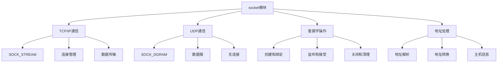

# Python标准库-socket模块完全参考手册

## 概述

`socket` 模块提供了对BSD套接字接口的访问，这是Python网络编程的基础。它支持TCP、UDP等多种网络协议，是构建网络应用程序的核心模块。

socket模块的核心功能包括：
- TCP/IP网络通信
- UDP数据报通信
- 套接字选项配置
- 地址解析和转换
- 网络服务器和客户端开发
- 多种地址族支持



## 基本概念

### 套接字类型

```python
import socket

# 地址族
print(f"AF_INET (IPv4): {socket.AF_INET}")
print(f"AF_INET6 (IPv6): {socket.AF_INET6}")
print(f"AF_UNIX (Unix域): {socket.AF_UNIX}")

# 套接字类型
print(f"SOCK_STREAM (TCP): {socket.SOCK_STREAM}")
print(f"SOCK_DGRAM (UDP): {socket.SOCK_DGRAM}")
print(f"SOCK_RAW (原始套接字): {socket.SOCK_RAW}")
```

### 创建套接字

```python
import socket

# 创建TCP套接字
tcp_socket = socket.socket(socket.AF_INET, socket.SOCK_STREAM)
print(f"TCP套接字: {tcp_socket}")

# 创建UDP套接字
udp_socket = socket.socket(socket.AF_INET, socket.SOCK_DGRAM)
print(f"UDP套接字: {udp_socket}")

# 创建IPv6套接字
ipv6_socket = socket.socket(socket.AF_INET6, socket.SOCK_STREAM)
print(f"IPv6套接字: {ipv6_socket}")
```

## TCP客户端

### 基本TCP客户端

```python
import socket

def tcp_client(host='127.0.0.1', port=8080):
    """基本TCP客户端"""
    # 创建套接字
    client_socket = socket.socket(socket.AF_INET, socket.SOCK_STREAM)
    
    try:
        # 连接服务器
        client_socket.connect((host, port))
        print(f"已连接到服务器 {host}:{port}")
        
        # 发送数据
        message = "Hello, Server!"
        client_socket.send(message.encode('utf-8'))
        print(f"已发送: {message}")
        
        # 接收数据
        response = client_socket.recv(1024)
        print(f"服务器响应: {response.decode('utf-8')}")
        
    except Exception as e:
        print(f"连接错误: {e}")
    finally:
        # 关闭套接字
        client_socket.close()
        print("连接已关闭")

# 使用示例
# tcp_client()
```

### 带超时的TCP客户端

```python
import socket

def tcp_client_with_timeout(host='127.0.0.1', port=8080, timeout=5):
    """带超时的TCP客户端"""
    client_socket = socket.socket(socket.AF_INET, socket.SOCK_STREAM)
    client_socket.settimeout(timeout)
    
    try:
        client_socket.connect((host, port))
        print(f"已连接到服务器 {host}:{port}")
        
        message = "Hello, Server with timeout!"
        client_socket.send(message.encode('utf-8'))
        print(f"已发送: {message}")
        
        response = client_socket.recv(1024)
        print(f"服务器响应: {response.decode('utf-8')}")
        
    except socket.timeout:
        print("连接超时")
    except Exception as e:
        print(f"连接错误: {e}")
    finally:
        client_socket.close()
```

## TCP服务器

### 基本TCP服务器

```python
import socket

def tcp_server(host='127.0.0.1', port=8080):
    """基本TCP服务器"""
    # 创建套接字
    server_socket = socket.socket(socket.AF_INET, socket.SOCK_STREAM)
    
    # 设置地址重用选项
    server_socket.setsockopt(socket.SOL_SOCKET, socket.SO_REUSEADDR, 1)
    
    try:
        # 绑定地址
        server_socket.bind((host, port))
        print(f"服务器启动在 {host}:{port}")
        
        # 开始监听
        server_socket.listen(5)
        print("等待客户端连接...")
        
        while True:
            # 接受客户端连接
            client_socket, client_address = server_socket.accept()
            print(f"客户端连接: {client_address}")
            
            try:
                # 接收数据
                data = client_socket.recv(1024)
                if data:
                    message = data.decode('utf-8')
                    print(f"收到消息: {message}")
                    
                    # 发送响应
                    response = f"Echo: {message}"
                    client_socket.send(response.encode('utf-8'))
                    
            except Exception as e:
                print(f"处理客户端错误: {e}")
            finally:
                # 关闭客户端连接
                client_socket.close()
                print(f"客户端 {client_address} 断开连接")
                
    except KeyboardInterrupt:
        print("服务器正在停止...")
    except Exception as e:
        print(f"服务器错误: {e}")
    finally:
        server_socket.close()
        print("服务器已关闭")

# 使用示例
# tcp_server()
```

### 多线程TCP服务器

```python
import socket
import threading

def handle_client(client_socket, client_address):
    """处理客户端连接"""
    print(f"新客户端连接: {client_address}")
    
    try:
        while True:
            # 接收数据
            data = client_socket.recv(1024)
            if not data:
                break
            
            message = data.decode('utf-8')
            print(f"来自 {client_address}: {message}")
            
            # 发送响应
            response = f"Server received: {message}"
            client_socket.send(response.encode('utf-8'))
            
    except Exception as e:
        print(f"客户端 {client_address} 错误: {e}")
    finally:
        client_socket.close()
        print(f"客户端 {client_address} 断开连接")

def tcp_multi_threaded_server(host='127.0.0.1', port=8080):
    """多线程TCP服务器"""
    server_socket = socket.socket(socket.AF_INET, socket.SOCK_STREAM)
    server_socket.setsockopt(socket.SOL_SOCKET, socket.SO_REUSEADDR, 1)
    
    try:
        server_socket.bind((host, port))
        server_socket.listen(5)
        print(f"多线程服务器启动在 {host}:{port}")
        
        while True:
            client_socket, client_address = server_socket.accept()
            
            # 为每个客户端创建新线程
            client_thread = threading.Thread(
                target=handle_client,
                args=(client_socket, client_address)
            )
            client_thread.daemon = True
            client_thread.start()
            
    except KeyboardInterrupt:
        print("服务器正在停止...")
    finally:
        server_socket.close()

# 使用示例
# tcp_multi_threaded_server()
```

## UDP通信

### UDP服务器

```python
import socket

def udp_server(host='127.0.0.1', port=8080):
    """UDP服务器"""
    server_socket = socket.socket(socket.AF_INET, socket.SOCK_DGRAM)
    server_socket.bind((host, port))
    
    print(f"UDP服务器启动在 {host}:{port}")
    
    try:
        while True:
            # 接收数据
            data, client_address = server_socket.recvfrom(1024)
            message = data.decode('utf-8')
            print(f"来自 {client_address}: {message}")
            
            # 发送响应
            response = f"UDP Server received: {message}"
            server_socket.sendto(response.encode('utf-8'), client_address)
            
    except KeyboardInterrupt:
        print("服务器正在停止...")
    finally:
        server_socket.close()
        print("服务器已关闭")
```

### UDP客户端

```python
import socket

def udp_client(host='127.0.0.1', port=8080):
    """UDP客户端"""
    client_socket = socket.socket(socket.AF_INET, socket.SOCK_DGRAM)
    
    try:
        message = "Hello, UDP Server!"
        client_socket.sendto(message.encode('utf-8'), (host, port))
        print(f"已发送: {message}")
        
        # 接收响应
        response, server_address = client_socket.recvfrom(1024)
        print(f"服务器响应: {response.decode('utf-8')}")
        
    except Exception as e:
        print(f"通信错误: {e}")
    finally:
        client_socket.close()
```

## 套接字选项

### 常用套接字选项

```python
import socket

def socket_options_example():
    """套接字选项示例"""
    sock = socket.socket(socket.AF_INET, socket.SOCK_STREAM)
    
    # 设置地址重用
    sock.setsockopt(socket.SOL_SOCKET, socket.SO_REUSEADDR, 1)
    
    # 设置超时
    sock.settimeout(30)
    
    # 设置缓冲区大小
    sock.setsockopt(socket.SOL_SOCKET, socket.SO_SNDBUF, 8192)
    sock.setsockopt(socket.SOL_SOCKET, socket.SO_RCVBUF, 8192)
    
    # 获取套接字选项
    recv_buffer = sock.getsockopt(socket.SOL_SOCKET, socket.SO_RCVBUF)
    print(f"接收缓冲区大小: {recv_buffer}")
    
    # 设置Keep-Alive
    sock.setsockopt(socket.SOL_SOCKET, socket.SO_KEEPALIVE, 1)
    
    # TCP特定选项
    # sock.setsockopt(socket.IPPROTO_TCP, socket.TCP_NODELAY, 1)
    
    sock.close()
    print("套接字选项设置完成")
```

## 地址解析

### 地址解析函数

```python
import socket

def address_resolution():
    """地址解析示例"""
    # 获取主机信息
    hostname = socket.gethostname()
    print(f"主机名: {hostname}")
    
    # 获取主机地址
    host_info = socket.gethostbyname(hostname)
    print(f"主机地址: {host_info}")
    
    # 获取详细信息
    detailed_info = socket.gethostbyname_ex(hostname)
    print(f"详细信息: {detailed_info}")
    
    # 反向DNS解析
    reverse_name = socket.gethostbyaddr('127.0.0.1')
    print(f"反向解析: {reverse_name}")
    
    # 获取地址信息
    addr_info = socket.getaddrinfo('www.google.com', 80)
    print(f"地址信息: {addr_info}")
```

## 实战应用

### 1. 简单的HTTP客户端

```python
import socket

def simple_http_client(url, port=80):
    """简单的HTTP客户端"""
    # 解析URL
    if '://' in url:
        url = url.split('://')[1]
    
    host = url.split('/')[0]
    path = '/' + '/'.join(url.split('/')[1:]) if '/' in url else '/'
    
    # 创建TCP连接
    client_socket = socket.socket(socket.AF_INET, socket.SOCK_STREAM)
    
    try:
        client_socket.connect((host, port))
        
        # 发送HTTP请求
        request = f"GET {path} HTTP/1.1\r\nHost: {host}\r\nConnection: close\r\n\r\n"
        client_socket.send(request.encode('utf-8'))
        
        # 接收响应
        response = b""
        while True:
            chunk = client_socket.recv(4096)
            if not chunk:
                break
            response += chunk
        
        # 解析响应
        response_text = response.decode('utf-8')
        headers, body = response_text.split('\r\n\r\n', 1)
        
        print("HTTP响应头:")
        print(headers)
        print("\n响应体 (前500字符):")
        print(body[:500])
        
    except Exception as e:
        print(f"HTTP请求错误: {e}")
    finally:
        client_socket.close()

# 使用示例
# simple_http_client('www.example.com')
```

### 2. 简单的聊天服务器

```python
import socket
import threading
import json

class ChatServer:
    """简单的聊天服务器"""
    
    def __init__(self, host='127.0.0.1', port=8080):
        self.host = host
        self.port = port
        self.clients = []
        self.server_socket = None
        self.running = False
    
    def broadcast(self, message, sender_socket=None):
        """广播消息给所有客户端"""
        for client in self.clients:
            if client != sender_socket:
                try:
                    client.send(message.encode('utf-8'))
                except:
                    self.clients.remove(client)
    
    def handle_client(self, client_socket, client_address):
        """处理客户端"""
        print(f"客户端连接: {client_address}")
        self.clients.append(client_socket)
        
        try:
            while True:
                data = client_socket.recv(1024)
                if not data:
                    break
                
                message = data.decode('utf-8')
                print(f"来自 {client_address}: {message}")
                
                # 广播消息
                self.broadcast(message, client_socket)
                
        except Exception as e:
            print(f"客户端 {client_address} 错误: {e}")
        finally:
            if client_socket in self.clients:
                self.clients.remove(client_socket)
            client_socket.close()
            print(f"客户端 {client_address} 断开连接")
    
    def start(self):
        """启动服务器"""
        self.server_socket = socket.socket(socket.AF_INET, socket.SOCK_STREAM)
        self.server_socket.setsockopt(socket.SOL_SOCKET, socket.SO_REUSEADDR, 1)
        
        try:
            self.server_socket.bind((self.host, self.port))
            self.server_socket.listen(5)
            self.running = True
            
            print(f"聊天服务器启动在 {self.host}:{self.port}")
            
            while self.running:
                client_socket, client_address = self.server_socket.accept()
                
                # 为每个客户端创建线程
                client_thread = threading.Thread(
                    target=self.handle_client,
                    args=(client_socket, client_address)
                )
                client_thread.daemon = True
                client_thread.start()
                
        except KeyboardInterrupt:
            print("服务器正在停止...")
        finally:
            self.stop()
    
    def stop(self):
        """停止服务器"""
        self.running = False
        if self.server_socket:
            self.server_socket.close()
        print("服务器已停止")

# 使用示例
# chat_server = ChatServer()
# chat_server.start()
```

### 3. 文件传输服务器

```python
import socket
import os
import hashlib

class FileTransferServer:
    """文件传输服务器"""
    
    def __init__(self, host='127.0.0.1', port=8080):
        self.host = host
        self.port = port
        self.upload_dir = 'uploads'
        os.makedirs(self.upload_dir, exist_ok=True)
    
    def calculate_checksum(self, file_path):
        """计算文件校验和"""
        hash_md5 = hashlib.md5()
        with open(file_path, "rb") as f:
            for chunk in iter(lambda: f.read(4096), b""):
                hash_md5.update(chunk)
        return hash_md5.hexdigest()
    
    def receive_file(self, client_socket, file_name, file_size):
        """接收文件"""
        file_path = os.path.join(self.upload_dir, file_name)
        
        with open(file_path, 'wb') as f:
            received_size = 0
            while received_size < file_size:
                chunk = client_socket.recv(min(4096, file_size - received_size))
                if not chunk:
                    break
                f.write(chunk)
                received_size += len(chunk)
        
        # 计算校验和
        checksum = self.calculate_checksum(file_path)
        return file_path, checksum
    
    def send_file(self, client_socket, file_path):
        """发送文件"""
        if not os.path.exists(file_path):
            client_socket.send(b"ERROR: File not found")
            return False
        
        file_size = os.path.getsize(file_path)
        file_name = os.path.basename(file_path)
        
        # 发送文件信息
        file_info = f"{file_name}|{file_size}"
        client_socket.send(file_info.encode('utf-8'))
        
        # 等待客户端确认
        ack = client_socket.recv(1024)
        if ack != b"READY":
            return False
        
        # 发送文件内容
        with open(file_path, 'rb') as f:
            while True:
                chunk = f.read(4096)
                if not chunk:
                    break
                client_socket.send(chunk)
        
        return True
    
    def start(self):
        """启动服务器"""
        server_socket = socket.socket(socket.AF_INET, socket.SOCK_STREAM)
        server_socket.setsockopt(socket.SOL_SOCKET, socket.SO_REUSEADDR, 1)
        
        try:
            server_socket.bind((self.host, self.port))
            server_socket.listen(5)
            print(f"文件传输服务器启动在 {self.host}:{self.port}")
            
            while True:
                client_socket, client_address = server_socket.accept()
                print(f"客户端连接: {client_address}")
                
                try:
                    # 接收命令
                    command = client_socket.recv(1024).decode('utf-8')
                    
                    if command.startswith("UPLOAD"):
                        # 上传文件
                        parts = command.split('|')
                        file_name = parts[1]
                        file_size = int(parts[2])
                        
                        file_path, checksum = self.receive_file(client_socket, file_name, file_size)
                        client_socket.send(f"OK|{checksum}".encode('utf-8'))
                        print(f"文件已接收: {file_path}")
                        
                    elif command.startswith("DOWNLOAD"):
                        # 下载文件
                        file_name = command.split('|')[1]
                        file_path = os.path.join(self.upload_dir, file_name)
                        
                        if self.send_file(client_socket, file_path):
                            print(f"文件已发送: {file_path}")
                        
                except Exception as e:
                    print(f"处理客户端错误: {e}")
                finally:
                    client_socket.close()
                    
        except KeyboardInterrupt:
            print("服务器正在停止...")
        finally:
            server_socket.close()

# 使用示例
# file_server = FileTransferServer()
# file_server.start()
```

### 4. 心跳检测

```python
import socket
import time
import threading

class HeartbeatServer:
    """心跳检测服务器"""
    
    def __init__(self, host='127.0.0.1', port=8080):
        self.host = host
        self.port = port
        self.clients = {}  # {client_socket: last_heartbeat}
        self.running = False
    
    def monitor_clients(self):
        """监控客户端心跳"""
        while self.running:
            current_time = time.time()
            timeout_clients = []
            
            for client_socket, last_heartbeat in self.clients.items():
                if current_time - last_heartbeat > 30:  # 30秒超时
                    timeout_clients.append(client_socket)
            
            for client_socket in timeout_clients:
                print(f"客户端超时，断开连接")
                client_socket.close()
                del self.clients[client_socket]
            
            time.sleep(5)
    
    def handle_client(self, client_socket, client_address):
        """处理客户端"""
        print(f"客户端连接: {client_address}")
        self.clients[client_socket] = time.time()
        
        try:
            while True:
                data = client_socket.recv(1024)
                if not data:
                    break
                
                message = data.decode('utf-8')
                if message == "HEARTBEAT":
                    # 更新心跳时间
                    self.clients[client_socket] = time.time()
                    client_socket.send(b"ALIVE")
                else:
                    print(f"来自 {client_address}: {message}")
                    client_socket.send(b"OK")
                    
        except Exception as e:
            print(f"客户端 {client_address} 错误: {e}")
        finally:
            if client_socket in self.clients:
                del self.clients[client_socket]
            client_socket.close()
            print(f"客户端 {client_address} 断开连接")
    
    def start(self):
        """启动服务器"""
        server_socket = socket.socket(socket.AF_INET, socket.SOCK_STREAM)
        server_socket.setsockopt(socket.SOL_SOCKET, socket.SO_REUSEADDR, 1)
        
        try:
            server_socket.bind((self.host, self.port))
            server_socket.listen(5)
            self.running = True
            
            # 启动监控线程
            monitor_thread = threading.Thread(target=self.monitor_clients)
            monitor_thread.daemon = True
            monitor_thread.start()
            
            print(f"心跳检测服务器启动在 {self.host}:{self.port}")
            
            while self.running:
                client_socket, client_address = server_socket.accept()
                
                # 为每个客户端创建线程
                client_thread = threading.Thread(
                    target=self.handle_client,
                    args=(client_socket, client_address)
                )
                client_thread.daemon = True
                client_thread.start()
                
        except KeyboardInterrupt:
            print("服务器正在停止...")
        finally:
            self.running = False
            server_socket.close()
```

### 5. 端口扫描器

```python
import socket
import threading
from datetime import datetime

class PortScanner:
    """端口扫描器"""
    
    def __init__(self, host='127.0.0.1'):
        self.host = host
        self.open_ports = []
        self.lock = threading.Lock()
    
    def scan_port(self, port):
        """扫描单个端口"""
        try:
            sock = socket.socket(socket.AF_INET, socket.SOCK_STREAM)
            sock.settimeout(1)
            
            result = sock.connect_ex((self.host, port))
            
            if result == 0:
                with self.lock:
                    self.open_ports.append(port)
                    print(f"端口 {port}: 开放")
            
            sock.close()
            
        except Exception:
            pass
    
    def scan_range(self, start_port, end_port):
        """扫描端口范围"""
        start_time = datetime.now()
        print(f"开始扫描 {self.host} 端口 {start_port}-{end_port}")
        
        threads = []
        
        for port in range(start_port, end_port + 1):
            thread = threading.Thread(target=self.scan_port, args=(port,))
            thread.start()
            threads.append(thread)
            
            # 限制并发线程数
            if len(threads) >= 50:
                for t in threads:
                    t.join()
                threads.clear()
        
        # 等待剩余线程完成
        for thread in threads:
            thread.join()
        
        end_time = datetime.now()
        scan_duration = end_time - start_time
        
        print(f"\n扫描完成，耗时: {scan_duration}")
        print(f"发现 {len(self.open_ports)} 个开放端口:")
        for port in sorted(self.open_ports):
            print(f"  - 端口 {port}")
        
        return self.open_ports

# 使用示例
# scanner = PortScanner('localhost')
# scanner.scan_range(1, 1024)
```

## 性能优化

### 1. 非阻塞I/O

```python
import socket
import select

def non_blocking_example():
    """非阻塞I/O示例"""
    server_socket = socket.socket(socket.AF_INET, socket.SOCK_STREAM)
    server_socket.setblocking(False)
    server_socket.bind(('127.0.0.1', 8080))
    server_socket.listen(5)
    
    inputs = [server_socket]
    outputs = []
    
    print("非阻塞服务器启动...")
    
    while inputs:
        readable, writable, exceptional = select.select(inputs, outputs, inputs, 1)
        
        for s in readable:
            if s is server_socket:
                # 新连接
                client_socket, client_address = s.accept()
                client_socket.setblocking(False)
                inputs.append(client_socket)
                print(f"新连接: {client_address}")
            else:
                # 处理数据
                try:
                    data = s.recv(1024)
                    if data:
                        print(f"收到数据: {data.decode('utf-8')}")
                        if s not in outputs:
                            outputs.append(s)
                    else:
                        # 连接关闭
                        if s in outputs:
                            outputs.remove(s)
                        inputs.remove(s)
                        s.close()
                except:
                    if s in outputs:
                        outputs.remove(s)
                    inputs.remove(s)
                    s.close()
        
        for s in writable:
            try:
                s.send(b"ACK")
                outputs.remove(s)
            except:
                if s in outputs:
                    outputs.remove(s)
                inputs.remove(s)
                s.close()
        
        for s in exceptional:
            inputs.remove(s)
            if s in outputs:
                outputs.remove(s)
            s.close()
```

## 安全考虑

### 1. SSL/TLS加密

```python
import socket
import ssl

def ssl_client(host='www.google.com', port=443):
    """SSL客户端"""
    # 创建SSL上下文
    context = ssl.create_default_context()
    
    # 创建套接字
    sock = socket.socket(socket.AF_INET, socket.SOCK_STREAM)
    
    try:
        # 包装为SSL套接字
        ssl_socket = context.wrap_socket(sock, server_hostname=host)
        ssl_socket.connect((host, port))
        
        print(f"SSL连接已建立: {ssl_socket.version()}")
        print(f"证书信息: {ssl_socket.getpeercert()}")
        
        # 发送HTTP请求
        request = "GET / HTTP/1.1\r\nHost: www.google.com\r\nConnection: close\r\n\r\n"
        ssl_socket.send(request.encode('utf-8'))
        
        # 接收响应
        response = ssl_socket.recv(4096)
        print(f"响应 (前500字符): {response.decode('utf-8')[:500]}")
        
    except Exception as e:
        print(f"SSL连接错误: {e}")
    finally:
        ssl_socket.close()
```

## 常见问题

### Q1: TCP和UDP有什么区别？

**A**: TCP是面向连接的可靠协议，保证数据顺序和完整性，适合文件传输等需要可靠性的场景。UDP是无连接的不可靠协议，不保证数据到达和顺序，但速度快，适合实时音视频等对延迟敏感的场景。

### Q2: 如何处理网络超时？

**A**: 使用settimeout()方法设置套接字超时，或者在非阻塞模式下使用select()进行多路复用。超时后会抛出socket.timeout异常，需要正确处理。

### Q3: 如何避免端口占用错误？

**A**: 使用SO_REUSEADDR套接字选项，在绑定前调用setsockopt()设置该选项。此外，确保程序退出时正确关闭所有套接字。

`socket` 模块是Python网络编程的基础，提供了：

1. **完整的TCP/IP支持**: 面向连接和无连接的网络通信
2. **多种协议支持**: TCP、UDP、原始套接字等
3. **灵活的配置**: 丰富的套接字选项和参数
4. **跨平台兼容**: 支持多种操作系统和网络协议
5. **高性能选项**: 支持非阻塞I/O和多路复用
6. **安全扩展**: 与ssl模块集成实现加密通信

通过掌握 `socket` 模块，您可以：
- 开发各种网络服务器和客户端
- 实现自定义协议通信
- 构建高性能网络应用
- 处理网络编程中的各种问题
- 实现文件传输、聊天等功能
- 进行网络诊断和监控

`socket` 模块是Python网络编程的基石，虽然底层但功能强大。对于更高级的网络应用开发，可以考虑使用基于socket的高级框架如socketserver、asyncio等。但掌握socket模块对于理解网络编程原理和解决复杂网络问题仍然非常重要。