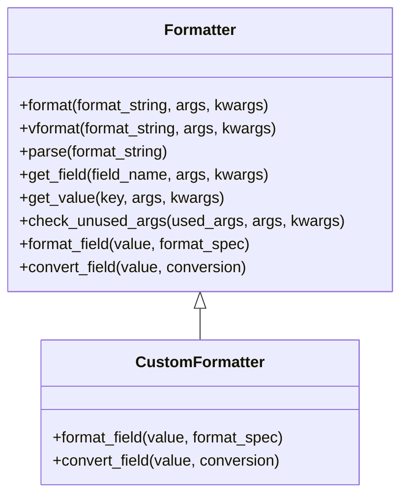
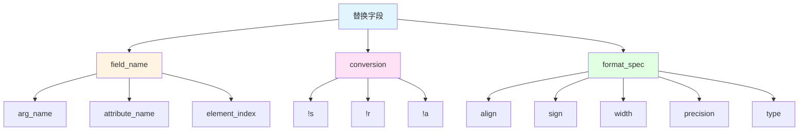

# Python标准库-string模块完全参考手册

## 概述

`string` 模块是Python标准库中提供字符串操作的专用模块，包含了一系列字符串常量、格式化功能和模板字符串支持。该模块为字符串处理提供了标准化的解决方案，是Python文本处理能力的重要组成部分。

string模块的核心功能包括：
- 提供标准字符串常量
- 支持自定义字符串格式化行为
- 实现简单的模板字符串替换
- 提供与内置字符串方法互补的功能

## 字符串常量

string模块定义了一组重要的字符串常量，这些常量在文本处理中经常使用，可以避免硬编码字符集，提高代码的可读性和可维护性。

### ASCII字符常量

以下是string模块中定义的ASCII字符常量：

```mermaid
graph TD
    A[string模块字符常量] --> B[ascii_lowercase]
    A --> C[ascii_uppercase]
    A --> D[ascii_letters]
    A --> E[digits]
    A --> F[hexdigits]
    A --> G[octdigits]
    A --> H[punctuation]
    A --> I[printable]
    A --> J[whitespace]

    B --> B1['abcdefghijklmnopqrstuvwxyz']
    C --> C1['ABCDEFGHIJKLMNOPQRSTUVWXYZ']
    D --> D1[lowercase + uppercase]
    E --> E1['0123456789']
    F --> F1['0123456789abcdefABCDEF']
    G --> G1['01234567']
    H --> H1['!"#$%&'()*+,-./:;<=>?@[\]^_`{|}~']
    I --> I1[digits + ascii_letters + punctuation + whitespace]
    J --> J1[空格、制表符、换行符等]
```

### 常量详解

#### 1. `string.ascii_lowercase`
所有ASCII小写字母的字符串，值为 `'abcdefghijklmnopqrstuvwxyz'`。该值不依赖于语言环境设置，是固定不变的。

```python
import string

print(string.ascii_lowercase)  # abcdefghijklmnopqrstuvwxyz
```

#### 2. `string.ascii_uppercase`
所有ASCII大写字母的字符串，值为 `'ABCDEFGHIJKLMNOPQRSTUVWXYZ'`。同样不依赖于语言环境设置。

```python
import string

print(string.ascii_uppercase)  # ABCDEFGHIJKLMNOPQRSTUVWXYZ
```

#### 3. `string.ascii_letters`
`ascii_lowercase` 和 `ascii_uppercase` 的连接，包含所有ASCII字母字符。

```python
import string

print(string.ascii_letters)  # abcdefghijklmnopqrstuvwxyzABCDEFGHIJKLMNOPQRSTUVWXYZ
```

#### 4. `string.digits`
所有十进制数字的字符串，值为 `'0123456789'`。

```python
import string

print(string.digits)  # 0123456789
```

#### 5. `string.hexdigits`
包含所有十六进制字符的字符串，值为 `'0123456789abcdefABCDEF'`。

```python
import string

print(string.hexdigits)  # 0123456789abcdefABCDEF
```

#### 6. `string.octdigits`
包含所有八进制字符的字符串，值为 `'01234567'`。

```python
import string

print(string.octdigits)  # 01234567
```

#### 7. `string.punctuation`
包含所有ASCII标点符号的字符串，值为 `!"#$%&'()*+,-./:;<=>?@[\]^_`{|}~`。这些字符在C语言环境中被认为是标点符号。

```python
import string

print(string.punctuation)  # !"#$%&'()*+,-./:;<=>?@[\]^_`{|}~
```

#### 8. `string.printable`
包含所有Python认为是可打印的ASCII字符的字符串。这是 `digits`、`ascii_letters`、`punctuation` 和 `whitespace` 的组合。

```python
import string

print(string.printable)  # 包含数字、字母、标点和空白字符
```

**注意**：`string.printable.isprintable()` 会返回 `False`，因为 `string.printable` 在POSIX意义上并不是真正可打印的。

#### 9. `string.whitespace`
包含所有ASCII空白字符的字符串，包括空格、制表符、换行符、回车符、换页符和垂直制表符。

```python
import string

print(repr(string.whitespace))  # ' \t\n\r\x0b\x0c'
```

### 常量应用示例

这些常量在实际编程中非常有用，以下是一些典型的应用场景：

```python
import string
import random

# 生成随机密码
def generate_password(length=12):
    """生成包含字母、数字和标点的随机密码"""
    characters = string.ascii_letters + string.digits + string.punctuation
    password = ''.join(random.choice(characters) for _ in range(length))
    return password

print(generate_password())  # 例如: aK9@mN#2$xPq

# 验证字符串组成
def is_alphanumeric(text):
    """检查字符串是否只包含字母和数字"""
    return all(c in string.ascii_letters + string.digits for c in text)

print(is_alphanumeric("Hello123"))  # True
print(is_alphanumeric("Hello 123"))  # False

# 字符分类统计
def count_characters(text):
    """统计文本中各类字符的数量"""
    counts = {
        'letters': 0,
        'digits': 0,
        'punctuation': 0,
        'whitespace': 0
    }

    for char in text:
        if char in string.ascii_letters:
            counts['letters'] += 1
        elif char in string.digits:
            counts['digits'] += 1
        elif char in string.punctuation:
            counts['punctuation'] += 1
        elif char in string.whitespace:
            counts['whitespace'] += 1

    return counts

text = "Hello, World! 123"
print(count_characters(text))
# {'letters': 10, 'digits': 3, 'punctuation': 2, 'whitespace': 3}
```

## Formatter类

`string.Formatter` 类允许您创建和自定义自己的字符串格式化行为，它使用与内置 `format()` 方法相同的实现。这个类为高级格式化需求提供了灵活的扩展机制。

### Formatter类架构



### 主要方法

#### 1. `format(format_string, /, args, kwargs)`

主要的API方法，接受格式字符串和任意数量的位置参数和关键字参数。这实际上是一个包装器，调用了 `vformat()` 方法。

```python
from string import Formatter

formatter = Formatter()
result = formatter.format("Hello, {}!", "World")
print(result)  # Hello, World!

result = formatter.format("Name: {name}, Age: {age}", name="Alice", age=30)
print(result)  # Name: Alice, Age: 30
```

#### 2. `vformat(format_string, args, kwargs)`

执行实际的格式化工作。当您想要传入预定义的参数字典，而不是使用 `*args` 和 `**kwargs` 语法解包和重新打包字典时，这个方法很有用。

```python
from string import Formatter

formatter = Formatter()
data = {'name': 'Bob', 'age': 25}
result = formatter.vformat("Name: {name}, Age: {age}", [], data)
print(result)  # Name: Bob, Age: 25
```

### 可覆盖的方法

`Formatter` 类定义了一些可以被子类替换的方法，以便自定义格式化行为：

#### 3. `parse(format_string)`

遍历格式字符串并返回可迭代的元组 `(literal_text, field_name, format_spec, conversion)`。这被 `vformat()` 用来将字符串分解为字面文本或替换字段。

```python
from string import Formatter

formatter = Formatter()
format_string = "Hello, {name}! You are {age:d} years old."
tokens = list(formatter.parse(format_string))

for token in tokens:
    print(token)

# 输出:
# ('Hello, ', 'name', '', None)
# ('! You are ', 'age', 'd', None)
# (' years old.', None, None, None)
```

#### 4. `get_field(field_name, args, kwargs)`

给定 `field_name`，将其转换为要格式化的对象。返回一个元组 `(obj, used_key)`。

```python
from string import Formatter

class DebugFormatter(Formatter):
    def get_field(self, field_name, args, kwargs):
        obj, used_key = super().get_field(field_name, args, kwargs)
        print(f"Field: {field_name}, Value: {obj}, Used key: {used_key}")
        return obj, used_key

formatter = DebugFormatter()
result = formatter.format("Name: {name}, Age: {age}", name="Alice", age=30)
print(result)

# 输出:
# Field: name, Value: Alice, Used key: name
# Field: age, Value: 30, Used key: age
# Name: Alice, Age: 30
```

#### 5. `get_value(key, args, kwargs)`

检索给定的字段值。如果 `key` 是整数，表示 `args` 中位置参数的索引；如果是字符串，表示 `kwargs` 中的命名参数。

```python
from string import Formatter

class CustomFormatter(Formatter):
    def get_value(self, key, args, kwargs):
        try:
            return super().get_value(key, args, kwargs)
        except (KeyError, IndexError):
            return f"[MISSING:{key}]"

formatter = CustomFormatter()
result = formatter.format("Name: {name}, Age: {age}", name="Alice")
print(result)  # Name: Alice, Age: [MISSING:age]
```

#### 6. `check_unused_args(used_args, args, kwargs)`

如果需要，实现检查未使用参数的功能。

```python
from string import Formatter

class StrictFormatter(Formatter):
    def check_unused_args(self, used_args, args, kwargs):
        unused_pos = set(range(len(args))) - used_args
        unused_kw = set(kwargs.keys()) - used_args

        if unused_pos or unused_kw:
            unused = []
            if unused_pos:
                unused.extend(f"positional {i}" for i in unused_pos)
            if unused_kw:
                unused.extend(f"keyword '{k}'" for k in unused_kw)
            raise ValueError(f"Unused arguments: {', '.join(unused)}")

formatter = StrictFormatter()
try:
    result = formatter.format("Name: {name}", name="Alice", age=30)
except ValueError as e:
    print(e)  # Unused arguments: keyword 'age'
```

#### 7. `format_field(value, format_spec)`

简单地调用全局的 `format()` 内置函数。提供这个方法是为了让子类可以覆盖它。

```python
from string import Formatter

class UpperFormatter(Formatter):
    def format_field(self, value, format_spec):
        if isinstance(value, str):
            value = value.upper()
        return super().format_field(value, format_spec)

formatter = UpperFormatter()
result = formatter.format("Hello, {name}!", name="world")
print(result)  # Hello, WORLD!
```

#### 8. `convert_field(value, conversion)`

根据转换类型转换值。默认版本理解 's' (str)、'r' (repr) 和 'a' (ascii) 转换类型。

```python
from string import Formatter

class DebugFormatter(Formatter):
    def convert_field(self, value, conversion):
        print(f"Converting {value!r} with conversion {conversion}")
        return super().convert_field(value, conversion)

formatter = DebugFormatter()
result = formatter.format("Value: {value!r}", value="test")
print(result)

# 输出:
# Converting 'test' with conversion r
# Value: 'test'
```

### 自定义Formatter示例

下面是一个完整的自定义Formatter示例，实现了货币格式化：

```python
from string import Formatter

class CurrencyFormatter(Formatter):
    """支持货币格式化的自定义Formatter"""

    def format_field(self, value, format_spec):
        if format_spec.endswith('$'):
            # 移除货币符号标记
            format_spec = format_spec[:-1]
            # 格式化为货币
            if isinstance(value, (int, float)):
                formatted = f"¥{value:,.2f}"
                return formatted
        return super().format_field(value, format_spec)

formatter = CurrencyFormatter()

# 使用货币格式化
price = 12345.6789
result = formatter.format("商品价格: {price:$}", price=price)
print(result)  # 商品价格: ¥12,345.68

# 正常格式化
result = formatter.format("普通数值: {price:.2f}", price=price)
print(result)  # 普通数值: 12345.68
```

## 格式化字符串语法

`str.format()` 方法和 `Formatter` 类共享相同的格式字符串语法。格式字符串包含被花括号 `{}` 包围的"替换字段"。花括号外的任何内容都被视为字面文本，会原样复制到输出中。

### 基本语法



### 替换字段结构

替换字段的基本语法为：

```
{field_name!conversion:format_spec}
```

- **field_name**: 指定要格式化的对象
- **conversion**: 可选的转换标志（`!s`, `!r`, `!a`）
- **format_spec**: 格式规范

### field_name详解

field_name 可以是：

1. **位置参数**：数字或省略数字（自动编号）
2. **关键字参数**：标识符名称
3. **属性访问**：使用 `.` 访问对象属性
4. **元素访问**：使用 `[]` 访问序列元素

```python
# 位置参数
print("{0}, {1}, {2}".format('a', 'b', 'c'))  # a, b, c
print("{}, {}, {}".format('a', 'b', 'c'))    # a, b, c (自动编号)
print("{2}, {1}, {0}".format('a', 'b', 'c'))  # c, b, a

# 关键字参数
print("Name: {name}, Age: {age}".format(name="Alice", age=30))

# 属性访问
class Point:
    def __init__(self, x, y):
        self.x, self.y = x, y

p = Point(4, 2)
print("Point: ({0.x}, {0.y})".format(p))  # Point: (4, 2)

# 元素访问
coords = [3, 5]
print("X: {0[0]}, Y: {0[1]}".format(coords))  # X: 3, Y: 5
```

### conversion转换标志

转换标志在格式化之前强制进行类型转换：

- `!s`: 调用 `str()` 转换
- `!r`: 调用 `repr()` 转换
- `!a`: 调用 `ascii()` 转换

```python
print("Value: {!s}".format("test"))    # Value: test
print("Value: {!r}".format("test"))    # Value: 'test'
print("Value: {!a}".format("测试"))    # Value: '\u6d4b\u8bd5'
```

### format_spec格式规范

format_spec 指定值的呈现方式，包括字段宽度、对齐、填充、十进制精度等。

## 格式规范迷你语言

格式规范迷你语言定义了如何在替换字段中呈现值。大多数内置类型支持通用的格式化迷你语言。

### 标准格式规范语法

```
[[fill]align][sign][z][#][0][width][grouping_option][.precision][type]
```

### align对齐选项

| 选项 | 含义 |
|------|------|
| `<` | 左对齐（大多数对象的默认值） |
| `>` | 右对齐（数字的默认值） |
| `=` | 填充在符号之后、数字之前（仅对数字有效） |
| `^` | 居中对齐 |

```python
print("{:<30}".format("left aligned"))      # left aligned
print("{:>30}".format("right aligned"))    # right aligned
print("{:^30}".format("centered"))         # centered
print("{:*^30}".format("centered"))        # *******centered********
```

### sign符号选项

| 选项 | 含义 |
|------|------|
| `+` | 正数和负数都显示符号 |
| `-` | 只显示负数符号（默认） |
| ` ` | 正数显示空格，负数显示减号 |

```python
print("{:+f}; {:+f}".format(3.14, -3.14))  # +3.140000; -3.140000
print("{: f}; {: f}".format(3.14, -3.14))  #  3.140000; -3.140000
print("{:-f}; {:-f}".format(3.14, -3.14))  # 3.140000; -3.140000
```

### width宽度

width 是定义最小总字段宽度的十进制整数。

```python
print("{:10}".format("test"))     # 'test      '
print("{:10}".format(42))         # '        42'
```

### precision精度

precision 是指示在小数点后显示多少位数字的十进制整数。

```python
print("{:.2f}".format(3.14159))   # 3.14
print("{:.4f}".format(3.14159))   # 3.1416
```

### grouping_option分组选项

| 选项 | 含义 |
|------|------|
| `,` | 每3位插入逗号 |
| `_` | 每3位插入下划线 |

```python
print("{:,}".format(1234567890))    # 1,234,567,890
print("{:_}".format(1234567890))    # 1_234_567_890
print("{:_b}".format(1234567890))   # 100_1001_1001_0110_0000_0010_1101_0010
```

### type类型选项

#### 字符串类型

| 类型 | 含义 |
|------|------|
| `s` | 字符串格式（默认） |

```python
print("{:s}".format("hello"))  # hello
print("{}".format("hello"))    # hello
```

#### 整数类型

| 类型 | 含义 |
|------|------|
| `b` | 二进制格式 |
| `c` | 字符格式 |
| `d` | 十进制整数 |
| `o` | 八进制格式 |
| `x` | 十六进制格式（小写） |
| `X` | 十六进制格式（大写） |
| `n` | 数字（使用区域设置） |

```python
print("int: {0:d};  hex: {0:x};  oct: {0:o};  bin: {0:b}".format(42))
# int: 42;  hex: 2a;  oct: 52;  bin: 101010

print("int: {0:d};  hex: {0:#x};  oct: {0:#o};  bin: {0:#b}".format(42))
# int: 42;  hex: 0x2a;  oct: 0o52;  bin: 0b101010
```

#### 浮点数类型

| 类型 | 含义 |
|------|------|
| `e` | 科学计数法（小写e） |
| `E` | 科学计数法（大写E） |
| `f` | 定点记数法 |
| `F` | 定点记数法（NAN/INF大写） |
| `g` | 通用格式 |
| `G` | 通用格式（大写E） |
| `n` | 数字（使用区域设置） |
| `%` | 百分比 |

```python
import math

print("{:.2e}".format(math.pi))   # 3.14e+00
print("{:.2E}".format(math.pi))   # 3.14E+00
print("{:.2f}".format(math.pi))   # 3.14
print("{:.2g}".format(math.pi))   # 3.1
print("{:.2%}".format(0.1234))    # 12.34%
```

### 综合示例

```python
# 格式化货币
amount = 1234567.89
print(f"金额: ¥{amount:,.2f}")  # 金额: ¥1,234,567.89

# 格式化百分比
score = 85.5
print(f"得分: {score:.1f}%")     # 得分: 85.5%

# 格式化时间
seconds = 123456
hours = seconds // 3600
minutes = (seconds % 3600) // 60
secs = seconds % 60
print(f"时间: {hours:02d}:{minutes:02d}:{secs:02d}")  # 时间: 34:17:36

# 对齐输出
data = [
    ("Name", "Age", "City"),
    ("Alice", "30", "New York"),
    ("Bob", "25", "Los Angeles"),
    ("Charlie", "35", "Chicago")
]

for row in data:
    print("{:<15} {:<5} {:<15}".format(*row))

# 输出:
# Name            Age   City
# Alice           30    New York
# Bob             25    Los Angeles
# Charlie         35    Chicago
```

## Template字符串

Template字符串提供了基于正则表达式的简单字符串替换方法，比 `str.format()` 更简单，特别适合国际化（i18n）场景。

### Template类

```python
import string

template = string.Template("Hello, $name! Welcome to $place.")

# 使用字典替换
data = {"name": "Alice", "place": "Python"}
result = template.substitute(data)
print(result)  # Hello, Alice! Welcome to Python.

# 使用关键字参数替换
result = template.substitute(name="Bob", place="Python")
print(result)  # Hello, Bob! Welcome to Python.
```

### Template语法规则

1. `$$` - 转义，替换为单个 `$`
2. `$identifier` - 替换占位符，匹配映射键 "identifier"
3. `${identifier}` - 等同于 `$identifier`，当有效标识符字符跟随占位符时需要使用

```python
import string

# 基本替换
template = string.Template("Hello, $name!")
print(template.substitute(name="Alice"))  # Hello, Alice!

# 转义$
template = string.Template("Price: $$100")
print(template.substitute())  # Price: $100

# 使用${}避免歧义
template = string.Template("${noun}ification")
print(template.substitute(noun="test"))  # testification
```

### Template方法

#### 1. `substitute(mapping={}, /, **kwds)`

执行模板替换，返回新字符串。如果占位符缺失，会抛出 `KeyError` 异常。

```python
import string

template = string.Template("Hello, $name! You are $age years old.")

try:
    result = template.substitute(name="Alice")  # 缺少age
except KeyError as e:
    print(f"Missing key: {e}")  # Missing key: 'age'
```

#### 2. `safe_substitute(mapping={}, /, **kwds)`

类似 `substitute()`，但如果占位符缺失，不会抛出异常，而是保留原始占位符。

```python
import string

template = string.Template("Hello, $name! You are $age years old.")
result = template.safe_substitute(name="Alice")
print(result)  # Hello, Alice! You are $age years old.
```

#### 3. `is_valid()`

检查模板是否有会导致 `substitute()` 抛出 `ValueError` 的无效占位符。

```python
import string

template = string.Template("Hello, $name!")
print(template.is_valid())  # True

template = string.Template("Hello, $123!")  # 无效标识符
print(template.is_valid())  # False
```

#### 4. `get_identifiers()`

返回模板中所有占位符的集合。

```python
import string

template = string.Template("Hello, $name! You are $age years old from $place.")
identifiers = template.get_identifiers()
print(identifiers)  # {'name', 'age', 'place'}
```

### Template应用场景

```python
import string

# 1. 国际化（i18n）
templates = {
    'en': string.Template("Hello, $name! Today is $date."),
    'zh': string.Template("你好，$name！今天是$date。")
}

print(templates['en'].substitute(name="Alice", date="Monday"))
print(templates['zh'].substitute(name="爱丽丝", date="星期一"))

# 2. 配置文件
config_template = string.Template("""
server = $host:$port
database = $db_name
username = $user
password = $pass
""")

config = {
    'host': 'localhost',
    'port': '5432',
    'db_name': 'mydb',
    'user': 'admin',
    'pass': 'secret'
}

print(config_template.substitute(config))

# 3. 生成SQL语句
sql_template = string.Template("SELECT * FROM $table WHERE id = $id")
sql = sql_template.substitute(table='users', id=123)
print(sql)  # SELECT * FROM users WHERE id = 123
```

## 实战应用

### 1. 数据表格格式化

```python
import string

def format_table(headers, rows, width=15):
    """格式化数据表格"""
    formatter = string.Formatter()

    # 创建表头格式
    header_format = " | ".join([f"{{:<{width}}}" for _ in headers])
    separator = "-" * (len(headers) * (width + 3) - 3)

    # 格式化表头
    output = []
    output.append(header_format.format(*headers))
    output.append(separator)

    # 格式化数据行
    row_format = " | ".join([f"{{:<{width}}}" for _ in headers])
    for row in rows:
        output.append(row_format.format(*[str(cell) for cell in row]))

    return "\n".join(output)

# 使用示例
headers = ["姓名", "年龄", "城市", "职业"]
rows = [
    ["张三", "28", "北京", "工程师"],
    ["李四", "32", "上海", "设计师"],
    ["王五", "25", "广州", "产品经理"]
]

print(format_table(headers, rows))
```

### 2. 日志格式化

```python
import string
from datetime import datetime

class LogFormatter(string.Formatter):
    """自定义日志格式化器"""

    def format_field(self, value, format_spec):
        if format_spec == 'timestamp':
            return datetime.now().strftime("%Y-%m-%d %H:%M:%S")
        elif format_spec == 'level':
            return f"[{value.upper()}]"
        return super().format_field(value, format_spec)

logger = LogFormatter()

log_template = "{timestamp:timestamp} {level:level} {message}"
print(logger.format(log_template, level="info", message="系统启动成功"))
print(logger.format(log_template, level="error", message="数据库连接失败"))
```

### 3. 批量文件命名

```python
import string
from pathlib import Path

def generate_filenames(base_name, count, start=1):
    """生成批量文件名"""
    formatter = string.Formatter()

    # 计算需要的数字位数
    digits = len(str(start + count - 1))

    # 创建格式模板
    template = f"{base_name}_{{:0{digits}d}}.txt"

    return [template.format(i) for i in range(start, start + count)]

# 生成10个文件名
filenames = generate_filenames("data", 10, start=1)
print(filenames)
# ['data_01.txt', 'data_02.txt', 'data_03.txt', ..., 'data_10.txt']
```

### 4. 多语言支持

```python
import string

class I18nTemplate:
    """国际化模板支持"""

    def __init__(self):
        self.templates = {}
        self.fallback = None

    def add_language(self, lang, template_string):
        """添加语言模板"""
        self.templates[lang] = string.Template(template_string)

    def set_fallback(self, lang):
        """设置回退语言"""
        self.fallback = lang

    def render(self, lang, **kwargs):
        """渲染模板"""
        template = self.templates.get(lang)

        if template is None and self.fallback:
            template = self.templates.get(self.fallback)

        if template is None:
            raise ValueError(f"Language '{lang}' not found and no fallback")

        return template.substitute(**kwargs)

# 使用示例
i18n = I18nTemplate()
i18n.add_language('en', "Hello, $name! Welcome to $app.")
i18n.add_language('zh', "你好，$name！欢迎使用$app。")
i18n.add_language('ja', "こんにちは、$name！$appへようこそ。")
i18n.set_fallback('en')

print(i18n.render('en', name="Alice", app="MyApp"))
print(i18n.render('zh', name="爱丽丝", app="我的应用"))
print(i18n.render('ja', name="アリス", app="私のアプリ"))
print(i18n.render('fr', name="Alice", app="MyApp"))  # 使用回退语言
```

## 性能优化

### 1. 预编译模板

```python
import string

# 预编译模板，提高重复使用性能
email_template = string.Template("""
Dear $name,

Thank you for your purchase of $product.
Your order number is $order_id.

Best regards,
The Team
""")

def send_email(name, product, order_id):
    """发送邮件"""
    body = email_template.substitute(
        name=name,
        product=product,
        order_id=order_id
    )
    # 发送邮件逻辑...
    return body

# 批量发送
orders = [
    ("Alice", "Python Book", "ORD001"),
    ("Bob", "Programming Course", "ORD002"),
    ("Charlie", "Software License", "ORD003")
]

for name, product, order_id in orders:
    body = send_email(name, product, order_id)
    print(f"Email sent to {name}")
```

### 2. 避免重复格式化

```python
import string

# 不好的做法 - 每次都创建新的格式化器
def format_bad(data):
    formatter = string.Formatter()
    return formatter.format("Name: {name}, Age: {age}", **data)

# 好的做法 - 复用格式化器
formatter = string.Formatter()
format_template = "Name: {name}, Age: {age}"

def format_good(data):
    return formatter.format(format_template, **data)

# 测试性能
import time

data = {"name": "Alice", "age": 30}

start = time.time()
for _ in range(10000):
    format_bad(data)
bad_time = time.time() - start

start = time.time()
for _ in range(10000):
    format_good(data)
good_time = time.time() - start

print(f"Bad: {bad_time:.4f}s, Good: {good_time:.4f}s")
```

## 最佳实践

### 1. 选择合适的格式化方法

```python
# 简单字符串拼接
name = "Alice"
greeting = "Hello, " + name  # 适用于最简单的情况

# Template字符串 - 适合用户提供的模板
import string
template = string.Template("Hello, $name!")
greeting = template.substitute(name="Alice")  # 适合i18n场景

# str.format() - 通用格式化
greeting = "Hello, {}!".format("Alice")  # 适合大多数情况

# f-strings - 最简洁高效
name = "Alice"
greeting = f"Hello, {name}!"  # Python 3.6+，推荐使用
```

### 2. 使用常量而非硬编码

```python
import string

# 不好的做法
def is_digit(char):
    return '0' <= char <= '9'

# 好的做法
def is_digit(char):
    return char in string.digits
```

### 3. 错误处理

```python
import string

def safe_template_substitute(template, data, fallback="[MISSING]"):
    """安全的模板替换"""
    try:
        return template.substitute(data)
    except KeyError as e:
        # 使用safe_substitute作为后备
        result = template.safe_substitute(data)
        # 替换缺失的占位符
        for key in template.get_identifiers():
            if key not in data:
                result = result.replace(f"${key}", fallback)
        return result

template = string.Template("Hello, $name! Age: $age")
data = {"name": "Alice"}

print(safe_template_substitute(template, data))
# Hello, Alice! Age: [MISSING]
```

### 4. 文档和注释

```python
import string

class ReportFormatter:
    """
    报告格式化器

    支持自定义报告格式，包括：
    - 标题格式化
    - 数据表格
    - 页眉页脚
    """

    def __init__(self, title="Report"):
        self.title = title
        self.formatter = string.Formatter()

    def format_header(self):
        """格式化报告头部"""
        return f"{'=' * 50}\n{self.title:^50}\n{'=' * 50}"

    def format_data(self, data):
        """格式化数据行"""
        return "\n".join(f"  {item}" for item in data)

# 使用示例
formatter = ReportFormatter("Monthly Report")
print(formatter.format_header())
print(formatter.format_data(["Revenue: $10,000", "Profit: $2,000"]))
```

## 常见问题

### Q1: string模块和str方法有什么区别？

**A**: `string` 模块提供了一些 `str` 类型没有的功能，如：
- 标准字符串常量（`ascii_letters`, `digits` 等）
- `Formatter` 类用于自定义格式化
- `Template` 类用于简单的模板替换

`str` 类型提供了基本的字符串操作方法，如 `upper()`, `lower()`, `split()` 等。

### Q2: 什么时候使用Template而不是str.format()？

**A**: 使用 `Template` 的场景：
- 需要处理用户提供的模板字符串（更安全）
- 国际化（i18n）场景
- 需要更简单的替换语法

使用 `str.format()` 的场景：
- 需要复杂的格式化选项
- 需要类型转换
- 需要属性或元素访问

### Q3: 如何调试格式化字符串？

**A**: 可以自定义 `Formatter` 来调试：

```python
import string

class DebugFormatter(string.Formatter):
    def get_field(self, field_name, args, kwargs):
        print(f"Getting field: {field_name}")
        obj, used_key = super().get_field(field_name, args, kwargs)
        print(f"  Value: {obj!r}, Used key: {used_key}")
        return obj, used_key

formatter = DebugFormatter()
result = formatter.format("Hello, {name}!", name="Alice")
# 输出:
# Getting field: name
#   Value: 'Alice', Used key: name
```

`string` 模块是Python标准库中一个重要但常被忽视的模块。它提供了：

1. **标准字符串常量**：避免硬编码，提高代码可读性
2. **Formatter类**：支持自定义格式化行为
3. **Template字符串**：提供安全的模板替换功能

在实际开发中，合理使用 `string` 模块可以让代码更加清晰、安全和高效。特别是在处理国际化、模板生成和复杂格式化需求时，`string` 模块提供了强大而灵活的解决方案。

通过掌握 `string` 模块的各种功能，您将能够：
- 编写更加健壮的字符串处理代码
- 创建可重用的格式化组件
- 实现国际化的用户界面
- 提高代码的可维护性和可读性

无论是初学者还是经验丰富的开发者，都应该深入了解和善用这个强大的标准库模块。