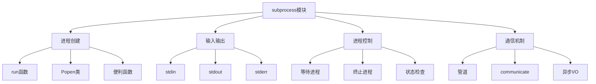

# Python标准库-subprocess模块完全参考手册

## 概述

`subprocess` 模块允许您生成新进程、连接到它们的输入/输出/错误管道，并获取它们的返回代码。该模块旨在替代几个较旧的模块和函数，如 `os.system`、`os.spawn`、`os.popen` 等。

subprocess模块的核心功能包括：
- 子进程创建和管理
- 输入/输出重定向
- 管道通信
- 进程间通信
- 进程状态监控
- 异步进程控制



## 基本使用

### run函数（推荐）

```python
import subprocess

# 简单命令执行
result = subprocess.run(['ls', '-l'])
print(f"返回码: {result.returncode}")

# 捕获输出
result = subprocess.run(['echo', 'Hello, World!'], capture_output=True)
print(f"标准输出: {result.stdout.decode('utf-8').strip()}")

# 检查返回码
result = subprocess.run(['ls', '/nonexistent'], capture_output=True)
if result.returncode != 0:
    print(f"错误: {result.stderr.decode('utf-8').strip()}")
```

### Popen类（高级用法）

```python
import subprocess

# 创建子进程
process = subprocess.Popen(['sleep', '5'])
print(f"进程ID: {process.pid}")

# 等待进程完成
process.wait()
print(f"返回码: {process.returncode}")
```

## 输入输出重定向

### 捕获输出

```python
import subprocess

# 捕获标准输出
result = subprocess.run(['ls', '-l'], capture_output=True, text=True)
print("标准输出:")
print(result.stdout)

# 捕获标准错误
result = subprocess.run(['ls', '/nonexistent'], capture_output=True, text=True)
print("标准错误:")
print(result.stderr)

# 合并标准输出和标准错误
result = subprocess.run(['ls', '-l', '/nonexistent'], 
                       stdout=subprocess.PIPE, 
                       stderr=subprocess.STDOUT,
                       text=True)
print("合并输出:")
print(result.stdout)
```

### 输入数据

```python
import subprocess

# 通过input参数提供输入
result = subprocess.run(['cat'], 
                       input='Hello from subprocess!',
                       capture_output=True, 
                       text=True)
print(f"输出: {result.stdout}")

# 通过stdin管道提供输入
process = subprocess.Popen(['grep', 'hello'], 
                         stdin=subprocess.PIPE,
                         stdout=subprocess.PIPE,
                         text=True)
output, _ = process.communicate('hello world\nhello python\n')
print(f"过滤结果: {output}")
```

## 进程控制

### 等待和超时

```python
import subprocess
import time

# 带超时的等待
try:
    result = subprocess.run(['sleep', '10'], timeout=5)
except subprocess.TimeoutExpired:
    print("进程超时")
    
# 使用wait()方法
process = subprocess.Popen(['sleep', '3'])
try:
    process.wait(timeout=5)
    print(f"进程完成，返回码: {process.returncode}")
except subprocess.TimeoutExpired:
    print("等待超时")
    process.terminate()
```

### 终止进程

```python
import subprocess
import time

# 创建长时间运行的进程
process = subprocess.Popen(['sleep', '10'])
print(f"进程ID: {process.pid}")

# 终止进程
time.sleep(2)
process.terminate()
process.wait()
print(f"进程已终止，返回码: {process.returncode}")

# 强制终止
process = subprocess.Popen(['sleep', '10'])
time.sleep(2)
process.kill()
process.wait()
print(f"进程被强制终止")
```

### 检查进程状态

```python
import subprocess
import time

# 创建进程
process = subprocess.Popen(['sleep', '5'])

# 检查进程状态
while True:
    return_code = process.poll()
    if return_code is not None:
        print(f"进程已结束，返回码: {return_code}")
        break
    else:
        print("进程仍在运行...")
        time.sleep(1)
```

## 高级功能

### 环境变量和工作目录

```python
import subprocess
import os

# 设置环境变量
custom_env = os.environ.copy()
custom_env['MY_VAR'] = 'custom_value'

result = subprocess.run(['echo', '$MY_VAR'], 
                       env=custom_env,
                       shell=True,
                       capture_output=True,
                       text=True)
print(f"环境变量输出: {result.stdout}")

# 设置工作目录
result = subprocess.run(['pwd'], 
                       cwd='/tmp',
                       capture_output=True,
                       text=True)
print(f"工作目录: {result.stdout.strip()}")
```

### 管道连接

```python
import subprocess

# 创建管道：ls -l | grep python
process1 = subprocess.Popen(['ls', '-l'], stdout=subprocess.PIPE)
process2 = subprocess.Popen(['grep', 'python'], 
                          stdin=process1.stdout,
                          stdout=subprocess.PIPE)

output = process2.communicate()[0]
print(f"管道输出: {output.decode('utf-8')}")

# 等待进程完成
process1.wait()
process2.wait()
```

### 异步进程控制

```python
import subprocess
import time

# 非阻塞执行
process = subprocess.Popen(['sleep', '5'])

# 在进程运行时做其他事情
for i in range(3):
    print(f"做其他工作 {i+1}")
    time.sleep(1)

# 等待进程完成
process.wait()
print("所有工作完成")
```

## 便利函数

### check_call

```python
import subprocess

# 如果命令返回非零退出码，抛出异常
try:
    subprocess.check_call(['ls', '/nonexistent'])
except subprocess.CalledProcessError as e:
    print(f"命令失败，返回码: {e.returncode}")
```

### check_output

```python
import subprocess

# 返回命令的输出，失败时抛出异常
try:
    output = subprocess.check_output(['ls', '-l'], text=True)
    print(f"命令输出: {output}")
except subprocess.CalledProcessError as e:
    print(f"命令失败: {e}")
```

### call

```python
import subprocess

# 返回命令的退出码
return_code = subprocess.call(['ls', '-l'])
print(f"退出码: {return_code}")
```

## 实战应用

### 1. 系统命令执行器

```python
import subprocess
import os
from typing import Tuple, Optional

class CommandExecutor:
    """系统命令执行器"""
    
    def __init__(self):
        self.history = []
    
    def execute(self, command: str, capture: bool = False, 
                timeout: Optional[int] = None) -> Tuple[int, str, str]:
        """执行命令"""
        try:
            if capture:
                result = subprocess.run(
                    command,
                    shell=True,
                    capture_output=True,
                    text=True,
                    timeout=timeout,
                    check=False
                )
                returncode = result.returncode
                stdout = result.stdout
                stderr = result.stderr
            else:
                returncode = subprocess.call(command, shell=True)
                stdout = ""
                stderr = ""
            
            # 记录历史
            self.history.append({
                'command': command,
                'returncode': returncode,
                'timestamp': __import__('time').time()
            })
            
            return returncode, stdout, stderr
            
        except subprocess.TimeoutExpired:
            return -1, "", "命令执行超时"
        except Exception as e:
            return -1, "", str(e)
    
    def execute_safely(self, command: str) -> bool:
        """安全执行命令"""
        returncode, stdout, stderr = self.execute(command, capture=True)
        
        if returncode != 0:
            print(f"命令失败: {command}")
            print(f"错误: {stderr}")
            return False
        
        print(f"命令成功: {command}")
        print(f"输出: {stdout}")
        return True
    
    def batch_execute(self, commands: list) -> dict:
        """批量执行命令"""
        results = {}
        
        for i, command in enumerate(commands):
            print(f"执行命令 {i+1}/{len(commands)}: {command}")
            returncode, stdout, stderr = self.execute(command, capture=True)
            
            results[command] = {
                'returncode': returncode,
                'stdout': stdout,
                'stderr': stderr
            }
        
        return results
    
    def get_history(self) -> list:
        """获取执行历史"""
        return self.history

# 使用示例
executor = CommandExecutor()

# 执行单个命令
returncode, stdout, stderr = executor.execute('ls -l', capture=True)
print(f"返回码: {returncode}")
print(f"输出: {stdout}")

# 批量执行
commands = [
    'pwd',
    'ls -la',
    'date'
]
results = executor.batch_execute(commands)
for cmd, result in results.items():
    print(f"\n命令: {cmd}")
    print(f"返回码: {result['returncode']}")
```

### 2. 进程监控器

```python
import subprocess
import time
import psutil
from typing import List, Dict

class ProcessMonitor:
    """进程监控器"""
    
    def __init__(self):
        self.monitored_processes = {}
    
    def start_process(self, command: str, name: str = None) -> Dict:
        """启动并监控进程"""
        process = subprocess.Popen(
            command,
            shell=True,
            stdout=subprocess.PIPE,
            stderr=subprocess.PIPE
        )
        
        if name is None:
            name = f"process_{process.pid}"
        
        self.monitored_processes[name] = {
            'process': process,
            'start_time': time.time(),
            'command': command
        }
        
        return {
            'name': name,
            'pid': process.pid,
            'start_time': time.time()
        }
    
    def get_process_info(self, name: str) -> Dict:
        """获取进程信息"""
        if name not in self.monitored_processes:
            return {}
        
        process_info = self.monitored_processes[name]
        process = process_info['process']
        
        try:
            ps_process = psutil.Process(process.pid)
            return {
                'name': name,
                'pid': process.pid,
                'status': process.poll(),
                'running': process.poll() is None,
                'cpu_percent': ps_process.cpu_percent(),
                'memory_info': ps_process.memory_info().rss / 1024 / 1024,
                'create_time': ps_process.create_time(),
                'cmdline': ps_process.cmdline()
            }
        except psutil.NoSuchProcess:
            return {
                'name': name,
                'pid': process.pid,
                'status': process.poll(),
                'running': False
            }
    
    def get_all_process_info(self) -> List[Dict]:
        """获取所有监控进程的信息"""
        return [self.get_process_info(name) for name in self.monitored_processes.keys()]
    
    def terminate_process(self, name: str) -> bool:
        """终止进程"""
        if name not in self.monitored_processes:
            return False
        
        process = self.monitored_processes[name]['process']
        
        if process.poll() is None:
            process.terminate()
            process.wait()
            return True
        
        return False
    
    def cleanup(self):
        """清理所有进程"""
        for name in list(self.monitored_processes.keys()):
            self.terminate_process(name)
        self.monitored_processes.clear()

# 使用示例
monitor = ProcessMonitor()

# 启动进程
proc_info = monitor.start_process('sleep 60', 'long_process')
print(f"启动进程: {proc_info}")

# 获取进程信息
time.sleep(2)
process_info = monitor.get_process_info('long_process')
print(f"进程信息: {process_info}")

# 终止进程
monitor.terminate_process('long_process')
print("进程已终止")

# 清理
monitor.cleanup()
```

### 3. 流数据处理

```python
import subprocess
import time

class StreamProcessor:
    """流数据处理器"""
    
    def __init__(self):
        self.processes = []
    
    def process_stream(self, command: str, output_file: str):
        """处理流数据"""
        with open(output_file, 'w') as output_f:
            process = subprocess.Popen(
                command,
                shell=True,
                stdout=subprocess.PIPE,
                stderr=subprocess.PIPE,
                universal_newlines=True,
                bufsize=1  # 行缓冲
            )
            
            self.processes.append(process)
            
            # 实时读取输出
            for line in process.stdout:
                output_f.write(line)
                print(f"处理: {line.strip()}")
            
            # 读取错误输出
            for line in process.stderr:
                print(f"错误: {line.strip()}")
            
            process.wait()
            return process.returncode
    
    def process_with_filter(self, command: str, filter_func):
        """带过滤器的流处理"""
        process = subprocess.Popen(
            command,
            shell=True,
            stdout=subprocess.PIPE,
            stderr=subprocess.PIPE,
            universal_newlines=True,
            bufsize=1
        )
        
        filtered_output = []
        
        for line in process.stdout:
            if filter_func(line):
                filtered_output.append(line)
                print(f"匹配: {line.strip()}")
        
        process.wait()
        return filtered_output, process.returncode
    
    def pipeline(self, commands: list):
        """命令管道"""
        processes = []
        
        # 创建第一个进程
        process = subprocess.Popen(
            commands[0],
            shell=True,
            stdout=subprocess.PIPE,
            stderr=subprocess.PIPE,
            universal_newlines=True
        )
        processes.append(process)
        
        # 创建后续进程
        for i in range(1, len(commands)):
            process = subprocess.Popen(
                commands[i],
                shell=True,
                stdin=processes[-1].stdout,
                stdout=subprocess.PIPE,
                stderr=subprocess.PIPE,
                universal_newlines=True
            )
            processes.append(process)
        
        # 获取最终输出
        final_process = processes[-1]
        output, error = final_process.communicate()
        
        # 等待所有进程完成
        for process in processes:
            process.wait()
        
        return output, error, [p.returncode for p in processes]

# 使用示例
processor = StreamProcessor()

# 处理流数据
# returncode = processor.process_stream('ping -c 5 127.0.0.1', 'ping_output.txt')
# print(f"处理完成，返回码: {returncode}")

# 带过滤器的处理
def filter_func(line):
    """自定义过滤器"""
    return 'time' in line.lower()

output, returncode = processor.process_with_filter('ping -c 5 127.0.0.1', filter_func)
print(f"过滤输出: {output[:3]}")  # 显示前3行

# 管道处理
output, error, returncodes = processor.pipeline([
    'ls -la',
    'grep ".py"',
    'head -n 5'
])
print(f"管道输出:\n{output}")
```

### 4. 文件转换器

```python
import subprocess
import os
from pathlib import Path

class FileConverter:
    """文件转换器"""
    
    def convert_with_ffmpeg(self, input_file: str, output_file: str, 
                          options: list = None) -> bool:
        """使用FFmpeg转换文件"""
        if options is None:
            options = []
        
        cmd = ['ffmpeg', '-i', input_file] + options + [output_file]
        
        try:
            result = subprocess.run(
                cmd,
                capture_output=True,
                text=True,
                check=True
            )
            print(f"转换成功: {input_file} -> {output_file}")
            return True
            
        except subprocess.CalledProcessError as e:
            print(f"转换失败: {e}")
            print(f"错误输出: {e.stderr}")
            return False
    
    def batch_convert(self, input_dir: str, output_dir: str, 
                     input_ext: str, output_ext: str):
        """批量转换文件"""
        input_path = Path(input_dir)
        output_path = Path(output_dir)
        
        output_path.mkdir(exist_ok=True)
        
        converted = 0
        failed = 0
        
        for input_file in input_path.glob(f"*{input_ext}"):
            output_file = output_path / f"{input_file.stem}{output_ext}"
            
            if self.convert_with_ffmpeg(str(input_file), str(output_file)):
                converted += 1
            else:
                failed += 1
        
        print(f"转换完成: 成功 {converted} 个，失败 {failed} 个")
        return converted, failed
    
    def convert_with_pandoc(self, input_file: str, output_file: str):
        """使用Pandoc转换文件"""
        cmd = ['pandoc', input_file, '-o', output_file]
        
        try:
            result = subprocess.run(
                cmd,
                capture_output=True,
                text=True,
                check=True
            )
            print(f"转换成功: {input_file} -> {output_file}")
            return True
            
        except subprocess.CalledProcessError as e:
            print(f"转换失败: {e}")
            print(f"错误输出: {e.stderr}")
            return False

# 使用示例
converter = FileConverter()

# FFmpeg转换示例（需要安装FFmpeg）
# converter.convert_with_ffmpeg('input.mp4', 'output.avi', ['-c:v', 'libx264'])

# Pandoc转换示例（需要安装Pandoc）
# converter.convert_with_pandoc('document.md', 'document.html')
```

### 5. 系统管理工具

```python
import subprocess
import platform
import psutil

class SystemAdminTool:
    """系统管理工具"""
    
    def __init__(self):
        self.system = platform.system()
    
    def run_command(self, command: str, check: bool = True) -> subprocess.CompletedProcess:
        """运行系统命令"""
        result = subprocess.run(
            command,
            shell=True,
            capture_output=True,
            text=True,
            check=check
        )
        return result
    
    def get_disk_usage(self, path: str = '/') -> dict:
        """获取磁盘使用情况"""
        if self.system == 'Linux':
            result = self.run_command(f'df -h {path}', check=False)
            return {'raw': result.stdout, 'error': result.stderr}
        elif self.system == 'Windows':
            result = self.run_command(f'wmic logicaldisk where "DeviceID=\'{path[:2]}\'" get FreeSpace,Size', check=False)
            return {'raw': result.stdout, 'error': result.stderr}
        else:
            return {'raw': '不支持的系统', 'error': ''}
    
    def get_memory_info(self) -> dict:
        """获取内存信息"""
        if self.system == 'Linux':
            result = self.run_command('free -h', check=False)
            return {'raw': result.stdout, 'error': result.stderr}
        elif self.system == 'Windows':
            result = self.run_command('wmic OS get TotalVisibleMemorySize,FreePhysicalMemory', check=False)
            return {'raw': result.stdout, 'error': result.stderr}
        else:
            return {'raw': '不支持的系统', 'error': ''}
    
    def get_process_list(self) -> list:
        """获取进程列表"""
        if self.system == 'Linux':
            result = self.run_command('ps aux', check=False)
            lines = result.stdout.strip().split('\n')[1:]  # 跳过标题行
            processes = []
            for line in lines:
                parts = line.split(None, 10)
                if len(parts) >= 11:
                    processes.append({
                        'user': parts[0],
                        'pid': parts[1],
                        'cpu': parts[2],
                        'mem': parts[3],
                        'command': parts[10]
                    })
            return processes
        elif self.system == 'Windows':
            result = self.run_command('tasklist', check=False)
            return {'raw': result.stdout, 'error': result.stderr}
        else:
            return []
    
    def get_network_info(self) -> dict:
        """获取网络信息"""
        if self.system == 'Linux':
            result = self.run_command('ip addr show', check=False)
            return {'raw': result.stdout, 'error': result.stderr}
        elif self.system == 'Windows':
            result = self.run_command('ipconfig /all', check=False)
            return {'raw': result.stdout, 'error': result.stderr}
        else:
            return {'raw': '不支持的系统', 'error': ''}
    
    def kill_process(self, pid: int, force: bool = False) -> bool:
        """终止进程"""
        try:
            if self.system == 'Linux':
                signal = '9' if force else '15'
                result = self.run_command(f'kill -{signal} {pid}', check=False)
                return result.returncode == 0
            elif self.system == 'Windows':
                taskkill_cmd = f'taskkill /F /PID {pid}' if force else f'taskkill /PID {pid}'
                result = self.run_command(taskkill_cmd, check=False)
                return result.returncode == 0
            else:
                return False
        except Exception as e:
            print(f"终止进程失败: {e}")
            return False
    
    def install_package(self, package_name: str, package_manager: str = None) -> bool:
        """安装软件包"""
        if package_manager is None:
            if self.system == 'Linux':
                package_manager = 'apt-get'
            elif self.system == 'Windows':
                package_manager = 'chocolatey'
            else:
                return False
        
        try:
            if package_manager == 'apt-get':
                result = self.run_command(f'sudo apt-get install -y {package_name}', check=False)
                return result.returncode == 0
            elif package_manager == 'chocolatey':
                result = self.run_command(f'choco install {package_name} -y', check=False)
                return result.returncode == 0
            else:
                return False
        except Exception as e:
            print(f"安装失败: {e}")
            return False

# 使用示例
admin_tool = SystemAdminTool()

# 获取磁盘使用情况
disk_info = admin_tool.get_disk_usage()
print(f"磁盘信息:\n{disk_info['raw']}")

# 获取进程列表
processes = admin_tool.get_process_list()
print(f"\n前5个进程:")
for proc in processes[:5]:
    print(f"  PID: {proc['pid']}, 命令: {proc['command']}")
```

## 性能优化

### 1. 缓冲区优化

```python
import subprocess

# 使用适当的缓冲区大小
def process_large_output(command: str):
    """处理大量输出"""
    process = subprocess.Popen(
        command,
        shell=True,
        stdout=subprocess.PIPE,
        stderr=subprocess.PIPE,
        bufsize=8192  # 8KB缓冲区
    )
    
    # 使用communicate处理大量输出
    stdout, stderr = process.communicate()
    
    return process.returncode, stdout.decode('utf-8'), stderr.decode('utf-8')
```

### 2. 并行进程执行

```python
import subprocess
from concurrent.futures import ThreadPoolExecutor

def execute_command(command):
    """执行单个命令"""
    try:
        result = subprocess.run(
            command,
            shell=True,
            capture_output=True,
            text=True,
            timeout=30
        )
        return {
            'command': command,
            'returncode': result.returncode,
            'stdout': result.stdout,
            'stderr': result.stderr
        }
    except subprocess.TimeoutExpired:
        return {
            'command': command,
            'returncode': -1,
            'stdout': '',
            'stderr': '超时'
        }

def parallel_execute(commands: list, max_workers: int = 4):
    """并行执行命令"""
    with ThreadPoolExecutor(max_workers=max_workers) as executor:
        results = list(executor.map(execute_command, commands))
    
    return results

# 使用示例
commands = ['echo hello', 'sleep 2', 'echo world', 'date']
results = parallel_execute(commands)
for result in results:
    print(f"命令: {result['command']}, 返回码: {result['returncode']}")
```

## 安全考虑

### 1. 避免shell注入

```python
import subprocess
import shlex

# ❌ 不安全：直接使用shell=True
user_input = "file.txt; rm -rf /"
result = subprocess.run(f"cat {user_input}", shell=True)

# ✅ 安全：使用参数列表
command = ['cat', user_input]
result = subprocess.run(command)

# ✅ 更安全：验证输入后使用shell
if user_input.isalnum() or user_input.endswith('.txt'):
    result = subprocess.run(f"cat {user_input}", shell=True)

# ✅ 最安全：使用shlex.quote()
safe_input = shlex.quote(user_input)
result = subprocess.run(f"cat {safe_input}", shell=True)
```

### 2. 限制进程权限

```python
import subprocess
import os

def run_with_restricted_permissions(command, user=None, group=None):
    """以受限权限运行进程"""
    if user is None:
        # 使用最小权限原则
        pass
    
    # 使用特定的用户运行（POSIX）
    if user and platform.system() != 'Windows':
        preexec_fn = lambda: os.setegid(os.getgrnam(group).gr_gid) if group else None
        
        result = subprocess.run(
            command,
            user=user,
            preexec_fn=preexec_fn,
            capture_output=True
        )
        return result
    
    return subprocess.run(command, capture_output=True)
```

## 常见问题

### Q1: run()和Popen()有什么区别？

**A**: run()是高级接口，适合大多数简单场景，会等待进程完成并返回结果。Popen()是低级接口，提供更多控制选项，适合需要异步执行、复杂管道通信等高级场景。

### Q2: 如何处理大量输出？

**A**: 使用管道缓冲区，避免使用wait()而应该使用communicate()，或者使用迭代器逐行读取输出。对于非常大的输出，考虑直接写入文件而不是捕获到内存。

### Q3: 什么时候应该使用shell=True？

**A**: 只有在需要shell特性（如通配符、环境变量展开、管道）时才使用shell=True。但要注意shell=True可能带来安全风险，特别是处理用户输入时。尽量使用参数列表而不是shell=True。

`subprocess` 模块是Python进程管理的核心模块，提供了：

1. **完整的进程控制**: 创建、监控、终止进程
2. **灵活的I/O重定向**: 支持管道、文件、字符串等多种I/O
3. **安全的执行方式**: 避免shell注入，支持参数化命令
4. **异步执行支持**: 支持非阻塞和并行进程执行
5. **跨平台兼容**: 在不同操作系统上提供一致接口
6. **丰富的便利函数**: run()、call()、check_call()等简化常见操作

通过掌握 `subprocess` 模块，您可以：
- 安全地执行系统命令
- 构建复杂的进程管理工具
- 实现进程间通信
- 开发自动化脚本
- 处理大量的数据转换
- 构建系统监控工具

`subprocess` 模块是Python系统编程的重要组成部分，它提供了强大而灵活的进程管理能力。无论是简单的命令执行还是复杂的进程编排，`subprocess` 都能提供可靠的解决方案。在开发需要与系统交互的应用程序时，`subprocess` 是必不可少的工具。