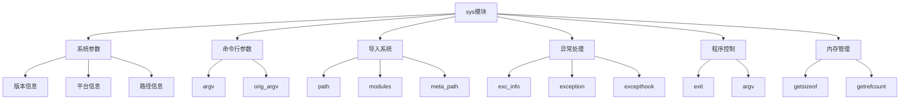

# Python标准库-sys模块完全参考手册

## 概述

`sys` 模块提供了访问一些由解释器使用或维护的变量，以及与解释器进行强烈交互的函数。它是Python中最基础和最重要的模块之一，在所有Python环境中都可用。

sys模块的核心功能包括：
- 系统参数和配置
- 命令行参数处理
- 模块导入路径管理
- 异常处理机制
- 程序退出控制
- 内存和性能监控
- Python版本信息



## 系统参数和配置

### 版本信息

#### sys.version

Python版本信息字符串：

```python
import sys

print(sys.version)
# 3.14.2 (main, Apr  6 2026, 12:00:00) [Clang 15.0.0 (clang-1500.3.9.4)]
```

#### sys.version_info

Python版本信息命名元组：

```python
import sys

print(sys.version_info)
# sys.version_info(major=3, minor=14, micro=2, releaselevel='final', serial=0)

print(f"Python {sys.version_info.major}.{sys.version_info.minor}")
# Python 3.14

# 版本比较
if sys.version_info >= (3, 10):
    print("使用Python 3.10或更高版本")
```

#### sys.hexversion

16进制版本号：

```python
import sys

print(hex(sys.hexversion))
# 0x30e02f0
```

#### sys.implementation

实现信息：

```python
import sys

print(sys.implementation)
# Implementation(name='cpython', version=version_info(...), hexversion=0x30e02f0)
```

### 平台信息

#### sys.platform

操作系统标识符：

```python
import sys

print(sys.platform)
# 'darwin' (macOS), 'linux' (Linux), 'win32' (Windows)

# 跨平台代码示例
if sys.platform == 'win32':
    print("Windows平台")
elif sys.platform.startswith('linux'):
    print("Linux平台")
elif sys.platform == 'darwin':
    print("macOS平台")
```

#### sys.byteorder

字节序：

```python
import sys

print(sys.byteorder)
# 'little' (小端), 'big' (大端)
```

#### sys.maxsize

最大整数大小：

```python
import sys

print(sys.maxsize)
# 9223372036854775807 (64位系统)

print(f"系统位数: {sys.maxsize.bit_length() + 1}位")
```

#### sys.float_info

浮点数信息：

```python
import sys

print(f"浮点数精度: {sys.float_info.dig}位")
print(f"最大浮点数: {sys.float_info.max}")
print(f"最小浮点数: {sys.float_info.min}")
print(f"浮点数epsilon: {sys.float_info.epsilon}")
```

### 路径信息

#### sys.executable

Python解释器可执行文件路径：

```python
import sys

print(sys.executable)
# /usr/bin/python3 (Unix) 或 C:\Python314\python.exe (Windows)
```

#### sys.prefix 和 sys.base_prefix

Python安装路径：

```python
import sys

print(f"当前前缀: {sys.prefix}")
print(f"基础前缀: {sys.base_prefix}")

# 检查是否在虚拟环境中
if sys.prefix != sys.base_prefix:
    print("在虚拟环境中运行")
else:
    print("在基础环境中运行")
```

#### sys.exec_prefix 和 sys.base_exec_prefix

平台相关文件安装路径：

```python
import sys

print(f"执行前缀: {sys.exec_prefix}")
print(f"基础执行前缀: {sys.base_exec_prefix}")
```

#### sys.path

模块搜索路径：

```python
import sys

print("模块搜索路径:")
for i, path in enumerate(sys.path, 1):
    print(f"{i}. {path}")

# 添加自定义路径
sys.path.append('/custom/path')

# 在开头插入路径
sys.path.insert(0, '/priority/path')
```

## 命令行参数

### sys.argv

命令行参数列表：

```python
import sys

# 显示所有参数
print("命令行参数:")
for i, arg in enumerate(sys.argv):
    print(f"{i}: {arg}")

# 访问脚本名称
script_name = sys.argv[0]
print(f"脚本名称: {script_name}")

# 访问用户参数
if len(sys.argv) > 1:
    user_args = sys.argv[1:]
    print(f"用户参数: {user_args}")
```

### sys.orig_argv

原始命令行参数（Python 3.10+）：

```python
import sys

if hasattr(sys, 'orig_argv'):
    print("原始参数:", sys.orig_argv)
```

## 模块导入系统

### sys.modules

已加载模块字典：

```python
import sys

# 列出所有已加载模块
print("已加载模块:")
for module_name in sorted(sys.modules.keys()):
    if module_name not in ['builtins', '__main__']:
        print(f"- {module_name}")

# 检查特定模块是否已加载
if 'os' in sys.modules:
    print("os模块已加载")

# 获取模块对象
os_module = sys.modules.get('os')
if os_module:
    print(f"os模块路径: {os_module.__file__}")
```

### sys.meta_path

元路径查找器列表：

```python
import sys

print("元路径查找器:")
for finder in sys.meta_path:
    print(f"- {finder}")

# 自定义导入器
class CustomImporter:
    def find_spec(self, fullname, path=None):
        # 自定义导入逻辑
        return None

# 添加自定义导入器
sys.meta_path.insert(0, CustomImporter())
```

### sys.path_hooks

路径钩子列表：

```python
import sys

print("路径钩子:")
for hook in sys.path_hooks:
    print(f"- {hook}")
```

### sys.path_importer_cache

路径导入器缓存：

```python
import sys

print("导入器缓存:")
for path, importer in sys.path_importer_cache.items():
    print(f"{path}: {importer}")
```

## 程序控制

### sys.exit()

退出程序：

```python
import sys

# 正常退出（退出码0）
sys.exit(0)

# 异常退出（退出码1）
sys.exit(1)

# 退出并显示消息
sys.exit("程序出错")

# 退出并传递其他值
sys.exit("完成")
```

### sys.stdin, sys.stdout, sys.stderr

标准输入、输出、错误流：

```python
import sys

# 标准输入
print("请输入内容:")
user_input = sys.stdin.readline()
print(f"你输入了: {user_input}")

# 标准输出
sys.stdout.write("输出到标准输出\n")

# 标准错误
sys.stderr.write("输出到标准错误\n")

# 重定向输出
import io
old_stdout = sys.stdout
sys.stdout = io.StringIO()
print("这个输出被捕获")
captured_output = sys.stdout.getvalue()
sys.stdout = old_stdout
print(f"捕获的输出: {captured_output}")
```

## 异常处理

### sys.exc_info()

当前异常信息：

```python
import sys

try:
    1 / 0
except ZeroDivisionError:
    exc_type, exc_value, exc_traceback = sys.exc_info()
    print(f"异常类型: {exc_type}")
    print(f"异常值: {exc_value}")
    print(f"异常回溯: {exc_traceback}")
```

### sys.exception()

当前异常实例（Python 3.11+）：

```python
import sys

try:
    1 / 0
except ZeroDivisionError as e:
    current_exception = sys.exception()
    print(f"当前异常: {current_exception}")
    print(f"是否相同: {current_exception is e}")
```

### sys.excepthook()

异常处理钩子：

```python
import sys
import traceback

def custom_excepthook(exc_type, exc_value, exc_traceback):
    """自定义异常处理器"""
    print("=" * 50)
    print("发生未捕获的异常:")
    print("=" * 50)
    print(f"类型: {exc_type}")
    print(f"值: {exc_value}")
    print("回溯:")
    traceback.print_exception(exc_type, exc_value, exc_traceback)

# 设置自定义异常处理器
sys.excepthook = custom_excepthook

# 测试
1 / 0  # 将使用自定义异常处理器
```

### sys.last_type, sys.last_value, sys.last_traceback

最后异常信息：

```python
import sys

try:
    1 / 0
except:
    pass

print(f"最后异常类型: {sys.last_type}")
print(f"最后异常值: {sys.last_value}")
```

## 内存管理

### sys.getsizeof()

对象大小：

```python
import sys

# 基本类型大小
print(f"空列表大小: {sys.getsizeof([])} 字节")
print(f"空字典大小: {sys.getsizeof({})} 字节")
print(f"空字符串大小: {sys.getsizeof('')} 字节")
print(f"整数大小: {sys.getsizeof(42)} 字节")
print(f"浮点数大小: {sys.getsizeof(3.14)} 字节")

# 自定义对象
class MyClass:
    def __init__(self):
        self.data = list(range(100))

obj = MyClass()
print(f"MyClass对象大小: {sys.getsizeof(obj)} 字节")
```

### sys.getrefcount()

对象引用计数：

```python
import sys

# 引用计数示例
x = "hello"
print(f"'hello'的引用计数: {sys.getrefcount('hello')}")

y = x  # 增加引用
print(f"'hello'的引用计数 (y = x): {sys.getrefcount('hello')}")

del y  # 减少引用
print(f"'hello'的引用计数 (del y): {sys.getrefcount('hello')}")
```

### sys.getallocatedblocks()

已分配内存块数：

```python
import sys

blocks = sys.getallocatedblocks()
print(f"当前已分配内存块数: {blocks}")
```

### sys._clear_internal_caches()

清理内部缓存（Python 3.13+）：

```python
import sys

# 清理内部缓存以释放内存
sys._clear_internal_caches()
```

## 性能监控

### sys.getrecursionlimit() 和 sys.setrecursionlimit()

递归限制：

```python
import sys

# 获取当前递归限制
current_limit = sys.getrecursionlimit()
print(f"当前递归限制: {current_limit}")

# 设置新的递归限制
sys.setrecursionlimit(2000)
print(f"新的递归限制: {sys.getrecursionlimit()}")
```

### sys.getswitchinterval() 和 sys.setswitchinterval()

线程切换间隔：

```python
import sys

# 获取线程切换间隔
interval = sys.getswitchinterval()
print(f"线程切换间隔: {interval} 秒")

# 设置新的线程切换间隔
sys.setswitchinterval(0.005)  # 5毫秒
```

### sys._debugmallocstats()

内存分配调试信息：

```python
import sys

# 打印内存分配器信息
sys._debugmallocstats()
```

## 线程支持

### sys.thread_info

线程实现信息：

```python
import sys

if hasattr(sys, 'thread_info'):
    print(f"线程名称: {sys.thread_info.name}")
    print(f"线程锁定: {sys.thread_info.lock}")
    print(f"线程版本: {sys.thread_info.version}")
```

### sys._current_frames()

当前线程帧：

```python
import sys
import threading
import time

def worker():
    """工作线程"""
    for i in range(3):
        time.sleep(0.1)
        frames = sys._current_frames()
        print(f"线程 {threading.current_thread().name} 帧信息:")
        for thread_id, frame in frames.items():
            print(f"  线程ID: {thread_id}")
            print(f"  文件名: {frame.f_code.co_filename}")
            print(f"  函数名: {frame.f_code.co_name}")

thread = threading.Thread(target=worker, name="WorkerThread")
thread.start()
thread.join()
```

## 实战应用

### 1. 命令行工具

```python
#!/usr/bin/env python3
"""
命令行工具示例
"""
import sys
import os

def show_usage():
    """显示使用说明"""
    print("用法: python script.py [选项] [参数]")
    print("选项:")
    print("  -h, --help     显示帮助信息")
    print("  -v, --verbose  详细输出模式")
    print("  -f, --file     指定输入文件")
    print("")
    print("参数:")
    print("  input_file     输入文件路径")

def process_file(filename, verbose=False):
    """处理文件"""
    if not os.path.exists(filename):
        print(f"错误: 文件 '{filename}' 不存在", file=sys.stderr)
        sys.exit(1)

    if verbose:
        print(f"处理文件: {filename}")

    with open(filename, 'r') as f:
        lines = f.readlines()
        if verbose:
            print(f"文件行数: {len(lines)}")
        
        for i, line in enumerate(lines, 1):
            print(f"{i:4d}: {line.rstrip()}")

def main():
    """主函数"""
    verbose = False
    input_file = None

    # 解析命令行参数
    i = 1
    while i < len(sys.argv):
        arg = sys.argv[i]
        
        if arg in ('-h', '--help'):
            show_usage()
            sys.exit(0)
        
        elif arg in ('-v', '--verbose'):
            verbose = True
        
        elif arg in ('-f', '--file'):
            if i + 1 < len(sys.argv):
                input_file = sys.argv[i + 1]
                i += 1
            else:
                print("错误: -f/--file 需要指定文件名", file=sys.stderr)
                sys.exit(1)
        
        else:
            # 假设是文件名参数
            input_file = arg
        
        i += 1

    if not input_file:
        print("错误: 需要指定输入文件", file=sys.stderr)
        show_usage()
        sys.exit(1)

    # 处理文件
    try:
        process_file(input_file, verbose)
        sys.exit(0)
    except Exception as e:
        print(f"处理文件时出错: {e}", file=sys.stderr)
        sys.exit(1)

if __name__ == '__main__':
    main()
```

### 2. 性能监控器

```python
import sys
import time
import psutil
from collections import defaultdict

class PerformanceMonitor:
    """性能监控器"""

    def __init__(self):
        self.start_time = time.time()
        self.memory_snapshots = []
        self.cpu_usage = []

    def take_snapshot(self):
        """记录当前系统状态"""
        process = psutil.Process(sys._getframe().f_code.co_filename)
        
        snapshot = {
            'timestamp': time.time(),
            'memory_mb': process.memory_info().rss / 1024 / 1024,
            'cpu_percent': process.cpu_percent(),
            'threads': process.num_threads(),
            'files': len(process.open_files()),
            'connections': len(process.connections())
        }
        
        self.memory_snapshots.append(snapshot)
        return snapshot

    def get_python_memory(self):
        """获取Python内存使用"""
        import gc
        gc.collect()  # 先进行垃圾回收
        
        total_size = 0
        obj_count = 0
        type_stats = defaultdict(lambda: {'count': 0, 'size': 0})

        for obj in gc.get_objects():
            size = sys.getsizeof(obj)
            obj_type = type(obj).__name__
            
            total_size += size
            obj_count += 1
            type_stats[obj_type]['count'] += 1
            type_stats[obj_type]['size'] += size

        return {
            'total_size_mb': total_size / 1024 / 1024,
            'object_count': obj_count,
            'type_stats': dict(type_stats)
        }

    def print_summary(self):
        """打印性能摘要"""
        elapsed = time.time() - self.start_time
        
        print("=" * 50)
        print("性能摘要")
        print("=" * 50)
        print(f"运行时间: {elapsed:.2f} 秒")
        print(f"Python内存使用: {self.get_python_memory()['total_size_mb']:.2f} MB")
        
        if self.memory_snapshots:
            print("\n内存使用趋势:")
            for snapshot in self.memory_snapshots[-5:]:  # 显示最近5个快照
                print(f"  {snapshot['timestamp']:.1f}s: {snapshot['memory_mb']:.2f} MB")

# 使用示例
monitor = PerformanceMonitor()

# 执行一些操作
data = []
for i in range(10000):
    data.append([j for j in range(100)])
    
    if i % 1000 == 0:
        snapshot = monitor.take_snapshot()
        print(f"处理进度: {i/100:.0f}%")

# 打印摘要
monitor.print_summary()
```

### 3. 异常监控器

```python
import sys
import threading
import traceback
from datetime import datetime
from collections import defaultdict

class ExceptionMonitor:
    """异常监控器"""

    def __init__(self):
        self.exception_counts = defaultdict(int)
        self.exception_log = []
        self.lock = threading.Lock()
        self.original_excepthook = sys.excepthook

    def __call__(self, exc_type, exc_value, exc_traceback):
        """捕获异常"""
        with self.lock:
            exception_name = exc_type.__name__
            self.exception_counts[exception_name] += 1
            
            # 记录异常详情
            exception_info = {
                'timestamp': datetime.now().isoformat(),
                'type': exception_name,
                'message': str(exc_value),
                'traceback': traceback.format_exception(exc_type, exc_value, exc_traceback),
                'thread': threading.current_thread().name
            }
            
            self.exception_log.append(exception_info)
            
            # 打印异常信息
            print(f"\n[{exception_info['timestamp']}] 异常发生: {exception_name}")
            print(f"消息: {exc_value}")
            print(f"线程: {exception_info['thread']}")
            print("回溯:")
            print(''.join(exception_info['traceback']))
            print("=" * 50)

        # 调用原始异常处理器
        self.original_excepthook(exc_type, exc_value, exc_traceback)

    def get_statistics(self):
        """获取异常统计"""
        with self.lock:
            return {
                'total_exceptions': len(self.exception_log),
                'exception_counts': dict(self.exception_counts),
                'recent_exceptions': self.exception_log[-10:] if self.exception_log else []
            }

    def print_report(self):
        """打印异常报告"""
        stats = self.get_statistics()
        
        print("\n" + "=" * 50)
        print("异常监控报告")
        print("=" * 50)
        print(f"总异常数: {stats['total_exceptions']}")
        
        if stats['exception_counts']:
            print("\n异常类型分布:")
            for exc_type, count in sorted(stats['exception_counts'].items(), 
                                         key=lambda x: x[1], reverse=True):
                print(f"  {exc_type}: {count} 次")
        
        if stats['recent_exceptions']:
            print("\n最近异常:")
            for exc_info in stats['recent_exceptions'][-5:]:
                print(f"  [{exc_info['timestamp']}] {exc_info['type']}: {exc_info['message']}")

# 使用示例
monitor = ExceptionMonitor()
sys.excepthook = monitor

# 测试异常捕获
try:
    1 / 0
except:
    pass

try:
    int("invalid")
except:
    pass

# 打印报告
monitor.print_report()

# 恢复原始异常处理器
sys.excepthook = monitor.original_excepthook
```

### 4. 系统信息收集器

```python
import sys
import platform
import os
import psutil

class SystemInfoCollector:
    """系统信息收集器"""

    def collect_all(self):
        """收集所有系统信息"""
        return {
            'python_info': self.collect_python_info(),
            'system_info': self.collect_system_info(),
            'process_info': self.collect_process_info(),
            'memory_info': self.collect_memory_info()
        }

    def collect_python_info(self):
        """收集Python信息"""
        return {
            'version': sys.version,
            'version_info': {
                'major': sys.version_info.major,
                'minor': sys.version_info.minor,
                'micro': sys.version_info.micro,
                'releaselevel': sys.version_info.releaselevel,
                'serial': sys.version_info.serial
            },
            'executable': sys.executable,
            'platform': sys.platform,
            'prefix': sys.prefix,
            'base_prefix': sys.base_prefix,
            'byteorder': sys.byteorder,
            'maxsize': sys.maxsize,
            'float_info': {
                'max': sys.float_info.max,
                'min': sys.float_info.min,
                'epsilon': sys.float_info.epsilon,
                'dig': sys.float_info.dig
            }
        }

    def collect_system_info(self):
        """收集系统信息"""
        return {
            'system': platform.system(),
            'node': platform.node(),
            'release': platform.release(),
            'version': platform.version(),
            'machine': platform.machine(),
            'processor': platform.processor(),
            'architecture': platform.architecture(),
            'python_implementation': platform.python_implementation(),
            'python_compiler': platform.python_compiler(),
            'python_build': platform.python_build()
        }

    def collect_process_info(self):
        """收集进程信息"""
        process = psutil.Process()
        return {
            'pid': process.pid,
            'name': process.name(),
            'exe': process.exe(),
            'cwd': process.cwd(),
            'cmdline': process.cmdline(),
            'create_time': process.create_time(),
            'status': process.status(),
            'username': process.username(),
            'nice': process.nice(),
            'num_threads': process.num_threads(),
            'cpu_percent': process.cpu_percent(),
            'cpu_affinity': process.cpu_affinity()
        }

    def collect_memory_info(self):
        """收集内存信息"""
        process = psutil.Process()
        memory = process.memory_info()
        
        return {
            'rss': memory.rss / 1024 / 1024,  # 常驻内存 (MB)
            'vms': memory.vms / 1024 / 1024,  # 虚拟内存 (MB)
            'percent': process.memory_percent(),
            'available': psutil.virtual_memory().available / 1024 / 1024,  # 可用内存 (MB)
            'total': psutil.virtual_memory().total / 1024 / 1024  # 总内存 (MB)
        }

    def print_report(self):
        """打印系统信息报告"""
        info = self.collect_all()
        
        print("=" * 60)
        print("系统信息报告")
        print("=" * 60)
        
        # Python信息
        print("\n【Python信息】")
        py_info = info['python_info']
        print(f"版本: {py_info['version_info']['major']}.{py_info['version_info']['minor']}.{py_info['version_info']['micro']}")
        print(f"平台: {py_info['platform']}")
        print(f"解释器: {py_info['executable']}")
        print(f"字节序: {py_info['byteorder']}")
        
        # 系统信息
        print("\n【系统信息】")
        sys_info = info['system_info']
        print(f"操作系统: {sys_info['system']} {sys_info['release']}")
        print(f"主机名: {sys_info['node']}")
        print(f"架构: {sys_info['architecture'][0]}")
        print(f"处理器: {sys_info['processor']}")
        
        # 进程信息
        print("\n【进程信息】")
        proc_info = info['process_info']
        print(f"进程ID: {proc_info['pid']}")
        print(f"进程名: {proc_info['name']}")
        print(f"工作目录: {proc_info['cwd']}")
        print(f"CPU使用率: {proc_info['cpu_percent']}%")
        print(f"线程数: {proc_info['num_threads']}")
        
        # 内存信息
        print("\n【内存信息】")
        mem_info = info['memory_info']
        print(f"RSS内存: {mem_info['rss']:.2f} MB")
        print(f"VMS内存: {mem_info['vms']:.2f} MB")
        print(f"内存使用率: {mem_info['percent']}%")
        print(f"可用内存: {mem_info['available']:.2f} MB")
        print(f"总内存: {mem_info['total']:.2f} MB")

# 使用示例
collector = SystemInfoCollector()
collector.print_report()
```

### 5. 调试辅助工具

```python
import sys
import traceback
import inspect
from pprint import pprint

class DebugHelper:
    """调试辅助工具"""

    @staticmethod
    def show_call_stack():
        """显示调用栈"""
        print("\n调用栈:")
        for frame in inspect.stack():
            print(f"  文件: {frame.filename}:{frame.lineno}")
            print(f"    函数: {frame.function}")
            print(f"    代码: {frame.code_context}")

    @staticmethod
    def show_locals():
        """显示当前局部变量"""
        frame = sys._getframe(1)
        print("\n局部变量:")
        for name, value in frame.f_locals.items():
            if name != 'self':  # 跳过self
                print(f"  {name}: {type(value).__name__} = {value}")

    @staticmethod
    def show_globals():
        """显示当前全局变量"""
        frame = sys._getframe(1)
        print("\n全局变量:")
        for name, value in frame.f_globals.items():
            if not name.startswith('__'):
                print(f"  {name}: {type(value).__name__}")

    @staticmethod
    def show_module_info(module_name):
        """显示模块信息"""
        if module_name in sys.modules:
            module = sys.modules[module_name]
            print(f"\n模块 '{module_name}' 信息:")
            print(f"  文件: {getattr(module, '__file__', 'N/A')}")
            print(f"  文档: {getattr(module, '__doc__', 'N/A')[:50]}...")
            print(f"  包: {getattr(module, '__package__', 'N/A')}")
        else:
            print(f"模块 '{module_name}' 未加载")

    @staticmethod
    def show_import_stack():
        """显示导入栈"""
        import sys
        print("\n导入栈:")
        for name, module in sys.modules.items():
            if hasattr(module, '__file__'):
                print(f"  {name}: {module.__file__}")

    @staticmethod
    def show_recursion_info():
        """显示递归信息"""
        print(f"\n递归限制: {sys.getrecursionlimit()}")
        print(f"当前递归深度: {len(inspect.stack())}")

# 使用示例
def recursive_function(depth, max_depth=5):
    """递归函数示例"""
    if depth >= max_depth:
        return depth
    
    if depth == 3:  # 在第3层显示调试信息
        debug = DebugHelper()
        debug.show_call_stack()
        debug.show_locals()
        debug.show_recursion_info()
    
    return recursive_function(depth + 1, max_depth)

# 测试
recursive_function(0)
```

## 性能优化

### 1. 避免不必要的模块导入

```python
# 不好的做法
import sys
import os
import json
import requests  # 即使不使用也导入

# 好的做法
import sys
import os

def process_data():
    import json  # 只在需要时导入
    import requests  # 延迟导入
    # 处理数据
```

### 2. 使用sys.setswitchinterval优化线程切换

```python
import sys
import threading

# 对于计算密集型任务，增加切换间隔
sys.setswitchinterval(0.1)  # 100毫秒

# 对于I/O密集型任务，减少切换间隔
sys.setswitchinterval(0.001)  # 1毫秒
```

### 3. 监控内存使用

```python
import sys
import gc

def optimize_memory():
    """优化内存使用"""
    # 清理内部缓存
    if hasattr(sys, '_clear_internal_caches'):
        sys._clear_internal_caches()
    
    # 强制垃圾回收
    gc.collect()
    
    # 检查内存使用
    print(f"已分配内存块: {sys.getallocatedblocks()}")
```

## 安全考虑

### 1. 限制递归深度

```python
import sys

# 设置合理的递归限制
sys.setrecursionlimit(1000)

# 在递归函数中检查深度
def safe_recursive_function(depth, max_depth=900):
    if depth > max_depth:
        raise RecursionError(f"递归深度超过限制: {depth}")
    # 递归逻辑
```

### 2. 验证模块导入

```python
import sys

def safe_import(module_name):
    """安全导入模块"""
    try:
        if module_name in sys.modules:
            return sys.modules[module_name]
        
        module = __import__(module_name)
        return module
    except ImportError as e:
        print(f"无法导入模块 '{module_name}': {e}")
        return None

# 使用示例
math_module = safe_import('math')
if math_module:
    print(f"成功导入 math 模块")
```

## 常见问题

### Q1: 如何修改模块搜索路径？

**A**: 可以通过修改`sys.path`列表来添加或删除模块搜索路径。建议在程序开始时进行修改，以避免影响已导入的模块。

### Q2: sys.exit()和return有什么区别？

**A**: `sys.exit()`会抛出`SystemExit`异常，可以捕获和处理，而`return`只是从函数返回。在主线程中，`sys.exit()`会终止程序，而`return`不会。

### Q3: 如何获取Python解释器的详细信息？

**A**: 使用`sys.version_info`获取版本信息，`sys.executable`获取解释器路径，`sys.platform`获取操作系统信息。

`sys` 模块是Python中最基础和最重要的模块之一，提供了：

1. **系统参数**: Python版本、平台信息、路径配置
2. **命令行参数**: `sys.argv`处理用户输入
3. **模块管理**: `sys.path`和`sys.modules`控制导入
4. **异常处理**: 异常信息和自定义处理器
5. **程序控制**: 退出机制和标准流重定向
6. **内存管理**: 对象大小和引用计数监控
7. **性能监控**: 递归限制和线程切换控制

通过掌握 `sys` 模块，您可以：
- 开发跨平台的命令行工具
- 实现高级异常处理机制
- 监控和优化程序性能
- 理解Python的内部工作机制
- 开发调试和监控工具
- 管理模块导入和加载

`sys` 模块是Python高级编程的基础，掌握它将使您能够编写更强大、更专业的Python应用程序。无论是系统工具、Web应用还是数据分析，`sys` 模块都提供了必要的底层支持。