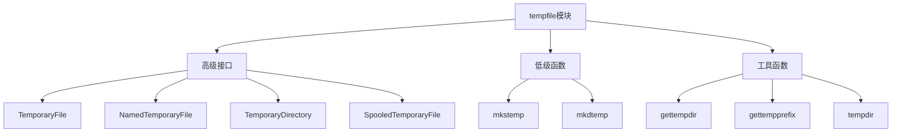

# Python标准库-tempfile模块完全参考手册

## 概述

`tempfile` 模块用于创建临时文件和目录。该模块在所有支持的平台都能正常工作。提供了从高级接口（自动清理）到低级函数（手动清理）的各种工具。

tempfile模块的核心功能包括：
- 临时文件创建（TemporaryFile、NamedTemporaryFile）
- 临时目录创建（TemporaryDirectory）
- 内存缓存文件（SpooledTemporaryFile）
- 底级函数（mkstemp、mkdtemp）
- 路径和前缀管理（gettempdir、gettempprefix）



## 高级接口

### TemporaryFile - 临时文件

```python
import tempfile
import os

# 基本临时文件
fp = tempfile.TemporaryFile()
print(f"临时文件对象: {fp}")
print(f"文件名: {fp.name}")

# 写入数据
fp.write(b'Hello, World!')
fp.seek(0)
content = fp.read()
print(f"读取内容: {content}")

# 关闭文件后会自动删除
fp.close()

# 使用上下文管理器
with tempfile.TemporaryFile() as fp:
    fp.write(b'Context Manager Example')
    fp.seek(0)
    print(f"上下文管理器内容: {fp.read()}")

# 自定义模式
with tempfile.TemporaryFile(mode='w+', encoding='utf-8') as fp:
    fp.write('文本模式示例')
    fp.seek(0)
    print(f"文本内容: {fp.read()}")
```

### NamedTemporaryFile - 命名临时文件

```python
import tempfile

# 基本命名临时文件
with tempfile.NamedTemporaryFile(mode='w+', delete=True) as fp:
    print(f"文件名: {fp.name}")
    fp.write('Named Temporary File')
    fp.seek(0)
    print(f"内容: {fp.read()}")

# 不自动删除
with tempfile.NamedTemporaryFile(mode='w+', delete=False) as fp:
    temp_file_name = fp.name
    print(f"保留文件名: {temp_file_name}")
    fp.write('File will be kept')

# 手动删除
import os
print(f"文件存在: {os.path.exists(temp_file_name)}")
os.unlink(temp_file_name)
print(f"删除后存在: {os.path.exists(temp_file_name)}")

# 自定义前缀和后缀
with tempfile.NamedTemporaryFile(suffix='.txt', prefix='test_', mode='w+') as fp:
    print(f"自定义文件名: {fp.name}")
    fp.write('Custom prefix and suffix')

# 特定目录
import tempfile
import os

temp_dir = '/tmp'  # 或者 tempfile.gettempdir()
with tempfile.NamedTemporaryFile(dir=temp_dir, suffix='.log', mode='w+') as fp:
    print(f"特定目录文件: {fp.name}")
    fp.write('Log file content')
```

### SpooledTemporaryFile - 缓存临时文件

```python
import tempfile

# 内存缓存文件
with tempfile.SpooledTemporaryFile(max_size=1024, mode='w+') as fp:
    # 小数据保存在内存中
    fp.write('Small data')
    fp.seek(0)
    print(f"小数据: {fp.read()}")
    
    # 大数据会溢出到磁盘
    large_data = 'X' * 2000
    fp.write(large_data)
    print(f"已溢出到磁盘")

# 手动触发溢出
with tempfile.SpooledTemporaryFile(max_size=100, mode='w+') as fp:
    fp.write('Initial data')
    print(f"是否在内存中: {fp._file is not None}")
    
    # 手动触发溢出
    fp.rollover()
    print(f"触发溢出后: {fp._file is not None}")

# 检查状态
with tempfile.SpooledTemporaryFile(max_size=100) as fp:
    print(f"初始状态: {'内存' if fp._file is not None else '磁盘'}")
    fp.write(b'X' * 50)
    print(f"写入50字节后: {'内存' if fp._file is not None else '磁盘'}")
    fp.write(b'X' * 100)
    print(f"再写入100字节后: {'内存' if fp._file is not None else '磁盘'}")
```

### TemporaryDirectory - 临时目录

```python
import tempfile
import os

# 基本临时目录
with tempfile.TemporaryDirectory() as tmpdir:
    print(f"临时目录: {tmpdir}")
    print(f"目录存在: {os.path.exists(tmpdir)}")
    
    # 在目录中创建文件
    test_file = os.path.join(tmpdir, 'test.txt')
    with open(test_file, 'w') as f:
        f.write('Test content')

# 目录已自动删除
print(f"目录删除后存在: {os.path.exists(tmpdir)}")

# 自定义前缀和后缀
with tempfile.TemporaryDirectory(prefix='project_', suffix='_temp') as tmpdir:
    print(f"自定义目录: {tmpdir}")
    
    # 创建子目录
    subdir = os.path.join(tmpdir, 'subdir')
    os.makedirs(subdir)
    
    # 创建文件
    file_path = os.path.join(subdir, 'data.txt')
    with open(file_path, 'w') as f:
        f.write('Data in subdirectory')

# 保留目录用于调试
import tempfile
with tempfile.TemporaryDirectory(delete=False) as tmpdir:
    print(f"保留的目录: {tmpdir}")
    # 目录不会被自动删除

# 手动清理
import shutil
if os.path.exists(tmpdir):
    shutil.rmtree(tmpdir)
    print(f"手动清理完成")
```

## 低级函数

### mkstemp - 安全临时文件

```python
import tempfile
import os

# 基本使用
fd, path = tempfile.mkstemp()
print(f"文件描述符: {fd}")
print(f"文件路径: {path}")

try:
    # 使用文件描述符写入
    with os.fdopen(fd, 'w') as f:
        f.write('Content written via file descriptor')
    
    # 读取文件
    with open(path, 'r') as f:
        content = f.read()
        print(f"文件内容: {content}")
finally:
    # 手动删除文件
    os.unlink(path)
    print(f"文件已删除")

# 自定义参数
fd, path = tempfile.mkstemp(suffix='.log', prefix='app_', text=True)
print(f"自定义参数文件: {path}")

try:
    with os.fdopen(fd, 'w') as f:
        f.write('Application log message')
finally:
    os.unlink(path)

# 字节模式
fd, path = tempfile.mkstemp(suffix=b'.bin', prefix=b'data_')
print(f"字节模式文件: {path}")

try:
    with os.fdopen(fd, 'wb') as f:
        f.write(b'Binary data')
finally:
    os.unlink(path)
```

### mkdtemp - 安全临时目录

```python
import tempfile
import os
import shutil

# 基本使用
temp_dir = tempfile.mkdtemp()
print(f"临时目录: {temp_dir}")
print(f"目录存在: {os.path.exists(temp_dir)}")

try:
    # 创建文件和子目录
    file_path = os.path.join(temp_dir, 'file.txt')
    with open(file_path, 'w') as f:
        f.write('File content')
    
    subdir = os.path.join(temp_dir, 'subdir')
    os.makedirs(subdir)
    
    print(f"目录内容: {os.listdir(temp_dir)}")
finally:
    # 手动清理
    shutil.rmtree(temp_dir)
    print(f"目录已清理")

# 自定义参数
temp_dir = tempfile.mkdtemp(prefix='project_', suffix='_build')
print(f"自定义目录: {temp_dir}")

try:
    # 使用目录
    build_file = os.path.join(temp_dir, 'build.log')
    with open(build_file, 'w') as f:
        f.write('Build log')
finally:
    shutil.rmtree(temp_dir)
```

## 工具函数

### gettempdir - 获取临时目录

```python
import tempfile
import os

# 获取系统临时目录
temp_dir = tempfile.gettempdir()
print(f"系统临时目录: {temp_dir}")

# 检查目录可访问性
if os.path.exists(temp_dir) and os.access(temp_dir, os.W_OK):
    print(f"目录可写: 是")
else:
    print(f"目录可写: 否")

# 获取字节路径
temp_dir_bytes = tempfile.gettempdirb()
print(f"临时目录(字节): {temp_dir_bytes}")

# 查找可写目录
def find_writable_temp_dir():
    """查找可写的临时目录"""
    candidates = [
        tempfile.gettempdir(),
        os.path.expanduser('~/tmp'),
        os.path.expanduser('~/temp'),
        os.getcwd()
    ]
    
    for candidate in candidates:
        try:
            if os.path.exists(candidate) and os.access(candidate, os.W_OK):
                return candidate
        except (PermissionError, OSError):
            continue
    
    return tempfile.gettempdir()

writable_dir = find_writable_temp_dir()
print(f"可写临时目录: {writable_dir}")
```

### gettempprefix - 获取临时文件前缀

```python
import tempfile

# 获取默认前缀
prefix = tempfile.gettempprefix()
print(f"默认前缀: {prefix}")

# 字节前缀
prefix_bytes = tempfile.gettempprefixb()
print(f"前缀(字节): {prefix_bytes}")

# 自定义前缀的完整文件名
import os
import tempfile

temp_prefix = tempfile.gettempprefix()
temp_file = os.path.join(tempfile.gettempdir(), f"{temp_prefix}test")
print(f"自定义文件名: {temp_file}")
```

### tempdir - 临时目录设置

```python
import tempfile
import os

# 查看当前临时目录
print(f"当前临时目录: {tempfile.tempdir}")

# 临时设置临时目录
original_tempdir = tempfile.tempdir
tempfile.tempdir = '/tmp'
print(f"修改后临时目录: {tempfile.tempdir}")

# 创建临时文件
with tempfile.TemporaryFile() as fp:
    print(f"文件在: {os.path.dirname(fp.name)}")

# 恢复原始设置
tempfile.tempdir = original_tempdir
print(f"恢复后临时目录: {tempfile.tempdir}")
```

## 实战应用

### 1. 文件处理工具

```python
import tempfile
import os
import shutil

class FileProcessor:
    """文件处理器"""
    
    @staticmethod
    def process_large_file(input_file, chunk_size=1024*1024):
        """处理大文件"""
        with tempfile.NamedTemporaryFile(mode='w+', delete=False, suffix='.processed') as temp_file:
            temp_path = temp_file.name
            
            try:
                with open(input_file, 'r') as f:
                    while True:
                        chunk = f.read(chunk_size)
                        if not chunk:
                            break
                        
                        # 处理数据
                        processed = chunk.upper()
                        temp_file.write(processed)
                
                # 返回处理后的文件路径
                return temp_path
            except Exception as e:
                # 清理临时文件
                if os.path.exists(temp_path):
                    os.unlink(temp_path)
                raise e
    
    @staticmethod
    def merge_files(input_files, output_file):
        """合并文件"""
        with tempfile.NamedTemporaryFile(mode='w+', delete=False) as temp_file:
            temp_path = temp_file.name
            
            try:
                for input_file in input_files:
                    with open(input_file, 'r') as f:
                        shutil.copyfileobj(f, temp_file)
                
                # 移动到最终位置
                shutil.move(temp_path, output_file)
                return output_file
            except Exception as e:
                if os.path.exists(temp_path):
                    os.unlink(temp_path)
                raise e
    
    @staticmethod
    def sort_file(input_file, output_file=None):
        """排序文件内容"""
        with tempfile.NamedTemporaryFile(mode='w+', delete=False, suffix='.sorted') as temp_file:
            temp_path = temp_file.name
            
            try:
                # 读取并排序
                with open(input_file, 'r') as f:
                    lines = f.readlines()
                    sorted_lines = sorted(lines)
                    temp_file.writelines(sorted_lines)
                
                if output_file:
                    shutil.move(temp_path, output_file)
                    return output_file
                else:
                    return temp_path
            except Exception as e:
                if os.path.exists(temp_path):
                    os.unlink(temp_path)
                raise e

# 使用示例
processor = FileProcessor()

# 创建测试文件
test_files = []
for i in range(3):
    with tempfile.NamedTemporaryFile(mode='w', delete=False, suffix='.txt') as f:
        f.write(f"Line {i+1}\nLine {i+1} extra\n")
        test_files.append(f.name)

try:
    # 合并文件
    merged_file = processor.merge_files(test_files, 'merged.txt')
    print(f"合并文件: {merged_file}")
    
    # 排序文件
    sorted_file = processor.sort_file(merged_file, 'sorted.txt')
    print(f"排序文件: {sorted_file}")
    
    # 读取结果
    with open(sorted_file, 'r') as f:
        print(f"排序内容:\n{f.read()}")
finally:
    # 清理
    for file in test_files + ['merged.txt', 'sorted.txt']:
        if os.path.exists(file):
            os.unlink(file)
```

### 2. 数据处理管道

```python
import tempfile
import os
import csv
import json

class DataPipeline:
    """数据处理管道"""
    
    @staticmethod
    def csv_to_json(csv_file, json_file=None):
        """CSV转JSON"""
        with tempfile.NamedTemporaryFile(mode='w+', delete=False, suffix='.json') as temp_file:
            temp_path = temp_file.name
            
            try:
                # 读取CSV
                with open(csv_file, 'r') as f:
                    reader = csv.DictReader(f)
                    data = list(reader)
                
                # 写入JSON
                json.dump(data, temp_file, indent=2)
                
                if json_file:
                    shutil.move(temp_path, json_file)
                    return json_file
                else:
                    return temp_path
            except Exception as e:
                if os.path.exists(temp_path):
                    os.unlink(temp_path)
                raise e
    
    @staticmethod
    def batch_process(input_files, processor_func, batch_size=10):
        """批量处理"""
        results = []
        
        for i in range(0, len(input_files), batch_size):
            batch = input_files[i:i + batch_size]
            
            with tempfile.TemporaryDirectory() as temp_dir:
                # 处理批次
                batch_results = processor_func(batch, temp_dir)
                results.extend(batch_results)
        
        return results
    
    @staticmethod
    def create_backup(original_file):
        """创建备份"""
        import time
        
        timestamp = time.strftime('%Y%m%d_%H%M%S')
        ext = os.path.splitext(original_file)[1]
        backup_name = f"{os.path.basename(original_file)}_{timestamp}{ext}"
        
        backup_dir = os.path.join(os.path.dirname(original_file), 'backups')
        os.makedirs(backup_dir, exist_ok=True)
        
        backup_path = os.path.join(backup_dir, backup_name)
        shutil.copy2(original_file, backup_path)
        
        return backup_path

# 使用示例
pipeline = DataPipeline()

# 创建测试CSV文件
csv_file = tempfile.NamedTemporaryFile(mode='w', delete=False, suffix='.csv')
csv_file_name = csv_file.name

try:
    writer = csv.writer(csv_file)
    writer.writerow(['name', 'age', 'city'])
    writer.writerow(['Alice', 30, 'New York'])
    writer.writerow(['Bob', 25, 'Boston'])
    writer.writerow(['Charlie', 35, 'Chicago'])
    csv_file.close()
    
    # 转换为JSON
    json_file = pipeline.csv_to_json(csv_file_name, 'data.json')
    print(f"JSON文件: {json_file}")
    
    # 读取结果
    with open(json_file, 'r') as f:
        print(f"JSON内容:\n{f.read()}")
    
    # 创建备份
    backup_file = pipeline.create_backup(json_file)
    print(f"备份文件: {backup_file}")
finally:
    # 清理
    for file in [csv_file_name, 'data.json']:
        if os.path.exists(file):
            os.unlink(file)
    
    # 清理备份目录
    if os.path.exists('backups'):
        shutil.rmtree('backups')
```

### 3. 测试工具

```python
import tempfile
import os
import shutil

class TestHelper:
    """测试辅助工具"""
    
    @staticmethod
    def create_test_structure():
        """创建测试目录结构"""
        with tempfile.TemporaryDirectory(prefix='test_') as test_dir:
            # 创建文件结构
            structure = {
                'config': {
                    'app.conf': 'App configuration',
                    'database.conf': 'Database configuration'
                },
                'data': {
                    'input': {
                        'test1.txt': 'Test input 1',
                        'test2.txt': 'Test input 2'
                    },
                    'output': {
                        'result.txt': 'Test result'
                    }
                }
            }
            
            def create_structure(base_path, structure_dict):
                for name, content in structure_dict.items():
                    path = os.path.join(base_path, name)
                    if isinstance(content, dict):
                        os.makedirs(path, exist_ok=True)
                        create_structure(path, content)
                    else:
                        with open(path, 'w') as f:
                            f.write(content)
            
            create_structure(test_dir, structure)
            
            # 返回测试目录路径
            return test_dir
    
    @staticmethod
    def create_mock_filesystem(files):
        """创建模拟文件系统"""
        with tempfile.TemporaryDirectory() as temp_dir:
            for file_path, content in files.items():
                full_path = os.path.join(temp_dir, file_path)
                os.makedirs(os.path.dirname(full_path), exist_ok=True)
                
                with open(full_path, 'w') as f:
                    if isinstance(content, str):
                        f.write(content)
                    else:
                        f.write(str(content))
            
            yield temp_dir
    
    @staticmethod
    def capture_output(func, *args, **kwargs):
        """捕获输出"""
        import io
        import sys
        
        old_stdout = sys.stdout
        old_stderr = sys.stderr
        
        stdout_capture = io.StringIO()
        stderr_capture = io.StringIO()
        
        try:
            sys.stdout = stdout_capture
            sys.stderr = stderr_capture
            
            result = func(*args, **kwargs)
            
            return {
                'result': result,
                'stdout': stdout_capture.getvalue(),
                'stderr': stderr_capture.getvalue()
            }
        finally:
            sys.stdout = old_stdout
            sys.stderr = old_stderr

# 使用示例
helper = TestHelper()

# 创建测试结构
print("创建测试结构...")
# 注意：这个函数会创建目录并返回路径，但由于使用了上下文管理器，目录会自动清理

# 模拟文件系统
files = {
    'config/app.conf': 'App configuration',
    'data/input/test.txt': 'Test data',
    'logs/error.log': 'Error message'
}

print("创建模拟文件系统...")
for temp_dir in helper.create_mock_filesystem(files):
    print(f"临时目录: {temp_dir}")
    print(f"文件列表: {list(os.walk(temp_dir))}")

# 捕获输出
def example_function():
    print("标准输出")
    import sys
    print("错误输出", file=sys.stderr)
    return "函数结果"

output = helper.capture_output(example_function)
print(f"捕获的输出: {output}")
```

### 4. 安全文件操作

```python
import tempfile
import os
import hashlib
import shutil

class SecureFileOperations:
    """安全文件操作"""
    
    @staticmethod
    def secure_copy(source, dest):
        """安全复制文件"""
        # 使用临时文件确保原子性
        with tempfile.NamedTemporaryFile(
            mode='wb',
            delete=False,
            dir=os.path.dirname(dest),
            prefix='.secure_copy_'
        ) as temp_file:
            temp_path = temp_file.name
            
            try:
                # 复制文件内容
                with open(source, 'rb') as src:
                    shutil.copyfileobj(src, temp_file)
                
                # 确保数据写入磁盘
                temp_file.flush()
                os.fsync(temp_file.fileno())
                
                # 原子性重命名
                os.replace(temp_path, dest)
                
                return dest
            except Exception as e:
                # 清理临时文件
                if os.path.exists(temp_path):
                    os.unlink(temp_path)
                raise e
    
    @staticmethod
    def atomic_write(file_path, content):
        """原子性写入"""
        with tempfile.NamedTemporaryFile(
            mode='w',
            delete=False,
            dir=os.path.dirname(file_path),
            prefix='.atomic_write_'
        ) as temp_file:
            temp_path = temp_file.name
            
            try:
                temp_file.write(content)
                temp_file.flush()
                os.fsync(temp_file.fileno())
                
                # 原子性替换
                os.replace(temp_path, file_path)
                
                return file_path
            except Exception as e:
                if os.path.exists(temp_path):
                    os.unlink(temp_path)
                raise e
    
    @staticmethod
    def verify_file_integrity(file_path, expected_checksum):
        """验证文件完整性"""
        sha256_hash = hashlib.sha256()
        
        with open(file_path, 'rb') as f:
            for chunk in iter(lambda: f.read(4096), b''):
                sha256_hash.update(chunk)
        
        actual_checksum = sha256_hash.hexdigest()
        return actual_checksum == expected_checksum
    
    @staticmethod
    def secure_temp_file(content=None):
        """创建安全临时文件"""
        fd, path = tempfile.mkstemp(prefix='secure_', suffix='.tmp')
        
        try:
            if content is not None:
                if isinstance(content, str):
                    content = content.encode('utf-8')
                os.write(fd, content)
            
            os.close(fd)
            return path
        except Exception as e:
            os.close(fd)
            if os.path.exists(path):
                os.unlink(path)
            raise e

# 使用示例
secure_ops = SecureFileOperations()

# 创建测试文件
test_file = tempfile.NamedTemporaryFile(mode='w', delete=False)
test_file_name = test_file.name
test_file.write("Original content")
test_file.close()

try:
    # 安全复制
    copy_file = tempfile.NamedTemporaryFile(mode='w', delete=False)
    copy_file_name = copy_file.name
    copy_file.close()
    
    result = secure_ops.secure_copy(test_file_name, copy_file_name)
    print(f"安全复制结果: {result}")
    
    # 原子性写入
    secure_ops.atomic_write(copy_file_name, "Updated content")
    
    with open(copy_file_name, 'r') as f:
        print(f"写入后内容: {f.read()}")
    
    # 验证完整性
    expected_checksum = "a3e8b7e8e8e8e8e8e8e8e8e8e8e8e8e8e8e8e8e8e8e8e8e8e8"
    # 实际应用中应该使用真实的checksum
    print(f"完整性验证: {secure_ops.verify_file_integrity(copy_file_name, expected_checksum)}")
    
    # 安全临时文件
    temp_content = b"Sensitive data"
    secure_file = secure_ops.secure_temp_file(temp_content)
    print(f"安全临时文件: {secure_file}")
    
    # 使用后删除
    os.unlink(secure_file)
    
finally:
    # 清理
    for file in [test_file_name, copy_file_name]:
        if os.path.exists(file):
            os.unlink(file)
```

### 5. 缓存和存储管理

```python
import tempfile
import os
import pickle
import json
import time
from datetime import datetime, timedelta

class CacheManager:
    """缓存管理器"""
    
    def __init__(self, cache_dir=None):
        if cache_dir is None:
            self.cache_dir = tempfile.mkdtemp(prefix='cache_')
        else:
            self.cache_dir = cache_dir
            os.makedirs(self.cache_dir, exist_ok=True)
    
    def get_cache_path(self, key):
        """获取缓存路径"""
        safe_key = hashlib.md5(key.encode()).hexdigest()
        return os.path.join(self.cache_dir, f"{safe_key}.cache")
    
    def set_cache(self, key, value, ttl=3600):
        """设置缓存"""
        cache_path = self.get_cache_path(key)
        
        cache_data = {
            'value': value,
            'expires_at': (datetime.now() + timedelta(seconds=ttl)).isoformat()
        }
        
        with open(cache_path, 'w') as f:
            json.dump(cache_data, f)
    
    def get_cache(self, key):
        """获取缓存"""
        cache_path = self.get_cache_path(key)
        
        if not os.path.exists(cache_path):
            return None
        
        try:
            with open(cache_path, 'r') as f:
                cache_data = json.load(f)
            
            # 检查是否过期
            expires_at = datetime.fromisoformat(cache_data['expires_at'])
            if datetime.now() > expires_at:
                os.unlink(cache_path)
                return None
            
            return cache_data['value']
        except (json.JSONDecodeError, ValueError):
            return None
    
    def clear_cache(self):
        """清除缓存"""
        for file in os.listdir(self.cache_dir):
            file_path = os.path.join(self.cache_dir, file)
            try:
                os.unlink(file_path)
            except OSError:
                pass
    
    def cleanup(self):
        """清理缓存目录"""
        if os.path.exists(self.cache_dir):
            shutil.rmtree(self.cache_dir)

# 使用示例
cache_manager = CacheManager()

# 设置缓存
cache_manager.set_cache('user:123', {'name': 'Alice', 'age': 30}, ttl=60)
print(f"设置缓存: user:123")

# 获取缓存
user_data = cache_manager.get_cache('user:123')
print(f"获取缓存: {user_data}")

# 检查过期缓存
time.sleep(1)
cache_manager.set_cache('temp_data', 'temporary', ttl=1)
time.sleep(2)
expired_data = cache_manager.get_cache('temp_data')
print(f"过期缓存: {expired_data}")

# 清理
cache_manager.cleanup()
print(f"缓存已清理")
```

## 性能优化

### 1. 内存管理

```python
import tempfile
import os

def memory_efficient_processing(large_data):
    """内存高效处理大数据"""
    # 使用临时文件处理大数据
    with tempfile.NamedTemporaryFile(mode='w+b', delete=False) as temp_file:
        temp_path = temp_file.name
        
        try:
            # 写入数据
            for chunk in large_data:
                temp_file.write(chunk)
            
            # 处理数据（逐块读取）
            temp_file.seek(0)
            chunk_size = 1024 * 1024  # 1MB
            
            total_processed = 0
            while True:
                chunk = temp_file.read(chunk_size)
                if not chunk:
                    break
                
                # 处理数据块
                processed = len(chunk)
                total_processed += processed
            
            return total_processed
        finally:
            # 清理
            if os.path.exists(temp_path):
                os.unlink(temp_path)

# 使用示例
large_data = [b'X' * (1024 * 1024) for _ in range(10)]  # 10MB数据
result = memory_efficient_processing(large_data)
print(f"处理数据量: {result} 字节")
```

### 2. 批处理优化

```python
import tempfile
import os
from concurrent.futures import ThreadPoolExecutor

class BatchProcessor:
    """批处理器"""
    
    def __init__(self, max_workers=4):
        self.max_workers = max_workers
    
    def process_files(self, files, processor_func):
        """并行处理文件"""
        with tempfile.TemporaryDirectory(prefix='batch_') as temp_dir:
            def process_single(file_path):
                temp_output = os.path.join(temp_dir, f"output_{os.path.basename(file_path)}")
                
                with open(file_path, 'r') as f:
                    content = f.read()
                
                processed = processor_func(content)
                
                with open(temp_output, 'w') as f:
                    f.write(processed)
                
                return temp_output
            
            with ThreadPoolExecutor(max_workers=self.max_workers) as executor:
                results = list(executor.map(process_single, files))
            
            return results

# 使用示例
processor = BatchProcessor()

# 创建测试文件
test_files = []
for i in range(5):
    with tempfile.NamedTemporaryFile(mode='w', delete=False, suffix='.txt') as f:
        f.write(f"File {i+1} content\n" * 10)
        test_files.append(f.name)

try:
    def process_content(content):
        return content.upper()
    
    results = processor.process_files(test_files, process_content)
    print(f"处理结果: {results}")
    
    # 读取处理后的文件
    for result_file in results:
        with open(result_file, 'r') as f:
            print(f"处理文件内容: {f.read()[:50]}...")
finally:
    # 清理
    for file in test_files + results:
        if os.path.exists(file):
            os.unlink(file)
```

## 常见问题

### Q1: TemporaryFile和NamedTemporaryFile有什么区别？

**A**: TemporaryFile创建的文件在大多数平台上没有可见的文件名（或立即删除），而NamedTemporaryFile创建的文件有可见的文件名，可以在关闭后通过文件名重新打开。TemporaryFile更安全，因为它避免了一些竞争条件。

### Q2: 如何确保临时文件被正确清理？

**A**: 使用上下文管理器（with语句）是最好的方式，这样可以确保文件在代码块结束后被正确清理。对于必须保留文件的情况，可以设置delete=False参数，并手动处理清理。

### Q3: SpooledTemporaryFile的max_size如何选择？

**A**: max_size应该根据应用程序的内存限制和典型文件大小来选择。如果文件通常较小，可以设置较大的max_size来减少磁盘I/O；如果文件可能很大，设置较小的max_size可以避免内存溢出。

`tempfile` 模块是Python文件系统操作的重要工具，提供了：

1. **安全的临时文件创建**: 避免竞争条件和安全漏洞
2. **自动清理机制**: 上下文管理器确保资源释放
3. **灵活的配置选项**: 自定义路径、前缀、后缀等
4. **内存管理优化**: SpooledTemporaryFile支持内存缓存
5. **跨平台兼容**: 在所有支持的平台都能正常工作
6. **高性能操作**: 高级接口使用底层优化技术

通过掌握 `tempfile` 模块，您可以：
- 安全地处理临时文件和目录
- 避免文件系统安全漏洞
- 实现高效的数据处理管道
- 管理应用程序缓存
- 创建可靠的测试环境
- 优化内存和磁盘使用

`tempfile` 模块是Python文件系统编程的重要工具。无论是数据处理、文件转换，还是测试开发，`tempfile` 都能提供可靠的临时文件管理。掌握这些工具将大大提升您的Python文件操作能力和代码安全性。