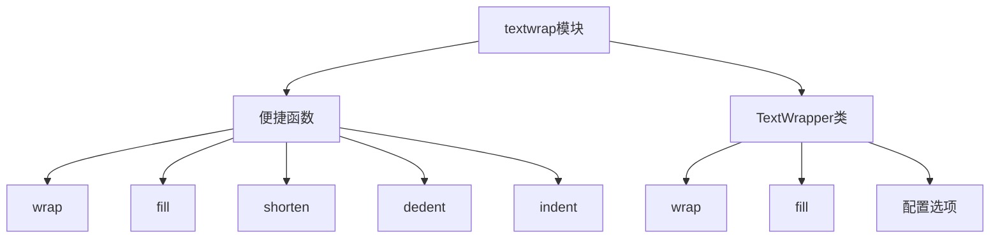

# Python标准库-textwrap模块完全参考手册

## 概述

`textwrap` 模块是Python标准库中用于文本换行和填充的专用模块，提供了一系列便捷函数和 `TextWrapper` 类来格式化文本。该模块特别适合处理需要按照指定宽度进行换行、缩进和格式化的文本。

textwrap模块的核心功能包括：
- 文本自动换行
- 文本填充和格式化
- 文本缩进和去缩进
- 文本截断和缩短
- 自定义文本格式化选项



## 便捷函数

### 1. wrap(text, width=70, **kwargs)

将单个段落包装为指定宽度的行，返回行列表：

```python
import textwrap

text = "Python is a high-level, general-purpose programming language. Its design philosophy emphasizes code readability with the use of significant indentation."

# 基本使用
lines = textwrap.wrap(text, width=40)
for line in lines:
    print(line)

# 输出:
# Python is a high-level, general-purpose
# programming language. Its design
# philosophy emphasizes code readability
# with the use of significant indentation.

# 使用初始缩进
lines = textwrap.wrap(text, width=40, initial_indent="  ")
for line in lines:
    print(line)

# 输出:
#   Python is a high-level, general-purpose
# programming language. Its design
# philosophy emphasizes code readability
# with the use of significant indentation.

# 使用后续缩进
lines = textwrap.wrap(text, width=40, initial_indent="  ", subsequent_indent="    ")
for line in lines:
    print(line)

# 输出:
#   Python is a high-level, general-purpose
#     programming language. Its design
#     philosophy emphasizes code readability
#     with the use of significant indentation.
```

### 2. fill(text, width=70, **kwargs)

将单个段落包装为指定宽度的行，返回单个字符串：

```python
import textwrap

text = "Python is a high-level, general-purpose programming language."

# 基本使用
result = textwrap.fill(text, width=30)
print(result)

# 输出:
# Python is a high-level,
# general-purpose programming
# language.

# 使用自定义缩进
result = textwrap.fill(text, width=30, initial_indent="• ", subsequent_indent="  ")
print(result)

# 输出:
# • Python is a high-level,
#   general-purpose programming
#   language.
```

### 3. shorten(text, width, **kwargs)

折叠和截断文本以适应指定宽度：

```python
import textwrap

text = "Hello, this is a very long text that needs to be shortened."

# 基本使用
shortened = textwrap.shorten(text, width=20)
print(shortened)  # Hello, this is a [...]

# 自定义占位符
shortened = textwrap.shorten(text, width=20, placeholder="...")
print(shortened)  # Hello, this is a...

# 文本适合宽度
shortened = textwrap.shorten("Short text", width=20)
print(shortened)  # Short text
```

### 4. dedent(text)

移除文本中每行的公共前导空白：

```python
import textwrap

# 基本使用
text = """
    This is an indented text.
    It has common leading spaces.
    All lines should be dedented.
"""

dedented = textwrap.dedent(text)
print(dedented)

# 输出:
#
# This is an indented text.
# It has common leading spaces.
# All lines should be dedented.
#

# 处理混合空白
text = """
\tThis has tabs.
     This has spaces.
"""

dedented = textwrap.dedent(text)
print(repr(dedented))  # '\nThis has tabs.\n     This has spaces.\n'

# 实际应用：格式化多行字符串
def format_message():
    message = textwrap.dedent("""
        Dear {name},

        Thank you for your purchase of {product}.
        Your order has been processed and will be shipped soon.

        Best regards,
        The Team
    """).strip()

    return message.format(name="Alice", product="Python Book")

print(format_message())
```

### 5. indent(text, prefix, predicate=None)

在文本的选定行开头添加前缀：

```python
import textwrap

# 基本使用
text = "Line 1\nLine 2\nLine 3"
indented = textwrap.indent(text, "  ")
print(indented)

# 输出:
#   Line 1
#   Line 2
#   Line 3

# 处理空行和空白行
text = "Line 1\n\n  \nLine 2"
indented = textwrap.indent(text, "  ")
print(indented)

# 输出:
#   Line 1
#
#
#   Line 2

# 使用谓词函数控制缩进
text = "Line 1\nLine 2\nLine 3"
indented = textwrap.indent(text, "  ", lambda line: "Line 2" in line)
print(indented)

# 输出:
# Line 1
#   Line 2
# Line 3

# 缩进所有行（包括空行）
text = "Line 1\n\nLine 2"
indented = textwrap.indent(text, "  ", lambda line: True)
print(indented)

# 输出:
#   Line 1
#
#   Line 2
```

## TextWrapper类

`TextWrapper` 类提供了更灵活和高效的文本包装功能，适合处理大量文本。

### 构造函数

```python
class textwrap.TextWrapper(**kwargs)
```

### 实例属性

#### 1. width（默认值：70）

包装行的最大长度：

```python
import textwrap

wrapper = textwrap.TextWrapper(width=30)
text = "This is a long text that needs to be wrapped to the specified width."
result = wrapper.fill(text)
print(result)

# 输出:
# This is a long text that needs
# to be wrapped to the specified
# width.
```

#### 2. expand_tabs（默认值：True）

如果为True，则将所有制表符扩展为空格：

```python
import textwrap

text = "Hello\tWorld\tPython"

# 扩展制表符
wrapper = textwrap.TextWrapper(expand_tabs=True, tabsize=8)
result = wrapper.fill(text)
print(repr(result))  # 'Hello   World  Python'

# 不扩展制表符
wrapper = textwrap.TextWrapper(expand_tabs=False)
result = wrapper.fill(text)
print(repr(result))  # 'Hello\tWorld\tPython'
```

#### 3. tabsize（默认值：8）

指定制表符扩展的空格数：

```python
import textwrap

text = "Hello\tWorld"

wrapper = textwrap.TextWrapper(expand_tabs=True, tabsize=4)
result = wrapper.fill(text)
print(repr(result))  # 'Hello    World'
```

#### 4. replace_whitespace（默认值：True）

如果为True，则在包装前将所有空白字符替换为单个空格：

```python
import textwrap

text = "Hello  World\nPython\tRocks"

# 替换空白
wrapper = textwrap.TextWrapper(replace_whitespace=True)
result = wrapper.fill(text)
print(result)  # Hello World Python Rocks

# 不替换空白
wrapper = textwrap.TextWrapper(replace_whitespace=False)
result = wrapper.fill(text)
print(result)  # Hello  World Python    Rocks
```

#### 5. drop_whitespace（默认值：True）

如果为True，则删除每行开头和结尾的空白：

```python
import textwrap

text = "  Hello  World  "

# 删除空白
wrapper = textwrap.TextWrapper(drop_whitespace=True)
result = wrapper.fill(text)
print(result)  # Hello World

# 保留空白
wrapper = textwrap.TextWrapper(drop_whitespace=False)
result = wrapper.fill(text)
print(result)  #   Hello  World
```

#### 6. initial_indent（默认值：''）

第一行的前缀字符串：

```python
import textwrap

text = "This is the first line. This is the second line."

wrapper = textwrap.TextWrapper(
    width=30,
    initial_indent="• "
)
result = wrapper.fill(text)
print(result)

# 输出:
# • This is the first line. This
# is the second line.
```

#### 7. subsequent_indent（默认值：''）

除第一行外所有行的前缀字符串：

```python
import textwrap

text = "This is the first line. This is the second line. This is the third line."

wrapper = textwrap.TextWrapper(
    width=30,
    initial_indent="• ",
    subsequent_indent="  "
)
result = wrapper.fill(text)
print(result)

# 输出:
# • This is the first line. This
#   is the second line. This is
#   the third line.
```

#### 8. fix_sentence_endings（默认值：False）

如果为True，则尝试检测句子结尾并确保句子之间有两个空格：

```python
import textwrap

text = "Hello. World. Python is great."

# 不修复句子结尾
wrapper = textwrap.TextWrapper(fix_sentence_endings=False)
result = wrapper.fill(text)
print(result)  # Hello. World. Python is great.

# 修复句子结尾
wrapper = textwrap.TextWrapper(fix_sentence_endings=True)
result = wrapper.fill(text)
print(result)  # Hello.  World.  Python is great.
```

#### 9. break_long_words（默认值：True）

如果为True，则将超过宽度的单词断开：

```python
import textwrap

text = "This is a verylongwordthatneedstobebroken."

# 断开长单词
wrapper = textwrap.TextWrapper(width=20, break_long_words=True)
result = wrapper.fill(text)
print(result)

# 输出:
# This is a
# verylongwordthatneedsto
# bebroken.

# 不断开长单词
wrapper = textwrap.TextWrapper(width=20, break_long_words=False)
result = wrapper.fill(text)
print(result)

# 输出:
# This is a
# verylongwordthatneedstobebroken.
```

#### 10. break_on_hyphens（默认值：True）

如果为True，则在连字符处断开复合词：

```python
import textwrap

text = "This is a compound-word that should-break on-hyphens."

# 在连字符处断开
wrapper = textwrap.TextWrapper(width=20, break_on_hyphens=True)
result = wrapper.fill(text)
print(result)

# 输出:
# This is a compound-
# word that should-
# break on-hyphens.

# 不在连字符处断开
wrapper = textwrap.TextWrapper(width=20, break_on_hyphens=False)
result = wrapper.fill(text)
print(result)

# 输出:
# This is a
# compound-word that
# should-break on-
# hyphens.
```

#### 11. max_lines（默认值：None）

输出的最大行数：

```python
import textwrap

text = "This is a long text that will be truncated after a certain number of lines. It has multiple sentences to demonstrate the max_lines feature."

# 限制行数
wrapper = textwrap.TextWrapper(width=30, max_lines=2)
result = wrapper.fill(text)
print(result)

# 输出:
# This is a long text that will
# be truncated after a certain
#  [...]
```

#### 12. placeholder（默认值：' [...]'）

当文本被截断时显示的占位符：

```python
import textwrap

text = "This is a long text that will be truncated."

# 自定义占位符
wrapper = textwrap.TextWrapper(
    width=20,
    max_lines=2,
    placeholder="..."
)
result = wrapper.fill(text)
print(result)  # This is a long text...

# 无占位符
wrapper = textwrap.TextWrapper(
    width=20,
    max_lines=2,
    placeholder=""
)
result = wrapper.fill(text)
print(result)  # This is a long text
```

### 实例方法

#### 1. wrap(text)

包装单个段落，返回行列表：

```python
import textwrap

wrapper = textwrap.TextWrapper(width=20)
text = "This is a sample text for wrapping."

lines = wrapper.wrap(text)
for line in lines:
    print(line)

# 输出:
# This is a sample text
# for wrapping.
```

#### 2. fill(text)

包装单个段落，返回单个字符串：

```python
import textwrap

wrapper = textwrap.TextWrapper(width=20)
text = "This is a sample text for wrapping."

result = wrapper.fill(text)
print(result)

# 输出:
# This is a sample text
# for wrapping.
```

## 实战应用

### 1. 格式化文档

```python
import textwrap

def format_document(title, content, width=80):
    """格式化文档"""
    # 格式化标题
    title_line = "=" * width
    formatted_title = textwrap.fill(title, width=width).center(width)

    # 格式化内容
    formatted_content = textwrap.fill(content, width=width)

    # 组合结果
    document = f"{title_line}\n{formatted_title}\n{title_line}\n\n{formatted_content}\n"

    return document

# 使用示例
title = "Python Programming Guide"
content = """
Python is a high-level, general-purpose programming language. Its design philosophy emphasizes code readability with the use of significant indentation. Python is dynamically-typed and garbage-collected. It supports multiple programming paradigms, including structured, object-oriented and functional programming.
"""

formatted_doc = format_document(title, content)
print(formatted_doc)
```

### 2. 创建命令行帮助信息

```python
import textwrap

def format_help(description, options, width=80):
    """格式化命令行帮助信息"""
    help_text = []

    # 格式化描述
    help_text.append(textwrap.fill(description, width=width))
    help_text.append("\n")

    # 格式化选项
    help_text.append("Options:")
    for opt, desc in options.items():
        opt_text = f"  {opt}"
        desc_text = textwrap.fill(desc, width=width, initial_indent="    ", subsequent_indent="    ")
        help_text.append(opt_text)
        help_text.append(desc_text)

    return "\n".join(help_text)

# 使用示例
description = """
This is a sample command-line tool that demonstrates how to format help information using the textwrap module.
"""

options = {
    "--help": "Show this help message and exit.",
    "--version": "Show program's version number and exit.",
    "--verbose, -v": "Enable verbose output mode.",
    "--output FILE, -o FILE": "Specify output file path.",
}

help_text = format_help(description, options)
print(help_text)
```

### 3. 生成电子邮件

```python
import textwrap

def generate_email(recipient, subject, body, sender="noreply@example.com"):
    """生成电子邮件"""
    # 格式化邮件头
    headers = [
        f"From: {sender}",
        f"To: {recipient}",
        f"Subject: {subject}"
    ]

    # 格式化邮件体
    formatted_body = textwrap.fill(body, width=72)

    # 组合邮件
    email = "\n".join(headers) + "\n\n" + formatted_body

    return email

# 使用示例
recipient = "user@example.com"
subject = "Welcome to Our Service"
body = """
Thank you for signing up for our service! We're excited to have you on board. If you have any questions or need assistance, please don't hesitate to contact our support team.
"""

email = generate_email(recipient, subject, body)
print(email)
```

### 4. 格式化代码注释

```python
import textwrap

def format_comment(text, prefix="# ", width=80):
    """格式化代码注释"""
    # 去除缩进
    dedented = textwrap.dedent(text)

    # 包装文本
    wrapped = textwrap.fill(dedented, width=width)

    # 添加前缀
    indented = textwrap.indent(wrapped, prefix)

    return indented

# 使用示例
comment_text = """
This is a long comment that needs to be formatted properly.
It spans multiple lines and should be wrapped to fit within a specified width.
"""

formatted_comment = format_comment(comment_text)
print(formatted_comment)
```

### 5. 创建报告

```python
import textwrap

def generate_report(title, sections, width=80):
    """生成报告"""
    report = []

    # 添加标题
    title_line = "=" * width
    report.append(title_line)
    report.append(textwrap.fill(title, width=width).center(width))
    report.append(title_line)
    report.append("")

    # 添加各部分
    for section_title, section_content in sections:
        # 部分标题
        report.append(f"\n{section_title}")
        report.append("-" * len(section_title))

        # 部分内容
        formatted_content = textwrap.fill(section_content, width=width)
        report.append(formatted_content)

    return "\n".join(report)

# 使用示例
title = "Annual Report 2024"

sections = [
    ("Executive Summary", """
    This report provides an overview of the company's performance in 2024.
    Key highlights include increased revenue, expanded market reach, and improved customer satisfaction.
    """),

    ("Financial Performance", """
    Revenue increased by 15% compared to the previous year.
    Operating margins improved from 12% to 18%.
    Net income grew by 22% year-over-year.
    """),

    ("Future Outlook", """
    We anticipate continued growth in 2025, driven by new product launches and expansion into emerging markets.
    Strategic investments in technology and talent will position the company for long-term success.
    """)
]

report = generate_report(title, sections)
print(report)
```

### 6. 处理用户输入

```python
import textwrap

def format_user_input(user_input, max_width=60, max_lines=3):
    """格式化用户输入"""
    # 截断文本
    shortened = textwrap.shorten(
        user_input,
        width=max_width,
        placeholder="..."
    )

    # 包装文本
    wrapped = textwrap.fill(shortened, width=max_width)

    # 限制行数
    lines = wrapped.split('\n')
    if len(lines) > max_lines:
        lines = lines[:max_lines]
        if lines[-1]:
            lines[-1] += "..."
        else:
            lines.append("...")

    return '\n'.join(lines)

# 使用示例
long_input = "This is a very long user input that needs to be formatted properly for display in the user interface, where space is limited."
formatted = format_user_input(long_input)
print(formatted)
```

## 性能优化

### 1. 重用TextWrapper对象

```python
import textwrap
import time

# 不好的做法 - 每次都创建新对象
def format_texts_bad(texts):
    results = []
    for text in texts:
        result = textwrap.fill(text, width=70)
        results.append(result)
    return results

# 好的做法 - 重用TextWrapper对象
def format_texts_good(texts):
    wrapper = textwrap.TextWrapper(width=70)
    results = []
    for text in texts:
        result = wrapper.fill(text)
        results.append(result)
    return results

# 性能测试
texts = [
    "This is a sample text." * 10
    for _ in range(100)
]

start = time.time()
results_bad = format_texts_bad(texts)
bad_time = time.time() - start

start = time.time()
results_good = format_texts_good(texts)
good_time = time.time() - start

print(f"Bad: {bad_time:.4f}s, Good: {good_time:.4f}s")
```

### 2. 批量处理文本

```python
import textwrap

class BatchTextFormatter:
    """批量文本格式化器"""

    def __init__(self, **kwargs):
        self.wrapper = textwrap.TextWrapper(**kwargs)

    def format_multiple(self, texts):
        """格式化多个文本"""
        return [self.wrapper.fill(text) for text in texts]

# 使用示例
formatter = BatchTextFormatter(width=60, initial_indent="• ", subsequent_indent="  ")

texts = [
    "First paragraph of text.",
    "Second paragraph of text.",
    "Third paragraph of text."
]

formatted = formatter.format_multiple(texts)
for text in formatted:
    print(text)
    print()
```

## 最佳实践

### 1. 选择合适的工具

```python
import textwrap

# 简单任务 - 使用便捷函数
text = "Simple text for quick wrapping."
result = textwrap.fill(text, width=70)

# 复杂任务 - 使用TextWrapper
wrapper = textwrap.TextWrapper(
    width=70,
    initial_indent="• ",
    subsequent_indent="  ",
    break_on_hyphens=True,
    fix_sentence_endings=True
)
result = wrapper.fill(text)

# 批量处理 - 重用TextWrapper对象
wrapper = textwrap.TextWrapper(width=70)
results = [wrapper.fill(text) for text in texts]
```

### 2. 处理多段落文本

```python
import textwrap

def format_paragraphs(text, **kwargs):
    """格式化多段落文本"""
    paragraphs = text.split('\n\n')
    wrapper = textwrap.TextWrapper(**kwargs)

    formatted_paragraphs = [wrapper.fill(p) for p in paragraphs]

    return '\n\n'.join(formatted_paragraphs)

# 使用示例
text = """
First paragraph with some content.
It spans multiple lines.

Second paragraph with different content.
This is a separate paragraph from the first one.
"""

formatted = format_paragraphs(text, width=60)
print(formatted)
```

### 3. 处理特殊字符

```python
import textwrap

def format_with_special_chars(text, width=70):
    """处理包含特殊字符的文本"""
    # 先处理制表符和特殊空白
    wrapper = textwrap.TextWrapper(
        width=width,
        expand_tabs=True,
        tabsize=4,
        replace_whitespace=True
    )

    return wrapper.fill(text)

# 使用示例
text = "Python\tRocks!\nThis has\tspecial\tcharacters."
formatted = format_with_special_chars(text)
print(formatted)
```

## 常见问题

### Q1: wrap()和fill()有什么区别？

**A**: `wrap()` 返回行列表，而 `fill()` 返回单个字符串。`fill()` 实际上是 `"\n".join(wrap(text, ...))` 的简写。

### Q2: 如何处理包含制表符的文本？

**A**: 使用 `expand_tabs=True` 和 `tabsize` 参数来控制制表符的扩展方式：

```python
wrapper = textwrap.TextWrapper(expand_tabs=True, tabsize=4)
```

### Q3: 如何避免断开单词？

**A**: 设置 `break_long_words=False` 和 `break_on_hyphens=False`：

```python
wrapper = textwrap.TextWrapper(
    break_long_words=False,
    break_on_hyphens=False
)
```

`textwrap` 模块是Python中处理文本格式化的强大工具，提供了：

1. **便捷函数**：适合简单的文本格式化任务
2. **TextWrapper类**：适合复杂的、批量处理的文本格式化
3. **灵活的配置**：支持多种格式化选项
4. **高效的处理**：可重用对象提高性能

通过掌握 `textwrap` 模块，您可以：
- 格式化文档和报告
- 生成电子邮件和消息
- 创建命令行帮助信息
- 处理用户输入
- 格式化代码注释

`textwrap` 模块是文本处理应用的基础，掌握它将大大提升您处理和格式化文本的能力。无论是简单的文本换行还是复杂的文档格式化，`textwrap` 都能提供强大而灵活的解决方案。