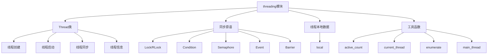

# Python标准库-threading模块完全参考手册

## 概述

`threading` 模块提供了基于线程的并行处理功能，在低级 `_thread` 模块之上构建了更高级的线程接口。它允许在单个进程中并发运行多个线程，共享内存空间，特别适用于I/O密集型任务。

threading模块的核心功能包括：
- 线程创建和管理
- 线程同步原语（锁、条件变量、信号量等）
- 线程本地数据
- 线程间通信
- 守护线程支持



## 线程基础

### 创建和启动线程

```python
import threading
import time

def worker(name, delay):
    """工作线程函数"""
    print(f"线程 {name} 开始")
    time.sleep(delay)
    print(f"线程 {name} 结束")

# 创建线程
thread1 = threading.Thread(target=worker, args=("张三", 2))
thread2 = threading.Thread(target=worker, args=("李四", 1))

# 启动线程
thread1.start()
thread2.start()

# 等待线程完成
thread1.join()
thread2.join()

print("主线程结束")
```

### 继承Thread类

```python
import threading
import time

class MyThread(threading.Thread):
    """自定义线程类"""
    
    def __init__(self, name, delay):
        super().__init__(name=name)
        self.delay = delay
    
    def run(self):
        """线程执行的主方法"""
        print(f"线程 {self.name} 开始")
        time.sleep(self.delay)
        print(f"线程 {self.name} 结束")

# 创建并启动线程
thread1 = MyThread("线程1", 2)
thread2 = MyThread("线程2", 1)

thread1.start()
thread2.start()

thread1.join()
thread2.join()

print("主线程结束")
```

### 线程属性

```python
import threading
import time

def worker():
    """工作线程"""
    print(f"线程ID: {threading.get_ident()}")
    print(f"原生线程ID: {threading.get_native_id()}")
    print(f"线程名称: {threading.current_thread().name}")
    time.sleep(1)

# 创建线程
thread = threading.Thread(target=worker, name="工作线程")
print(f"线程名称: {thread.name}")
print(f"是否守护线程: {thread.daemon}")

# 启动线程
thread.start()

# 检查线程状态
print(f"线程是否存活: {thread.is_alive()}")
print(f"线程ID: {thread.ident}")

# 等待线程完成
thread.join()

print(f"线程结束后是否存活: {thread.is_alive()}")
```

## 线程同步

### Lock（锁）

```python
import threading
import time

# 创建锁
lock = threading.Lock()

def worker(name):
    """工作线程"""
    with lock:  # 自动获取和释放锁
        print(f"线程 {name} 获得锁")
        time.sleep(1)
        print(f"线程 {name} 释放锁")

# 创建多个线程
threads = []
for i in range(3):
    thread = threading.Thread(target=worker, args=(f"线程{i+1}",))
    threads.append(thread)
    thread.start()

# 等待所有线程完成
for thread in threads:
    thread.join()

print("所有线程完成")
```

### RLock（可重入锁）

```python
import threading
import time

# 创建可重入锁
rlock = threading.RLock()

def worker(name):
    """工作线程"""
    with rlock:
        print(f"线程 {name} 第一次获得锁")
        with rlock:  # 同一线程可以多次获取
            print(f"线程 {name} 第二次获得锁")
            time.sleep(1)
        print(f"线程 {name} 释放第二次锁")
    print(f"线程 {name} 释放第一次锁")

# 创建线程
thread1 = threading.Thread(target=worker, args=("线程1",))
thread2 = threading.Thread(target=worker, args=("线程2",))

thread1.start()
thread2.start()

thread1.join()
thread2.join()

print("所有线程完成")
```

### Condition（条件变量）

```python
import threading
import time
import random

# 创建条件变量
condition = threading.Condition()
items = []

def producer():
    """生产者"""
    for i in range(5):
        with condition:
            items.append(f"商品{i+1}")
            print(f"生产者生产了: 商品{i+1}")
            condition.notify()  # 通知消费者
            time.sleep(random.random())

def consumer():
    """消费者"""
    while True:
        with condition:
            if not items:
                print("消费者等待商品...")
                condition.wait()  # 等待生产者通知
            
            if items:
                item = items.pop(0)
                print(f"消费者消费了: {item}")
        
        if item == "商品5":
            break

# 创建线程
producer_thread = threading.Thread(target=producer)
consumer_thread = threading.Thread(target=consumer)

producer_thread.start()
consumer_thread.start()

producer_thread.join()
consumer_thread.join()

print("生产消费完成")
```

### Semaphore（信号量）

```python
import threading
import time

# 创建信号量（最多3个线程同时访问）
semaphore = threading.Semaphore(3)

def worker(name):
    """工作线程"""
    print(f"线程 {name} 等待访问资源")
    with semaphore:
        print(f"线程 {name} 获得访问权限")
        time.sleep(2)
        print(f"线程 {name} 释放资源")

# 创建多个线程
threads = []
for i in range(6):
    thread = threading.Thread(target=worker, args=(f"线程{i+1}",))
    threads.append(thread)
    thread.start()

# 等待所有线程完成
for thread in threads:
    thread.join()

print("所有线程完成")
```

### Event（事件）

```python
import threading
import time

# 创建事件
event = threading.Event()

def worker(name):
    """工作线程"""
    print(f"线程 {name} 等待事件")
    event.wait()  # 等待事件被设置
    print(f"线程 {name} 收到事件，继续执行")

# 创建线程
threads = []
for i in range(3):
    thread = threading.Thread(target=worker, args=(f"线程{i+1}",))
    threads.append(thread)
    thread.start()

# 模拟一些工作
time.sleep(2)
print("设置事件")
event.set()  # 设置事件，唤醒所有等待的线程

# 等待所有线程完成
for thread in threads:
    thread.join()

print("所有线程完成")
```

### Barrier（屏障）

```python
import threading
import time

# 创建屏障（等待3个线程到达）
barrier = threading.Barrier(3)

def worker(name):
    """工作线程"""
    print(f"线程 {name} 开始工作")
    time.sleep(1)
    print(f"线程 {name} 到达屏障")
    
    try:
        barrier.wait()  # 等待其他线程
        print(f"线程 {name} 通过屏障，继续执行")
    except threading.BrokenBarrierError:
        print(f"线程 {name} 屏障被破坏")

# 创建线程
threads = []
for i in range(3):
    thread = threading.Thread(target=worker, args=(f"线程{i+1}",))
    threads.append(thread)
    thread.start()

# 等待所有线程完成
for thread in threads:
    thread.join()

print("所有线程完成")
```

## 线程本地数据

### 使用local

```python
import threading

# 创建线程本地数据
thread_local = threading.local()

def worker(name):
    """工作线程"""
    # 设置线程本地数据
    thread_local.name = name
    thread_local.value = 0
    
    for i in range(3):
        thread_local.value += 1
        print(f"线程 {name}: {thread_local.value}")

# 创建线程
threads = []
for i in range(3):
    thread = threading.Thread(target=worker, args=(f"线程{i+1}",))
    threads.append(thread)
    thread.start()

# 等待所有线程完成
for thread in threads:
    thread.join()

print("所有线程完成")
```

### 自定义local类

```python
import threading

class MyLocal(threading.local):
    """自定义线程本地数据类"""
    
    def __init__(self):
        super().__init__()
        self.counter = 0
    
    def increment(self):
        self.counter += 1
        return self.counter

# 创建自定义线程本地数据
my_local = MyLocal()

def worker(name):
    """工作线程"""
    for i in range(3):
        count = my_local.increment()
        print(f"线程 {name}: 计数 {count}")

# 创建线程
threads = []
for i in range(3):
    thread = threading.Thread(target=worker, args=(f"线程{i+1}",))
    threads.append(thread)
    thread.start()

# 等待所有线程完成
for thread in threads:
    thread.join()

print("所有线程完成")
```

## 工具函数

### 线程信息

```python
import threading
import time

def worker():
    """工作线程"""
    print(f"当前线程: {threading.current_thread().name}")
    print(f"主线程: {threading.main_thread().name}")
    time.sleep(1)

# 创建线程
thread = threading.Thread(target=worker, name="工作线程")
thread.start()

# 获取活动线程数
print(f"活动线程数: {threading.active_count()}")

# 枚举所有线程
print("所有活动线程:")
for t in threading.enumerate():
    print(f"  - {t.name} (ID: {t.ident})")

# 等待线程完成
thread.join()

print("主线程结束")
```

### 守护线程

```python
import threading
import time

def worker():
    """守护线程"""
    while True:
        print("守护线程运行中...")
        time.sleep(1)

# 创建守护线程
daemon_thread = threading.Thread(target=worker, name="守护线程")
daemon_thread.daemon = True  # 设置为守护线程
daemon_thread.start()

# 主线程运行一段时间
time.sleep(3)
print("主线程结束")

# 当主线程结束时，守护线程会自动终止
```

## 实战应用

### 1. 线程池

```python
import threading
import queue
import time

class ThreadPool:
    """简单线程池"""
    
    def __init__(self, max_workers=4):
        self.max_workers = max_workers
        self.queue = queue.Queue()
        self.workers = []
        self.shutdown = False
        
        # 创建工作线程
        for i in range(max_workers):
            worker = threading.Thread(target=self._worker, name=f"Worker-{i+1}")
            worker.daemon = True
            worker.start()
            self.workers.append(worker)
    
    def _worker(self):
        """工作线程"""
        while not self.shutdown:
            try:
                # 从队列获取任务
                task, args, kwargs = self.queue.get(timeout=1)
                try:
                    task(*args, **kwargs)
                finally:
                    self.queue.task_done()
            except queue.Empty:
                continue
    
    def submit(self, task, *args, **kwargs):
        """提交任务"""
        self.queue.put((task, args, kwargs))
    
    def shutdown_pool(self):
        """关闭线程池"""
        self.shutdown = True
        for worker in self.workers:
            worker.join()

def worker_task(name, duration):
    """工作线程任务"""
    print(f"任务 {name} 开始")
    time.sleep(duration)
    print(f"任务 {name} 完成")

# 使用示例
pool = ThreadPool(max_workers=3)

# 提交任务
for i in range(5):
    pool.submit(worker_task, f"任务{i+1}", 1)

# 等待所有任务完成
pool.queue.join()

# 关闭线程池
pool.shutdown_pool()

print("所有任务完成")
```

### 2. 生产者-消费者模式

```python
import threading
import queue
import time
import random

class ProducerConsumer:
    """生产者-消费者模式"""
    
    def __init__(self, max_size=10):
        self.queue = queue.Queue(maxsize=max_size)
        self.lock = threading.Lock()
        self.count = 0
    
    def producer(self, name):
        """生产者"""
        while True:
            item = f"商品{self.count}"
            
            with self.lock:
                self.count += 1
            
            try:
                self.queue.put(item, timeout=1)
                print(f"生产者 {name} 生产了: {item}")
            except queue.Full:
                print(f"生产者 {name} 队列已满")
            
            time.sleep(random.random())
    
    def consumer(self, name):
        """消费者"""
        while True:
            try:
                item = self.queue.get(timeout=1)
                print(f"消费者 {name} 消费了: {item}")
                self.queue.task_done()
            except queue.Empty:
                print(f"消费者 {name} 队列为空")
            
            time.sleep(random.random())

# 使用示例
pc = ProducerConsumer(max_size=5)

# 创建生产者和消费者
producers = [threading.Thread(target=pc.producer, args=(f"生产者{i+1}",)) 
             for i in range(2)]
consumers = [threading.Thread(target=pc.consumer, args=(f"消费者{i+1}",)) 
             for i in range(3)]

# 启动所有线程
for thread in producers + consumers:
    thread.daemon = True
    thread.start()

# 运行一段时间
time.sleep(5)

print("主线程结束")
```

### 3. 任务调度器

```python
import threading
import time
import datetime

class TaskScheduler:
    """任务调度器"""
    
    def __init__(self):
        self.tasks = []
        self.lock = threading.Lock()
        self.running = False
        self.thread = None
    
    def add_task(self, task, interval=None, start_time=None):
        """添加任务"""
        with self.lock:
            self.tasks.append({
                'task': task,
                'interval': interval,
                'start_time': start_time,
                'last_run': None
            })
    
    def _scheduler_loop(self):
        """调度循环"""
        while self.running:
            current_time = datetime.datetime.now()
            
            with self.lock:
                for task_info in self.tasks:
                    task = task_info['task']
                    interval = task_info['interval']
                    start_time = task_info['start_time']
                    last_run = task_info['last_run']
                    
                    should_run = False
                    
                    if start_time and not last_run:
                        if current_time >= start_time:
                            should_run = True
                    elif interval and last_run:
                        if (current_time - last_run).total_seconds() >= interval:
                            should_run = True
                    
                    if should_run:
                        try:
                            task()
                            task_info['last_run'] = current_time
                        except Exception as e:
                            print(f"任务执行失败: {e}")
            
            time.sleep(1)
    
    def start(self):
        """启动调度器"""
        if not self.running:
            self.running = True
            self.thread = threading.Thread(target=self._scheduler_loop)
            self.thread.daemon = True
            self.thread.start()
    
    def stop(self):
        """停止调度器"""
        self.running = False
        if self.thread:
            self.thread.join()

# 使用示例
def task1():
    """定时任务1"""
    print(f"定时任务1执行: {datetime.datetime.now()}")

def task2():
    """定时任务2"""
    print(f"定时任务2执行: {datetime.datetime.now()}")

# 创建调度器
scheduler = TaskScheduler()

# 添加任务
scheduler.add_task(task1, interval=3)  # 每3秒执行一次
scheduler.add_task(task2, interval=5)  # 每5秒执行一次

# 启动调度器
scheduler.start()

# 运行一段时间
time.sleep(15)

# 停止调度器
scheduler.stop()

print("调度器停止")
```

### 4. 资源管理器

```python
import threading
import time
from collections import defaultdict

class ResourceManager:
    """资源管理器"""
    
    def __init__(self, max_resources=5):
        self.max_resources = max_resources
        self.available_resources = list(range(max_resources))
        self.allocated_resources = {}
        self.lock = threading.Lock()
        self.condition = threading.Condition(self.lock)
    
    def acquire(self, request_id, count=1):
        """获取资源"""
        with self.condition:
            while len(self.available_resources) < count:
                print(f"请求 {request_id} 等待资源...")
                self.condition.wait()
            
            # 分配资源
            resources = self.available_resources[:count]
            self.available_resources = self.available_resources[count:]
            self.allocated_resources[request_id] = resources
            
            print(f"请求 {request_id} 获得资源: {resources}")
            return resources
    
    def release(self, request_id):
        """释放资源"""
        with self.condition:
            if request_id in self.allocated_resources:
                resources = self.allocated_resources.pop(request_id)
                self.available_resources.extend(resources)
                self.available_resources.sort()
                
                print(f"请求 {request_id} 释放资源: {resources}")
                self.condition.notify_all()

def worker(name, manager):
    """工作线程"""
    try:
        # 获取资源
        resources = manager.acquire(name, count=2)
        
        # 使用资源
        time.sleep(2)
        print(f"请求 {name} 使用资源完成")
        
    finally:
        # 释放资源
        manager.release(name)

# 使用示例
manager = ResourceManager(max_resources=5)

# 创建工作线程
threads = []
for i in range(4):
    thread = threading.Thread(target=worker, args=(f"请求{i+1}", manager))
    threads.append(thread)
    thread.start()

# 等待所有线程完成
for thread in threads:
    thread.join()

print("所有请求完成")
```

### 5. 并行文件处理

```python
import threading
import queue
import os
from pathlib import Path

class ParallelFileProcessor:
    """并行文件处理器"""
    
    def __init__(self, max_workers=4):
        self.max_workers = max_workers
        self.queue = queue.Queue()
        self.results = {}
        self.lock = threading.Lock()
        self.workers = []
        self.shutdown = False
        
        # 创建工作线程
        for i in range(max_workers):
            worker = threading.Thread(target=self._worker, name=f"Processor-{i+1}")
            worker.daemon = True
            worker.start()
            self.workers.append(worker)
    
    def _worker(self):
        """工作线程"""
        while not self.shutdown:
            try:
                file_path = self.queue.get(timeout=1)
                try:
                    result = self._process_file(file_path)
                    with self.lock:
                        self.results[file_path] = result
                finally:
                    self.queue.task_done()
            except queue.Empty:
                continue
    
    def _process_file(self, file_path):
        """处理单个文件"""
        try:
            size = os.path.getsize(file_path)
            return {
                'success': True,
                'size': size,
                'lines': self._count_lines(file_path)
            }
        except Exception as e:
            return {
                'success': False,
                'error': str(e)
            }
    
    def _count_lines(self, file_path):
        """计算文件行数"""
        count = 0
        with open(file_path, 'r', encoding='utf-8') as f:
            for _ in f:
                count += 1
        return count
    
    def add_file(self, file_path):
        """添加文件"""
        self.queue.put(file_path)
    
    def wait_complete(self):
        """等待所有文件处理完成"""
        self.queue.join()
    
    def get_results(self):
        """获取结果"""
        return self.results

def process_directory(directory, pattern="*.txt"):
    """处理目录中的文件"""
    processor = ParallelFileProcessor(max_workers=4)
    
    # 添加所有文件
    directory_path = Path(directory)
    for file_path in directory_path.glob(pattern):
        processor.add_file(str(file_path))
    
    # 等待处理完成
    processor.wait_complete()
    
    # 获取结果
    results = processor.get_results()
    
    # 打印结果
    for file_path, result in results.items():
        if result['success']:
            print(f"{file_path}: {result['size']} 字节, {result['lines']} 行")
        else:
            print(f"{file_path}: 处理失败 - {result['error']}")
    
    return results

# 使用示例
if __name__ == '__main__':
    # 处理当前目录中的所有.txt文件
    results = process_directory('.', '*.txt')
    print(f"处理了 {len(results)} 个文件")
```

## 性能优化

### 1. 避免过多的锁竞争

```python
import threading

# 不好的做法
class CounterBad:
    """不好的计数器实现"""
    def __init__(self):
        self.lock = threading.Lock()
        self.count = 0
    
    def increment(self):
        with self.lock:
            self.count += 1

# 好的做法（使用局部变量减少锁竞争）
class CounterGood:
    """好的计数器实现"""
    def __init__(self):
        self.lock = threading.Lock()
        self.count = 0
        self.local_counts = {}
        self.local_lock = threading.Lock()
    
    def increment(self):
        thread_id = threading.get_ident()
        
        # 获取线程本地计数
        with self.local_lock:
            if thread_id not in self.local_counts:
                self.local_counts[thread_id] = 0
            self.local_counts[thread_id] += 1
            local_count = self.local_counts[thread_id]
        
        # 定期同步到主计数器
        if local_count >= 100:
            with self.lock:
                self.count += local_count
                self.local_counts[thread_id] = 0
```

### 2. 使用线程本地存储

```python
import threading

class DataProcessor:
    """数据处理器"""
    
    def __init__(self):
        self.local_data = threading.local()
    
    def process(self, data):
        # 线程本地数据初始化
        if not hasattr(self.local_data, 'buffer'):
            self.local_data.buffer = []
            self.local_data.count = 0
        
        # 处理数据
        self.local_data.buffer.append(data)
        self.local_data.count += 1
        
        # 定期清理
        if self.local_data.count >= 100:
            result = self._flush_buffer()
            return result
        
        return None
    
    def _flush_buffer(self):
        """清理缓冲区"""
        buffer = self.local_data.buffer
        self.local_data.buffer = []
        self.local_data.count = 0
        return f"处理了 {len(buffer)} 条数据"
```

## 安全考虑

### 1. 线程安全的数据结构

```python
import threading
from collections import deque

class ThreadSafeQueue:
    """线程安全队列"""
    
    def __init__(self):
        self.queue = deque()
        self.lock = threading.Lock()
        self.not_empty = threading.Condition(self.lock)
        self.not_full = threading.Condition(self.lock)
        self.max_size = 100
    
    def put(self, item):
        """放入项目"""
        with self.not_full:
            while len(self.queue) >= self.max_size:
                self.not_full.wait()
            self.queue.append(item)
            self.not_empty.notify()
    
    def get(self):
        """获取项目"""
        with self.not_empty:
            while len(self.queue) == 0:
                self.not_empty.wait()
            item = self.queue.popleft()
            self.not_full.notify()
            return item
    
    def size(self):
        """获取队列大小"""
        with self.lock:
            return len(self.queue)
```

### 2. 死锁预防

```python
import threading
import time

class DeadlockSafeLocks:
    """死锁安全的锁管理"""
    
    def __init__(self):
        self.lock1 = threading.Lock()
        self.lock2 = threading.Lock()
    
    def operation1(self):
        """操作1"""
        # 始终按照相同顺序获取锁
        with self.lock1:
            time.sleep(0.1)
            with self.lock2:
                print("操作1完成")
    
    def operation2(self):
        """操作2"""
        # 与操作1相同的获取顺序
        with self.lock1:
            time.sleep(0.1)
            with self.lock2:
                print("操作2完成")

# 使用示例
safe_locks = DeadlockSafeLocks()

thread1 = threading.Thread(target=safe_locks.operation1)
thread2 = threading.Thread(target=safe_locks.operation2)

thread1.start()
thread2.start()

thread1.join()
thread2.join()
```

## 常见问题

### Q1: 什么是GIL（全局解释器锁）？

**A**: GIL是Python解释器的全局锁，确保同一时刻只有一个线程执行Python字节码。这意味着即使在多核CPU上，Python多线程也无法实现真正的并行计算。对于CPU密集型任务，建议使用`multiprocessing`模块。

### Q2: 如何选择线程和进程？

**A**: 对于I/O密集型任务（网络请求、文件操作等），使用线程；对于CPU密集型任务，使用进程。线程开销小，进程开销大但能充分利用多核CPU。

### Q3: 如何避免死锁？

**A**: 避免嵌套锁，按固定顺序获取锁，使用超时机制，或使用更高级的同步原语如`RLock`。良好的代码设计和测试也是预防死锁的重要方法。

`threading` 模块是Python中最重要和最强大的并发编程模块之一，提供了：

1. **线程管理**: 创建、启动、同步和销毁线程
2. **同步原语**: Lock、RLock、Condition、Semaphore、Event、Barrier
3. **线程本地数据**: 线程特定的数据存储
4. **工具函数**: 线程信息获取和管理
5. **灵活性**: 支持多种并发模式和生产消费模型
6. **易用性**: 提供高级抽象简化并发编程

通过掌握 `threading` 模块，您可以：
- 实现高效的并发I/O操作
- 构建生产者-消费者系统
- 开发任务调度器
- 管理共享资源
- 优化程序性能
- 处理复杂的同步场景

`threading` 模块是Python并发编程的基础，掌握它将使您的应用程序更加高效和响应。虽然是受GIL限制，但它在I/O密集型应用中仍然非常有用。对于需要真正并行计算的场景，可以考虑`multiprocessing`或`concurrent.futures`模块。