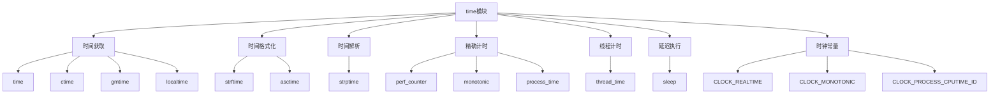

# Python标准库-time模块完全参考手册

## 概述

`time` 模块提供了各种与时间相关的函数。该模块总是可用的，但并非所有函数在所有平台上都可用。模块中的大多数函数调用了平台C库中同名函数。

time模块的核心功能包括：
- 时间获取（time、ctime、gmtime、localtime）
- 时间格式化（strftime、asctime、ctime）
- 时间解析（strptime）
- 精确计时（perf_counter、monotonic、process_time）
- 线程计时（thread_time）
- 延迟执行（sleep）
- 时区处理



## 时间获取

### time - 当前时间戳

```python
import time

# 获取当前时间戳
timestamp = time.time()
print(f"当前时间戳: {timestamp}")
print(f"时间戳格式化: {time.ctime(timestamp)}")

# 获取纳秒级时间戳
timestamp_ns = time.time_ns()
print(f"纳秒时间戳: {timestamp_ns}")

# 时间戳转换为可读格式
print(f"本地时间: {time.ctime()}")
print(f"UTC时间: {time.asctime(time.gmtime())}")
```

### gmtime - UTC时间

```python
import time

# 获取UTC时间
utc_time = time.gmtime()
print(f"UTC时间结构: {utc_time}")
print(f"年份: {utc_time.tm_year}")
print(f"月份: {utc_time.tm_mon}")
print(f"日期: {utc_time.tm_mday}")
print(f"小时: {utc_time.tm_hour}")
print(f"分钟: {utc_time.tm_min}")
print(f"秒: {utc_time.tm_sec}")
print(f"星期: {utc_time.tm_wday}")
print(f"一年中的第几天: {utc_time.tm_yday}")
print(f"夏令时: {utc_time.tm_isdst}")

# 从时间戳获取UTC时间
timestamp = time.time()
utc_from_timestamp = time.gmtime(timestamp)
print(f"从时间戳的UTC时间: {utc_from_timestamp}")
```

### localtime - 本地时间

```python
import time

# 获取本地时间
local_time = time.localtime()
print(f"本地时间结构: {local_time}")
print(f"年份: {local_time.tm_year}")
print(f"月份: {local_time.tm_mon}")
print(f"日期: {local_time.tm_mday}")
print(f"小时: {local_time.tm_hour}")
print(f"分钟: {local_time.tm_min}")
print(f"秒: {local_time.tm_sec}")
print(f"星期: {local_time.tm_wday}")
print(f"一年中的第几天: {local_time.tm_yday}")
print(f"夏令时: {local_time.tm_isdst}")

# 从时间戳获取本地时间
timestamp = time.time()
local_from_timestamp = time.localtime(timestamp)
print(f"从时间戳的本地时间: {local_from_timestamp}")

# struct_time对象属性
print(f"\nstruct_time属性:")
print(f"tm_zone: {local_time.tm_zone}")
print(f"tm_gmtoff: {local_time.tm_gmtoff}")
```

### mktime - 时间转时间戳

```python
import time

# 创建时间结构
time_struct = time.struct_time(
    year=2024, month=1, day=1,
    hour=12, minute=30, second=45,
    wday=0, yday=1, isdst=0
)

# 转换为时间戳
timestamp = time.mktime(time_struct)
print(f"时间戳: {timestamp}")

# 当前本地时间转时间戳
current_timestamp = time.mktime(time.localtime())
print(f"当前时间戳: {current_timestamp}")

# 创建新年时间
new_year_struct = time.struct_time(
    year=2025, month=1, day=1,
    hour=0, minute=0, second=0,
    wday=2, yday=1, isdst=0
)
new_year_timestamp = time.mktime(new_year_struct)
print(f"新年时间戳: {new_year_timestamp}")
```

## 时间格式化

### strftime - 格式化时间

```python
import time

# 基本格式化
now = time.localtime()

# 常用格式
formats = {
    "ISO 8601": "%Y-%m-%dT%H:%M:%S",
    "日期时间": "%Y年%m月%d日 %H:%M:%S",
    "日期": "%Y-%m-%d",
    "时间": "%H:%M:%S",
    "星期": "%A",
    "月份": "%B",
    "完整日期": "%A, %B %d, %Y"
}

for name, format_str in formats.items():
    formatted = time.strftime(format_str, now)
    print(f"{name}: {formatted}")

# RFC 2822格式
rfc_format = "%a, %d %b %Y %H:%M:%S +0000"
rfc_time = time.strftime(rfc_format, time.gmtime())
print(f"RFC 2822格式: {rfc_time}")

# 自定义格式
custom_format = "今天是 %Y年%m月%d日，%A，%H:%M:%S"
custom_time = time.strftime(custom_format, now)
print(f"自定义格式: {custom_time}")
```

### asctime 和 ctime - 简单时间字符串

```python
import time

# asctime - UTC时间字符串
utc_struct = time.gmtime()
asctime_time = time.asctime(utc_struct)
print(f"asctime (UTC): {asctime_time}")

# ctime - 本地时间字符串
ctime_time = time.ctime()
print(f"ctime (本地): {ctime_time}")

# 从时间戳创建时间字符串
timestamp = time.time()
ctime_from_timestamp = time.ctime(timestamp)
print(f"从时间戳的ctime: {ctime_from_timestamp}")
```

### 更多格式化示例

```python
import time

# 各种格式化指令示例
now = time.localtime()

# 年份相关
print(f"年份: {time.strftime('%Y', now)}")  # 4位年份
print(f"年份(2位): {time.strftime('%y', now)}")  # 2位年份
print(f"ISO年份: {time.strftime('%G', now)}")  # ISO 8601年份

# 月份相关
print(f"月份(数字): {time.strftime('%m', now)}")  # 月份数字
print(f"月份(缩写): {time.strftime('%b', now)}")  # 缩写月份名
print(f"月份(全称): {time.strftime('%B', now)}")  # 全称月份名

# 日期相关
print(f"日期: {time.strftime('%d', now)}")  # 月中的日期
print(f"年份中的第几天: {time.strftime('%j', now)}")  # 一年中的第几天

# 星期相关
print(f"星期(数字): {time.strftime('%w', now)}")  # 星期数字(0=周日)
print(f"星期(缩写): {time.strftime('%a', now)}")  # 星期缩写
print(f"星期(全称): {time.strftime('%A', now)}")  # 星期全称
print(f"ISO周数: {time.strftime('%V', now)}")  # ISO周数

# 时间相关
print(f"小时(24小时制): {time.strftime('%H', now)}")  # 24小时制
print(f"小时(12小时制): {time.strftime('%I', now)}")  # 12小时制
print(f"分钟: {time.strftime('%M', now)}")  # 分钟
print(f"秒: {time.strftime('%S', now)}")  # 秒
print(f"上午/下午: {time.strftime('%p', now)}")  # AM/PM

# 其他
print(f"微秒: {time.strftime('%f', now)}")  # 微秒(仅strptime)
print(f"时区偏移: {time.strftime('%z', now)}")  # 时区偏移
print(f"时区名称: {time.strftime('%Z', now)}")  # 时区名称

# 本地化日期时间
print(f"本地日期时间: {time.strftime('%c', now)}")
print(f"本地日期: {time.strftime('%x', now)}")
print(f"本地时间: {time.strftime('%X', now)}")
```

## 时间解析

### strptime - 解析时间字符串

```python
import time

# 基本解析
time_string = "2024-01-01 12:30:45"
parsed_time = time.strptime(time_string, "%Y-%m-%d %H:%M:%S")
print(f"解析结果: {parsed_time}")

# 解析不同格式
formats_and_strings = [
    ("%Y-%m-%d", "2024-01-01"),
    ("%d/%m/%Y", "01/01/2024"),
    ("%B %d, %Y", "January 1, 2024"),
    ("%Y年%m月%d日", "2024年01月01日"),
    ("%A, %B %d, %Y", "Monday, January 1, 2024")
]

for format_str, time_str in formats_and_strings:
    try:
        parsed = time.strptime(time_str, format_str)
        print(f"'{time_str}' 使用 '{format_str}' 解析为: {parsed}")
    except ValueError as e:
        print(f"解析 '{time_str}' 失败: {e}")

# 解析2位年份
short_year_strings = [
    ("99", "%y"),
    ("00", "%y"),
    ("50", "%y"),
    ("25", "%y")
]

for time_str, format_str in short_year_strings:
    try:
        parsed = time.strptime(time_str, format_str)
        print(f"'{time_str}' ({format_str}): 年份={parsed.tm_year}")
    except ValueError as e:
        print(f"解析失败: {e}")
```

### 实际应用解析

```python
import time

class TimeParser:
    """时间解析器"""
    
    @staticmethod
    def parse_log_timestamp(log_line):
        """解析日志时间戳"""
        # 尝试多种常见时间格式
        formats = [
            "%Y-%m-%d %H:%M:%S",
            "%Y/%m/%d %H:%M:%S",
            "%d/%b/%Y:%H:%M:%S",
            "%b %d %H:%M:%S",
            "%Y-%m-%dT%H:%M:%S"
        ]
        
        for format_str in formats:
            try:
                return time.strptime(log_line, format_str)
            except ValueError:
                continue
        
        raise ValueError(f"无法解析时间: {log_line}")
    
    @staticmethod
    def parse_iso8601(iso_string):
        """解析ISO 8601格式"""
        try:
            return time.strptime(iso_string, "%Y-%m-%dT%H:%M:%S")
        except ValueError:
            # 尝试带时区的格式
            try:
                return time.strptime(iso_string, "%Y-%m-%dT%H:%M:%S%z")
            except ValueError:
                raise ValueError(f"无效的ISO 8601格式: {iso_string}")
    
    @staticmethod
    def parse_date_string(date_str):
        """解析日期字符串"""
        formats = [
            "%Y-%m-%d",
            "%Y/%m/%d",
            "%d-%m-%Y",
            "%d/%m/%Y",
            "%B %d, %Y",
            "%d %b %Y"
        ]
        
        for format_str in formats:
            try:
                return time.strptime(date_str, format_str)
            except ValueError:
                continue
        
        raise ValueError(f"无法解析日期: {date_str}")

# 使用示例
parser = TimeParser()

# 解析日志时间戳
log_lines = [
    "2024-01-01 12:30:45",
    "01/01/2024 12:30:45",
    "Jan 01 12:30:45"
]

for line in log_lines:
    try:
        parsed = parser.parse_log_timestamp(line)
        print(f"日志时间: {line} -> {parsed}")
    except ValueError as e:
        print(f"解析失败: {line} - {e}")

# 解析ISO 8601
iso_times = [
    "2024-01-01T12:30:45",
    "2024-01-01T12:30:45+08:00"
]

for iso_time in iso_times:
    try:
        parsed = parser.parse_iso8601(iso_time)
        print(f"ISO时间: {iso_time} -> {parsed}")
    except ValueError as e:
        print(f"ISO解析失败: {iso_time} - {e}")

# 解析日期
date_strings = [
    "2024-01-01",
    "01/01/2024",
    "January 1, 2024"
]

for date_str in date_strings:
    try:
        parsed = parser.parse_date_string(date_str)
        print(f"日期: {date_str} -> {parsed}")
    except ValueError as e:
        print(f"日期解析失败: {date_str} - {e}")
```

## 精确计时

### perf_counter - 性能计数器

```python
import time

# 基本使用
start = time.perf_counter()

# 执行一些操作
total = 0
for i in range(1000000):
    total += i

end = time.perf_counter()
elapsed = end - start
print(f"执行时间: {elapsed:.6f}秒")

# 纳秒级精度
start_ns = time.perf_counter_ns()
time.sleep(0.001)  # 1毫秒
end_ns = time.perf_counter_ns()
elapsed_ns = end_ns - start_ns
print(f"执行时间(纳秒): {elapsed_ns}纳秒 ({elapsed_ns/1_000_000:.6f}秒)")

# 性能比较
functions = [
    ("列表推导式", lambda: [i**2 for i in range(10000)]),
    ("map函数", lambda: list(map(lambda x: x**2, range(10000)))),
    ("生成器", lambda: (i**2 for i in range(10000)))
]

for name, func in functions:
    start = time.perf_counter()
    result = list(func())  # 转换为列表
    end = time.perf_counter()
    elapsed = end - start
    print(f"{name}: {elapsed:.6f}秒")
```

### monotonic - 单调时钟

```python
import time

# 单调时钟用于测量间隔
start = time.monotonic()

# 模拟工作负载
time.sleep(2)

end = time.monotonic()
elapsed = end - start
print(f"经过时间: {elapsed:.6f}秒")

# 纳秒级单调时钟
start_ns = time.monotonic_ns()
time.sleep(0.1)
end_ns = time.monotonic_ns()
elapsed_ns = end_ns - start_ns
print(f"经过时间(纳秒): {elapsed_ns}纳秒 ({elapsed_ns/1_000_000:.6f}秒)")

# 单调时钟特性
print(f"单调性: 单调时钟不会倒退")

# 测量代码执行时间
def measure_execution_time(func):
    """测量函数执行时间"""
    start = time.monotonic()
    result = func()
    end = time.monotonic()
    return result, end - start

# 示例函数
def example_function():
    total = 0
    for i in range(100000):
        total += i
    return total

result, execution_time = measure_execution_time(example_function)
print(f"函数结果: {result}")
print(f"执行时间: {execution_time:.6f}秒")
```

### process_time - 进程CPU时间

```python
import time
import threading

# CPU时间测量
def cpu_intensive_task():
    """CPU密集任务"""
    total = 0
    for i in range(1000000):
        total += i * i
    return total

# 测量CPU时间
start = time.process_time()
result = cpu_intensive_task()
end = time.process_time()
cpu_time = end - start

print(f"CPU时间: {cpu_time:.6f}秒")

# 纳秒级CPU时间
start_ns = time.process_time_ns()
result = cpu_intensive_task()
end_ns = time.process_time()
cpu_time_ns = end_ns - start_ns

print(f"CPU时间(纳秒): {cpu_time_ns}纳秒 ({cpu_time_ns/1_000_000:.6f}秒)")

# 比较CPU时间和实际时间
start_cpu = time.process_time()
start_real = time.monotonic()

result = cpu_intensive_task()

end_cpu = time.process_time()
end_real = time.monotonic()

print(f"CPU时间: {end_cpu - start_cpu:.6f}秒")
print(f"实际时间: {end_real - start_real:.6f秒}")
print(f"CPU利用率: {(end_cpu - start_cpu) / (end_real - start_real) * 100:.1f}%")
```

### thread_time - 线程CPU时间

```python
import time
import threading

# 线程CPU时间
def worker_thread(thread_id):
    """工作线程"""
    total = 0
    for i in range(100000):
        total += i
    print(f"线程 {thread_id} 完成")

start = time.thread_time()

# 创建多个线程
threads = []
for i in range(3):
    thread = threading.Thread(target=worker_thread, args=(i,))
    threads.append(thread)
    thread.start()

# 等待所有线程完成
for thread in threads:
    thread.join()

end = time.thread_time()
thread_time = end - start

print(f"线程总CPU时间: {thread_time:.6f}秒")

# 比较进程时间和线程时间
start_process = time.process_time()
start_thread = time.thread_time()

# 执行工作
total = 0
for i in range(500000):
    total += i * i

end_process = time.process_time()
end_thread = time.thread_time()

print(f"进程CPU时间: {end_process - start_process:.6f}秒")
print(f"线程CPU时间: {end_thread - start_thread:.6f秒}")
```

## 延迟执行

### sleep - 延迟执行

```python
import time

# 基本延迟
print("开始")
time.sleep(2)  # 延迟2秒
print("2秒后")

# 小数延迟
print("开始")
time.sleep(0.5)  # 延迟0.5秒
print("0.5秒后")

# 延迟的精度
print("测试延迟精度")
for delay in [0.001, 0.01, 0.1, 1]:
    start = time.monotonic()
    time.sleep(delay)
    actual = time.monotonic() - start
    print(f"请求延迟: {delay}秒, 实际延迟: {actual:.6f}秒")

# 递增延迟
print("递增延迟测试")
for i in range(1, 6):
    print(f"第{i}次延迟")
    time.sleep(i)
```

## 时钟信息

### get_clock_info - 时钟信息

```python
import time

# 获取各种时钟信息
clocks = ['monotonic', 'perf_counter', 'process_time', 'thread_time', 'time']

for clock_name in clocks:
    info = time.get_clock_info(clock_name)
    print(f"\n{clock_name}时钟:")
    print(f"  可调整: {info.adjustable}")
    print(f"  单调性: {info.monotonic}")
    print(f"  实现方式: {info.implementation}")
    print(f"  分辨率: {info.resolution:.10f}秒")

# 时钟分辨率比较
print(f"\n时钟分辨率比较:")
for clock_name in clocks:
    info = time.get_clock_info(clock_name)
    print(f"{clock_name}: {info.resolution:.10f}秒")
```

### 时钟常量

```python
import time

# 时钟ID常量
print("可用的时钟ID常量:")
clock_constants = [
    'CLOCK_REALTIME',
    'CLOCK_MONOTONIC',
    'CLOCK_MONOTONIC_RAW',
    'CLOCK_MONOTONIC_RAW_APPROX',
    'CLOCK_PROCESS_CPUTIME_ID',
    'CLOCK_THREAD_CPUTIME_ID',
    'CLOCK_BOOTTIME',
    'CLOCK_HIGHRES',
    'CLOCK_PROF',
    'CLOCK_TAI',
    'CLOCK_UPTIME',
    'CLOCK_UPTIME_RAW',
    'CLOCK_UPTIME_RAW_APPROX'
]

for const in clock_constants:
    try:
        # 检查常量是否存在
        clock_id = getattr(time, const, None)
        if clock_id is not None:
            resolution = time.clock_getres(clock_id)
            timestamp = time.clock_gettime(clock_id)
            print(f"{const}: 分辨率={resolution:.10f}秒, 时间戳={timestamp}")
    except (AttributeError, OSError) as e:
        print(f"{const}: 不可用 ({e})")
```

## 实战应用

### 1. 性能分析工具

```python
import time
import functools

class PerformanceProfiler:
    """性能分析器"""
    
    def __init__(self):
        self.metrics = {}
    
    def profile(self, name, func, *args, **kwargs):
        """性能分析"""
        start = time.perf_counter()
        start_cpu = time.process_time()
        
        result = func(*args, **kwargs)
        
        end = time.perf_counter()
        end_cpu = time.process_time()
        
        real_time = end - start
        cpu_time = end_cpu - start_cpu
        
        self.metrics[name] = {
            'real_time': real_time,
            'cpu_time': cpu_time,
            'cpu_utilization': (cpu_time / real_time * 100) if real_time > 0 else 0
        }
        
        return result
    
    def compare_functions(self, name1, func1, name2, func2, *args, **kwargs):
        """比较两个函数的性能"""
        # 测试第一个函数
        start1 = time.perf_counter()
        result1 = func1(*args, **kwargs)
        end1 = time.perf_counter()
        time1 = end1 - start1
        
        # 测试第二个函数
        start2 = time.perf_counter()
        result2 = func2(*args, **kwargs)
        end2 = time.perf_counter()
        time2 = end2 - start2
        
        speedup = time1 / time2 if time2 > 0 else float('inf')
        
        return {
            name1: {'time': time1, 'result': result1},
            name2: {'time': time2, 'result': result2},
            'speedup': speedup
        }
    
    def benchmark(self, name, func, iterations=1000):
        """基准测试"""
        times = []
        
        for _ in range(iterations):
            start = time.perf_counter()
            func()
            end = time.perf_counter()
            times.append(end - start)
        
        avg_time = sum(times) / len(times)
        min_time = min(times)
        max_time = max(times)
        
        return {
            'name': name,
            'iterations': iterations,
            'avg_time': avg_time,
            'min_time': min_time,
            'max_time': max_time,
            'total_time': sum(times)
        }
    
    def get_report(self):
        """获取性能报告"""
        if not self.metrics:
            return "没有性能数据"
        
        report = ["性能分析报告:"]
        for name, data in self.metrics.items():
            report.append(f"\n{name}:")
            report.append(f"  实际时间: {data['real_time']:.6f}秒")
            report.append(f"  CPU时间: {data['cpu_time']:.6f}秒")
            report.append(f"  CPU利用率: {data['cpu_utilization']:.1f}%")
        
        return '\n'.join(report)

# 使用示例
profiler = PerformanceProfiler()

# 测试不同实现方式
def sum_list(n):
    """使用列表求和"""
    return sum(range(n))

def sum_generator(n):
    """使用生成器求和"""
    return sum(i for i in range(n))

def sum_math(n):
    """使用数学公式"""
    return n * (n - 1) // 2

# 性能分析
profiler.profile("列表求和", sum_list, 1000000)
profiler.profile("生成器求和", sum_generator, 1000000)
profiler.profile("数学公式求和", sum_math, 1000000)

print(profiler.get_report())

# 比较函数
comparison = profiler.compare_functions(
    "列表求和", sum_list,
    "数学公式求和", sum_math,
    1000000
)

print(f"\n比较结果:")
print(f"列表求和: {comparison['列表求和']['time']:.6f}秒")
print(f"数学公式求和: {comparison['数学公式求和']['时间']:.6f}秒")
print(f"速度提升: {comparison['speedup']:.2f}x")

# 基准测试
benchmark = profiler.benchmark("数学公式求和", sum_math, 1000)
print(f"\n基准测试: {benchmark}")
```

### 2. 超时控制

```python
import time

class TimeoutManager:
    """超时管理器"""
    
    @staticmethod
    def with_timeout(func, timeout, *args, **kwargs):
        """带超时的函数执行"""
        start = time.monotonic()
        result = None
        
        while time.monotonic() - start < timeout:
            try:
                result = func(*args, **kwargs)
                return result, time.monotonic() - start
            except Exception as e:
                if time.monotonic() - start >= timeout:
                    raise TimeoutError(f"操作超时: {timeout}秒")
                continue
        
        raise TimeoutError(f"操作超时: {timeout}秒")
    
    @staticmethod
    def timeout_retry(func, max_retries, timeout, *args, **kwargs):
        """带重试的超时操作"""
        for attempt in range(max_retries):
            try:
                start = time.monotonic()
                result = func(*args, **kwargs)
                elapsed = time.monotonic() - start
                
                if elapsed > timeout:
                    raise TimeoutError(f"操作超时: {timeout}秒")
                
                return result, elapsed, attempt + 1
            except Exception as e:
                if attempt == max_retries - 1:
                    raise
        
        raise TimeoutError(f"所有重试都超时")
    
    @staticmethod
    def timeout_decorator(timeout):
        """超时装饰器"""
        def decorator(func):
            @functools.wraps(func)
            def wrapper(*args, **kwargs):
                start = time.monotonic()
                
                while time.monotonic() - start < timeout:
                    try:
                        result = func(*args, **kwargs)
                        return result
                    except Exception as e:
                        if time.monotonic() - start >= timeout:
                            raise TimeoutError(f"函数执行超时: {timeout}秒")
                        time.sleep(0.1)  # 短暂延迟
                
                raise TimeoutError(f"函数执行超时: {timeout}秒")
            return wrapper
        return decorator

# 使用示例
manager = TimeoutManager()

# 慢函数
def slow_function(delay):
    time.sleep(delay)
    return f"完成，延迟了{delay}秒"

# 带超时的函数执行
try:
    result, elapsed = manager.with_timeout(slow_function, 1.5, 1.0)
    print(f"结果: {result}, 耗时: {elapsed:.6f}秒")
except TimeoutError as e:
    print(f"超时: {e}")

# 超时重试
try:
    result, elapsed, attempts = manager.timeout_retry(slow_function, 3, 2.0, 5.0)
    print(f"结果: {result}, 耗时: {elapsed:.6f}秒, 尝试次数: {attempts}")
except TimeoutError as e:
    print(f"超时重试失败: {e}")

# 超时装饰器
@manager.timeout_decorator(2.0)
def decorated_slow_function():
    time.sleep(1)
    return "完成"

try:
    result = decorated_slow_function()
    print(f"装饰器结果: {result}")
except TimeoutError as e:
    print(f"装饰器超时: {e}")
```

### 3. 时间相关工具

```python
import time
import datetime

class TimeUtilities:
    """时间工具类"""
    
    @staticmethod
    def is_business_day(date_struct):
        """判断是否为工作日(简化版)"""
        # 星期一到周五为工作日(0=周一, 6=周日)
        return date_struct.tm_wday < 5
    
    @staticmethod
    def days_between(start_date, end_date):
        """计算两个日期之间的天数"""
        start_timestamp = time.mktime(start_date)
        end_timestamp = time.mktime(end_date)
        
        diff_seconds = end_timestamp - start_timestamp
        diff_days = diff_seconds / (24 * 3600)
        
        return int(diff_days)
    
    @staticmethod
    def age_in_years(birth_date_struct):
        """计算年龄"""
        today = time.localtime()
        birth_year = birth_date_struct.tm_year
        birth_month = birth_date_struct.tm_mon
        birth_day = birth_date_struct.tm_mday
        
        today_year = today.tm_year
        today_month = today.tm_mon
        today_day = today.tm_mday
        
        age = today_year - birth_year
        
        # 如果生日还没到，减1
        if (today_month < birth_month) or \
           (today_month == birth_month and today_day < birth_day):
            age -= 1
        
        return age
    
    @staticmethod
    def format_duration(seconds):
        """格式化持续时间"""
        if seconds < 60:
            return f"{seconds:.1f}秒"
        elif seconds < 3600:
            minutes = seconds / 60
            return f"{minutes:.1f}分钟"
        elif seconds < 86400:
            hours = seconds / 3600
            return f"{hours:.1f}小时"
        else:
            days = seconds / 86400
            return f"{days:.1f}天"
    
    @staticmethod
    def countdown_timer(seconds):
        """倒计时器"""
        print(f"倒计时开始: {seconds}秒")
        
        remaining = seconds
        while remaining > 0:
            minutes, secs = divmod(int(remaining), 60)
            print(f"剩余时间: {minutes:02d}:{secs:02d}", end='\r')
            time.sleep(1)
            remaining -= 1
        
        print(f"\n倒计时结束!")

# 使用示例
utils = TimeUtilities()

# 工作日判断
now = time.localtime()
print(f"今天是工作日: {utils.is_business_day(now)}")

# 日期计算
start_date = time.struct_time(2024, 1, 1, 0, 0, 0, 0, 1, 1, -1)
end_date = time.struct_time(2024, 12, 31, 0, 0, 0, 0, 0, 366, -1)
days = utils.days_between(start_date, end_date)
print(f"2024年的天数: {days}天")

# 年龄计算
birth_date = time.struct_time(1990, 5, 15, 0, 0, 0, 0, 1, 136, -1)
age = utils.age_in_years(birth_date)
print(f"年龄: {age}岁")

# 持续时间格式化
durations = [30, 90, 3600, 86400, 2592000]
for duration in durations:
    print(f"{duration}秒 = {utils.format_duration(duration)}")

# 倒计时
utils.countdown_timer(5)
```

### 4. 时间戳工具

```python
import time

class TimestampTools:
    """时间戳工具"""
    
    @staticmethod
    def timestamp_to_datetime(timestamp):
        """时间戳转datetime对象"""
        return datetime.datetime.fromtimestamp(timestamp)
    
    @staticmethod
    def datetime_to_timestamp(dt):
        """datetime对象转时间戳"""
        return dt.timestamp()
    
    @staticmethod
    def get_midnight_timestamp():
        """获取当天午夜时间戳"""
        now = time.localtime()
        midnight = time.struct_time(
            now.tm_year, now.tm_mon, now.tm_mday,
            0, 0, 0, 0, 1, -1, -1
        )
        return time.mktime(midnight)
    
    @staticmethod
    def get_week_start_timestamp():
        """获取本周开始时间戳"""
        now = time.localtime()
        # 计算到周一的偏移
        days_to_monday = now.tm_wday
        week_start_timestamp = time.mktime(now) - (days_to_monday * 24 * 3600)
        return week_start_timestamp
    
    @staticmethod
    def get_month_start_timestamp():
        """获取本月开始时间戳"""
        now = time.localtime()
        month_start = time.struct_time(
            now.tm_year, now.tm_mon, 1,
            0, 0, 0, 0, 1, -1, -1
        )
        return time.mktime(month_start)
    
    @staticmethod
    def format_timestamp(timestamp, format_str="%Y-%m-%d %H:%M:%S"):
        """格式化时间戳"""
        time_struct = time.localtime(timestamp)
        return time.strftime(format_str, time_struct)
    
    @staticmethod
    def parse_timestamp(timestamp_str, format_str="%Y-%m-%d %H:%M:%S"):
        """解析时间戳字符串"""
        time_struct = time.strptime(timestamp_str, format_str)
        return time.mktime(time_struct)

# 使用示例
tools = TimestampTools()

# 当前时间戳
current_timestamp = time.time()
print(f"当前时间戳: {current_timestamp}")

# 时间戳转换
dt = tools.timestamp_to_datetime(current_timestamp)
print(f"datetime对象: {dt}")

# 格式化时间戳
formatted_time = tools.format_timestamp(current_timestamp)
print(f"格式化时间: {formatted_time}")

# 获取特殊时间戳
midnight_ts = tools.get_midnight_timestamp()
print(f"午夜时间戳: {midnight_ts}")

week_start_ts = tools.get_week_start_timestamp()
print(f"周开始时间戳: {week_start_ts}")

month_start_ts = tools.get_month_start_timestamp()
print(f"月开始时间戳: {month_start_ts}")

# 时间戳解析
parsed_ts = tools.parse_timestamp("2024-01-01 12:00:00")
print(f"解析时间戳: {parsed_ts}")
```

### 5. 日志记录器

```python
import time
import os

class TimedLogger:
    """带时间戳的日志记录器"""
    
    def __init__(self, log_file=None):
        self.log_file = log_file
        self.start_time = time.time()
    
    def log(self, message, level="INFO"):
        """记录日志"""
        timestamp = time.strftime("%Y-%m-%d %H:%M:%S")
        elapsed = time.monotonic() - self.start_time
        
        log_entry = f"[{timestamp}] [{level}] [{elapsed:.6f}s] {message}"
        
        if self.log_file:
            with open(self.log_file, 'a') as f:
                f.write(log_entry + '\n')
        else:
            print(log_entry)
    
    def log_with_timestamp(self, message):
        """带时间戳的日志"""
        self.log(message)
    
    def log_performance(self, message, func, *args, **kwargs):
        """性能日志"""
        start = time.perf_counter()
        try:
            result = func(*args, **kwargs)
            elapsed = time.perf_counter() - start
            self.log(f"{message} - 成功 (耗时: {elapsed:.6f}秒)")
            return result
        except Exception as e:
            elapsed = time.perf_counter() - start
            self.log(f"{message} - 失败: {e} (耗时: {elapsed:.6f}秒)", "ERROR")
            raise
    
    def log_session_info(self):
        """记录会话信息"""
        self.log("=== 会话开始 ===")
        self.log(f"启动时间: {time.ctime()}")
        self.log(f"系统信息: {os.uname()}")
        self.log(f"当前目录: {os.getcwd()}")
    
    def log_session_end(self):
        """记录会话结束"""
        total_time = time.monotonic() - self.start_time
        self.log("=== 会话结束 ===")
        self.log(f"总运行时间: {total_time:.6f}秒")

# 使用示例
logger = TimedLogger("session.log")

logger.log_session_info()

logger.log_with_timestamp("应用程序启动")
logger.log_performance("数据加载", lambda: sum(range(1000000)))
logger.log_with_timestamp("数据处理完成")

logger.log_session_end()

# 读取日志文件
if os.path.exists("session.log"):
    print("\n日志内容:")
    with open("session.log", 'r') as f:
        print(f.read())
    
    # 清理
    os.unlink("session.log")
```

## 性能优化

### 1. 精确计时选择

```python
import time

class TimerSelector:
    """计时器选择器"""
    
    @staticmethod
    def recommend_timer(purpose):
        """推荐计时器"""
        recommendations = {
            "性能测量": "perf_counter",
            "持续时间": "monotonic",
            "CPU时间": "process_time",
            "线程CPU时间": "thread_time",
            "绝对时间": "time",
            "纳秒精度": "perf_counter_ns"
        }
        
        return recommendations.get(purpose, "perf_counter")
    
    @staticmethod
    def get_timer(purpose):
        """获取计时器"""
        timer_name = TimerSelector.recommend_timer(purpose)
        return getattr(time, timer_name)
    
    @staticmethod
    def compare_timer_precision():
        """比较计时器精度"""
        timers = [
            ("time", time.time, lambda: None),
            ("perf_counter", time.perf_counter, lambda: None),
            ("monotonic", time.monotonic, lambda: None),
            ("process_time", time.process_time, lambda: None),
            ("thread_time", time.thread_time, lambda: None)
        ]
        
        print("计时器精度比较:")
        for name, timer_func, _ in timers:
            # 测量时间戳分辨率
            measurements = []
            for _ in range(1000):
                measurements.append(timer_func())
            
            # 计算相邻时间差
            diffs = [abs(measurements[i+1] - measurements[i]) for i in range(len(measurements)-1)]
            
            min_diff = min(diffs) if diffs else 0
            print(f"{name}: 最小间隔={min_diff:.10f}秒")

# 使用示例
selector = TimerSelector()

# 获取推荐计时器
recommended = selector.recommend_timer("性能测量")
print(f"性能测量推荐计时器: {recommended}")

# 比较精度
selector.compare_timer_precision()
```

## 常见问题

### Q1: time()和datetime.now()有什么区别？

**A**: time()返回的是从1970年1月1日以来的秒数（时间戳），而datetime.now()返回的是一个datetime对象，包含年、月、日、时、分、秒等信息。datetime.now()更易读且提供丰富的日期时间操作方法，而time()更适合用于时间戳计算和性能测量。

### Q2: perf_counter和monotonic有什么区别？

**A**: perf_counter提供最高精度的性能计数器，适合测量短时间间隔和性能分析。monotonic提供单调递增的时钟，不会因为系统时间调整而倒退，适合测量持续时间。perf_counter分辨率更高，但两者都是相对时钟，只有差值有意义。

### Q3: 如何处理时区问题？

**A**: time模块的时区处理有限，建议使用datetime模块配合pytz或zoneinfo模块来处理复杂的时区转换。对于简单需求，可以使用tm_zone和tm_gmtoff属性，但要注意这些信息在模块加载时确定，可能不是最新的。

`time` 模块是Python时间处理的核心模块，提供了：

1. **多种时间表示方式**: 时间戳、结构体、字符串格式
2. **精确计时工具**: 性能计数器、单调时钟、CPU时间
3. **灵活的时间格式化**: 支持多种格式规范
4. **时间解析能力**: 从字符串解析为时间结构
5. **延迟执行功能**: 精确的延迟控制
6. **时钟信息查询**: 了解系统时钟特性

通过掌握 `time` 模块，您可以：
- 精确测量代码执行时间
- 处理时间戳转换和格式化
- 实现超时控制机制
- 进行性能分析
- 创建带时间戳的日志系统
- 处理各种时间相关的计算

`time` 模块是Python时间处理的基础工具。虽然对于复杂的日期时间操作推荐使用datetime模块，但`time`模块在性能测量、时间戳处理等场景下仍然是不可或缺的工具。掌握这些工具将大大提升您的时间处理能力和代码质量。