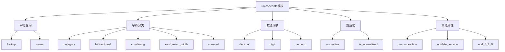
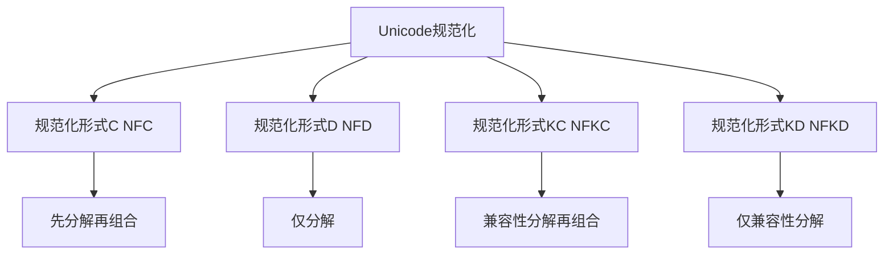

# Python标准库-unicodedata模块完全参考手册

## 概述

`unicodedata` 模块提供对Unicode字符数据库（UCD）的访问，该数据库定义了所有Unicode字符的字符属性。该模块使用Unicode标准附录#44中定义的相同名称和符号。

unicodedata模块的核心功能包括：
- Unicode字符属性查询
- 字符分类和转换
- Unicode字符串规范化
- 双向文本处理支持
- 字符分解和组合



## 模块常量

### unicodedata.unidata_version

模块使用的Unicode数据库版本：

```python
import unicodedata

print(f"Unicode数据库版本: {unicodedata.unidata_version}")
# Unicode数据库版本: 16.0.0
```

### unicodedata.ucd_3_2_0

提供Unicode数据库3.2版本的对象，用于需要特定版本的应用（如IDNA）：

```python
import unicodedata

# 使用当前版本的Unicode数据库
print(unicodedata.name('€'))  # EURO SIGN

# 使用3.2版本的Unicode数据库
print(unicodedata.ucd_3_2_0.name('€'))  # 可能返回不同的结果
```

## 字符查询函数

### 1. lookup(name)

根据字符名称查找字符：

```python
import unicodedata

# 基本使用
char = unicodedata.lookup('LEFT CURLY BRACKET')
print(char)  # {

# 查找特殊字符
char = unicodedata.lookup('MIDDLE DOT')
print(char)  # ·

# 查找表情符号
char = unicodedata.lookup('GRINNING FACE')
print(char)  # 😀

# 与字符串字面量比较
char1 = unicodedata.lookup('MIDDLE DOT')
char2 = '\N{MIDDLE DOT}'
print(char1 == char2)  # True

# 处理不存在的字符名称
try:
    char = unicodedata.lookup('NONEXISTENT CHARACTER')
except KeyError as e:
    print(f"错误: {e}")  # 错误: character not found
```

### 2. name(chr, default=None, /)

返回字符的名称：

```python
import unicodedata

# 基本使用
print(unicodedata.name('A'))  # LATIN CAPITAL LETTER A
print(unicodedata.name('½'))  # VULGAR FRACTION ONE HALF

# 处理中文字符
print(unicodedata.name('中'))  # CJK UNIFIED IDEOGRAPH-4E2D

# 使用默认值
print(unicodedata.name('\uFFFF', '未知字符'))  # 未知字符

# 处理未命名字符
try:
    print(unicodedata.name('\uFFFF'))
except ValueError as e:
    print(f"错误: {e}")  # 错误: no such name
```

## 字符分类函数

### 1. category(chr)

返回字符的通用类别：

```python
import unicodedata

# 大写字母
print(unicodedata.category('A'))  # Lu (Letter, uppercase)

# 小写字母
print(unicodedata.category('a'))  # Ll (Letter, lowercase)

# 数字
print(unicodedata.category('9'))  # Nd (Number, decimal digit)

# 标点符号
print(unicodedata.category('.'))  # Po (Punctuation, other)

# 空格
print(unicodedata.category(' '))  # Zs (Separator, space)

# 中文字符
print(unicodedata.category('中'))  # Lo (Letter, other)

# 表情符号
print(unicodedata.category('😀'))  # So (Symbol, other)
```

### 2. bidirectional(chr)

返回字符的双向类：

```python
import unicodedata

# 从左到右的字符
print(unicodedata.bidirectional('A'))  # L (Left-to-Right)

# 阿拉伯数字
print(unicodedata.bidirectional('٧'))  # AN (Arabic Number)

# 从右到左的字符
print(unicodedata.bidirectional('ع'))  # AL (Arabic Letter)

# 欧洲数字
print(unicodedata.bidirectional('5'))  # EN (European Number)

# 常见分隔符
print(unicodedata.bidirectional(' '))  # WS (White Space)
```

### 3. combining(chr)

返回字符的规范组合类：

```python
import unicodedata

# 非组合字符
print(unicodedata.combining('A'))  # 0

# 组合字符（重音符）
print(unicodedata.combining('́'))  # 230 (COMBINING ACUTE ACCENT)

# 组合字符（变音符号）
print(unicodedata.combining('̈'))  # 230 (COMBINING DIAERESIS)

# 检查是否为组合字符
def is_combining(char):
    return unicodedata.combining(char) > 0

print(is_combining('é'))  # True
print(is_combining('e'))  # False
```

### 4. east_asian_width(chr)

返回东亚字符的宽度属性：

```python
import unicodedata

# 窄字符
print(unicodedata.east_asian_width('A'))  # Na

# 全角字符
print(unicodedata.east_asian_width('Ａ'))  # F

# 中文字符
print(unicodedata.east_asian_width('中'))  # W

# 宽字符
print(unicodedata.east_asian_width('！'))  # F

# 中性字符
print(unicodedata.east_asian_width(' '))  # N
```

### 5. mirrored(chr)

返回字符的镜像属性：

```python
import unicodedata

# 镜像字符
print(unicodedata.mirrored('('))  # 1
print(unicodedata.mirrored(')'))  # 1
print(unicodedata.mirrored('<'))  # 1
print(unicodedata.mirrored('>'))  # 1

# 非镜像字符
print(unicodedata.mirrored('A'))  # 0
print(unicodedata.mirrored('1'))  # 0
```

## 数值转换函数

### 1. decimal(chr, default=None, /)

返回字符的十进制数值：

```python
import unicodedata

# 阿拉伯-印度数字
print(unicodedata.decimal('٩'))  # 9 (ARABIC-INDIC DIGIT NINE)

# 普通数字
print(unicodedata.decimal('5'))  # 5

# 使用默认值
print(unicodedata.decimal('½', -1))  # -1 (不是十进制数字)

# 处理非十进制数字
try:
    print(unicodedata.decimal('½'))
except ValueError as e:
    print(f"错误: {e}")  # 错误: not a decimal
```

### 2. digit(chr, default=None, /)

返回字符的数字值：

```python
import unicodedata

# 上标数字
print(unicodedata.digit('⁹'))  # 9 (SUPERSCRIPT NINE)

# 下标数字
print(unicodedata.digit('₀'))  # 0 (SUBSCRIPT ZERO)

# 普通数字
print(unicodedata.digit('5'))  # 5

# 使用默认值
print(unicodedata.digit('½', -1))  # -1 (不是数字字符)
```

### 3. numeric(chr, default=None, /)

返回字符的数值：

```python
import unicodedata

# 分数
print(unicodedata.numeric('½'))  # 0.5
print(unicodedata.numeric('¾'))  # 0.75

# 罗马数字
print(unicodedata.numeric('Ⅳ'))  # 4.0

# 普通数字
print(unicodedata.numeric('5'))  # 5.0

# 使用默认值
print(unicodedata.numeric('A', -1))  # -1 (不是数值字符)
```

## 规范化函数

### 1. normalize(form, unistr)

返回Unicode字符串的规范形式：

```python
import unicodedata

# NFC - 规范化形式C
text1 = 'café'  # 使用组合字符
text2 = 'cafe\u0301'  # 使用组合标记

nfc1 = unicodedata.normalize('NFC', text1)
nfc2 = unicodedata.normalize('NFC', text2)

print(nfc1 == nfc2)  # True
print(nfc1)  # café

# NFD - 规范化形式D（分解）
nfd1 = unicodedata.normalize('NFD', text1)
nfd2 = unicodedata.normalize('NFD', text2)

print(nfd1 == nfd2)  # True
print(nfd1)  # café (e + combining acute)

# NFKC - 规范化形式KC（兼容性规范化）
text = '①②③'
nfkc = unicodedata.normalize('NFKC', text)
print(nfkc)  # 123

# NFKD - 规范化形式KD（兼容性分解）
nfkd = unicodedata.normalize('NFKD', text)
print(nfkd)  # 123

# 处理全角字符
full_width = 'ＡＢＣ'
nfkc = unicodedata.normalize('NFKC', full_width)
print(nfkc)  # ABC
```

### 2. is_normalized(form, unistr)

检查字符串是否已规范化：

```python
import unicodedata

# 检查NFC规范化
text1 = 'café'  # 已规范化
text2 = 'cafe\u0301'  # 未规范化

print(unicodedata.is_normalized('NFC', text1))  # True
print(unicodedata.is_normalized('NFC', text2))  # False

# 检查NFD规范化
print(unicodedata.is_normalized('NFD', text1))  # False
print(unicodedata.is_normalized('NFD', text2))  # True

# 检查NFKC规范化
text = '①②③'
print(unicodedata.is_normalized('NFKC', text))  # False

normalized = unicodedata.normalize('NFKC', text)
print(unicodedata.is_normalized('NFKC', normalized))  # True
```

## 其他函数

### 1. decomposition(chr)

返回字符的分解映射：

```python
import unicodedata

# 分解带重音的字符
print(unicodedata.decomposition('Ã'))  # 0041 0303 (A + combining tilde)
print(unicodedata.decomposition('é'))  # 0065 0301 (e + combining acute)

# 分解兼容字符
print(unicodedata.decomposition('¹'))  # <sup> 0031 (superscript one)
print(unicodedata.decomposition('½'))  # <fraction> 0031 2044 0032

# 无分解映射
print(unicodedata.decomposition('A'))  # (空字符串)
```

## Unicode规范化详解

### 规范化形式对比



### 规范化形式说明

#### NFC (Normalization Form C)

- 先进行规范分解，再进行规范组合
- 适合大多数应用场景
- 产生最紧凑的表示形式

```python
import unicodedata

text = 'cafe\u0301'  # e + combining acute
nfc = unicodedata.normalize('NFC', text)
print(f"原始: {repr(text)}")
print(f"NFC: {repr(nfc)}")
# 原始: 'café'
# NFC: 'café'
```

#### NFD (Normalization Form D)

- 仅进行规范分解
- 将组合字符分解为基础字符和组合标记

```python
import unicodedata

text = 'café'  # 组合字符
nfd = unicodedata.normalize('NFD', text)
print(f"原始: {repr(text)}")
print(f"NFD: {repr(nfd)}")
# 原始: 'café'
# NFD: 'café'
```

#### NFKC (Normalization Form KC)

- 先进行兼容性分解，再进行规范组合
- 将兼容字符替换为规范字符
- 可能改变文本的语义

```python
import unicodedata

text = '①②③'  # 圆圈数字
nfkc = unicodedata.normalize('NFKC', text)
print(f"原始: {text}")
print(f"NFKC: {nfkc}")
# 原始: ①②③
# NFKC: 123
```

#### NFKD (Normalization Form KD)

- 仅进行兼容性分解
- 将兼容字符替换为规范字符

```python
import unicodedata

text = '½'  # 分数
nfkd = unicodedata.normalize('NFKD', text)
print(f"原始: {text}")
print(f"NFKD: {nfkd}")
# 原始: ½
# NFKD: 1⁄2
```

## 实战应用

### 1. 字符验证和清理

```python
import unicodedata

def clean_text(text, normalize_form='NFC'):
    """清理和规范化文本"""
    # 规范化文本
    normalized = unicodedata.normalize(normalize_form, text)

    # 移除不可打印字符
    cleaned = ''.join(char for char in normalized
                      if unicodedata.category(char)[0] != 'C')

    return cleaned

# 使用示例
text = "Hello\u200BWorld! café ①②③"
cleaned = clean_text(text)
print(cleaned)  # HelloWorld! café ①②③
```

### 2. 字符串比较（忽略规范化差异）

```python
import unicodedata

def normalize_compare(str1, str2, form='NFC'):
    """规范化后比较字符串"""
    norm1 = unicodedata.normalize(form, str1)
    norm2 = unicodedata.normalize(form, str2)
    return norm1 == norm2

# 使用示例
str1 = 'café'
str2 = 'cafe\u0301'

print(str1 == str2)  # False
print(normalize_compare(str1, str2))  # True
```

### 3. 移除变音符号

```python
import unicodedata

def remove_diacritics(text):
    """移除文本中的变音符号"""
    # 规范化为分解形式
    normalized = unicodedata.normalize('NFD', text)

    # 移除组合字符
    cleaned = ''.join(char for char in normalized
                      if unicodedata.category(char) != 'Mn')

    return cleaned

# 使用示例
text = "Café naïve résumé"
cleaned = remove_diacritics(text)
print(cleaned)  # Cafe naive resume
```

### 4. 检测文本语言

```python
import unicodedata

def detect_language(text):
    """简单检测文本语言"""
    latin_count = 0
    arabic_count = 0
    cjk_count = 0
    total = 0

    for char in text:
        if char.isalpha():
            total += 1
            category = unicodedata.category(char)

            if category.startswith('L'):
                # 拉丁字母
                if 'LATIN' in unicodedata.name(char, ''):
                    latin_count += 1
                # 阿拉伯字母
                elif 'ARABIC' in unicodedata.name(char, ''):
                    arabic_count += 1
                # 中日韩文字
                elif 'CJK' in unicodedata.name(char, ''):
                    cjk_count += 1

    if total == 0:
        return "Unknown"

    # 返回主要语言
    if latin_count / total > 0.5:
        return "Latin-based"
    elif arabic_count / total > 0.5:
        return "Arabic"
    elif cjk_count / total > 0.5:
        return "CJK"
    else:
        return "Mixed"

# 使用示例
print(detect_language("Hello World"))  # Latin-based
print(detect_language("مرحبا بالعالم"))  # Arabic
print(detect_language("你好世界"))  # CJK
```

### 5. 计算显示宽度

```python
import unicodedata

def get_display_width(text):
    """计算文本的显示宽度"""
    width = 0

    for char in text:
        east_asian_width = unicodedata.east_asian_width(char)

        if east_asian_width in ('F', 'W'):
            # 全角字符，宽度为2
            width += 2
        else:
            # 其他字符，宽度为1
            width += 1

    return width

# 使用示例
text1 = "Hello"
text2 = "你好"
text3 = "ＡＢＣ"

print(f"'{text1}' 宽度: {get_display_width(text1)}")  # 'Hello' 宽度: 5
print(f"'{text2}' 宽度: {get_display_width(text2)}")  # '你好' 宽度: 4
print(f"'{text3}' 宽度: {get_display_width(text3)}")  # 'ＡＢＣ' 宽度: 6
```

### 6. 转换全角/半角字符

```python
import unicodedata

def to_half_width(text):
    """转换为半角字符"""
    return unicodedata.normalize('NFKC', text)

def to_full_width(text):
    """转换为全角字符"""
    result = []
    for char in text:
        if char.isalnum():
            # 转换字母和数字为全角
            code_point = ord(char)
            if char.isdigit():
                # 数字
                result.append(chr(code_point + 0xFF10 - 0x30))
            elif char.isalpha():
                # 字母
                if char.isupper():
                    result.append(chr(code_point + 0xFF21 - 0x41))
                else:
                    result.append(chr(code_point + 0xFF41 - 0x61))
            else:
                result.append(char)
        else:
            result.append(char)

    return ''.join(result)

# 使用示例
full_width = "ＡＢＣ１２３"
half_width = to_half_width(full_width)
print(half_width)  # ABC123

normal = "ABC123"
full = to_full_width(normal)
print(full)  # ＡＢＣ１２３
```

### 7. 搜索和替换（忽略规范化）

```python
import unicodedata

def normalize_search(text, pattern, form='NFC'):
    """规范化后搜索"""
    normalized_text = unicodedata.normalize(form, text)
    normalized_pattern = unicodedata.normalize(form, pattern)
    return normalized_pattern in normalized_text

# 使用示例
text = "café restaurant"
pattern = "cafe"

print(pattern in text)  # False
print(normalize_search(text, pattern))  # True
```

### 8. Unicode字符信息查询器

```python
import unicodedata

def get_char_info(char):
    """获取字符的详细信息"""
    info = {
        '字符': char,
        'Unicode码位': f"U+{ord(char):04X}",
        '名称': unicodedata.name(char, '未知'),
        '类别': unicodedata.category(char),
        '双向类': unicodedata.bidirectional(char),
        '组合类': unicodedata.combining(char),
        '东亚宽度': unicodedata.east_asian_width(char),
        '镜像': unicodedata.mirrored(char),
        '分解': unicodedata.decomposition(char) or '无',
    }

    # 尝试获取数值信息
    try:
        info['十进制值'] = unicodedata.decimal(char)
    except ValueError:
        pass

    try:
        info['数字值'] = unicodedata.digit(char)
    except ValueError:
        pass

    try:
        info['数值'] = unicodedata.numeric(char)
    except ValueError:
        pass

    return info

# 使用示例
char = 'é'
info = get_char_info(char)

for key, value in info.items():
    print(f"{key}: {value}")

# 输出:
# 字符: é
# Unicode码位: U+00E9
# 名称: LATIN SMALL LETTER E WITH ACUTE
# 类别: Ll
# 双向类: L
# 组合类: 0
# 东亚宽度: Na
# 镜像: 0
# 分解: 0065 0301
```

## 性能优化

### 1. 缓存规范化结果

```python
import unicodedata
from functools import lru_cache

class Normalizer:
    """规范化器，带缓存"""

    def __init__(self, form='NFC'):
        self.form = form
        self._normalize = lru_cache(maxsize=1000)(unicodedata.normalize)

    def normalize(self, text):
        return self._normalize(self.form, text)

# 使用示例
normalizer = Normalizer('NFC')

text1 = "café"
text2 = "café"

print(normalizer.normalize(text1))
print(normalizer.normalize(text2))
```

### 2. 批量处理

```python
import unicodedata

def batch_normalize(texts, form='NFC'):
    """批量规范化文本"""
    return [unicodedata.normalize(form, text) for text in texts]

# 使用示例
texts = [
    "café",
    "naïve",
    "résumé"
]

normalized = batch_normalize(texts, 'NFC')
print(normalized)
```

## 最佳实践

### 1. 选择合适的规范化形式

```python
import unicodedata

# 对于大多数应用，使用NFC
text = "café"
normalized = unicodedata.normalize('NFC', text)

# 对于需要分解的应用，使用NFD
decomposed = unicodedata.normalize('NFD', text)

# 对于需要兼容性处理的搜索/索引，使用NFKC
search_text = "①②③"
compatible = unicodedata.normalize('NFKC', search_text)
```

### 2. 在输入时规范化

```python
import unicodedata

def process_input(user_input):
    """处理用户输入"""
    # 规范化输入
    normalized = unicodedata.normalize('NFC', user_input)

    # 清理输入
    cleaned = ''.join(char for char in normalized
                      if unicodedata.category(char)[0] != 'C')

    return cleaned

# 使用示例
user_input = "Hello\u200BWorld! café"
processed = process_input(user_input)
print(processed)  # HelloWorld! café
```

### 3. 在比较前规范化

```python
import unicodedata

def compare_strings(str1, str2, form='NFC'):
    """规范化后比较字符串"""
    norm1 = unicodedata.normalize(form, str1)
    norm2 = unicodedata.normalize(form, str2)
    return norm1 == norm2

# 使用示例
str1 = 'café'
str2 = 'cafe\u0301'

print(compare_strings(str1, str2))  # True
```

## 常见问题

### Q1: NFC和NFD有什么区别？

**A**: NFC（Normalization Form C）先分解再组合，产生最紧凑的表示形式。NFD（Normalization Form D）仅分解，将组合字符分解为基础字符和组合标记。

### Q2: 何时使用NFKC/NFKD？

**A**: 当需要进行兼容性处理时，如搜索、索引或比较时使用。注意这可能会改变文本的语义。

### Q3: 如何处理不可打印字符？

**A**: 可以通过检查字符的类别来过滤不可打印字符：

```python
import unicodedata

def remove_control_chars(text):
    return ''.join(char for char in text
                  if unicodedata.category(char)[0] != 'C')
```

`unicodedata` 模块是Python中处理Unicode字符的强大工具，提供了：

1. **字符属性查询**：查询字符的各种Unicode属性
2. **字符分类**：按类别对字符进行分类
3. **数值转换**：将数字字符转换为数值
4. **规范化处理**：将Unicode字符串转换为规范形式
5. **双向文本支持**：处理从右到左的语言

通过掌握 `unicodedata` 模块，您可以：
- 正确处理国际化文本
- 实现文本清理和验证
- 进行跨语言文本处理
- 计算文本显示宽度
- 实现高级文本搜索功能

`unicodedata` 模块是国际化应用的基础，掌握它对于处理多语言文本至关重要。无论是简单的文本处理还是复杂的国际化应用，`unicodedata` 都能提供强大而灵活的解决方案。