# 计算机常识全攻略：从底层原理到系统架构的深度解析

> **导读**：计算机是 20 世纪最伟大的发明之一，深刻改变了人类社会。但大多数人只会在表层使用计算机，对其内部运作一无所知。本文从计算机的本质出发，深入剖析硬件架构、数据表示、软件体系、操作系统等核心概念，揭示每一个技术选择背后的根本原因。

---

## 一、计算机的本质：什么是计算机

### 1.1 计算机的定义

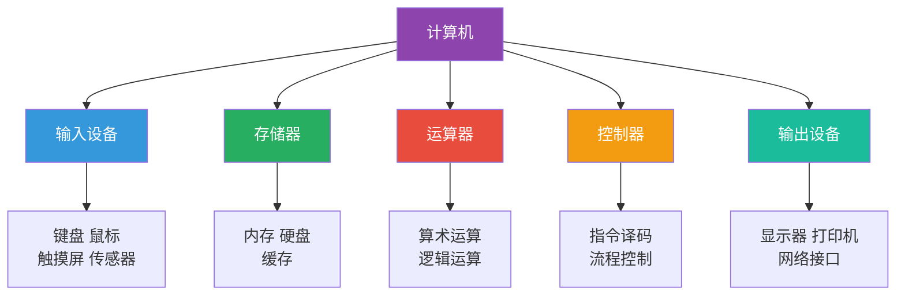

**本质定义**：
> 计算机是一种**可编程的电子设备**，能够接收、存储、处理和输出数据。

**核心特征**：
- ✅ **可编程性**：通过改变程序实现不同功能（与计算器本质区别）
- ✅ **存储程序**：程序和数据都存储在内存中（冯·诺依曼架构）
- ✅ **自动执行**：无需人工干预，按指令顺序执行
- ✅ **通用性**：理论上可以计算任何可计算的问题（图灵完备）

### 1.2 计算机的能力边界

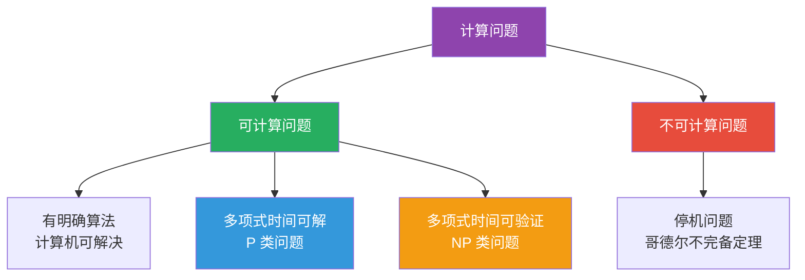

**重要认知**：
- 计算机**不是万能的**，存在理论上不可计算的问题
- 有些问题**理论上可计算**，但**实际上无法在合理时间内完成**
- 理解计算机的能力边界，才能合理使用计算机

### 1.3 计算机系统的层次结构

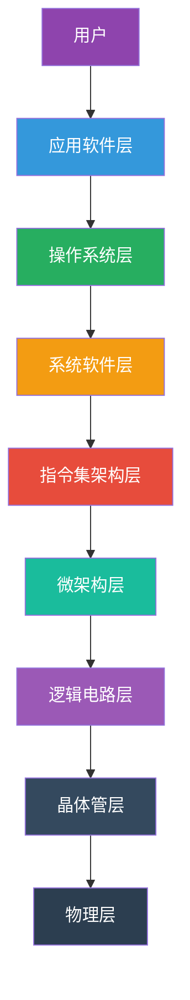

**层次抽象的意义**：
- 每一层都**隐藏下层的复杂性**
- 上层通过**接口**使用下层的服务
- 层次化设计使系统**可管理、可维护、可扩展**

---

## 二、计算机的历史演进：从算盘到量子计算机

### 2.1 计算机发展的四个时代

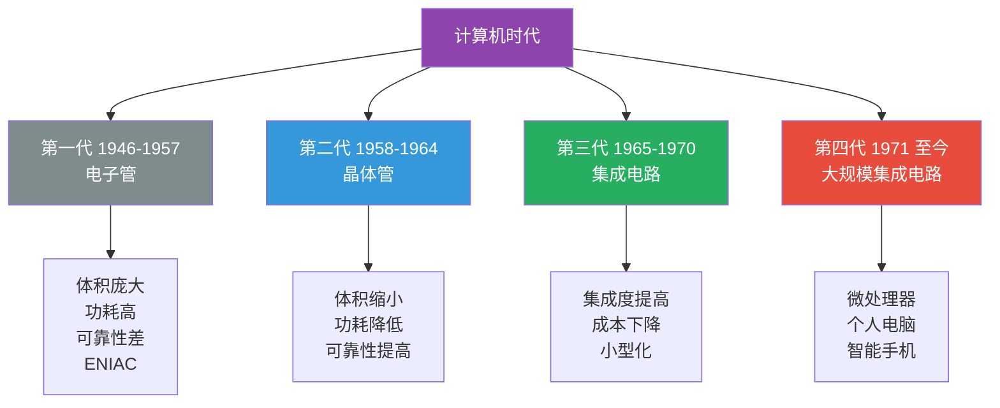

### 2.2 摩尔定律：计算机发展的引擎

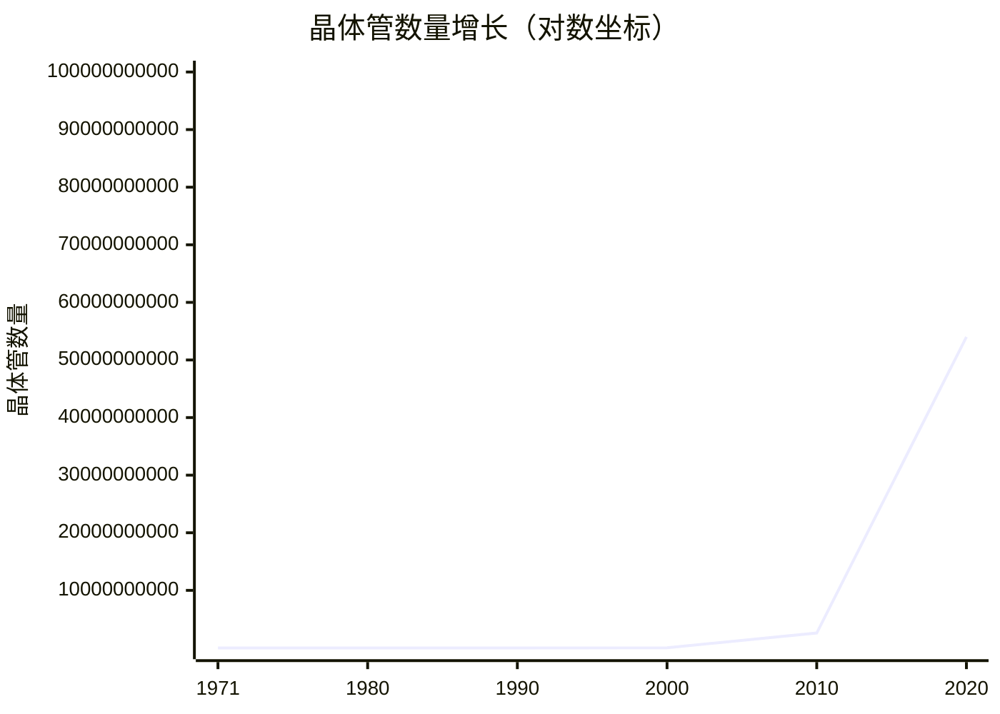

**摩尔定律内容**：
> 集成电路上可容纳的晶体管数量，约每隔 **18-24 个月** 便会增加一倍，性能也将提升一倍。

**根本原因**：
- 半导体工艺的持续进步
- 光刻技术的精度提升
- 经济效益驱动研发投入

**当前挑战**：
- 物理极限：晶体管尺寸接近原子级别
- 散热问题：功耗密度过高
- 经济极限：制造成本指数级增长

### 2.3 计算机发展史上的里程碑

| 年份 | 事件 | 意义 |
|------|------|------|
| 1833 | 巴贝奇设计分析机 | 通用计算机概念雏形 |
| 1936 | 图灵提出图灵机 | 计算理论基础 |
| 1945 | 冯·诺依曼架构 | 现代计算机架构基础 |
| 1947 | 晶体管发明 | 取代电子管 |
| 1958 | 集成电路发明 | 微型化开始 |
| 1971 | Intel 4004 微处理器 | 个人电脑时代开启 |
| 1975 | Altair 8800 | 第一台个人电脑 |
| 1981 | IBM PC | PC 标准化 |
| 1984 | Macintosh | 图形界面普及 |
| 2007 | iPhone | 移动互联网时代 |

---

## 三、硬件基础：从晶体管到 CPU

### 3.1 晶体管：计算机的基石

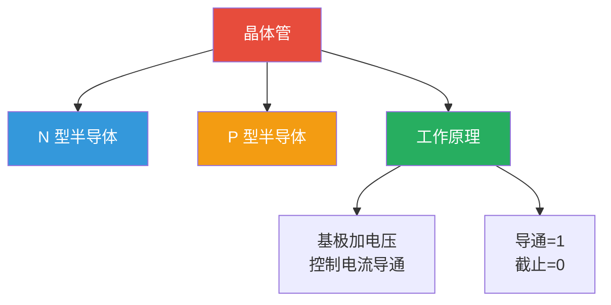

**为什么用晶体管**？

| 特性 | 电子管 | 晶体管 | 根本原因 |
|------|-------|-------|---------|
| 尺寸 | 厘米级 | 纳米级 | 半导体材料特性 |
| 功耗 | 瓦特级 | 毫瓦级 | 无需加热阴极 |
| 寿命 | 数千小时 | 数十亿小时 | 无机械磨损 |
| 开关速度 | 微秒级 | 纳秒级 | 电子迁移速度快 |
| 成本 | 高 | 低 | 可批量制造 |

**核心原理**：
- 晶体管本质是一个**电子开关**
- 通过电压控制**导通**（1）或**截止**（0）
- 数十亿晶体管组合实现复杂逻辑

### 3.2 逻辑门：从晶体管到计算

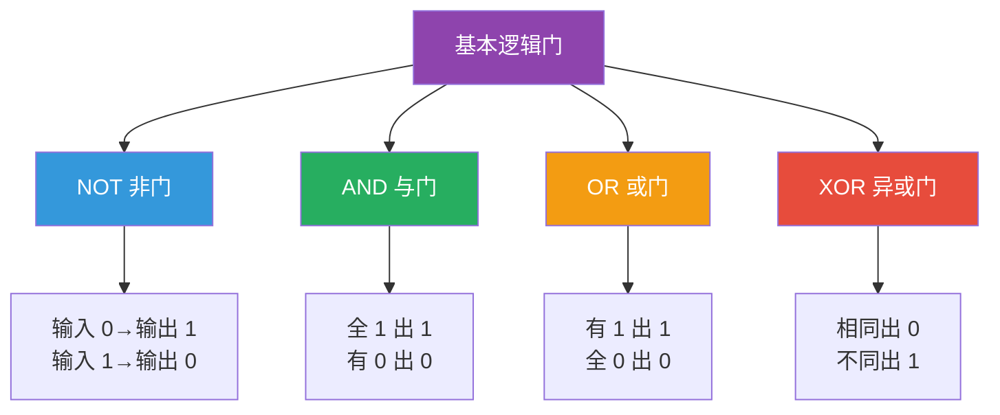

**逻辑门的晶体管实现**：

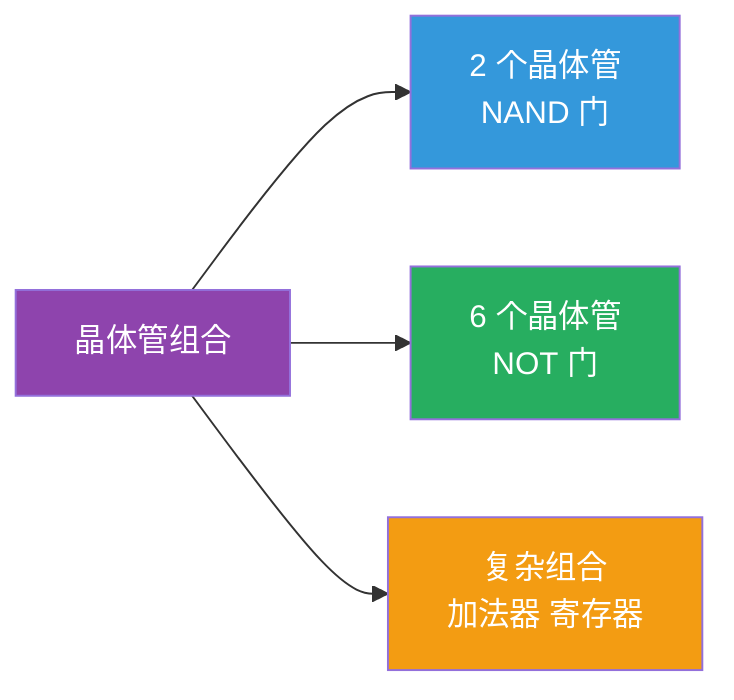

**关键认知**：
- **所有计算**都可以分解为逻辑门操作
- **逻辑门**由晶体管组合实现
- **复杂度**来自简单元件的组合

### 3.3 CPU 的内部结构

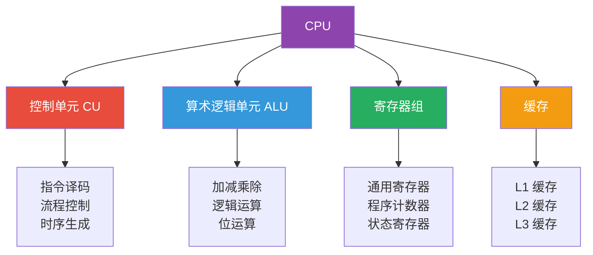

#### CPU 执行指令的过程

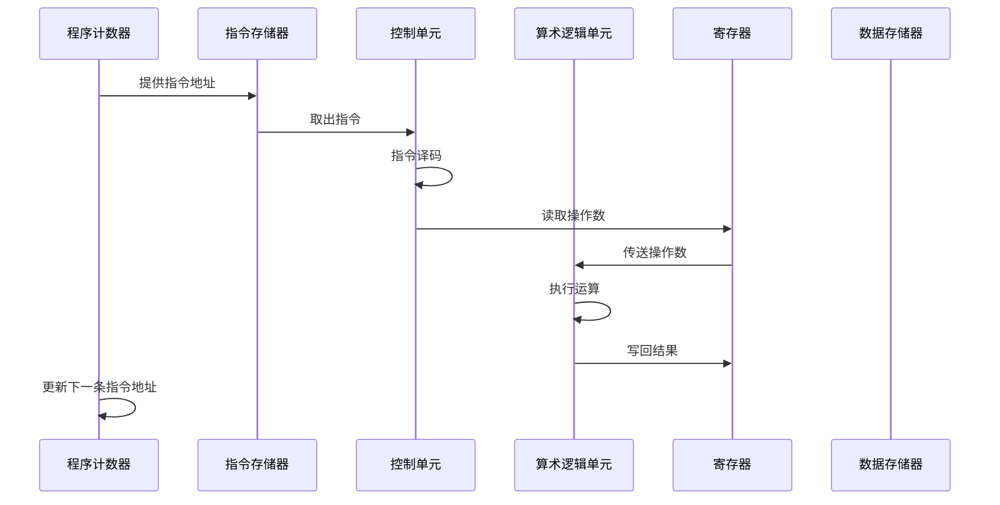

**指令周期的五个阶段**：
1. **取指**（IF）：从内存取指令
2. **译码**（ID）：解析指令含义
3. **执行**（EX）：执行运算操作
4. **访存**（MEM）：访问数据内存
5. **写回**（WB）：将结果写回寄存器

### 3.4 为什么 CPU 有这么多核心

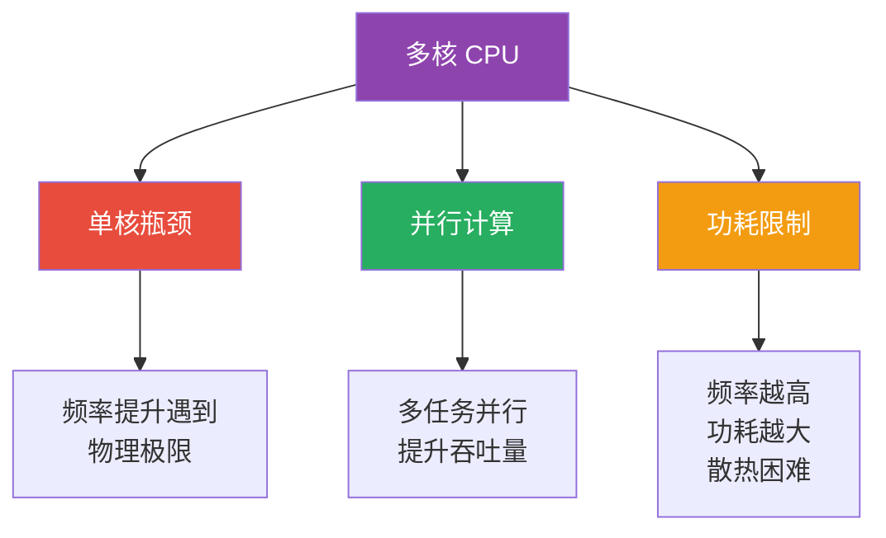

**根本原因分析**：

| 因素 | 说明 | 影响 |
|------|------|------|
| **频率墙** | 单核频率接近 5GHz 极限 | 无法继续提升频率 |
| **功耗墙** | 功耗与频率立方成正比 | 散热成为瓶颈 |
| **并行需求** | 多任务、多线程应用增多 | 需要并行处理能力 |
| **阿姆达尔定律** | 程序串行部分限制加速比 | 多核提升有限 |

**阿姆达尔定律**：
```
加速比 = 1 / (S + (1-S)/N)
```
其中：S = 串行部分比例，N = 核心数

**关键认知**：即使有无限多核心，加速比也受限于**串行部分比例**。

### 3.5 CPU 的指令集架构

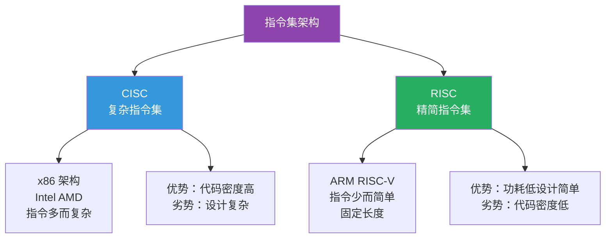

#### CISC vs RISC 对比

| 特性 | CISC(x86) | RISC(ARM/RISC-V) | 根本原因 |
|------|----------|-----------------|---------|
| 指令数量 | 多（上千条） | 少（几十条） | 设计理念不同 |
| 指令长度 | 可变长 | 固定长 | 译码复杂度 |
| 寻址方式 | 多 | 少 | 硬件复杂度 |
| 功耗 | 高 | 低 | 电路复杂度 |
| 应用场景 | 桌面/服务器 | 移动/嵌入式 | 功耗敏感性 |

**趋势**：
- x86 内部也将复杂指令**微操作化**为简单指令
- RISC 和 CISC 的**界限逐渐模糊**
- **RISC-V** 作为开源指令集崛起

---

## 四、数据表示：为什么是二进制

### 4.1 为什么计算机使用二进制

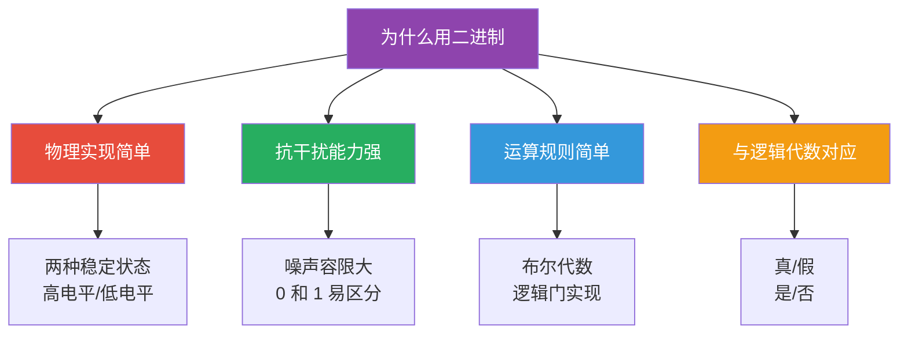

**根本原因**：
- **物理层面**：晶体管只有导通/截止两种稳定状态
- **工程层面**：二值系统抗干扰能力最强
- **数学层面**：布尔代数完美对应二进制运算

**对比其他进制**：

| 进制 | 状态数 | 噪声容限 | 实现难度 | 信息密度 |
|------|-------|---------|---------|---------|
| 二进制 | 2 | 50% | 最低 | 最低 |
| 三进制 | 3 | 33% | 中等 | 中等 |
| 十进制 | 10 | 10% | 最高 | 最高 |

**关键认知**：二进制不是最优的**信息密度**选择，但是最优的**可靠性**选择。

### 4.2 数值的二进制表示

#### 整数的表示

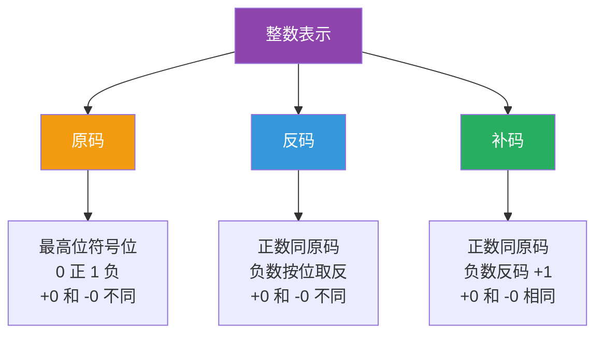

**为什么用补码**？

| 特性 | 原码 | 反码 | 补码 | 根本原因 |
|------|------|------|------|---------|
| 0 的表示 | +0, -0 | +0, -0 | 唯一 | 避免歧义 |
| 加减运算 | 需要判断符号 | 需要循环进位 | 统一处理 | 简化硬件 |
| 符号扩展 | 复杂 | 复杂 | 简单 | 硬件友好 |

**补码的数学原理**：
```
补码 = 模 - |负数|
8 位补码的模 = 256
-1 的补码 = 256 - 1 = 255 = 11111111
```

#### 浮点数的表示（IEEE 754）

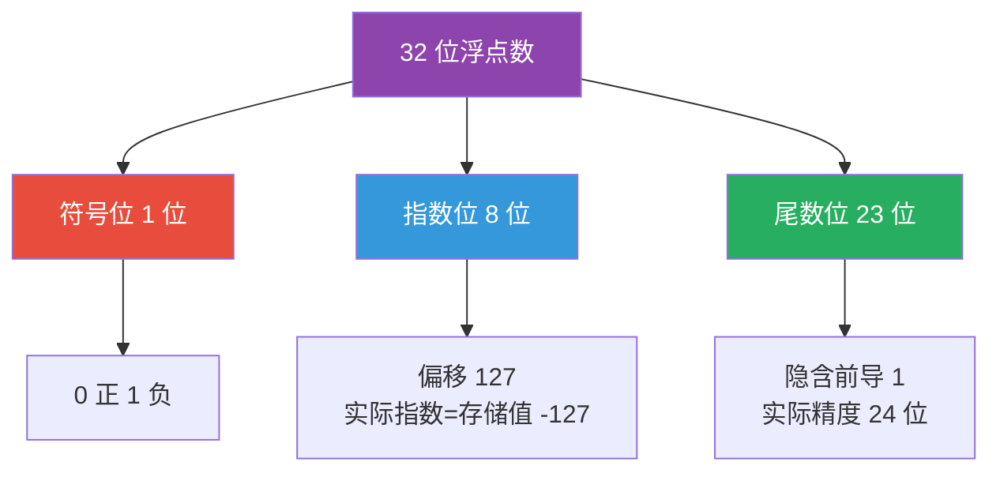

**浮点数公式**：
```
值 = (-1)^符号 × 1.尾数 × 2^(指数 -127)
```

**为什么浮点数有精度问题**？

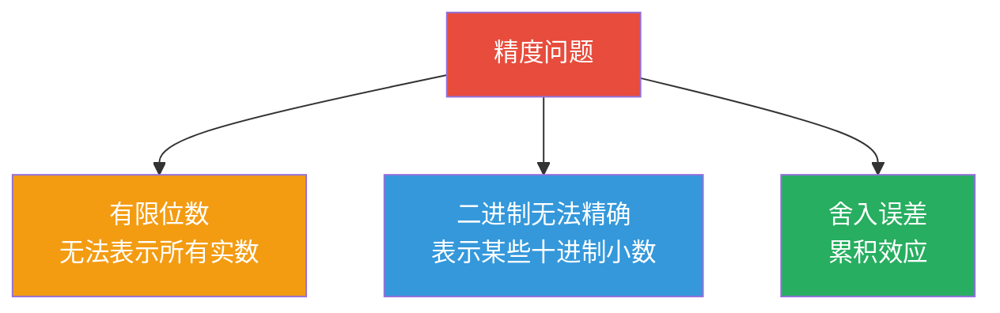

**经典案例**：
```
0.1 + 0.2 ≠ 0.3  （在计算机中）
原因：0.1 和 0.2 在二进制中是无限循环小数
```

### 4.3 字符的编码表示

#### 编码演进历史

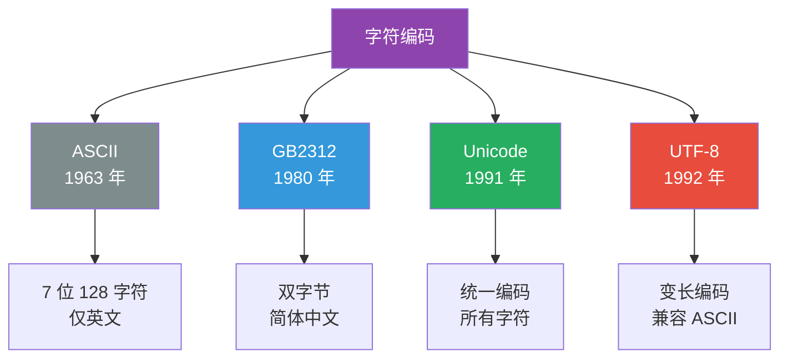

#### UTF-8 编码规则

| 字符范围 | UTF-8 编码格式 | 字节数 |
|---------|--------------|-------|
| U+0000 - U+007F | 0xxxxxxx | 1 |
| U+0080 - U+07FF | 110xxxxx 10xxxxxx | 2 |
| U+0800 - U+FFFF | 1110xxxx 10xxxxxx 10xxxxxx | 3 |
| U+10000 - U+10FFFF | 11110xxx 10xxxxxx 10xxxxxx 10xxxxxx | 4 |

**为什么 UTF-8 成为主流**？

| 特性 | UTF-8 | UTF-16 | 根本原因 |
|------|-------|--------|---------|
| ASCII 兼容 | 是 | 否 | 存量系统多 |
| 空间效率（英文） | 高（1 字节） | 低（2 字节） | 英文内容多 |
| 空间效率（中文） | 中（3 字节） | 高（2 字节） | - |
| 无字节序问题 | 是 | 否 | 网络传输友好 |

### 4.4 多媒体数据的表示

#### 图像的数字化

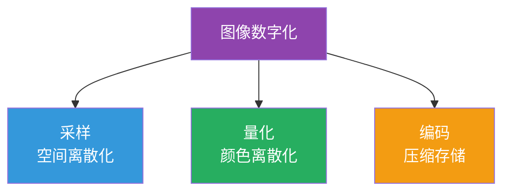

**像素与分辨率**：
- **像素**：图像的最小单位
- **分辨率**：像素数量（如 1920×1080）
- **颜色深度**：每像素位数（如 24 位真彩色）

**为什么需要压缩**？

| 格式 | 未压缩大小 | 压缩后大小 | 压缩比 |
|------|-----------|-----------|-------|
| 1080P 图片 | 6MB | 500KB | 12:1 |
| 1 分钟 1080P 视频 | 2GB | 100MB | 20:1 |
| 1 分钟无损音频 | 10MB | 1MB | 10:1 |

**根本原因**：原始数据量太大，存储和传输成本高。

---

## 五、指令系统：计算机如何执行命令

### 5.1 什么是指令

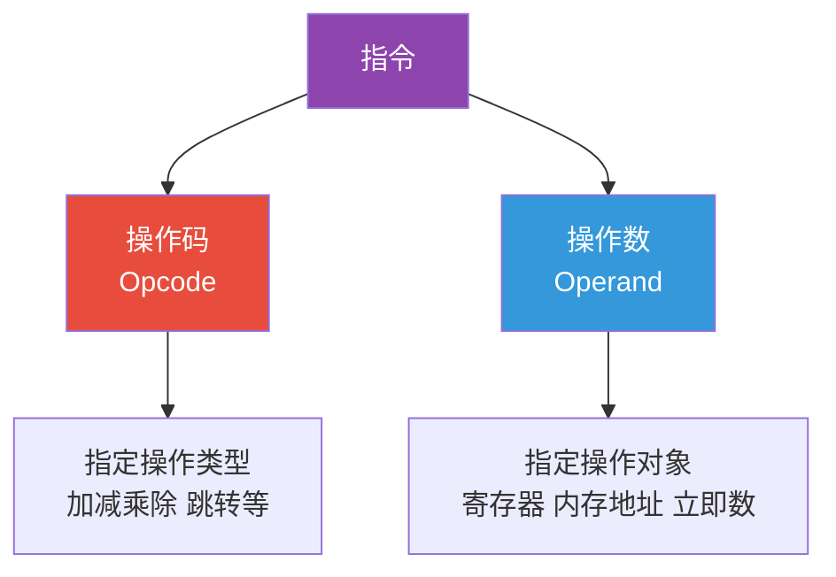

**指令示例**：
```
ADD R1, R2, R3    ; R1 = R2 + R3
LOAD R1, [0x1000] ; R1 = 内存 [0x1000] 的值
JMP 0x2000        ; 跳转到地址 0x2000
```

### 5.2 指令的执行流程

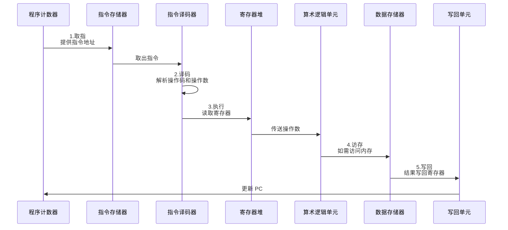

### 5.3 流水线技术：为什么 CPU 这么快

```mermaid
graph TD
    A[流水线技术] --> B[非流水线<br/>顺序执行]
    A --> C[流水线<br/>并行执行]
    
    B --> B1[指令 1:IF-ID-EX-MEM-WB<br/>指令 2:等待指令 1 完成<br/>效率低]
    C --> C1[指令 1:IF-ID-EX-MEM-WB<br/>指令 2: -IF-ID-EX-MEM-WB<br/>指令 3: - -IF-ID-EX-MEM-WB<br/>效率高]
    
    style A fill:#8e44ad,color:#fff
    style B fill:#e74c3c,color:#fff
    style C fill:#27ae60,color:#fff
```

**流水线时序对比**：

```mermaid
xychart-beta
    title "指令执行时间对比（时钟周期）"
    x-axis [1, 2, 3, 4, 5, 6, 7]
    y-axis "完成指令数" 0 --> 7
    line "非流水线" [1, 1, 1, 1, 1, 2, 2]
    line "5 级流水线" [1, 2, 3, 4, 5, 6, 7]
```

**理想加速比** = 流水线级数

**流水线的问题**：

| 问题 | 原因 | 解决方案 |
|------|------|---------|
| 结构冒险 | 资源冲突 | 增加硬件资源 |
| 数据冒险 | 数据依赖 | 转发技术、暂停 |
| 控制冒险 | 分支跳转 | 分支预测 |

### 5.4 分支预测：为什么需要猜

```mermaid
graph TD
    A[分支预测] --> B[问题]
    A --> C[影响]
    A --> D[技术]
    
    B --> B1[遇到条件分支<br/>不知道走哪条路]
    C --> C1[等待条件计算<br/>流水线停顿<br/>性能下降]
    D --> D1[静态预测<br/>动态预测<br/>神经网络预测]
    
    style A fill:#8e44ad,color:#fff
    style B fill:#e74c3c,color:#fff
    style C fill:#f39c12,color:#fff
    style D fill:#27ae60,color:#fff
```

**根本原因**：
- 现代 CPU 流水线很长（10-20 级）
- 分支指令很常见（约 20% 指令）
- 等待分支结果会导致流水线**清空**，损失巨大

**预测准确率**：
- 静态预测：约 60-70%
- 动态预测：约 90-95%
- 现代 CPU（如 Intel）：约 98%

**预测失败的代价**：
```
损失周期数 = 流水线级数 × 预测失败率 × 分支频率
= 15 × 2% × 20% ≈ 0.06 周期/指令
```

---

## 六、软件体系：从机器码到高级语言

### 6.1 编程语言的层次

```mermaid
graph TD
    A[编程语言层次] --> B[机器语言<br/>0 和 1]
    A --> C[汇编语言<br/>助记符]
    A --> D[高级语言<br/>接近自然语言]
    
    B --> B1[CPU 直接执行<br/>难读难写难维护]
    C --> C1[需要汇编器<br/>与硬件对应<br/>效率高]
    D --> D1[需要编译器<br/>抽象程度高<br/>开发效率高]
    
    style A fill:#8e44ad,color:#fff
    style B fill:#2c3e50,color:#fff
    style C fill:#34495e,color:#fff
    style D fill:#27ae60,color:#fff
```

### 6.2 编译与解释：两种执行方式

```mermaid
graph TD
    A[程序执行方式] --> B[编译型]
    A --> C[解释型]
    A --> D[混合型]
    
    B --> B1[C C++ Go<br/>源代码→机器码<br/>执行快 编译慢]
    C --> C1[Python JavaScript<br/>源代码→逐行解释<br/>执行慢 开发快]
    D --> D1[Java C#<br/>源代码→字节码→JIT 编译<br/>平衡]
    
    style A fill:#8e44ad,color:#fff
    style B fill:#3498db,color:#fff
    style C fill:#e74c3c,color:#fff
    style D fill:#27ae60,color:#fff
```

#### 编译过程详解

```mermaid
graph TD
    A[源代码] --> B[词法分析]
    B --> C[语法分析]
    C --> D[语义分析]
    D --> E[中间代码生成]
    E --> F[代码优化]
    F --> G[目标代码生成]
    
    style A fill:#3498db,color:#fff
    style B fill:#9b59b6
    style C fill:#9b59b6
    style D fill:#9b59b6
    style E fill:#27ae60,color:#fff
    style F fill:#27ae60,color:#fff
    style G fill:#e74c3c,color:#fff
```

**各阶段任务**：

| 阶段 | 输入 | 输出 | 任务 |
|------|------|------|------|
| 词法分析 | 源代码字符流 | 词法单元流 | 识别关键字、标识符、运算符 |
| 语法分析 | 词法单元流 | 语法树 | 检查语法正确性 |
| 语义分析 | 语法树 | 标注语法树 | 类型检查、作用域分析 |
| 中间代码生成 | 标注语法树 | 中间表示 | 生成与机器无关的代码 |
| 代码优化 | 中间表示 | 优化的中间表示 | 提高执行效率 |
| 目标代码生成 | 优化的中间表示 | 机器码 | 生成特定平台的代码 |

### 6.3 为什么有这么多编程语言

```mermaid
graph TD
    A[编程语言多样性] --> B[应用场景不同]
    A --> C[设计理念不同]
    A --> D[历史演进]
    A --> E[权衡取舍]
    
    B --> B1[系统编程<br/>Web 开发<br/>数据科学<br/>嵌入式]
    C --> C1[性能优先<br/>开发效率优先<br/>安全性优先]
    D --> D1[新技术出现<br/>旧语言局限]
    E --> E1[性能 vs 安全<br/>灵活 vs 严格<br/>简洁 vs 功能]
    
    style A fill:#8e44ad,color:#fff
    style B fill:#3498db,color:#fff
    style C fill:#27ae60,color:#fff
    style D fill:#f39c12,color:#fff
    style E fill:#e74c3c,color:#fff
```

#### 主流语言对比

| 语言 | 类型系统 | 内存管理 | 主要应用 | 特点 |
|------|---------|---------|---------|------|
| C | 静态 | 手动 | 系统编程 | 高效、灵活、危险 |
| Java | 静态 | 自动 (GC) | 企业应用 | 安全、跨平台、冗长 |
| Python | 动态 | 自动 (GC) | 数据科学 | 简洁、慢、生态好 |
| JavaScript | 动态 | 自动 (GC) | Web 前端 | 无处不在、灵活 |
| Rust | 静态 | 所有权 | 系统编程 | 安全、高效、学习曲线陡 |
| Go | 静态 | 自动 (GC) | 后端服务 | 简洁、并发好、功能少 |

### 6.4 数据结构：如何组织数据

```mermaid
graph TD
    A[数据结构] --> B[线性结构]
    A --> C[树形结构]
    A --> D[图结构]
    A --> E[哈希结构]
    
    B --> B1[数组 链表<br/>栈 队列]
    C --> C1[二叉树<br/>堆 平衡树]
    D --> D1[有向图<br/>无向图]
    E --> E1[哈希表<br/>布隆过滤器]
    
    style A fill:#8e44ad,color:#fff
    style B fill:#3498db,color:#fff
    style C fill:#27ae60,color:#fff
    style D fill:#f39c12,color:#fff
    style E fill:#e74c3c,color:#fff
```

#### 常见数据结构复杂度对比

| 数据结构 | 查找 | 插入 | 删除 | 适用场景 |
|---------|------|------|------|---------|
| 数组 | O(n) | O(n) | O(n) | 随机访问多 |
| 链表 | O(n) | O(1) | O(1) | 频繁插入删除 |
| 二叉搜索树 | O(logn) | O(logn) | O(logn) | 有序数据 |
| 哈希表 | O(1) | O(1) | O(1) | 快速查找 |
| 堆 | O(n) | O(logn) | O(logn) | 优先级队列 |

**根本认知**：没有最好的数据结构，只有**最适合**的数据结构。

### 6.5 算法：解决问题的方法

```mermaid
graph TD
    A[算法分类] --> B[排序算法]
    A --> C[搜索算法]
    A --> D[图算法]
    A --> E[动态规划]
    A --> F[贪心算法]
    
    B --> B1[快速排序<br/>归并排序<br/>堆排序]
    C --> C1[二分查找<br/>DFS BFS]
    D --> D1[最短路径<br/>最小生成树]
    E --> E1[最优子结构<br/>重叠子问题]
    F --> F1[局部最优<br/>全局最优]
    
    style A fill:#8e44ad,color:#fff
    style B fill:#3498db,color:#fff
    style C fill:#27ae60,color:#fff
    style D fill:#f39c12,color:#fff
    style E fill:#e74c3c,color:#fff
    style F fill:#1abc9c,color:#fff
```

#### 算法复杂度等级

```mermaid
graph LR
    A[O(1)<br/>常数时间] --> B[O(logn)<br/>对数时间]
    B --> C[O(n)<br/>线性时间]
    C --> D[O(nlogn)<br/>线性对数]
    D --> E[O(n²)<br/>平方时间]
    E --> F[O(2ⁿ)<br/>指数时间]
    
    style A fill:#27ae60,color:#fff
    style B fill:#2ecc71,color:#fff
    style C fill:#f39c12,color:#fff
    style D fill:#e67e22,color:#fff
    style E fill:#e74c3c,color:#fff
    style F fill:#c0392b,color:#fff
```

**关键认知**：
- 算法复杂度决定**可扩展性**
- O(n²) 和 O(nlogn) 在大数据量下差距巨大
- 选择正确算法比优化代码更重要

---

## 七、操作系统：计算机的管家

### 7.1 为什么需要操作系统

```mermaid
graph TD
    A[为什么需要 OS] --> B[硬件抽象]
    A --> C[资源管理]
    A --> D[用户接口]
    A --> E[安全隔离]
    
    B --> B1[隐藏硬件细节<br/>提供统一接口]
    C --> C1[CPU 调度<br/>内存分配<br/>设备管理]
    D --> D1[命令行<br/>图形界面<br/>系统调用]
    E --> E1[进程隔离<br/>权限控制<br/>访问保护]
    
    style A fill:#8e44ad,color:#fff
    style B fill:#3498db,color:#fff
    style C fill:#27ae60,color:#fff
    style D fill:#f39c12,color:#fff
    style E fill:#e74c3c,color:#fff
```

**根本原因**：
- 硬件太复杂，程序员无法直接操作
- 多个程序需要**共享资源**
- 需要**保护**程序之间不互相干扰
- 需要提供**统一接口**，降低开发难度

### 7.2 操作系统的核心功能

```mermaid
graph TD
    A[操作系统] --> B[进程管理]
    A --> C[内存管理]
    A --> D[文件系统]
    A --> E[设备管理]
    A --> F[网络管理]
    
    B --> B1[进程调度<br/>进程通信<br/>同步互斥]
    C --> C1[虚拟内存<br/>分页分段<br/>内存保护]
    D --> D1[文件存储<br/>目录管理<br/>权限控制]
    E --> E1[驱动程序<br/>中断处理<br/>DMA]
    F --> F1[协议栈<br/>套接字<br/>网络配置]
    
    style A fill:#8e44ad,color:#fff
    style B fill:#e74c3c,color:#fff
    style C fill:#3498db,color:#fff
    style D fill:#27ae60,color:#fff
    style E fill:#f39c12,color:#fff
    style F fill:#1abc9c,color:#fff
```

### 7.3 进程与线程：并发的基础

```mermaid
graph TD
    A[进程 vs 线程] --> B[进程]
    A --> C[线程]
    
    B --> B1[资源分配单位<br/>独立地址空间<br/>切换开销大]
    C --> C1[CPU 调度单位<br/>共享进程资源<br/>切换开销小]
    
    style A fill:#8e44ad,color:#fff
    style B fill:#3498db,color:#fff
    style C fill:#27ae60,color:#fff
```

#### 进程状态转换

```mermaid
stateDiagram-v2
    [*] --> 新建
    新建 --> 就绪
    就绪 --> 运行
    运行 --> 就绪
    运行 --> 阻塞
    阻塞 --> 就绪
    运行 --> 终止
    终止 --> [*]
```

**状态说明**：
- **新建**：进程刚创建
- **就绪**：等待 CPU 时间片
- **运行**：正在 CPU 上执行
- **阻塞**：等待 I/O 或其他事件
- **终止**：进程结束

### 7.4 进程调度：CPU 时间如何分配

```mermaid
graph TD
    A[调度算法] --> B[先来先服务<br/>FCFS]
    A --> C[短作业优先<br/>SJF]
    A --> D[时间片轮转<br/>RR]
    A --> E[优先级调度]
    A --> F[多级反馈队列]
    
    B --> B1[简单<br/>但短作业等待久]
    C --> C1[平均等待时间最短<br/>但长作业可能饿死]
    D --> D1[公平<br/>响应时间短<br/>现代 OS 采用]
    E --> E1[重要任务优先<br/>但低优先级可能饿死]
    F --> F1[综合方案<br/>最常用]
    
    style A fill:#8e44ad,color:#fff
    style B fill:#7f8c8d,color:#fff
    style C fill:#3498db,color:#fff
    style D fill:#27ae60,color:#fff
    style E fill:#f39c12,color:#fff
    style F fill:#e74c3c,color:#fff
```

### 7.5 虚拟内存：为什么内存不够用

```mermaid
graph TD
    A[虚拟内存] --> B[问题]
    A --> C[解决方案]
    A --> D[效果]
    
    B --> B1[物理内存有限<br/>程序需求增长]
    C --> C1[磁盘作为扩展<br/>按需加载<br/>页面置换]
    D --> D1[程序可用内存<br/>大于物理内存<br/>隔离保护]
    
    style A fill:#8e44ad,color:#fff
    style B fill:#e74c3c,color:#fff
    style C fill:#3498db,color:#fff
    style D fill:#27ae60,color:#fff
```

**虚拟内存原理**：

```mermaid
graph LR
    A[虚拟地址] --> B[MMU<br/>内存管理单元]
    B --> C{页表查找}
    C -->|命中 | D[物理地址]
    C -->|缺页 | E[磁盘读取]
    E --> F[加载到内存]
    F --> D
    
    style A fill:#3498db,color:#fff
    style B fill:#9b59b6,color:#fff
    style C fill:#f39c12,color:#fff
    style D fill:#27ae60,color:#fff
    style E fill:#e74c3c,color:#fff
    style F fill:#1abc9c,color:#fff
```

**关键概念**：
- **页**：虚拟内存的基本单位（通常 4KB）
- **页表**：虚拟地址到物理地址的映射表
- **缺页中断**：访问的页不在内存时触发
- **页面置换**：内存满时选择页面换出到磁盘

**为什么虚拟内存会慢**？
- 磁盘访问速度比内存慢 **10 万倍**
- 频繁缺页会导致**抖动**，系统几乎无法工作

### 7.6 文件系统：数据如何存储

```mermaid
graph TD
    A[文件系统] --> B[FAT32]
    A --> C[NTFS]
    A --> D[ext4]
    A --> E[APFS]
    
    B --> B1[简单<br/>兼容性好<br/>不支持大文件]
    C --> C1[功能丰富<br/>日志<br/>权限控制<br/>Windows 默认]
    D --> D1[Linux 默认<br/>稳定<br/>性能好]
    E --> E1[macOS 默认<br/>针对 SSD 优化<br/>快照]
    
    style A fill:#8e44ad,color:#fff
    style B fill:#7f8c8d,color:#fff
    style C fill:#3498db,color:#fff
    style D fill:#27ae60,color:#fff
    style E fill:#f39c12,color:#fff
```

#### 文件存储原理

```mermaid
graph TD
    A[文件] --> B[文件控制块<br/>FCB]
    B --> C[元数据<br/>文件名 大小 权限]
    B --> D[数据块指针]
    D --> E[数据块 1]
    D --> F[数据块 2]
    D --> G[数据块 N]
    
    style A fill:#8e44ad,color:#fff
    style B fill:#3498db,color:#fff
    style C fill:#27ae60,color:#fff
    style D fill:#f39c12,color:#fff
    style E fill:#1abc9c,color:#fff
    style F fill:#1abc9c,color:#fff
    style G fill:#1abc9c,color:#fff
```

---

## 八、存储体系：为什么需要多级存储

### 8.1 存储器的层次结构

```mermaid
graph TD
    A[存储层次] --> B[寄存器<br/>CPU 内部]
    A --> C[高速缓存<br/>L1/L2/L3]
    A --> D[主内存<br/>DRAM]
    A --> E[辅助存储<br/>SSD/HDD]
    A --> F[离线存储<br/>磁带 光盘]
    
    style A fill:#8e44ad,color:#fff
    style B fill:#e74c3c,color:#fff
    style C fill:#f39c12,color:#fff
    style D fill:#3498db,color:#fff
    style E fill:#27ae60,color:#fff
    style F fill:#7f8c8d,color:#fff
```

#### 各层存储器对比

| 层级 | 容量 | 速度 | 成本 | 易失性 |
|------|------|------|------|-------|
| 寄存器 | KB 级 | 最快 | 最高 | 易失 |
| L1 缓存 | KB 级 | 很快 | 很高 | 易失 |
| L2 缓存 | MB 级 | 快 | 高 | 易失 |
| L3 缓存 | MB 级 | 较快 | 较高 | 易失 |
| 主内存 | GB 级 | 中等 | 中等 | 易失 |
| SSD | TB 级 | 较慢 | 较低 | 非易失 |
| HDD | TB 级 | 慢 | 低 | 非易失 |

### 8.2 为什么需要缓存

```mermaid
graph TD
    A[为什么需要缓存] --> B[CPU 与内存<br/>速度差距大]
    A --> C[局部性原理]
    A --> D[成本考虑]
    
    B --> B1[CPU 速度每年提升<br/>内存速度提升慢<br/>差距达 100 倍]
    C --> C1[时间局部性<br/>刚访问的数据<br/>很可能再次访问]
    C --> C2[空间局部性<br/>相邻的数据<br/>很可能被访问]
    D --> D1[高速存储器贵<br/>全用高速内存<br/>成本太高]
    
    style A fill:#8e44ad,color:#fff
    style B fill:#e74c3c,color:#fff
    style C fill:#3498db,color:#fff
    style D fill:#27ae60,color:#fff
```

**速度差距可视化**：

```mermaid
xychart-beta
    title "存储器访问延迟对比（时钟周期，对数坐标）"
    x-axis [L1 缓存，L2 缓存，L3 缓存，主内存，SSD, HDD]
    y-axis "延迟（周期）" 1 --> 10000000
    bar [1, 4, 12, 100, 100000, 10000000]
```

**关键认知**：
- L1 缓存访问约 **1 个周期**
- 主内存访问约 **100 个周期**
- 硬盘访问约 **1000 万周期**
- 缓存命中率决定系统性能

### 8.3 缓存的工作原理

```mermaid
graph TD
    A[CPU 请求数据] --> B{缓存命中？}
    B -->|是 | C[直接返回<br/>1-4 周期]
    B -->|否 | D[从内存加载<br/>100+ 周期]
    D --> E[存入缓存]
    E --> F[返回给 CPU]
    F --> G[替换旧数据<br/>LRU 算法]
    
    style A fill:#3498db,color:#fff
    style B fill:#f39c12,color:#fff
    style C fill:#27ae60,color:#fff
    style D fill:#e74c3c,color:#fff
    style E fill:#1abc9c,color:#fff
    style F fill:#2ecc71,color:#fff
    style G fill:#9b59b6,color:#fff
```

**缓存映射方式**：

| 方式 | 特点 | 优点 | 缺点 |
|------|------|------|------|
| 直接映射 | 每块内存只有一个缓存位置 | 简单快速 | 冲突多 |
| 全相联 | 每块内存可放任何位置 | 冲突少 | 复杂慢速 |
| 组相联 | 折中方案 | 平衡 | 现代 CPU 采用 |

### 8.4 SSD vs HDD：存储技术的演进

```mermaid
graph TD
    A[存储技术] --> B[HDD<br/>机械硬盘]
    A --> C[SSD<br/>固态硬盘]
    A --> D[NVMe<br/>新一代 SSD]
    
    B --> B1[磁头读写<br/>机械运动<br/>速度慢<br/>便宜]
    C --> C1[闪存芯片<br/>电子存储<br/>速度快<br/>较贵]
    D --> D1[PCIe 接口<br/>直连 CPU<br/>极快<br/>最贵]
    
    style A fill:#8e44ad,color:#fff
    style B fill:#7f8c8d,color:#fff
    style C fill:#3498db,color:#fff
    style D fill:#27ae60,color:#fff
```

#### 性能对比

| 指标 | HDD | SATA SSD | NVMe SSD |
|------|-----|----------|----------|
| 顺序读取 | 150 MB/s | 550 MB/s | 7000 MB/s |
| 随机读取 | 1 MB/s | 50 MB/s | 500 MB/s |
| 延迟 | 10ms | 0.1ms | 0.02ms |
| 价格/TB | 150 元 | 400 元 | 600 元 |

**为什么 SSD 快这么多**？
- HDD 需要**机械运动**（磁头寻道）
- SSD 是**电子存储**，无机械延迟
- NVMe 使用**PCIe 通道**，带宽更大

---

## 九、计算机网络：计算机如何通信

### 9.1 为什么需要网络分层

```mermaid
graph TD
    A[网络分层] --> B[问题分解]
    A --> C[职责分离]
    A --> D[独立演进]
    A --> E[标准化]
    
    B --> B1[复杂问题<br/>分解为简单问题]
    C --> C1[每层专注<br/>特定功能]
    D --> D1[某层变化<br/>不影响其他层]
    E --> E1[不同厂商<br/>可互操作]
    
    style A fill:#8e44ad,color:#fff
    style B fill:#3498db,color:#fff
    style C fill:#27ae60,color:#fff
    style D fill:#f39c12,color:#fff
    style E fill:#e74c3c,color:#fff
```

### 9.2 OSI 七层模型 vs TCP/IP 四层模型

```mermaid
graph TD
    A[网络模型对比] --> B[OSI 七层]
    A --> C[TCP/IP 四层]
    
    B --> B1[7.应用层]
    B --> B2[6.表示层]
    B --> B3[5.会话层]
    B --> B4[4.传输层]
    B --> B5[3.网络层]
    B --> B6[2.数据链路层]
    B --> B7[1.物理层]
    
    C --> C1[应用层<br/>对应 5-7 层]
    C --> C2[传输层<br/>对应 4 层]
    C --> C3[网络层<br/>对应 3 层]
    C --> C4[网络接口层<br/>对应 1-2 层]
    
    style A fill:#8e44ad,color:#fff
    style B fill:#3498db,color:#fff
    style C fill:#27ae60,color:#fff
```

### 9.3 数据封装与解封装

```mermaid
sequenceDiagram
    participant A as 发送方
    participant N as 网络
    participant B as 接收方
    
    A->>A: 应用数据
    A->>A: +TCP 头<br/>传输层
    A->>A: +IP 头<br/>网络层
    A->>A: + 帧头帧尾<br/>链路层
    A->>N: 比特流传输
    N->>B: 比特流传输
    B->>B: -帧头帧尾<br/>链路层
    B->>B: -IP 头<br/>网络层
    B->>B: -TCP 头<br/>传输层
    B->>B: 应用数据
```

**关键认知**：
- 每层都添加**头部信息**（元数据）
- 头部包含该层所需的**控制信息**
- 接收方按相反顺序**剥离头部**

### 9.4 IP 地址与路由

```mermaid
graph TD
    A[IP 地址] --> B[IPv4<br/>32 位<br/>43 亿地址]
    A --> C[IPv6<br/>128 位<br/>3.4×10³⁸地址]
    A --> D[子网掩码<br/>区分网络位和主机位]
    
    style A fill:#8e44ad,color:#fff
    style B fill:#e74c3c,color:#fff
    style C fill:#27ae60,color:#fff
    style D fill:#3498db,color:#fff
```

#### 为什么需要 IPv6

| 问题 | IPv4 | IPv6 | 根本原因 |
|------|------|------|---------|
| 地址数量 | 43 亿 | 3.4×10³⁸ | 设备数量爆炸 |
| 地址分配 | 已耗尽 | 充足 | 早期分配不合理 |
| NAT 需求 | 需要 | 不需要 | 地址不足导致 |
| 安全性 | 可选 | 内置 | 设计时代不同 |

**路由原理**：

```mermaid
graph TD
    A[数据包] --> B[路由器 1]
    B --> C{查路由表}
    C -->|匹配 | D[转发到下一跳]
    C -->|不匹配 | E[默认路由]
    D --> F[路由器 2]
    F --> G[重复过程]
    G --> H[目标网络]
    
    style A fill:#3498db,color:#fff
    style B fill:#9b59b6
    style C fill:#f39c12,color:#fff
    style D fill:#27ae60,color:#fff
    style E fill:#e74c3c,color:#fff
    style F fill:#9b59b6
    style G fill:#f39c12,color:#fff
    style H fill:#1abc9c,color:#fff
```

### 9.5 TCP vs UDP：传输层协议

```mermaid
graph TD
    A[传输层协议] --> B[TCP<br/>传输控制协议]
    A --> C[UDP<br/>用户数据报协议]
    
    B --> B1[面向连接<br/>可靠传输<br/>流量控制<br/>拥塞控制<br/>HTTP FTP SMTP]
    C --> C1[无连接<br/>不可靠<br/>低延迟<br/>DNS 视频 游戏]
    
    style A fill:#8e44ad,color:#fff
    style B fill:#3498db,color:#fff
    style C fill:#27ae60,color:#fff
```

#### TCP 三次握手

```mermaid
sequenceDiagram
    participant Client as 客户端
    participant Server as 服务器
    
    Client->>Server: 1. SYN<br/>我想建立连接
    Server->>Server: 收到 SYN<br/>准备接收
    Server->>Client: 2. SYN-ACK<br/>好的，我也同意
    Client->>Client: 收到 SYN-ACK<br/>连接确认
    Client->>Server: 3. ACK<br/>连接建立
    Note over Client,Server: 连接已建立<br/>可以传输数据
```

**为什么需要三次握手**？
- 确认**双方**都有发送和接收能力
- 防止**已失效的连接请求**突然到达
- 同步**初始序列号**

### 9.6 HTTP 协议：Web 的基础

```mermaid
graph TD
    A[HTTP 协议演进] --> B[HTTP/1.0<br/>1991 年]
    A --> C[HTTP/1.1<br/>1997 年]
    A --> D[HTTP/2<br/>2015 年]
    A --> E[HTTP/3<br/>2022 年]
    
    B --> B1[短连接<br/>每次请求新建]
    C --> C1[长连接<br/>队头阻塞]
    D --> D1[多路复用<br/>二进制协议<br/>头部压缩]
    E --> E1[基于 QUIC<br/>UDP 传输<br/>0-RTT]
    
    style A fill:#8e44ad,color:#fff
    style B fill:#7f8c8d,color:#fff
    style C fill:#3498db,color:#fff
    style D fill:#27ae60,color:#fff
    style E fill:#e74c3c,color:#fff
```

---

## 十、计算机性能：如何衡量和优化

### 10.1 性能衡量指标

```mermaid
graph TD
    A[性能指标] --> B[响应时间<br/>完成时间]
    A --> C[吞吐量<br/>单位时间完成量]
    A --> D[CPU 利用率<br/>忙碌时间比例]
    A --> E[带宽<br/>数据传输率]
    
    style A fill:#8e44ad,color:#fff
    style B fill:#e74c3c,color:#fff
    style C fill:#3498db,color:#fff
    style D fill:#27ae60,color:#fff
    style E fill:#f39c12,color:#fff
```

**性能公式**：
```
CPU 时间 = 指令数 × CPI × 时钟周期时间
```

其中：
- **指令数**：程序包含的指令数量
- **CPI**：每条指令的平均时钟周期数
- **时钟周期时间**：CPU 频率的倒数

### 10.2 性能瓶颈分析

```mermaid
graph TD
    A[性能瓶颈] --> B[CPU 瓶颈<br/>计算密集]
    A --> C[内存瓶颈<br/>内存带宽不足]
    A --> D[I/O 瓶颈<br/>磁盘网络慢]
    A --> E[锁竞争<br/>并发瓶颈]
    
    style A fill:#c0392b,color:#fff
    style B fill:#e74c3c,color:#fff
    style C fill:#3498db,color:#fff
    style D fill:#f39c12,color:#fff
    style E fill:#27ae60,color:#fff
```

#### 阿姆达尔定律

```mermaid
graph TD
    A[阿姆达尔定律] --> B[串行部分限制<br/>最大加速比]
    A --> C[并行部分可<br/>随核心数扩展]
    
    B --> B1[10% 串行<br/>最大加速 10 倍<br/>无论多少核心]
    C --> C1[90% 并行<br/>可充分利用<br/>多核心]
    
    style A fill:#8e44ad,color:#fff
    style B fill:#e74c3c,color:#fff
    style C fill:#27ae60,color:#fff
```

**公式**：
```
最大加速比 = 1 / (S + (1-S)/N)
```

S = 串行部分比例，N = 处理器数量

**关键认知**：优化**串行部分**比增加核心数更重要。

### 10.3 性能优化策略

```mermaid
graph TD
    A[优化策略] --> B[算法优化<br/>最有效]
    A --> C[数据结构优化<br/>减少复杂度]
    A --> D[缓存优化<br/>提高命中率]
    A --> E[并行化<br/>多核利用]
    A --> F[I/O 优化<br/>减少等待]
    
    style A fill:#8e44ad,color:#fff
    style B fill:#e74c3c,color:#fff
    style C fill:#3498db,color:#fff
    style D fill:#27ae60,color:#fff
    style E fill:#f39c12,color:#fff
    style F fill:#1abc9c,color:#fff
```

#### 优化优先级

| 优化类型 | 潜在收益 | 难度 | 优先级 |
|---------|---------|------|-------|
| 算法优化 | 10-1000 倍 | 高 | 1 |
| 数据结构优化 | 2-100 倍 | 中 | 2 |
| 缓存优化 | 2-10 倍 | 中 | 3 |
| 并行化 | 2-8 倍 | 高 | 4 |
| 代码微调 | 10-30% | 低 | 5 |

**关键认知**：
- ** premature optimization**（过早优化）是万恶之源
- 先**测量**再优化，不要猜测瓶颈
- 优化**热点代码**，而非全部代码

### 10.4 缓存友好的编程

```mermaid
graph TD
    A[缓存友好] --> B[空间局部性<br/>顺序访问]
    A --> C[时间局部性<br/>重复使用]
    A --> D[数据对齐<br/>避免跨行]
    A --> E[预取<br/>提前加载]
    
    style A fill:#27ae60,color:#fff
    style B fill:#2ecc71,color:#fff
    style C fill:#2ecc71,color:#fff
    style D fill:#f39c12,color:#fff
    style E fill:#3498db,color:#fff
```

**示例：矩阵遍历**

```
// 缓存友好（行优先）
for (i = 0; i < N; i++)
    for (j = 0; j < N; j++)
        sum += matrix[i][j];  // 顺序访问

// 缓存不友好（列优先）
for (j = 0; j < N; j++)
    for (i = 0; i < N; i++)
        sum += matrix[i][j];  // 跳跃访问
```

**性能差异**：可达 **10 倍以上**

---

## 十一、未来趋势：计算机的发展方向

### 11.1 后摩尔时代的计算

```mermaid
graph TD
    A[后摩尔时代] --> B[3D 堆叠<br/>垂直集成]
    A --> C[Chiplet<br/>小芯片组合]
    A --> D[新材料<br/>碳纳米管]
    A --> E[新架构<br/>存算一体]
    
    style A fill:#8e44ad,color:#fff
    style B fill:#3498db,color:#fff
    style C fill:#27ae60,color:#fff
    style D fill:#f39c12,color:#fff
    style E fill:#e74c3c,color:#fff
```

**根本挑战**：
- 晶体管尺寸接近**物理极限**（5nm 以下）
- 功耗密度达到**散热极限**
- 制造成本**指数级增长**

### 11.2 量子计算

```mermaid
graph TD
    A[量子计算] --> B[量子比特<br/>叠加态]
    A --> C[量子纠缠<br/>超距关联]
    A --> D[量子干涉<br/>增强正确结果]
    
    B --> B1[0 和 1 同时存在<br/>指数级并行]
    C --> C1[n 个量子比特<br/>表示 2ⁿ个状态]
    D --> D1[错误答案抵消<br/>正确答案增强]
    
    style A fill:#8e44ad,color:#fff
    style B fill:#3498db,color:#fff
    style C fill:#27ae60,color:#fff
    style D fill:#f39c12,color:#fff
```

**量子优势**：

| 问题类型 | 经典计算机 | 量子计算机 | 加速比 |
|---------|-----------|-----------|-------|
| 因数分解 | 指数时间 | 多项式时间 | 指数级 |
| 数据库搜索 | O(n) | O(√n) | 平方根 |
| 量子系统模拟 | 指数时间 | 多项式时间 | 指数级 |
| 优化问题 | 指数时间 | 可能加速 | 不确定 |

**局限性**：
- 仅对**特定问题**有优势
- **量子纠错**困难
- **退相干**时间短
- 不会取代经典计算机

### 11.3 神经形态计算

```mermaid
graph TD
    A[神经形态计算] --> B[模拟人脑<br/>神经元突触]
    A --> C[存算一体<br/>消除内存墙]
    A --> D[事件驱动<br/>低功耗]
    A --> E[并行处理<br/>模式识别]
    
    style A fill:#8e44ad,color:#fff
    style B fill:#e74c3c,color:#fff
    style C fill:#3498db,color:#fff
    style D fill:#27ae60,color:#fff
    style E fill:#f39c12,color:#fff
```

**代表技术**：
- Intel Loihi 芯片
- IBM TrueNorth
- 类脑芯片研究

### 11.4 边缘计算与云计算

```mermaid
graph TD
    A[计算范式] --> B[云计算<br/>集中式]
    A --> C[边缘计算<br/>分布式]
    A --> D[雾计算<br/>中间层]
    
    B --> B1[数据中心<br/>强大算力<br/>高延迟]
    C --> C1[设备端<br/>低延迟<br/>隐私保护]
    D --> D1[本地网关<br/>平衡方案]
    
    style A fill:#8e44ad,color:#fff
    style B fill:#3498db,color:#fff
    style C fill:#27ae60,color:#fff
    style D fill:#f39c12,color:#fff
```

**趋势**：
- **云边端协同**：各展所长
- **5G/6G**：低延迟网络
- **IoT 设备**：海量终端

### 11.5 计算机发展的根本趋势

```mermaid
graph TD
    A[根本趋势] --> B[专用化<br/>通用→专用]
    A --> C[异构化<br/>CPU+GPU+NPU]
    A --> D[软件定义<br/>硬件可编程]
    A --> E[智能化<br/>AI 赋能]
    A --> F[绿色化<br/>能效优先]
    
    style A fill:#8e44ad,color:#fff
    style B fill:#e74c3c,color:#fff
    style C fill:#3498db,color:#fff
    style D fill:#27ae60,color:#fff
    style E fill:#f39c12,color:#fff
    style F fill:#1abc9c,color:#fff
```

**核心洞察**：
1. **摩尔定律放缓**，需要新架构
2. **专用加速器**成为主流（GPU、TPU、NPU）
3. **软件硬件协同设计**
4. **能效**成为第一考量
5. **AI 与计算深度融合**

---

## 结语：理解计算机，理解数字时代

计算机是 20 世纪最伟大的发明，它已经深度融入我们生活的方方面面。理解计算机的运作原理，不仅是技术人员的必修课，也是每个数字时代公民的素养。

```mermaid
graph TD
    A[计算机知识体系] --> B[硬件基础<br/>晶体管→CPU]
    A --> C[数据表示<br/>二进制→多媒体]
    A --> D[软件体系<br/>语言→算法]
    A --> E[系统软件<br/>操作系统→编译]
    A --> F[网络通信<br/>协议→互联网]
    A --> G[性能优化<br/>瓶颈→优化]
    
    style A fill:#8e44ad,color:#fff
    style B fill:#e74c3c,color:#fff
    style C fill:#3498db,color:#fff
    style D fill:#27ae60,color:#fff
    style E fill:#f39c12,color:#fff
    style F fill:#1abc9c,color:#fff
    style G fill:#9b59b6,color:#fff
```

**核心认知**：
- 计算机不是魔法，是**工程奇迹**
- 每一个设计选择都有其**根本原因**
- 理解**为什么**比记住**是什么**更重要
- 计算机技术在**快速演进**，但基础原理不变

愿这份指南，帮助你建立对计算机的**系统性理解**，而不仅仅是碎片化知识。

---