# 计算机显卡编程深度解析：从 CUDA 到光追的完整指南

> 当 CPU 遇到瓶颈，GPU 如何释放千倍算力？

---

## 写在前面

如果你是一名算法工程师，当训练神经网络需要数周时间时，你会怎么做？如果你是一名游戏开发者，当物理模拟导致帧率暴跌时，你如何优化？如果你是一名科研人员，当需要处理 PB 级数据时，你用什么工具？

答案指向同一个方向——**GPU 编程**。

显卡（GPU）已经从单纯的图形渲染设备，演变为通用并行计算的核心引擎。从深度学习到科学计算，从密码破解到区块链挖矿，GPU 正在重塑计算的世界。本文将从零开始，带你由浅入深地掌握 GPU 编程的方方面面：从硬件架构理解，到 CUDA/OpenCL 编程，再到高级优化技巧和光线追踪。读完这篇文章，你将具备用 GPU 解决大规模并行计算问题的能力。

---

## 第一篇：初识 GPU——为什么需要显卡编程？

### 1.1 CPU vs GPU：两种截然不同的设计哲学

要理解 GPU 编程，首先必须理解 CPU 和 GPU 的本质区别。它们不是简单的"快"与"慢"，而是**完全不同的计算范式**。

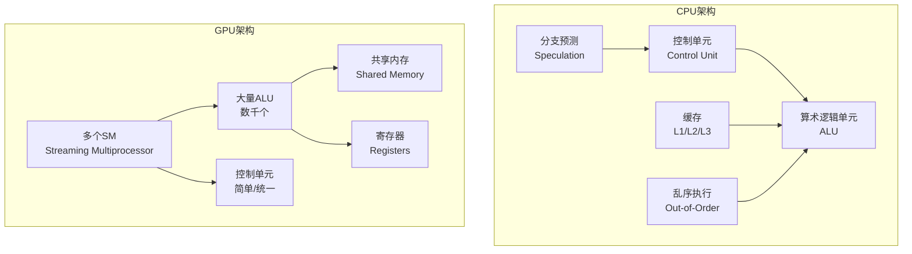

**核心差异对比：**

| 特性 | CPU | GPU |
|------|-----|-----|
| 核心数量 | 少（4-64核） | 多（数千至上万核） |
| 单核性能 | 强（高主频、复杂流水线） | 弱（低主频、简单流水线） |
| 控制逻辑 | 复杂（分支预测、乱序执行） | 简单（统一控制） |
| 缓存设计 | 大（MB级L3缓存） | 小（KB级共享内存） |
| 内存带宽 | 中等（~100 GB/s） | 极高（~1000 GB/s） |
| 适合任务 | 串行、复杂逻辑、低延迟 | 并行、简单计算、高吞吐 |
| 典型延迟 | 纳秒级 | 微秒级 |

**形象比喻：**

- **CPU** 像一位大学教授，知识渊博，能处理复杂问题，但一次只能处理一个任务。
- **GPU** 像一支由数千名小学生组成的军队，每个人只能做简单的计算，但胜在人多，可以同时处理海量简单任务。

### 1.2 什么任务适合 GPU？

不是所有任务都适合 GPU。判断标准：**数据并行度**和**计算复杂度**。

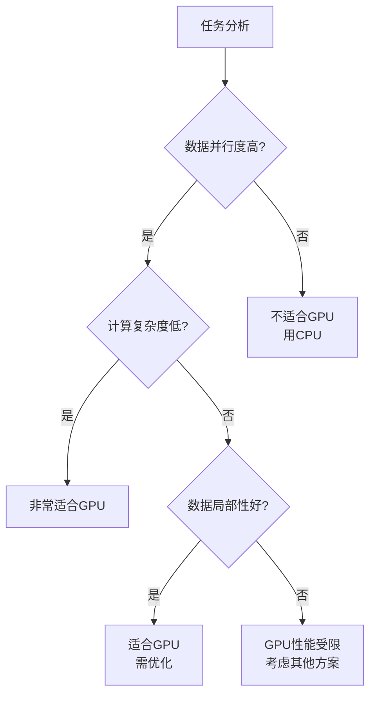

**适合 GPU 的典型场景：**

| 领域 | 任务 | 为什么适合 |
|------|------|------------|
| 深度学习 | 矩阵乘法、卷积 | 大规模并行矩阵运算 |
| 图像处理 | 滤波、变换、渲染 | 像素级并行 |
| 科学计算 | 流体模拟、分子动力学 | 大量粒子并行计算 |
| 密码学 | 哈希计算、暴力破解 | 独立密钥并行尝试 |
| 金融 | 蒙特卡洛模拟 | 独立路径并行采样 |
| 区块链 | 挖矿（SHA-256） | 独立 nonce 并行计算 |

**不适合 GPU 的场景：**

- 强依赖前一步结果的串行算法
- 频繁分支跳转的复杂逻辑
- 需要大量随机内存访问的任务
- 数据量太小（启动开销 > 计算收益）

### 1.3 GPU 编程的历史演进

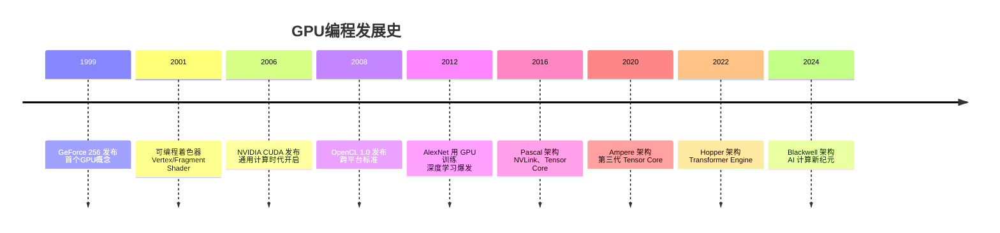

**关键里程碑：**

- **1999年**：NVIDIA 发布 GeForce 256，首次提出 GPU（Graphics Processing Unit）概念
- **2006年**：CUDA 发布，GPU 从图形专用设备变为通用并行处理器（GPGPU）
- **2012年**：AlexNet 使用两块 GTX 580 训练，ImageNet 竞赛夺冠，深度学习+GPU 的黄金组合确立
- **2020年至今**：专用 AI 加速器（Tensor Core）成为标配，GPU 算力以每年 2-3 倍速度增长

### 1.4 主流 GPU 编程框架

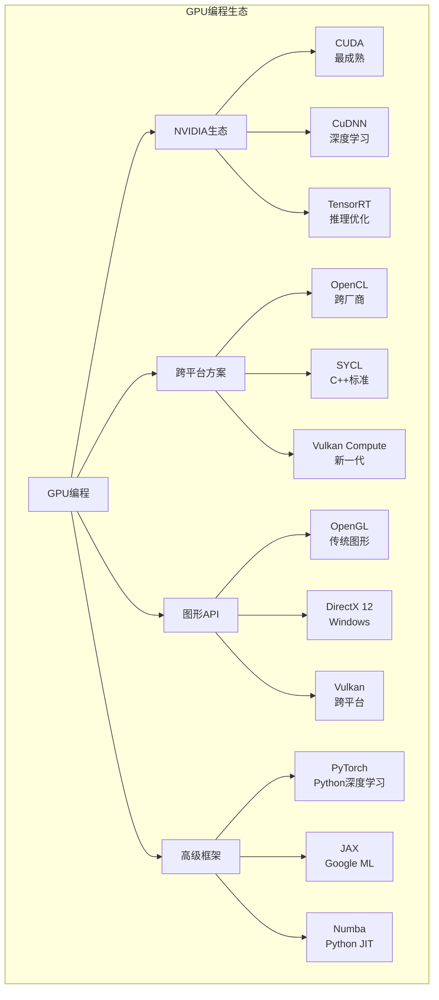

**框架选择建议：**

| 场景 | 推荐框架 | 理由 |
|------|----------|------|
| NVIDIA GPU 通用计算 | CUDA | 生态最完善，文档最丰富 |
| 跨平台（NVIDIA/AMD/Intel） | OpenCL / SYCL | 代码可移植 |
| 深度学习研究 | PyTorch / JAX | 自动微分，开发效率高 |
| 深度学习生产部署 | TensorRT / ONNX Runtime | 极致性能优化 |
| 图形+计算混合 | Vulkan / DirectX 12 | 统一 API |
| Python 快速原型 | Numba | 装饰器即加速 |

---

## 第二篇：GPU 硬件架构深度解析

### 2.1 NVIDIA GPU 架构演进

理解 GPU 编程，必须先理解 GPU 硬件。NVIDIA 的架构演进代表了 GPU 发展的主流方向。

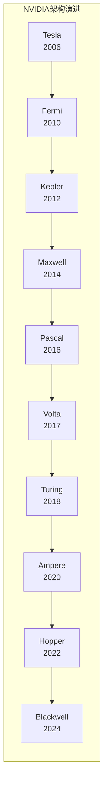

**各代架构关键特性：**

| 架构 | 年份 | 关键创新 | 代表产品 |
|------|------|----------|----------|
| Tesla | 2006 | 首个 CUDA 架构 | GeForce 8800 |
| Fermi | 2010 | L1/L2 缓存、ECC 内存 | GTX 480 |
| Kepler | 2012 | GPU Direct、动态并行 | GTX 680 |
| Maxwell | 2014 | 统一内存、NVENC | GTX 980 |
| Pascal | 2016 | NVLink、FP16、P100 | GTX 1080, P100 |
| Volta | 2017 | **第一代 Tensor Core** | V100 |
| Turing | 2018 | RT Core（光追）、DLSS | RTX 2080 |
| Ampere | 2020 | **第三代 Tensor Core**、MIG | RTX 3090, A100 |
| Hopper | 2022 | **Transformer Engine**、FP8 | H100 |
| Blackwell | 2024 | 第二代 Transformer Engine | B200 |

### 2.2 GPU 核心架构：SM 与 CUDA Core

GPU 的基本计算单元是 **Streaming Multiprocessor（SM，流式多处理器）**。一个 GPU 由数十个 SM 组成，每个 SM 包含数百个计算核心。

```mermaid
graph TB
    subgraph GPU整体架构
        G[GPU芯片] --> SM1[SM 0]
        G --> SM2[SM 1]
        G --> SM3[...]
        G --> SM4[SM N-1]

        subgraph SM内部结构<br>以Ampere为例
            SM1 --> W1[Warp Scheduler]
            SM1 --> W2[Warp Scheduler]
            SM1 --> W3[Warp Scheduler]
            SM1 --> W4[Warp Scheduler]

            W1 --> FP321[FP32 Core x16]
            W1 --> FP642[FP64 Core x8]
            W1 --> INT3[INT Core x16]
            W1 --> TC[Tensor Core x4]
            W1 --> LD[Load/Store Unit]
            W1 --> SFU[Special Function Unit]

            SM1 --> REG[Register File<br>256KB]
            SM1 --> L1[L1 Cache/Shared Memory<br>192KB]
        end
    end
```

**Ampere SM 内部结构（以 GA102 为例）：**

| 组件 | 数量 | 功能 |
|------|------|------|
| FP32 CUDA Core | 128 | 单精度浮点运算 |
| FP64 CUDA Core | 64 | 双精度浮点运算 |
| INT32 Core | 64 | 整数运算 |
| Tensor Core | 4 | 矩阵运算加速 |
| Load/Store Unit | 32 | 内存读写 |
| Special Function Unit | 4 | 超越函数（sin/cos等） |
| Warp Scheduler | 4 | 线程调度 |
| Register File | 256 KB | 线程私有寄存器 |
| L1/Shared Memory | 192 KB | 可配置缓存/共享内存 |

### 2.3 内存层次结构

GPU 的内存层次比 CPU 更复杂，理解它是优化的关键。

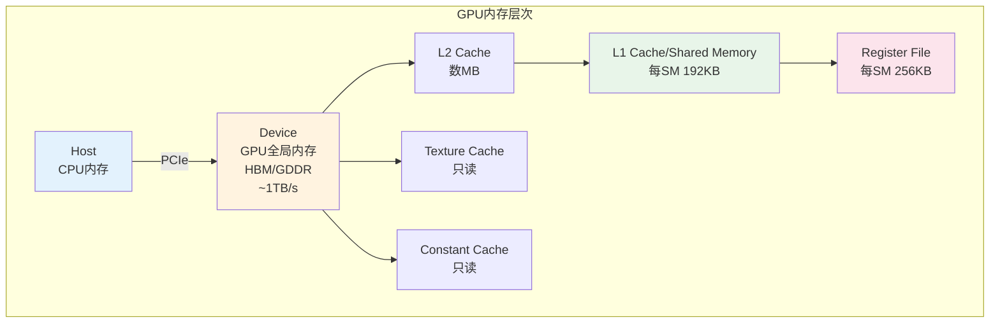

**各内存类型详解：**

| 内存类型 | 位置 | 访问速度 | 容量 | 生命周期 | 可见性 |
|----------|------|----------|------|----------|--------|
| Register | SM 内 | 最快（1周期） | 有限（每线程） | 线程 | 线程私有 |
| Shared Memory | SM 内 | 快（~20周期） | 每 SM 48-164KB | 块 | 块内共享 |
| L1 Cache | SM 内 | 较快 | 与 Shared 共享 | 自动 | 线程 |
| L2 Cache | 芯片级 | 中等 | 数 MB | 自动 | 所有线程 |
| Global Memory | 显存 | 慢（~400周期） | 数 GB 到数十 GB | 程序 | 所有线程 |
| Constant Memory | 显存 | 有缓存 | 64 KB | 程序 | 所有线程 |
| Texture Memory | 显存 | 有缓存 | 大 | 程序 | 所有线程 |

**内存访问模式的重要性：**

GPU 内存访问是**合并访问（Coalesced Access）**优化的。当相邻线程访问相邻内存地址时，可以合并为一次内存事务，大幅提升效率。

```mermaid
graph LR
    subgraph 合并访问<br>高效
        T1[Thread 0] --> A0[Addr 0]
        T2[Thread 1] --> A1[Addr 4]
        T3[Thread 2] --> A2[Addr 8]
        T4[Thread 3] --> A3[Addr 12]
    end

    subgraph 非合并访问<br>低效
        S1[Thread 0] --> B0[Addr 0]
        S2[Thread 1] --> B1[Addr 1024]
        S3[Thread 2] --> B2[Addr 2048]
        S4[Thread 3] --> B3[Addr 3072]
    end
```

### 2.4 执行模型：Grid、Block、Thread

GPU 程序的执行模型是层次化的，理解这个模型是编写正确 GPU 代码的基础。

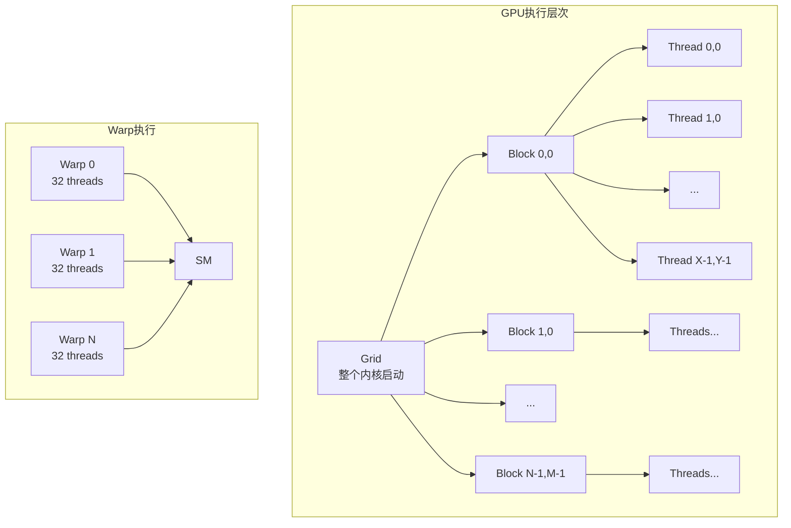

**执行层次详解：**

| 层次 | 说明 | 限制 | 同步方式 |
|------|------|------|----------|
| Thread | 最基本的执行单元 | 每 Block 最多 1024/2048 个 | 无法直接同步 |
| Warp | 32 个线程的 SIMD 组 | 硬件决定 | `__syncwarp()` |
| Block | 线程的集合，共享 Shared Memory | 每 SM 有限制 | `__syncthreads()` |
| Grid | 所有 Block 的集合 | 受显存限制 | 内核结束自动同步 |

**Warp 是 GPU 执行的基本单位：**

- 一个 Warp 包含 32 个线程，执行相同的指令（SIMT：Single Instruction Multiple Thread）
- Warp 内的线程是**锁步执行**的，如果发生分支，所有路径都会执行（分支发散）
- SM 可以同时执行多个 Warp，通过切换 Warp 隐藏内存延迟

### 2.5 分支发散问题

这是 GPU 编程中最常见的性能陷阱。

```mermaid
graph TD
    subgraph 无分支发散<br>高效
        W[Warp] --> C{条件}
        C -->|全部true| P1[Path A]
    end

    subgraph 有分支发散<br>低效
        W2[Warp] --> C2{条件}
        C2 -->|部分true| P2[Path A]
        C2 -->|部分false| P3[Path B]
        P2 --> M[合并结果]
        P3 --> M
    end
```

**分支发散示例（CUDA）：**

```cuda
// 低效：Warp 内线程走不同分支
__global__ void divergent_kernel(int* data, int n) {
    int idx = blockIdx.x * blockDim.x + threadIdx.x;
    if (idx < n) {
        if (threadIdx.x % 2 == 0) {
            data[idx] = data[idx] * 2;  // 偶数线程
        } else {
            data[idx] = data[idx] + 1;  // 奇数线程
        }
    }
}

// 高效：重新组织，避免发散
__global__ void optimized_kernel(int* data, int n) {
    int idx = blockIdx.x * blockDim.x + threadIdx.x;
    // 先处理偶数索引
    if (idx * 2 < n) {
        data[idx * 2] = data[idx * 2] * 2;
    }
    __syncthreads();
    // 再处理奇数索引
    if (idx * 2 + 1 < n) {
        data[idx * 2 + 1] = data[idx * 2 + 1] + 1;
    }
}
```

---

## 第三篇：CUDA 编程入门

### 3.1 CUDA 简介与环境搭建

CUDA（Compute Unified Device Architecture）是 NVIDIA 推出的并行计算平台和编程模型，是目前最成熟、生态最完善的 GPU 编程框架。

**CUDA 的核心组件：**

| 组件 | 说明 |
|------|------|
| nvcc | CUDA 编译器，将 .cu 文件编译为 GPU 可执行代码 |
| CUDA Runtime API | 运行时库，管理设备、内存、内核启动 |
| CUDA Driver API | 底层驱动接口，更灵活但更复杂 |
| cuBLAS/cuFFT/cuDNN | 优化的数学库 |
| Nsight | 性能分析工具 |

**环境搭建：**

```bash
# Ubuntu 安装 CUDA Toolkit
wget https://developer.download.nvidia.com/compute/cuda/repos/ubuntu2204/x86_64/cuda-keyring_1.0-1_all.deb
sudo dpkg -i cuda-keyring_1.0-1_all.deb
sudo apt update
sudo apt install cuda-toolkit-12-4

# 添加到环境变量
echo 'export PATH=/usr/local/cuda/bin:$PATH' >> ~/.bashrc
echo 'export LD_LIBRARY_PATH=/usr/local/cuda/lib64:$LD_LIBRARY_PATH' >> ~/.bashrc
source ~/.bashrc

# 验证安装
nvcc --version
nvidia-smi
```

### 3.2 第一个 CUDA 程序

经典的 "Hello World" GPU 版本——向量加法。

```cuda
// vector_add.cu
#include <cuda_runtime.h>
#include <stdio.h>

// GPU 内核函数
__global__ void vectorAdd(const float *A, const float *B, float *C, int numElements) {
    int i = blockDim.x * blockIdx.x + threadIdx.x;
    if (i < numElements) {
        C[i] = A[i] + B[i];
    }
}

int main(void) {
    int numElements = 50000;
    size_t size = numElements * sizeof(float);

    // 主机内存分配
    float *h_A = (float *)malloc(size);
    float *h_B = (float *)malloc(size);
    float *h_C = (float *)malloc(size);

    // 初始化数据
    for (int i = 0; i < numElements; ++i) {
        h_A[i] = rand() / (float)RAND_MAX;
        h_B[i] = rand() / (float)RAND_MAX;
    }

    // 设备内存分配
    float *d_A = NULL;
    float *d_B = NULL;
    float *d_C = NULL;
    cudaMalloc((void **)&d_A, size);
    cudaMalloc((void **)&d_B, size);
    cudaMalloc((void **)&d_C, size);

    // 数据从主机复制到设备
    cudaMemcpy(d_A, h_A, size, cudaMemcpyHostToDevice);
    cudaMemcpy(d_B, h_B, size, cudaMemcpyHostToDevice);

    // 启动内核
    int threadsPerBlock = 256;
    int blocksPerGrid = (numElements + threadsPerBlock - 1) / threadsPerBlock;
    vectorAdd<<<blocksPerGrid, threadsPerBlock>>>(d_A, d_B, d_C, numElements);

    // 数据从设备复制回主机
    cudaMemcpy(h_C, d_C, size, cudaMemcpyDeviceToHost);

    // 验证结果
    for (int i = 0; i < numElements; ++i) {
        if (fabs(h_A[i] + h_B[i] - h_C[i]) > 1e-5) {
            fprintf(stderr, "Result verification failed at element %d!\n", i);
            exit(EXIT_FAILURE);
        }
    }

    printf("Test PASSED\n");

    // 释放资源
    cudaFree(d_A);
    cudaFree(d_B);
    cudaFree(d_C);
    free(h_A);
    free(h_B);
    free(h_C);

    return 0;
}
```

**编译运行：**

```bash
nvcc -o vector_add vector_add.cu
./vector_add
```

### 3.3 CUDA 程序执行流程

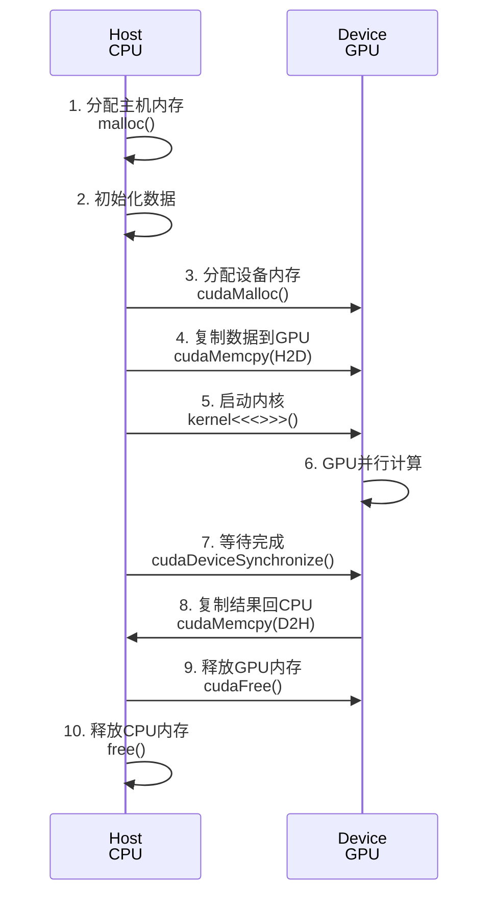

**关键概念：**

| 概念 | 说明 | 示例 |
|------|------|------|
| `__global__` | 内核函数修饰符，在 GPU 上执行，由 CPU 调用 | `__global__ void kernel() {}` |
| `__device__` | 设备函数修饰符，在 GPU 上执行，由 GPU 调用 | `__device__ float func() {}` |
| `__host__` | 主机函数修饰符（默认），在 CPU 上执行 | `__host__ void func() {}` |
| `<<< >>>` | 内核启动配置，指定 Grid 和 Block 维度 | `kernel<<<blocks, threads>>>(args)` |
| `blockIdx` | Block 在 Grid 中的索引 | `int bx = blockIdx.x;` |
| `threadIdx` | Thread 在 Block 中的索引 | `int tx = threadIdx.x;` |
| `blockDim` | Block 的维度（每个 Block 的线程数） | `int bdx = blockDim.x;` |
| `gridDim` | Grid 的维度（Block 数量） | `int gdx = gridDim.x;` |

### 3.4 内存管理详解

**CUDA 内存类型：**

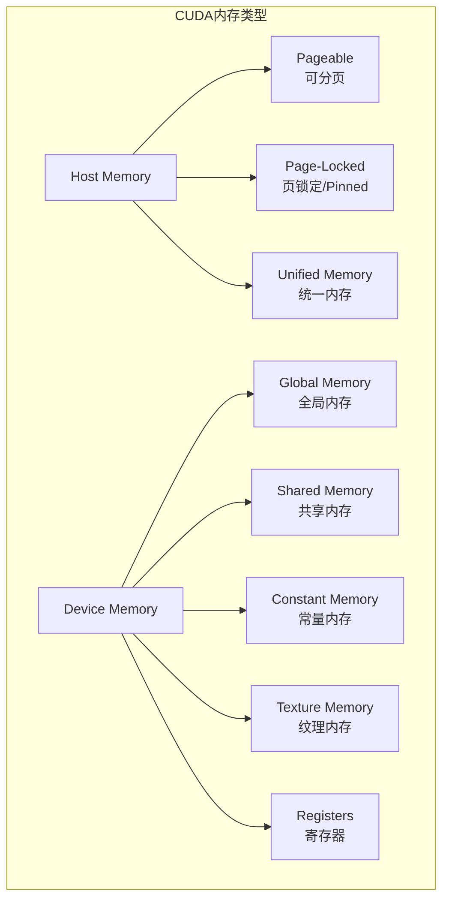

**内存分配方式对比：**

| 方式 | 函数 | 特点 | 适用场景 |
|------|------|------|----------|
| 可分页内存 | `malloc` / `new` | 可能被换出到磁盘 | 小数据量，简单场景 |
| 页锁定内存 | `cudaMallocHost` | 不会被换出，H2D 传输更快 | 频繁数据传输 |
| 统一内存 | `cudaMallocManaged` | 自动迁移，编程简单 | 快速原型，复杂数据结构 |
| 设备内存 | `cudaMalloc` | GPU 直接访问，最快 | 大规模计算 |

**统一内存示例：**

```cuda
// 使用统一内存简化编程
__global__ void vectorAddManaged(float *A, float *B, float *C, int n) {
    int i = blockIdx.x * blockDim.x + threadIdx.x;
    if (i < n) C[i] = A[i] + B[i];
}

int main() {
    int n = 50000;
    float *A, *B, *C;

    // 分配统一内存
    cudaMallocManaged(&A, n * sizeof(float));
    cudaMallocManaged(&B, n * sizeof(float));
    cudaMallocManaged(&C, n * sizeof(float));

    // 在 CPU 上初始化
    for (int i = 0; i < n; i++) {
        A[i] = i; B[i] = i * 2;
    }

    // 内核自动迁移数据到 GPU
    vectorAddManaged<<<(n+255)/256, 256>>>(A, B, C, n);
    cudaDeviceSynchronize();

    // 结果自动迁移回 CPU
    printf("C[0] = %f\n", C[0]);

    cudaFree(A); cudaFree(B); cudaFree(C);
    return 0;
}
```

### 3.5 错误处理

CUDA 调用可能失败，良好的错误处理是必须的。

```cuda
#define cudaCheckError(ans) { gpuAssert((ans), __FILE__, __LINE__); }
inline void gpuAssert(cudaError_t code, const char *file, int line, bool abort=true) {
    if (code != cudaSuccess) {
        fprintf(stderr, "GPUassert: %s %s %d\n", cudaGetErrorString(code), file, line);
        if (abort) exit(code);
    }
}

// 使用示例
cudaCheckError(cudaMalloc((void**)&d_data, size));
cudaCheckError(cudaMemcpy(d_data, h_data, size, cudaMemcpyHostToDevice));
kernel<<<blocks, threads>>>(d_data);
cudaCheckError(cudaGetLastError());  // 检查内核启动错误
cudaCheckError(cudaDeviceSynchronize());  // 检查内核执行错误
```

---

## 第四篇：CUDA 优化技巧

### 4.1 优化层次与策略

GPU 优化是一个系统工程，需要从多个层次入手。

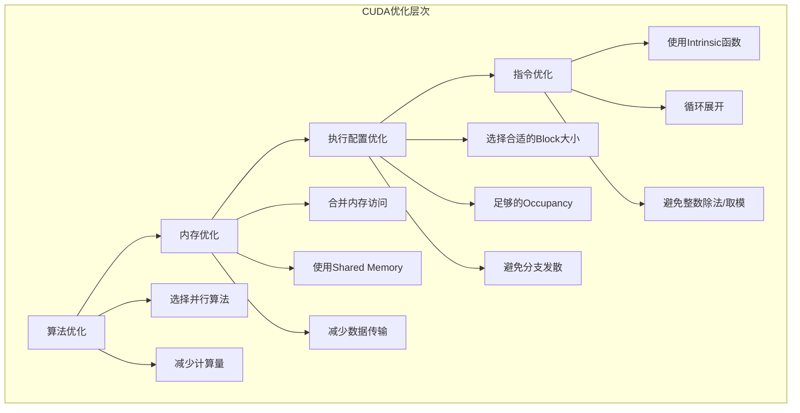

### 4.2 内存访问优化

**全局内存合并访问：**

```cuda
// 低效：非合并访问
__global__ void uncoalesced(float* out, float* in, int n) {
    int idx = threadIdx.x;
    // 线程0访问地址0，线程1访问地址100，不连续
    out[idx] = in[idx * 100];
}

// 高效：合并访问
__global__ void coalesced(float* out, float* in, int n) {
    int idx = blockIdx.x * blockDim.x + threadIdx.x;
    // 线程0访问地址0，线程1访问地址1，连续
    if (idx < n) out[idx] = in[idx];
}
```

**Shared Memory 优化矩阵转置：**

```cuda
#define TILE_DIM 32

// 低效：全局内存非合并访问
__global__ void transposeNaive(float *odata, float *idata, int width, int height) {
    int xIndex = blockIdx.x * TILE_DIM + threadIdx.x;
    int yIndex = blockIdx.y * TILE_DIM + threadIdx.y;
    int index_in = xIndex + width * yIndex;
    int index_out = yIndex + height * xIndex;
    odata[index_out] = idata[index_in];
}

// 高效：使用Shared Memory
__global__ void transposeShared(float *odata, float *idata, int width, int height) {
    __shared__ float tile[TILE_DIM][TILE_DIM + 1];  // +1避免bank conflict

    int xIndex = blockIdx.x * TILE_DIM + threadIdx.x;
    int yIndex = blockIdx.y * TILE_DIM + threadIdx.y;
    int index_in = xIndex + width * yIndex;

    // 读取到Shared Memory（合并访问）
    tile[threadIdx.y][threadIdx.x] = idata[index_in];
    __syncthreads();

    // 转置后写入（合并访问）
    xIndex = blockIdx.y * TILE_DIM + threadIdx.x;
    yIndex = blockIdx.x * TILE_DIM + threadIdx.y;
    int index_out = xIndex + height * yIndex;
    odata[index_out] = tile[threadIdx.x][threadIdx.y];
}
```

### 4.3 Occupancy 与隐藏延迟

**Occupancy（占用率）** 是指 SM 上活跃的 Warp 数量与最大 Warp 数量的比值。高占用率有助于隐藏内存延迟。

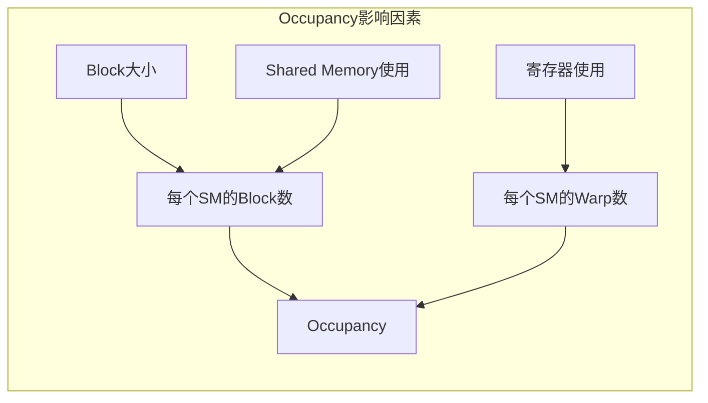

**优化建议：**

| 因素 | 建议 | 原因 |
|------|------|------|
| Block 大小 | 使用 128、256 或 512 | 平衡并行度和资源使用 |
| 寄存器使用 | 控制在 64 个以内 | 提高 Occupancy |
| Shared Memory | 按需使用，避免浪费 | 允许多个 Block 同时运行 |
| 线程数 | 是 32 的倍数 | 避免 Warp 浪费 |

### 4.4 流与异步执行

CUDA 流允许内核执行与数据传输重叠，以及多个内核并发执行。

```mermaid
graph TB
    subgraph 默认流<br>串行执行
        A[Memcpy H2D] --> B[Kernel]
        B --> C[Memcpy D2H]
    end

    subgraph 多流<br>并行执行
        D[Stream 1: Memcpy H2D] --> E[Stream 1: Kernel]
        E --> F[Stream 1: Memcpy D2H]

        G[Stream 2: Memcpy H2D] --> H[Stream 2: Kernel]
        H --> I[Stream 2: Memcpy D2H]
    end
```

**流的使用示例：**

```cuda
#define NSTREAM 4
#define SEGSIZE (N / NSTREAM)

cudaStream_t streams[NSTREAM];
for (int i = 0; i < NSTREAM; i++) {
    cudaStreamCreate(&streams[i]);
}

// 分块异步处理
for (int i = 0; i < NSTREAM; i++) {
    int offset = i * SEGSIZE;
    cudaMemcpyAsync(d_A + offset, h_A + offset, SEGSIZE * sizeof(float),
                    cudaMemcpyHostToDevice, streams[i]);
    kernel<<<blocks, threads, 0, streams[i]>>>(d_A + offset, d_B + offset, SEGSIZE);
    cudaMemcpyAsync(h_B + offset, d_B + offset, SEGSIZE * sizeof(float),
                    cudaMemcpyDeviceToHost, streams[i]);
}

cudaDeviceSynchronize();
for (int i = 0; i < NSTREAM; i++) {
    cudaStreamDestroy(streams[i]);
}
```

### 4.5 性能分析工具

**Nsight Compute：** 内核级性能分析

```bash
# 分析内核性能
ncu ./program

# 生成详细报告
ncu --metrics smsp__cycles_elapsed.avg ./program

# 常用指标
# achieved_occupancy: 实际占用率
# sm_efficiency: SM利用率
# memory_throughput: 内存吞吐量
# gld_throughput: 全局加载吞吐量
```

**Nsight Systems：** 系统级性能分析

```bash
# 分析整个应用程序
nsys profile -o report ./program

# 查看报告
nsys-ui report.nsys-rep
```

---

## 第五篇：深度学习中的 GPU 编程

### 5.1 深度学习为什么需要 GPU？

深度学习的核心计算是**矩阵乘法**和**卷积**，这些操作具有极高的并行度。

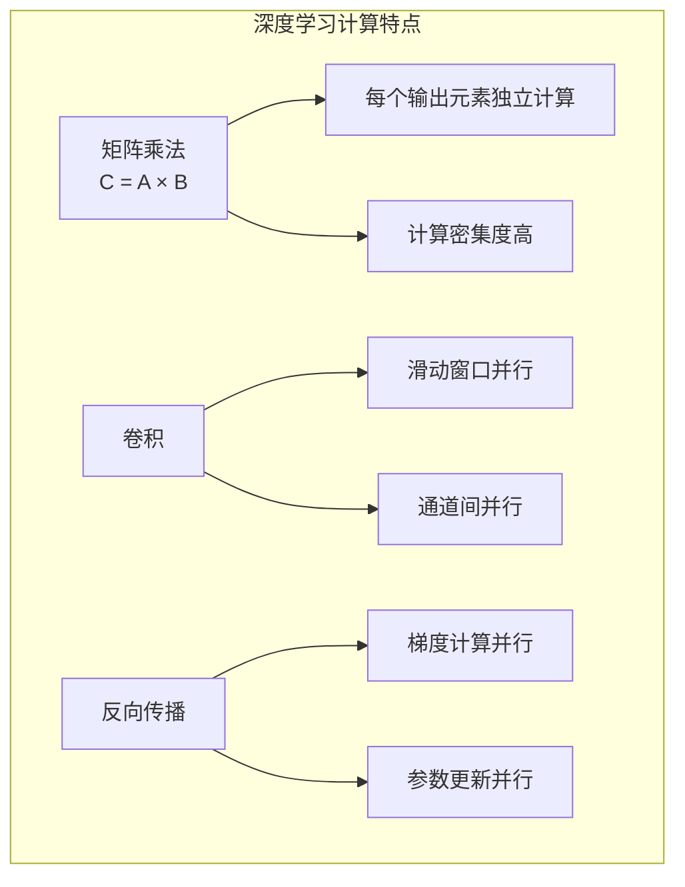

**GPU vs CPU 在深度学习中的性能对比：**

| 模型 | CPU (Intel Xeon) | GPU (V100) | 加速比 |
|------|------------------|------------|--------|
| ResNet-50 训练 | 数天 | 数小时 | 10-50x |
| GPT-3 训练 | 不可能 | 数月 | ∞ |
| BERT-Large 微调 | 数小时 | 数分钟 | 20-50x |

### 5.2 cuDNN 与深度学习框架

**cuDNN**（CUDA Deep Neural Network library）是 NVIDIA 针对深度学习的优化库。

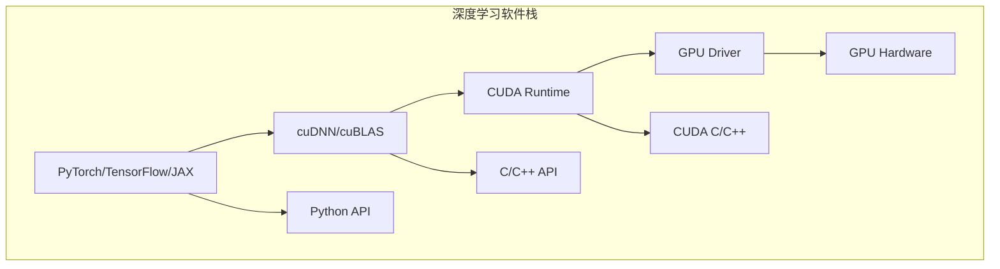

**cuDNN 提供的核心功能：**

| 功能 | 说明 |
|------|------|
| 卷积前向/反向 | 高度优化的卷积实现 |
| 池化 | Max/Avg Pooling |
| 激活函数 | ReLU, Sigmoid, Tanh 等 |
| 归一化 | Batch Norm, Layer Norm |
| RNN/LSTM/GRU | 循环神经网络优化 |
| Transformer | Attention 机制优化 |

### 5.3 自定义 CUDA 算子

有时需要编写自定义 CUDA 算子来优化特定操作。

**PyTorch 自定义 CUDA 算子示例：**

```cpp
// custom_op.cpp
#include <torch/extension.h>

// CUDA 前向声明
torch::Tensor custom_forward_cuda(torch::Tensor input);

// C++ 包装
#define CHECK_CUDA(x) TORCH_CHECK(x.device().is_cuda(), #x " must be a CUDA tensor")
#define CHECK_CONTIGUOUS(x) TORCH_CHECK(x.is_contiguous(), #x " must be contiguous")
#define CHECK_INPUT(x) CHECK_CUDA(x); CHECK_CONTIGUOUS(x)

torch::Tensor custom_forward(torch::Tensor input) {
    CHECK_INPUT(input);
    return custom_forward_cuda(input);
}

PYBIND11_MODULE(TORCH_EXTENSION_NAME, m) {
    m.def("forward", &custom_forward, "Custom forward (CUDA)");
}
```

```cuda
// custom_op_kernel.cu
#include <torch/extension.h>
#include <cuda_runtime.h>

template <typename scalar_t>
__global__ void custom_kernel(const scalar_t* __restrict__ input,
                               scalar_t* __restrict__ output,
                               int size) {
    int idx = blockIdx.x * blockDim.x + threadIdx.x;
    if (idx < size) {
        // 自定义计算
        output[idx] = input[idx] * input[idx] + 1.0;
    }
}

torch::Tensor custom_forward_cuda(torch::Tensor input) {
    auto output = torch::empty_like(input);
    int size = input.numel();

    const int threads = 256;
    const int blocks = (size + threads - 1) / threads;

    AT_DISPATCH_FLOATING_TYPES(input.type(), "custom_forward_cuda", ([&] {
        custom_kernel<scalar_t><<<blocks, threads>>>(
            input.data<scalar_t>(),
            output.data<scalar_t>(),
            size
        );
    }));

    return output;
}
```

**编译与使用：**

```python
# setup.py
from setuptools import setup
from torch.utils.cpp_extension import BuildExtension, CUDAExtension

setup(
    name='custom_op',
    ext_modules=[
        CUDAExtension('custom_op', [
            'custom_op.cpp',
            'custom_op_kernel.cu',
        ])
    ],
    cmdclass={'build_ext': BuildExtension}
)

# 使用
import torch
import custom_op

x = torch.randn(1000, device='cuda')
y = custom_op.forward(x)
```

### 5.4 混合精度训练

混合精度训练使用 FP16（半精度浮点）进行计算，同时保持 FP32（单精度）的数值稳定性，可以在支持 Tensor Core 的 GPU 上获得 2-8 倍加速。

```python
import torch
from torch.cuda.amp import autocast, GradScaler

model = MyModel().cuda()
optimizer = torch.optim.Adam(model.parameters())
scaler = GradScaler()  # 梯度缩放，防止下溢

for data, target in dataloader:
    data, target = data.cuda(), target.cuda()
    optimizer.zero_grad()

    # 自动混合精度上下文
    with autocast():
        output = model(data)
        loss = criterion(output, target)

    # 缩放损失并反向传播
    scaler.scale(loss).backward()
    scaler.step(optimizer)
    scaler.update()
```

**混合精度训练原理：**

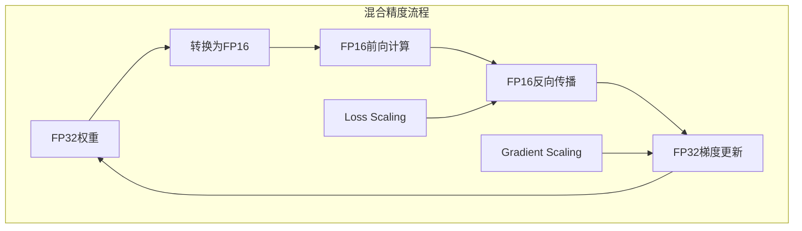

---

## 第六篇：图形编程与光线追踪

### 6.1 图形管线概述

GPU 最初就是为图形渲染设计的。理解图形管线有助于理解 GPU 架构。

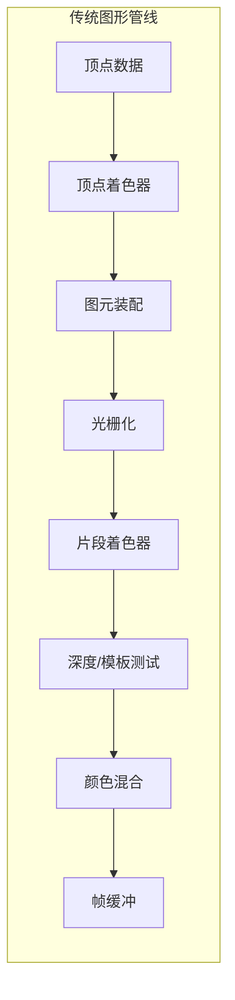

**可编程阶段：**

| 阶段 | 着色器类型 | 功能 |
|------|------------|------|
| 顶点处理 | Vertex Shader | 变换顶点位置、计算光照 |
| 图元处理 | Geometry Shader | 生成/销毁图元 |
| 片段处理 | Fragment/Pixel Shader | 计算像素颜色 |
| 计算 | Compute Shader | 通用计算（GPGPU） |

### 6.2 CUDA 与图形 API 的互操作

CUDA 可以与 OpenGL/DirectX/Vulkan 互操作，实现计算与渲染的无缝结合。

```cuda
// CUDA-OpenGL 互操作示例
// 注册 OpenGL Buffer 为 CUDA 资源
cudaGraphicsResource* cuda_vbo_resource;
cudaGraphicsGLRegisterBuffer(&cuda_vbo_resource, vbo, cudaGraphicsMapFlagsWriteDiscard);

// 每帧：映射资源，CUDA 修改，解除映射
cudaGraphicsMapResources(1, &cuda_vbo_resource, 0);
float* d_ptr;
size_t size;
cudaGraphicsResourceGetMappedPointer((void**)&d_ptr, &size, cuda_vbo_resource);

// 启动 CUDA 内核修改顶点数据
launch_kernel<<<blocks, threads>>>(d_ptr, ...);

cudaGraphicsUnmapResources(1, &cuda_vbo_resource, 0);

// OpenGL 渲染
// ... 使用修改后的 VBO 进行渲染
```

### 6.3 光线追踪基础

光线追踪（Ray Tracing）是计算机图形学的终极渲染技术，NVIDIA RTX 系列 GPU 内置了专门的 RT Core 来加速光线追踪。

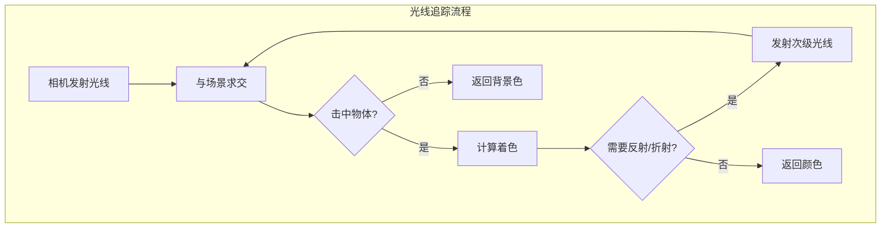

**光线追踪核心概念：**

| 概念 | 说明 |
|------|------|
| 光线-物体求交 | 计算光线与场景中物体的交点 |
| BVH（包围体层次） | 加速求交的数据结构 |
| 光线着色 | 根据材质、光照计算颜色 |
| 路径追踪 | 模拟光线路径的蒙特卡洛方法 |
| 降噪 | 减少蒙特卡洛噪声的后处理 |

### 6.4 OptiX 光线追踪框架

OptiX 是 NVIDIA 的高性能光线追踪引擎。

```cuda
// OptiX 程序类型
RT_PROGRAM void ray_gen() {
    // 光线生成程序
    float2 d = make_float2(launch_index) / make_float2(launch_dim);
    optix::Ray ray = camera->generateRay(d);
    PerRayData prd;
    rtTrace(top_object, ray, prd);
    output_buffer[launch_index] = prd.result;
}

RT_PROGRAM void closest_hit() {
    // 最近命中程序
    float3 hit_point = ray.origin + t_hit * ray.direction;
    float3 normal = normalize(rtTransformNormal(RT_OBJECT_TO_WORLD, geometric_normal));
    // 计算着色...
}

RT_PROGRAM void miss() {
    // 未命中程序
    prd.result = miss_color;
}
```

### 6.5 CUDA 实现简单光线追踪

```cuda
struct Ray {
    float3 origin;
    float3 direction;
};

struct Sphere {
    float3 center;
    float radius;
    float3 color;
};

__device__ bool intersectSphere(const Ray& ray, const Sphere& sphere, float& t) {
    float3 oc = ray.origin - sphere.center;
    float a = dot(ray.direction, ray.direction);
    float b = 2.0f * dot(oc, ray.direction);
    float c = dot(oc, oc) - sphere.radius * sphere.radius;
    float discriminant = b * b - 4 * a * c;

    if (discriminant < 0) return false;

    t = (-b - sqrtf(discriminant)) / (2.0f * a);
    return t > 0.001f;
}

__global__ void raytraceKernel(uchar4* output, int width, int height,
                                Sphere* spheres, int numSpheres) {
    int x = blockIdx.x * blockDim.x + threadIdx.x;
    int y = blockIdx.y * blockDim.y + threadIdx.y;
    if (x >= width || y >= height) return;

    // 生成光线
    float u = float(x) / float(width);
    float v = float(y) / float(height);
    Ray ray;
    ray.origin = make_float3(0, 0, 0);
    ray.direction = normalize(make_float3(u - 0.5f, v - 0.5f, -1.0f));

    // 追踪光线
    float closest_t = 1e30f;
    float3 color = make_float3(0.2f, 0.3f, 0.5f);  // 背景色

    for (int i = 0; i < numSpheres; i++) {
        float t;
        if (intersectSphere(ray, spheres[i], t) && t < closest_t) {
            closest_t = t;
            float3 hit_point = ray.origin + t * ray.direction;
            float3 normal = normalize(hit_point - spheres[i].center);
            float3 light_dir = normalize(make_float3(1, 1, -1));
            float diff = fmaxf(dot(normal, light_dir), 0.0f);
            color = spheres[i].color * (0.1f + 0.9f * diff);
        }
    }

    // 写入输出
    int idx = y * width + x;
    output[idx] = make_uchar4(
        (unsigned char)(color.x * 255),
        (unsigned char)(color.y * 255),
        (unsigned char)(color.z * 255),
        255
    );
}
```

---

## 第七篇：跨平台 GPU 编程

### 7.1 OpenCL 简介

OpenCL（Open Computing Language）是跨平台的 GPU 编程标准，支持 NVIDIA、AMD、Intel 等厂商的 GPU。

```mermaid
graph TB
    subgraph OpenCL平台模型
        P[Platform<br>厂商实现] --> D1[Device 0<br>GPU]
        P --> D2[Device 1<br>CPU]
        P --> D3[Device 2<br>FPGA]

        D1 --> C1[Compute Unit 0]
        D1 --> C2[Compute Unit 1]
        C1 --> P1[Processing Element]
        C1 --> P2[Processing Element]
    end
```

**OpenCL 与 CUDA 对比：**

| 特性 | CUDA | OpenCL |
|------|------|--------|
| 厂商支持 | 仅 NVIDIA | 跨厂商 |
| 学习曲线 | 平缓 | 较陡 |
| 性能 | 最优 | 接近 CUDA |
| 工具链 | 完善 | 一般 |
| 代码可移植 | 需重写 | 较好 |

### 7.2 OpenCL 程序示例

```c
// vector_add.cl
__kernel void vectorAdd(__global const float *A,
                        __global const float *B,
                        __global float *C,
                        const unsigned int n) {
    int i = get_global_id(0);
    if (i < n) {
        C[i] = A[i] + B[i];
    }
}
```

```cpp
// host.cpp
#include <CL/cl.h>

int main() {
    // 获取平台
    cl_platform_id platform;
    clGetPlatformIDs(1, &platform, NULL);

    // 获取设备
    cl_device_id device;
    clGetDeviceIDs(platform, CL_DEVICE_TYPE_GPU, 1, &device, NULL);

    // 创建上下文和命令队列
    cl_context context = clCreateContext(NULL, 1, &device, NULL, NULL, NULL);
    cl_command_queue queue = clCreateCommandQueue(context, device, 0, NULL);

    // 创建内存对象
    cl_mem d_A = clCreateBuffer(context, CL_MEM_READ_ONLY, size, NULL, NULL);
    cl_mem d_B = clCreateBuffer(context, CL_MEM_READ_ONLY, size, NULL, NULL);
    cl_mem d_C = clCreateBuffer(context, CL_MEM_WRITE_ONLY, size, NULL, NULL);

    // 复制数据到设备
    clEnqueueWriteBuffer(queue, d_A, CL_TRUE, 0, size, h_A, 0, NULL, NULL);
    clEnqueueWriteBuffer(queue, d_B, CL_TRUE, 0, size, h_B, 0, NULL, NULL);

    // 编译内核
    const char* source = load_kernel_source("vector_add.cl");
    cl_program program = clCreateProgramWithSource(context, 1, &source, NULL, NULL);
    clBuildProgram(program, 1, &device, NULL, NULL, NULL);
    cl_kernel kernel = clCreateKernel(program, "vectorAdd", NULL);

    // 设置参数并执行
    clSetKernelArg(kernel, 0, sizeof(cl_mem), &d_A);
    clSetKernelArg(kernel, 1, sizeof(cl_mem), &d_B);
    clSetKernelArg(kernel, 2, sizeof(cl_mem), &d_C);
    clSetKernelArg(kernel, 3, sizeof(unsigned int), &n);

    size_t globalSize = n;
    clEnqueueNDRangeKernel(queue, kernel, 1, NULL, &globalSize, NULL, 0, NULL, NULL);

    // 读取结果
    clEnqueueReadBuffer(queue, d_C, CL_TRUE, 0, size, h_C, 0, NULL, NULL);

    // 清理
    clReleaseMemObject(d_A);
    clReleaseMemObject(d_B);
    clReleaseMemObject(d_C);
    clReleaseKernel(kernel);
    clReleaseProgram(program);
    clReleaseCommandQueue(queue);
    clReleaseContext(context);

    return 0;
}
```

### 7.3 SYCL：C++ 标准的 GPU 编程

SYCL 是基于 C++17 的跨平台异构编程标准，由 Khronos 维护。

```cpp
#include <CL/sycl.hpp>
namespace sycl = cl::sycl;

int main() {
    const int N = 1024;
    std::vector<float> a(N), b(N), c(N);
    // 初始化 a, b...

    // 创建队列
    sycl::queue q(sycl::default_selector{});

    // 创建缓冲区
    sycl::buffer<float, 1> buf_a(a.data(), sycl::range<1>(N));
    sycl::buffer<float, 1> buf_b(b.data(), sycl::range<1>(N));
    sycl::buffer<float, 1> buf_c(c.data(), sycl::range<1>(N));

    // 提交内核
    q.submit([&](sycl::handler& h) {
        auto acc_a = buf_a.get_access<sycl::access::mode::read>(h);
        auto acc_b = buf_b.get_access<sycl::access::mode::read>(h);
        auto acc_c = buf_c.get_access<sycl::access::mode::write>(h);

        h.parallel_for(sycl::range<1>(N), [=](sycl::id<1> i) {
            acc_c[i] = acc_a[i] + acc_b[i];
        });
    });

    // 结果自动同步回主机
    return 0;
}
```

### 7.4 Vulkan Compute

Vulkan 是新一代跨平台图形和计算 API，其计算着色器可以用于 GPGPU。

```glsl
// compute_shader.comp
#version 450

layout(local_size_x = 256, local_size_y = 1, local_size_z = 1) in;

layout(set = 0, binding = 0) readonly buffer InputA {
    float data[];
} inputA;

layout(set = 0, binding = 1) readonly buffer InputB {
    float data[];
} inputB;

layout(set = 0, binding = 2) writeonly buffer Output {
    float data[];
} output;

void main() {
    uint idx = gl_GlobalInvocationID.x;
    output.data[idx] = inputA.data[idx] + inputB.data[idx];
}
```

---

## 第八篇：高级主题与实战

### 8.1 多 GPU 编程

现代服务器通常配备多块 GPU，需要掌握多 GPU 编程技术。

```mermaid
graph TB
    subgraph 多GPU架构
        CPU[CPU] -->|PCIe Switch| GPU0[GPU 0]
        CPU -->|PCIe Switch| GPU1[GPU 1]
        CPU -->|PCIe Switch| GPU2[GPU 2]
        CPU -->|PCIe Switch| GPU3[GPU 3]

        GPU0 <-->|NVLink| GPU1
        GPU2 <-->|NVLink| GPU3
    end
```

**多 GPU 数据并行训练（PyTorch）：**

```python
import torch
import torch.nn as nn
import torch.distributed as dist
from torch.nn.parallel import DistributedDataParallel as DDP

# 初始化进程组
dist.init_process_group(backend='nccl')
local_rank = int(os.environ['LOCAL_RANK'])
torch.cuda.set_device(local_rank)

# 创建模型并包装为 DDP
model = MyModel().to(local_rank)
model = DDP(model, device_ids=[local_rank])

# 训练
for data, target in dataloader:
    data, target = data.to(local_rank), target.to(local_rank)
    output = model(data)
    loss = criterion(output, target)
    loss.backward()
    optimizer.step()
```

### 8.2 GPU 虚拟化与容器

**NVIDIA Docker：**

```bash
# 运行带 GPU 支持的容器
docker run --gpus all -it nvidia/cuda:12.0-devel-ubuntu22.04

# 指定特定 GPU
docker run --gpus '"device=0,1"' -it nvidia/cuda:12.0-devel-ubuntu22.04

# 查看容器内 GPU
nvidia-smi
```

**Kubernetes GPU 调度：**

```yaml
apiVersion: v1
kind: Pod
metadata:
  name: gpu-pod
spec:
  containers:
  - name: gpu-container
    image: nvidia/cuda:12.0-devel-ubuntu22.04
    resources:
      limits:
        nvidia.com/gpu: 1  # 请求 1 个 GPU
```

### 8.3 GPU 编程最佳实践

```mermaid
graph TB
    subgraph GPU编程最佳实践
        A[设计阶段] --> A1[评估并行度]
        A --> A2[选择合适算法]
        A --> A3[估算内存需求]

        B[实现阶段] --> B1[合并内存访问]
        B --> B2[使用Shared Memory]
        B --> B3[避免分支发散]
        B --> B4[异步数据传输]

        C[优化阶段] --> C1[Profile分析瓶颈]
        C --> C2[调整Block大小]
        C --> C3[优化Occupancy]
        C --> C4[使用Tensor Core]

        D[部署阶段] --> D1[错误处理]
        D --> D2[内存管理]
        D --> D3[多GPU支持]
    end
```

**性能检查清单：**

| 检查项 | 目标 |
|--------|------|
| 全局内存访问 | 合并访问，避免随机访问 |
| Shared Memory | 使用以缓存频繁访问的数据 |
| 寄存器使用 | 控制在 64 个以内 |
| Occupancy | 至少 50%，理想 75%+ |
| 分支发散 | Warp 内避免条件分支 |
| 数据传输 | 最小化 H2D/D2H 传输 |
| 异步执行 | 使用流重叠计算与传输 |

### 8.4 实战：矩阵乘法优化

矩阵乘法是 GPU 编程的经典案例，展示了从朴素实现到高度优化的全过程。

```cuda
// 版本1：朴素实现
__global__ void matmul_v1(float* C, float* A, float* B, int N) {
    int row = blockIdx.y * blockDim.y + threadIdx.y;
    int col = blockIdx.x * blockDim.x + threadIdx.x;
    if (row < N && col < N) {
        float sum = 0;
        for (int k = 0; k < N; k++) {
            sum += A[row * N + k] * B[k * N + col];
        }
        C[row * N + col] = sum;
    }
}

// 版本2：使用Shared Memory
#define TILE_SIZE 32

__global__ void matmul_v2(float* C, float* A, float* B, int N) {
    __shared__ float As[TILE_SIZE][TILE_SIZE];
    __shared__ float Bs[TILE_SIZE][TILE_SIZE];

    int bx = blockIdx.x, by = blockIdx.y;
    int tx = threadIdx.x, ty = threadIdx.y;
    int row = by * TILE_SIZE + ty;
    int col = bx * TILE_SIZE + tx;

    float sum = 0;
    for (int t = 0; t < (N + TILE_SIZE - 1) / TILE_SIZE; t++) {
        // 协作加载到 Shared Memory
        if (row < N && t * TILE_SIZE + tx < N)
            As[ty][tx] = A[row * N + t * TILE_SIZE + tx];
        else
            As[ty][tx] = 0;

        if (t * TILE_SIZE + ty < N && col < N)
            Bs[ty][tx] = B[(t * TILE_SIZE + ty) * N + col];
        else
            Bs[ty][tx] = 0;

        __syncthreads();

        // 计算部分结果
        for (int k = 0; k < TILE_SIZE; k++) {
            sum += As[ty][k] * Bs[k][tx];
        }
        __syncthreads();
    }

    if (row < N && col < N) C[row * N + col] = sum;
}

// 版本3：使用 cuBLAS（生产环境推荐）
#include <cublas_v2.h>

void matmul_cublas(float* C, float* A, float* B, int N) {
    cublasHandle_t handle;
    cublasCreate(&handle);

    const float alpha = 1.0f, beta = 0.0f;
    cublasSgemm(handle, CUBLAS_OP_N, CUBLAS_OP_N,
                N, N, N,
                &alpha, A, N, B, N,
                &beta, C, N);

    cublasDestroy(handle);
}
```

**性能对比（N=4096）：**

| 版本 | 性能 (GFLOPS) | 加速比 |
|------|---------------|--------|
| CPU (单核) | ~10 | 1x |
| GPU v1 (朴素) | ~150 | 15x |
| GPU v2 (Shared Memory) | ~800 | 80x |
| GPU v3 (cuBLAS) | ~12000 | 1200x |

---