# 地理数据界的"通用语言"：GeoJSON从入门到精通

> 作为一名经常和地理数据打交道的开发者，你是否曾经被各种格式的地图数据折磨过？ Shapefile、KML、JSON……每种格式都有自己的"脾气"，转换来转换去，头都大了。今天，我要给你介绍一个几乎所有地图应用都在用的"神器"——GeoJSON。学会它，你的地图开发之路至少能少走一半弯路。

## 一句话解释GeoJSON

**GeoJSON**是一种用JSON格式描述地理位置数据的数据格式。简单来说，它就是给JSON添加了"地理属性"，能精确描述地图上的点、线、面。

打个比方：普通JSON像是没有地址的快递包裹，你知道里面有什么，但不知道寄到哪里；GeoJSON则像是带详细地址的快递，清楚地标注了"这是哪里"。

---

## 为什么要学GeoJSON？看这张图你就懂了

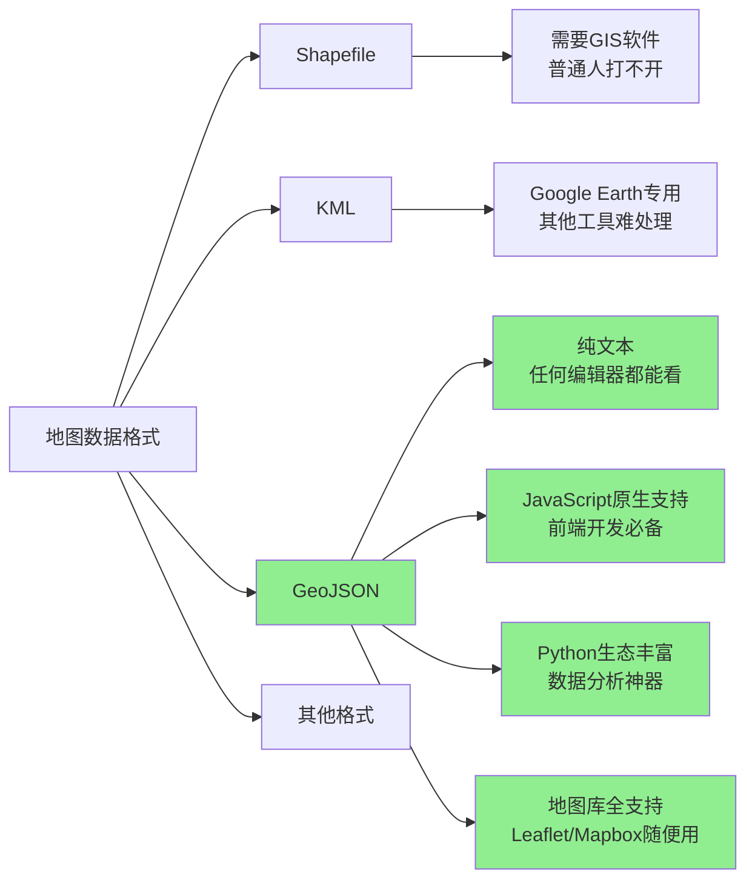

看到没有？在这些格式中，GeoJSON是**最接地气**的那个——不需要任何专业软件，普通的文本编辑器就能查看和编辑；JavaScript原生支持，是前端地图开发的事实标准；Python有强大的geopandas、fiona等库支持；几乎所有地图可视化库都能读它。

---

## 第一步：理解GeoJSON的核心结构

让我先给你看一个最简单的GeoJSON例子——一个坐标点：

```json
{
  "type": "Feature",
  "geometry": {
    "type": "Point",
    "coordinates": [116.397128, 39.916527]
  },
  "properties": {
    "name": "天安门广场",
    "city": "北京"
  }
}
```

看到没？GeoJSON的核心由三部分组成：

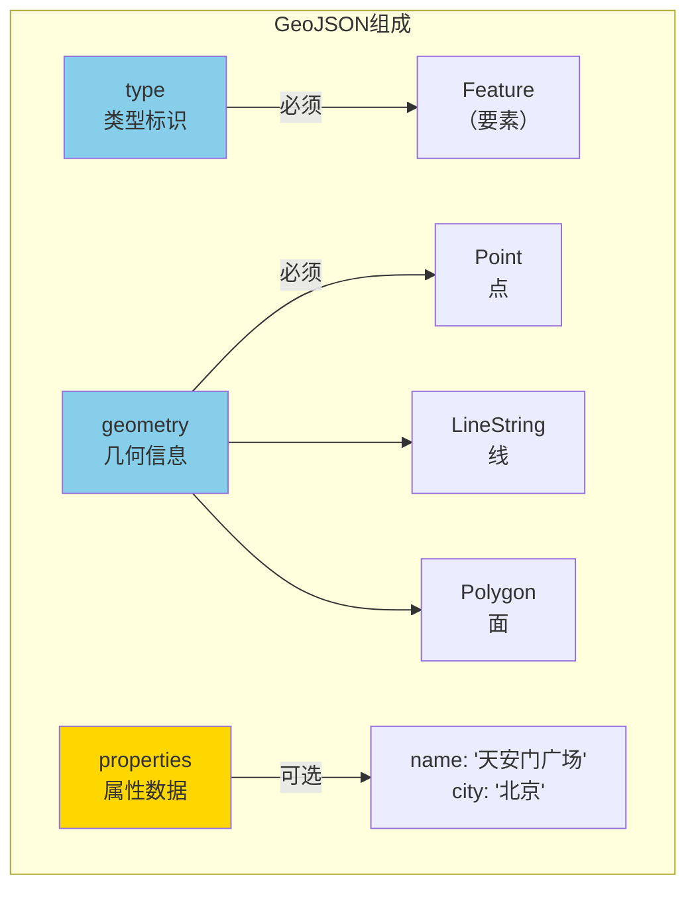

**type字段**：必须！告诉别人这是什么东西，可以是`Feature`（单个要素）、`FeatureCollection`（要素集合）、`Point`、`LineString`、`Polygon`等。

**geometry字段**：必须！描述地理形状。类型有：
- **Point** - 一个点
- **LineString** - 一条线（多个点连成的折线）
- **Polygon** - 一个面（闭合的多边形）
- **MultiPoint** - 多个点
- **MultiLineString** - 多条线
- **MultiPolygon** - 多个面

**coordinates字段**：坐标数组。**特别注意**：顺序是**[经度, 纬度]**！经度在前，纬度在后！这是初学者最容易踩的坑。

**properties字段**：可选。存放你想要关联的其他信息，比如名称、描述、人口、面积等。

---

## 第二步：实战！5种经典GeoJSON案例

光说不练假把式，让我带你五种��景走一遍。

### 场景一：标记一个地点（Point）

我想标记故宫的位置：

```json
{
  "type": "Feature",
  "geometry": {
    "type": "Point",
    "coordinates": [116.397128, 39.916527]
  },
  "properties": {
    "name": "故宫",
    "level": "世界文化遗产",
    "visitors": 2000000
  }
}
```

在地图上，它就长这样：

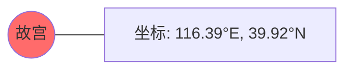

### 场景二：画一条路线（LineString）

我想画一条从天安门到故宫的步行路线：

```json
{
  "type": "Feature",
  "geometry": {
    "type": "LineString",
    "coordinates": [
      [116.397128, 39.916527],
      [116.397500, 39.917000],
      [116.398000, 39.917500],
      [116.397402, 39.916527]
    ]
  },
  "properties": {
    "name": "天安门-故宫步行路线",
    "distance": "约1公里",
    "time": "约15分钟"
  }
}
```

图形化理解：

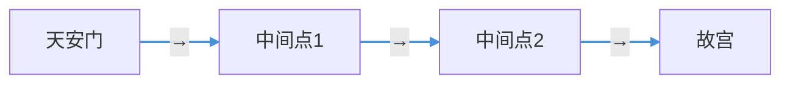

看！坐标点按顺序连成一条线。注意最后又回到起点，形成闭合路线。

### 场景三：画一个区域（Polygon）

我想画出北京市的范围（简化示例）：

```json
{
  "type": "Feature",
  "geometry": {
    "type": "Polygon",
    "coordinates": [[
      [116.2, 39.8],
      [116.6, 39.8],
      [116.6, 40.2],
      [116.2, 40.2],
      [116.2, 39.8]
    ]]
  },
  "properties": {
    "name": "北京市主城区",
    "area": "约1000平方公里"
  }
}
```

**Polygon的关键**：坐标必须首尾相连，形成闭合区域！看，第一个点和最后一个点都是`[116.2, 39.8]`，这样才是封闭的多边形。

图形理解：

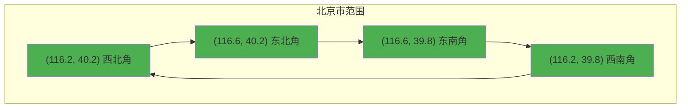

### 场景四：要素集合（FeatureCollection）

单个地点不够用，我要标记一座城市的所有地铁站：

```json
{
  "type": "FeatureCollection",
  "features": [
    {
      "type": "Feature",
      "geometry": {
        "type": "Point",
        "coordinates": [116.397128, 39.916527]
      },
      "properties": {
        "name": "天安门东站",
        "line": "1号线"
      }
    },
    {
      "type": "Feature",
      "geometry": {
        "type": "Point",
        "coordinates": [116.427000, 39.920000]
      },
      "properties": {
        "name": "望京站",
        "line": "14号线"
      }
    },
    {
      "type": "Feature",
      "geometry": {
        "type": "Point",
        "coordinates": [116.433000, 39.941000]
      },
      "properties": {
        "name": "中关村站",
        "line": "4号线"
      }
    }
  ]
}
```

这就是**FeatureCollection**的作用——把多个Feature打包在一起。看结构：

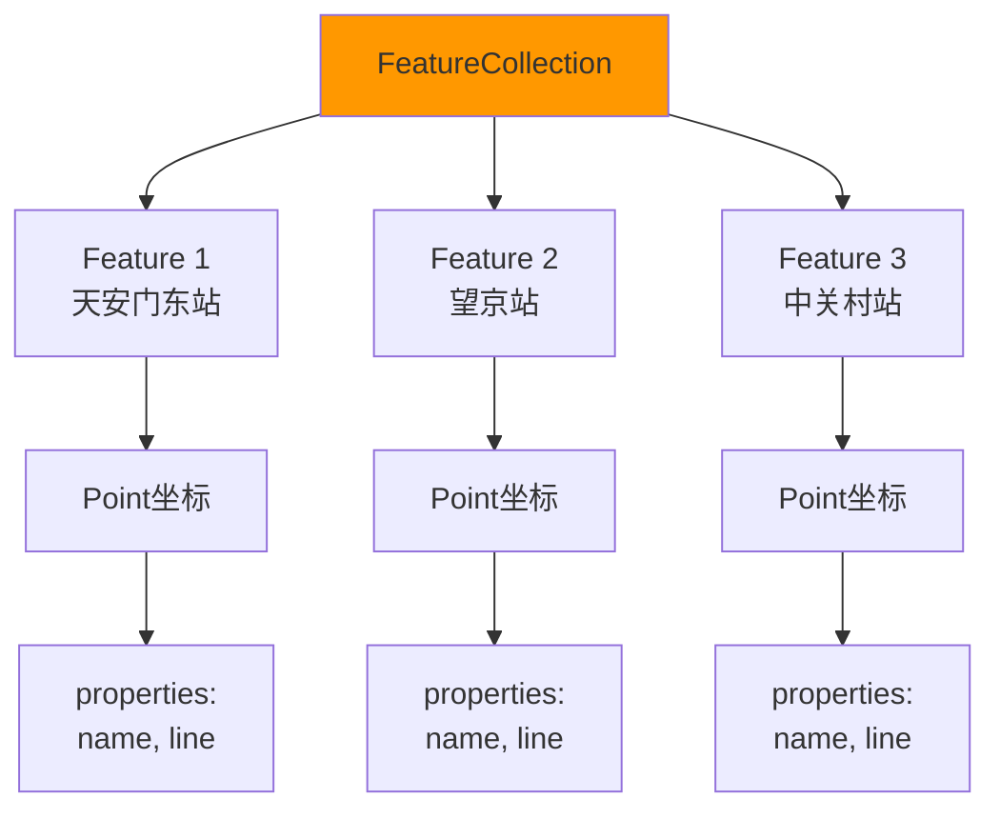

### 场景五：复杂多边形（带洞的面）

我想画一个包含湖心的公园——湖是"洞"，不能建建筑物：

```json
{
  "type": "Feature",
  "geometry": {
    "type": "Polygon",
    "coordinates": [
      [
        [116.3, 39.9],
        [116.4, 39.9],
        [116.4, 40.0],
        [116.3, 40.0],
        [116.3, 39.9]
      ],
      [
        [116.33, 39.93],
        [116.37, 39.93],
        [116.37, 39.95],
        [116.33, 39.95],
        [116.33, 39.93]
      ]
    ]
  },
  "properties": {
    "name": "颐和园",
    "note": "第二个环是昆明湖"
  }
}
```

**多坐标环**：第一个环是公园外边界，第二个环是里面的湖（洞）。理解一下：

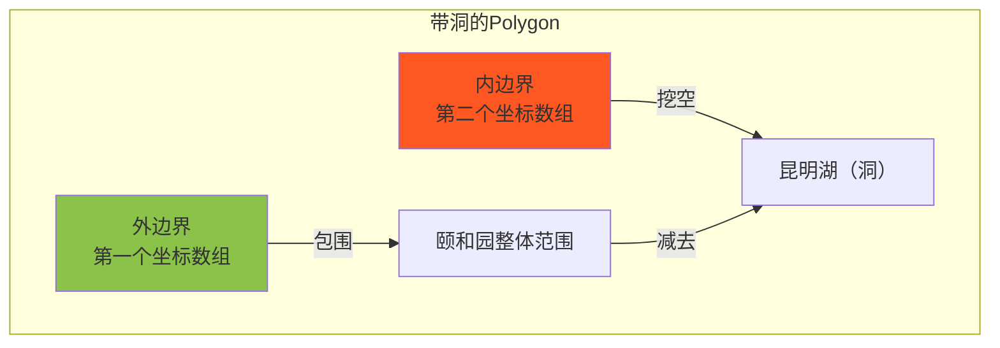

---

## 第三步：坐标参考系统（CRS）——容易被忽略的关键

GeoJSON中的坐标默认是**WGS84坐标系**（GPS同款），就是"经纬度"那种。

但有时候，你会看到这样的代码：

```json
{
  "type": "Feature",
  "crs": {
    "type": "name",
    "properties": {
      "name": "urn:ogc:def:crs:EPSG::32650"
    }
  },
  "geometry": {
    "type": "Point",
    "coordinates": [500000, 4000000]
  }
}
```

这个`crs`字段就是**坐标参考系统**的声明。`EPSG::32650`是UTM带50zone，在中国的东部地区常用。

**记住**：大多数情况下，你不需要写crs字段，默认WGS84就够用了。但如果你的坐标看起来是很大的数字（比如几十万），那很可能用的是其他CRS，需要声明。

---

## 第四步：如何验证和查看GeoJSON？

写好的GeoJSON对不对？教你最简单的验证方法。

### 方法一：在线验证工具

推荐几个免费好用的：

1. **geojson.io**（ geojson.io ）
   - 把代码贴上去，地图直接就画出来了
   - 左边写代码，右边看地图，所见即所得

2. **GeoJSONLint**（ geojsonlint.com ）
   - 纯验证工具，专门检查格式错误
   - 报错误像ESLint一样清晰

### 方法二：命令行验证（适合程序员）

```bash
# 安装geojsonhint
npm install -g geojsonhint

# 验证文件
geojsonhint your-file.geojson
```

报错会这样显示：

```
your-file.geojson
  line 15, col 5:  Error: "coordinates" must be array of positions
  ↳ "type": "Point"
```

### 方法三：Python验证

```python
from geojson import GeoJSON
import geojson

# 读取并验证
with open('data.geojson', 'r') as f:
    data = geojson.load(f)
    
# 检查是否有效
valid = geojson.is_valid(data)
print(f"是否有效: {valid}")
```

---

## 第五步：Python处理GeoJSON实战

Python是处理地理数据的瑞士军刀，教你几招最常用的。

### 基础读取

```python
import geojson

# 读取GeoJSON文件
with open('beijing_stations.geojson', 'r', encoding='utf-8') as f:
    data = geojson.load(f)

# 看结构
print(f"类型: {data['type']}")
print(f"要素数量: {len(data['features'])}")
```

### 读取所有坐标

```python
import geojson

with open('data.geojson', 'r') as f:
    data = geojson.load(f)

for feature in data['features']:
    coords = feature['geometry']['coordinates']
    props = feature['properties']
    print(f"{props.get('name', '未命名')}: {coords}")
```

### 创建GeoJSON

```python
import geojson

# 创建一个点
point = geojson.Point([116.397128, 39.916527])
feature = geojson.Feature(geometry=point, properties={"name": "故宫"})

print(geojson.dumps(feature, ensure_ascii=False, indent=2))
```

### 用geopandas处理（进阶）

```python
import geopandas as gpd

# 读取GeoJSON
gdf = gpd.read_file('data.geojson')

# 查看属性
print(gdf.head())

# 空间查询：找出在某区域内的点
gdf['geometry'].within(polygon)
```

---

## 第六步：前端地图应用——Leaflet示例

Leaflet是前端最流行的开源地图库，来看看怎么用GeoJSON。

### 基础加载

```html
<!DOCTYPE html>
<html>
<head>
    <title>GeoJSON示例</title>
    <link rel="stylesheet" href="https://unpkg.com/leaflet@1.9.4/dist/leaflet.css" />
    <script src="https://unpkg.com/leaflet@1.9.4/dist/leaflet.js"></script>
</head>
<body>
    <div id="map" style="height: 500px;"></div>
    
    <script>
        // 初始化地图，中心对准北京
        var map = L.map('map').setView([39.9042, 116.4074], 11);
        
        // 添加底图（图层）
        L.tileLayer('https://{s}.tile.openstreetmap.org/{z}/{x}/{y}.png', {
            attribution: '© OpenStreetMap contributors'
        }).addTo(map);
        
        // GeoJSON数据
        var geojsonData = {
            "type": "FeatureCollection",
            "features": [{
                "type": "Feature",
                "geometry": {
                    "type": "Point",
                    "coordinates": [116.397128, 39.916527]
                },
                "properties": {
                    "name": "故宫",
                    "description": "明清两代皇家宫殿"
                }
            }]
        };
        
        // 加载GeoJSON图层
        L.geoJSON(geojsonData, {
            onEachFeature: function(feature, layer) {
                // 点击显示弹出框
                layer.bindPopup(
                    '<b>' + feature.properties.name + '</b><br>' + 
                    feature.properties.description
                );
            }
        }).addTo(map);
    </script>
</body>
</html>
```

效果是这样的：

```mermaid
graph TD
    subgraph "网页显示"
        A["Leaflet地图"] --> B["底图\n（OpenStreetMap）"]
        A --> C["GeoJSON图层\n（红色标记点）"]
        C --> D["点击弹出\n'故宫\\n明清两代...'"
    end
    
    style A fill:#4CAF50
    style B fill:#E0E0E0
    style C fill:#FF6B6B
    style D fill:#FFF59D
```

### 样式自定义

```javascript
L.geoJSON(geojsonData, {
    // 点的样式
    pointToLayer: function(feature, latlng) {
        return L.circleMarker(latlng, {
            radius: 8,
            fillColor: '#ff7800',
            color: '#ffffff',
            weight: 2,
            opacity: 1,
            fillOpacity: 0.8
        });
    },
    
    // 点的弹出信息
    onEachFeature: function(feature, layer) {
        if (feature.properties.name) {
            layer.bindPopup(feature.properties.name);
        }
    }
}).addTo(map);
```

### 线面样式

```javascript
L.geoJSON(geojsonData, {
    style: function(feature) {
        return {
            color: '#3388ff',
            weight: 3,
            opacity: 0.6
        };
    }
}).addTo(map);
```

---

### 问题一：坐标顺序混淆

❌ 错误写法：
```json
"coordinates": [39.916527, 116.397128]
```

✅ 正确写法：
```json
"coordinates": [116.397128, 39.916527]
```

**记住**：经度(longitude)在前面，纬度(latitude)在后面！经度范围是-180到180，纬度是-90到90。搞反了的话，点的位置会跑到奇怪的地方去。

### 问题二：Polygon未闭合

❌ 错误写法（首尾不相连）：
```json
"coordinates": [[
  [116.2, 39.8],
  [116.4, 39.8],
  [116.4, 40.0],
  [116.2, 40.0]
]]
```

✅ 正确写法（首尾相连）：
```json
"coordinates": [[
  [116.2, 39.8],
  [116.4, 39.8],
  [116.4, 40.0],
  [116.2, 40.0],
  [116.2, 39.8]  
]]
```

### 问题三：多坐标环顺序

对于带洞的Polygon：

❌ 错误：内环在外环外面
✅ 正确：第一个环是外边界（公园），后面的环是内边界（湖）

### 问题四：中文字符编码

❌ 写入文件时忘记指定编码
```python
with open('out.geojson', 'w') as f:  # 缺encoding
    json.dump(data, f)
```

✅ 指定utf-8编码
```python
with open('out.geojson', 'w', encoding='utf-8') as f:
    json.dump(data, f, ensure_ascii=False, indent=2)
```

### 问题五：坐标太多导致文件过大

如果你的GeoJSON有几十万个点，文件会很大。解决方法：

```python
import geojson

# 使用TopoJSON格式（压缩）
# 或者简化坐标精度
def reduce_precision(coords, precision=5):
    """减少坐标小数位数"""
    return [round(c, precision) for c in coords]
```

---

## 第八步：一个完整的小项目

学会了吗？来，我们做个完整的练习——"北京市区热门景点地图"。

### 第一步：准备GeoJSON数据（beijing_attractions.geojson）

```json
{
  "type": "FeatureCollection",
  "features": [
    {
      "type": "Feature",
      "geometry": {
        "type": "Point",
        "coordinates": [116.397128, 39.916527]
      },
      "properties": {
        "name": "故宫博物院",
        "category": "历史古迹",
        "rating": 4.9
      }
    },
    {
      "type": "Feature",
      "geometry": {
        "type": "Point",
        "coordinates": [116.397128, 39.913264]
      },
      "properties": {
        "name": "天安门广场",
        "category": "广场",
        "rating": 4.7
      }
    },
    {
      "type": "Feature",
      "geometry": {
        "type": "Point",
        "coordinates": [116.318, 40.014]
      },
      "properties": {
        "name": "颐和园",
        "category": "公园",
        "rating": 4.8
      }
    },
    {
      "type": "Feature",
      "geometry": {
        "type": "Point",
        "coordinates": [116.340, 39.999]
      },
      "properties": {
        "name": "圆明园",
        "category": "公园",
        "rating": 4.6
      }
    },
    {
      "type": "Feature",
      "geometry": {
        "type": "Point",
        "coordinates": [116.412, 39.988]
      },
      "properties": {
        "name": "鸟巢",
        "category": "体育场馆",
        "rating": 4.5
      }
    }
  ]
}
```

### 第二步：创建地图页面（index.html）

```html
<!DOCTYPE html>
<html>
<head>
    <meta charset="UTF-8">
    <title>北京热门景点地图</title>
    <link rel="stylesheet" href="https://unpkg.com/leaflet@1.9.4/dist/leaflet.css" />
    <style>
        body { margin: 0; padding: 0; }
        #map { height: 100vh; width: 100%; }
        .info-box {
            position: absolute;
            top: 10px;
            right: 10px;
            background: white;
            padding: 15px;
            border-radius: 8px;
            box-shadow: 0 2px 10px rgba(0,0,0,0.2);
            z-index: 1000;
            max-width: 250px;
        }
    </style>
</head>
<body>
    <div id="map"></div>
    <div class="info-box">
        <h3>北京热门景点</h3>
        <p>点击标记查看详情</p>
    </div>

    <script src="https://unpkg.com/leaflet@1.9.4/dist/leaflet.js"></script>
    <script src="https://code.jquery.com/jquery-3.6.0.min.js"></script>
    <script>
        // 1. 初始化地图
        var map = L.map('map').setView([39.95, 116.38], 11);

        // 2. 添加底图
        L.tileLayer('https://{s}.tile.openstreetmap.org/{z}/{x}/{y}.png', {
            attribution: '© OpenStreetMap'
        }).addTo(map);

        // 3. 自定义标记图标
        var customIcon = L.icon({
            iconUrl: 'https://unpkg.com/leaflet@1.9.4/dist/images/marker-icon.png',
            iconSize: [25, 41],
            iconAnchor: [12, 41]
        });

        // 4. 加载GeoJSON
        $.getJSON('beijing_attractions.geojson', function(data) {
            L.geoJSON(data, {
                pointToLayer: function(feature, latlng) {
                    return L.marker(latlng, {icon: customIcon});
                },
                onEachFeature: function(feature, layer) {
                    var props = feature.properties;
                    var popupContent = `
                        <b>${props.name}</b><br>
                        类别: ${props.category}<br>
                        评分: ${props.rating}
                    `;
                    layer.bindPopup(popupContent);
                }
            }).addTo(map);
        });
    </script>
</body>
</html>
```

运行效果：

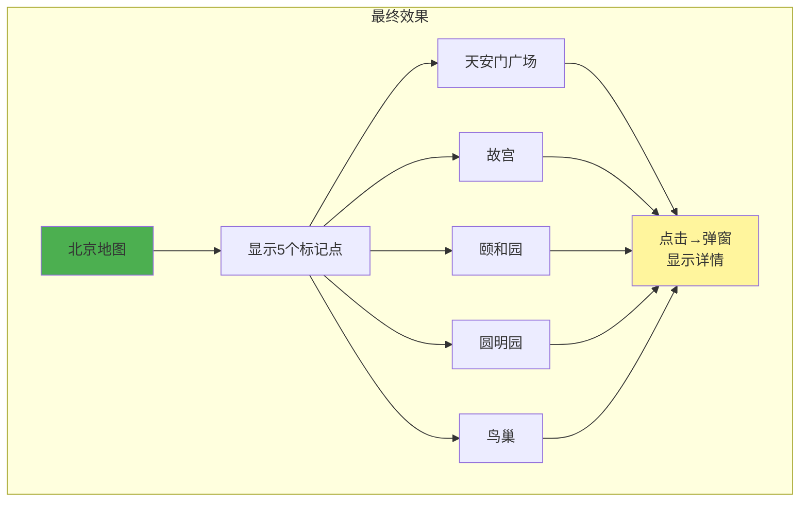

---

让我给你画一张"总览图"，把今天学的全串起来：

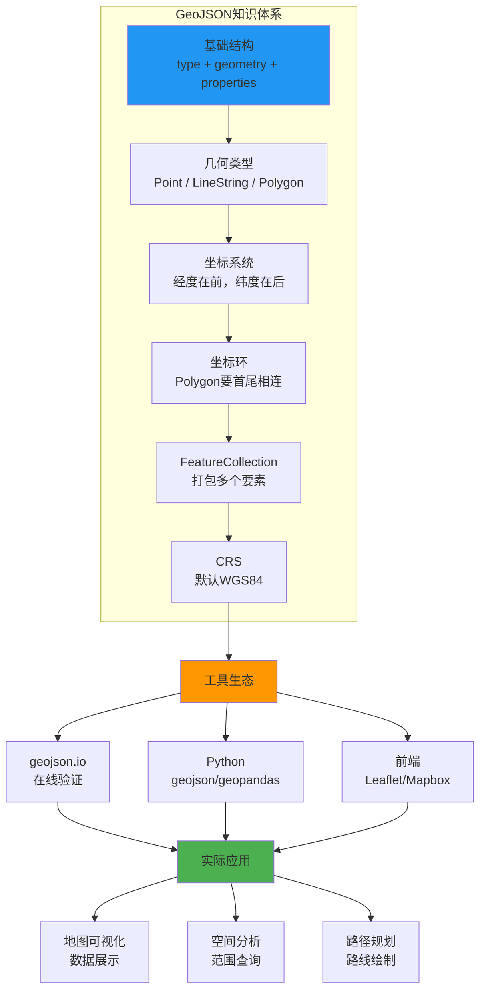

---

# GeoJSON 完全指南：从零开始，一步步搞懂地图数据的通用语言

> 你有没有想过，当你在手机上点开外卖App，看到餐厅的定位图标；当你在地图上画一个多边形圈出"我家附近3公里"；当你用导航软件规划路线时——这些地理信息，在计算机眼里到底长什么样？

答案就是：**GeoJSON**。

它是地理信息世界的"普通话"，几乎所有地图应用、空间数据库、可视化工具都能听懂它。今天，我们就从零开始，一步步把 GeoJSON 彻底搞明白。

---

## 一、先搞清楚：GeoJSON 到底是什么？

### 1.1 一句话定义

**GeoJSON 是一种基于 JSON 的地理空间数据交换格式**，用来编码各种地理数据结构。

说白了，它就是一个 JSON 文件，只不过里面装的不是普通的键值对，而是**点、线、面**这些地理信息。

### 1.2 它是怎么来的？

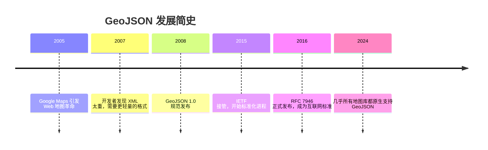

在 GeoJSON 出现之前，地理数据的交换格式主要是 **Shapefile** 和 **KML**。但 Shapefile 需要至少3个文件配合使用，KML 基于 XML 又太臃肿。GeoJSON 的出现，就像 REST API 之于 SOAP——**简单、轻量、好上手**。

### 1.3 GeoJSON vs 其他地理数据格式

| 特性 | GeoJSON | Shapefile | KML | TopoJSON |
|------|---------|-----------|-----|----------|
| 格式基础 | JSON | 二进制 | XML | JSON |
| 文件数量 | 1个 | 至少3个 | 1个 | 1个 |
| 可读性 | 极高 | 极低 | 中等 | 高 |
| 浏览器友好 | 原生支持 | 不支持 | 需解析 | 原生支持 |
| 数据体积 | 较大 | 较小 | 大 | 较小 |
| 拓扑支持 | 不支持 | 不支持 | 不支持 | 支持 |
| 学习成本 | 低 | 高 | 中 | 中 |

**结论**：如果你做 Web 地图开发，GeoJSON 几乎是不二之选。

---

## 二、GeoJSON 的核心骨架：先看全貌，再拆零件

一个完整的 GeoJSON 文件，看起来是这样的：

```json
{
  "type": "FeatureCollection",
  "features": [
    {
      "type": "Feature",
      "geometry": {
        "type": "Point",
        "coordinates": [116.397428, 39.90923]
      },
      "properties": {
        "name": "天安门",
        "city": "北京"
      }
    }
  ]
}
```

别被这堆花括号吓到，我们一步步拆解。

### 2.1 GeoJSON 的层级结构

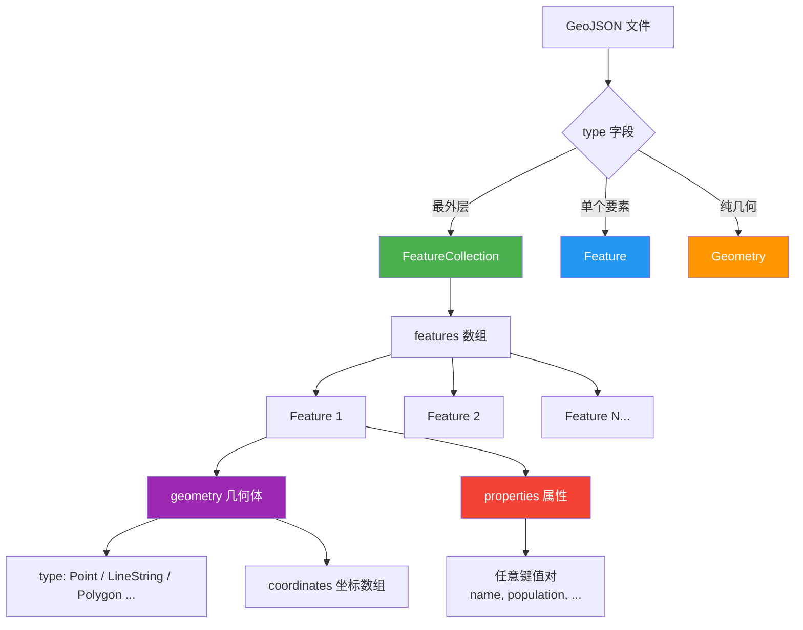

记住这个核心公式：

> **GeoJSON = 类型(type) + 几何(geometry) + 属性(properties)**

---

## 三、七种几何类型：GeoJSON 的灵魂

GeoJSON 支持七种几何类型，每种对应现实世界中的不同地理对象：

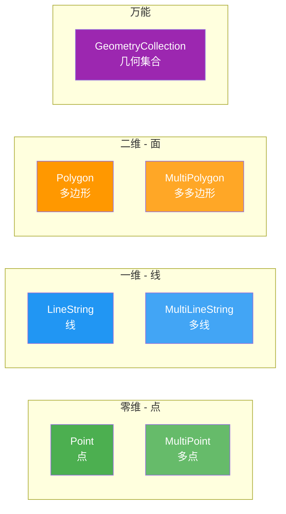

### 3.1 Point（点）—— 最简单的几何

点用来表示**一个具体的位置**，比如：你家的地址、一家餐厅的位置、一个城市中心。

```json
{
  "type": "Point",
  "coordinates": [116.397428, 39.90923]
}
```

**重点提醒**：GeoJSON 的坐标顺序是 **[经度, 纬度]**，即 `[longitude, latitude]`！

这一点非常容易搞反。很多初学者习惯性地写成 `[纬度, 经度]`，结果地图上的点飞到了南极或者大洋中间。记住：

> **经度在前，纬度在后。先 x 后 y，先 lng 后 lat。**

| 地点 | 经度(longitude) | 纬度(latitude) | GeoJSON 坐标 |
|------|-----------------|----------------|--------------|
| 北京天安门 | 116.397428 | 39.90923 | [116.397428, 39.90923] |
| 上海东方明珠 | 121.4955 | 31.2422 | [121.4955, 31.2422] |
| 广州塔 | 113.3244 | 23.1066 | [113.3244, 23.1066] |

### 3.2 MultiPoint（多点）—— 一组点

当你需要同时表示多个位置，且它们属于同一个逻辑实体时，用多点：

```json
{
  "type": "MultiPoint",
  "coordinates": [
    [116.397428, 39.90923],
    [121.4955, 31.2422],
    [113.3244, 23.1066]
  ]
}
```

**什么时候用？** 比如：一个连锁品牌的所有门店位置，可以作为一个 MultiPoint。

### 3.3 LineString（线）—— 从 A 到 B 的路径

线由两个或更多的点连接而成，用来表示**道路、河流、航线**等。

```json
{
  "type": "LineString",
  "coordinates": [
    [116.397428, 39.90923],
    [117.200983, 39.084158],
    [117.345905, 38.0357]
  ]
}
```

这条线从北京出发，经过天津，到达石家庄——三点连成一条折线。

**注意**：只有两个点的 LineString 就是最简单的直线段。

### 3.4 MultiLineString（多线）—— 多条路径

```json
{
  "type": "MultiLineString",
  "coordinates": [
    [[116.397428, 39.90923], [117.200983, 39.084158]],
    [[121.4955, 31.2422], [120.1551, 30.2741]]
  ]
}
```

**什么时候用？** 比如：北京到天津是一条线，上海到杭州是另一条线，它们属于同一个"交通规划"项目，就用 MultiLineString。

### 3.5 Polygon（多边形）—— 最容易出错的类型

多边形用来表示**区域、范围、边界**，比如：一个公园的范围、一个省份的边界、一个商圈的覆盖区域。

**普通多边形**（没有洞）：

```json
{
  "type": "Polygon",
  "coordinates": [
    [
      [116.38, 39.90],
      [116.40, 39.90],
      [116.40, 39.92],
      [116.38, 39.92],
      [116.38, 39.90]
    ]
  ]
}
```

**几个关键规则**：

1. **坐标数组的第0层是数组**——注意 `coordinates` 里面套了一层方括号
2. **首尾坐标必须相同**——形成闭合环
3. **遵循右手定则**——外环逆时针，内环顺时针（RFC 7946 规定外环逆时针，但实际很多库都能自动处理）

**带洞的多边形**（想象一个甜甜圈）：

```json
{
  "type": "Polygon",
  "coordinates": [
    [
      [116.36, 39.88],
      [116.42, 39.88],
      [116.42, 39.94],
      [116.36, 39.94],
      [116.36, 39.88]
    ],
    [
      [116.38, 39.90],
      [116.40, 39.90],
      [116.40, 39.92],
      [116.38, 39.92],
      [116.38, 39.90]
    ]
  ]
}
```

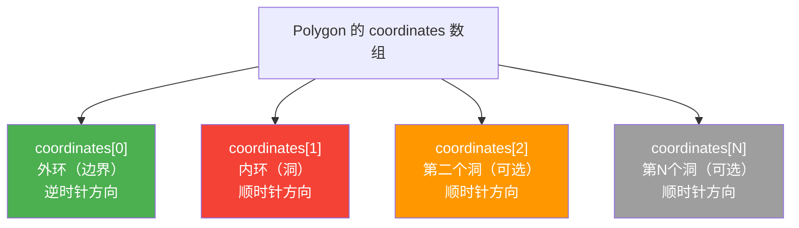

**现实中的例子**：一个公园的边界内有一个湖，那么公园是外环，湖是内环（洞）。在地图上，湖的区域不会被标记为公园。

### 3.6 MultiPolygon（多多边形）—— 复杂的区域

```json
{
  "type": "MultiPolygon",
  "coordinates": [
    [
      [[116.36, 39.88], [116.42, 39.88], [116.42, 39.94], [116.36, 39.94], [116.36, 39.88]]
    ],
    [
      [[121.47, 31.22], [121.52, 31.22], [121.52, 31.28], [121.47, 31.28], [121.47, 31.22]]
    ]
  ]
}
```

**什么时候用？** 最经典的例子：**海南省**——它包括海南岛和南海诸岛，这些岛屿互不相连，所以需要用 MultiPolygon 来表示。

### 3.7 GeometryCollection（几何集合）—— 什么都能装

```json
{
  "type": "GeometryCollection",
  "geometries": [
    {
      "type": "Point",
      "coordinates": [116.397428, 39.90923]
    },
    {
      "type": "LineString",
      "coordinates": [[116.397428, 39.90923], [117.200983, 39.084158]]
    }
  ]
}
```

GeometryCollection 可以把不同类型的几何体放在一块。但说实话，**实际项目中用得很少**，因为大多数地图库对它的支持不如 FeatureCollection 好。

---

## 四、坐标嵌套规则：GeoJSON 最烧脑的部分

不同几何类型的 `coordinates` 嵌套层数不同，这是新手最容易搞混的地方。我们来做一个清晰的对照：

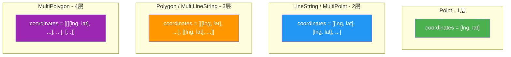

**记忆口诀**：

| 几何类型 | 嵌套层数 | 记忆方式 |
|----------|---------|---------|
| Point | 1层 | 就是一个坐标 |
| LineString | 2层 | 点的数组 |
| MultiPoint | 2层 | 点的数组 |
| Polygon | 3层 | 环的数组，环是点的数组 |
| MultiLineString | 3层 | 线的数组，线是点的数组 |
| MultiPolygon | 4层 | 面的数组，面是环的数组，环是点的数组 |

---

## 五、Feature 和 FeatureCollection：给几何体穿上"属性外衣"

### 5.1 Feature —— 几何体 + 属性

光有几何体，我们只知道"在哪里"，但不知道"那是什么"。Feature 就是给几何体加上属性信息：

```json
{
  "type": "Feature",
  "geometry": {
    "type": "Point",
    "coordinates": [116.397428, 39.90923]
  },
  "properties": {
    "name": "天安门",
    "category": "景点",
    "rating": 5.0,
    "openingHours": "08:30-17:00",
    "ticketPrice": 0
  }
}
```

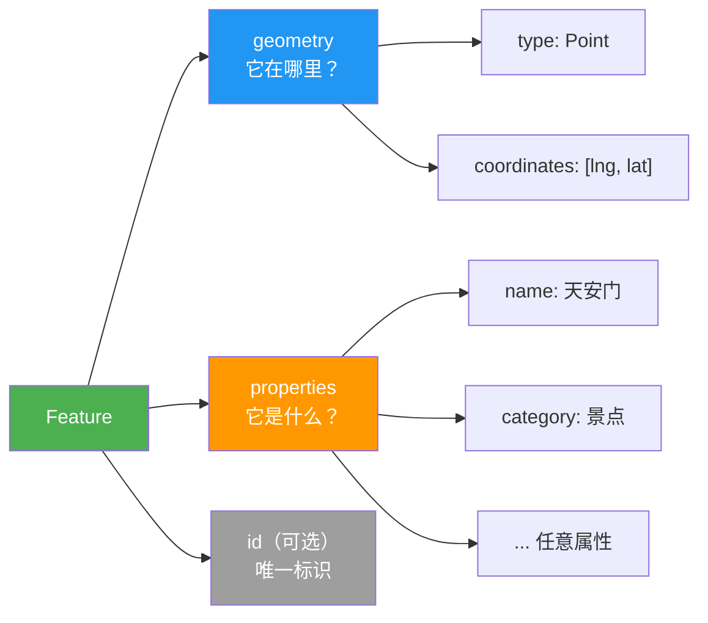

**properties 里可以放什么？** 答案是：**任何你想要的键值对**。字符串、数字、布尔值、数组、嵌套对象，都行。这就是 GeoJSON 的灵活性所在。

### 5.2 FeatureCollection —— 最常用的顶层结构

FeatureCollection 是最外层的容器，它把多个 Feature 包在一起：

```json
{
  "type": "FeatureCollection",
  "features": [
    {
      "type": "Feature",
      "geometry": {
        "type": "Point",
        "coordinates": [116.397428, 39.90923]
      },
      "properties": {
        "name": "天安门",
        "type": "景点"
      }
    },
    {
      "type": "Feature",
      "geometry": {
        "type": "Point",
        "coordinates": [121.4955, 31.2422]
      },
      "properties": {
        "name": "东方明珠",
        "type": "景点"
      }
    }
  ]
}
```

**在实际项目中，90%以上的 GeoJSON 文件都是 FeatureCollection**。它是最通用、兼容性最好的格式。

---

## 六、bbox：给你的数据画一个"包围框"

`bbox`（bounding box）是 GeoJSON 中一个可选但很有用的字段，它用一个矩形框住所有数据：

```json
{
  "type": FeatureCollection",
  "bbox": [116.36, 39.88, 121.52, 31.28],
  "features": [...]
}
```

**bbox 的格式**：`[最小经度, 最小纬度, 最大经度, 最大纬度]`

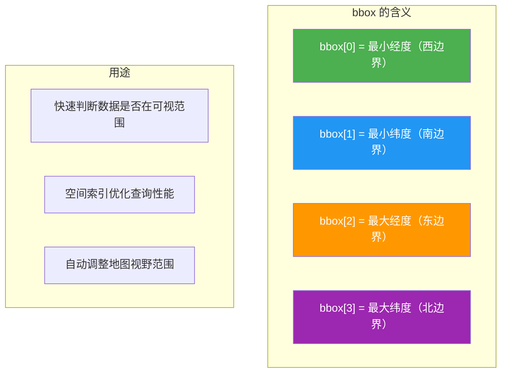

**为什么重要？** 当你有几万个点时，如果没有 bbox，地图库要遍历所有数据才能确定显示范围。有了 bbox，一读文件就知道数据的大致范围，可以快速设置地图的初始视角。

---

## 七、实战演练：从零构建一个完整的 GeoJSON

让我们模拟一个真实场景——**记录一个城市的咖啡店分布**。

### 第一步：确定需求和数据结构

我们要记录：
- 每家咖啡店的位置（Point）
- 店名、评分、营业时间
- 整个数据集的范围（bbox）

### 第二步：构建 FeatureCollection 的外壳

```json
{
  "type": "FeatureCollection",
  "bbox": [116.30, 39.90, 116.50, 40.00],
  "features": []
}
```

### 第三步：添加第一家店

```json
{
  "type": "Feature",
  "id": "coffee_001",
  "geometry": {
    "type": "Point",
    "coordinates": [116.397428, 39.90923]
  },
  "properties": {
    "name": "星巴克（王府井店）",
    "brand": "Starbucks",
    "rating": 4.5,
    "address": "北京市东城区王府井大街",
    "openingHours": "07:00-22:00",
    "wifi": true
  }
}
```

### 第四步：添加更多店铺，完成完整文件

```json
{
  "type": "FeatureCollection",
  "bbox": [116.30, 39.90, 116.50, 40.00],
  "features": [
    {
      "type": "Feature",
      "id": "coffee_001",
      "geometry": {
        "type": "Point",
        "coordinates": [116.397428, 39.90923]
      },
      "properties": {
        "name": "星巴克（王府井店）",
        "brand": "Starbucks",
        "rating": 4.5,
        "address": "北京市东城区王府井大街",
        "openingHours": "07:00-22:00",
        "wifi": true
      }
    },
    {
      "type": "Feature",
      "id": "coffee_002",
      "geometry": {
        "type": "Point",
        "coordinates": [116.413215, 39.928782]
      },
      "properties": {
        "name": "瑞幸（簋街店）",
        "brand": "Luckin",
        "rating": 4.2,
        "address": "北京市东城区东直门内大街",
        "openingHours": "08:00-21:00",
        "wifi": false
      }
    },
    {
      "type": "Feature",
      "id": "coffee_003",
      "geometry": {
        "type": "Point",
        "coordinates": [116.372445, 39.942331]
      },
      "properties": {
        "name": "Manner（鼓楼店）",
        "brand": "Manner",
        "rating": 4.8,
        "address": "北京市西城区鼓楼西大街",
        "openingHours": "07:30-20:00",
        "wifi": false
      }
    }
  ]
}
```

### 第五步：在地图上展示

用 Leaflet（最流行的前端地图库）展示这段数据，只需要几行代码：

```html
<!DOCTYPE html>
<html>
<head>
  <link rel="stylesheet" href="https://unpkg.com/leaflet@1.9.4/dist/leaflet.css" />
  <script src="https://unpkg.com/leaflet@1.9.4/dist/leaflet.js"></script>
</head>
<body>
  <div id="map" style="height: 100vh;"></div>
  <script>
    // 创建地图，中心点设为北京
    var map = L.map('map').setView([39.92, 116.40], 13);

    // 添加底图
    L.tileLayer('https://{s}.tile.openstreetmap.org/{z}/{x}/{y}.png').addTo(map);

    // 加载 GeoJSON 数据
    var coffeeData = {
      "type": "FeatureCollection",
      "features": [
        {
          "type": "Feature",
          "geometry": {"type": "Point", "coordinates": [116.397428, 39.90923]},
          "properties": {"name": "星巴克（王府井店）", "brand": "Starbucks"}
        },
        {
          "type": "Feature",
          "geometry": {"type": "Point", "coordinates": [116.413215, 39.928782]},
          "properties": {"name": "瑞幸（簋街店）", "brand": "Luckin"}
        }
      ]
    };

    // 渲染到地图上
    L.geoJSON(coffeeData, {
      onEachFeature: function(feature, layer) {
        layer.bindPopup(feature.properties.name);
      }
    }).addTo(map);
  </script>
</body>
</html>
```

就这样，一个可交互的地图应用就出来了——点击标记就能看到店名。

---

## 八、进阶：用线和多边形画更丰富的地图

### 8.1 画一条路线（LineString）

假设我们要记录一条骑行路线：

```json
{
  "type": "Feature",
  "geometry": {
    "type": "LineString",
    "coordinates": [
      [116.397428, 39.90923],
      [116.40125, 39.91580],
      [116.40833, 39.92015],
      [116.41321, 39.92878],
      [116.42000, 39.93500]
    ]
  },
  "properties": {
    "name": "长安街骑行路线",
    "distance": "5.2km",
    "difficulty": "简单"
  }
}
```

### 8.2 画一个商圈范围（Polygon）

```json
{
  "type": "Feature",
  "geometry": {
    "type": "Polygon",
    "coordinates": [
      [
        [116.380, 39.900],
        [116.420, 39.900],
        [116.420, 39.930],
        [116.380, 39.930],
        [116.380, 39.900]
      ]
    ]
  },
  "properties": {
    "name": "王府井商圈",
    "area": "3.2平方公里",
    "category": "商业区"
  }
}
```

### 8.3 画一个带湖的公园（带洞的 Polygon）

```json
{
  "type": "Feature",
  "geometry": {
    "type": "Polygon",
    "coordinates": [
      [
        [116.370, 39.940],
        [116.400, 39.940],
        [116.400, 39.960],
        [116.370, 39.960],
        [116.370, 39.940]
      ],
      [
        [116.380, 39.948],
        [116.390, 39.948],
        [116.390, 39.955],
        [116.380, 39.955],
        [116.380, 39.948]
      ]
    ]
  },
  "properties": {
    "name": "北海公园",
    "lake": "北海",
    "type": "皇家园林"
  }
}
```

---

## 九、GeoJSON 的常见陷阱和避坑指南

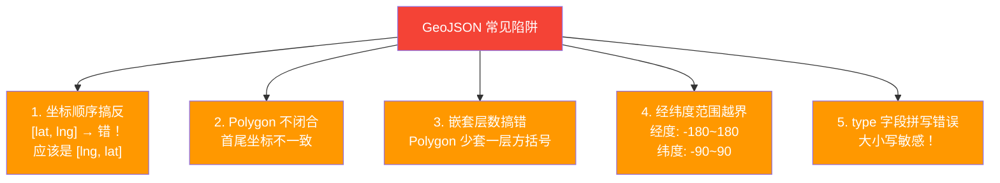

### 陷阱1：坐标顺序——经纬度之争

这是**最最最常见**的错误。GeoJSON 规范明确规定使用 `[经度, 纬度]` 顺序，但：

- Google Maps API 用的是 `{lat, lng}`
- Leaflet 的 `L.marker()` 也是 `[lat, lng]`
- 唯独 GeoJSON 是 `[lng, lat]`

**避坑方法**：在处理 GeoJSON 数据时，永远记住"先 x 后 y"。如果需要传给 Leaflet 的非 GeoJSON 接口，记得翻转。

### 陷阱2：Polygon 的闭合环

Polygon 的每个环**必须首尾坐标相同**。否则很多地图库会报错或渲染异常。

```json
// 错误 - 没有闭合
[[116.38, 39.90], [116.42, 39.90], [116.42, 39.94], [116.38, 39.94]]

// 正确 - 首尾相同
[[116.38, 39.90], [116.42, 39.90], [116.42, 39.94], [116.38, 39.94], [116.38, 39.90]]
```

### 陷阱3：Polygon 的嵌套层数

Polygon 的 coordinates 是**3层**方括号：

```json
// 错误 - 只有2层
"coordinates": [[116.38, 39.90], [116.42, 39.90], ...]

// 正确 - 3层
"coordinates": [[[116.38, 39.90], [116.42, 39.90], ...]]
```

### 陷阱4：经纬度范围

- 经度范围：-180 到 180（超出说明数据有问题）
- 纬度范围：-90 到 90（超出不可能存在）

### 陷阱5：type 字段严格区分大小写

`"Point"` 正确，`"point"` 或 `"POINT"` 都是错误的。GeoJSON 的 type 值是**大驼峰命名**，必须精确匹配。

---

## 十、工具推荐：让 GeoJSON 开发更高效

### 10.1 在线查看和编辑

| 工具 | 用途 | 地址 |
|------|------|------|
| geojson.io | 在线编辑和预览 GeoJSON | geojson.io |
| mapshaper.org | 简化、转换地理数据 | mapshaper.org |
| geojsonlint.com | 验证 GeoJSON 格式 | geojsonlint.com |

### 10.2 格式转换

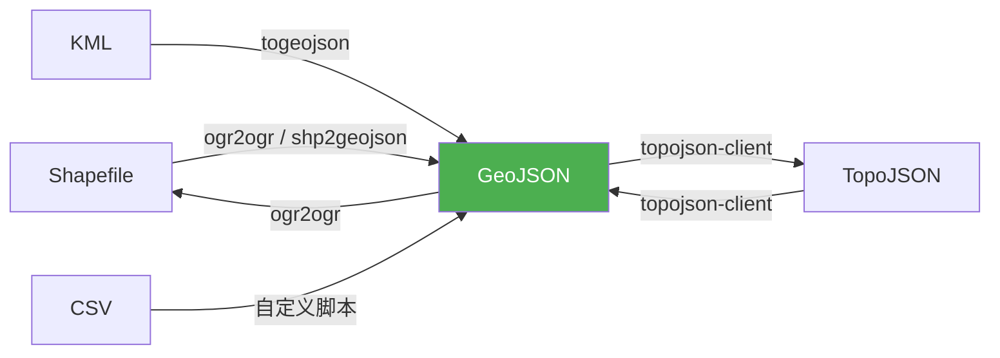

**ogr2ogr** 是最强大的转换工具，几乎能转换所有地理数据格式：

```bash
# Shapefile 转 GeoJSON
ogr2ogr -f GeoJSON output.geojson input.shp

# GeoJSON 转 Shapefile
ogr2ogr -f "ESRI Shapefile" output.shp input.geojson

# 只转换特定区域的数据（空间裁剪）
ogr2ogr -f GeoJSON -spat 116.3 39.9 116.5 40.0 output.geojson input.shp
```

### 10.3 常用编程语言库

| 语言 | 库 | 功能 |
|------|-----|------|
| JavaScript | Turf.js | 空间分析（计算距离、面积等） |
| JavaScript | geojson-precision | 坐标精度控制（减小文件体积） |
| Python | geojson | 创建和操作 GeoJSON |
| Python | geopandas | 数据分析 + GeoJSON 读写 |
| Python | shapely | 几何操作 |
| Go | geojson | 解析和生成 GeoJSON |
| Go | orb | 几何计算和 GeoJSON 处理 |
| Java | JTS | 几何操作和空间分析 |

---

## 十一、用 Turf.js 做空间分析：GeoJSON 的真正威力

GeoJSON 不只是用来"存数据"和"画地图"，配合空间分析库，它能做很多强大的事情。

### 11.1 计算两点之间的距离

```javascript
var turf = require('@turf/turf');

var point1 = turf.point([116.397428, 39.90923]); // 北京
var point2 = turf.point([121.4955, 31.2422]);   // 上海

var distance = turf.distance(point1, point2, {units: 'kilometers'});
console.log(distance); // 约 1067 公里
```

### 11.2 判断一个点是否在某个区域内

```javascript
var point = turf.point([116.397428, 39.90923]); // 天安门

var area = turf.polygon([[
  [116.38, 39.90], [116.42, 39.90],
  [116.42, 39.94], [116.38, 39.94],
  [116.38, 39.90]
]]);

var isInside = turf.booleanPointInPolygon(point, area);
console.log(isInside); // true - 天安门在这个区域内
```

### 11.3 生成缓冲区

```javascript
// 在某个点周围生成3公里范围的多边形
var point = turf.point([116.397428, 39.90923]);
var buffer = turf.buffer(point, 3, {units: 'kilometers'});

// buffer 就是一个 Polygon 类型的 GeoJSON Feature
console.log(JSON.stringify(buffer));
```

### 11.4 常用空间分析操作一览

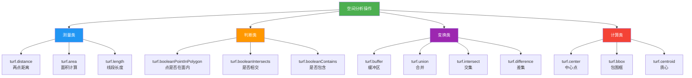

---

## 十二、GeoJSON 在真实项目中的应用场景

### 12.1 应用场景总览

```mermaid
graph TD
    A[GeoJSON 应用场景] --> B[互联网地图]
    A --> C[物流配送]
    A --> D[房地产]
    A --> E[智慧城市]
    A --> F[环境监测]
    A --> G[流行病学]

    B --> B1["商家位置标注"]
    B --> B2["路线规划"]
    B --> B3["热力图"]

    C --> C1["配送范围绘制"]
    C --> C2["骑手轨迹追踪"]
    C --> C3["最优路径计算"]

    D --> D1["楼盘位置标注"]
    D --> D2["学区划分"]
    D --> D3["周边配套分析"]

    E --> E1["监控设备部署"]
    E --> E2["城市区域规划"]
    E --> E3["公共设施分布"]

    F --> F1["污染源定位"]
    F --> F2["监测站点分布"]
    F --> F3["影响范围模拟"]

    G --> G1["病例分布地图"]
    G --> G2["风险区域划分"]
    G --> G3["传播路径追踪"]

    style A fill:#4CAF50,color:#fff
```

### 12.2 一个真实的例子：外卖配送范围

外卖平台经常需要定义"哪些区域可以配送"。这个配送范围就是一个 Polygon：

```json
{
  "type": "FeatureCollection",
  "features": [
    {
      "type": "Feature",
      "geometry": {
        "type": "Polygon",
        "coordinates": [
          [
            [116.380, 39.905],
            [116.415, 39.905],
            [116.420, 39.920],
            [116.410, 39.935],
            [116.385, 39.930],
            [116.375, 39.915],
            [116.380, 39.905]
          ]
        ]
      },
      "properties": {
        "restaurant": "麦当劳（王府井店）",
        "deliveryRadius": "3km",
        "deliveryFee": 5,
        "minOrder": 20
      }
    }
  ]
}
```

当用户下单时，系统会用 `booleanPointInPolygon` 判断用户的位置是否在配送范围内。

---

## 十三、性能优化：当 GeoJSON 文件变得很大

### 13.1 问题：数据量大时的性能瓶颈

一个包含10万个点的 GeoJSON 文件可能超过 50MB，直接加载到浏览器会导致：
- 加载时间过长
- 内存占用过大
- 渲染卡顿

### 13.2 优化策略

```mermaid
graph TD
    A[GeoJSON 性能优化] --> B["1. 精度裁剪<br/>保留4-6位小数"]
    A --> C["2. 简化几何<br/>减少坐标点数"]
    A --> D["3. 切片加载<br/>只加载可视区域"]
    A --> E["4. 格式转换<br/>TopoJSON / MVT"]
    A --> F["5. 压缩传输<br/>Gzip / Brotli"]

    style A fill:#4CAF50,color:#fff
    style B fill:#2196F3,color:#fff
    style C fill:#FF9800,color:#fff
    style D fill:#9C27B0,color:#fff
    style E fill:#F44336,color:#fff
    style F fill:#607D8B,color:#fff
```

**精度裁剪**——坐标保留6位小数已经精度到0.1米级别，足够绝大多数场景：

```javascript
var geojsonPrecision = require('geojson-precision');

// 原始：小数点后15位
var original = {
  "type": "Point",
  "coordinates": [116.397428000000000, 39.909230000000000]
};

// 裁剪为6位小数
var trimmed = geojsonPrecision(original, 6);
// 结果：[116.397428, 39.909230]
```

**几何简化**——减少多边形的坐标点数，用少量点近似原来的形状：

```javascript
var simplify = require('@turf/simplify');

var complexPolygon = { /* 有10000个点的多边形 */ };

var simplePolygon = simplify(complexPolygon, {tolerance: 0.001, highQuality: true});
// 结果可能只需要500个点就能保持视觉上的精度
```

---

## 十四、GeoJSON 与 TopoJSON：该选哪个？

### 14.1 TopoJSON 是什么？

TopoJSON 是 GeoJSON 的扩展格式，它引入了**拓扑关系**——即共享的边界只存储一次。

### 14.2 直观对比

```mermaid
graph LR
    subgraph "GeoJSON - 各自存储边界"
        A1["省份A: 存储<br/>AB边 + AC边 + AD边"]
        A2["省份B: 存储<br/>AB边 + BE边 + BF边"]
        A3["AB边存了两次！<br/>数据冗余"]
    end

    subgraph "TopoJSON - 共享边界只存一次"
        B1["弧1: A→B 的边界"]
        B2["弧2: A→C 的边界"]
        B3["省份A = 弧1 + 弧2 + ...<br/>省份B = 弧1 + 弧5 + ...<br/>AB边界只存一次！"]
    end

    style A3 fill:#F44336,color:#fff
    style B3 fill:#4CAF50,color:#fff
```

### 14.3 选择建议

| 场景 | 推荐 |
|------|------|
| 数据量小，简单展示 | GeoJSON |
| 数据量大，网络传输是瓶颈 | TopoJSON |
| 需要拓扑分析（相邻关系等） | TopoJSON |
| 前端渲染 | GeoJSON（TopoJSON需转换后渲染） |
| 矢量切片 | MVT（Mapbox Vector Tiles） |

---

## 十五、RFC 7946 规范要点速查

RFC 7946 是 GeoJSON 的官方标准，以下是最重要的几点：

1. **坐标顺序**：[经度, 纬度]，对应 WGS84 坐标系
2. **坐标参考系统**：默认且唯一支持 WGS84，不再需要 `crs` 字段
3. **外环方向**：逆时针（与早期规范相反）
4. **内环方向**：顺时针
5. **经度范围**：-180 到 180（不使用 0-360）
6. **bbox 是可选的**：如果有，必须是2n维数组（2D用4个值，3D用6个值）
7. **foreign members**：允许在 GeoJSON 对象中添加自定义字段，但不应影响互操作性

---

```mermaid
graph TD
    A[GeoJSON 知识体系] --> B[基础概念]
    A --> C[几何类型]
    A --> D[数据结构]
    A --> E[工具生态]
    A --> F[实践应用]

    B --> B1["基于 JSON 的地理数据格式"]
    B --> B2["RFC 7946 标准"]
    B --> B3["WGS84 坐标系"]

    C --> C1["Point / MultiPoint"]
    C --> C2["LineString / MultiLineString"]
    C --> C3["Polygon / MultiPolygon"]
    C --> C4["GeometryCollection"]

    D --> D1["Feature = geometry + properties"]
    D --> D2["FeatureCollection = Feature 数组"]
    D --> D3["bbox 包围框"]
    D --> D4["坐标嵌套层数规则"]

    E --> E1["在线工具: geojson.io"]
    E --> E2["空间分析: Turf.js"]
    E --> E3["格式转换: ogr2ogr"]
    E --> E4["地图库: Leaflet / Mapbox"]

    F --> F1["坐标顺序: [lng, lat]"]
    F --> F2["Polygon 必须闭合"]
    F --> F3["性能优化: 精度+简化"]
    F --> F4["大数据量: TopoJSON / MVT"]

    style A fill:#4CAF50,color:#fff
    style B fill:#2196F3,color:#fff
    style C fill:#FF9800,color:#fff
    style D fill:#9C27B0,color:#fff
    style E fill:#F44336,color:#fff
    style F fill:#607D8B,color:#fff
```

---