# HTTP/3协议深度解析：从底层原理到实战应用的完整指南

## 引言：HTTP协议的演进之路

互联网的每一次进步，都离不开底层协议的不断演进。从1991年HTTP/0.9的诞生，到今天HTTP/3的广泛应用，我们见证了Web技术的巨大飞跃。本文将带你深入理解HTTP/3协议的设计理念、技术原理、核心特性，以及它在实际应用中的价值和挑战。

## 一、HTTP协议的历史演进

### 1.1 HTTP/0.9：最简单的开始

1991年，蒂姆·伯纳斯-李设计了第一个HTTP协议版本——HTTP/0.9。这个版本非常简单：

```http
GET /index.html
```

- 只支持GET方法
- 仅能传输HTML文件
- 没有请求头和响应头
- 连接建立后立即关闭

### 1.2 HTTP/1.0：协议的初步成熟

1996年，HTTP/1.0发布，引入了重要的改进：

```http
GET /index.html HTTP/1.0
User-Agent: Mozilla/1.0
Accept: */*

HTTP/1.0 200 OK
Content-Type: text/html
Content-Length: 1234
```

主要特性：
- 支持多种请求方法（GET、POST、HEAD）
- 引入请求头和响应头
- 支持多种内容类型
- 每个请求都需要建立新的TCP连接

### 1.3 HTTP/1.1：性能优化的尝试

1997年，HTTP/1.1成为标准，主要优化包括：

```http
GET /index.html HTTP/1.1
Host: www.example.com
Connection: keep-alive
User-Agent: Mozilla/5.0

HTTP/1.1 200 OK
Content-Type: text/html
Content-Length: 1234
Connection: keep-alive
```

核心改进：
- **持久连接**：一个TCP连接可以发送多个请求
- **管道化**：可以同时发送多个请求
- **分块传输编码**：支持动态内容传输
- **缓存控制**：更完善的缓存机制
- **Host头**：支持虚拟主机

然而，HTTP/1.1仍然存在严重的性能问题：
- **队头阻塞**：管道化中的请求必须按顺序处理
- **连接复用有限**：浏览器通常限制每个域名的连接数
- **文本协议**：解析效率低

### 1.4 HTTP/2：二进制协议的革命

2015年，HTTP/2正式发布，带来了革命性的变化：

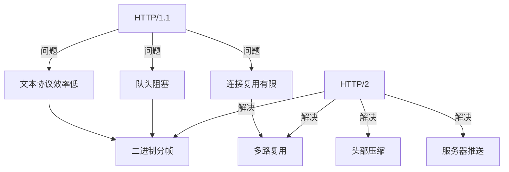
```mermaid
graph TD
    A[HTTP/1.1] -->|问题| B[队头阻塞]
    A -->|问题| C[连接复用有限]
    A -->|问题| D[文本协议效率低]
    
    E[HTTP/2] -->|解决| F[二进制分帧]
    E -->|解决| G[多路复用]
    E -->|解决| H[头部压缩]
    E -->|解决| I[服务器推送]
    
    B --> F
    C --> G
    D --> F
```

HTTP/2的核心特性：

1. **二进制协议**：将HTTP消息分解为二进制帧
2. **多路复用**：在一个TCP连接上并发传输多个流
3. **头部压缩**：使用HPACK算法压缩HTTP头部
4. **服务器推送**：服务器可以主动推送资源
5. **流量控制**：精细的流量控制机制

HTTP/2的帧结构：

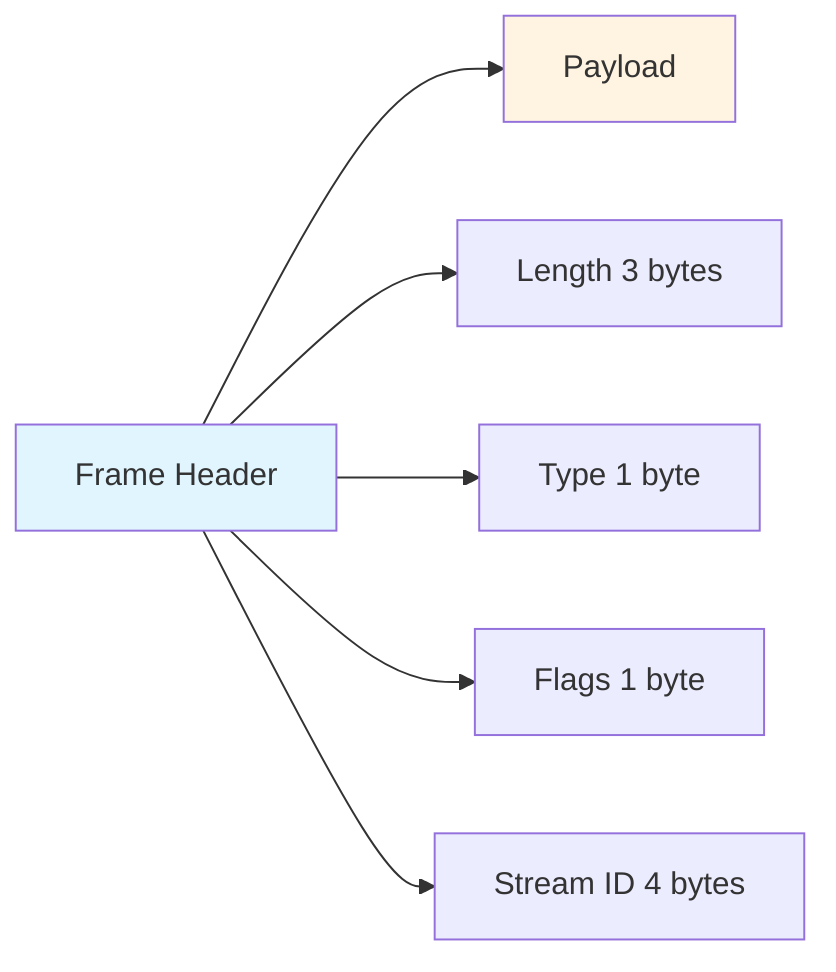
```mermaid
graph LR
    A[Frame Header] --> B[Payload]
    
    A --> C[Length 3 bytes]
    A --> D[Type 1 byte]
    A --> E[Flags 1 byte]
    A --> F[Stream ID 4 bytes]
    
    style A fill:#e1f5ff
    style B fill:#fff4e1
```

### 1.5 HTTP/3的诞生背景

尽管HTTP/2带来了巨大的性能提升，但它仍然存在一个根本性的问题：**TCP层队的队头阻塞**。

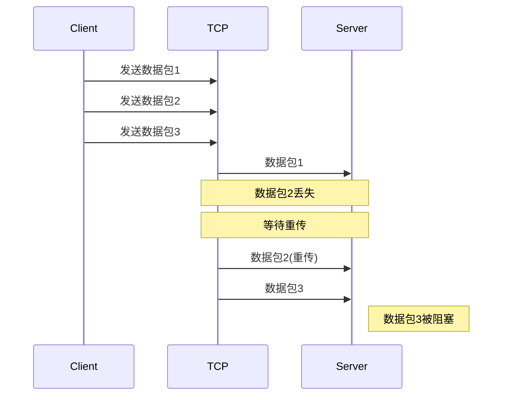
```mermaid
sequenceDiagram
    participant Client
    participant TCP
    participant Server
    
    Client->>TCP: 发送数据包1
    Client->>TCP: 发送数据包2
    Client->>TCP: 发送数据包3
    
    TCP->>Server: 数据包1
    Note over TCP,Server: 数据包2丢失
    Note over TCP,Server: 等待重传
    TCP->>Server: 数据包2(重传)
    TCP->>Server: 数据包3
    
    Note right of Server: 数据包3被阻塞
```

当TCP连接中的某个数据包丢失时，后续的所有数据包都必须等待重传，即使这些数据包已经到达接收端。这种现象被称为TCP队头阻塞。

为了解决这个问题，HTTP/3放弃了TCP，转而使用基于UDP的QUIC协议。

## 二、QUIC协议：HTTP/3的基石

### 2.1 QUIC协议概述

QUIC（Quick UDP Internet Connections）是Google开发的一种基于UDP的传输协议，2013年首次提出，2021年成为RFC 9000标准。

QUIC的设计目标：
- 解决TCP队头阻塞问题
- 减少连接建立延迟
- 提供更好的安全性
- 支持连接迁移

### 2.2 QUIC vs TCP对比

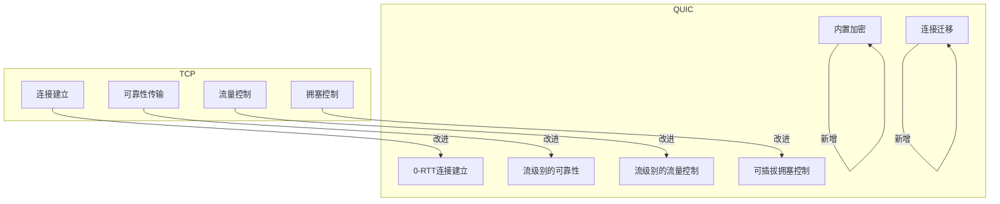
```mermaid
graph TB
    subgraph TCP
        A1[连接建立]
        A2[可靠性传输]
        A3[流量控制]
        A4[拥塞控制]
    end
    
    subgraph QUIC
        B1[0-RTT连接建立]
        B2[流级别的可靠性]
        B3[流级别的流量控制]
        B4[可插拔拥塞控制]
        B5[内置加密]
        B6[连接迁移]
    end
    
    A1 -->|改进| B1
    A2 -->|改进| B2
    A3 -->|改进| B3
    A4 -->|改进| B4
    B5 -->|新增| B5
    B6 -->|新增| B6
```

### 2.3 QUIC连接建立过程

#### 传统TCP+TLS连接建立

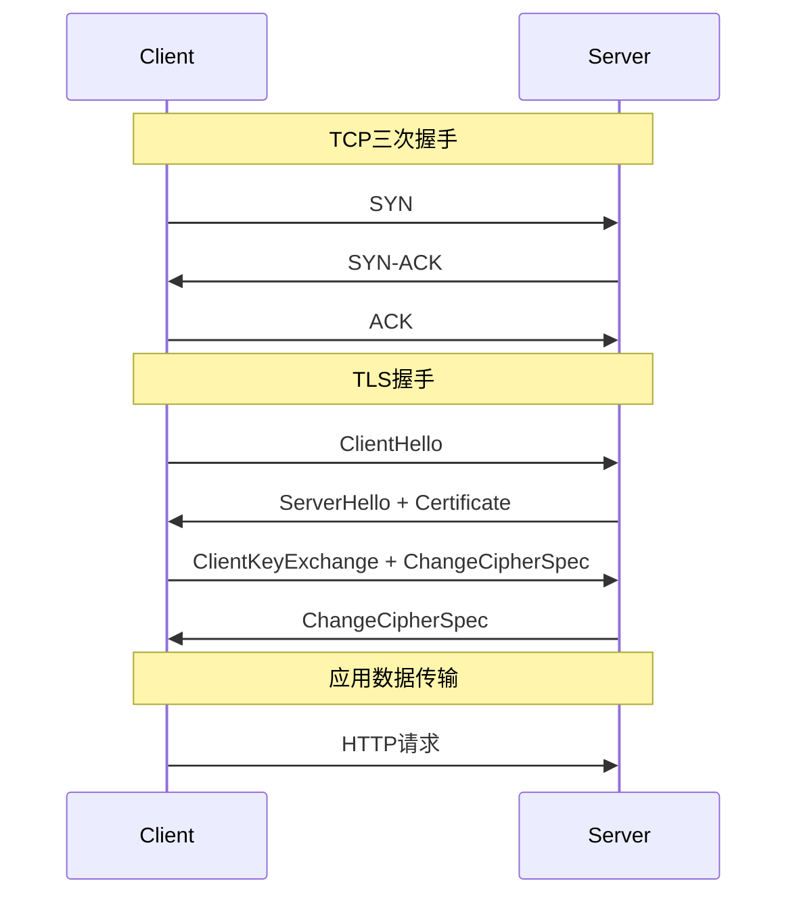
```mermaid
sequenceDiagram
    participant Client
    participant Server
    
    Note over Client,Server: TCP三次握手
    Client->>Server: SYN
    Server->>Client: SYN-ACK
    Client->>Server: ACK
    
    Note over Client,Server: TLS握手
    Client->>Server: ClientHello
    Server->>Client: ServerHello + Certificate
    Client->>Server: ClientKeyExchange + ChangeCipherSpec
    Server->>Client: ChangeCipherSpec
    
    Note over Client,Server: 应用数据传输
    Client->>Server: HTTP请求
```

#### QUIC连接建立（0-RTT）

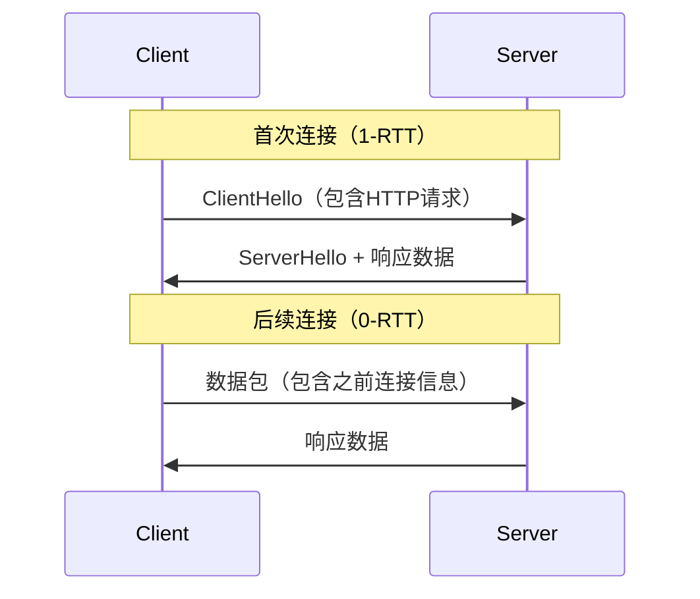
```mermaid
sequenceDiagram
    participant Client
    participant Server
    
    Note over Client,Server: 首次连接（1-RTT）
    Client->>Server: ClientHello（包含HTTP请求）
    Server->>Client: ServerHello + 响应数据
    
    Note over Client,Server: 后续连接（0-RTT）
    Client->>Server: 数据包（包含之前连接信息）
    Server->>Client: 响应数据
```

QUIC连接建立的优势：
- **首次连接**：1-RTT（相比TCP+TLS的2-3 RTT）
- **后续连接**：0-RTT（客户端可以立即发送数据）
- **内置加密**：传输层和应用层都加密

### 2.4 QUIC的流机制

QUIC的流是QUIC协议的核心概念，它解决了TCP的队头阻塞问题。

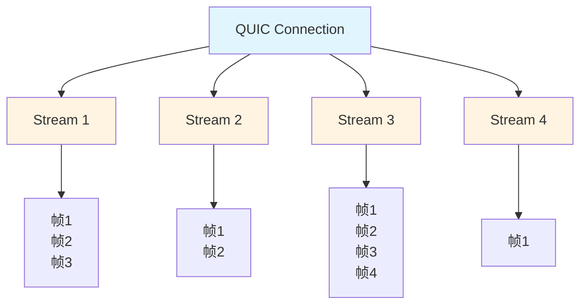
```mermaid
graph TD
    A[QUIC Connection] --> B[Stream 1]
    A --> C[Stream 2]
    A --> D[Stream 3]
    A --> E[Stream 4]
    
    B --> B1[帧1<br/>帧2<br/>帧3]
    C --> C1[帧1<br/>帧2]
    D --> D1[帧1<br/>帧2<br/>帧3<br/>帧4]
    E --> E1[帧1]
    
    style A fill:#e1f5ff
    style B fill:#fff4e1
    style C fill:#fff4e1
    style D fill:#fff4e1
    style E fill:#fff4e1
```

流的特点：
- **独立性**：每个流独立传输，互不影响
- **有序性**：流内数据保证顺序
- **可靠性**：每个流独立确认和重传
- **并发性**：多个流可以并发传输

当Stream 2的某个包丢失时，只会影响Stream 2，其他流继续传输。

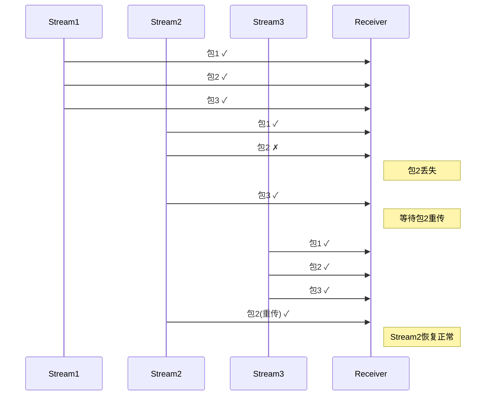
```mermaid
sequenceDiagram
    participant Stream1
    participant Stream2
    participant Stream3
    participant Receiver
    
    Stream1->>Receiver: 包1 ✓
    Stream1->>Receiver: 包2 ✓
    Stream1->>Receiver: 包3 ✓
    
    Stream2->>Receiver: 包1 ✓
    Stream2->>Receiver: 包2 ✗
    Note right of Receiver: 包2丢失
    Stream2->>Receiver: 包3 ✓
    Note right of Receiver: 等待包2重传
    
    Stream3->>Receiver: 包1 ✓
    Stream3->>Receiver: 包2 ✓
    Stream3->>Receiver: 包3 ✓
    
    Stream2->>Receiver: 包2(重传) ✓
    Note right of Receiver: Stream2恢复正常
```

### 2.5 QUIC的流量控制

QUIC实现了精细的流量控制机制：

1. **连接级别流量控制**：控制整个连接的数据量
2. **流级别流量控制**：控制每个流的数据量
3. **双向流量控制**：发送方和接收方都控制

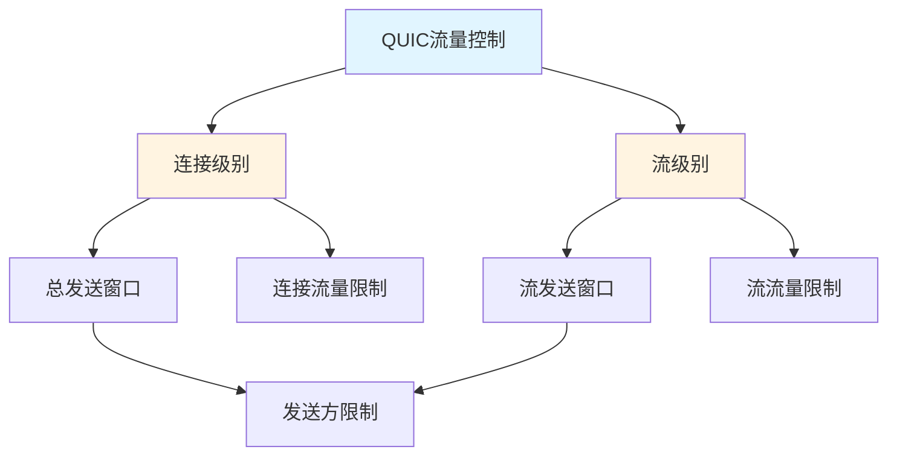
```mermaid
graph TB
    A[QUIC流量控制] --> B[连接级别]
    A --> C[流级别]
    
    B --> B1[总发送窗口]
    B --> B2[连接流量限制]
    
    C --> C1[流发送窗口]
    C --> C2[流流量限制]
    
    B1 --> D[发送方限制]
    C1 --> D
    
    style A fill:#e1f5ff
    style B fill:#fff4e1
    style C fill:#fff4e1
```

流量控制的工作原理：

```
接收方发送MAX_DATA和MAX_STREAM_DATA帧来更新发送窗口
发送方在窗口耗尽时停止发送，等待窗口更新
```

### 2.6 QUIC的拥塞控制

QUIC采用了可插拔的拥塞控制设计，支持多种算法：

1. **Cubic**：默认算法，类似TCP Cubic
2. **BBR**：Google的算法，基于带宽和RTT
3. **Reno**：传统的TCP Reno算法

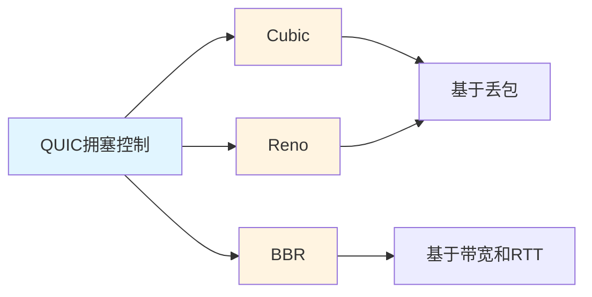
```mermaid
graph LR
    A[QUIC拥塞控制] --> B[Cubic]
    A --> C[BBR]
    A --> D[Reno]
    
    B --> E[基于丢包]
    C --> F[基于带宽和RTT]
    D --> E
    
    style A fill:#e1f5ff
    style B fill:#fff4e1
    style C fill:#fff4e1
    style D fill:#fff4e1
```

### 2.7 QUIC的连接迁移

QUIC支持连接迁移，这是其独特的重要特性。

连接迁移的使用场景：
- 用户从WiFi切换到移动网络
- 用户移动到不同的网络环境
- NAT映射发生变化

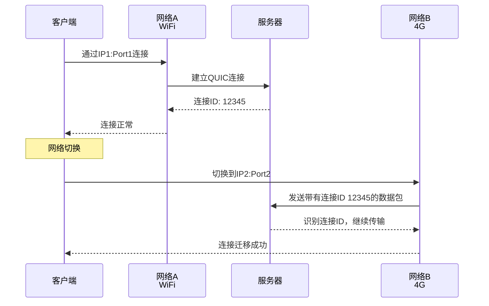
```mermaid
sequenceDiagram
    participant Client as 客户端
    participant Network1 as 网络A<br/>WiFi
    participant Server as 服务器
    participant Network2 as 网络B<br/>4G
    
    Client->>Network1: 通过IP1:Port1连接
    Network1->>Server: 建立QUIC连接
    Server-->>Network1: 连接ID: 12345
    Network1-->>Client: 连接正常
    
    Note over Client: 网络切换
    Client->>Network2: 切换到IP2:Port2
    Network2->>Server: 发送带有连接ID 12345的数据包
    Server-->>Network2: 识别连接ID，继续传输
    Network2-->>Client: 连接迁移成功
```

连接迁移的关键技术：
- **连接ID**：每个连接有唯一的ID，不绑定IP地址
- **路径验证**：验证新路径的可用性
- **重置加密密钥**：防止攻击者追踪

## 三、HTTP/3的核心特性

### 3.1 HTTP/3协议栈

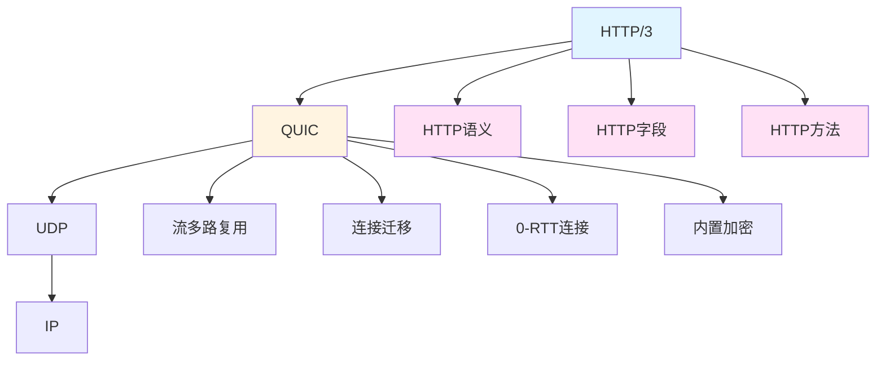
```mermaid
graph TB
    A[HTTP/3] --> B[QUIC]
    B --> C[UDP]
    C --> D[IP]
    
    A --> E[HTTP语义]
    A --> F[HTTP字段]
    A --> G[HTTP方法]
    
    B --> H[流多路复用]
    B --> I[连接迁移]
    B --> J[0-RTT连接]
    B --> K[内置加密]
    
    style A fill:#e1f5ff
    style B fill:#fff4e1
    style E fill:#ffe1f5
    style F fill:#ffe1f5
    style G fill:#ffe1f5
```

### 3.2 HTTP/3的帧类型

HTTP/3定义了多种帧类型，用于不同的目的：

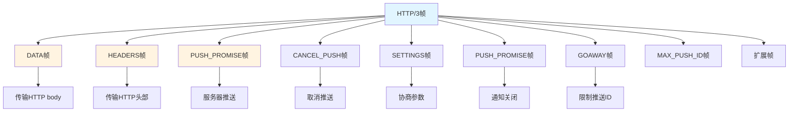
```mermaid
graph TB
    A[HTTP/3帧] --> B[DATA帧]
    A --> C[HEADERS帧]
    A --> D[PUSH_PROMISE帧]
    A --> E[CANCEL_PUSH帧]
    A --> F[SETTINGS帧]
    A --> G[PUSH_PROMISE帧]
    A --> H[GOAWAY帧]
    A --> I[MAX_PUSH_ID帧]
    A --> J[扩展帧]
    
    B --> B1[传输HTTP body]
    C --> C1[传输HTTP头部]
    D --> D1[服务器推送]
    E --> E1[取消推送]
    F --> F1[协商参数]
    G --> G1[通知关闭]
    H --> H1[限制推送ID]
    
    style A fill:#e1f5ff
    style B fill:#fff4e1
    style C fill:#fff4e1
    style D fill:#fff4e1
```

#### DATA帧

DATA帧用于传输HTTP消息体：

```
DATA帧格式：
+---------------+
|   Length (i)  |
+---------------+
|   Type (0)    |
+---------------+
|   Flags (8)   |
+---------------+
|   Stream ID   |
+---------------+
|   Payload     |
+---------------+
```

#### HEADERS帧

HEADERS帧用于传输HTTP头部：

```
HEADERS帧格式：
+---------------+
|   Length (i)  |
+---------------+
|   Type (1)    |
+---------------+
|   Flags (8)   |
+---------------+
|   Stream ID   |
+---------------+
|   Payload     |
+---------------+
```

Payload使用QPACK格式压缩头部字段。

### 3.3 QPACK头部压缩

HTTP/3使用QPACK算法压缩HTTP头部，这是HTTP/2的HPACK算法的改进版本。

#### QPACK vs HPACK对比

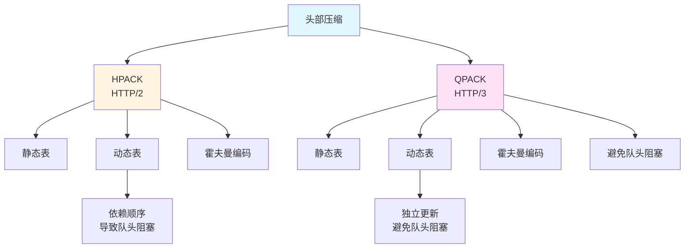
```mermaid
graph TB
    A[头部压缩] --> B[HPACK<br/>HTTP/2]
    A --> C[QPACK<br/>HTTP/3]
    
    B --> B1[静态表]
    B --> B2[动态表]
    B --> B3[霍夫曼编码]
    
    C --> C1[静态表]
    C --> C2[动态表]
    C --> C3[霍夫曼编码]
    C --> C4[避免队头阻塞]
    
    B2 --> B4[依赖顺序<br/>导致队头阻塞]
    C2 --> C5[独立更新<br/>避免队头阻塞]
    
    style A fill:#e1f5ff
    style B fill:#fff4e1
    style C fill:#ffe1f5
```

#### QPACK工作原理

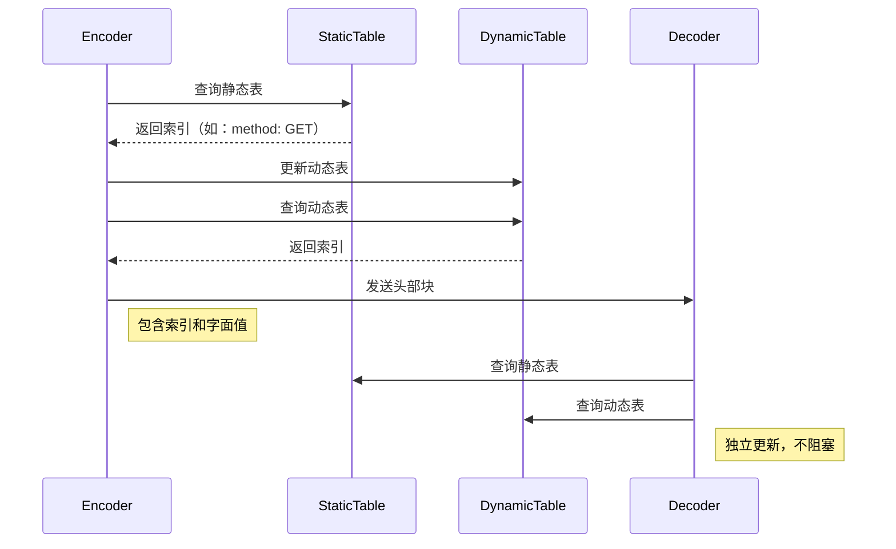
```mermaid
sequenceDiagram
    participant Encoder
    participant StaticTable
    participant DynamicTable
    participant Decoder
    
    Encoder->>StaticTable: 查询静态表
    StaticTable-->>Encoder: 返回索引（如：method: GET）
    
    Encoder->>DynamicTable: 更新动态表
    Encoder->>DynamicTable: 查询动态表
    DynamicTable-->>Encoder: 返回索引
    
    Encoder->>Decoder: 发送头部块
    Note right of Encoder: 包含索引和字面值
    
    Decoder->>StaticTable: 查询静态表
    Decoder->>DynamicTable: 查询动态表
    Note right of Decoder: 独立更新，不阻塞
```

QPACK的关键改进：
- **动态表独立更新**：编码器和解码器可以独立更新动态表
- **ACK机制**：解码器确认已接收的动态表更新
- **避免队头阻塞**：动态表更新不会阻塞其他流

### 3.4 HTTP/3的服务器推送

HTTP/3保留了服务器推送功能，但做了一些改进：

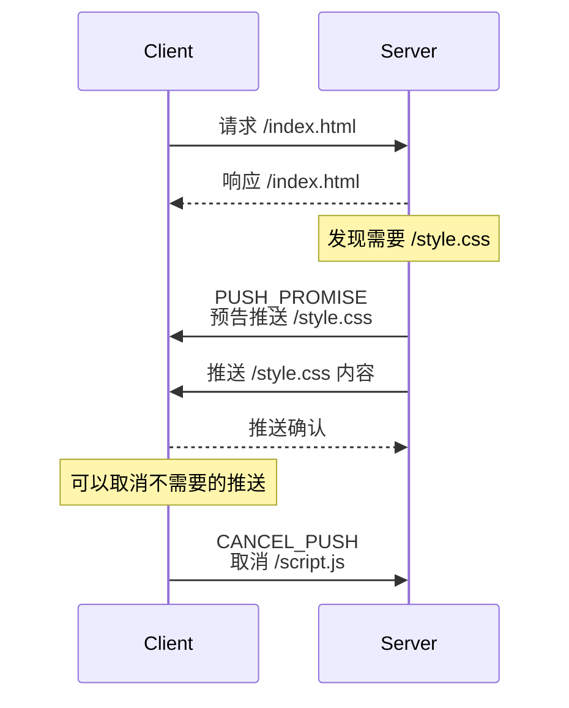
```mermaid
sequenceDiagram
    participant Client
    participant Server
    
    Client->>Server: 请求 /index.html
    Server-->>Client: 响应 /index.html
    Note over Server: 发现需要 /style.css
    Server->>Client: PUSH_PROMISE<br/>预告推送 /style.css
    Server->>Client: 推送 /style.css 内容
    Client-->>Server: 推送确认
    
    Note over Client: 可以取消不需要的推送
    Client->>Server: CANCEL_PUSH<br/>取消 /script.js
```

推送的改进：
- **可取消**：客户端可以主动取消推送
- **可限制**：客户端可以限制推送的数量
- **独立流**：每个推送在独立的流上进行

### 3.5 HTTP/3的优先级控制

HTTP/3支持精细的优先级控制，允许客户端指定资源的加载优先级：

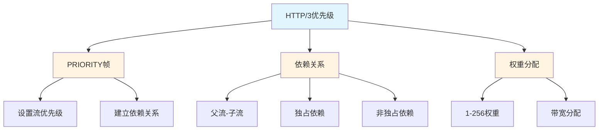
```mermaid
graph TB
    A[HTTP/3优先级] --> B[PRIORITY帧]
    A --> C[依赖关系]
    A --> D[权重分配]
    
    B --> B1[设置流优先级]
    B --> B2[建立依赖关系]
    
    C --> C1[父流-子流]
    C --> C2[独占依赖]
    C --> C3[非独占依赖]
    
    D --> D1[1-256权重]
    D --> D2[带宽分配]
    
    style A fill:#e1f5ff
    style B fill:#fff4e1
    style C fill:#fff4e1
    style D fill:#fff4e1
```

优先级控制的应用：
- **关键资源优先**：CSS、JavaScript等关键资源优先加载
- **非关键资源延后**：图片、视频等非关键资源延后加载
- **依赖关系**：确保依赖资源按正确顺序加载

## 四、HTTP/3与HTTP/2的深度对比

### 4.1 性能对比

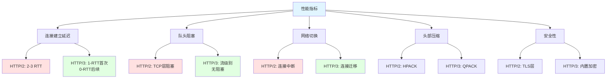
```mermaid
graph TB
    A[性能指标] --> B[连接建立延迟]
    A --> C[队头阻塞]
    A --> D[网络切换]
    A --> E[头部压缩]
    A --> F[安全性]
    
    B --> B1[HTTP/2: 2-3 RTT]
    B --> B2[HTTP/3: 1-RTT首次<br/>0-RTT后续]
    
    C --> C1[HTTP/2: TCP层阻塞]
    C --> C2[HTTP/3: 流级别<br/>无阻塞]
    
    D --> D1[HTTP/2: 连接中断]
    D --> D2[HTTP/3: 连接迁移]
    
    E --> E1[HTTP/2: HPACK]
    E --> E2[HTTP/3: QPACK]
    
    F --> F1[HTTP/2: TLS层]
    F --> F2[HTTP/3: 内置加密]
    
    style A fill:#e1f5ff
    style B1 fill:#ffe1e1
    style B2 fill:#e1ffe1
    style C1 fill:#ffe1e1
    style C2 fill:#e1ffe1
    style D1 fill:#ffe1e1
    style D2 fill:#e1ffe1
```

### 4.2 协议栈对比

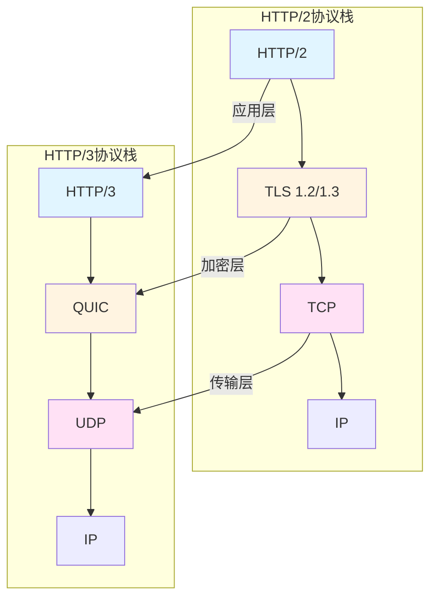
```mermaid
graph TB
    subgraph HTTP/2协议栈
        A1[HTTP/2] --> B1[TLS 1.2/1.3]
        B1 --> C1[TCP]
        C1 --> D1[IP]
    end
    
    subgraph HTTP/3协议栈
        A2[HTTP/3] --> B2[QUIC]
        B2 --> C2[UDP]
        C2 --> D2[IP]
    end
    
    A1 -->|应用层| A2
    B1 -->|加密层| B2
    C1 -->|传输层| C2
    
    style A1 fill:#e1f5ff
    style A2 fill:#e1f5ff
    style B1 fill:#fff4e1
    style B2 fill:#fff4e1
    style C1 fill:#ffe1f5
    style C2 fill:#ffe1f5
```

### 4.3 丢包场景对比

#### HTTP/2在丢包场景下的表现

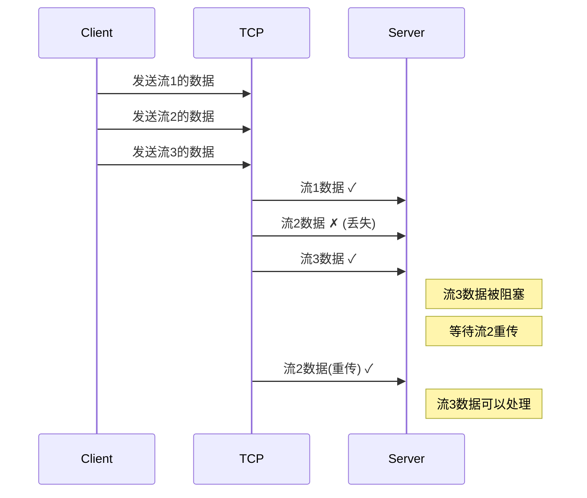
```mermaid
sequenceDiagram
    participant Client
    participant TCP
    participant Server
    
    Client->>TCP: 发送流1的数据
    Client->>TCP: 发送流2的数据
    Client->>TCP: 发送流3的数据
    
    TCP->>Server: 流1数据 ✓
    TCP->>Server: 流2数据 ✗ (丢失)
    TCP->>Server: 流3数据 ✓
    
    Note right of Server: 流3数据被阻塞
    Note right of Server: 等待流2重传
    
    TCP->>Server: 流2数据(重传) ✓
    
    Note right of Server: 流3数据可以处理
```

#### HTTP/3在丢包场景下的表现

```mermaid
sequenceDiagram
    participant Client
    participant QUIC
    participant Server
    
    Client->>QUIC: 发送流1的包
    Client->>QUIC: 发送流2的包
    Client->>QUIC: 发送流3的包
    
    QUIC->>Server: 流1包 ✓
    QUIC->>Server: 流2包 ✗ (丢失)
    QUIC->>Server: 流3包 ✓
    
    Note right of Server: 流3可以正常处理
    Note right of Server: 流2独立重传
    
    QUIC->>Server: 流2包(重传) ✓
```

### 4.4 连接建立对比

#### HTTP/2连接建立流程

```mermaid
sequenceDiagram
    participant Client
    participant Server
    
    rect rgb(200, 230, 255)
    Note over Client,Server: TCP三次握手
    Client->>Server: SYN
    Server->>Client: SYN-ACK
    Client->>Server: ACK
    end
    
    rect rgb(255, 230, 200)
    Note over Client,Server: TLS握手
    Client->>Server: ClientHello
    Server->>Client: ServerHello + Certificate
    Client->>Server: ClientKeyExchange
    Server->>Client: ServerKeyExchange
    end
    
    rect rgb(200, 255, 200)
    Note over Client,Server: 应用数据
    Client->>Server: HTTP请求
    Server->>Client: HTTP响应
    end
```

#### HTTP/3连接建立流程

```mermaid
sequenceDiagram
    participant Client
    participant Server
    
    rect rgb(200, 255, 200)
    Note over Client,Server: 首次连接（1-RTT）
    Client->>Server: ClientHello + HTTP请求
    Server->>Client: ServerHello + HTTP响应
    end
    
    rect rgb(200, 230, 255)
    Note over Client,Server: 后续连接（0-RTT）
    Client->>Server: 数据包 + HTTP请求
    Server->>Client: HTTP响应
    end
```

### 4.5 安全性对比

| 特性 | HTTP/2 | HTTP/3 |
|------|--------|--------|
| 加密层 | TLS 1.2/1.3 | QUIC内置加密 |
| 前向安全 | 依赖TLS | 始终启用 |
| 连接ID | 绑定IP | 独立连接ID |
| 中间人攻击 | 可能 | 更难 |

## 五、HTTP/3的部署与应用

### 5.1 服务器部署

#### Nginx配置HTTP/3

```nginx
server {
    listen 443 quic reuseport;
    listen 443 ssl;
    
    server_name example.com;
    
    # SSL证书配置
    ssl_certificate /path/to/cert.pem;
    ssl_certificate_key /path/to/key.pem;
    ssl_protocols TLSv1.3;
    
    # HTTP/3支持
    add_header Alt-Svc 'h3=":443"; ma=2592000';
    
    location / {
        root /var/www/html;
    }
}
```

#### Apache配置HTTP/3

```apache
<VirtualHost *:443>
    ServerName example.com
    
    # 启用HTTP/3
    Protocols h2 http/3
    
    # SSL证书配置
    SSLEngine on
    SSLCertificateFile /path/to/cert.pem
    SSLCertificateKeyFile /path/to/key.pem
    
    DocumentRoot /var/www/html
</VirtualHost>
```

#### Caddy配置HTTP/3

```caddyfile
example.com {
    # 自动启用HTTP/3
    tls /path/to/cert.pem /path/to/key.pem
    
    root * /var/www/html
    file_server
}
```

### 5.2 客户端支持

#### 浏览器支持情况

```mermaid
graph TB
    A[浏览器支持] --> B[Chrome]
    A --> C[Firefox]
    A --> D[Safari]
    A --> E[Edge]
    A --> F[Opera]
    
    B --> B1[完全支持<br/>Chrome 87+]
    C --> C1[完全支持<br/>Firefox 88+]
    D --> D1[完全支持<br/>Safari 14+]
    E --> E1[完全支持<br/>Edge 87+]
    F --> F1[完全支持<br/>Opera 73+]
    
    style A fill:#e1f5ff
    style B1 fill:#e1ffe1
    style C1 fill:#e1ffe1
    style D1 fill:#e1ffe1
    style E1 fill:#e1ffe1
    style F1 fill:#e1ffe1
```

#### 客户端库支持

**Python (httpx)**

```python
import httpx

# 创建HTTP/3客户端
client = httpx.Client(http2=True, verify=False)

# 发送请求
response = client.get('https://example.com')
print(response.text)
```

**Go (quic-go)**

```go
package main

import (
    "context"
    "fmt"
    "github.com/lucas-clemente/quic-go"
    "github.com/lucas-clemente/quic-go/http3"
)

func main() {
    // 创建HTTP/3客户端
    client := &http3.Client{}
    
    // 发送请求
    resp, err := client.Get("https://example.com")
    if err != nil {
        fmt.Println("Error:", err)
        return
    }
    defer resp.Body.Close()
    
    fmt.Println("Status:", resp.Status)
}
```

**JavaScript (fetch)**

```javascript
// 现代浏览器原生支持HTTP/3
fetch('https://example.com', {
    method: 'GET',
    headers: {
        'Alt-Svc': 'h3=":443"; ma=2592000'
    }
})
.then(response => response.text())
.then(data => console.log(data))
.catch(error => console.error('Error:', error));
```

### 5.3 HTTP/3的Alt-Svc头部

Alt-Svc（Alternative Services）头部用于告知客户端HTTP/3的可用性：

```http
HTTP/1.1 200 OK
Alt-Svc: h3=":443"; ma=2592000; persist=1
Alt-Svc: h3-29=":443"; ma=2592000
Alt-Svc: h3-32=":443"; ma=2592000
```

参数说明：
- `h3`：HTTP/3协议标识
- `h3-29`、`h3-32`：特定版本的HTTP/3
- `:443`：端口号
- `ma=2592000`：最大有效期（秒）
- `persist=1`：持久化连接

### 5.4 HTTP/3的兼容性策略

为了确保向后兼容，可以采用渐进式部署策略：

```mermaid
graph TB
    A[客户端请求] --> B{支持HTTP/3?}
    B -->|是| C[HTTP/3连接]
    B -->|否| D{支持HTTP/2?}
    D -->|是| E[HTTP/2连接]
    D -->|否| F[HTTP/1.1连接]
    
    C --> G[Alt-Svc头部]
    G --> H[告知HTTP/3可用]
    
    E --> G
    F --> G
    
    style A fill:#e1f5ff
    style C fill:#e1ffe1
    style E fill:#fff4e1
    style F fill:#ffe1e1
```

## 六、HTTP/3的性能优化实践

### 6.1 连接复用优化

```mermaid
graph TB
    A[连接复用策略] --> B[域名分片]
    A --> C[连接池管理]
    A --> D[连接保持]
    
    B --> B1[减少域名数量]
    B --> B2[使用HTTP/3多路复用]
    
    C --> C1[最大连接数控制]
    C --> C2[空闲连接回收]
    C --> C3[连接预热]
    
    D --> D1[合理的keep-alive]
    D --> D2[心跳机制]
    
    style A fill:#e1f5ff
    style B fill:#fff4e1
    style C fill:#fff4e1
    style D fill:#fff4e1
```

### 6.2 资源加载优化

```mermaid
graph TB
    A[资源加载优化] --> B[优先级控制]
    A --> C[服务器推送]
    A --> D[预加载]
    
    B --> B1[关键CSS优先]
    B --> B2[JavaScript延后]
    B --> B3[图片懒加载]
    
    C --> C1[预测资源需求]
    C --> C2[推送必要资源]
    C --> C3[避免过度推送]
    
    D --> D1[DNS预解析]
    D --> D2[连接预建立]
    D --> D3[资源预加载]
    
    style A fill:#e1f5ff
    style B fill:#fff4e1
    style C fill:#fff4e1
    style D fill:#fff4e1
```

### 6.3 网络适应优化

```mermaid
graph TB
    A[网络适应优化] --> B[拥塞控制]
    A --> C[流量控制]
    A --> D[丢包恢复]
    
    B --> B1[BBR算法]
    B --> B2[动态调整]
    B --> B3[网络感知]
    
    C --> C1[连接窗口]
    C --> C2[流窗口]
    C --> C3[自适应窗口]
    
    D --> D1[快速重传]
    D --> D2[冗余编码]
    D --> D3[前向纠错]
    
    style A fill:#e1f5ff
    style B fill:#fff4e1
    style C fill:#fff4e1
    style D fill:#fff4e1
```

## 七、HTTP/3面临的挑战与解决方案

### 7.1 UDP端口穿透问题

#### 问题描述

许多防火墙和NAT设备会阻止UDP流量，导致HTTP/3连接失败。

#### 解决方案

```mermaid
graph TB
    A[UDP穿透问题] --> B[HTTP/3备用]
    A --> C[端口优化]
    A --> D[NAT穿越]
    
    B --> B1[HTTP/2/1.1回退]
    B --> B2[自动协议协商]
    
    C --> C1[使用标准端口]
    C --> C2[端口探测]
    
    D --> D1[STUN协议]
    D --> D2[TURN中继]
    D --> D3[ICE候选]
    
    style A fill:#e1f5ff
    style B fill:#fff4e1
    style C fill:#fff4e1
    style D fill:#fff4e1
```

### 7.2 中间设备兼容性

#### 问题描述

许多中间设备（如代理、防火墙）不支持HTTP/3，可能导致连接问题。

#### 解决方案

```mermaid
graph TB
    A[中间设备兼容性] --> B[协议升级]
    A --> C[绕过机制]
    A --> D[回退策略]
    
    B --> B1[设备固件升级]
    B --> B2[软件更新]
    
    C --> C1[直连模式]
    C --> C2[代理协议]
    
    D --> D1[HTTP/2回退]
    D --> D2[HTTP/1.1回退]
    
    style A fill:#e1f5ff
    style B fill:#fff4e1
    style C fill:#fff4e1
    style D fill:#fff4e1
```

### 7.3 性能调优挑战

#### 问题描述

HTTP/3的性能表现受多种因素影响，需要精细调优。

#### 解决方案

```mermaid
graph TB
    A[性能调优] --> B[参数调优]
    A --> C[算法选择]
    A --> D[监控分析]
    
    B --> B1[拥塞窗口]
    B --> B2[流控制窗口]
    B --> B3[连接参数]
    
    C --> C1[拥塞控制算法]
    C --> C2[流量控制策略]
    
    D --> D1[实时监控]
    D --> D2[性能分析]
    D --> D3[自动调优]
    
    style A fill:#e1f5ff
    style B fill:#fff4e1
    style C fill:#fff4e1
    style D fill:#fff4e1
```

### 7.4 生态系统成熟度

#### 问题描述

HTTP/3的生态系统还不够成熟，工具和库的支持有限。

#### 解决方案

```mermaid
graph TB
    A[生态系统建设] --> B[工具开发]
    A --> C[库支持]
    A --> D[社区建设]
    
    B --> B1[调试工具]
    B --> B2[性能分析工具]
    B --> B3[测试工具]
    
    C --> C1[客户端库]
    C --> C2[服务器库]
    C --> C3[代理库]
    
    D --> D1[文档完善]
    D --> D2[示例代码]
    D --> D3[最佳实践]
    
    style A fill:#e1f5ff
    style B fill:#fff4e1
    style C fill:#fff4e1
    style D fill:#fff4e1
```

## 八、HTTP/3的监控与调试

### 8.1 HTTP/3连接监控

```mermaid
graph TB
    A[HTTP/3监控] --> B[连接状态]
    A --> C[性能指标]
    A --> D[错误分析]
    
    B --> B1[连接数]
    B --> B2[连接时长]
    B --> B3[连接状态分布]
    
    C --> C1[RTT]
    C --> C2[吞吐量]
    C --> C3[丢包率]
    
    D --> D1[连接失败]
    D --> D2[超时次数]
    D --> D3[重传次数]
    
    style A fill:#e1f5ff
    style B fill:#fff4e1
    style C fill:#fff4e1
    style D fill:#fff4e1
```

### 8.2 Chrome DevTools调试

Chrome DevTools提供了HTTP/3的调试功能：

```
1. 打开Chrome DevTools
2. 进入Network标签
3. 右键点击请求列标题
4. 选择Protocol列
5. 查看请求使用的协议（h3, h2, http/1.1等）
```

### 8.3 Wireshark抓包分析

使用Wireshark抓取HTTP/3数据包：

```
1. 启动Wireshark
2. 选择网络接口
3. 设置过滤器：udp.port == 443
4. 开始抓包
5. 查看QUIC和HTTP/3数据包
```

### 8.4 服务器日志分析

配置Nginx记录HTTP/3连接：

```nginx
http {
    log_format quic '$remote_addr - $remote_user [$time_local] '
                    '"$request" $status $body_bytes_sent '
                    '"$http_referer" "$http_user_agent" '
                    '$scheme $http3';
    
    access_log /var/log/nginx/access.log quic;
}
```

## 九、HTTP/3的应用场景

### 9.1 网页加载优化

```mermaid
graph TB
    A[网页加载优化] --> B[首页加载]
    A --> C[单页应用]
    A --> D[富媒体网站]
    
    B --> B1[关键资源优先]
    B --> B2[并行加载]
    B --> B3[连接复用]
    
    C --> C1[API请求优化]
    C --> C2[资源预加载]
    C --> C3[状态管理]
    
    D --> D1[视频流传输]
    D --> D2[图片优化]
    D --> D3[音频流传输]
    
    style A fill:#e1f5ff
    style B fill:#fff4e1
    style C fill:#fff4e1
    style D fill:#fff4e1
```

### 9.2 移动网络优化

```mermaid
graph TB
    A[移动网络优化] --> B[弱网环境]
    A --> C[网络切换]
    A --> D[流量节省]
    
    B --> B1[连接建立优化]
    B --> B2[数据压缩]
    B --> B3[优先级控制]
    
    C --> C1[连接迁移]
    C --> C2[无缝切换]
    C --> C3[状态保持]
    
    D --> D1[头部压缩]
    D --> D2[二进制编码]
    D --> D3[增量更新]
    
    style A fill:#e1f5ff
    style B fill:#fff4e1
    style C fill:#fff4e1
    style D fill:#fff4e1
```

### 9.3 API服务优化

```mermaid
graph TB
    A[API服务优化] --> B[RESTful API]
    A --> C[GraphQL API]
    A --> D[实时API]
    
    B --> B1[批量请求]
    B --> B2[字段过滤]
    B --> B3[缓存控制]
    
    C --> C1[查询优化]
    C --> C2[订阅推送]
    C --> C3[增量更新]
    
    D --> D1[WebSocket替代]
    D --> D2[服务器推送]
    D --> D3[实时同步]
    
    style A fill:#e1f5ff
    style B fill:#fff4e1
    style C fill:#fff4e1
    style D fill:#fff4e1
```

## 十、HTTP/3的未来发展

### 10.1 协议演进方向

```mermaid
graph TB
    A[HTTP/3未来发展] --> B[性能优化]
    A --> C[功能增强]
    A --> D[生态建设]
    
    B --> B1[更好的拥塞控制]
    B --> B2[更高效的压缩]
    B --> B3[更低的延迟]
    
    C --> C1[更多扩展机制]
    C --> C2[更好的API]
    C --> C3[更强的安全性]
    
    D --> D1[工具完善]
    D --> D2[库支持]
    D --> D3[标准化推进]
    
    style A fill:#e1f5ff
    style B fill:#fff4e1
    style C fill:#fff4e1
    style D fill:#fff4e1
```

### 10.2 技术趋势

1. **与QUIC的深度集成**：更紧密的协议集成
2. **智能化优化**：基于AI的性能优化
3. **边缘计算支持**：更好的边缘计算集成
4. **5G网络优化**：针对5G网络的特殊优化
5. **物联网应用**：在物联网场景的应用

### 10.3 标准化进程

HTTP/3的标准化进程：

```mermaid
timeline
    title HTTP/3标准化进程
    section 2013
        Google提出QUIC协议
    section 2015
        IETF开始标准化工作
    section 2018
        QUIC草案发布
    section 2021
        QUIC成为RFC 9000标准
        HTTP/3成为RFC 9114标准
    section 2022+
        持续优化和扩展
```