# HTTP-FLV直播技术深度解析：从原理到实践的完整指南

> 为什么你的直播总是卡顿？为什么延迟居高不下？本文将带你从协议底层开始，彻底理解HTTP-FLV的工作机制，找出延迟和卡顿的根本原因，并提供系统化的优化方案。

---

## 一、为什么需要了解HTTP-FLV？

### 1.1 直播协议的演进历史

要理解HTTP-FLV为什么重要，我们得从直播技术的发展历程说起。

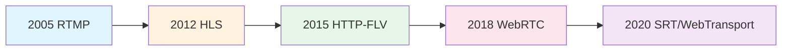

**时间线解读：**

- **RTMP时代（2005）**：Adobe推出的RTMP（Real-Time Messaging Protocol）基于TCP，使用1935端口，延迟可以控制在1-3秒。但问题是它是私有协议，而且需要特殊的端口，在防火墙上经常会被阻挡。

- **HLS崛起（2012）**：Apple推出的HLS（HTTP Live Streaming）基于HTTP，使用标准的80/443端口，完美穿透防火墙。但它的设计目标是"可靠"而非"实时"，延迟通常在10-30秒。

- **HTTP-FLV诞生（2015）**：国内视频平台为了解决RTMP的穿透问题和HLS的高延迟问题，创造性地将FLV流通过HTTP长连接传输，延迟可以控制在1-3秒，同时保持了HTTP协议的兼容性。

- **WebRTC时代（2018）**：基于UDP，延迟可以降到200-500ms，但部署复杂度高，CDN支持有限。

### 1.2 HTTP-FLV的市场地位

**为什么国内主流直播平台都选择HTTP-FLV？**

- 斗鱼、虎牙、B站等平台的PC端和APP端大量使用HTTP-FLV
- 延迟：1-3秒（远优于HLS的10-30秒）
- 兼容性：标准HTTP端口，无需额外开放端口
- CDN友好：可以复用现有的HTTP CDN基础设施
- 实现简单：服务端和客户端实现都相对简单

**关键数据：**
- 根据行业调研，国内直播市场HTTP-FLV占比约40-50%
- 在需要低延迟的场景（游戏直播、电商直播）中占比更高

---

## 二、从HTTP协议开始说起

### 2.1 HTTP协议的演进

要理解HTTP-FLV，必须先理解它赖以生存的基础——HTTP协议。

#### HTTP/1.0 vs HTTP/1.1 vs HTTP/2

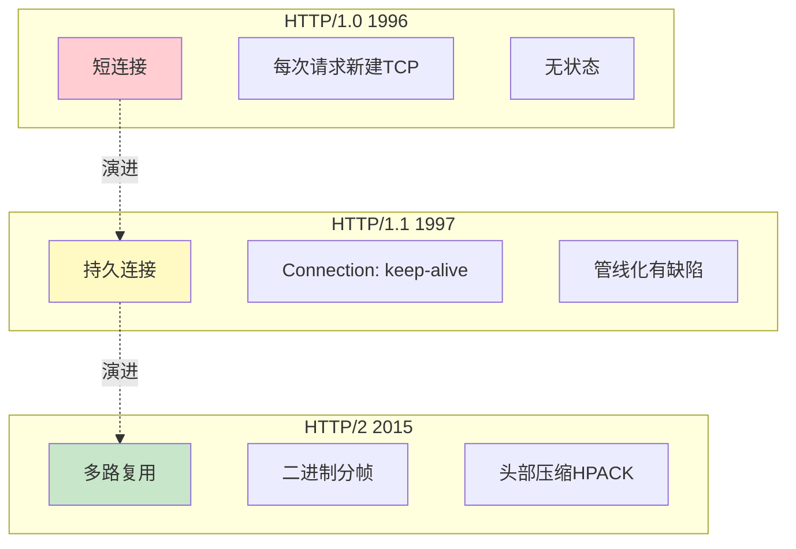

**这对HTTP-FLV意味着什么？**

HTTP-FLV主要运行在HTTP/1.1之上，核心依赖的是**持久连接（Persistent Connection）**特性。

### 2.2 HTTP长连接机制

**普通HTTP请求（短连接）：**

```
客户端                    服务器
  |                         |
  |--- TCP三次握手 -------->|
  |--- GET /video.flv ----->|
  |<--- 200 OK + 数据 ------|
  |--- TCP四次挥手 -------->|
  |                         |
耗时：握手(30-200ms) + 传输 + 挥手(30-200ms)
```

**HTTP长连接（Keep-Alive）：**

```
客户端                    服务器
  |                         |
  |--- TCP三次握手 -------->|
  |--- GET /live.flv ------->|
  |<--- 200 OK + 数据 ------|
  |<--- 数据持续推送 --------|  ← 连接保持打开
  |<--- 数据持续推送 --------|
  |<--- 数据持续推送 --------|
  |                         |
  |... 直播持续进行中 ...    |
  |                         |
  |--- TCP四次挥手 -------->|  ← 直播结束才关闭
  |                         |
耗时：仅一次握手(30-200ms)
```

**关键区别：**
- **短连接**：一次请求 = 一次TCP握手 + 数据传输 + 一次TCP挥手
- **长连接**：一次TCP握手后，可以持续传输数小时

### 2.3 HTTP-FLV如何利用长连接

HTTP-FLV的核心创新在于：**将一个HTTP请求变成了一个"永不结束"的数据流**。

```http
GET /live/stream.flv HTTP/1.1
Host: live.example.com
Connection: keep-alive
Cache-Control: no-cache

← 服务器响应（注意：没有Content-Length）
HTTP/1.1 200 OK
Content-Type: video/x-flv
Transfer-Encoding: chunked
Connection: keep-alive

← 持续推送FLV数据...
← 直播不结束，连接一直保持...
```

**关键点：**
- 不设置`Content-Length`（因为不知道总大小）
- 使用`Transfer-Encoding: chunked`或直接保持连接
- 服务器持续写入数据，客户端持续读取数据
- 直到用户离开或网络异常，连接才断开

---

## 三、FLV容器格式解剖

### 3.1 为什么选择FLV格式？

要理解这个问题，我们得看看其他容器格式的特点：

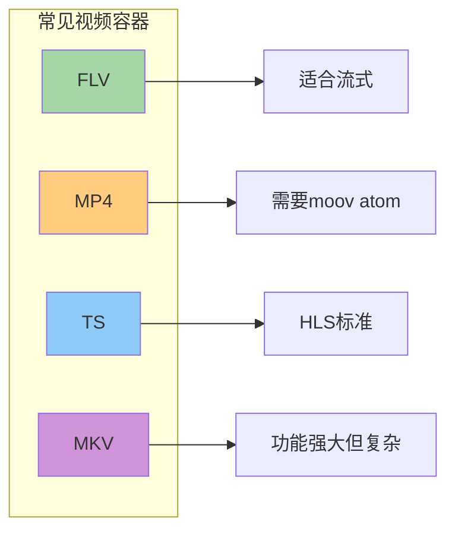

**FLV的核心优势：**

1. **流式友好**：FLV是"流式"设计，可以在传输过程中动态添加数据
2. **简单轻量**：规范文档只有几十页，解析器实现简单
3. **时间戳精确**：使用32位时间戳，精度到毫秒
4. **国内生态**：Flash时代遗留的完善工具链

**FLV的根本设计哲学：**

```
FLV的设计假设是：数据源源不断地来，边来边播，不需要知道总长度。
这正是直播场景的完美匹配！
```

### 3.2 FLV文件结构详解

#### 宏观结构

```
FLV文件 = FLV Header + FLV Body

FLV Body = Tag0 + Tag1 + Tag2 + ... + TagN
          (视频)  (音频)  (脚本)   ...
```

#### FLV Header（9字节）

```
偏移    大小    说明
0       3       签名："FLV" (0x46 0x4C 0x56)
3       1       版本：通常是0x01
4       1       类型标志：
                  bit0: 有音频
                  bit2: 有视频
5       4       Header长度：通常是0x00000009 (9字节)
```

**示例：**
```
46 4C 56 01 05 00 00 00 09
F  L  V v1 音视频  9字节头
```

#### FLV Tag结构（每个Tag的完整格式）

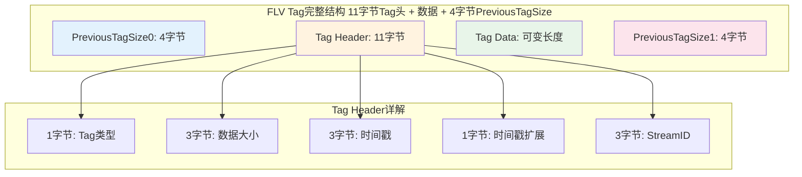

#### Tag Header详解（11字节）

```
字节偏移  大小     字段            说明
0        1       TagType        8=视频, 9=音频, 18=脚本
1        3       DataSize       Tag数据的字节数（大端序）
4        3       Timestamp      时间戳（毫秒，相对于第一个Tag）
7        1       TimestampExtended  时间戳高8位（扩展到32位）
8        3       StreamID       总是0
```

**实际示例——解析一个视频Tag：**

```
09 00 01 2A 00 00 0A 00 00 00 00 [视频数据...]
↑  ↑        ↑         ↑
类型 数据大小  时间戳    StreamID
(视频) 300字节 10ms      (总是0)

完整时间戳 = (TimestampExtended << 24) | Timestamp
          = (0x00 << 24) | 0x00000A
          = 10ms
```

### 3.3 视频Tag数据格式

视频Tag内部结构：

```
视频Tag数据：
┌──────────────┬──────────┬──────────────────┐
│  1字节        │ 1字节     │ 实际视频数据      │
│  FrameType +  │ CodecID  │                 │
│  (高4位+低4位) │          │                 │
└──────────────┴──────────┴──────────────────┘

FrameType (高4位):
  1 = 关键帧 (Keyframe / I帧)
  2 = 中间帧 (Inter frame / P帧)
  3 = 可丢弃中间帧
  4 = 生成的关键帧
  5 = 视频信息/命令帧

CodecID (低4位):
  7 = AVC (H.264)
  12 = HEVC (H.265)
```

**AVC视频Tag的三层结构：**

```
AVC视频Tag数据（紧跟上面的视频数据之后）：
┌──────────────┬──────────────┬──────────────┐
│  1字节        │ 3字节        │ N字节         │
│  AVCPacketType│  Composition │ NALU数据      │
│              │  TimeOffset  │              │
└──────────────┴──────────────┴──────────────┘

AVCPacketType:
  0 = AVC序列头 (Sequence Header)
  1 = AVC NALU (普通视频帧)
  2 = AVC序列结束 (End of Sequence)

Composition Time Offset:
  B帧解码时间偏移量（PTS - DTS）
```

**关键概念——AVC序列头：**

```
这是HTTP-FLV中最重要的一种Tag！

序列头包含：
- SPS (Sequence Parameter Set): 视频分辨率、帧率等
- PPS (Picture Parameter Set): 熵编码模式、片组信息等

没有序列头，播放器无法解码任何视频数据！
```

### 3.4 音频Tag数据格式

```
音频Tag数据：
┌──────────────┬──────────────────────────────┐
│  1字节        │ 实际音频数据                  │
│  格式信息      │                            │
└──────────────┴──────────────────────────────┘

格式信息（高4位+低4位）：
高4位 - SoundFormat:
  10 = AAC
  11 = Opus (FLV规范扩展)
  
低4位 - 采样率/采样大小/声道数（仅对非AAC有效）

AAC音频Tag内部结构：
┌──────────────┬──────────────┬──────────────┐
│  1字节        │ 1字节        │ 实际音频数据  │
│  SoundFormat  │ AACPacketType│             │
└──────────────┴──────────────┴──────────────┘

AACPacketType:
  0 = AAC序列头 (AudioSpecificConfig)
  1 = AAC原始帧
```

### 3.5 Script Tag（MetaData）

```
Script Tag (Type=18) 包含流媒体元数据：

常见字段：
- duration: 时长（直播通常没有）
- width/height: 视频宽高
- videodatarate: 视频码率
- audiodatarate: 音频码率
- framerate: 帧率
- codecs: 编解码器信息
- encoder: 编码器信息
```

**Script Tag的重要性：**
- 播放器需要它来初始化解码器
- 通常每个直播流只在开头发送一次
- 如果丢失，播放器无法正确显示视频

---

## 四、HTTP-FLV的核心工作原理

### 4.1 完整的HTTP-FLV工作流程

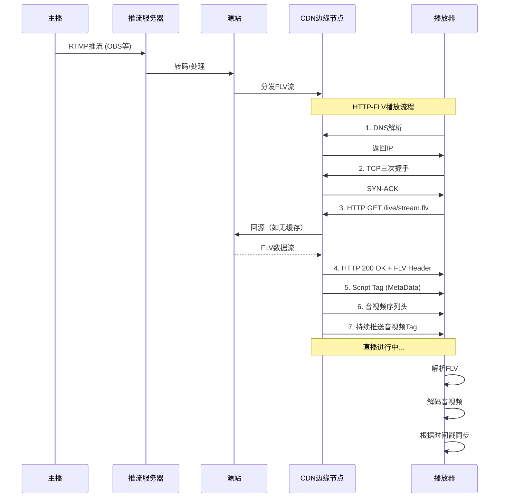

### 4.2 服务端如何实现"持续推送"

这是HTTP-FLV最核心的技术点。让我们深入源码级别理解。

#### 传统HTTP响应 vs HTTP-FLV流式响应

**普通HTTP响应（以Nginx为例）：**

```c
// 伪代码
void handle_request(Request *req) {
    File *file = open_file(req->path);
    size_t size = file->size;  // 需要知道文件大小
    
    send_header("Content-Length: %zu", size);  // 必须告诉客户端大小
    send_file(file);  // 发送完整文件
    close_connection();  // 发送完毕，关闭连接
}
```

**HTTP-FLV流式响应：**

```c
// 伪代码 - 展示核心思想
void handle_http_flv_request(Request *req) {
    LiveStream *stream = get_live_stream(req->path);
    
    // 注意：不设置Content-Length！
    send_header("HTTP/1.1 200 OK");
    send_header("Content-Type: video/x-flv");
    send_header("Transfer-Encoding: chunked");  // 或干脆不设置
    send_header("Connection: keep-alive");
    send_header("\r\n");  // 头部结束
    
    // 发送FLV头部（只发一次）
    send_data(stream->flv_header, 9);
    
    // 进入无限循环
    while (connection_is_alive) {
        // 等待新的音视频数据
        Tag *tag = wait_for_next_tag(stream);
        
        // 立即发送给客户端
        send_tag(tag);
        
        // 强制刷新TCP缓冲区，确保数据发出
        flush_tcp_buffer();
    }
}
```

**关键差异点：**

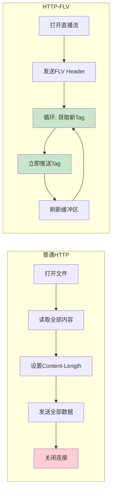

### 4.3 CDN如何缓存HTTP-FLV

这是一个常见的误区——**HTTP-FLV实际上不是被"缓存"的，而是被"转播"的**。

#### HTTP-FLV的CDN分发机制

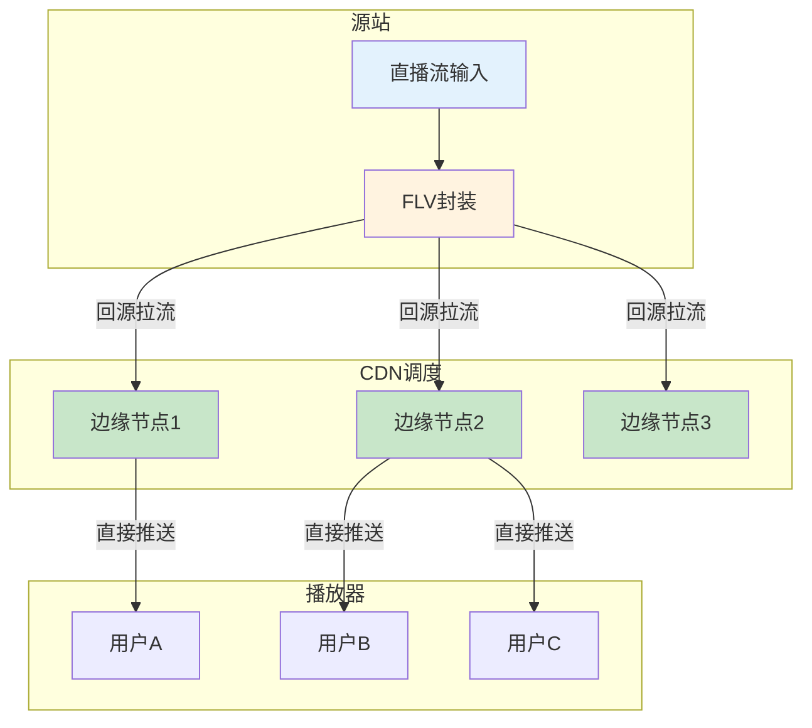

**关键机制——回源拉流：**

1. **第一个用户请求**：
   - 边缘节点收到`GET /live/stream.flv`
   - 检查本地：没有这个流
   - 向源站发起HTTP请求，建立长连接
   - 源站开始推送FLV数据
   - 边缘节点收到数据后，**一边接收一边推送给客户端**

2. **第二个用户请求同一个流**：
   - 边缘节点检查：已经有这个流的活跃连接
   - **不再向源站发起新请求**
   - 直接将已有的数据流复制给新客户端
   - 这就是所谓的"拉流转推"

3. **所有用户都离开**：
   - 边缘节点检测到没有客户端订阅这个流
   - 主动断开与源站的连接
   - 清理资源

**根本原因揭示：**

```
为什么HTTP-FLV能支撑大规模并发？

答案：CDN的"拉流转推"机制！

源站只需要为每个边缘节点维护1个连接，
边缘节点负责将1个流复制给N个用户。

源站压力 = 边缘节点数量
而不是 = 用户总数
```

### 4.4 GOP缓存——秒开播放的关键

#### 什么是GOP？

GOP（Group of Pictures）是视频编码中的一个概念：

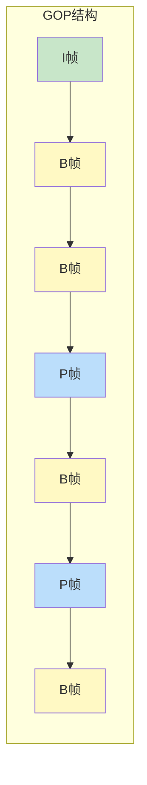

- **I帧（关键帧）**：完整图像，可以独立解码
- **P帧（前向预测帧）**：依赖前面的帧
- **B帧（双向预测帧）**：依赖前面和后面的帧

**关键规则：解码必须从I帧开始！**

#### GOP缓存的工作原理

```
问题：用户进入直播间时，如果恰好错过I帧，会怎样？

答案：播放器会一直等待下一个I帧，期间画面黑屏！

解决方案：GOP缓存
```

**服务端GOP缓存机制：**

```
正常直播流（无GOP缓存）：
时间线 →
... P B B I B B P B B | 新用户进入 | B B P B B I B B ...
                        ↑
                   无法解码！等待I帧...

有GOP缓存：
服务端维护一个GOP Cache：
┌──────────────────────────┐
│ 最近一个完整GOP          │
│ [I B B P B B P]         │
└──────────────────────────┘

新用户进入：
1. 立即发送缓存的GOP（从I帧开始）
2. 然后切换到实时流
3. 用户几乎立刻看到画面

效果：首屏时间从等待一个GOP(2-4秒)降到0.5-1秒
```

**GOP缓存实现伪代码：**

```c
typedef struct {
    Tag** tags;          // 存储一个GOP的所有Tag
    size_t tag_count;    // Tag数量
    size_t total_size;   // 总字节数
    bool has_keyframe;   // 是否已收到I帧
} GOPCache;

void on_tag_received(Tag* tag, GOPCache* cache) {
    if (is_keyframe(tag)) {
        if (cache->has_keyframe) {
            // 新的I帧来了，说明上一个GOP结束
            // 保留当前GOP，清空缓冲区
            save_completed_cache(cache);
            clear_cache(cache);
        }
        cache->has_keyframe = true;
    }
    
    if (cache->has_keyframe) {
        // 将Tag添加到缓存
        add_tag_to_cache(cache, tag);
    }
}

void on_user_join(LiveStream* stream, Client* client) {
    // 新用户加入，先发送缓存的GOP
    if (stream->gop_cache.is_complete) {
        send_tags(client, stream->gop_cache.tags, 
                  stream->gop_cache.tag_count);
    }
    // 然后加入实时推送列表
    add_to_live_clients(stream, client);
}
```

**GOP大小的影响：**

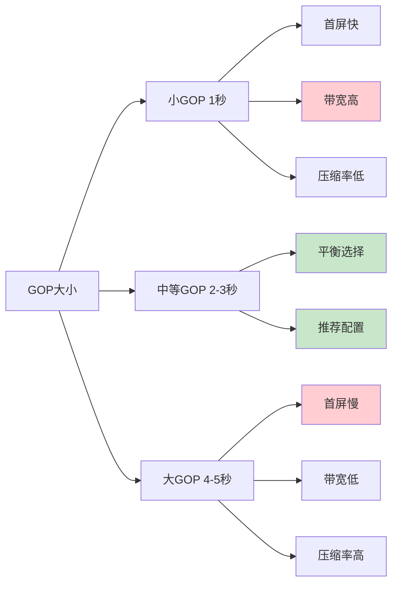

### 4.5 时间戳同步机制

这是理解播放流畅性的核心！

#### DTS vs PTS

```
DTS (Decoding Time Stamp): 解码时间戳
  - 告诉播放器什么时候解码这一帧
  - 主要考虑依赖关系（必须先解码依赖的帧）

PTS (Presentation Time Stamp): 显示时间戳  
  - 告诉播放器什么时候显示这一帧
  - 考虑B帧的乱序问题

为什么需要两个时间戳？

因为有B帧的存在！

编码顺序: I1 B1 B2 P3 B4 B5 P6
DTS:      0  1  2  3  4  5  6

解码顺序: I1 P3 B1 B2 P6 B4 B5
但显示顺序必须保持: I1 B1 B2 P3 B4 B5 P6
PTS:      0  1  2  3  4  5  6
```

#### FLV中的时间戳处理

```
FLV Tag Header中只有一个32位时间戳字段，它存储的是什么？

答案：对于视频Tag，FLV中的时间戳通常是DTS！
```

**Composition Time Offset的作用：**

```
AVC视频Tag中有个CompositionTimeOffset字段：

CompositionTimeOffset = PTS - DTS

播放器收到Tag后：
DTS = FLV Tag Header中的Timestamp
PTS = DTS + CompositionTimeOffset
```

**实例分析：**

```
假设GOP=2秒，帧率=30fps，有B帧

编码顺序和DTS：
帧:    I1  B1  B2  P3  B4  B5  P6
DTS:   0   33  66  100 133 166 200  (毫秒)
PTS:   0   66  33  100 166 133 200
CTO:   0   33  -33 0   33  -33 0    (CTO = PTS - DTS)

FLV传输顺序（按DTS）：
Tag0: DTS=0,   CTO=0    (I1)
Tag1: DTS=33,  CTO=33   (B1)
Tag2: DTS=66,  CTO=-33  (B2)
Tag3: DTS=100, CTO=0    (P3)
...

播放器处理：
1. 按DTS顺序接收和缓存
2. 按DTS顺序解码
3. 按PTS顺序显示
```

#### 播放器缓冲区的同步逻辑

```mermaid
stateDiagram-v2
    [*] --> 等待首个I帧
    等待首个I帧 --> 收集缓冲区: 收到I帧
    收集缓冲区 --> 检查同步: 收到新帧
    检查同步 --> 播放: 音频视频同步
    检查同步 --> 等待: 时间戳不连续
    等待 --> 收集缓冲区: 收到新GOP
    播放 --> 检查延迟: 持续播放
    检查延迟 --> 追赶: 延迟>阈值
    检查延迟 --> 等待: 缓冲不足
    检查延迟 --> 播放: 正常
    追赶 --> 播放: 追赶成功
    追赶 --> 等待: 追赶失败
    
    style 等待首个I帧 fill:#ffcdd2
    style 播放 fill:#c8e6c9
    style 追赶 fill:#fff9c4
```

**音视频同步的三种策略：**

1. **音频主同步**（推荐）：
   - 以音频播放时间为基准
   - 视频追赶或等待音频
   - 人耳对音频卡顿更敏感

2. **视频主同步**：
   - 以视频播放时间为基准
   - 音频拉伸或压缩
   - 适合纯视频场景

3. **外部时钟同步**：
   - 使用系统时钟
   - 音频和视频都向系统时钟对齐
   - 实现复杂，较少使用

---

## 五、延迟的根本原因分析

### 5.1 延迟的完整路径拆解

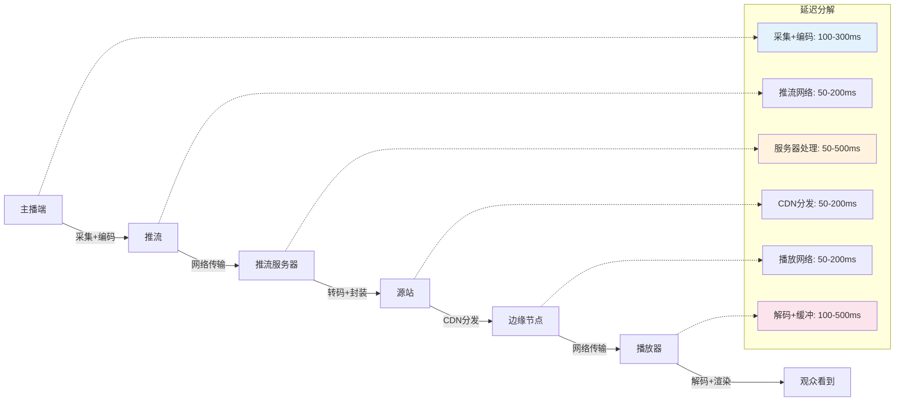

**总延迟 = 采集编码 + 推流网络 + 服务器处理 + CDN分发 + 播放网络 + 解码缓冲**

### 5.2 延迟根本原因一：编码器配置

#### GOP大小对延迟的影响

```
这是最容易被忽视的延迟来源！

根本原因：播放器必须从I帧开始解码

场景分析：
```

```mermaid
gantt
    title GOP大小对首屏延迟的影响
    dateFormat X
    axisFormat %s
    
    section GOP=1秒
    I帧     :0, 1000
    新用户进入 :crit, 500, 1
    等待下一个I帧 :crit, 500, 500
    
    section GOP=3秒
    I帧     :0, 3000
    新用户进入 :crit, 1000, 1
    等待下一个I帧 :crit, 1000, 2000
    
    section GOP=5秒
    I帧     :0, 5000
    新用户进入 :crit, 1000, 1
    等待下一个I帧 :crit, 1000, 4000
```

**极端场景复现：**

```
假设GOP=3秒，用户在第一个I帧后100ms进入直播间：

时间线：
0ms     ---- I帧（用户还没来）
100ms   ---- 用户进入，发送HTTP请求
300ms   ---- 建立连接，开始接收数据
310ms   ---- 收到GOP缓存（假设有）
310ms   ---- 开始解码播放

如果没有GOP缓存：
0ms     ---- I帧
100ms   ---- 用户进入
300ms   ---- 收到数据（但都是P/B帧，无法解码）
300ms   ---- 黑屏等待...
3000ms  ---- 下一个I帧终于来了
3010ms  ---- 开始播放

延迟差异：
有GOP缓存：310ms
无GOP缓存：3010ms
差距：近3秒！
```

#### B帧对延迟的影响

```
B帧的根本问题：需要依赖后续帧才能解码

编码顺序（无B帧）：I P P P P P P
解码顺序：I P P P P P P
延迟：无额外延迟

编码顺序（有B帧）：I B B P B B P
解码顺序：I P B B P B B
问题：P帧到来前，B帧必须等待

延迟增加：最多一个GOP内的帧间隔
  30fps + GOP=2秒 → 最多等待60帧
  实际影响：通常100-500ms
```

**推荐配置（低延迟场景）：**

```
OBS/编码器配置：
- GOP大小：1-2秒（根据场景）
- B帧数量：0-2个（游戏直播建议0）
- 码率控制：CBR（固定码率）
- 预设（x264）：veryfast/superfast
- Profile：baseline（无B帧）或main

FFmpeg推流示例：
ffmpeg -re -i input.mp4 \
  -c:v libx264 \
  -preset veryfast \
  -tune zerolatency \
  -g 60 \        # GOP=60帧，30fps时=2秒
  -keyint_min 60 \
  -sc_threshold 0 \
  -bf 0 \        # 禁用B帧
  -c:a aac \
  -f flv rtmp://server/live/stream
```

### 5.3 延迟根本原因二：服务端缓冲

#### 服务端的"延迟推送"机制

```
很多直播服务器会故意延迟推送，为什么？

根本原因：减少请求频率，降低服务器压力
```

**延迟推送的两种实现：**

```c
// 方式1：固定延迟
void push_to_clients(Tag* tag) {
    sleep(DELAY_MS);  // 故意等待，比如200ms
    send_to_all_clients(tag);
}

// 方式2：批量推送
void batch_push_to_clients() {
    while (true) {
        Tag* tag = wait_for_tag();
        buffer.add(tag);
        
        if (buffer.size() >= BATCH_SIZE || 
            timeout_reached()) {
            send_to_all_clients(buffer);
            buffer.clear();
        }
    }
}
```

**如何识别服务端是否在延迟推送？**

```
测试方法：
1. 观察连续Tag的时间戳间隔
2. 测量实际收到Tag的时间间隔
3. 对比两者差异

如果：
  时间戳间隔 = 33ms (30fps)
  实际接收间隔 = 100ms
  
说明：服务端在批量推送，每次推3帧左右
```

#### 播放端缓冲区

```
播放器为了流畅播放，会维护一个缓冲区

典型配置：
- 最小缓冲：0.5-1秒（低延迟）
- 正常缓冲：2-3秒（流畅优先）
- 最大缓冲：5-10秒（弱网环境）

根本矛盾：
  缓冲大 → 流畅但不实时
  缓冲小 → 实时但易卡顿
```

### 5.4 延迟根本原因三：CDN调度策略

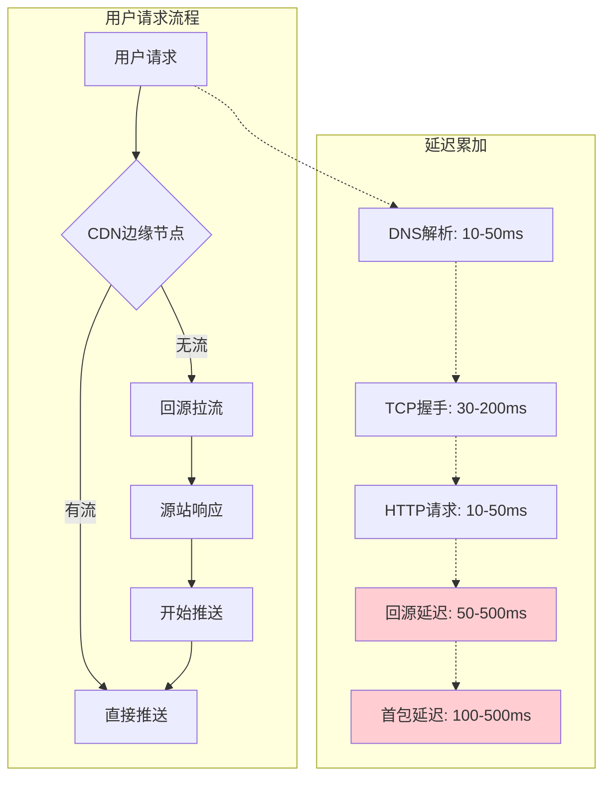

**回源延迟的累加效应：**

```
新用户首次播放的完整延迟路径：

0ms     ---- 用户点击播放
20ms    ---- DNS查询
50ms    ---- TCP三次握手
70ms    ---- 发送HTTP GET
100ms   ---- 边缘节点收到请求
150ms   ---- 边缘节点向源站发起请求（如果需要回源）
200ms   ---- 源站响应
250ms   ---- 边缘节点收到FLV Header
260ms   ---- 边缘节点开始推送给客户端
300ms   ---- 客户端收到数据，开始解码
350ms   ---- 首帧渲染

仅网络开销就达到350ms！

如果再加上GOP等待、缓冲等，总延迟轻松突破1-2秒
```

### 5.5 延迟根本原因四：TCP协议的固有特性

#### Nagle算法的影响

```
Nagle算法：TCP为了提高带宽利用率，会等待小数据包合并

问题：直播Tag通常很小（几十到几百字节）
结果：被Nagle算法延迟发送

延迟：最多200ms（一个RTT）
```

**如何关闭Nagle算法：**

```c
// 服务端
int flag = 1;
setsockopt(sockfd, IPPROTO_TCP, TCP_NODELAY, &flag, sizeof(flag));

// 效果：每个Tag立即发送，不等待
// 代价：网络包数量增加，带宽利用率下降
```

#### TCP重传机制

```
丢包时的TCP行为：

时间线：
T0  ---- 发送数据包#100
T1  ---- 等待ACK...
T2  ---- 超时（通常200ms-1s）
T3  ---- 重传数据包#100
T4  ---- 收到ACK
T5  ---- 继续发送#101

延迟增加：T4 - T1 = 超时时间

根本问题：TCP是可靠传输，必须等待确认
而直播是实时场景，过期的数据重传没有意义！

解决方案：
1. 应用层控制缓冲区，丢弃过期数据
2. 使用TCP_QUICKACK（Linux）
3. 考虑QUIC/WebRTC（基于UDP）
```

---

## 六、卡顿问题的深层机制

### 6.1 卡顿的本质

```
卡顿的根本原因只有一个：

  播放器缓冲区数据耗尽，必须等待新数据

但导致这个结果的原因有很多...
```

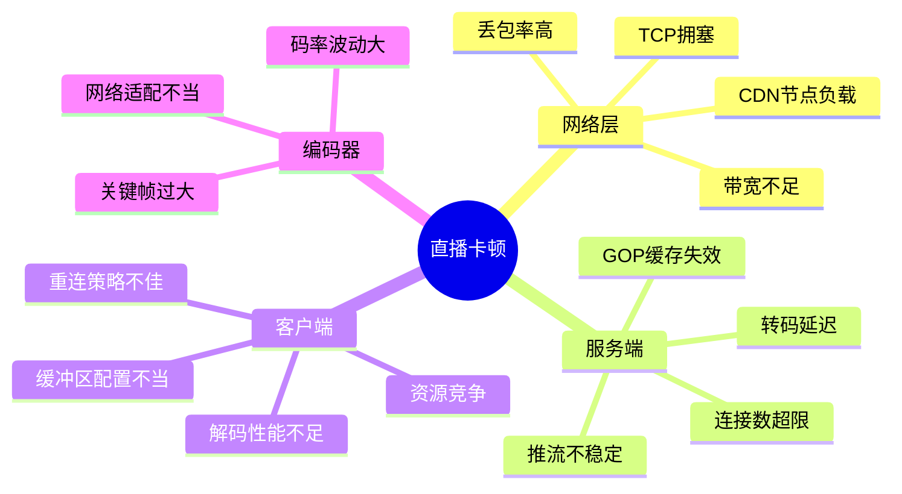

### 6.2 网络层卡顿——深入TCP拥塞控制

#### TCP拥塞控制的四个算法

```
1. 慢启动 (Slow Start)
2. 拥塞避免 (Congestion Avoidance)
3. 快重传 (Fast Retransmit)
4. 快恢复 (Fast Recovery)

对直播影响最大的是：慢启动！
```

**慢启动过程详解：**

```
场景：用户刚进入直播间

时间    拥塞窗口(cwnd)   可发送数据    说明
T0      1 MSS           1个包        初始状态
T1      2 MSS           2个包        收到ACK，窗口翻倍
T2      4 MSS           4个包        继续指数增长
T3      8 MSS           8个包
T4      16 MSS          16个包
T5      32 MSS          32个包
...     ...             ...
Tn      达到ssthresh    进入拥塞避免

MSS = Maximum Segment Size，通常1460字节

问题：直播数据源源不断地来，但TCP发送速度
     受限于拥塞窗口。如果窗口太小，发送速度
     跟不上播放速度，就会卡顿！
```

**实例分析——首屏卡顿：**


#### 带宽估算与自适应码率

```
根本矛盾：
  高码率 → 画质好但易卡顿
  低码率 → 流畅但画质差

解决方案：自适应码率（ABR - Adaptive Bitrate）

但HTTP-FLV的ABR实现比HLS困难：
  HLS：预先编码多个码率，客户端切换URL即可
  HTTP-FLV：实时流，切换码率需要服务端支持
```

**HTTP-FLV的多码率切换方案：**

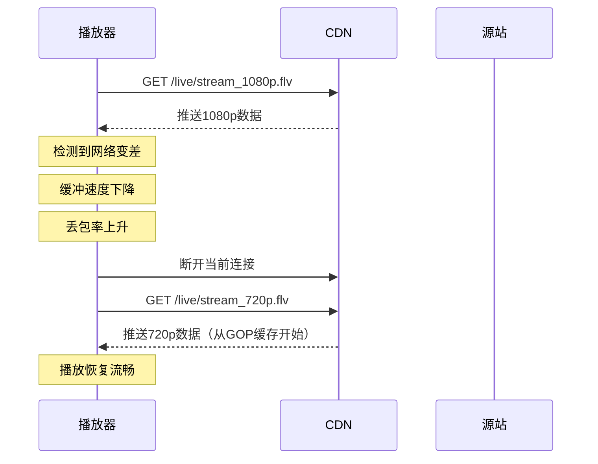

### 6.3 服务端卡顿——推流不稳定的传递效应

#### 推流中断的连锁反应

```
推流端网络抖动的影响传播：

主播端 ----> 推流服务器 ----> 源站 ----> CDN ----> 观众

T0  主播网络抖动
T1  推流服务器断流
T2  源站标记流为"不活跃"
T3  CDN断开回源连接
T4  GOP缓存失效
T5  观众端卡顿
T6  播放器尝试重连

传播延迟：T5 - T0 = 通常1-3秒
恢复时间：T6 + 重连时间 + GOP缓存重建 = 3-10秒
```

#### 并发连接数限制

```
CDN边缘节点的承载能力是有限的：

假设：
  单节点带宽上限：10 Gbps
  单个直播流码率：5 Mbps
  理论上可承载：10000 / 5 = 2000个并发用户

实际情况：
  需要考虑TCP连接数、CPU、内存等
  通常单节点承载：5000-20000用户

超过限制后：
  新用户无法连接（HTTP 503）
  或现有用户被踢掉（连接断开）
  表现：卡顿、黑屏、播放失败
```

### 6.4 客户端卡顿——解码器与渲染

#### 解码性能瓶颈

```
常见场景：
  低端手机播放1080p/60fps
  浏览器软解码H.265
  多标签页同时播放

表现：
  画面卡顿但音频正常
  播放器时间戳持续落后于系统时钟
  帧率不稳定

根本原因：
  解码速度跟不上编码速度
  
  例如：
    编码：30fps → 每帧33ms
    解码：实际40ms/帧
    结果：越来越落后，缓冲区最终耗尽
```

**检测解码性能：**

```javascript
// 使用Media Source Extensions API
const video = document.querySelector('video');
const sourceBuffer = mediaSource.addSourceBuffer('video/x-flv; codecs="avc1.42E01E"');

// 监控缓冲状态
console.log('缓冲范围:', video.buffered);
console.log('当前时间:', video.currentTime);
console.log('就绪状态:', video.readyState);

// 卡顿检测
let lastTime = 0;
let stallCount = 0;

setInterval(() => {
    if (video.currentTime === lastTime && !video.paused) {
        stallCount++;
        console.warn(`检测到卡顿！次数: ${stallCount}`);
        
        if (stallCount > 3) {
            // 可能卡死了，尝试重连
            console.error('多次卡顿，触发重连');
            reconnect();
        }
    } else {
        stallCount = 0;
    }
    lastTime = video.currentTime;
}, 500);
```

---

## 七、HTTP-FLV vs 其他直播协议

### 7.1 协议对比全维度分析

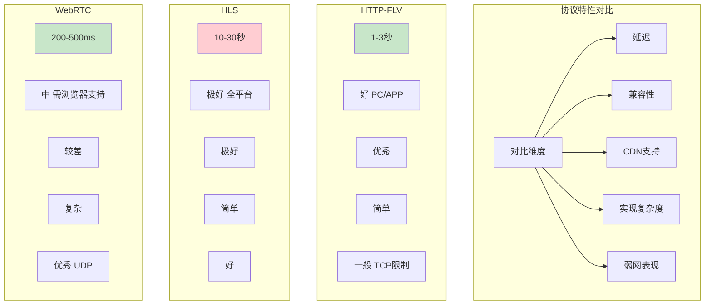

### 7.2 详细对比表

| 维度 | HTTP-FLV | HLS | WebRTC | RTMP |
|------|----------|-----|--------|------|
| **延迟** | 1-3秒 | 10-30秒 | 200-500ms | 1-3秒 |
| **传输协议** | TCP | TCP | UDP | TCP |
| **端口** | 80/443 | 80/443 | 动态 | 1935 |
| **防火墙穿透** | 优秀 | 优秀 | 一般 | 差 |
| **CDN支持** | 优秀 | 优秀 | 有限 | 有限 |
| **iOS支持** | 需APP | 原生支持 | 需APP | 需APP |
| **Android支持** | 良好 | 优秀 | 良好 | 良好 |
| **Web支持** | flv.js | 原生 | 原生 | 需Flash |
| **服务端实现** | 简单 | 简单 | 复杂 | 中等 |
| **客户端实现** | 中等 | 简单 | 复杂 | 中等 |
| **弱网抗性** | 一般 | 好 | 优秀 | 一般 |
| **大规模并发** | 优秀 | 优秀 | 较差 | 较差 |
| **多码率切换** | 困难 | 原生支持 | 困难 | 困难 |
| **适用场景** | 游戏直播<br>电商直播 | VOD<br>非实时直播 | 视频会议<br>互动直播 | 推流<br>私有网络 |

### 7.3 为什么不是WebRTC？

```
WebRTC延迟更低，为什么不用？

根本原因：架构和成本

HTTP-FLV架构：
  主播 --RTMP--> 服务器 --HTTP-FLV--> CDN --HTTP-FLV--> 观众
  
  服务器成本：转码 + 封装
  CDN成本：标准HTTP CDN，便宜
  可扩展性：百万级并发无压力

WebRTC架构：
  主播 --WebRTC--> SFU/MCU --WebRTC--> 观众
  
  服务器成本：实时转发，需要保持状态
  CDN成本：传统CDN不支持，需要专用网络
  可扩展性：单房间通常<100人

结论：
  大规模直播（万人以上）：HTTP-FLV更合适
  小房间互动（百人以下）：WebRTC更合适
```

### 7.4 协议选择的决策树

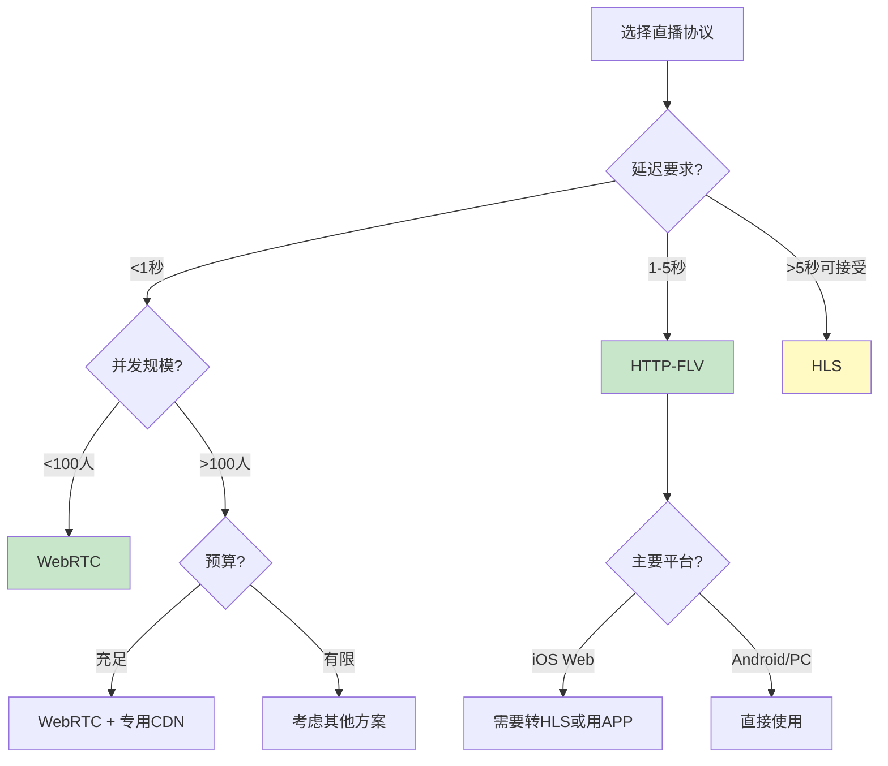

---

## 八、生产环境最佳实践

### 8.1 编码器配置最佳实践

#### 游戏直播（低延迟优先）

```
场景：游戏直播，观众5000+，延迟敏感

推荐配置：
┌─────────────────┬──────────────────┐
│ 参数            │ 推荐值           │
├─────────────────┼──────────────────┤
│ 分辨率          │ 1920x1080        │
│ 帧率            │ 60 fps           │
│ 码率            │ 6000-8000 kbps   │
│ 码率控制        │ CBR              │
│ GOP             │ 2秒 (120帧)      │
│ B帧             │ 0 (禁用)         │
│ 预设            │ veryfast         │
│ Profile         │ high             │
│ 音频            │ AAC 128kbps 48kHz│
└─────────────────┴──────────────────┘

FFmpeg命令：
ffmpeg -f dshow -i video="Game Capture" -i audio="Virtual Audio" \
  -c:v libx264 \
  -preset veryfast \
  -tune zerolatency \
  -b:v 6000k \
  -maxrate 6000k \
  -bufsize 12000k \
  -g 120 \
  -keyint_min 120 \
  -sc_threshold 0 \
  -bf 0 \
  -profile:v high \
  -c:a aac \
  -b:a 128k \
  -ar 48000 \
  -f flv rtmp://push.server/live/stream
```

#### 电商直播（流畅优先）

```
场景：电商带货，观众10000+，网络环境复杂

推荐配置：
┌─────────────────┬──────────────────┐
│ 参数            │ 推荐值           │
├─────────────────┼──────────────────┤
│ 分辨率          │ 1280x720         │
│ 帧率            │ 30 fps           │
│ 码率            │ 2500-3500 kbps   │
│ 码率控制        │ CBR              │
│ GOP             │ 1秒 (30帧)       │
│ B帧             │ 2                │
│ 预设            │ medium           │
│ Profile         │ main             │
│ 音频            │ AAC 64kbps 44.1kHz│
└─────────────────┴──────────────────┘

关键优化：小GOP确保秒开，低码率适应弱网
```

### 8.2 服务端配置最佳实践

#### Nginx-RTMP模块配置

```nginx
rtmp {
    server {
        listen 1935;
        chunk_size 4096;  # 减小chunk大小，降低延迟
        
        application live {
            live on;
            record off;
            
            # GOP缓存配置
            wait_key on;  # 新观众从关键帧开始
            wait_video on;
            
            # 优化推送延迟
            interleave on;  # 交错发送，减少排队
            sync 10ms;      # 同步间隔
            
            # 推流认证
            on_publish http://auth.server/publish;
            
            # 转HTTP-FLV
            hls off;
            
            # 推送到HTTP-FLV输出
            exec_push ffmpeg -i rtmp://localhost/live/$name \
                -c copy \
                -f flv http://localhost:8080/live/$name.flv;
        }
    }
}

http {
    server {
        listen 8080;
        
        location /live/ {
            flv_live on;
            chunked_transfer_encoding on;
            
            # CORS配置
            add_header 'Access-Control-Allow-Origin' '*';
            add_header 'Access-Control-Allow-Credentials' 'true';
            
            # 禁用缓存
            add_header 'Cache-Control' 'no-cache';
            add_header 'Pragma' 'no-cache';
            
            # GOP缓存
            flv_gop_cache on;
        }
    }
}
```

#### SRS (Simple RTMP Server) 配置

```nginx
# SRS 4.0 配置示例
listen              1935;
max_connections     1000;
daemon              off;
srs_log_tank        console;

http_server {
    enabled         on;
    listen          8080;
    dir             ./objs/nginx/html;
}

vhost __defaultVhost__ {
    # HTTP-FLV配置
    http_remux {
        enabled     on;
        mount       [vhost]/[app]/[stream].flv;
        hstrs       on;  # 启用HTTPS支持
        
        # GOP缓存
        gop_cache   on;
        
        # 优化：减少首屏延迟
        fast_cache  on;
    }
    
    # 转码配置（可选）
    transcode {
        enabled     off;
    }
    
    # 延迟优化
    tcp_nodelay     on;
    send_min_interval 10ms;  # 控制发送频率
}
```

### 8.3 客户端实现最佳实践

#### flv.js 完整配置

```javascript
import flvjs from 'flv.js';

class LivePlayer {
    constructor(videoElement) {
        this.video = videoElement;
        this.player = null;
        this.reconnectTimer = null;
        this.maxReconnectAttempts = 5;
        this.reconnectAttempts = 0;
        this.retryDelay = 1000; // 初始重连延迟
        this.maxRetryDelay = 10000;
    }
    
    play(url) {
        if (!flvjs.isSupported()) {
            console.error('浏览器不支持flv.js');
            return;
        }
        
        this.player = flvjs.createPlayer({
            type: 'flv',
            url: url,
            isLive: true,
            hasAudio: true,
            hasVideo: true,
            withCredentials: false,
            cors: true
        }, {
            // 延迟优化配置
            enableWorker: true,  // 启用Web Worker
            enableStashBuffer: false,  // 禁用内部缓冲，降低延迟
            stashInitialSize: 128,  // 初始缓冲区大小（KB）
            
            // 低延迟模式
            lazyLoad: false,  // 禁用延迟加载
            lazyLoadMaxDuration: 0,
            lazyLoadRecoverDuration: 0,
            
            // 跳帧配置（网络差时自动跳帧）
            deferLoadDuration: 1000,
            
            // 其他优化
            fixAudioTimestampGap: true,
            accurateSeek: false
        });
        
        this.setupEventListeners();
        this.player.attachMediaElement(this.video);
        this.player.load();
        this.player.play().catch(err => {
            console.error('播放失败:', err);
            this.handlePlaybackError();
        });
    }
    
    setupEventListeners() {
        // 错误处理
        this.player.on(flvjs.Events.ERROR, (errorType, errorDetail, errorInfo) => {
            console.error('播放错误:', errorType, errorDetail, errorInfo);
            this.handleError(errorType, errorDetail);
        });
        
        // 统计信息
        this.player.on(flvjs.Events.MEDIA_INFO, (mediaInfo) => {
            console.log('媒体信息:', mediaInfo);
        });
        
        this.player.on(flvjs.Events.METADATA_ARRIVED, (metadata) => {
            console.log('元数据:', metadata);
        });
        
        // 监控播放状态
        this.monitorPlayback();
    }
    
    monitorPlayback() {
        setInterval(() => {
            if (!this.player || !this.video) return;
            
            // 监控延迟
            const buffered = this.video.buffered;
            if (buffered.length > 0) {
                const bufferEnd = buffered.end(buffered.length - 1);
                const delay = bufferEnd - this.video.currentTime;
                
                if (delay > 3) {
                    console.warn(`播放延迟过高: ${delay.toFixed(2)}s`);
                    // 追赶策略：跳到缓冲区末尾
                    this.video.currentTime = bufferEnd - 0.5;
                }
            }
            
            // 监控卡顿
            if (this.video.readyState < 3 && !this.video.paused) {
                console.warn('缓冲区不足，可能卡顿');
            }
        }, 1000);
    }
    
    handleError(errorType, errorDetail) {
        // 网络错误，尝试重连
        if (errorType === 'NetworkError') {
            this.reconnect();
        }
        
        // 媒体错误，可能需要重新初始化
        if (errorType === 'MediaError') {
            this.destroy();
            setTimeout(() => this.play(this.currentUrl), 2000);
        }
    }
    
    reconnect() {
        if (this.reconnectAttempts >= this.maxReconnectAttempts) {
            console.error('达到最大重连次数');
            return;
        }
        
        this.reconnectAttempts++;
        const delay = Math.min(
            this.retryDelay * Math.pow(2, this.reconnectAttempts - 1),
            this.maxRetryDelay
        );
        
        console.log(`准备重连，尝试次数: ${this.reconnectAttempts}，延迟: ${delay}ms`);
        
        setTimeout(() => {
            this.destroy();
            this.play(this.currentUrl);
        }, delay);
    }
    
    destroy() {
        if (this.player) {
            this.player.pause();
            this.player.unload();
            this.player.detachMediaElement();
            this.player.destroy();
            this.player = null;
        }
    }
}

// 使用示例
const video = document.getElementById('videoElement');
const player = new LivePlayer(video);
player.play('https://live.example.com/live/stream.flv');
```

### 8.4 延迟优化检查清单

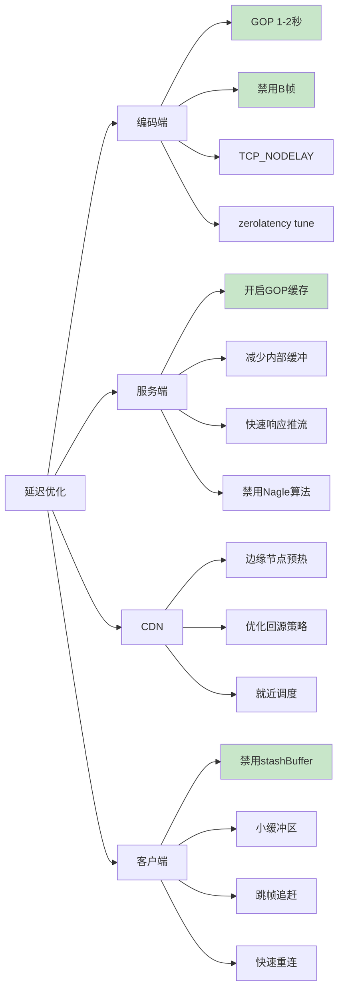

---

## 九、常见问题排查指南

### 9.1 问题诊断流程图

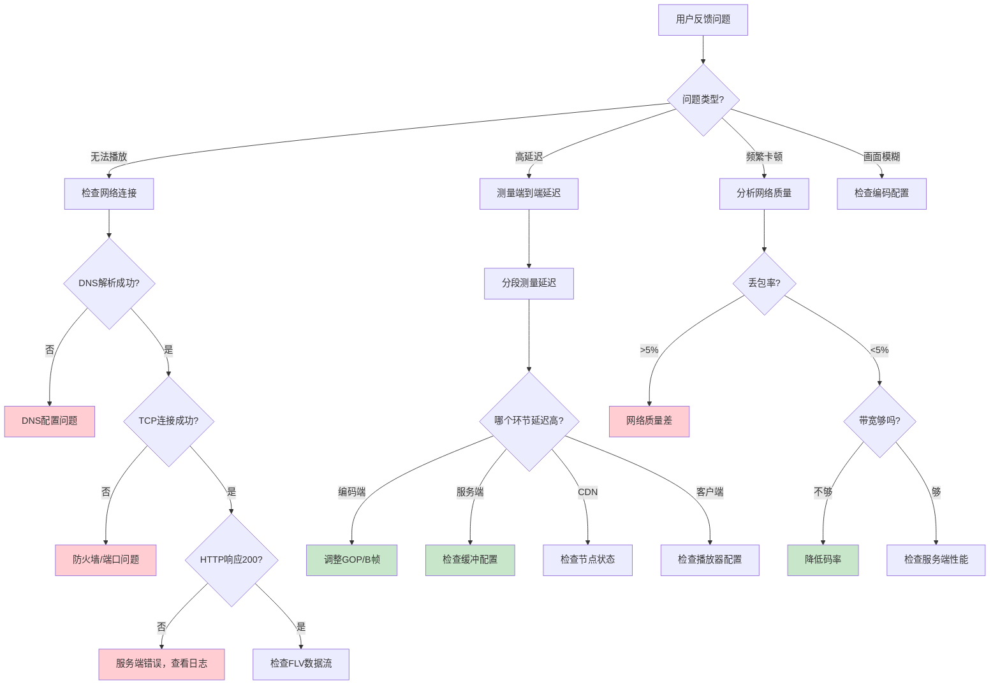

### 9.2 使用工具排查问题

#### 1. 使用curl测试HTTP-FLV流

```bash
# 测试连接和基本响应
curl -v -o /dev/null https://live.example.com/live/stream.flv

# 查看响应头
curl -I https://live.example.com/live/stream.flv

# 下载前1MB数据分析
curl -r 0-1048576 -o test.flv https://live.example.com/live/stream.flv

# 实时查看数据流（10秒后自动断开）
timeout 10 curl -s https://live.example.com/live/stream.flv | wc -c
```

#### 2. 使用FFmpeg分析FLV流

```bash
# 查看FLV文件详细信息
ffprobe -v verbose -show_format -show_streams stream.flv

# 分析视频流
ffprobe -v error -select_streams v:0 -show_entries stream=width,height,codec_name,r_frame_rate,bit_rate -of csv stream.flv

# 查看关键帧间隔
ffprobe -v error -select_streams v -show_entries frame=key_frame,pkt_pts_time -of csv stream.flv | head -50

# 实时分析HTTP-FLV流
ffprobe -i https://live.example.com/live/stream.flv -show_format
```

#### 3. 使用Wireshark抓包分析

```bash
# 过滤HTTP-FLV流
tcp.port == 8080 && http

# 查看TCP重传
tcp.analysis.retransmission

# 分析延迟
tcp.time_delta

# 查看TCP窗口大小
tcp.window_size
```

#### 4. 浏览器开发者工具

```javascript
// 在浏览器控制台执行

// 1. 查看网络请求
// Network标签 → 查看.flv请求的Time线和Size

// 2. 监控视频状态
const video = document.querySelector('video');
setInterval(() => {
    console.log({
        currentTime: video.currentTime,
        duration: video.duration,
        buffered: video.buffered.length,
        readyState: video.readyState,
        networkState: video.networkState,
        playbackRate: video.playbackRate
    });
}, 1000);

// 3. 监控MSE缓冲区
const mse = video.msGetHTMLVideoElement()?.webkitMediaSource;
if (mse) {
    console.log('SourceBuffers:', mse.sourceBuffers);
    console.log('Duration:', mse.duration);
}

// 4. flv.js统计信息
if (window.flvPlayer) {
    const stats = window.flvPlayer.statisticsInfo;
    console.log('FLV统计:', stats);
}
```

### 9.3 常见错误码和解决方案

| 错误现象 | HTTP状态码 | 可能原因 | 解决方案 |
|---------|-----------|---------|---------|
| 404 Not Found | 404 | 流不存在 | 检查流名称、确认正在推流 |
| 403 Forbidden | 403 | 鉴权失败 | 检查token、referer、IP白名单 |
| 502 Bad Gateway | 502 | 源站不可达 | 检查源站状态、网络连通性 |
| 503 Service Unavailable | 503 | 服务器过载 | 降低并发、扩容CDN |
| 连接成功但黑屏 | 200 | GOP缓存/序列头问题 | 检查GOP缓存配置、SPS/PPS |
| 有声无画 | 200 | 视频解码问题 | 检查编码格式、flv.js版本 |
| 有画无声 | 200 | 音频解码问题 | 检查音频编码、hasAudio配置 |
| 频繁卡顿 | 200 | 网络/缓冲问题 | 降低码率、检查TCP质量 |
| 延迟越来越高 | 200 | 缓冲区累积 | 启用跳帧、减小缓冲 |

### 9.4 性能监控指标

```javascript
// 关键性能指标监控
const metrics = {
    // 延迟指标
    latency: {
        e2e: 0,          // 端到端延迟
        network: 0,      // 网络延迟
        decoding: 0,     // 解码延迟
        buffering: 0     // 缓冲延迟
    },
    
    // 质量指标
    quality: {
        resolution: '',  // 分辨率
        bitrate: 0,      // 实际码率
        fps: 0,          // 帧率
        droppedFrames: 0 // 丢帧数
    },
    
    // 流畅度指标
    smoothness: {
        stallCount: 0,   // 卡顿次数
        stallDuration: 0,// 卡顿总时长
        rebufferRatio: 0 // 卡顿率
    },
    
    // 网络指标
    network: {
        bandwidth: 0,    // 带宽
        packetLoss: 0,   // 丢包率
        rtt: 0           // 往返时延
    }
};

// 上报监控数据
function reportMetrics() {
    fetch('/api/metrics', {
        method: 'POST',
        headers: { 'Content-Type': 'application/json' },
        body: JSON.stringify(metrics)
    });
}

setInterval(reportMetrics, 10000);
```

---

### 核心要点回顾

```mermaid
graph TB
    subgraph HTTP-FLV技术栈
        A[HTTP协议] --> A1[长连接机制]
        B[FLV格式] --> B1[流式设计]
        C[CDN分发] --> C1[拉流转推]
        D[GOP缓存] --> D1[秒开播放]
    end
    
    subgraph 延迟优化
        E[编码端] --> E1[小GOP/无B帧]
        F[服务端] --> F1[减少缓冲]
        G[客户端] --> G1[禁用缓冲]
    end
    
    subgraph 卡顿优化
        H[网络] --> H1[监控质量]
        I[播放器] --> I1[快速重连]
        J[服务端] --> J1[稳定推流]
    end
    
    style A1 fill:#c8e6c9
    style B1 fill:#c8e6c9
    style C1 fill:#c8e6c9
    style D1 fill:#c8e6c9
    style E1 fill:#fff9c4
    style F1 fill:#fff9c4
    style G1 fill:#fff9c4
```

**延迟的根本原因：**

1. **GOP大小**：必须从I帧开始解码，GOP越大，最坏等待越长
2. **缓冲区设计**：为了流畅性牺牲实时性
3. **TCP协议**：Nagle算法、拥塞控制、重传机制都增加延迟
4. **CDN分发**：回源、调度、网络传输累加延迟

**卡顿的根本原因：**

1. **网络带宽不足**：TCP发送速度跟不上播放速度
2. **推流不稳定**：源头断流导致连锁反应
3. **解码性能瓶颈**：解码速度跟不上编码速度
4. **缓冲区配置不当**：太小容易耗尽，太大增加延迟

### 优化原则

```
黄金法则：延迟和卡顿是一个权衡（Trade-off）

  追求低延迟 → 减少缓冲 → 更容易卡顿
  追求流畅  → 增加缓冲 → 延迟必然增加

最佳实践：
  1. 先确定业务场景的延迟要求
  2. 在延迟可接受的前提下，尽量增加缓冲
  3. 通过自适应码率、跳帧追赶等机制动态调整
  4. 全链路监控，快速定位问题
```