# HTTPS 深度解析：从密码学基础到后量子时代的互联网安全

> 当你在浏览器地址栏看到那把小锁图标时，你有没有想过——在你按下回车的几十毫秒里，你的浏览器和远端服务器之间究竟发生了什么？一个完整的 HTTPS 连接背后，涉及非对称加密、对称加密、数字签名、证书链验证、密钥协商五大密码学机制的精密协作。本文将从最基础的加密原理讲起，一步步拆解 HTTPS 的每一个环节，直到后量子密码学的前沿。

---

## 一、为什么需要 HTTPS？

### 1.1 HTTP 的三大原罪

HTTP 是互联网的基石，但它在安全上有三个根本性缺陷：

**1. 窃听风险——数据明文传输**

HTTP 数据以明文在网络上传输，任何中间节点（路由器、运营商、WiFi 热点）都可以轻松截获。你用 HTTP 访问银行网站，等于在大街上喊出你的银行卡号和密码。

**2. 篡改风险——数据可被修改**

HTTP 没有完整性校验，中间人可以随意修改传输内容。你看到的网页可能不是服务器发出的原始版本——运营商注入广告、恶意代码替换下载链接，都是常见的篡改场景。

**3. 伪造风险——身份无法验证**

HTTP 无法验证通信双方的身份。你以为自己在访问 `www.yourbank.com`，实际上可能已经落入了钓鱼网站的陷阱。

```mermaid
flowchart LR
    subgraph HTTP
        A["客户端"] -->|"明文传输<br/>可窃听、可篡改、可伪造"| B["服务器"]
        C["攻击者"] -.->|"中间人攻击<br/>窃听/篡改/伪造"| A
        C -.-> B
    end
    subgraph HTTPS
        D["客户端"] -->|"加密传输<br/>机密性、完整性、身份认证"| E["服务器"]
        F["攻击者"] x-"无法窃听<br/>无法篡改<br/>无法伪造"x D
        F x-.x E
    end
```

### 1.2 HTTPS 解决了什么？

HTTPS = HTTP + TLS（Transport Layer Security，传输层安全协议）。它在 HTTP 和 TCP 之间插入了一层安全层，提供三个核心保障：

| 安全属性 | 解决的问题 | 实现机制 |
|---------|-----------|---------|
| 机密性（Confidentiality） | 窃听 | 对称加密（AES/ChaCha20） |
| 完整性（Integrity） | 篡改 | AEAD 认证加密（GCM/Poly1305） |
| 身份认证（Authentication） | 伪造 | 数字证书 + 证书链验证 |

这三个属性缺一不可。仅有加密没有认证，你可能正在和一个冒牌服务器加密通信；仅有认证没有加密，你的数据虽然不会被伪造，但仍然会被窃听。

---

## 二、密码学基础：理解 HTTPS 的必备知识

### 2.1 对称加密：一把钥匙开一把锁

对称加密是最古老的加密方式：**加密和解密使用同一把密钥。**

常见算法：AES（Advanced Encryption Standard）、ChaCha20。

```
明文 --[密钥K加密]--> 密文 --[密钥K解密]--> 明文
```

**优点**：速度快，AES 在硬件加速下可达每秒数 GB。

**问题**：密钥如何安全地传递给对方？如果通信双方从未谋面，如何在不安全的信道上协商出一把只有彼此知道的密钥？这就是密钥分发问题——它困扰了密码学家数千年，直到公钥密码学的出现。

### 2.2 非对称加密：两把钥匙的魔法

1976 年，Diffie 和 Hellman 发表了划时代的论文 *"New Directions in Cryptography"*，提出了公钥密码学的概念。非对称加密使用一对密钥：

- **公钥（Public Key）**：公开给所有人，用于加密。
- **私钥（Private Key）**：只有自己知道，用于解密。

```
明文 --[对方公钥加密]--> 密文 --[对方私钥解密]--> 明文
```

常见算法：RSA、ECC（Elliptic Curve Cryptography）。

**优雅之处**：公钥可以公开传输，即使被截获也无法解密数据。这彻底解决了对称加密的密钥分发问题。

**局限性**：速度极慢，比对称加密慢 100-1000 倍。因此 HTTPS 不用非对称加密传输业务数据，而是用它来协商对称密钥。

### 2.3 数字签名：不可伪造的电子印章

非对称加密的公私钥还可以反向使用——私钥加密，公钥解密。这不是为了保密（因为公钥人人都有），而是为了**签名**：

```
消息 --[发送方私钥加密]--> 签名 --[发送方公钥验证]--> 确认发送方身份
```

数字签名提供了两个保障：
1. **不可否认性**：只有私钥持有者才能产生有效签名。
2. **完整性**：签名与消息内容绑定，任何篡改都会导致签名验证失败。

HTTPS 中，证书的签名就是 CA 用私钥对证书内容进行的数字签名。

### 2.4 哈希函数：数据的指纹

哈希函数将任意长度的数据映射为固定长度的摘要：

```
任意长度数据 --[哈希函数]--> 固定长度摘要（如 SHA-256 → 256位）
```

核心性质：

- **单向性**：从摘要无法反推出原始数据。
- **抗碰撞性**：找不到两个不同的输入产生相同的摘要。
- **雪崩效应**：输入微小改变，输出完全不同。

HTTPS 中哈希函数用于：数字签名前的摘要计算、TLS 握手中的伪随机函数（PRF）、证书指纹等。

### 2.5 密码学原语的协作关系

HTTPS 不是靠单一密码学技术实现的，而是多种原语的精密协作：

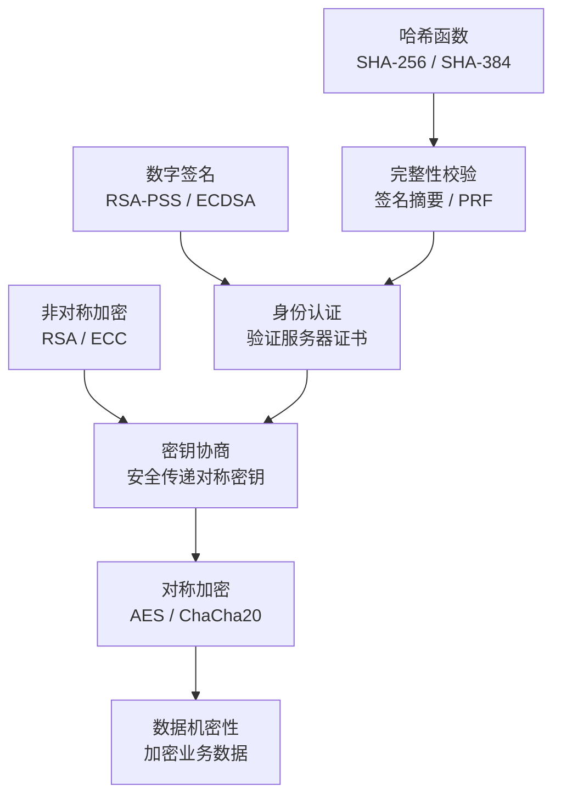

---

## 三、TLS 协议架构：HTTPS 的安全骨架

### 3.1 TLS 在协议栈中的位置

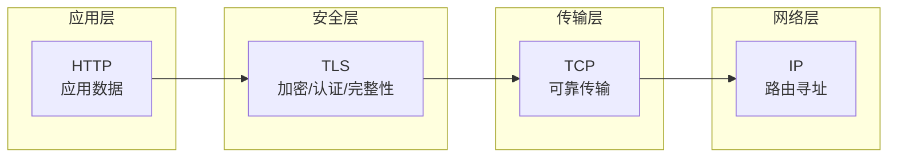

TLS 位于应用层和传输层之间，对应用层协议（HTTP、SMTP、FTP 等）透明。任何基于 TCP 的应用层协议都可以通过 TLS 获得安全保护。

### 3.2 TLS 的两层结构

TLS 协议本身由两层组成：

**1. TLS 握手协议（Handshake Protocol）**

负责协商加密参数、验证身份、建立共享密钥。这是 TLS 中最复杂的部分，也是本文重点分析的内容。

**2. TLS 记录协议（Record Protocol）**

负责将握手协议和应用数据分割成可管理的记录块，进行加密、添加 MAC（消息认证码）后交给下层传输。它是 TLS 的"数据管道"。

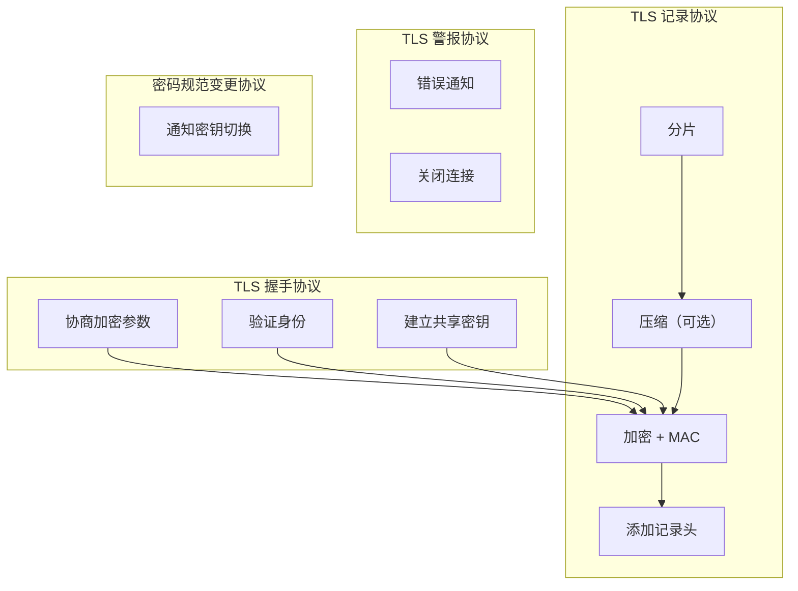

### 3.3 TLS 版本演进

| 版本 | 年份 | 关键改进 | 现状 |
|------|------|---------|------|
| SSL 3.0 | 1996 | 首个广泛部署版本 | 已废弃（POODLE 攻击） |
| TLS 1.0 | 1999 | 标准化，修 SSL 漏洞 | 已废弃（PCI DSS 禁用） |
| TLS 1.1 | 2006 | 增强 CBC 攻击防护 | 已废弃（2021） |
| TLS 1.2 | 2008 | SHA-256、AEAD 密码套件 | 当前主流，逐步退役中 |
| TLS 1.3 | 2018 | 1-RTT 握手、0-RTT 恢复、移除不安全算法 | 当前推荐，快速普及 |

**TLS 1.3 的革命性**不仅在于性能提升，更在于它大刀阔斧地砍掉了所有已知不安全的密码学算法——RSA 密钥交换、CBC 模式、RC4、SHA-1、MD5 等全部移除，从协议层面消除了大量攻击面。

---

## 四、TLS 1.2 握手详解：理解传统的完整流程

### 4.1 基于 RSA 密钥交换的握手

这是 TLS 1.2 中最经典的握手方式，也是理解 TLS 握手的最佳起点：

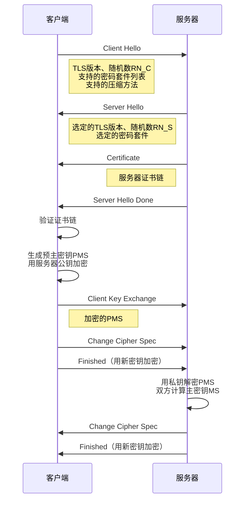

**详细步骤解读**：

**Step 1: Client Hello**

客户端发起连接，发送：
- 支持的 TLS 版本（如 TLS 1.2）
- 客户端随机数 `RN_C`（32 字节，含 4 字节时间戳）
- 支持的密码套件列表（如 `TLS_ECDHE_RSA_WITH_AES_128_GCM_SHA256`）
- 支持的压缩方法
- 扩展字段（SNI、签名算法等）

**Step 2: Server Hello**

服务器回应，选择：
- 确认的 TLS 版本
- 服务器随机数 `RN_S`（32 字节）
- 从客户端列表中选定的密码套件
- 会话 ID（用于会话恢复）

**Step 3: Certificate**

服务器发送证书链：服务器证书 → 中间 CA 证书（可能多层）→ 根 CA 证书（通常不发送，客户端内置）。

**Step 4: Server Hello Done**

服务器通知客户端，Hello 阶段结束。

**Step 5: 客户端验证证书**

客户端执行一系列验证（详见第六章）。

**Step 6: Client Key Exchange**

客户端生成一个 48 字节的预主密钥（Pre-Master Secret, PMS），用服务器证书中的公钥加密后发送。只有持有对应私钥的服务器才能解密。

**Step 7: 双方计算主密钥**

双方使用相同的算法计算主密钥（Master Secret, MS）：

```
MS = PRF(PMS, "master secret", RN_C + RN_S)
```

然后从 MS 派生出所有会话密钥：

```
key_block = PRF(MS, "key expansion", RN_S + RN_C)
```

key_block 被分割为：
- 客户端写 MAC 密钥
- 服务器写 MAC 密钥
- 客户端写加密密钥
- 服务器写加密密钥
- （如果是 CBC 模式）客户端/服务器 IV

**Step 8-9: Change Cipher Spec + Finished**

双方分别通知对方"后续消息将使用新密钥加密"，并发送 Finished 消息验证握手完整性。Finished 消息包含所有握手消息的哈希值，任何中间人篡改都会导致验证失败。

**RSA 握手的致命缺陷：没有前向安全性**

如果攻击者记录了所有加密流量，然后在某天获取了服务器的私钥，他就可以：
1. 解密之前记录的 PMS。
2. 从 PMS 计算出 MS。
3. 从 MS 派生出所有会话密钥。
4. 解密所有历史流量。

这意味着**一次私钥泄露，所有历史通信全部暴露**。这就是没有前向安全性（Forward Secrecy）的后果。

### 4.2 基于 ECDHE 密钥交换的握手

为了实现前向安全性，TLS 1.2 引入了临时 Diffie-Hellman 密钥交换（DHE/ECDHE）：

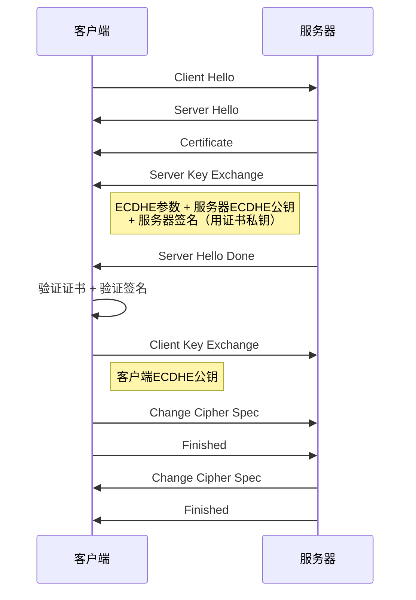

**ECDHE 的核心思想**：双方各生成一对临时 ECDH 密钥对，交换公钥后各自计算出相同的共享密钥。临时密钥对在每次握手时重新生成，会话结束后销毁——即使日后私钥泄露，攻击者也无法恢复已销毁的临时密钥，自然无法解密历史流量。

**ECDHE 密钥交换的数学原理**：

1. 双方约定椭圆曲线参数（如 curve P-256）和基点 G。
2. 服务器生成随机数 `d_S`，计算 `Q_S = d_S × G`（服务器 ECDHE 公钥）。
3. 客户端生成随机数 `d_C`，计算 `Q_C = d_C × G`（客户端 ECDHE 公钥）。
4. 交换公钥后：
   - 服务器计算共享密钥：`K = d_S × Q_C = d_S × d_C × G`
   - 客户端计算共享密钥：`K = d_C × Q_S = d_C × d_S × G`
5. 因为 `d_S × d_C × G = d_C × d_S × G`，双方得到相同的共享密钥。

**为什么攻击者无法计算 K？** 因为攻击者只能获取 `Q_S` 和 `Q_C`，要从 `Q_S` 反推 `d_S` 需要解决椭圆曲线离散对数问题（ECDLP），这在计算上是不可行的。

**Server Key Exchange 中的签名**：由于 ECDHE 参数本身没有被证书保护，服务器必须用自己的证书私钥对 ECDHE 参数进行签名，客户端验证签名后才能确认这些参数确实来自证书持有者——这防止了中间人替换 ECDHE 公钥的攻击。

### 4.3 RSA vs ECDHE 对比

| 维度 | RSA 密钥交换 | ECDHE 密钥交换 |
|------|------------|--------------|
| 前向安全性 | 无 | 有 |
| 握手往返 | 2-RTT | 2-RTT |
| 密钥建立方式 | 客户端生成，公钥加密传输 | 双方协商，数学计算 |
| 服务器计算量 | 小（只需解密 PMS） | 略大（需签名+计算共享密钥） |
| 私钥泄露影响 | 所有历史通信可解密 | 仅影响身份认证，历史通信安全 |
| TLS 1.3 支持 | 不支持 | 支持 |

---

## 五、TLS 1.3 握手详解：更快、更安全的革命

### 5.1 TLS 1.3 的核心改进

TLS 1.3 对握手进行了根本性重构，核心变化有三：

**1. 握手从 2-RTT 压缩到 1-RTT**

TLS 1.2 的握手需要两次往返：第一次协商参数，第二次确认密钥。TLS 1.3 将密钥交换参数直接放入 Hello 消息，省去了一次往返。

**2. 移除所有不安全的密码学算法**

以下算法在 TLS 1.3 中被彻底移除：

- RSA 密钥交换（无前向安全性）
- CBC 模式分组密码（BEAST/Lucky13 攻击）
- RC4（多个密钥恢复攻击）
- SHA-1/MD5（碰撞攻击）
- 非AEAD密码套件
- 压缩（CRIME 攻击）
- renegotiation（多个攻击向量）

**3. 引入 0-RTT 恢复**

之前连接过的服务器，客户端可以在第一个包中就携带加密数据，实现零往返恢复。

### 5.2 TLS 1.3 的 1-RTT 握手

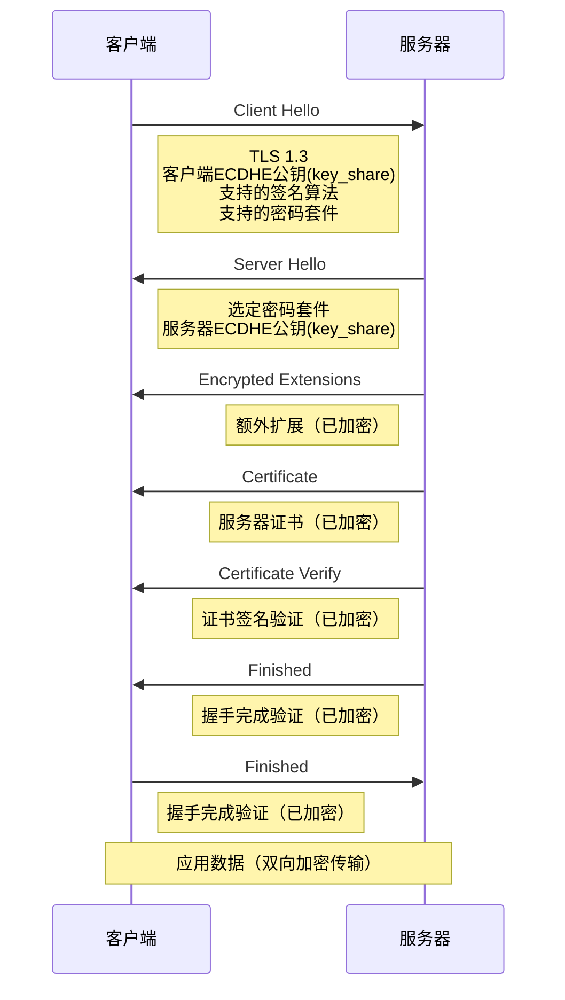

**关键差异解析**：

**1. 客户端直接发送 key_share**

TLS 1.3 中，客户端在 Client Hello 中就携带了 ECDHE 公钥（key_share 扩展），不再等待服务器确认后才生成。这意味着服务器的第一个响应就可以使用协商出的密钥加密——从 Server Hello 之后的消息全部是加密的。

**2. 大幅减少明文传输**

TLS 1.2 中，证书、Server Key Exchange 等敏感信息都是明文传输的。TLS 1.3 中，除了 Client Hello 和 Server Hello 之外，所有握手消息都使用协商出的密钥加密——即使被动窃听者也无法获取证书信息。

**3. Certificate Verify 替代了 Key Exchange**

TLS 1.3 不再有独立的 Server Key Exchange 消息。服务器的 ECDHE 公钥已经在 Server Hello 的 key_share 扩展中发送。Certificate Verify 消息用证书私钥对整个握手记录进行签名，同时完成了身份认证和 ECDHE 参数的完整性验证。

### 5.3 密钥推导：HKDF

TLS 1.3 用 HKDF（HMAC-based Extract-and-Expand Key Derivation Function）替代了 TLS 1.2 的 PRF，密钥推导更加规范：

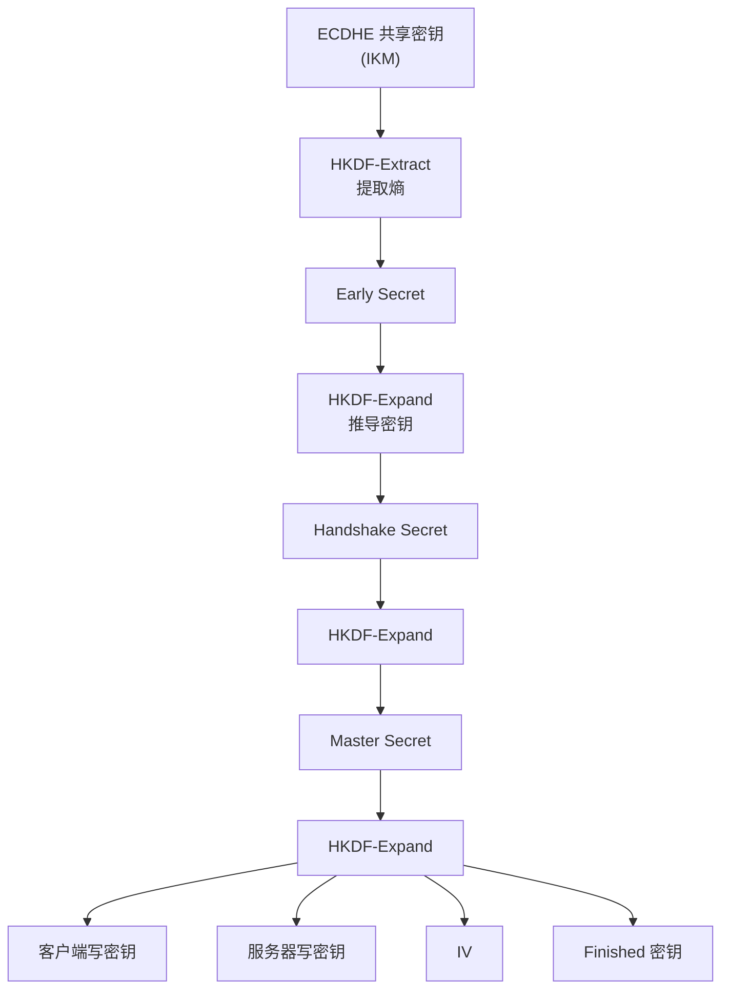

TLS 1.3 的密钥推导采用多级结构：每一步握手完成后，都会推导出新的密钥，用于后续消息的加密。这种"密钥滚动"设计确保了即使某个中间密钥泄露，也不会影响其他阶段的密钥安全。

### 5.4 0-RTT 恢复：速度的极致

TLS 1.3 支持 0-RTT（Zero Round Trip Time）恢复，允许客户端在重连时直接发送加密数据：

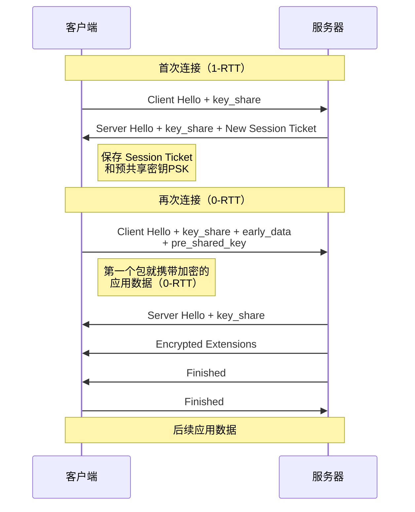

**0-RTT 的工作原理**：

1. 首次连接完成时，服务器发送 New Session Ticket，包含一个预共享密钥（PSK）。
2. 客户端保存 PSK 和关联的会话信息。
3. 再次连接时，客户端在 Client Hello 中携带 PSK 标识（pre_shared_key 扩展），并使用 PSK 派生的 early 密钥加密 early_data。
4. 服务器验证 PSK 后，直接解密 early_data，无需等待后续握手消息。

**0-RTT 的安全权衡**：

| 属性 | 0-RTT | 1-RTT |
|------|-------|-------|
| 延迟 | 0-RTT（最快） | 1-RTT |
| 抗重放 | 弱（攻击者可重放 early_data） | 强 |
| 前向安全性 | early_data 不具备 | 完全具备 |
| 适用数据 | 幂等请求（如 GET） | 所有数据 |

0-RTT 的 early_data 不具备抗重放能力——攻击者可以截获并重放 0-RTT 数据。因此，0-RTT 仅适用于幂等操作（如 GET 请求），不应用于非幂等操作（如支付请求）。服务器可以通过单次使用票据、时间窗口限制等机制降低重放风险。

---

## 六、证书与 PKI：互联网信任的基石

### 6.1 X.509 证书：数字身份证

TLS 证书遵循 X.509 标准，包含以下关键信息：

```
证书 {
    版本 (v3)
    序列号 (唯一标识)
    签名算法 (SHA-256 with RSA / ECDSA)
    颁发者 (CA 的 DN)
    有效期 (起止时间)
    主体 (服务器域名 + 组织信息)
    主体公钥信息 (算法 + 公钥)
    扩展 {
        Subject Alternative Name (SAN)  // 允许的域名列表
        Key Usage                       // 密钥用途
        Extended Key Usage              // 扩展密钥用途
        Authority Information Access    // CA 信息访问点（OCSP）
        Certificate Policies            // 证书策略
        ...
    }
    签名 (CA 的数字签名)
}
```

### 6.2 证书链验证：信任的传递

互联网上存在数百个 CA，浏览器不可能内置所有 CA 的公钥。实际情况是：浏览器/操作系统内置了约 150 个根 CA 证书，其他 CA 通过"证书链"获得信任。

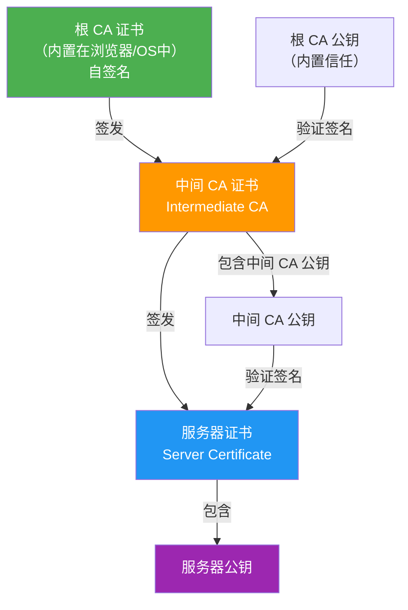

**验证流程**：

1. 浏览器获取服务器证书 + 中间 CA 证书。
2. 用中间 CA 证书的公钥验证服务器证书的签名。
3. 用根 CA 证书的公钥验证中间 CA 证书的签名。
4. 根 CA 证书在信任库中？→ 信任建立。

**为什么需要中间 CA？** 核心原因是安全隔离。根 CA 的私钥是整个信任体系的根基，一旦泄露后果不堪设想。中间 CA 的引入使得根 CA 的私钥可以离线保存，只在需要签发新中间 CA 时才使用。如果中间 CA 私钥泄露，只需吊销该中间 CA 证书，不影响根 CA 和其他中间 CA。

### 6.3 证书验证的完整清单

浏览器验证一个证书时，会检查以下项目：

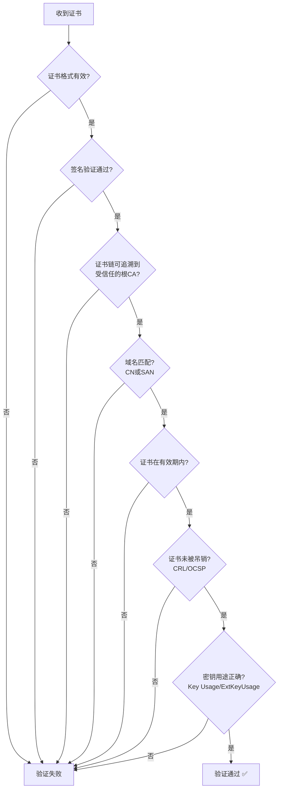

### 6.4 证书吊销：出问题怎么办？

证书在有效期内也可能需要吊销（如私钥泄露、域名转让）。三种吊销机制：

**1. CRL（Certificate Revocation List）**

CA 维护一个被吊销证书的列表，浏览器定期下载。问题：列表可能很大、更新不及时、下载失败时无法验证。

**2. OCSP（Online Certificate Status Protocol）**

浏览器实时向 CA 的 OCSP 服务器查询证书状态。问题：暴露用户隐私（CA 知道你在访问哪个网站）、增加延迟、OCSP 服务器可能宕机。

**3. OCSP Stapling**

服务器主动获取 OCSP 响应，在 TLS 握手中"钉"（staple）给客户端。解决了 OCSP 的隐私和延迟问题——浏览器无需直接联系 CA。

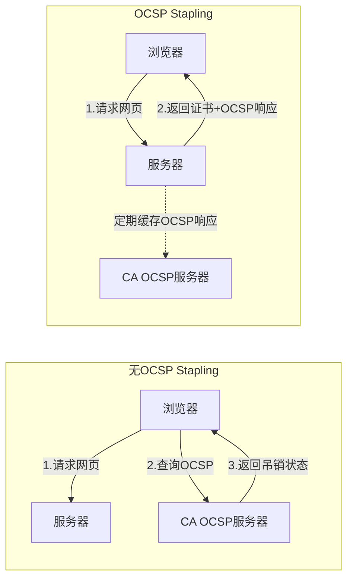

### 6.5 Certificate Transparency：让证书签发可审计

即使有严格的审核流程，CA 仍可能犯错或被入侵，签发不该签的证书。Certificate Transparency（CT）要求 CA 将签发的每一张证书记录到公开的、只追加的 CT 日志中，任何人都可以查询和审计。

**CT 的工作流程**：

1. CA 签发证书前，先将证书提交到 CT 日志。
2. CT 日志返回一个签名时间戳（SCT）。
3. CA 将 SCT 嵌入证书或通过 TLS 扩展提供。
4. 浏览器验证 SCT，拒绝没有 SCT 的证书。

这意味着：如果某个 CA 签发了恶意证书，它必然出现在 CT 日志中，域名所有者可以通过监控 CT 日志及时发现。Chrome 和 Safari 目前都强制要求 CT。

---

## 七、AEAD：加密与认证的统一

### 7.1 为什么需要 AEAD？

传统加密只提供机密性，不提供完整性验证。如果加密数据被篡改，解密方可能得到错误的明文却不自知。TLS 早期使用"加密 + MAC"模式：先加密，再对密文计算 MAC。但这种模式存在多个攻击面（如 Lucky13 攻击）。

**AEAD（Authenticated Encryption with Associated Data）** 将加密和认证合二为一：一个算法同时完成加密和完整性验证，从根本上消除了加密与认证分离带来的攻击面。

### 7.2 AES-GCM

AES-GCM（Galois/Counter Mode）是 TLS 中最主流的 AEAD 密码套件：

- **加密**：AES-CTR 模式（计数器模式），将 AES 分组密码转化为流密码。
- **认证**：GHASH（基于有限域乘法的通用哈希），计算认证标签。

```
AES-GCM 输入:
  - 明文 (Plaintext)
  - 关联数据 AAD (Additional Authenticated Data, 不加密但需认证)
  - 密钥 (Key)
  - IV/Nonce (初始化向量)

AES-GCM 输出:
  - 密文 (Ciphertext)
  - 认证标签 (Authentication Tag, 16 字节)
```

解密时，先验证认证标签，验证通过才进行解密。如果密文或 AAD 被篡改，标签验证失败，直接丢弃——绝不会返回错误明文。

### 7.3 ChaCha20-Poly1305

当硬件不支持 AES-NI 指令集时（如部分手机和嵌入式设备），AES-GCM 的性能会显著下降。ChaCha20-Poly1305 是专为软件实现优化的替代方案：

- **加密**：ChaCha20 流密码
- **认证**：Poly1305 消息认证码

在无 AES-NI 的设备上，ChaCha20-Poly1305 比 AES-256-GCM 快约 3 倍。Google 曾强烈推动其标准化，Chrome 在检测到不支持 AES-NI 的设备时会优先选择 ChaCha20-Poly1305。

### 7.4 TLS 1.3 的密码套件

TLS 1.3 大幅简化了密码套件，只保留了 5 个：

| 密码套件 | 加密算法 | 认证标签 | 密钥长度 |
|---------|---------|---------|---------|
| TLS_AES_128_GCM_SHA256 | AES-128-GCM | GCM | 128 |
| TLS_AES_256_GCM_SHA384 | AES-256-GCM | GCM | 256 |
| TLS_CHACHA20_POLY1305_SHA256 | ChaCha20-Poly1305 | Poly1305 | 256 |
| TLS_AES_128_CCM_SHA256 | AES-128-CCM | CCM | 128 |
| TLS_AES_128_CCM_8_SHA256 | AES-128-CCM-8 | CCM-8 | 128 |

注意 TLS 1.3 的密码套件不再包含密钥交换算法和签名算法——前者固定为 ECDHE，后者在证书中体现。这大幅简化了协商过程。

---

## 八、安全增强机制

### 8.1 HSTS：强制 HTTPS

即使用户输入 `http://`，HSTS（HTTP Strict Transport Security）也强制浏览器使用 HTTPS：

```
Strict-Transport-Security: max-age=31536000; includeSubDomains; preload
```

- `max-age`：HSTS 策略有效时间（秒）。
- `includeSubDomains`：策略覆盖所有子域名。
- `preload`：申请加入浏览器的 HSTS 预加载列表。

**为什么需要 HSTS？** 没有它，用户的首次 HTTP 请求（在重定向到 HTTPS 之前）是明文的，攻击者可以劫持这次请求阻止重定向——这就是 SSL Stripping 攻击。HSTS 预加载列表从浏览器层面解决了这个问题：列表中的域名永远只使用 HTTPS，连第一次请求都不会走 HTTP。

### 8.2 证书固定（Certificate Pinning）及其兴衰

证书固定是将特定证书公钥与域名绑定，即使合法 CA 签发了该域名的证书，如果公钥不匹配也不信任。HPKP（HTTP Public Key Pinning）是 HTTP 层的实现方式。

然而，HPKP 在 2018 年被 Chrome 废弃。原因在于：如果配置错误，网站会变得不可访问且无法远程修复——管理员无法撤销错误的固定策略。HPKP 也被滥用于"赎金攻击"——攻击者获取证书私钥后设置固定策略，域名所有者反而无法更新证书。

**替代方案**：

- **应用层固定**：移动 App 在代码中硬编码证书公钥哈希，不走系统信任库。这在银行、支付等高安全场景中仍然广泛使用。
- **Certificate Transparency**：通过审计而非固定来检测恶意证书。

### 8.3 SNI 与 ESNI：隐私的最后一公里

**SNI（Server Name Indication）**：当多个 HTTPS 网站共享同一 IP 地址时，客户端必须在 Client Hello 中以明文告知服务器要访问的域名（SNI），否则服务器不知道该返回哪个证书。

问题：SNI 是明文的，ISP 或窃听者可以知道你在访问哪个网站，即使用户数据是加密的。

**ESNI（Encrypted SNI）**：用 DNS 发布的公钥加密 SNI 字段，窃听者无法从 TLS 握手中获取域名信息。ESNI 后来发展为 **ECH（Encrypted Client Hello）**，不仅加密 SNI，还加密整个 Client Hello 中的敏感扩展字段。

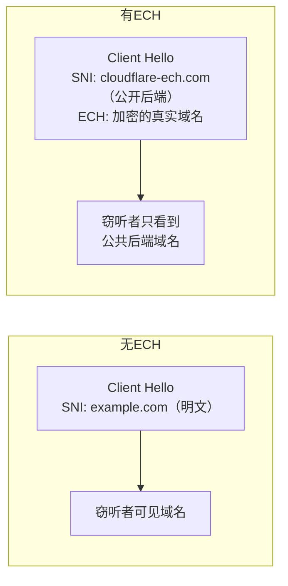

ECH 的关键在于：DNS 服务器在 HTTPS 记录中发布 ECH 加密公钥，客户端用该公钥加密真实的 SNI。窃听者只能看到"公共后端"的域名（如 CDN 提供商的域名），无法获知真实的目标站点。

---

## 九、HTTPS 的攻击面与防御

### 9.1 常见攻击概览

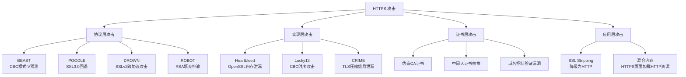

### 9.2 降级攻击与防御

降级攻击是 HTTPS 面临的最基本威胁之一——攻击者迫使双方使用较低版本的协议或较弱的密码套件。

**FREAK/Logjam 攻击**：攻击者作为中间人，将客户端的 TLS 版本协商降级到支持弱密码（如 512-bit RSA）的版本，然后暴力破解弱密钥。

**TLS 1.3 的降级保护**：

TLS 1.3 在 Server Hello 中嵌入了降级检测机制：如果服务器支持 TLS 1.3 但协商为更低版本，它会在 Server Hello 的随机数末尾嵌入特定的降级标记：

```
如果降级到 TLS 1.2：RN_S[24:28] = 44 4F 57 4E 47 52 44 01
如果降级到 TLS 1.1：RN_S[24:28] = 44 4F 57 4E 47 52 44 00
```

（ASCII: "DOWNGRD\x01" / "DOWNGRD\x00"）

客户端检测到这些标记后，会拒绝连接。这比 TLS 1.2 依靠 Finished 消息验证的方式更安全——降级在握手早期就能被检测到。

### 9.3 Heartbleed：实现漏洞的警示

2014 年发现的 Heartbleed 漏洞不是协议设计缺陷，而是 OpenSSL 实现缺陷。TLS 的心跳扩展允许对方发送心跳请求保持连接，但 OpenSSL 没有正确验证心跳请求中的长度字段，导致攻击者可以读取服务器内存中最多 64KB 的数据——其中可能包含私钥、用户密码等敏感信息。

Heartbleed 的教训是：**安全的协议 + 不安全的实现 = 不安全**。协议设计再完善，实现中的一个小错误就可能导致灾难性后果。这也是为什么现代密码学库（如 BoringSSL、rustls）越来越强调内存安全。

---

## 十、后量子密码学：HTTPS 的下一个十年

### 10.1 量子计算威胁

当前 HTTPS 依赖的密码学基础面临量子计算的威胁：

| 算法 | 经典计算机安全 | 量子计算机安全 | 威胁来源 |
|------|-------------|-------------|---------|
| RSA | 安全 | 不安全 | Shor 算法可分解大整数 |
| ECC | 安全 | 不安全 | Shor 算法可解 ECDLP |
| AES-128 | 安全 | 降级 | Grover 算法将暴力搜索降为平方根 |
| AES-256 | 安全 | 安全 | 平方根后仍有 128 位安全 |
| SHA-256 | 安全 | 降级 | Grover 算法降低碰撞难度 |

**Shor 算法**：能在多项式时间内分解大整数和求解离散对数，直接攻破 RSA 和 ECC。

**Grover 算法**：将暴力搜索复杂度从 O(N) 降到 O(√N)，等效于将密钥长度减半。

### 10.2 "先存储，后解密"威胁

量子计算机目前尚未达到攻破 RSA/ECC 的规模，但存在一个现实的威胁策略：

1. **现在**：攻击者记录大量 HTTPS 加密流量。
2. **未来**：量子计算机成熟后，用 Shor 算法破解服务器私钥。
3. **结果**：所有历史流量被解密。

这意味着，需要长期保密的数据（如国家机密、医疗记录）已经面临风险——即使量子计算机还未成熟。这就是为什么后量子密码学的迁移如此紧迫。

### 10.3 NIST 后量子标准

2024 年 8 月，NIST 正式发布了三个后量子密码学标准：

| 标准编号 | 算法 | 类型 | 用途 | 密钥/签名大小 |
|---------|------|------|------|-------------|
| FIPS 203 | ML-KEM（原 Kyber） | 格密码 | 密钥封装（KEM） | 公钥 ~1KB, 密文 ~1KB |
| FIPS 204 | ML-DSA（原 Dilithium） | 格密码 | 数字签名 | 公钥 ~2.5KB, 签名 ~5KB |
| FIPS 205 | SLH-DSA（原 SPHINCS+） | 哈希签名 | 数字签名（备选） | 公钥 ~64B, 签名 ~30KB |

**ML-KEM 用于替代 ECDHE 密钥交换**，**ML-DSA 用于替代 RSA/ECDSA 签名**。

### 10.4 混合密钥交换：过渡期的务实选择

后量子算法是全新的，尚未经过像 RSA/ECC 那样数十年的密码分析考验。如果某种后量子算法日后被发现有漏洞，单独使用它的系统将完全暴露。

因此，业界采用**混合密钥交换**：同时执行经典 ECDHE 和后量子 ML-KEM，两个共享密钥混合后作为最终密钥。只有两个算法同时被攻破，通信才会泄露。

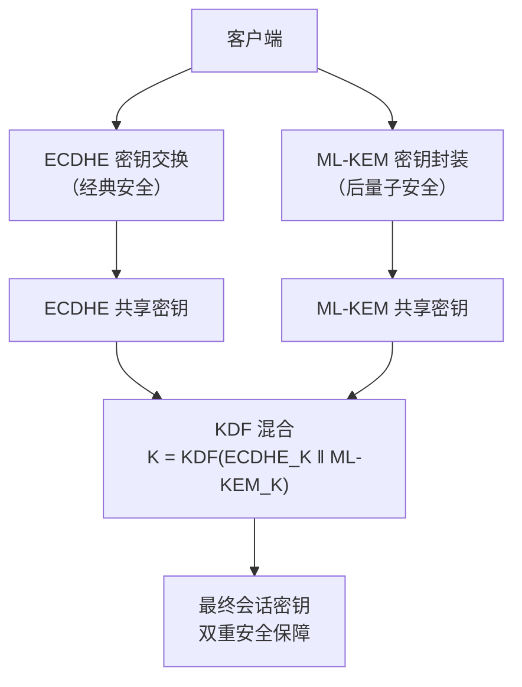

**IETF 标准化进展**：`draft-ietf-tls-ecdhe-mlkem` 定义了三种混合密钥交换套件：

```
TLS_ECDHE_ML_KEM_WITH_AES_128_GCM_SHA256
TLS_ECDHE_ML_KEM_WITH_AES_256_GCM_SHA384
TLS_ECDHE_ML_KEM_WITH_CHACHA20_POLY1305_SHA256
```

### 10.5 后量子证书的挑战

后量子签名（ML-DSA）的公钥和签名比 RSA/ECC 大得多：

| 算法 | 公钥大小 | 签名大小 |
|------|---------|---------|
| ECDSA P-256 | 64 B | 64 B |
| RSA-2048 | 256 B | 256 B |
| ML-DSA-65 | 1,952 B | 3,309 B |
| SLH-DSA-SHA2-128f | 32 B | 17,088 B |

**问题**：一个典型的证书链包含 3-4 个证书，如果每个都用 ML-DSA 签名，TLS 握手的数据量将从约 3KB 增长到约 15-20KB。这会影响握手延迟，尤其在网络带宽有限的场景。

**可能的解决方案**：

1. **混合证书链**：根证书使用 ML-DSA（长期安全），叶子证书仍然使用 ECDSA（短期内量子计算机尚未威胁）。
2. **压缩证书**：TLS 1.3 的 certificate compression 扩展可以压缩证书链。
3. **更小的后量子签名方案**：研究中的更紧凑签名方案。

### 10.6 主流平台的部署进展

| 平台 | 后量子 TLS 状态 | 时间 |
|------|----------------|------|
| Chrome | 默认启用 ML-KEM 混合密钥交换 | 2024 年 8 月 |
| Firefox | Nightly 版本启用，逐步推广 | 2025 年 |
| Cloudflare | 全局启用后量子密钥交换 | 2024 年 |
| Apple | iOS/macOS 宣布支持 | 2025 年 6 月 |
| Java (JDK) | JEP 496: PQC 混合密钥交换 | 2026 年 2 月 |
| AWS KMS | 支持 hybrid post-quantum TLS | 2024 年 |

---

## 十一、HTTPS 性能优化实践

### 11.1 握手开销分析

以 TLS 1.2 的一次完整握手为例，各阶段耗时：

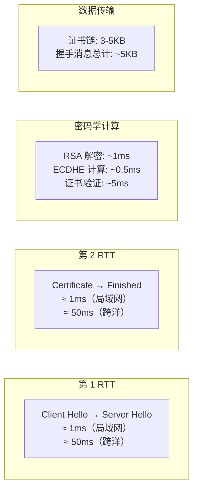

跨洋场景下，2-RTT 的网络延迟（~100ms）远大于密码学计算时间。这就是为什么 TLS 1.3 的 1-RTT 握手在远距离通信中收益巨大。

### 11.2 关键优化手段

**1. 会话恢复**

- **Session ID**：服务器为会话分配 ID，重连时客户端携带 ID，服务器查找缓存恢复会话。1-RTT。
- **Session Ticket**：服务器将会话状态加密为 Ticket 发给客户端，重连时客户端携带 Ticket，服务器解密恢复。1-RTT。无需服务器端状态存储，适合分布式部署。
- **TLS 1.3 PSK**：0-RTT 恢复（见第五章）。

**2. OCSP Stapling**

减少证书吊销检查的额外 RTT。

**3. 证书链优化**

- 只发送必要的中间证书，不要发送根证书（浏览器已内置）。
- 使用 ECDSA 证书（比 RSA 证书小得多：256 位 ECC ≈ 64 字节公钥 vs 2048 位 RSA ≈ 256 字节公钥）。

**4. HTTP/2 / HTTP/3**

- HTTP/2 多路复用：一个 TLS 连接承载多个请求，减少握手次数。
- HTTP/3（QUIC）：基于 UDP，0-RTT 连接建立，TLS 1.3 直接集成到传输层。

**5. 连接复用与 Keep-Alive**

保持 TLS 连接不断开，后续请求无需重新握手。合理设置 `keep-alive` 超时时间。

### 11.3 TLS 1.2 vs TLS 1.3 性能对比

| 维度 | TLS 1.2 | TLS 1.3 | 改善 |
|------|---------|---------|------|
| 新连接握手 | 2-RTT | 1-RTT | -50% 延迟 |
| 恢复连接 | 1-RTT | 0-RTT | -100% 延迟 |
| 密码套件协商 | 复杂 | 简化（5 个） | 减少错误配置 |
| 明文信息量 | 证书、Server Key Exchange 等明文 | 仅 Hello 明文 | 大幅减少泄漏 |
| 安全算法 | 包含已知弱算法 | 仅 AEAD + ECDHE | 根本性安全提升 |

---

## 十二、全景回顾与未来展望

### 12.1 HTTPS 技术演进时间线

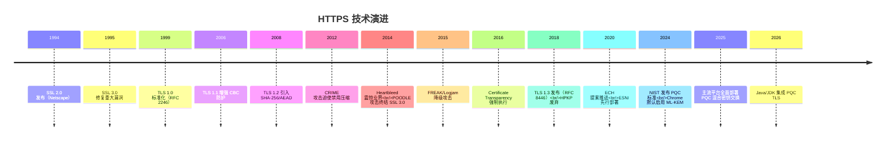

### 12.2 HTTPS 安全架构全景

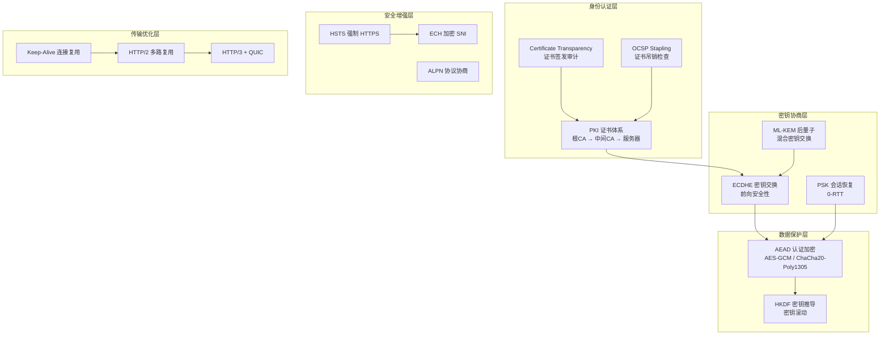