# IPv8深度解析：下一代互联网协议的革命性设计

> 当IPv6用了25年仍未完成过渡，当BGP路由表突破90万条前缀，当网络管理碎片化成为运维噩梦——IETF最新发布的IPv8草案，正在用一套颠覆性的设计理念，重新定义互联网的未来。

---

## 引言：为什么我们需要重新思考互联网协议？

2026年4月，IETF发布了一份名为《Internet Protocol Version 8 (IPv8)》的草案，作者是来自圣母大学的Douglas Thain教授。这份草案一经发布，便在技术社区引发了广泛讨论。

但IPv8究竟是什么？它与IPv4、IPv6有何本质区别？更重要的是——它真的能解决困扰互联网数十年的顽疾吗？

本文将带你由浅入深，全面解析IPv8的设计理念、技术架构和潜在影响。

---

## 第一部分：互联网协议的演进之痛

### 1.1 从IPv4到IPv6：一场未完成的革命

要理解IPv8，我们必须先回顾互联网协议的历史。

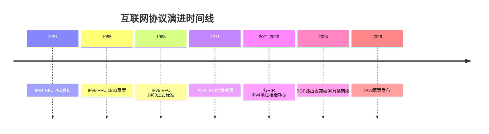

IPv4诞生于1981年，采用32位地址空间，理论上提供约43亿个地址。在20世纪80年代，这看起来是一个天文数字。但互联网爆炸式的增长很快证明了这一设计的局限性。

2011年2月，IANA正式宣布IPv4单播地址空间分配完毕。随后，各区域互联网注册机构（RIR）在2011年至2020年间相继耗尽了其分配的地址。

IPv6应运而生。它将地址长度扩展到128位，提供了近乎无限的地址空间。但IPv6面临一个致命问题：**过渡成本**。

IPv6采用双栈（Dual-Stack）过渡模型，要求每个设备、每个应用、每个网络同时支持IPv4和IPv6。经过25年的推广，IPv6在全球互联网流量中仍占少数。商业上不可接受的过渡成本，加上缺乏强制迁移的驱动力，使得组织可以无限期地继续使用CGNAT（运营商级网络地址转换）。

### 1.2 被忽视的结构性问题

IPv6解决了地址耗尽问题，但互联网面临的挑战远不止于此：

**管理碎片化**：现代网络管理是碎片化的。DHCP、DNS、NTP、syslog、SNMP、认证——这些协议在四十多年间独立制定，没有统一的身份模型，没有共同的认证机制，也没有共享的遥测格式。

**路由表爆炸**：BGP4全球路由表在2024年突破90万条前缀，且增长没有架构性上限。前缀去聚合（Deaggregation）是增长的主要驱动力，但没有任何协议机制能够阻止它。

**安全隐患**：BGP4没有将ASN通告的内容与授权通告的内容绑定。前缀劫持、路由泄露、伪造注入之所以可能，是因为没有路由所有权注册表要求边界路由器作为路由接受的条件。

**东西向与南北向流量安全**：东西向流量（网络内设备间通信）和南北向流量（内网到互联网的通信）缺乏协议层面的安全 enforcement，只能依赖手动配置。

### 1.3 IPv8的设计哲学

IPv8的设计者Douglas Thain教授提出了一组大胆的要求，一个可行的继任者协议必须满足：

| 需求编号 | 需求描述 |
|:--------:|:---------|
| R1 | 集成化管理——所有网络服务共享统一的身份、认证、遥测和服务交付机制 |
| R2 | 单栈操作——无需双栈要求 |
| R3 | 完全向后兼容——现有IPv4应用无需修改，IPv4是IPv8的真子集 |
| R4 | 完全向后兼容——RFC 1918内部网络无需修改 |
| R5 | 完全向后兼容——CGNAT部署无需修改 |
| R6 | 大幅扩展的地址空间 |
| R7 | 可作为软件更新实现，无需更换硬件 |
| R8 | 人类可读的地址格式，与IPv4操作习惯一致 |
| R9 | 东西向和南北向流量安全由协议强制执行，而非手动配置 |
| R10 | 结构性限制的全球路由表规模 |

IPv8声称满足全部十条要求。让我们深入看看它是如何做到的。

---

## 第二部分：IPv8的核心架构

### 2.1 64位地址空间：平衡的艺术

IPv8采用64位地址，这是一个深思熟虑的设计选择：

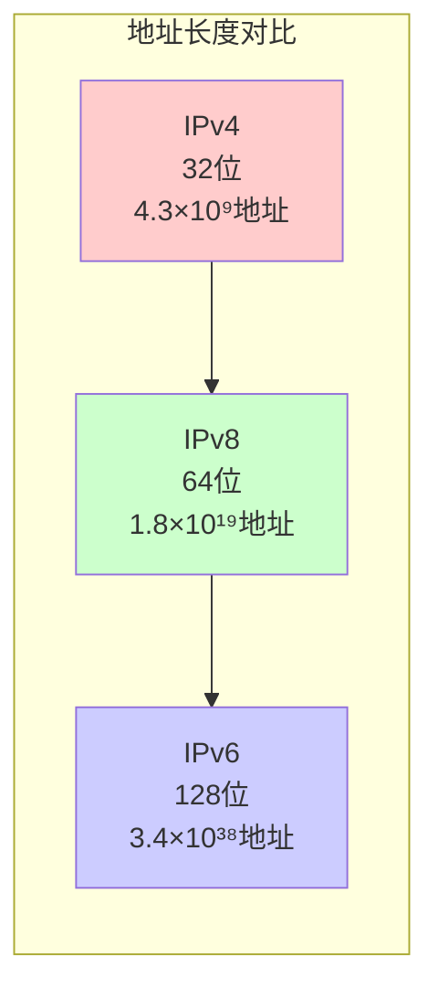

为什么是64位，而不是IPv6的128位？

IPv8的设计者认为，128位地址空间虽然"无限"，但带来了不必要的复杂性：更长的报文头、更高的处理开销、更难以人类阅读和记忆。64位提供了18,446,744,073,709,551,616（约1.8×10¹⁹）个唯一地址，这足以满足任何规模的组织需求，同时保持报文头的紧凑性。

### 2.2 地址格式：r.r.r.r.n.n.n.n

IPv8地址采用一种优雅的分层结构：

```
+--------------------------------------------------+
|              IPv8 地址格式 (64位)                 |
+--------------------------------------------------+
|  r.r.r.r (32位)  |  n.n.n.n (32位)               |
|  ASN路由前缀      |  主机地址                      |
+--------------------------------------------------+
```

用Mermaid图表表示：

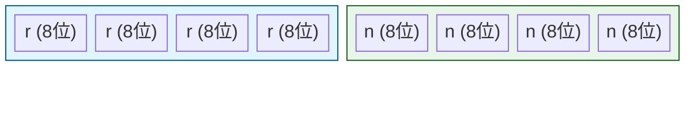

- **r.r.r.r（32位）**：ASN（自治系统号）路由前缀
- **n.n.n.n（32位）**：主机地址（语义与IPv4完全相同）

这种设计的精妙之处在于：**IPv4是IPv8的真子集**。当r.r.r.r = 0.0.0.0时，该地址就是一个纯IPv4地址，使用标准IPv4规则路由。这意味着：

- 无需修改现有IPv4设备
- 无需修改现有IPv4应用
- 无需修改现有IPv4内部网络

### 2.3 报文头格式：向后兼容的进化

IPv8报文头在IPv4基础上自然扩展：

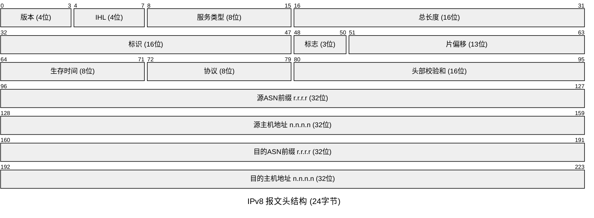

相比IPv4的20字节报文头，IPv8报文头仅增加8字节（24字节），这是IPv6 40字节报文头的60%。这种紧凑性对于减少带宽开销和提高处理效率至关重要。

---

## 第三部分：Zone Server——统一管理的革命

### 3.1 网络管理的碎片化困境

传统网络管理是协议的大杂烩：

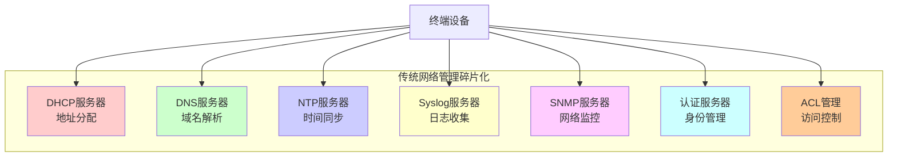

每个服务：
- 独立的产品
- 独立的许可
- 独立的配置
- 独立的维护
- 没有共享的网络状态感知

设备连接到网络后，可能需要手动配置十几个独立服务才能正常运行。安全策略不一致——某些服务需要认证，某些服务接受来自任何源的未认证请求。故障排查需要关联从未设计为协同工作的系统之间的数据。

### 3.2 Zone Server：一站式网络服务平台

IPv8引入了**Zone Server**的概念——一个成对的active/active平台，运行网络段所需的每个服务：

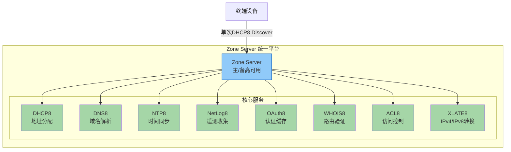

一个设备连接到IPv8网络时，只需发送一个DHCP8 Discover报文，就能在单个响应中接收到所需的所有服务端点。无需后续的手动配置，设备在首次用户交互之前就已完全运行——已认证、已记录日志、已时间同步、已执行区域策略。

### 3.3 OAuth2 JWT：统一的身份与认证

IPv8网络中的每个可管理元素都通过OAuth2 JWT令牌授权。令牌由Zone Server上的OAuth8缓存本地验证，无需往返外部身份提供商。

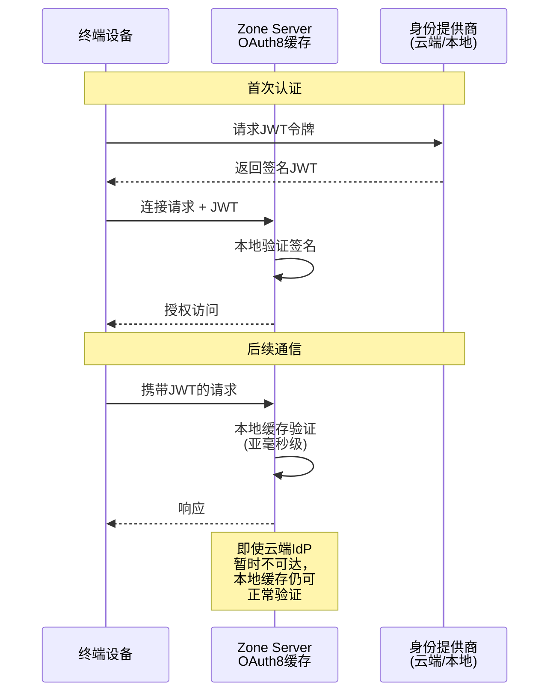

即使设备位于远程位置，云端身份提供商暂时不可达，OAuth8缓存持有所有公钥，可以在亚毫秒时间内本地验证签名。认证是通用的、一致的，不需要每个服务的凭证管理。

---

## 第四部分：地址空间与路由架构

### 4.1 地址类别全景图

IPv8定义了多种地址类别，每种都有特定的用途和路由规则：

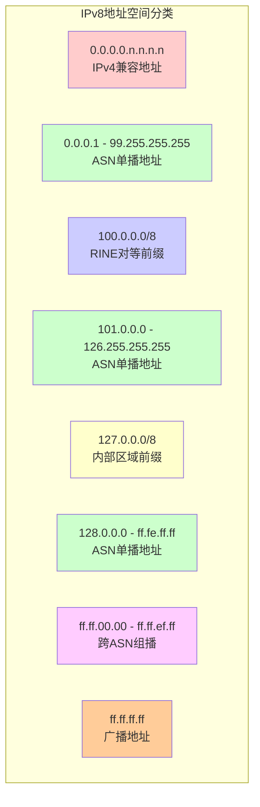

### 4.2 内部区域前缀：127.0.0.0/8

127.0.0.0/8范围在IPv8中被永久保留为内部区域前缀空间。这与IPv4中127.0.0.1作为本地回环地址的用法不同——在IPv8中，整个127.0.0.0/8段被重新定义。

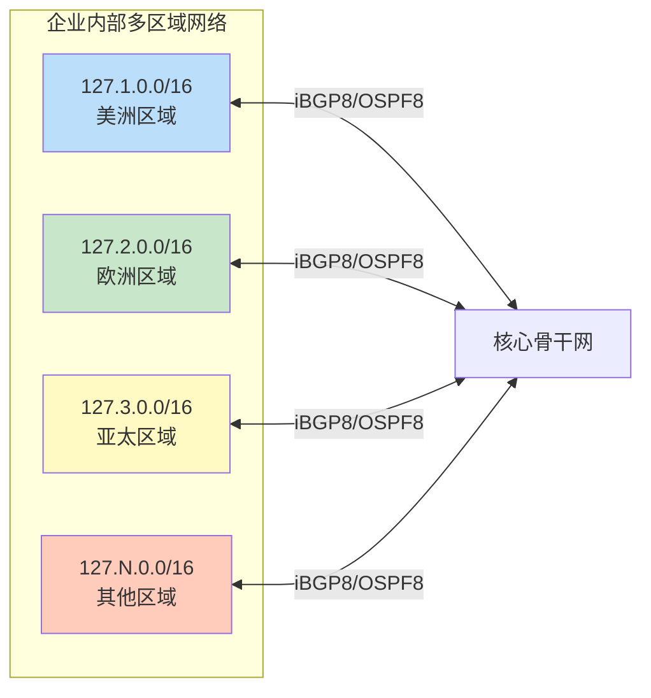

组织可以为网络区域和区域分配内部区域前缀（127.1.0.0、127.2.0.0等）。内部区域地址从不向外部路由，区域之间不可能发生地址冲突。一个组织可以构建任意地理和组织规模的网络——包含数十个区域，每个区域包含数千台设备——使用熟悉的路由协议，无需任何外部地址协调。

### 4.3 公司间互操作：127.127.0.0

127.127.0.0前缀被保留为标准的公司间互操作DMZ。当两个组织需要互联而不暴露其内部区域地址时，双方都部署面向共享127.127.0.0地址空间的XLATE8引擎。

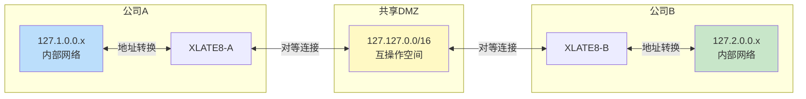

特性：
- 公司A永远看不到公司B的127.2.0.0地址
- 公司B永远看不到公司A的127.1.0.0地址
- 每个公司精确控制其暴露的内容
- 不可能发生地址重叠，没有NAT复杂性
- 设置时间：每个暴露服务仅需数分钟

### 4.4 路由表结构性限制

IPv8通过两个关键机制解决BGP路由表爆炸问题：

**1. /16最小可注入前缀规则**

在AS间边界，禁止通告比/16更具体的前缀。这从架构上阻止了前缀去聚合。

**2. 每个ASN一条路由条目**

全球BGP8路由表在结构上限制为每个ASN一个条目。大多数运营商每个区域ASN通告一个/8汇总路由。相比BGP4超过90万条前缀且无增长上限，BGP8路由表受限于ASN分配速率——今天约17.5万条目。

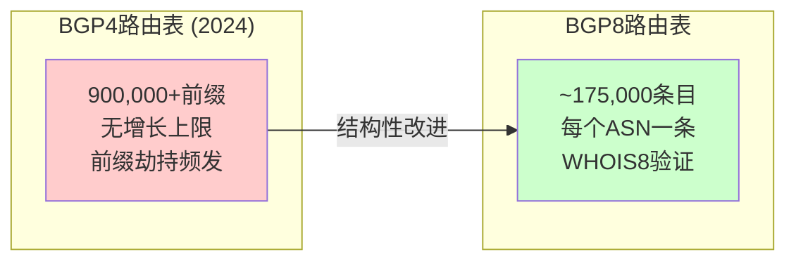

---

## 第五部分：安全架构——协议层面的防护

### 5.1 东西向安全：ACL8区域隔离

东西向流量（网络内设备间通信）的安全通过ACL8区域隔离强制执行。

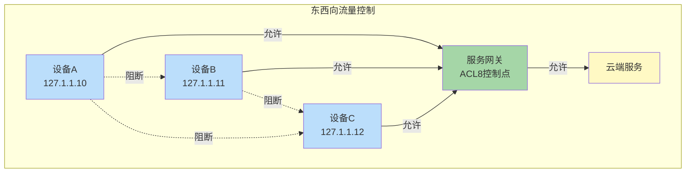

设备只能与其指定的服务网关通信。服务网关只能与指定的云端服务通信。设备间或区域间的横向移动在架构上被阻止——因为不存在通往任何其他目的地的允许路由。

三层独立的enforcement层提供纵深防御：
1. NIC固件ACL8
2. Zone Server网关ACL8
3. 交换机端口OAuth2硬件VLAN强制执行

### 5.2 南北向安全： egress验证

南北向流量（内网到互联网的通信）在Zone Server egress处通过两个强制验证步骤强制执行：

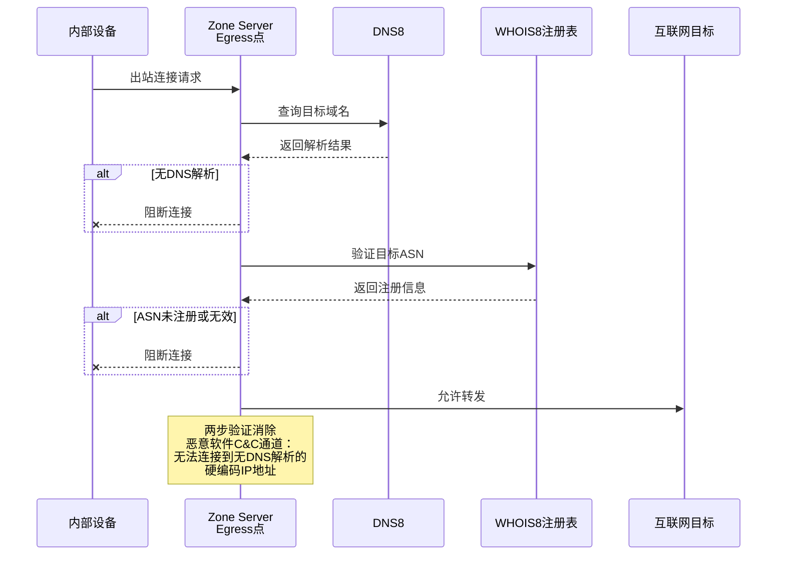

**第一步**：每个出站连接必须有对应的DNS8查找——没有DNS查找就没有XLATE8状态表条目，连接被阻断。

**第二步**：目标ASN针对WHOIS8注册表验证——如果目标前缀未由合法注册的ASN持有者注册为活动路由，数据包被丢弃。

这两步一起消除了主要的恶意软件命令与控制通道：连接到没有DNS解析的硬编码IP地址。

### 5.3 全球路由安全：BGP8 + WHOIS8

在全球路由层面，BGP8路由通告在安装到路由表之前针对WHOIS8进行验证。无法验证的路由不会被安装。

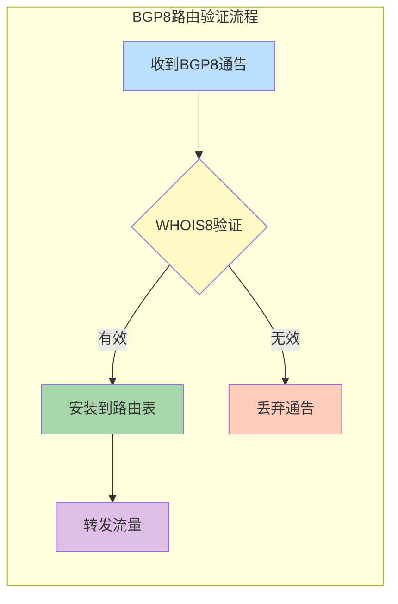

手动维护的bogon过滤器列表被消除。前缀劫持在架构上变得困难——攻击者必须同时破坏RIR注册表条目并生成有效签名的WHOIS8记录。

---

## 第六部分：Cost Factor——智能路由的新范式

### 6.1 统一的路径质量度量

IPv8扩展了OSPF8、BGP8（包括iBGP8和eBGP8）和IS-IS8，引入统一的路径质量度量——**Cost Factor (CF)**。

CF是一个32位累积度量，从TCP会话遥测的七个组件派生：

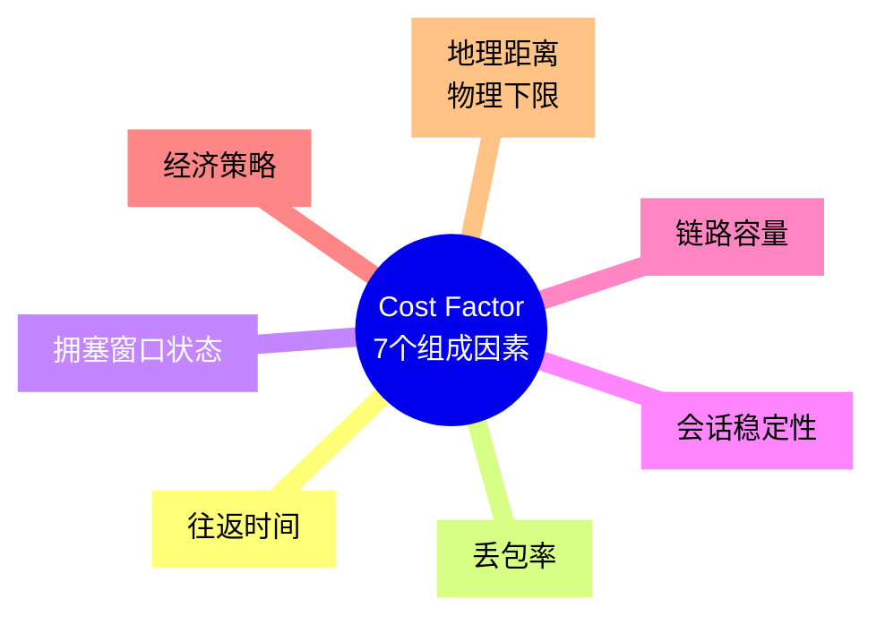

CF从源到目的跨越每个BGP8跳累积。每个路由器独立选择累积CF最低的路径，无需协调。

### 6.2 CF的突破性特性

CF结合了：
- **EIGRP的动态复合路径质量**
- **OSPF的累积成本模型**
- **多路径比例负载均衡**

在一个开放的版本化算法中，跨AS边界端到端运行。

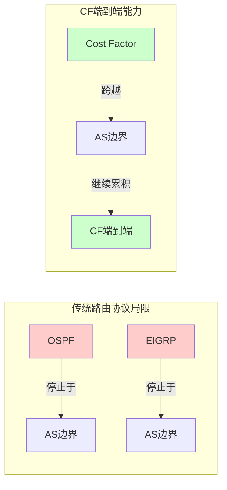

CF的地理组件设置了物理下限——没有路径可以看起来比光速沿大圆距离允许的速度更快。测量到比物理允许更快的路径会立即被标记为CF异常。

CF是一个开放的版本化算法。CFv1是强制基线。未来版本可能通过IETF流程添加碳成本、抖动、时间、应用层延迟信号。

---

## 第七部分：过渡与兼容性

### 7.1 IPv4作为真子集

IPv8的向后兼容策略是其最具争议的也是最具创新性的方面：

```
IPv8地址 r.r.r.r = 0.0.0.0 → 就是IPv4地址
使用标准IPv4规则处理
无需修改IPv4设备
无需修改IPv4应用
无需修改IPv4内部网络
```

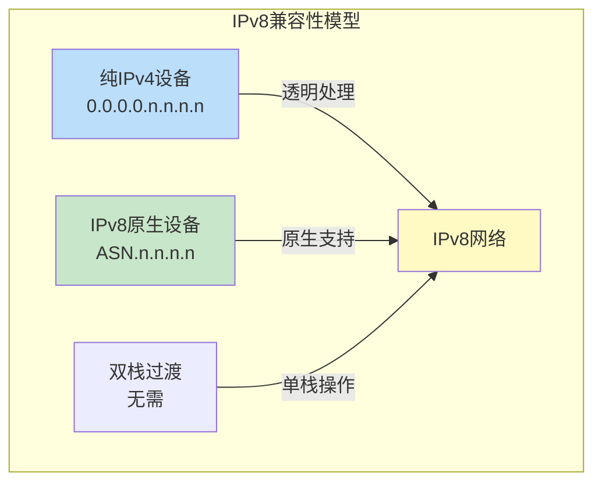

IPv8不需要双栈操作。没有flag day（强制切换日）。

### 7.2 8to4隧道

8to4隧道使被纯IPv4传输网络分隔的IPv8孤岛能够立即通信。

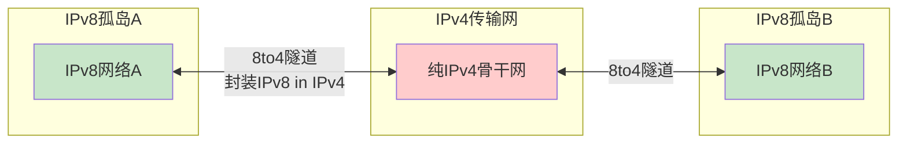

CF自然激励IPv4传输ASN升级——8to4路径测量到更高的延迟，这是一个自动的经济信号，无需任何强制。

### 7.3 独立过渡阶段

Tier 1 ISP、云提供商、企业、消费者ISP可以按任何顺序、任何节奏采用IPv8。8to4确保全程互操作性。

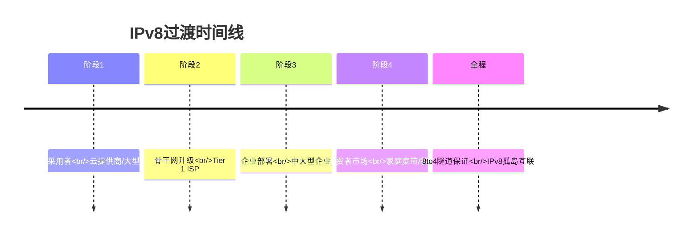

---

## 第八部分：批判性思考——IPv8的挑战与争议

### 8.1 设计选择的权衡

任何工程决策都是权衡。IPv8的设计也不例外：

**优势：**
- 真正的向后兼容性
- 简化的过渡路径
- 集成化管理
- 结构性路由表限制
- 协议层面的安全

**潜在挑战：**

| 挑战 | 说明 |
|:-----|:-----|
| 中心化风险 | Zone Server成为单点故障和攻击目标 |
| OAuth2依赖 | 整个安全模型依赖JWT/OAuth2，如果该体系出现系统性漏洞 |
| ASN分配 | 32位ASN空间本身可能成为瓶颈（虽然短期内不会） |
| 部署复杂性 | Zone Server的部署和运维需要新的技能集 |
| 生态系统 | 需要整个硬件/软件生态系统的支持 |

### 8.2 与IPv6的关系

IPv8不是IPv6的替代品，而是对IPv6未能解决之问题的另一种回答。IPv6和IPv8代表了两种截然不同的哲学：

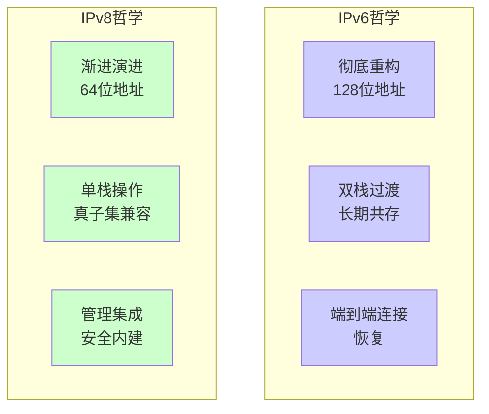

IPv6已经部署了25年，拥有成熟的生态系统。IPv8作为一个2026年的新草案，面临巨大的追赶挑战。

### 8.3 社区的不同声音

技术社区对IPv8的反应褒贬不一：

**支持者观点：**
- 终于有人认真对待网络管理碎片化问题
- 向后兼容策略比IPv6的现实主义得多
- 路由表结构性限制是BGP的救星
- 安全内建于协议层是正确方向

**质疑者观点：**
- 为什么不用IPv6？已经投入了多少资源
- Zone Server中心化与互联网去中心化精神相悖
- 64位地址是否足够长期需求
- 又一个"下一代IP"草案，历史上有多少失败了

---

## 第九部分：未来展望

### 9.1 技术发展的可能路径

IPv8的未来取决于多个因素：

```mermaid
flowchart TB
    A[IPv8草案发布<br/>2026年4月] --> B{社区反馈}
    B -->|积极| C[修订草案]
    B -->|消极| D[草案废弃]
    C --> E{实现与测试}
    E -->|成功| F[实验性部署]
    E -->|失败| G[重新设计]
    F --> H{大规模采用}
    H -->|是| I[互联网新纪元]
    H -->|否| J[小众应用]
```

### 9.2 对网络工程师的意义

无论IPv8最终是否成功，它提出的问题和解决思路都值得网络工程师关注：

1. **管理自动化**：网络管理必须走向更高程度的集成和自动化
2. **安全左移**：安全必须内建于协议架构，而非事后补丁
3. **可扩展性设计**：任何新协议必须考虑路由表爆炸等结构性问题
4. **过渡策略**：向后兼容不是可选项，而是必选项

### 9.3 对架构师的启示

IPv8的设计哲学对软件架构师也有启发：

- **渐进演进优于革命重构**：当替换成本极高时，真子集兼容性比全新设计更可行
- **统一平台优于最佳单品**：集成化管理平台可能比一堆最佳单品工具更高效
- **协议层面的约束**：在协议层强制执行安全策略，比依赖配置和流程更可靠

---
