# IPv8 草案深度解析：IPv4 的真正接班人来了？

> 2026年4月14日，IETF（互联网工程任务组）发布了一份名为"Internet Protocol Version 8"的全新网络协议草案。这份草案的出现在全球网络技术社区引发了广泛关注和讨论。有人说这是 IPv6 的"继任者"，有人说这是 IPv4 的"真正接班人"。那么，IPv8 究竟是什么？它要解决什么问题？它的设计有哪些创新之处？本文将为你带来一份详尽的深度解析。

## 一、引言：为什么我们需要 IPv8？

### 1.1 IPv4 地址耗尽的困境

要理解 IPv8 的出现，我们首先需要回顾一下 IPv4 地址耗尽的历史。

IPv4 使用 32 位地址空间，总共只能提供约 43 亿个地址。在互联网发展的早期，这个数字似乎绰绰有余。然而，随着个人电脑、智能手机、物联网设备的爆发式增长，IPv4 地址逐渐耗尽。

2011年2月3日，IANA（互联网号码分配机构）正式宣布 IPv4 单播地址空间已经分配完毕。这标志着全球 IPv4 地址耗尽的事实已经确立。

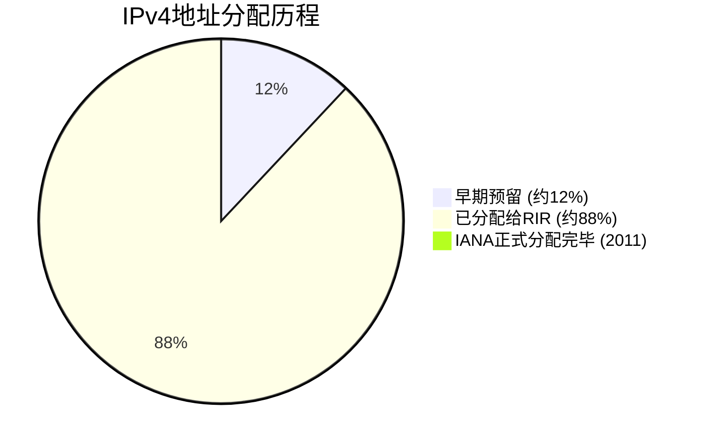

面对这一困境，业界曾寄希望于 IPv6。IPv6 使用 128 位地址空间，理论上可以提供几乎无限数量的地址。然而，IPv6 部署二十五年后的今天，全球互联网流量中 IPv6 仅占很小一部分。这究竟是为什么？

### 1.2 IPv6 为何"失败"？

草案中直言不讳地指出了 IPv6 的问题：

> "IPv6 addressed address exhaustion but did not address management fragmentation. After 25 years of deployment effort IPv6 carries a minority of global internet traffic. The operational cost of the dual-stack transition model, combined with the absence of management improvement, proved commercially unacceptable."

翻译：IPv6 解决了地址耗尽问题，但没有解决管理碎片化问题。经过 25 年的部署努力，IPv6 仅承载全球互联网流量的少数。双栈过渡模型的运营成本，加上缺乏管理改进，被证明在商业上是不可接受的。

IPv6 面临的核心问题包括：

1. **双栈负担**：运营商和企业需要同时维护 IPv4 和 IPv6 两套网络架构，运营成本翻倍
2. **迁移成本**：从 IPv4 迁移到 IPv6 需要大量硬件升级和软件修改
3. **管理复杂性**：网络管理并未因为 IPv6 的部署而变得更容易

### 1.3 管理碎片化：被忽视的痛点

除了地址耗尽，IPv8 草案还指出了另一个被长期忽视的问题——**管理碎片化**。

在传统网络中，设备接入网络需要配置大量独立的服务：

- DHCP（动态主机配置协议）—— IP 地址分配
- DNS（域名系统）—— 名称解析
- NTP（网络时间协议）—— 时间同步
- 日志服务—— 遥测收集
- 认证服务 —— 身份验证
- WHOIS —— 路由验证
- ACL（访问控制列表）—— 访问控制

每个服务可能来自不同的供应商，有不同的配置界面，不同的安全策略。网络管理员需要手动配置十几个独立服务，这不仅增加了工作复杂度，也带来了安全风险。

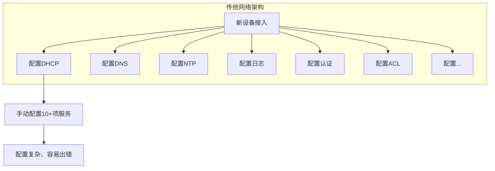

## 二、IPv8 的十大设计要求

基于对现有问题的深刻理解，IPv8 草案提出了十大设计要求。这些要求构成了整个协议套件的设计基础：

| 编号 | 要求 | 说明 |
|------|------|------|
| R1 | 集成管理 | 所有网络服务共享身份、认证、遥测和服务交付 |
| R2 | 单栈操作 | 无需双栈要求，简化网络架构 |
| R3 | 完全向后兼容 IPv4 应用 | 现有 IPv4 应用无需修改即可运行 |
| R4 | 完全向后兼容 RFC 1918 | 内部网络地址空间保持不变 |
| R5 | 完全向后兼容 CGNAT | NAT 部署保持不变 |
| R6 | 大幅扩展的地址空间 | 满足未来发展需求 |
| R7 | 软件可升级 | 无需更换硬件 |
| R8 | 人类可读地址 | 与 IPv4 操作员熟悉度一致 |
| R9 | 强制安全 | 东西向和南北向流量安全由协议强制执行 |
| R10 | 有界全球路由表 | 结构上有界限的全球路由表 |

这些要求体现了 IPv8 的核心设计哲学：**渐进式演进而非革命性颠覆**。它不是要推翻 IPv4，而是要在继承 IPv4 的基础上进行扩展和增强。

## 三、核心概念：区域服务器（Zone Server）

### 3.1 什么是 Zone Server？

Zone Server 是 IPv8 的**中心操作概念**。它不是一个单一的服务，而是一个**整合平台**，运行网络段所需的所有核心服务。

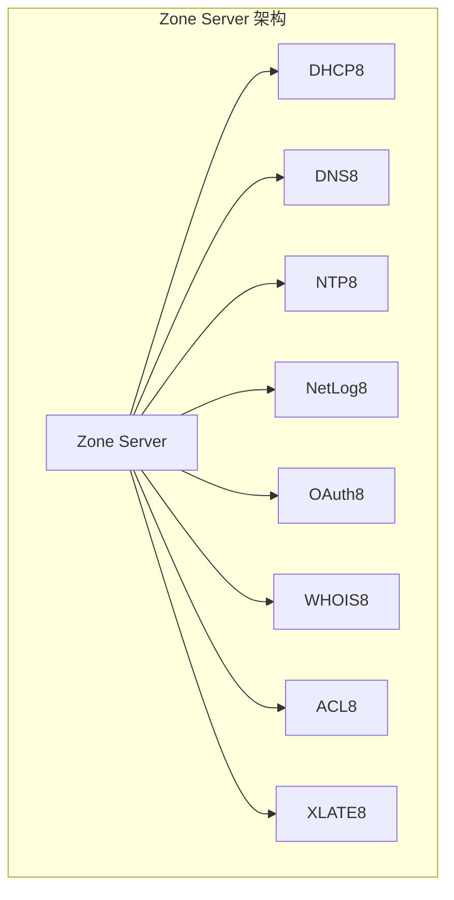

Zone Server 以**主动/主动**模式运行，提供以下服务：

- **DHCP8** —— 地址分配服务
- **DNS8** —— 名称解析服务
- **NTP8** —— 时间同步服务
- **NetLog8** —— 遥测收集服务
- **OAuth8** —— 认证缓存服务（OAuth2 JWT）
- **WHOIS8** —— 路由验证服务
- **ACL8** —— 访问控制执行服务
- **XLATE8** —— IPv4/IPv8 转换服务

### 3.2 设备接入的革新体验

在 IPv8 网络中，一台新设备接入网络的流程被极大简化：

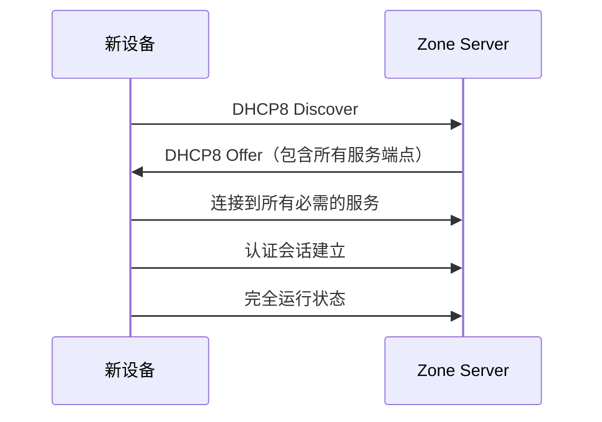

设备只需要发送一个 DHCP8 Discover 消息，就会收到一个包含**所有服务端点**的响应。这意味着：

1. 无需手动配置 DNS 服务器地址
2. 无需手动配置 NTP 服务器地址
3. 无需手动配置日志服务器地址
4. 无需手动配置认证服务器地址

设备从网络启动的那一刻起，就可以完全运行。这一切都得益于 Zone Server 的**统一服务分发**机制。

### 3.3 统一认证模型

IPv8 引入了**统一的 OAuth2 JWT 认证模型**：

- 每个可管理元素通过 **OAuth2 JWT 令牌** 进行授权
- 令牌由 OAuth8 缓存在本地验证，无需往返外部身份提供商
- 即使云身份提供商暂时不可达，远程位置的设备也能正常认证

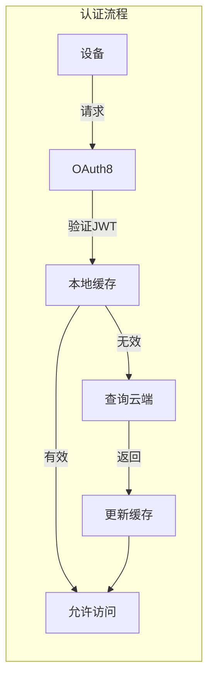

这种设计有两个关键优势：

1. **离线可用性**：即使与云端身份提供商的连接暂时中断，本地网络中的设备仍能正常认证和通信
2. **低延迟**：大多数认证请求可以在本地完成，无需等待云端响应

## 四、IPv8 地址方案

### 4.1 64 位地址格式

IPv8 的地址是 **64 位值**，采用与 IPv4 类似的点分十进制表示法：

```
r.r.r.r.n.n.n.n
```

- **r.r.r.r** —— 32 位 ASN（自治系统号）路由前缀
- **n.n.n.n** —— 32 位主机地址（与 IPv4 语义完全相同）

```mermaid
graph TD
    subgraph IPv8地址结构
    A[64位IPv8地址] --> B[32位ASN前缀<br/>(r.r.r.r)]
    A --> C[32位主机地址<br/>(n.n.n.n)]
    
    B --> B1[对应BGP路由]
    C --> C1[对应本地路由]
    end
```

### 4.2 地址空间规模

- **总地址数**：2^64 = 18,446,744,073,709,551,616（约 1844 亿亿）
- **每个 ASN**：2^32 = 4,294,967,296 个主机地址（约 43 亿）

与 IPv4 相比：

| 协议 | 地址位数 | 总地址数 | 每个网络最大主机数 |
|------|----------|----------|---------------------|
| IPv4 | 32 位 | ~43 亿 | 约 25.6 亿 (/8) |
| IPv6 | 128 位 | ~340 万亿万亿 | 约 18万亿 (/64) |
| IPv8 | 64 位 | ~1844 亿亿 | ~43 亿 (/32) |

### 4.3 IPv4：IPv8 的子集

IPv8 设计中最巧妙的特性之一是：**IPv4 是 IPv8 的适当子集**。

当 r.r.r.r = 0.0.0.0 时，IPv8 数据包使用应用于 n.n.n.n 字段的**标准 IPv4 规则**进行路由：

```
0.0.0.0.n.n.n.n → 被视为 IPv4 地址 n.n.n.n
```

这意味着：

- 现有的 IPv4 应用无需任何修改即可在 IPv8 网络中运行
- 现有的 IPv4 网络设备无需任何硬件更换即可支持 IPv8
- 现有的 RFC 1918 私有地址空间（10.0.0.0/8、172.16.0.0/12、192.168.0.0/16）保持不变

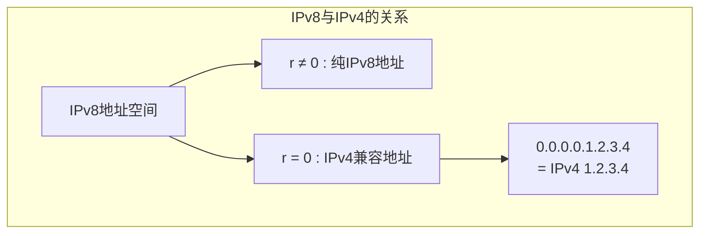

### 4.4 特殊地址前缀

IPv8 定义了一系列特殊地址前缀：

| 前缀范围 | 用途 |
|----------|------|
| 0.0.0.0.n.n.n.n | IPv4 兼容地址（r = 0） |
| 127.x.x.x.n.n.n.x | 内部区域前缀（永不路由到外部） |
| 127.127.0.0.n.n.n.n | 公司间互操作 DMZ |
| 100.x.x.x.n.n.n.x | RINE（区域互联交换）对等链接 |
| &lt;asn&gt;.222.x.x.x | 内部路由器链路 |
| 0.0.255.254.n.n.n.n | 私有 BGP8 对等 |
| ff.ff.xx.xx | 跨 ASN 组播 |

**内部区域前缀（127.0.0.0/8）**尤其重要：

- 127.1.0.0 —— 区域 1（如美洲）
- 127.2.0.0 —— 区域 2（如欧洲）
- 127.3.0.0 —— 区域 3（如亚太）

这些前缀**永久保留用于内部 IPv8 区域**，永远不会被路由到外部互联网。

## 五、安全机制

### 5.1 东西向安全（East-West Security）

**东西向流量**指的是同一区域内设备之间的通信。IPv8 通过 **ACL8 区域隔离**来强制执行东西向安全：

- 设备只能与指定的网关通信
- 无法直接与其他设备进行点对点通信（除非明确授权）

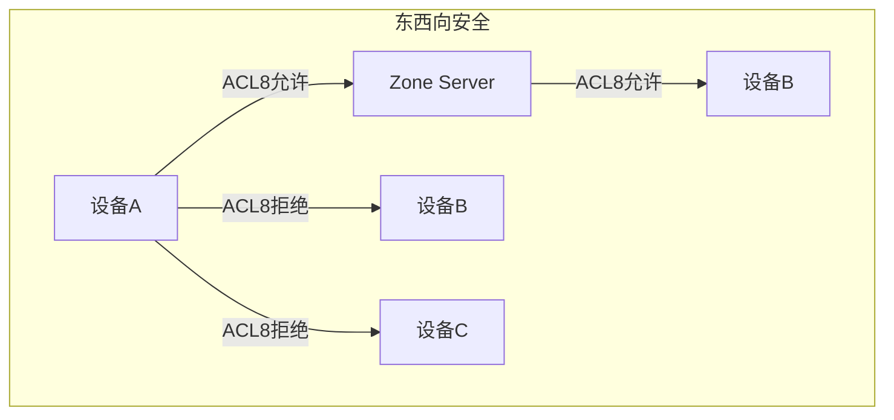

这种设计提供了**三层深度防御**：

1. **NIC 固件 ACL8**：网络接口卡层面强制执行
2. **Zone Server 网关 ACL8**：网络边缘强制执行
3. **交换机端口 OAuth2 硬件 VLAN 执行**：硬件层面强制执行

### 5.2 南北向安全（North-South Security）

**南北向流量**指的是设备与外部网络（互联网）之间的通信。IPv8 通过**两步验证**来保护南北向流量：

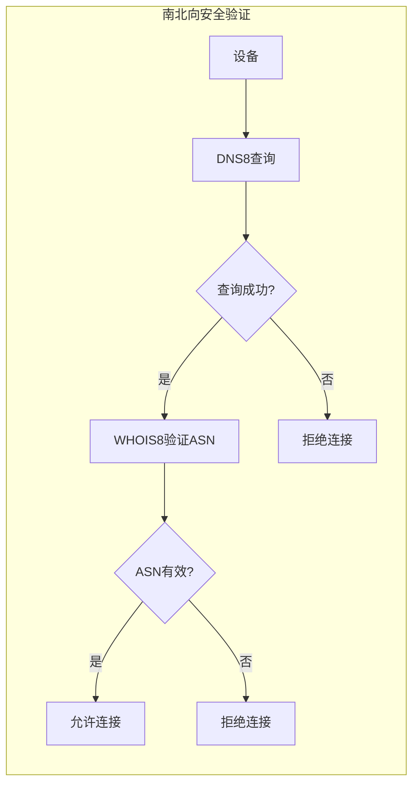

1. **第一步：DNS8 查询要求**
   - 每个出站连接必须有对应的 DNS8 查询
   - 这消除了使用硬编码 IP 地址的恶意软件命令与控制通道

2. **第二步：WHOIS8 ASN 验证**
   - 目标 ASN 根据 WHOIS8 注册表进行验证
   - 防止伪造的路由前缀

### 5.3 速率限制

IPv8 要求 NIC（网络接口卡）固件强制执行**不可覆盖的速率限制**：

| 类型 | 速率限制 |
|------|----------|
| 广播 | 每秒最多 10 个 |
| 用户未认证 | 每秒 10 个，每分钟最多 30 个 |
| 用户已认证 | 每秒 100 个，每分钟最多 300 个 |

这些限制在硬件层面强制执行，即使操作系统被攻破也无法绕过。

## 六、路由协议与成本因子

### 6.1 强制路由协议

IPv8 定义了一套完整的路由协议套件：

| 协议 | 范围 | 功能 | 状态 |
|------|------|------|------|
| eBGP8 | 跨 AS | 公共互联网强制 EGP | 强制 |
| IBGP8 | 跨区域 | 内部区域路由 | 强制 |
| OSPF8 | 区域内 | 区域内路由 | 强制 |
| IS-IS8 | 跨 AS | 可用于所有 L3 栈 | 必须可用 |
| 静态路由 | 所有范围 | 传统和 VRF 路由 | 强制 |

同时，一些传统协议被**明确弃用**：

- **RIP/RIPv2** —— 由 OSPF8 替代
- **EIGRP** —— 供应商可扩展

### 6.2 两层路由表

IPv8 采用**两层路由表结构**：

```mermaid
graph TD
    subgraph IPv8路由表结构
    A[全球路由层] --> B[到AS边界路由器的路由]
    A --> C[index: r.r.r.r<br/>(每ASN一个条目)]
    
    D[本地路由层] --> E[与IPv4路由表相同]
    D --> F[index: n.n.n.n]
    end
```

- **第一层（全局）**：通过 ASN 前缀（r.r.r.r）路由到正确的 AS 边界路由器
- **第二层（本地）**：通过主机地址（n.n.n.n）进行本地路由

### 6.3 有界全球路由表

IPv8 最重要的架构优势之一是**结构有界的全球路由表**：

```mermaid
graph LR
    subgraph 全球路由表规模对比
    A[当前IPv4 BGP表] --> B[约95万+条目]
    C[IPv8 BGP8表] --> D[约17.5万条目<br/>(每ASN一个条目)]
    end
```

- **当前 IPv4 全球 BGP 路由表**：超过 95 万个前缀条目
- **IPv8 BGP8 全球路由表**：约 17.5 万个条目（每 ASN 一个）

这是通过以下机制实现的：

1. **/16 最小可注入前缀**：防止过度的前缀聚合
2. **两层路由结构**：第一层只看到 ASN 级别的路由

### 6.4 成本因子（Cost Factor, CF）

IPv8 引入了**成本因子（Cost Factor）**作为统一的路径质量度量标准，用于 OSPF8、BGP8 和 IS-IS8。

**CF 是一个 32 位累积度量，由七个组件组成**：

| 组件 | 描述 |
|------|------|
| 1 | 往返时间（RTT） |
| 2 | 数据包丢失率 |
| 3 | 拥塞窗口状态 |
| 4 | 会话稳定性 |
| 5 | 链路容量 |
| 6 | 经济策略 |
| 7 | 地理距离（物理下限） |

其中，**地理距离作为物理下限**——没有路径能比光速沿大圆距离允许的更快。这意味着 CF 自然地反映了网络的真实物理延迟特性。

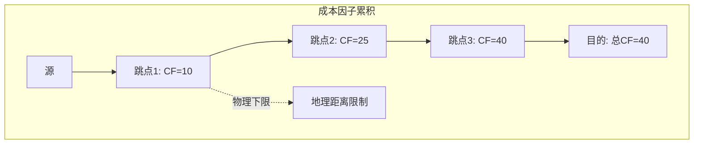

## 七、数据包格式

### 7.1 IPv8 数据包头

IPv8 数据包头保持了与 IPv4 相似的结构，但将地址字段从 32 位扩展到 64 位：

```
 0                   1                   2                   3
 0 1 2 3 4 5 6 7 8 9 0 1 2 3 4 5 6 7 8 9 0 1 2 3 4 5 6 7 8 9 0 1
+-+-+-+-+-+-+-+-+-+-+-+-+-+-+-+-+-+-+-+-+-+-+-+-+-+-+-+-+-+-+-+-+
|Version|  IHL  |Type of Service|          Total Length         |
+-+-+-+-+-+-+-+-+-+-+-+-+-+-+-+-+-+-+-+-+-+-+-+-+-+-+-+-+-+-+-+-+
|         Identification        |Flags|      Fragment Offset    |
+-+-+-+- +-+-+-+- +-+-+-+- +-+-+-+- +-+-+-+- +-+-+-+- +-+-+-+-+
|  Time to Live |    Protocol   |         Header Checksum       |
+-+-+-+- +-+-+-+- +-+-+-+- +-+-+-+- +-+-+-+- +-+-+-+- +-+-+-+-+
|                    Source ASN Prefix (r.r.r.r)                |
+-+-+-+- +-+-+-+- +-+-+-+- +-+-+-+- +-+-+-+- +-+-+-+- +-+-+-+-+
|                    Source Host Address (n.n.n.n)              |
+-+-+-+- +-+-+-+- +-+-+-+- +-+-+-+- +-+-+-+- +-+-+-+- +-+-+-+-+
|                 Destination ASN Prefix (r.r.r.r)              |
+-+-+-+- +-+-+-+- +-+-+-+- +-+-+-+- +-+-+-+- +-+-+-+- +-+-+-+-+
|                 Destination Host Address (n.n.n.n)            |
+-+-+-+-+-+-+-+-+-+- +-+-+-+- +-+-+-+- +-+-+-+- +-+-+-+-+-+-+-+-+
```

主要字段说明：

- **Version**：IP 版本号（8）
- **IHL**：IP 头部长度
- **Total Length**：总长度
- **Source/Destination ASN Prefix**：源/目标 ASN 前缀（各 32 位）
- **Source/Destination Host Address**：源/目标主机地址（各 32 位）

### 7.2 与 IPv4 数据包头的对比

| 字段 | IPv4 | IPv8 | 变化 |
|------|------|------|------|
| 版本 | 4 | 8 | 更新 |
| 地址长度 | 32 位 (源+目标) | 64 位 (源+目标) | +32 字节 |
| 头部长度 | 20 字节 | 28 字节 | +8 字节 |

## 八、兼容性与过渡策略

### 8.1 渐进式过渡

IPv8 的过渡策略被设计为**渐进式**，避免"flag day"（全面切换日）式的剧烈变革：

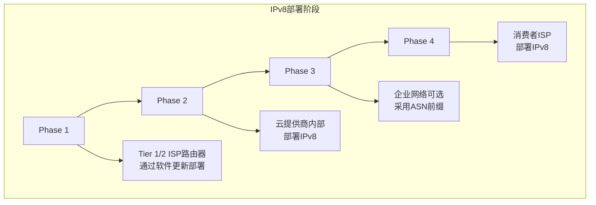

**Phase 1**：Tier 1/2 ISP 路由器通过软件更新部署 IPv8
**Phase 2**：云提供商内部部署 IPv8
**Phase 3**：企业网络可选采用 ASN 前缀
**Phase 4**：消费者 ISP 部署 IPv8

### 8.2 8to4 隧道

在过渡期间，IPv8 网络可以通过 IPv4 传输网络进行通信，这通过 **8to4 隧道**实现：

- IPv8 ASNs 通过 IPv4 传输 ASNs 使用 8to4 隧道通信
- **HTTPS 隧道是首选封装方式**（利用 443 端口的高度信任）
- 无需手动隧道配置
- 成本因子（CF）自然激励 IPv4 传输 ASNs 升级到 IPv8

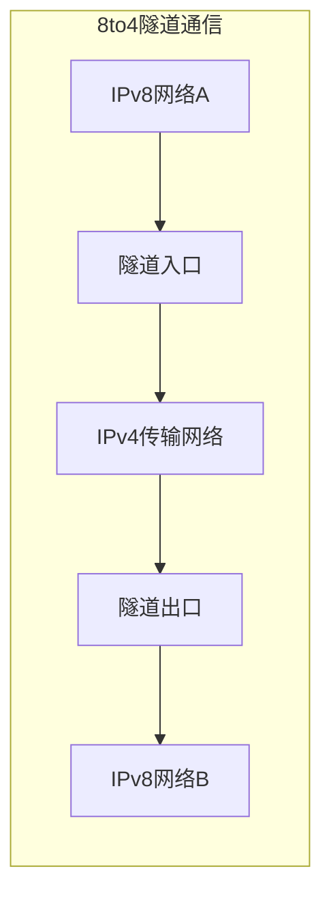

### 8.3 套接字 API 兼容性

IPv8 提供了**透明的向后兼容层**：

- 现有 IPv4 应用使用标准 BSD 套接字 API（AF_INET）
- IPv8 兼容性层**透明拦截**套接字调用
- 新应用可使用 AF_INET8 和 sockaddr_in8

```c
struct sockaddr_in8 {
    sa_family_t    sin8_family;   /* AF_INET8 */
    in_port_t      sin8_port;     /* port number */
    uint32_t       sin8_asn;      /* r.r.r.r ASN prefix */
    struct in_addr sin8_addr;     /* n.n.n.n host address */
};
```

## 九、设备合规层级

### 9.1 Tier 1：终端设备

终端设备必须实现以下功能：

- **Route8** 统一路由表、静态路由、VRF
- **两个默认网关**（偶/奇）——用于负载均衡和故障转移
- **DHCP8 客户端**、**ARP8**、**ICMPv8**
- **TCP/443 到 Zone Server 的持久连接**
- **NetLog8 客户端**、**ACL8 客户端执行**
- **管理 VRF**（VLAN 4090）、**OOB VRF**（VLAN 4091）
- **启动时免费 ARP8**

### 9.2 Tier 2：L2 网络设备

二层网络设备必须实现：

- **802.1Q trunking**、**VLAN 自动创建**
- **管理 VRF**、**OOB VRF**
- **交换机端口 OAuth2 绑定**、**LLDP**
- **NetLog8 客户端**、**ARP8**、**ICMPv8**
- **PVRST**、**Zone Server 作为 PVRST 根**
- **粘性 MAC 绑定**、**Zone Server MAC 通知**

### 9.3 Tier 3：L3 网络设备

三层网络设备必须实现：

- **所有 Tier 1 要求**
- **eBGP8**、**IBGP8**、**OSPF8**
- **IS-IS8**（可用）
- **VRF（完整）**、**XLATE8（边缘设备强制）**
- **WHOIS8 解析器**、**ACL8 网关执行**

## 十、与 IPv6 的对比

### 10.1 核心差异

| 方面 | IPv6 | IPv8 |
|------|------|------|
| 过渡模型 | 双栈（强制） | 单栈操作，无需双栈 |
| 管理集成 | 无 | 统一到 Zone Server 平台 |
| 认证模型 | 分散 | 统一 OAuth2 JWT |
| 地址表示 | 128 位，十六进制 | 64 位，点分十进制 |
| 全球路由表 | 无界（>90 万前缀） | 有界（每 ASN 一个条目） |
| 部署时间 | 25 年+ 仍为主流少数 | 设计为快速采用 |

### 10.2 IPv8 的设计优势

1. **无需双栈操作**：IPv4 是适当子集，可以完全复用现有 IPv4 网络
2. **向后 100% 兼容**：现有 IPv4 设备、应用、网络无需任何修改
3. **8to4 隧道**：IPv8 岛屿可通过 IPv4 传输网络通信
4. **自然经济激励**：CF 测量更高延迟，自动促使 IPv4 ASN 升级

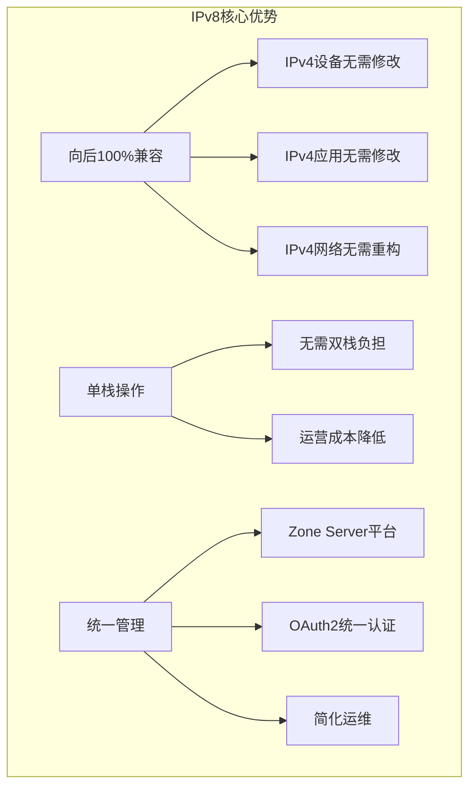

### 11.1 IPv8 的核心创新

IPv8 是一个**野心理望但务实的方法**来重塑网络协议。其核心创新包括：

1. **统一管理平台（Zone Server）**：将分散的网络服务整合到单一平台
2. **OAuth2 统一认证**：消除分散的认证孤岛
3. **64 位地址空间**：在保持 IPv4 操作习惯的同时大幅扩展地址空间
4. **结构有界的全球路由表**：解决路由表膨胀问题
5. **无需双栈的平滑过渡**：避免 IPv6 面临的迁移困境
6. **内置安全机制**：从协议层面强制执行安全策略

### 11.2 面临的挑战

然而，IPv8 要真正成为标准，还面临诸多挑战：

1. **标准化进程**：目前只是草案阶段，需要经过 IETF 多个轮次的讨论和修订
2. **行业支持**：需要获得主要设备厂商、运营商的支持
3. **生态系统建设**：从终端设备到网络设备都需要升级
4. **与现有 IPv6 投资的关系**：如何处理已经部署的 IPv6 基础设施

### 11.3 未来展望

无论 IPv8 最终是否能成为标准，它的出现都代表了网络协议发展的重要方向：

- **服务整合**：将分散的网络服务统一管理是长期趋势
- **安全内建**：从网络层而不是应用层解决安全问题
- **渐进式演进**：通过兼容性和平滑过渡来降低部署成本

这些理念将影响未来网络协议的发展方向。

---