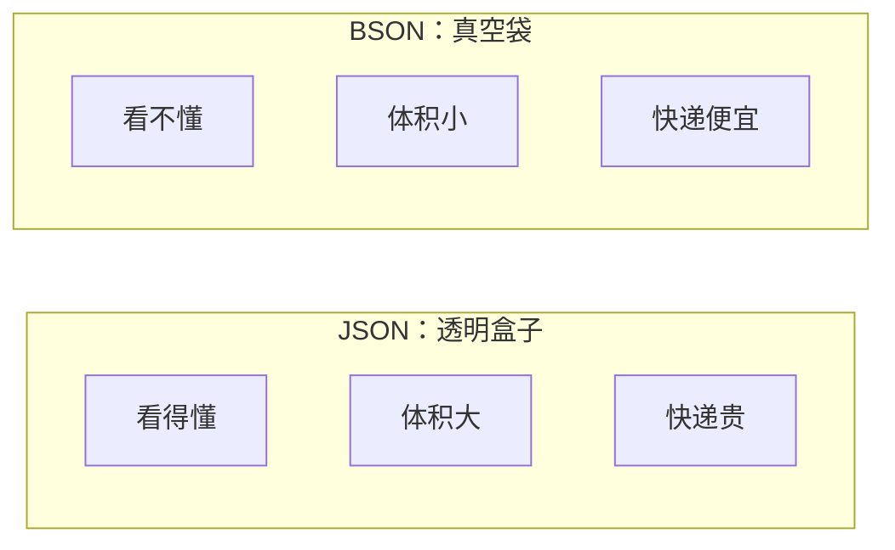
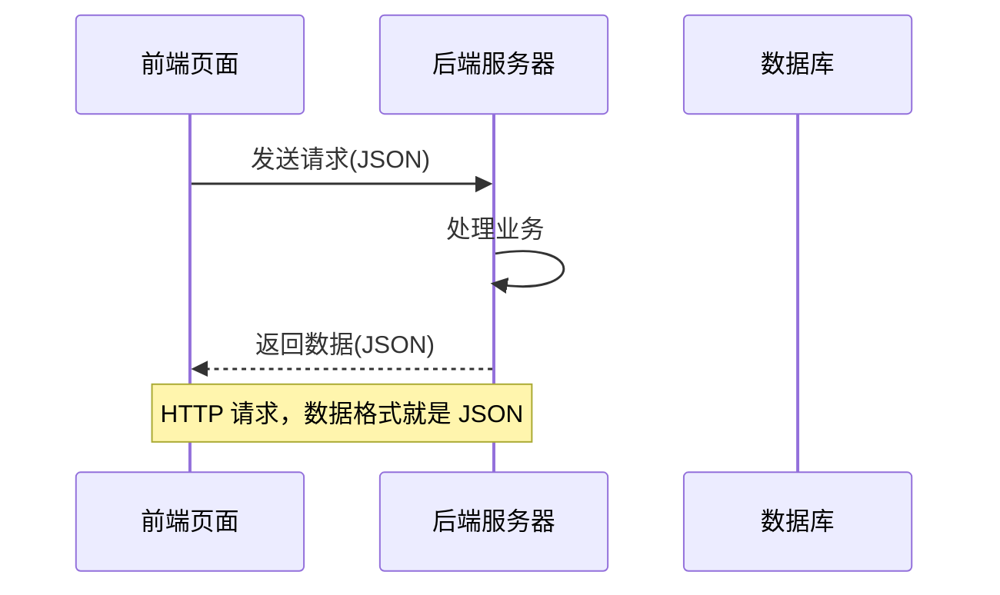
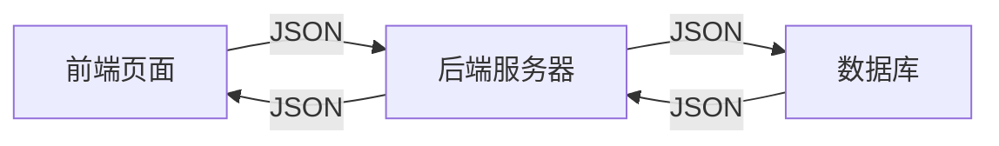
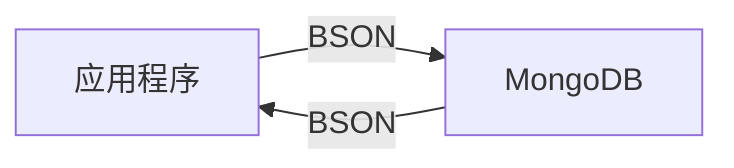

# JSON 和 BSON 到底是什么？一篇文章彻底讲清楚

> 做过开发的小伙伴一定见过这两个名字：JSON 和 BSON。名字这么像，它们到底有什么区别？各自用在什么场景？今天这篇文章，就让你彻底搞明白。
>
> 本文面向零基础读者，我会一步步带你认识它们，保证你看完就能懂。

---

## 一、先从一个生活中的例子开始

想象一下，你要给朋友寄一些东西。

有两种打包方式：

**第一种：用透明袋子装**
```
衣服一件
书三本
照片十张
```

你把要寄的东西写在一张纸上，清清晰晰，一条一条列出来。这张纸谁都能看懂，包括你朋友，包括快递员，包括你自己。

**第二种：用真空压缩袋**
```
\x08\x00\x00...
\x12\x00\x00...
\x5a\x00\x00...
```

同样的东西，但经过压缩，体积更小，存放更省空间。只是没人看得懂上面写了啥，只有专门的机器才能读取。

第一种，就是 **JSON**。
第二种，就是 **BSON**。

它们做的事情一样：**把数据存起来、传出去**，但方式不同。

---

## 二、第一步：认识 JSON

### 2.1 JSON 是什么？

**JSON = JavaScript Object Notation**

翻译成中文就是：**JavaScript 对象表示法**。

别被这个学名吓到，它其实就是一种**记录数据的方式**。就像你记账会用「收入：5000，支出：2000，结余：3000」一样，JSON 也是用类似的方式记录数据。

### 2.2 JSON 长什么样？

一个典型的 JSON 就像这样：

```json
{
    "name": "张三",
    "age": 25,
    "isStudent": true,
    "courses": ["语文", "数学", "英语"]
}
```

你能看出来：
- `name` 是「张三」
- `age` 是 `25`
- `isStudent` 是「是学生」（true）
- `courses` 是「语文、数学、英语」这三种

是不是很像写日记？**键值对应，层次分明**。

### 2.3 JSON 支持哪些数据类型？

JSON 一共支持 6 种基本类型：

| 类型 | 怎么写 | 例子 |
|------|--------|------|
| 字符串 | 用双引号包起来 | `"hello"` |
| 数字 | 直接写数字 | `25`、`3.14` |
| 布尔值 | true 或 false | `true`、`false` |
| 空值 | 写 null | `null` |
| 对象 | 用大括号 | `{"key": "value"}` |
| 数组 | 用中括号 | `["a", "b", "c"]` |

**记住：JSON 里没有「日期」，没有「图片」。**

如果要存日期，你得写成字符串：
```json
"birthday": "1995-05-20"
```

如果要存图片，你得先转成 Base64 编码的字符串：
```json
"avatar": "/9j/4AAQSkZJRgABAQAAAQABAAD..."
```

这就是 JSON 的「缺点」——很多常见的数据类型，它都存不了，只能绕个弯来存。

### 2.4 JSON 的优点

- ✅ **人类可读**：你看得懂，我也看得懂
- ✅ **所有语言都支持**：Python、Java、Go、JavaScript...几乎所有编程语言都能读写 JSON
- ✅ **Web 标准**：前后端交互都用它

### 2.5 JSON 的缺点

- ❌ **占地方**：文本格式，同样的数据，BSON 可能只有它的一半大
- ❌ **类型少**：没有日期，没有二进制，没有很多数据库需要的类型
- ❌ **解析慢**：计算机需要「一个字符一个字符」地去读

---

## 三、第二步：认识 BSON

### 3.1 BSON 是什么？

**BSON = Binary JSON**

翻译成中文就是：**二进制 JSON**。

如果说 JSON 是「文本版」，那 BSON 就是「二进制版」。它们功能差不多，但 BSON 更紧凑、更快。

### 3.2 BSON 是谁发明的？

BSON 是 **MongoDB** ���据库的「亲儿子」。

MongoDB 是一个很流行的文档数据库，它不用传统的 SQL 表格，而是用「文档」来存数据。存文档就需要一种高效的格式，于是 MongoDB 的工程师们设计了 BSON。

所以你现在知道：**BSON 主要用在 MongoDB 里**。

### 3.3 BSON 长什么样？

如果把前面的 JSON 转成 BSON，大概是长这样（用十六进制显示）：

```
16 00 00 00                      // 文档总长度（22字节）
02                                // 类型：字符串
6e 61 6d 65 00                   // "name"
06 00 00 00 5a 68 61 6e 67 00   // "张三" + 结束符
10                                // 类型：32位整数
61 67 65 00                      // "age"
19 00 00 00                      // 数值：25
08                                // 类型：布尔
69 73 53 74 75 64 65 6e 74 00   // "isStudent"
01                                // 值：true
04                                // 类型：数组
63 6f 75 72 73 65 73 00         // "courses"
00                                // 结束
```

普通人肯定看不懂，但计算机非常喜欢这种格式：**紧凑、高效、解析快**。

### 3.4 BSON 支持哪些数据类型？

这才是 BSON 的核心优势！它支持的类型比 JSON 多得多：

| 类型 | 怎么写 | 说明 |
|------|--------|------|
| double | `1.5` | 浮点数 |
| string | `"hello"` | 字符串 |
| object | `{...}` | 嵌套文档 |
| array | `[...]` | 数组 |
| binary | `Binary(...)` | 二进制数据（图片、文件等） |
| undefined | `undefined` | 未定义 |
| null | `null` | 空值 |
| objectId | `ObjectId(...)` | MongoDB 专用 ID |
| bool | `true/false` | 布尔值 |
| date | `Date(...)` | 日期时间 |
| int | `123` | 32位整数 |
| long | `123456789` | 64位整数 |
| timestamp | `Timestamp(...)` | 时间戳 |
| regex | `/pattern/` | 正则表达式 |

**重点来了**：

- JSON 没有「日期类型」，存日期只能写成字符串 `"2024-01-01"`
- BSON 有「日期类型」，直接存 `Date(2024-01-01)`
- JSON 没有「图片类型」，存图片必须先转成 Base64 字符串
- BSON 有「二进制类型」，直接存图片原始数据
- JSON 没有「唯一 ID」，MongoDB 需要自己定义
- BSON 有「ObjectId」类型，专门给文档用的唯一标识

这几种类型在开发中非常常用，所以 BSON 比 JSON 用起来更方便。

---

## 四、第三步：对比一下

### 4.1 一张表看懂区别

| 特性 | JSON | BSON |
|------|------|------|
| **全称** | JavaScript Object Notation | Binary JSON |
| **格式** | 文本（人类可读） | 二进制（计算机优化） |
| **谁生的** | JavaScript | MongoDB |
| **数据类型** | 6 种 | 十几种 |
| **支持日期** | ❌ 要转成字符串 | ✅ 原生支持 |
| **支持二进制** | ❌ 要 Base64 编码 | ✅ 原生支持 |
| **存储体积** | 较大 | 较小（约小一半） |
| **解析速度** | 较慢 | 较快 |
| **人类可读** | ✅ 非常容易 | ❌ 几乎不可能 |
| **主要用途** | 数据交换、Web API | 数据库存储 |

### 4.2 用比喻来理解

想象一下你要搬家：

- **JSON 就像是装在透明盒子里**：你能看到里面是什么（人类可读），但盒子比较大，占地方，快递费也贵。

- **BSON 就像是真空压缩袋**：同样能装下所有东西，但体积更小，携带更方便，只是普通人看不懂里面是啥。



### 4.3 性能对比

假如要存 100 万条这样的数据���

```json
{
    "userId": "10001",
    "username": "赵六",
    "age": 28,
    "createdAt": "2024-01-15T10:30:00Z",
    "isActive": true
}
```

| 指标 | JSON | BSON |
|------|------|------|
| 文件大小 | 约 8 MB | 约 4 MB |
| 读取速度 | 较慢 | 快 2-3 倍 |
| 写入速度 | 较慢 | 快 2-3 倍 |

BSON 大约能省一半空间，快一倍速度。

---

## 五、第四步：它们分别用在什么地方？

### 5.1 JSON 的主战场

| 场景 | 说明 | 举个例子 |
|------|------|----------|
| 🌐 Web API | 前后端数据交换的事实标准 | 你打开网页，数据从服务器传过来，用的就是 JSON |
| 📦 配置文件 | 很多工具用 JSON 写配置 | package.json、tsconfig.json |
| 📥 数据导出 | 不同系统之间导数据 | Excel 导出成 JSON |
| 📨 消息队列 | Kafka、RabbitMQ 常用 JSON | 消息传递 |
| 📱 App 接口 | 移动端和服务器通信 | 小程序、App 的网络请求 |

基本上，你访问的任何网站，背后都可能 JSON 在传递数据。



### 5.2 BSON 的主战场

| 场景 | 说明 | 举个例子 |
|------|------|----------|
| 🗄️ MongoDB | MongoDB 内部存储就是 BSON | 文档数据库 |
| 📂 大数据量 | 需要高效读写和存储 | 日志系统、用户行为分析 |
| 📅 日期多 | 不需要额外转换 | 订单表、考勤表 |
| 🖼️ 图片多 | 直接存二进制 | 用户头像、文章配图 |
| ⚡ 高并发 | 解析速度快 | 实时系统 |

```mermaid
flowchart LR
    A[应用程序] -->|BSON| B[MongoDB]
    B -->|BSON| A
    
    Note over A,B: 底层传输的就是 BSON
```

---

## 六、第五步：实际案例演示

### 案例一：存一个用户信息

**用 JSON 存到文件：**

```json
{
    "userId": "1001",
    "username": "王五",
    "createdAt": "2024-01-15T10:30:00Z",
    "avatar": "/9j/4AAQSkZJRgABAQAAAQABAAD..."
}
```

问题来了：
- `createdAt` 必须写成字符串 `"2024-01-15T10:30:00Z"`，计算机还要再转一次才能知道这是日期
- `avatar` 是图片，必须先转成 Base64 字符串，计算机读的时候还要再转回来

**用 BSON 存到 MongoDB：**

```json
{
    "userId": "1001",
    "username": "王五",
    "createdAt": Date("2024-01-15T10:30:00Z"),
    "avatar": Binary(...)
}
```

- `createdAt` 直接就是日期类型，计算机可以直接比较大小、做时区转换
- `avatar` 直接就是二进制类型，存的是什么就是什么

### 案例二：一个完整的对比

```mermaid
flowchart TB
    subgraph JSONSide["JSON 格式"]
        J1["{"]
        J2["  \"name\": \"赵六\","]
        J3["  \"age\": 28,"]
        J4["  \"birthday\": \"1995-05-20\","]
        J5["  \"avatar\": \"data:image/png;base64,iVBORw0KG...\"")
        J6["}"]
    end
    
    subgraph BSONSide["BSON 格式"]
        B1["{"]
        B2["  \"name\": \"赵六\" (string)")
        B3["  \"age\": 28 (int)")
        B4["  \"birthday\": Date(1995-05-20))"]
        B5["  \"avatar\": Binary(...))"]
        B6["}"]
    end
    
    JSONSide -->|对比| BSONSide
```

左边的 JSON 你能看懂，右边的 BSON 你看不懂，但对计算机来说，右边的效率更高。

---

## 七���常见问题解答

> **Q1：JSON 会取代 BSON 吗？**

不会。它们是**互补关系**，不是竞争关系：

- **JSON 负责「搬运」**：人在传、机器在传，用 JSON 更方便
- **BSON 负责「仓储」**：机器在存、机器在读，用 BSON 更高效

就像「卡车」和「仓库」的关系：东西用卡车运输（JSON），用仓库储存（BSON）。你能用卡车代替仓库吗？不行。仓库能代替卡车吗？也不行。

> **Q2：BSON 只能用于 MongoDB 吗？**

技术上不是，BSON 是一种独立的数据格式。

但实际上，**99% 的 BSON 都用在 MongoDB 里**。其他数据库要么用 SQL，要么用其他二进制格式，很少用 BSON。

> **Q3：我的项目该用哪个？**

记住这个简单的选择方法：

- **Web 开发、前后端交互、写配置、导数据** → 用 **JSON**
- **MongoDB 数据库、存图片、需要高效存储** → 底层自动用 **BSON**（你可能接触不到）

> **Q4：JSON 有没有可能被淘汰？**

短期内不会。

JSON 已经是 Web 领域的**事实标准**，几乎所有编程语言、所有系统都支持它。生态非常成熟。

而且 JSON 最大的优势是**人类可读**，这个特性在开发调试中非常重要。

> **Q5：BSON 有没有办法让人看懂？**

有的，MongoDB 提供了命令行工具，可以把 BSON 转成 JSON：

```bash
# 查看 MongoDB 数据（自动转成 JSON 格式）
db.users.find()
```

所以不用担心，存储用 BSON，展示给人看的时候会自动转成 JSON。

---

| 格式 | 定位 | 特点 |
|------|------|------|
| **JSON** | 数据交换格式 | 文本格式、人类可读、通用性强 |
| **BSON** | 数据库存储格式 | 二进制、高效、支持更多类型 |

**简单理解**：

- JSON 负责「**搬砖**」（数据传输）
- BSON 负责「**盖楼**」（数据存储）

---

## 写在最后

其实 JSON 和 BSON 没那么复杂，它们都是为了解决同一个问题：**怎么把数据存起来、传出去**。

- **JSON** 是通用的、人人看得懂的方式
- **BSON** 是专用的、计算机更喜欢的方式

了解它们的区别，在合适的地方用合适的格式，这就是最好的选择。

---


> 做过开发的小伙伴一定见过这两个名字：JSON 和 BSON。名字这么像，它们到底有什么区别？各自用在什么场景？今天这篇文章，就让你彻底搞明白。

---

## 一、从一个常见的场景说起

某天，你的同事给你发来一段代码：

```json
{
    "name": "张三",
    "age": 25,
    "isStudent": true,
    "courses": ["语文", "数学", "英语"]
}
```

你一看就知道：哦，这是 JSON 嘛，键值对的形式，方便人读也方便机器解析。

但没过多久，你又在 MongoDB 的数据库里看到了另一种格式：

```
\x16\x00\x00\x00
\x02name\x00\x06\x00\x00\x00张三\x00
\x10age\x00\x19\x00\x00\x00
\x08isStudent\x00\x01
\x04courses\x00\x2a\x00\x00\x00
```

这堆二进制是啥？看起来像乱码，但格式又似乎有些规律。

没错，这就是 **BSON**——Binary JSON，二进制版本的 JSON。

它们名字像，长得像，但确实不是同一种东西。今天我们就来好好聊聊它们。

---

## 二、先说说 JSON 是什么

### JSON 的全称

**JSON = JavaScript Object Notation**

翻译过来就是“JavaScript 对象表示法”。别被这个学名吓到，它其实就是一种**数据格式**，用来在不同系统之间传递数据。

### JSON 长什么样？

一个典型的 JSON 看起来是这样的：

```json
{
    "name": "李明",
    "age": 30,
    "email": "liming@example.com",
    "address": {
        "city": "北京",
        "district": "朝阳区"
    },
    "hobbies": ["跑步", "读书", "摄影"],
    "isMarried": false
}
```

是不是非常清晰？就像写日记一样：**键值对应，层次分明**。

### JSON 支持的数据类型

| 类型 | 例子 | 说明 |
|------|------|------|
| 字符串 | `"hello"` | 必须用双引号 |
| 数字 | `25`、`3.14` | 整数或浮点数 |
| 布尔值 | `true`、`false` | |
| 空值 | `null` | 表示空 |
| 对象 | `{"key": "value"}` | 嵌套的对象 |
| 数组 | `["a", "b", "c"]` | 有序列表 |

**注意**：JSON 里没有日期类型、没有二进制类型，所有东西都要转成字符串来表示。

### JSON 的优缺点

**优点**：

- ✅ 人类可读，看起来一目了然
- ✅ 几乎所有编程语言都支持
- ✅ 作为数据交换格式非常好用

**缺点**：

- ❌ 存储效率不高（文本格式）
- ❌ 不支持日期、二进制等特殊类型
- ❌ 解析速度相对较慢

---

## 三、再来说说 BSON 是什么

### BSON 的全称

**BSON = Binary JSON**

翻译过来就是“二进制 JSON”。说白了，它就是 JSON 的**二进制版本**。

### BSON 是谁发明的？

BSON 是 **MongoDB** 数据库的专用格式。MongoDB 在存储数据时，用的不是 JSON，而是优化过的 BSON。

### BSON 长什么样？

如果我们把前面的 JSON 转成 BSON，大概是长这样（用十六进制显示）：

```
16 00 00 00                      // 文档总长度
02                                // 字符串类型
6e 61 6d 65 00                   // "name"
06 00 00 00 5a 68 61 6e 67 00   // "张三" + 结束符
10                                // 32位整数类型
61 67 65 00                      // "age"
19 00 00 00                      // 25
08                                // 布尔类型
69 73 53 74 75 64 65 6e 74 00   // "isStudent"
01                                // true
04                                // 数组类型
63 6f 75 72 73 65 73 00         // "courses"
00                                // 结束
```

普通人肯定看不懂，但计算机非常喜欢这种格式：**紧凑、高效、解析快**。

### BSON 支持的数据类型

这才是 BSON 的核心优势！它支持的类型比 JSON 丰富得多：

| 类型 | 值 | 说明 |
|------|-----|------|
| `double` | `1.5` | 浮点数 |
| `string` | `"hello"` | 字符串 |
| `object` | `{...}` | 嵌套文档 |
| `array` | `[...]` | 数组 |
| `binary` | `Binary(...)` | 二进制数据 |
| `undefined` | `undefined` | 未定义 |
| `null` | `null` | 空值 |
| `objectId` | `ObjectId(...)` | MongoDB 专用 ID |
| `bool` | `true/false` | 布尔值 |
| `date` | `Date(...)` | 日期时间 |
| `int` | `123` | 32位整数 |
| `long` | `123456789` | 64位整数 |
| `timestamp` | `Timestamp(...)` | 时间戳 |
| `regex` | `/pattern/` | 正则表达式 |

**重点来了**：BSON 有 `Date`（日期）、`Binary`（二进制）、`ObjectId`（MongoDB 的唯一ID）这些 JSON 没有的类型。

这就是为什么 MongoDB 选择 BSON 而不是 JSON：**有些数据类型用 JSON 表示太麻烦，BSON 直接原生支持**。

---

## 四、JSON vs BSON：核心区别对比

### 一张表看懂

| 特性 | JSON | BSON |
|------|------|------|
| **全称** | JavaScript Object Notation | Binary JSON |
| **格式** | 文本（人类可读） | 二进制（计算机优化） |
| **诞生地** | JavaScript | MongoDB |
| **数据类型** | 6 种 | 十几种 |
| **支持日期** | ❌ 要转成字符串 | ✅ 原生支持 |
| **支持二进制** | ❌ 要 Base64 编码 | ✅ 原生支持 |
| **存储体积** | 较大 | 较小 |
| **解析速度** | 较慢 | 较快 |
| **人类可读** | ✅ 非常容易 | ❌ 几乎不可能 |
| **适用场景** | 数据交换、Web API | 数据库存储 |

### 用比喻来理解

想象一下：

- **JSON 就像是装在透明盒子里的礼物**：你能看到里面是什么（人类可读），但盒子比较大，占地方。
- **BSON 就像是真空压缩袋**：同样能装下所有东西，但体积更小，携带更方便，只是普通人看不懂里面是啥。

---

## 五、它们分别用在什么地方？

### JSON 的主战场

| 场景 | 说明 |
|------|------|
| 🌐 Web API | 前后端数据交换的事实标准 |
| 📦 配置文件 | 很多工具用 JSON 写配置 |
| 📥 数据导出 | 不同系统之间导数据 |
| 📨 消息队列 | 如 Kafka、RabbitMQ 常用 JSON |

你访问的任何网站，背后可能都有 JSON 在传递数据。



### BSON 的主战场

| 场景 | 说明 |
|------|------|
| 🗄️ MongoDB 数据库 | MongoDB 内部存储就是 BSON |
| 📂 大数据量存储 | 需要高效读写和存储 |
| 📅 日期/二进制数据多 | 不需要额外转换 |
| ⚡ 高并发场景 | 解析速度快 |



---

## 六、实际案例演示

### 案例一：存储用户信息

**用 JSON 存储**（存到文件或传给别人）：

```json
{
    "userId": "1001",
    "username": "王五",
    "createdAt": "2024-01-15T10:30:00Z",
    "avatar": "/9j/4AAQSkZJRgABAQAAAQABAAD..."
}
```

注意这里有个问题：

- `createdAt` 必须写成字符串格式 `"2024-01-15T10:30:00Z"`
- `avatar` 是图片，必须转成 Base64 编码的字符串

**用 BSON 存储**（存到 MongoDB）：

```json
{
    "userId": "1001",
    "username": "王五",
    "createdAt": Date("2024-01-15T10:30:00Z"),
    "avatar": Binary(...)
}
```

- `createdAt` 直接就是日期类型
- `avatar` 直接就是二进制类型

### 案例二：一个完整的对比

```mermaid
flowchart TB
    subgraph JSON["JSON 格式"]
        J1["{"] 
        J2["  \"name\": \"赵六\","
        J3["  \"age\": 28,"
        J4["  \"birthday\": \"1995-05-20\","
        J5["  \"avatar\": \"data:image/png;base64,iVBORw0KG...\""
        J6["}"]
    end
    
    subgraph BSON["BSON 格式"]
        B1["{"]
        B2["  \"name\": \"赵六\" (string)"
        B3["  \"age\": 28 (int)"
        B4["  \"birthday\": Date(1995-05-20)"
        B5["  \"avatar\": Binary(...)"
        B6["}"]
    end
    
    J1 --> J6
    B1 --> B6
```

---

## 七、关于它们的一些常见问题

> **Q1：JSON 会取代 BSON 吗？**

不会。它们是互补的关系：

- JSON 适合**数据交换**（人在传、机器在传）
- BSON 适合**数据存储**（机器在存、机器在读）

> **Q2：BSON 只能用于 MongoDB 吗？**

技术上不是，BSON 是一种独立的数据格式。但实际上，**99% 的 BSON 都用在 MongoDB 里**。其他数据库很少用 BSON。

> **Q3：我的项目该用哪个？**

- 如果是 **Web 开发、前后端交互、开放 API**：用 **JSON**
- 如果是用 **MongoDB 数据库、做高性能存储**：底层自动用 **BSON**（你可能接触不到）
- 如果是**配置文件、导出数据、跨系统对接**：用 **JSON**

> **Q4：JSON 有没有可能被淘汰？**

短期内不会。JSON 已经成为 Web 领域的**事实标准**，几乎所有编程语言、所有系统都支持它。生态非常成熟。

---

| 格式 | 定位 | 特点 |
|------|------|------|
| **JSON** | 数据交换格式 | 文本格式、人类可读、通用性强 |
| **BSON** | 数据库存储格式 | 二进制、高效、支持更多类型 |

**简单理解**：JSON 负责“搬砖”（数据传输），BSON 负责“盖楼”（数据存储）。

---

# TopoJSON 完全指南：让地图数据瘦身的秘密武器，从原理到实战一文搞懂
> 上一篇文章我们聊了 GeoJSON——地理信息世界的"普通话"。但你可能遇到过这样的情况：一个中国省份边界的数据文件，GeoJSON 格式足足 14MB，加载到浏览器要等半分钟，渲染时页面直接卡死。
> 有没有办法让这个文件"瘦"下来，同时还不丢掉关键信息？
> 答案就是：**TopoJSON**。
它是 GeoJSON 的"压缩版兄弟"，通过对共享边界只存储一次的巧妙设计，能把文件体积缩小 80% 甚至更多。今天我们就来一步步拆解 TopoJSON，看它到底是怎么做到的。
## 一、先从一个痛点说起：GeoJSON 的"冗余之痛"
### 1.1 看一个真实的例子
假设我们要存储三个相邻省份的边界数据：河北、北京、天津。
在 GeoJSON 中，每个省份都是一个独立的 Polygon。问题来了——**河北和北京之间有一段共享边界，河北和天津之间也有一段共享边界**。
graph TD
    subgraph "GeoJSON 的存储方式"
        A["河北省 Polygon<br/>存储了完整的边界坐标<br/>A→B→C→D→E→F→G→A"]
        B["天津市 Polygon<br/>存储了完整的边界坐标<br/>C→D→H→I→C"]
        C["北京市 Polygon<br/>存储了完整的边界坐标<br/>D→E→J→K→D"]
    D["问题：<br/>C→D 段在河北和天津中各存一次<br/>D→E 段在河北和北京中各存一次<br/>共享边界被重复存储！"]
    A --> D
    B --> D
    C --> D
    style D fill:#F44336,color:#fff
在中国省级行政区划数据中，34 个省份之间有大量共享边界。这些边界在 GeoJSON 中被**重复存储了两次**（相邻的两个省份各存一次），有些甚至被存了三次（三省交界处）。
**实际数据说话**：
| 数据集 | GeoJSON 体积 | TopoJSON 体积 | 压缩率 |
|--------|-------------|--------------|--------|
| 中国省份边界 | ~14MB | ~1.8MB | 87% |
| 美国州边界 | ~5.2MB | ~0.6MB | 88% |
| 世界国家边界 | ~24MB | ~3.1MB | 87% |
一个简单的格式转换，文件体积直接缩水到原来的 1/7！这就是 TopoJSON 的威力。
### 1.2 GeoJSON 的三大痛点
graph TD
    A[GeoJSON 的痛点] --> B["痛点1：数据冗余<br/>共享边界重复存储<br/>相邻省份的公共边存2次"]
    A --> C["痛点2：体积膨胀<br/>坐标数据占大头<br/>冗余坐标让文件急剧膨胀"]
    A --> D["痛点3：拓扑缺失<br/>不知道谁和谁相邻<br/>无法判断两个区域是否共享边界"]
    style A fill:#F44336,color:#fff
    style B fill:#FF9800,color:#fff
    style C fill:#FF9800,color:#fff
    style D fill:#FF9800,color:#fff
第三个痛点尤其致命——GeoJSON 只记录了"每个区域的形状"，但没有记录"区域之间的关系"。如果你想回答"河北和哪些省份接壤"这样的问题，GeoJSON 做不到，你得自己计算。
## 二、TopoJSON 是什么？一句话说清楚
### 2.1 一句话定义
**TopoJSON 是 GeoJSON 的一种拓扑编码扩展，它将地理几何体分解为共享的弧段（arcs），通过引用弧段来构建几何体，从而消除冗余并保留拓扑关系。**
听起来有点绕？没关系，我们用最直观的方式来理解。
### 2.2 一个生活中的类比
想象你在画一幅中国地图：
- **GeoJSON 的方式**：把每个省份的完整轮廓都画一遍。河北的轮廓画一次，北京又被画在河北的轮廓里面，两个轮廓之间的那段"省界"你实际上画了两次。
- **TopoJSON 的方式**：先画出所有不重复的"线段"（弧段），然后告诉计算机"河北省由线段1+线段2+线段3组成，北京市由线段3+线段4+线段5组成"。线段3就是河北和北京共享的那段边界，只需要画一次。
graph LR
    subgraph "GeoJSON：各自为战"
        A1["河北：画 A+B+C+D+E+F"]
        A2["北京：画 D+E+G+H"]
        A3["天津：画 C+D+I+J"]
        A4["总工作量：14条线段"]
    subgraph "TopoJSON：共享复用"
        B1["弧1=A 弧2=B 弧3=C<br/>弧4=D 弧5=E 弧6=F<br/>弧7=G 弧8=H 弧9=I 弧10=J"]
        B2["河北：弧1+弧2+弧3+弧4+弧5+弧6"]
        B3["北京：弧4+弧5+弧7+弧8"]
        B4["天津：弧3+弧4+弧9+弧10"]
        B5["总工作量：10条线段<br/>省了4条！"]
    style A4 fill:#F44336,color:#fff
    style B5 fill:#4CAF50,color:#fff
这就是 TopoJSON 的核心思想：**把几何体拆成弧段，通过弧段引用来组装几何体**。
### 2.3 TopoJSON 的发展历史
timeline
    title TopoJSON 发展简史
    2012 : Mike Bostock 创建 TopoJSON<br/>（D3.js 作者，数据可视化教父）
    2013 : topojson 命令行工具发布<br/>支持 GeoJSON 转 TopoJSON
    2014 : topojson-client 和 topojson-server 分离<br/>生态逐渐完善
    2016 : D3.js v4 将 TopoJSON 作为推荐格式<br/>用于 Choropleth 地图
    2019 : topojson v3 发布<br/>API 简化，性能提升
    2022 : topojson v5 发布<br/>支持 ES Module
    2024 : 成为 Web 地图领域<br/>事实上的大数据量标准格式
TopoJSON 的作者 **Mike Bostock**，正是 D3.js 的创造者，也是《纽约时报》前图形编辑。他设计 TopoJSON 的初衷很简单：**纽约时报的交互式地图需要在手机上流畅加载，GeoJSON 太大了**。
## 三、TopoJSON 的核心概念：弧段（arcs）
理解 TopoJSON，最关键的就是理解**弧段**这个概念。它是整个 TopoJSON 大厦的基石。
### 3.1 什么是弧段？
弧段就是一条**不可再分的坐标序列**。它是一条线，由两个或更多的坐标点组成。
在 TopoJSON 中，所有几何体（点、线、面）都不再直接存储坐标，而是**通过引用弧段来间接表示**。
graph TD
    A[TopoJSON 的核心思想] --> B["所有坐标点<br/>集中存储在 arcs 数组中"]
    A --> C["几何体通过<br/>弧段索引来引用坐标"]
    A --> D["共享的边界<br/>只存储一次"]
    B --> E["arcs: [<br/>  [[x1,y1],[x2,y2],...],  // 弧段0<br/>  [[x3,y3],[x4,y4],...],  // 弧段1<br/>  ...<br/>]"]
    C --> F["Polygon: {<br/>  arcs: [0, 1, -2]  // 引用弧段<br/>}"]
    style A fill:#4CAF50,color:#fff
    style B fill:#2196F3,color:#fff
    style C fill:#FF9800,color:#fff
    style D fill:#9C27B0,color:#fff
### 3.2 弧段的编号和引用
弧段在 `arcs` 数组中是**从 0 开始编号**的。当一个几何体引用弧段时，用数字表示：
- **正数**：按照弧段本身的坐标顺序引用
- **负数**：按照弧段的坐标**逆序**引用（取反再减1）
等等，负数是什么意思？这是 TopoJSON 最精妙的设计之一。
### 3.3 负数弧段：反向引用的秘密
假设弧段 0 的坐标是 `A→B→C→D`，那么：
- 引用 `0` 表示沿着 `A→B→C→D` 的方向
- 引用 `-1` 表示沿着 `D→C→B→A` 的方向（0取反再减1 = -1）
**通用规则**：
| 引用值 | 含义 |
| `0` | 弧段0，正向（第1条弧段） |
| `1` | 弧段1，正向（第2条弧段） |
| `2` | 弧段2，正向（第3条弧段） |
| `-1` | 弧段0，反向（~0 = -1） |
| `-2` | 弧段1，反向（~1 = -2） |
| `-3` | 弧段2，反向（~3 = -3） |
换算公式：`~i = -i - 1`（这是 JavaScript 中的位运算 `~` 的效果）
graph TD
    subgraph "弧段引用规则"
        A["正数 i → 弧段 i，正向遍历<br/>从第一个点到最后一个点"]
        B["负数 -n → 弧段 ~(-n)，反向遍历<br/>从最后一个点到第一个点"]
    C["例子：<br/>弧段0: A→B→C→D<br/>引用 0: A→B→C→D（正向）<br/>引用 -1: D→C→B→A（反向）"]
    D["为什么需要反向？<br/>因为相邻省份共享同一段边界<br/>但对两个省份来说<br/>这段边界的'方向'是相反的！"]
    A --> C
    B --> C
    C --> D
    style D fill:#FF9800,color:#fff
**一个具体的例子**：
假设河北和北京共享一段边界，从点 C 到点 D。在 TopoJSON 中，这段边界被存储为弧段 3，方向是 `C→D`：
- 河北的 Polygon 引用弧段 3 时用 `3`（正向 C→D），因为河北的边界恰好沿这个方向走
- 北京的 Polygon 引用同一段边界时用 `-4`（反向 D→C），因为北京的边界需要反方向走
**两个省份共享同一条弧段，但方向相反——这就是 TopoJSON 精妙的地方**。
### 3.4 弧段的整数编码：进一步压缩
TopoJSON 还有一个 GeoJSON 不具备的压缩技巧：**弧段坐标使用整数编码，并通过差值（delta）存储**。
在 GeoJSON 中，坐标是绝对值：
"coordinates": [[116.397428, 39.90923], [116.40125, 39.91580], [116.40833, 39.92015]]
在 TopoJSON 中，坐标是**相对于前一个点的差值**，并且会被量化为整数：
"arcs": [[[1163974280, 399092300], [38220, 6570], [7080, 4350]]]
这意味着：
- 第一个点存储绝对值
- 后续每个点只存储与上一个点的差值
- 所有值乘以一个量化因子转为整数（去掉了小数点）
**差值编码的好处**：相邻点之间通常很接近，差值很小，用整数存储可以大幅减少字符数。比如 `116401250` 需要 9 位，但差值 `38220` 只需要 5 位。
graph TD
    A[坐标压缩三部曲] --> B["1. 量化<br/>将浮点坐标乘以 10^n<br/>转为整数"]
    A --> C["2. 差值编码<br/>第一个点存绝对值<br/>后续点存与前一点的差"]
    A --> D["3. 去冗余零<br/>省略不必要的精度<br/>减小数字位数"]
    B --> E["116.397428 × 10^7<br/>= 1163974280"]
    C --> F["116.40125 - 116.397428<br/>= 0.003822 × 10^7 = 38220"]
    D --> G["38220 而非 0382200<br/>节省字符"]
    style A fill:#4CAF50,color:#fff
    style B fill:#2196F3,color:#fff
    style C fill:#FF9800,color:#fff
    style D fill:#9C27B0,color:#fff
## 四、TopoJSON 的完整数据结构：逐层拆解
现在我们已经理解了弧段的概念，让我们来看看一个完整的 TopoJSON 文件长什么样。
### 4.1 一个最简单的例子：一个三角形
  "type": "Topology",
  "objects": {
    "triangle": {
      "type": "GeometryCollection",
      "geometries": [
        {
          "type": "Polygon",
          "arcs": [[0]]
        }
      ]
  "arcs": [
    [[0, 0], [1, 0], [0, 1], [0, 0]]
  ]
逐字段解释：
| 字段 | 值 | 含义 |
| `type` | "Topology" | 固定值，标识这是 TopoJSON |
| `objects` | {...} | 包含所有几何对象的集合 |
| `objects.triangle` | {...} | 名为 "triangle" 的几何对象集合 |
| `geometries` | [...] | 具体的几何体列表 |
| `arcs` | [[0]] | 这个 Polygon 由弧段0组成（只有1个环） |
| `arcs`（顶层） | [[[0,0],...]] | 所有弧段的坐标数据 |
### 4.2 TopoJSON 的层级结构总览
graph TD
    A["TopoJSON 文件<br/>{type: 'Topology'}"] --> B["objects<br/>几何对象集合"]
    A --> C["arcs<br/>弧段坐标数据"]
    A --> D["bbox（可选）<br/>包围框"]
    A --> E["transform（可选）<br/>坐标变换参数"]
    B --> F["object1<br/>命名几何集合"]
    B --> G["object2<br/>命名几何集合"]
    F --> H["type: GeometryCollection"]
    F --> I["geometries: [...]"]
    I --> J["{type: Polygon, arcs: [...]}<br/>多边形"]
    I --> K["{type: LineString, arcs: [...]}<br/>线"]
    I --> L["{type: Point, coordinates: [...]}<br/>点"]
    I --> M["{type: MultiPolygon, arcs: [...]}<br/>多多边形"]
    C --> N["弧段0: [[x,y], [x,y], ...]"]
    C --> O["弧段1: [[x,y], [x,y], ...]"]
    C --> P["弧段N: [[x,y], [x,y], ...]"]
    E --> Q["scale: [Δx, Δy]<br/>缩放因子"]
    E --> R["translate: [x0, y0]<br/>平移偏移"]
    style A fill:#4CAF50,color:#fff
    style B fill:#2196F3,color:#fff
    style C fill:#FF9800,color:#fff
    style E fill:#9C27B0,color:#fff
### 4.3 和 GeoJSON 结构对比
graph LR
    subgraph "GeoJSON"
        A1["type: FeatureCollection"]
        A2["features: [...]"]
        A3["每个 Feature 自带<br/>完整坐标数据"]
    subgraph "TopoJSON"
        B1["type: Topology"]
        B2["objects: {...}<br/>几何定义（引用弧段）"]
        B3["arcs: [...]<br/>坐标数据集中存储"]
        B4["坐标只存一份<br/>几何通过引用组装"]
    style A3 fill:#FF9800,color:#fff
    style B4 fill:#4CAF50,color:#fff
核心区别就一句话：**GeoJSON 是"自带坐标"，TopoJSON 是"引用坐标"**。
## 五、transform：坐标的解压密钥
TopoJSON 文件中经常出现一个 `transform` 字段，它是理解弧段坐标的关键。
### 5.1 transform 是什么？
  "type": "Topology",
  "transform": {
    "scale": [0.0000001, 0.0000001],
    "translate": [116.0, 39.0]
  "arcs": [
    [[3974280, 909230], [38220, 6570]]
  ]
`transform` 包含两个参数：
- **scale**（缩放因子）：整数坐标要乘以这个值，才能还原为真实坐标
- **translate**（平移偏移）：乘以 scale 后再加上这个偏移量，才是最终的地理坐标
### 5.2 坐标还原公式
真实坐标 = 整数坐标 × scale + translate
具体来说：
经度 = arc_x × scale[0] + translate[0]
纬度 = arc_y × scale[1] + translate[1]
### 5.3 一个完整的还原过程
假设 `transform` 为：
  "scale": [0.000001, 0.000001],
  "translate": [116.0, 39.0]
弧段数据为：`[[397428, 90923], [3822, 657], [708, 435]]`
**第一步**：将差值还原为绝对整数坐标
| 点序号 | 差值 | 累加结果 |
|--------|------|----------|
| 点1 | [397428, 90923] | [397428, 90923] |
| 点2 | [3822, 657] | [401250, 91580] |
| 点3 | [708, 435] | [401958, 92015] |
**第二步**：将整数坐标乘以 scale 再加 translate
| 累加结果 | × scale | + translate | 真实坐标 |
|----------|---------|-------------|----------|
| [397428, 90923] | [0.397428, 0.090923] | [116.0, 39.0] | [116.397428, 39.090923] |
| [401250, 91580] | [0.401250, 0.091580] | [116.0, 39.0] | [116.401250, 39.091580] |
| [401958, 92015] | [0.401958, 0.092015] | [116.0, 39.0] | [116.401958, 39.092015] |
graph TD
    A["TopoJSON 整数差值坐标"] --> B["第一步：差值累加<br/>还原为绝对整数坐标"]
    B --> C["第二步：× scale<br/>整数还原为浮点偏移"]
    C --> D["第三步：+ translate<br/>加上平移偏移"]
    D --> E["得到真实地理坐标！"]
    style A fill:#2196F3,color:#fff
    style E fill:#4CAF50,color:#fff
**为什么要这么折腾？** 核心目的就一个——**减少 JSON 文件中的字符数**。整数比浮点数短，差值比绝对值短，没有小数点比有小数点短。最终效果就是文件体积大幅缩小。
### 5.4 没有 transform 的情况
如果 TopoJSON 文件中没有 `transform` 字段，那弧段中的坐标就是**直接的地理坐标**（和 GeoJSON 一样用浮点数），只不过仍然使用差值编码。
这种情况下，压缩效果主要来自弧段共享，而非整数编码。
## 六、objects 的内部结构：几何体如何引用弧段
### 6.1 Point——唯一不用弧段的类型
Point 不引用弧段，而是直接存储坐标（因为点没有"边界"可共享）：
  "type": "Point",
  "coordinates": [1163974280, 399092300]
注意：如果有 transform，这里的坐标也是整数，需要按同样公式还原。
### 6.2 LineString——引用一条弧段
  "type": "LineString",
  "arcs": [2]
这表示这条线由弧段2组成。
如果线由多条弧段组成：
  "type": "LineString",
  "arcs": [2, -5, 7]
这表示这条线由弧段2（正向）+ 弧段4（反向，因为 -5 → ~(-5)=4）+ 弧段7（正向）依次连接而成。
### 6.3 Polygon——引用一组弧段组成的环
  "type": "Polygon",
  "arcs": [[0, 1, -2]]
Polygon 的 arcs 是一个**数组的数组**（和 GeoJSON 一样的嵌套逻辑）：
- 外层数组：表示多个环（外环 + 洞）
- 内层数组：每个环由哪些弧段组成
graph TD
    A["Polygon 的 arcs 结构"] --> B["arcs[0]：外环<br/>[弧段0, 弧段1, 弧段-2]"]
    A --> C["arcs[1]：第一个洞（可选）<br/>[弧段3, 弧段4]"]
    A --> D["arcs[2]：第二个洞（可选）<br/>[弧段5]"]
    B --> E["外环 = 弧段0正向<br/>+ 弧段1正向<br/>+ 弧段1反向（-2 → ~2=1的反向）"]
    style A fill:#4CAF50,color:#fff
    style B fill:#2196F3,color:#fff
    style C fill:#FF9800,color:#fff
### 6.4 MultiPolygon——最复杂的引用
  "type": "MultiPolygon",
  "arcs": [
    [[0, 1], [2]],
    [[3, -4]]
  ]
MultiPolygon 的 arcs 嵌套更深——**三层**：
graph TD
    A["MultiPolygon 的 arcs"] --> B["第1个 Polygon"]
    A --> C["第2个 Polygon"]
    B --> D["外环：[弧段0, 弧段1]"]
    B --> E["洞：[弧段2]"]
    C --> F["外环：[弧段3, 弧段-4]"]
    style A fill:#4CAF50,color:#fff
    style B fill:#2196F3,color:#fff
    style C fill:#FF9800,color:#fff
### 6.5 嵌套层数对照表
| 几何类型 | arcs 嵌套层数 | 示例 |
|----------|-------------|------|
| LineString | 1层 | `[0, -2, 3]` |
| MultiLineString | 2层 | `[[0, 1], [2, -3]]` |
| Polygon | 2层 | `[[0, 1, -2], [3]]` |
| MultiPolygon | 3层 | `[[[0, 1], [2]], [[3]]]` |
## 七、实战：从零构建一个 TopoJSON
让我们用三个相邻区域来一步步构建一个 TopoJSON 文件，亲身体验弧段共享的原理。
### 7.1 场景：三个相邻的区域
假设有三个区域 A、B、C，它们的边界如下：
graph TD
    subgraph "地图示意"
        A["区域 A<br/>（左上）"]
        B["区域 B<br/>（右上）"]
        C["区域 C<br/>（下方）"]
    D["关键点：<br/>A 和 B 共享水平边界（弧段2）<br/>A 和 C 共享垂直边界（弧段1下半）<br/>B 和 C 共享垂直边界（弧段3下半）"]
    style D fill:#FF9800,color:#fff
假设坐标点为：
| 点 | 坐标 |
|----|------|
| P1 | [0, 2] |
| P2 | [2, 2] |
| P3 | [4, 2] |
| P4 | [0, 0] |
| P5 | [2, 0] |
| P6 | [4, 0] |
### 7.2 第一步：识别所有不重复的弧段
graph TD
    A["识别弧段"] --> B["弧段0: P1→P2→P5→P4→P1<br/>区域A的左边界+下边界+回起点"]
    A --> C["弧段1: P1→P2<br/>区域A和B之间的水平共享边"]
    A --> D["弧段2: P2→P3→P6→P5→P2<br/>区域B的右边界+下边界+回P2"]
    A --> E["弧段3: P4→P5→P6<br/>区域A和C的底部共享边（简化版）"]
等等，这样画太复杂了。让我们简化——用最简单的矩形来演示。
### 7.3 简化版：两个相邻矩形
区域 A 和区域 B 共享一条垂直边界。
**关键点坐标**：
| 点 | x | y |
|----|---|---|
| P1 | 0 | 2 |
| P2 | 2 | 2 |
| P3 | 2 | 0 |
| P4 | 0 | 0 |
| P5 | 4 | 2 |
| P6 | 4 | 0 |
**弧段划分**：
graph TD
    A["弧段0: P1→P2→P3→P4→P1<br/>区域A的外边界（不含共享边）<br/>等等，这样不对..."]
让我重新来，用更直观的方式。
**两个矩形 A 和 B，共享边是 P2→P3**：
graph LR
    subgraph "区域 A"
        A1["P1(0,2) → P2(2,2)"]
        A2["P2(2,2) → P3(2,0)"]
        A3["P3(2,0) → P4(0,0)"]
        A4["P4(0,0) → P1(0,2)"]
    subgraph "区域 B"
        B1["P2(2,2) → P5(4,2)"]
        B2["P5(4,2) → P6(4,0)"]
        B3["P6(4,0) → P3(2,0)"]
        B4["P3(2,0) → P2(2,2)"]
    C["共享边：<br/>A的P2→P3 = B的P3→P2的反向"]
    style C fill:#FF9800,color:#fff
**划分弧段**：
| 弧段 | 坐标路径 | 说明 |
|------|---------|------|
| 弧段0 | P1→P2→P3 | 区域A的上边+共享边（正向） |
| 弧段1 | P3→P4→P1 | 区域A的下边+左边 |
| 弧段2 | P2→P5→P6→P3 | 区域B的上边+右边+下边 |
**组装几何体**：
- **区域A**：弧段0（正向）+ 弧段1（正向）= P1→P2→P3→P4→P1（闭合）
- **区域B**：弧段0的反向（即 P3→P2）+ 弧段2（正向）= P3→P2→P5→P6→P3（闭合）
等等，这样的话弧段0被两个区域共享了，但方向相反。让我们换一种更标准的划分：
| 弧段 | 坐标路径 |
|------|---------|
| 弧段0 | P1(0,2)→P2(2,2)→P3(2,0) |
| 弧段1 | P3(2,0)→P4(0,0)→P1(0,2) |
| 弧段2 | P3(2,0)→P2(2,2)→P5(4,2)→P6(4,0)→P3(2,0) |
**组装**：
- **区域A** = `[弧段0, 弧段1]` = P1→P2→P3→P4→P1 ✓
- **区域B** = `[弧段2]` = P3→P2→P5→P6→P3 ✓
但这样弧段2包含了 P3→P2 这段，和弧段0的 P2→P3 重复了。让我用更标准的方式重新划分。
**最终的弧段划分**（3条不重复弧段）：
| 弧段 | 坐标路径 | 说明 |
|------|---------|------|
| 弧段0 | [0,2]→[2,2] | 上边左半 |
| 弧段1 | [2,2]→[2,0] | 共享的垂直边界 |
| 弧段2 | [2,0]→[0,0]→[0,2] | 左边+下边 |
| 弧段3 | [2,2]→[4,2]→[4,0]→[2,0] | 右边+上边右半 |
**组装**：
- **区域A** = `[弧段0, 弧段1, 弧段2]`
- **区域B** = `[-弧段1, 弧段3]` 即 `[-2, 3]`（弧段1反向走共享边，然后走弧段3）
### 7.4 第二步：写出完整的 TopoJSON
  "type": "Topology",
  "objects": {
    "regions": {
      "type": "GeometryCollection",
      "geometries": [
        {
          "type": "Polygon",
          "arcs": [[0, 1, 2]],
          "properties": { "name": "区域A" }
        },
        {
          "type": "Polygon",
          "arcs": [[-2, 3]],
          "properties": { "name": "区域B" }
        }
      ]
  "arcs": [
    [[0, 2], [2, 0]],
    [[2, 2], [0, -2]],
    [[2, 0], [-2, 0], [0, 2]],
    [[2, 2], [2, 0], [0, -2], [-2, 0]]
  ]
**注意**：弧段坐标使用了差值编码！
- 弧段0：第一个点 `[0,2]`（绝对），第二个点 `[2,0]`（差值，即 x+2, y+0 → 到达 [2,2]）
- 弧段1：第一个点 `[2,2]`（绝对），第二个点 `[0,-2]`（差值，即 x+0, y-2 → 到达 [2,0]）
- 弧段2：`[2,0]` → `[-2,0]`（→ [0,0]） → `[0,2]`（→ [0,2]）
- 弧段3：`[2,2]` → `[2,0]`（→ [4,2]） → `[0,-2]`（→ [4,0]） → `[-2,0]`（→ [2,0]）
**关键看点**：区域B引用了 `-2`，即弧段1的反向。弧段1是 `P2(2,2)→P3(2,0)`，反向就是 `P3(2,0)→P2(2,2)`。这就是共享边界！
graph TD
    A["区域A的组装"] --> B["弧段0: [0,2]→[2,2]（上边左半）"]
    A --> C["弧段1: [2,2]→[2,0]（共享边，正向）"]
    A --> D["弧段2: [2,0]→[0,0]→[0,2]（下+左）"]
    E["区域B的组装"] --> F["弧段1反向: [2,0]→[2,2]（共享边，反向）"]
    E --> G["弧段3: [2,2]→[4,2]→[4,0]→[2,0]（右+上+下）"]
    H["弧段1只存储了一次<br/>却被A和B两个区域使用！<br/>这就是 TopoJSON 的压缩秘密"]
    B --> H
    C --> H
    F --> H
    style H fill:#4CAF50,color:#fff
## 八、GeoJSON 转 TopoJSON：完整实战流程
在实际项目中，你通常不会手写 TopoJSON，而是用工具把现有的 GeoJSON 转换过来。
### 8.1 使用命令行工具
**安装**：
npm install -g topojson-server
**基本转换**：
# 最简单的转换
geo2topo provinces.geojson > provinces.topojson
# 指定量化精度（默认 1e-6）
geo2topo -q 1e-5 provinces.geojson > provinces.topojson
# 指定对象名称
geo2topo -n china=provinces.geojson > china.topojson
### 8.2 使用 JavaScript API
```javascript
const { geo2topo } = require("topojson-server");
// GeoJSON 数据
const geojsonData = {
  type: "FeatureCollection",
  features: [
    {
      type: "Feature",
      geometry: {
        type: "Polygon",
        coordinates: [[[0, 0], [2, 0], [2, 2], [0, 2], [0, 0]]]
      },
      properties: { name: "区域A" }
    {
      type: "Feature",
      geometry: {
        type: "Polygon",
        coordinates: [[[2, 0], [4, 0], [4, 2], [2, 2], [2, 0]]]
      },
      properties: { name: "区域B" }
  ]
};
// 转换为 TopoJSON
const topoData = geo2topo({ regions: geojsonData });
console.log(JSON.stringify(topoData));
### 8.3 转换流程可视化
graph TD
    A["输入 GeoJSON"] --> B["1. 提取所有几何体的坐标"]
    B --> C["2. 识别共享边界<br/>将坐标序列分解为弧段"]
    C --> D["3. 对弧段进行<br/>整数量化 + 差值编码"]
    D --> E["4. 用弧段索引<br/>重新组装几何体"]
    E --> F["5. 合并属性<br/>保留 properties"]
    F --> G["输出 TopoJSON"]
    style A fill:#2196F3,color:#fff
    style G fill:#4CAF50,color:#fff
    style C fill:#FF9800,color:#fff
    style D fill:#9C27B0,color:#fff
### 8.4 量化精度的影响
`-q` 参数（量化精度）对文件体积和精度有直接影响：
| 量化精度 | 含义 | 坐标精度 | 文件体积 | 适用场景 |
|----------|------|---------|---------|---------|
| 1e-4 | 10^4 量化 | ~11公里 | 极小 | 粗略的世界地图 |
| 1e-5 | 10^5 量化 | ~1.1公里 | 很小 | 国家/省份级别 |
| 1e-6 | 10^6 量化（默认） | ~0.11米 | 中等 | 城市级地图 |
| 1e-7 | 10^7 量化 | ~0.011米 | 较大 | 精确建筑级 |
**选择原则**：精度越高，文件越大。大多数场景下 1e-6 就足够了，它已经精确到 11 厘米。
## 九、TopoJSON 转 GeoJSON：还原数据
有时候你需要把 TopoJSON 还原为 GeoJSON（比如某个地图库只支持 GeoJSON）。
### 9.1 使用命令行工具
npm install -g topojson-client
# 转换整个文件
topo2geo provinces=provinces.geojson < provinces.topojson
# 只提取某个对象
topo2geo china=china.geojson < china.topojson
### 9.2 使用 JavaScript API
```javascript
const { feature } = require("topojson-client");
// 从 TopoJSON 中提取 GeoJSON FeatureCollection
const geojson = feature(topoData, topoData.objects.regions);
console.log(geojson);
// 输出标准的 FeatureCollection
### 9.3 还原过程可视化
graph TD
    A["输入 TopoJSON"] --> B["1. 读取 transform 参数<br/>获取 scale 和 translate"]
    B --> C["2. 遍历 arcs<br/>将差值坐标累加为绝对整数坐标"]
    C --> D["3. 还原为真实坐标<br/>整数 × scale + translate"]
    D --> E["4. 根据弧段引用<br/>组装完整几何体"]
    E --> F["5. 合并属性<br/>还原 properties"]
    F --> G["输出 GeoJSON"]
    style A fill:#FF9800,color:#fff
    style G fill:#2196F3,color:#fff
    style D fill:#9C27B0,color:#fff
## 十、在前端使用 TopoJSON
### 10.1 D3.js + TopoJSON（最经典组合）
D3.js 是 TopoJSON 的"原生搭档"，因为它们都是 Mike Bostock 创建的。
```html
<!DOCTYPE html>
<html>
<head>
  <script src="https://d3js.org/d3.v7.min.js"></script>
  <script src="https://d3js.org/topojson.v3.min.js"></script>
</head>
<body>
  <svg width="960" height="600"></svg>
  <script>
    // 加载 TopoJSON 数据
    d3.json("china.topojson").then(function(topology) {
      // 将 TopoJSON 转换为 GeoJSON 用于渲染
      var geojson = topojson.feature(topology, topology.objects.provinces);
      // 创建地图投影
      var projection = d3.geoMercator()
        .center([104, 35])
        .scale(600)
        .translate([480, 300]);
      var path = d3.geoPath().projection(projection);
      // 绘制省份
      d3.select("svg")
        .selectAll("path")
        .data(geojson.features)
        .enter()
        .append("path")
        .attr("d", path)
        .attr("fill", "#ddd")
        .attr("stroke", "#333")
        .on("mouseover", function(event, d) {
          d3.select(this).attr("fill", "#ff9800");
        })
        .on("mouseout", function(event, d) {
          d3.select(this).attr("fill", "#ddd");
        })
        .append("title")
        .text(d => d.properties.name);
    });
  </script>
</body>
</html>
### 10.2 Leaflet + TopoJSON
Leaflet 不原生支持 TopoJSON，需要先转换：
```javascript
// 方法1：使用 topojson-client 转换后加载
fetch("china.topojson")
  .then(res => res.json())
  .then(topology => {
    // 将 TopoJSON 转换为 GeoJSON
    var geojson = topojson.feature(topology, topology.objects.provinces);
    // 然后正常使用 L.geoJSON
    L.geoJSON(geojson, {
      style: {
        fillColor: "#ff9800",
        weight: 1,
        opacity: 1,
        fillOpacity: 0.3
      },
      onEachFeature: function(feature, layer) {
        layer.bindPopup(feature.properties.name);
      }
    }).addTo(map);
  });
### 10.3 Mapbox GL JS + TopoJSON
Mapbox GL JS 同样需要先转换，但它更推荐使用矢量切片（MVT）而非 TopoJSON：
```javascript
// 先转换为 GeoJSON，再作为 source 加载
fetch("china.topojson")
  .then(res => res.json())
  .then(topology => {
    var geojson = topojson.feature(topology, topology.objects.provinces);
    map.addSource("provinces", {
      type: "geojson",
      data: geojson
    });
    map.addLayer({
      id: "provinces-fill",
      type: "fill",
      source: "provinces",
      paint: {
        "fill-color": "#ff9800",
        "fill-opacity": 0.3
      }
    });
  });
### 10.4 前端渲染流程对比
graph TD
    subgraph "方案1: 直接使用 GeoJSON"
        A1["GeoJSON 文件"] --> B1["加载到浏览器<br/>（文件大，加载慢）"]
        B1 --> C1["地图库直接渲染"]
    subgraph "方案2: TopoJSON + 转换"
        A2["TopoJSON 文件"] --> B2["加载到浏览器<br/>（文件小，加载快）"]
        B2 --> C2["topojson-client<br/>转换为 GeoJSON"]
        C2 --> D2["地图库渲染"]
    subgraph "方案3: 矢量切片（大数据量最优）"
        A3["MVT 切片服务"] --> B3["按需加载可视区域<br/>（只加载需要的部分）"]
        B3 --> C3["Mapbox GL JS 直接渲染"]
    style A2 fill:#4CAF50,color:#fff
    style A3 fill:#2196F3,color:#fff
## 十一、TopoJSON 的拓扑操作：GeoJSON 做不到的事
TopoJSON 不仅仅是一种数据格式，它还提供了 GeoJSON 无法直接实现的**拓扑操作**。
### 11.1 查找相邻区域
这是 TopoJSON 最强大的功能之一——找出哪些区域共享边界：
```javascript
const { neighbors } = require("topojson-client");
// 获取所有几何对象的邻接关系
var adjacency = neighbors(topology.objects.regions.geometries);
// adjacency[i] 是一个数组，包含与第 i 个区域相邻的区域索引
console.log(adjacency);
// 例如：[[1, 2], [0, 3], [0, 4], [1], [2]]
// 表示：区域0与区域1、2相邻；区域1与区域0、3相邻...
这个功能在 GeoJSON 中做不到——你需要自己计算哪些多边形有共享边界，计算量非常大。
**实际应用**：
- 传染病传播模拟（病毒从 A 省传到相邻的 B 省）
- 区域推荐系统（推荐"附近"的区域）
- 选区划分（确保相邻区域不被割裂）
- 地图着色（保证相邻区域颜色不同）
### 11.2 提取共享边界
```javascript
const { mesh } = require("topojson-client");
// 提取所有内部边界（省界）
var internalBorders = mesh(topology, topology.objects.provinces, (a, b) => a !== b);
// 提取所有外部边界（国界）
var externalBorders = mesh(topology, topology.objects.provinces, (a, b) => a === b);
// 提取所有边界
var allBorders = mesh(topology, topology.objects.provinces);
`mesh` 函数的第三个参数是一个过滤器函数：
- `a !== b`：只保留两个不同区域之间的边界（内部边界）
- `a === b`：只保留同一个区域的边界（外部边界，即国界/海岸线）
- 不传：提取所有边界
**为什么这很有用？** 在绘制 Choropleth 地图（分级统计地图）时，你通常想让省界和国界有不同的样式。用 `mesh` 可以精确控制哪些线画什么样式。
graph TD
    A["mesh 函数"] --> B["filter: a !== b<br/>只提取内部边界<br/>（省份之间的省界）"]
    A --> C["filter: a === b<br/>只提取外部边界<br/>（国界、海岸线）"]
    A --> D["无 filter<br/>提取所有边界"]
    E["实际效果"] --> F["国界用粗线<br/>省界用细线<br/>视觉层次分明"]
    B --> F
    C --> F
    style A fill:#4CAF50,color:#fff
    style F fill:#FF9800,color:#fff
### 11.3 合并区域
```javascript
const { merge } = require("topojson-client");
// 将多个区域合并为一个
// 比如把华北五省合并为一个"华北地区"
var merged = merge(topology, topology.objects.provinces.geometries.filter(
  d => ["北京", "天津", "河北", "山西", "内蒙古"].includes(d.properties.name)
));
`merge` 会自动去除被合并区域之间的内部边界，只保留外部轮廓。这在 GeoJSON 中需要复杂的几何运算（union），而在 TopoJSON 中只需要去掉对应的弧段引用。
### 11.4 拓扑操作一览
graph TD
    A[TopoJSON 拓扑操作] --> B["neighbors()<br/>查找相邻区域"]
    A --> C["mesh()<br/>提取共享边界"]
    A --> D["merge()<br/>合并多个区域"]
    A --> E["mergeArcs()<br/>合并弧段"]
    A --> F["feature()<br/>转为 GeoJSON"]
    B --> G["用途：传播模拟<br/>推荐系统<br/>地图着色"]
    C --> H["用途：分级边界渲染<br/>国界/省界区分"]
    D --> I["用途：区域合并<br/>大区划分"]
    style A fill:#4CAF50,color:#fff
    style B fill:#2196F3,color:#fff
    style C fill:#FF9800,color:#fff
    style D fill:#9C27B0,color:#fff
## 十二、TopoJSON 工具生态
### 12.1 官方工具包
TopoJSON 的生态被分为几个独立的 npm 包，各司其职：
graph TD
    A["TopoJSON 工具生态"] --> B["topojson-server<br/>GeoJSON → TopoJSON"]
    A --> C["topojson-client<br/>TopoJSON → GeoJSON<br/>+ 拓扑操作"]
    A --> D["topojson-simplify<br/>简化 TopoJSON<br/>减少弧段点数"]
    A --> E["topojson-filter<br/>过滤子集<br/>提取特定区域"]
    B --> F["核心函数：geo2topo()"]
    C --> G["核心函数：feature()<br/>mesh()、merge()<br/>neighbors()"]
    D --> H["核心函数：simplify()<br/>presimplify()"]
    E --> I["核心函数：filter()<br/>join()"]
    style A fill:#4CAF50,color:#fff
    style B fill:#2196F3,color:#fff
    style C fill:#FF9800,color:#fff
    style D fill:#9C27B0,color:#fff
    style E fill:#F44336,color:#fff
### 12.2 安装和使用
# 安装所有工具
npm install topojson-server topojson-client topojson-simplify
# 或者全局安装命令行工具
npm install -g topojson-server topojson-client
### 12.3 topojson-simplify：进一步压缩
除了弧段共享带来的压缩，你还可以通过**简化弧段**来进一步减小文件体积：
```javascript
const { presimplify, simplify } = require("topojson-simplify");
// 预简化：计算每个点的"重要性"
var pre = presimplify(topology);
// 简化：只保留重要性高于阈值的点
var simplified = simplify(pre, 0.01);  // minWeight = 0.01
**原理**：弧段中的每个点都有一个"重要性"权重。权重低的点删除后对整体形状影响很小，权重高的点是关键拐点不能删。
graph TD
    A["原始弧段：20个点"] --> B["presimplify<br/>计算每个点的重要性"]
    B --> C["简化（minWeight=0.01）<br/>删除不重要的点"]
    C --> D["简化后弧段：8个点<br/>文件更小，形状几乎不变"]
    style A fill:#F44336,color:#fff
    style D fill:#4CAF50,color:#fff
**实际效果**：
| 操作 | 中国省份数据体积 | 与原 GeoJSON 对比 |
|------|----------------|------------------|
| 原始 GeoJSON | 14MB | 基准 |
| 转 TopoJSON | 1.8MB | 87% ↓ |
| TopoJSON + 简化 | 0.5MB | 96% ↓ |
| TopoJSON + 简化 + Gzip | 0.1MB | 99% ↓ |
## 十三、完整实战：中国地图数据处理
让我们用一个完整的端到端示例，演示如何处理中国地图数据。
### 13.1 从原始数据到最终渲染
graph TD
    A["1. 获取原始数据<br/>Shapefile / GeoJSON"] --> B["2. 转换为 TopoJSON<br/>geo2topo"]
    B --> C["3. 简化几何<br/>topojson-simplify"]
    C --> D["4. 压缩传输<br/>Gzip / Brotli"]
    D --> E["5. 前端加载<br/>fetch + 解压"]
    E --> F["6. 转换为 GeoJSON<br/>topojson-client"]
    F --> G["7. 渲染到地图<br/>D3 / Leaflet"]
    style A fill:#2196F3,color:#fff
    style G fill:#4CAF50,color:#fff
    style C fill:#FF9800,color:#fff
### 13.2 完整代码示例
# 第1步：将 Shapefile 转为 GeoJSON
ogr2ogr -f GeoJSON china.geojson china_provinces.shp
# 第2步：将 GeoJSON 转为 TopoJSON（量化精度 1e-5）
geo2topo -q 1e5 provinces=china.geojson > china.topojson
# 第3步：预简化
# 这步在 Node.js 中完成
```javascript
const fs = require("fs");
const { presimplify, simplify } = require("topojson-simplify");
const { feature, mesh, neighbors } = require("topojson-client");
// 读取 TopoJSON
const topology = JSON.parse(fs.readFileSync("china.topojson", "utf-8"));
// 预简化
const pre = presimplify(topology);
// 简化（保留约 90% 的视觉精度）
const simplified = simplify(pre, 0.001);
// 保存简化后的 TopoJSON
fs.writeFileSync("china-simplified.topojson", JSON.stringify(simplified));
// === 以下在前端执行 ===
// 提取省份 GeoJSON
const provinces = feature(simplified, simplified.objects.provinces);
// 提取省界（内部边界）
const internalBorders = mesh(simplified, simplified.objects.provinces, (a, b) => a !== b);
// 提取国界（外部边界）
const externalBorders = mesh(simplified, simplified.objects.provinces, (a, b) => a === b);
// 获取省份邻接关系
const adjacency = neighbors(simplified.objects.provinces.geometries);
console.log("省份数量:", provinces.features.length);
console.log("文件体积:", JSON.stringify(simplified).length, "字节");
console.log("邻接关系示例:", adjacency[0]); // 北京的相邻省份
### 13.3 用 D3.js 渲染
```html
<!DOCTYPE html>
<html>
<head>
  <meta charset="utf-8">
  <script src="https://d3js.org/d3.v7.min.js"></script>
  <script src="https://d3js.org/topojson.v3.min.js"></script>
  <style>
    .province { fill: #e8e8e8; stroke: #fff; stroke-width: 0.5; }
    .province:hover { fill: #ff9800; }
    .internal-border { fill: none; stroke: #999; stroke-width: 0.5; }
    .external-border { fill: none; stroke: #333; stroke-width: 1.5; }
  </style>
</head>
<body>
  <svg width="960" height="600"></svg>
  <script>
    d3.json("china-simplified.topojson").then(function(topology) {
      var projection = d3.geoMercator()
        .center([104, 35])
        .scale(600)
        .translate([480, 300]);
      var path = d3.geoPath().projection(projection);
      var svg = d3.select("svg");
      // 绘制省份填充
      var provinces = topojson.feature(topology, topology.objects.provinces);
      svg.selectAll(".province")
        .data(provinces.features)
        .enter()
        .append("path")
        .attr("class", "province")
        .attr("d", path)
        .append("title")
        .text(d => d.properties.name);
      // 绘制省界（细线）
      var internalBorders = topojson.mesh(
        topology,
        topology.objects.provinces,
        (a, b) => a !== b
      );
      svg.append("path")
        .datum(internalBorders)
        .attr("class", "internal-border")
        .attr("d", path);
      // 绘制国界（粗线）
      var externalBorders = topojson.mesh(
        topology,
        topology.objects.provinces,
        (a, b) => a === b
      );
      svg.append("path")
        .datum(externalBorders)
        .attr("class", "external-border")
        .attr("d", path);
    });
  </script>
</body>
</html>
这个例子展示了 TopoJSON 的三大优势同时发挥作用：
1. **文件小**：简化后的 TopoJSON 比 GeoJSON 小 96%
2. **边界分级**：`mesh` 让省界和国界可以分别设置样式
3. **邻接关系**：`neighbors` 可以用于交互（比如点击某省时高亮相邻省份）
## 十四、TopoJSON 的常见陷阱和避坑指南
### 14.1 六大常见陷阱
graph TD
    A["TopoJSON 常见陷阱"] --> B["1. 弧段编号从0开始<br/>不是从1开始！"]
    A --> C["2. 负数弧段的换算<br/>~i = -i-1<br/>不是直接取负"]
    A --> D["3. 差值编码容易误解<br/>弧段坐标不是绝对值<br/>第一个点之后的都是差值"]
    A --> E["4. 量化精度设置不当<br/>太高：文件大<br/>太低：形状变形"]
    A --> F["5. 手动编辑 arcs 很危险<br/>一个弧段被多个几何体引用<br/>改一个影响所有引用者"]
    A --> G["6. TopoJSON 不是万能的<br/>点数据没有压缩效果<br/>数据量小时反而更大"]
    style A fill:#F44336,color:#fff
    style B fill:#FF9800,color:#fff
    style C fill:#FF9800,color:#fff
    style D fill:#FF9800,color:#fff
    style E fill:#FF9800,color:#fff
    style F fill:#FF9800,color:#fff
    style G fill:#FF9800,color:#fff
### 14.2 负数弧段的换算细节
这是新手最容易出错的地方。换算规则是 `~i = -i - 1`：
| 你想引用的弧段 | 正向引用 | 反向引用 |
|--------------|---------|---------|
| 弧段0 | `0` | `-1` |
| 弧段1 | `1` | `-2` |
| 弧段2 | `2` | `-3` |
| 弧段5 | `5` | `-6` |
| 弧段10 | `10` | `-11` |
**错误理解**：以为 `-1` 就是弧段1的反向。实际上 `-1` 是弧段0的反向！
**记忆方法**：把 JavaScript 的位运算 `~` 套上去。`~0 = -1`，`~1 = -2`，`~2 = -3`。所以 `-1` 对应弧段0的反向，`-2` 对应弧段1的反向。
### 14.3 差值编码的理解
在 TopoJSON 的 arcs 中，**每个弧段的第一个坐标是绝对值**（或量化后的绝对值），**后续坐标都是相对于前一个点的差值**。
"arcs": [
  [[100, 200], [3, 5], [-2, 1]]
还原过程：
| 步骤 | 存储值 | 含义 | 还原为 |
|------|--------|------|--------|
| 点1 | [100, 200] | 绝对值 | [100, 200] |
| 点2 | [3, 5] | 差值 | [100+3, 200+5] = [103, 205] |
| 点3 | [-2, 1] | 差值 | [103-2, 205+1] = [101, 206] |
### 14.4 何时不应使用 TopoJSON
TopoJSON 不是万能的。以下场景可能不适合：
| 场景 | 推荐格式 | 原因 |
|------|---------|------|
| 只有几十个点 | GeoJSON | 弧段索引的开销可能比节省的还多 |
| 数据需要频繁修改 | GeoJSON | TopoJSON 的弧段引用关系修改困难 |
| 需要支持老旧浏览器 | GeoJSON | TopoJSON 需要额外的解析库 |
| 数据量极大（百万级） | MVT 矢量切片 | TopoJSON 仍需全量加载 |
| 不涉及多边形 | GeoJSON | 点数据没有共享边界，无法压缩 |
## 十五、TopoJSON vs 其他格式：终极选择指南
### 15.1 全面对比
| 特性 | GeoJSON | TopoJSON | Shapefile | MVT | GeoPackage |
|------|---------|----------|-----------|-----|------------|
| 格式基础 | JSON | JSON | 二进制 | Protobuf | SQLite |
| 拓扑支持 | 不支持 | 支持 | 不支持 | 不支持 | 可选 |
| 文件体积 | 大 | 小 | 中 | 极小 | 中 |
| 可读性 | 极高 | 中 | 极低 | 极低 | 低 |
| 浏览器原生支持 | 是 | 否（需库） | 否 | 否 | 否 |
| 流式加载 | 不支持 | 不支持 | 不支持 | 支持 | 不支持 |
| 属性存储 | 灵活 | 灵活 | 有限 | 有限 | 灵活 |
| 大数据量适配 | 差 | 中 | 好 | 极好 | 好 |
| 学习曲线 | 低 | 中 | 高 | 高 | 中 |
### 15.2 选择决策树
graph TD
    A{"你的数据是什么？"} -->|"主要是点"| B[用 GeoJSON]
    A -->|"线或多边形"| C{"数据量多大？"}
    C -->|"小于 1MB"| D[用 GeoJSON<br/>简单直接]
    C -->|"1MB ~ 10MB"| E{"需要拓扑操作吗？"}
    E -->|"需要（邻接、合并等）"| F[用 TopoJSON]
    E -->|"不需要"| G{"网络传输是瓶颈吗？"}
    G -->|"是"| H[用 TopoJSON<br/>压缩后传输]
    G -->|"否"| I[用 GeoJSON<br/>兼容性更好]
    C -->|"大于 10MB"| J{"是否需要全量加载？"}
    J -->|"需要"| K["用 TopoJSON<br/>+ 简化"]
    J -->|"不需要（按需加载）"| L["用 MVT 矢量切片<br/>只加载可视区域"]
    style F fill:#4CAF50,color:#fff
    style H fill:#4CAF50,color:#fff
    style K fill:#4CAF50,color:#fff
    style L fill:#2196F3,color:#fff
## 十六、Python 生态中的 TopoJSON
如果你是 Python 开发者，也可以方便地处理 TopoJSON。
### 16.1 使用 topojson 库
pip install topojson
```python
import topojson as tp
import geopandas as gpd
# 读取 GeoJSON / Shapefile
gdf = gpd.read_file("china_provinces.geojson")
# 转换为 TopoJSON
topo = tp.Topology(gdf, prequantize=1e6)
# 导出为 TopoJSON 字符串
topojson_str = topo.to_json()
# 保存到文件
with open("china.topojson", "w") as f:
    f.write(topojson_str)
# 也可以导出为 GeoJSON（从 TopoJSON 还原）
geojson = topo.to_geojson()
# 简化
topo_simplified = tp.Topology(gdf, prequantize=1e5, simplify_algorithm="dp")
# dp = Douglas-Peucker 算法
### 16.2 Python 处理流程
graph LR
    A["GeoDataFrame<br/>(geopandas)"] --> B["tp.Topology()<br/>转为 TopoJSON"]
    B --> C["to_json()<br/>输出 TopoJSON"]
    B --> D["to_geojson()<br/>还原 GeoJSON"]
    B --> E["to_gdf()<br/>还原 GeoDataFrame"]
    F["参数控制"] --> G["prequantize: 量化精度"]
    F --> H["simplify_algorithm: 简化算法"]
    F --> I["topoquantize: 拓扑量化"]
    style A fill:#2196F3,color:#fff
    style C fill:#4CAF50,color:#fff
    style D fill:#FF9800,color:#fff
    style E fill:#9C27B0,color:#fff
## 十七、TopoJSON 在真实项目中的应用案例
### 17.1 纽约时报的选举地图
Mike Bostock 在纽约时报工作时，正是用 TopoJSON 制作了 2012 年美国总统选举的交互式地图。50 个州的边界数据用 GeoJSON 要 5MB，用 TopoJSON 只需要不到 1MB——在 2012 年的移动网络下，这决定了用户能否在手机上流畅查看选举结果。
### 17.2 Observable 的数据可视化平台
Observable（也是 Mike Bostock 创建的）大量使用 TopoJSON 作为地理数据的标准格式。在其示例库中，几乎所有的地图可视化都基于 TopoJSON。
### 17.3 数据新闻中的地图
全球各大媒体（BBC、卫报、华盛顿邮报）的数据新闻团队在制作交互式地图时，几乎都使用 TopoJSON。原因很简单：**新闻网站需要在各种设备上快速加载，TopoJSON 的体积优势在这里至关重要**。
graph TD
    A["TopoJSON 应用场景"] --> B["数据新闻<br/>交互式选举/疫情地图"]
    A --> C["政区地图<br/>省/市/县边界展示"]
    A --> D["GIS 分析<br/>邻接关系查询"]
    A --> E["移动端地图<br/>低带宽环境"]
    A --> F["离线地图应用<br/>预装数据包"]
    B --> G["纽约时报选举地图<br/>BBC 疫情地图"]
    C --> H["中国行政区划<br/>美国州县边界"]
    D --> I["城市规划<br/>区域划分模拟"]
    E --> J["离线包体积优化<br/>3G/4G 环境流畅加载"]
    F --> K["预装省界数据<br/>减少 App 安装包"]
    style A fill:#4CAF50,color:#fff
graph TD
    A["TopoJSON 知识体系"] --> B["核心原理"]
    A --> C["数据结构"]
    A --> D["压缩机制"]
    A --> E["拓扑操作"]
    A --> F["工具生态"]
    A --> G["最佳实践"]
    B --> B1["弧段共享<br/>消除冗余边界"]
    B --> B2["弧段引用<br/>正数正向/负数反向"]
    C --> C1["type: Topology"]
    C --> C2["objects: 几何对象"]
    C --> C3["arcs: 弧段坐标"]
    C --> C4["transform: 坐标变换"]
    D --> D1["弧段去重"]
    D --> D2["整数量化"]
    D --> D3["差值编码"]
    D --> D4["几何简化"]
    E --> E1["neighbors() 邻接查询"]
    E --> E2["mesh() 边界提取"]
    E --> E3["merge() 区域合并"]
    F --> F1["topojson-server 转换"]
    F --> F2["topojson-client 还原"]
    F --> F3["topojson-simplify 简化"]
    F --> F4["Python topojson 库"]
    G --> G1["选择合适的量化精度"]
    G --> G2["大数据量用 MVT"]
    G --> G3["点数据不需要 TopoJSON"]
    G --> G4["始终用 Gzip 压缩传输"]
    style A fill:#4CAF50,color:#fff
    style B fill:#2196F3,color:#fff
    style C fill:#FF9800,color:#fff
    style D fill:#9C27B0,color:#fff
    style E fill:#F44336,color:#fff
    style F fill:#607D8B,color:#fff
    style G fill:#795548,color:#fff