# gRPC 深度解析：从 HTTP/2 到服务治理的完整指南

> 为什么 Google 的 RPC 框架能成为云原生时代的通信标准？

---

## 写在前面

如果你是一名后端工程师，当团队决定从单体架构迁移到微服务时，你用什么协议进行服务间通信？如果你是一名云原生开发者，当需要构建跨语言、跨平台的服务网格时，你选择什么技术栈？如果你是一名架构师，当面对高并发、低延迟的分布式系统需求时，你如何设计通信层？

答案很可能指向同一个技术——**gRPC**。

它不是简单的"另一种 REST"，而是从根本上重新思考了服务间通信的问题。基于 HTTP/2 和 Protobuf，gRPC 解决了传统 REST API 在性能、类型安全和流式通信方面的根本缺陷。本文将从零开始，带你由浅入深地掌握 gRPC 的方方面面：从 HTTP/2 的底层原理，到四种通信模式的实现机制，再到生产环境的治理实践。读完这篇文章，你将真正理解为什么 gRPC 能成为现代分布式系统的基石。

---

## 第一篇：初识 gRPC——为什么需要它？

### 1.1 服务间通信的演进史

理解 gRPC，需要先理解服务间通信的演进历程。

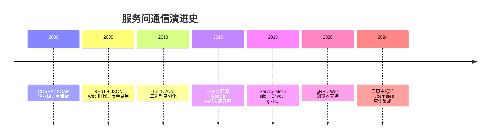

**各阶段的核心特征：**

| 时代 | 技术 | 优点 | 缺点 |
|------|------|------|------|
| 企业级 | CORBA/SOAP | 完整规范、事务支持 | 复杂、臃肿、性能差 |
| Web 时代 | REST/JSON | 简单、可读、易调试 | 无类型、性能差、无流式 |
| 大数据时代 | Thrift/Avro | 二进制、高性能 | 生态分散、工具链弱 |
| 云原生时代 | gRPC | 高性能、强类型、流式 | 浏览器支持需代理 |

### 1.2 REST API 的根本缺陷

REST 是过去十年最流行的 API 设计风格，但它有以下根本问题：

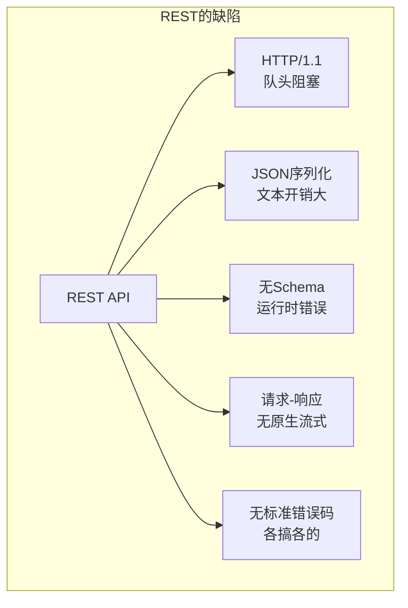

**详细分析：**

| 缺陷 | 根本原因 | 后果 |
|------|----------|------|
| **HTTP/1.1 队头阻塞** | 单连接串行请求 | 高延迟、低吞吐 |
| **JSON 文本序列化** | 人类可读优先 | 体积大、解析慢 |
| **无 Schema 约束** | 动态类型 | 运行时错误、维护困难 |
| **无原生流式** | 请求-响应模型 | 实时通信需轮询/WebSocket |
| **错误处理混乱** | 无标准规范 | 每个 API 错误格式不同 |
| **版本管理困难** | URL/Header 版本 | 兼容性难以保证 |

**HTTP/1.1 队头阻塞示例：**

```
连接1: [请求1]====>[等待响应]====>[请求2]====>[等待响应]
              ↑
              └── 请求2必须等待请求1完成

现代浏览器: 开6-8个连接并行
问题: 连接数受限、TCP慢启动重复
```

### 1.3 gRPC 的设计哲学

gRPC 的设计深受 Google 内部 Stubby 系统的影响。2015 年开源时，它要解决的核心问题：

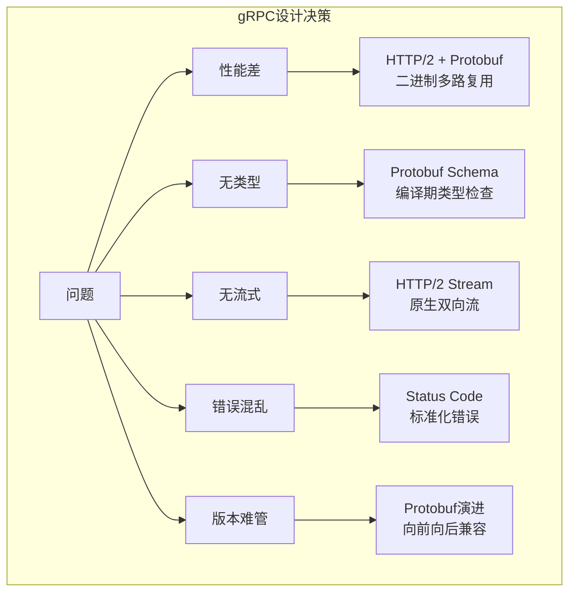

**gRPC 的核心设计决策：**

| 决策 | 根本原因 | 带来的好处 |
|------|----------|------------|
| **HTTP/2 传输** | HTTP/1.1 队头阻塞 | 多路复用、流控、头部压缩 |
| **Protobuf 序列化** | JSON 体积大、无类型 | 体积小、解析快、类型安全 |
| **Schema 优先** | REST 无契约 | 代码生成、文档即代码 |
| **四种通信模式** | REST 只有请求-响应 | 适应各种场景 |
| **标准化错误** | REST 错误混乱 | 跨语言一致的错误处理 |
| **拦截器机制** | AOP 需求 | 认证、日志、监控无侵入 |

### 1.4 gRPC 与 REST 的对比

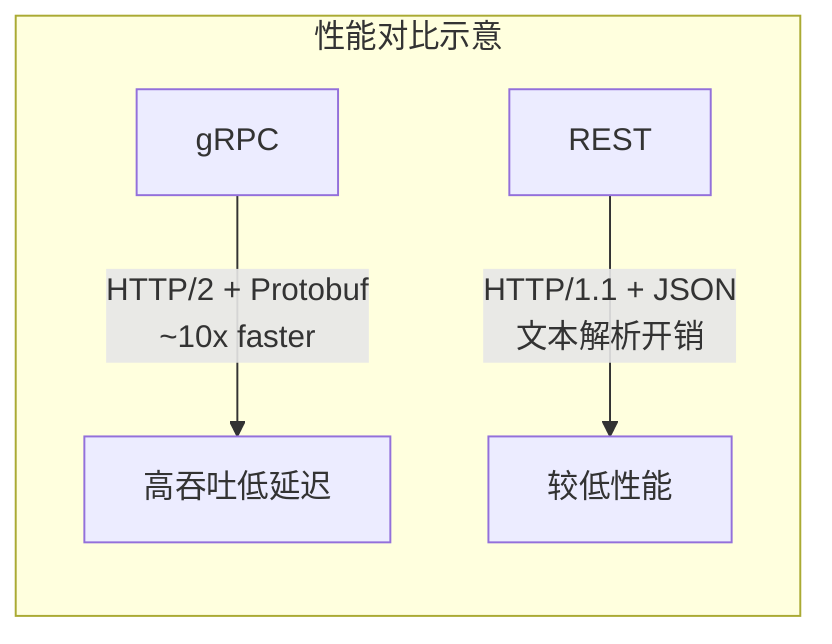

**详细对比：**

| 维度 | gRPC | REST |
|------|------|------|
| **传输协议** | HTTP/2 | HTTP/1.1（主流） |
| **序列化** | Protobuf（二进制） | JSON（文本） |
| **消息大小** | 小（2-6x 压缩） | 大 |
| **解析速度** | 快（10-100x） | 慢 |
| **类型安全** | 强（Schema 约束） | 弱（动态类型） |
| **流式通信** | 原生支持（四种模式） | 需 WebSocket/SSE |
| **浏览器支持** | 需 gRPC-Web 代理 | 原生支持 |
| **调试工具** | grpcurl、BloomRPC | curl、Postman |
| **缓存** | 需额外配置 | HTTP 缓存原生支持 |
| **可读性** | 差（二进制） | 好（文本） |

**性能基准测试：**

```
Benchmark                          Mode  Cnt      Score   Error  Units
GrpcBenchmark.pingPong            thrpt   10  450,123.4 ± 2341.2  ops/s
RestBenchmark.pingPong            thrpt   10   45,678.9 ±  892.3  ops/s
# gRPC 吞吐量约为 REST 的 10 倍

GrpcBenchmark.latency             avgt   10    234.5 ±   12.3   us/op
RestBenchmark.latency             avgt   10   1234.5 ±   45.6   us/op
# gRPC 延迟约为 REST 的 1/5
```

---

## 第二篇：HTTP/2 基础——gRPC 的传输层

### 2.1 为什么 gRPC 选择 HTTP/2？

gRPC 选择 HTTP/2 而非自定义协议，是一个关键的设计决策：

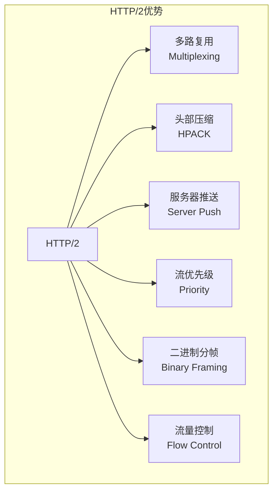

**根本原因：**

| 特性 | 解决的问题 | gRPC 的利用 |
|------|------------|-------------|
| **多路复用** | HTTP/1.1 队头阻塞 | 单个连接上并发多个 RPC |
| **头部压缩** | HTTP 头部冗余 | 减少元数据开销 |
| **流** | 无原生双向通信 | 实现四种通信模式 |
| **流量控制** | 接收方过载 | 背压机制 |
| **二进制** | 文本解析开销 | 与 Protobuf 配合 |

### 2.2 HTTP/2 核心概念

**连接、流、帧的关系：**

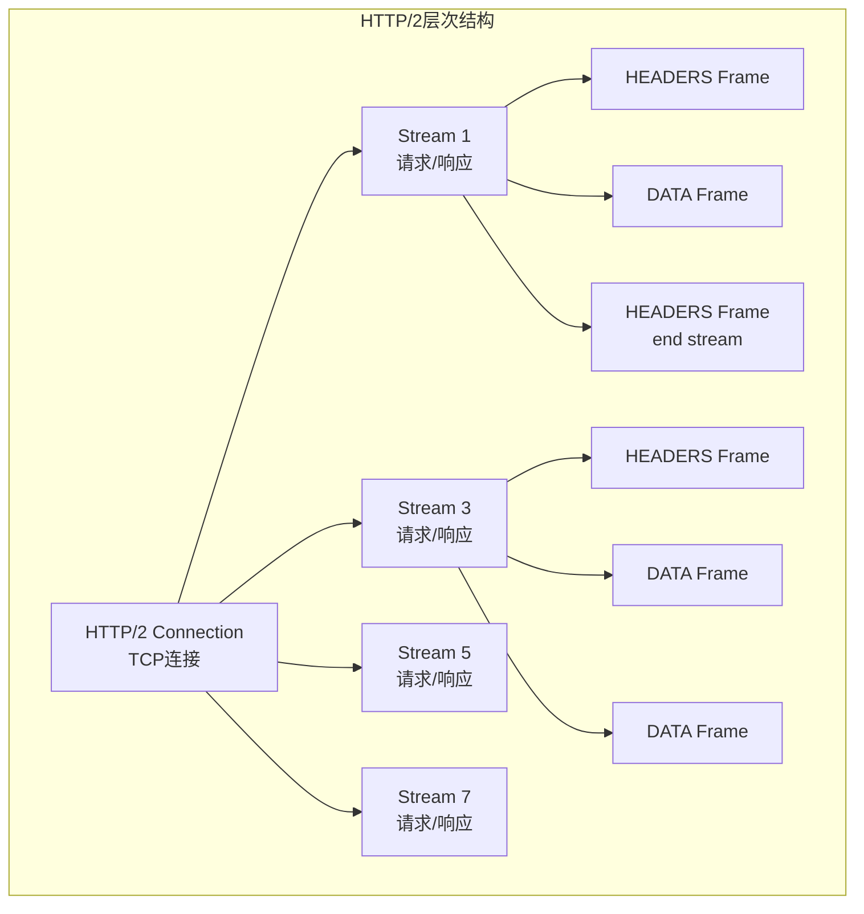

**关键概念：**

| 概念 | 说明 | 类比 |
|------|------|------|
| **Connection** | 一个 TCP 连接 | 高速公路 |
| **Stream** | 连接上的双向字节流 | 车道 |
| **Frame** | 最小通信单位 | 车辆 |
| **Message** | 完整的请求或响应 | 车队 |

**Stream 的特性：**

- 一个连接可包含多个并发 Stream
- Stream 之间相互独立，没有顺序依赖
- Stream 有优先级，可设置依赖关系
- Stream ID 奇数由客户端发起，偶数由服务器发起

### 2.3 HTTP/2 帧结构

HTTP/2 所有通信都在帧上进行，帧头部固定 9 字节：

```
 0                   1                   2                   3
 0 1 2 3 4 5 6 7 8 9 0 1 2 3 4 5 6 7 8 9 0 1 2 3 4 5 6 7 8 9 0 1
+-+-+-+-+-+-+-+-+-+-+-+-+-+-+-+-+-+-+-+-+-+-+-+-+-+-+-+-+-+-+-+-+
|                 Length (24 bits)                              |
+---------------+---------------+-------------------------------+
|   Type (8)    |   Flags (8)   |
+-+-------------+---------------+-------------------------------+
|R|                 Stream Identifier (31 bits)                 |
+=+=============================================================+
|                   Payload (Length bytes)                      |
+---------------------------------------------------------------+
```

**帧类型：**

| 类型 | 值 | 用途 |
|------|-----|------|
| HEADERS | 0x1 | 携带 HTTP 头部 |
| DATA | 0x2 | 携带实际数据 |
| SETTINGS | 0x4 | 连接配置 |
| WINDOW_UPDATE | 0x8 | 流量控制 |
| PING | 0x6 | 心跳检测 |
| GOAWAY | 0x7 | 优雅关闭 |
| RST_STREAM | 0x3 | 流终止 |

### 2.4 gRPC 在 HTTP/2 上的映射
gRPC 将 RPC 语义映射到 HTTP/2 的 Stream 上：

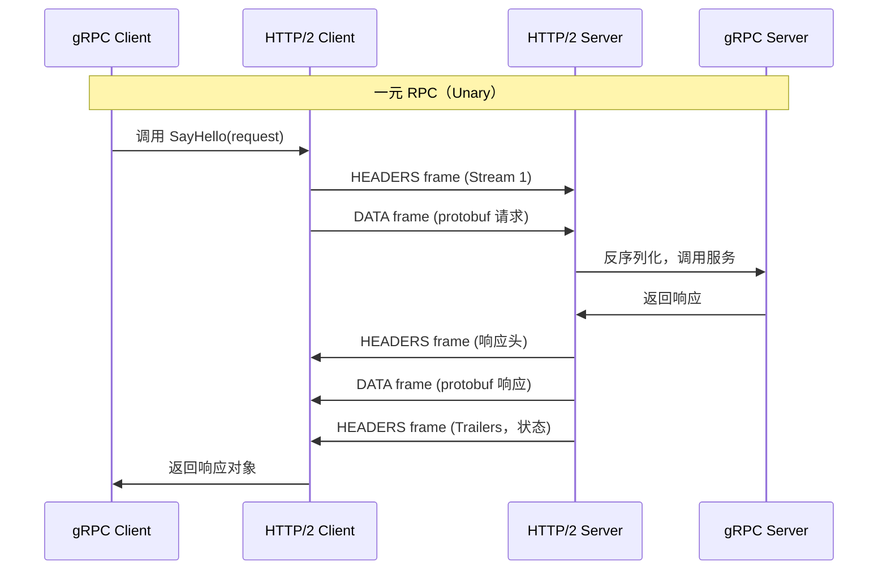

**gRPC 的 HTTP/2 头部映射：**

| gRPC 概念 | HTTP/2 表示 | 示例 |
|-----------|-------------|------|
| 方法 | `:method` | POST |
| 路径 | `:path` | `/helloworld.Greeter/SayHello` |
| 协议 | `:scheme` | http 或 https |
| 主机 | `:authority` | `api.example.com` |
| 内容类型 | `content-type` | `application/grpc` |
| 超时 | `grpc-timeout` | `10S` |
| 消息编码 | `grpc-encoding` | `gzip` |
| 状态码 | `grpc-status` | `0` (OK) |
| 状态消息 | `grpc-message` | `error details` |

---

## 第三篇：gRPC 通信模式——四种调用方式

### 3.1 一元 RPC（Unary RPC）

最简单的模式：客户端发送一个请求，服务器返回一个响应。

```protobuf
service Greeter {
    rpc SayHello (HelloRequest) returns (HelloReply);
}

message HelloRequest {
    string name = 1;
}

message HelloReply {
    string message = 1;
}
```

**Go 服务端实现：**

```go
type server struct {
    pb.UnimplementedGreeterServer
}

func (s *server) SayHello(ctx context.Context, req *pb.HelloRequest) (*pb.HelloReply, error) {
    return &pb.HelloReply{
        Message: "Hello " + req.Name,
    }, nil
}

func main() {
    lis, _ := net.Listen("tcp", ":50051")
    s := grpc.NewServer()
    pb.RegisterGreeterServer(s, &server{})
    s.Serve(lis)
}
```

**Go 客户端调用：**

```go
conn, _ := grpc.Dial("localhost:50051", grpc.WithInsecure())
defer conn.Close()

client := pb.NewGreeterClient(conn)
ctx, cancel := context.WithTimeout(context.Background(), time.Second)
defer cancel()

resp, err := client.SayHello(ctx, &pb.HelloRequest{Name: "World"})
if err != nil {
    log.Fatalf("could not greet: %v", err)
}
log.Printf("Greeting: %s", resp.Message)
```

**HTTP/2 帧流：**

```
Client -> Server:
  HEADERS (Stream 1)
    :method = POST
    :path = /helloworld.Greeter/SayHello
    content-type = application/grpc
  DATA (Stream 1, END_STREAM=false)
    <protobuf encoded HelloRequest>

Server -> Client:
  HEADERS (Stream 1)
    :status = 200
    content-type = application/grpc
  DATA (Stream 1)
    <protobuf encoded HelloReply>
  HEADERS (Stream 1, END_STREAM=true)  // Trailers
    grpc-status = 0
```

### 3.2 服务器流式 RPC（Server Streaming）

客户端发送一个请求，服务器返回多个响应（流）。

```protobuf
service StockService {
    rpc GetStockPrices (StockRequest) returns (stream StockPrice);
}

message StockRequest {
    string symbol = 1;
}

message StockPrice {
    string symbol = 1;
    double price = 2;
    int64 timestamp = 3;
}
```

**使用场景：** 实时数据推送、大列表分批返回、日志流。

**Go 服务端实现：**

```go
func (s *server) GetStockPrices(req *pb.StockRequest, stream pb.StockService_GetStockPricesServer) error {
    symbol := req.Symbol

    // 模拟实时推送价格
    for i := 0; i < 10; i++ {
        price := &pb.StockPrice{
            Symbol:    symbol,
            Price:     100.0 + float64(i),
            Timestamp: time.Now().Unix(),
        }
        if err := stream.Send(price); err != nil {
            return err
        }
        time.Sleep(time.Second)
    }
    return nil
}
```

**Go 客户端接收：**

```go
stream, _ := client.GetStockPrices(ctx, &pb.StockRequest{Symbol: "AAPL"})

for {
    price, err := stream.Recv()
    if err == io.EOF {
        break  // 流结束
    }
    if err != nil {
        log.Fatalf("error: %v", err)
    }
    log.Printf("Price: %s = $%.2f at %d", price.Symbol, price.Price, price.Timestamp)
}
```

### 3.3 客户端流式 RPC（Client Streaming）

客户端发送多个消息（流），服务器返回一个响应。

```protobuf
service FileService {
    rpc UploadFile (stream FileChunk) returns (UploadStatus);
}

message FileChunk {
    bytes data = 1;
    int64 offset = 2;
}

message UploadStatus {
    bool success = 1;
    string message = 2;
    int64 bytes_received = 3;
}
```

**使用场景：** 文件上传、批量数据导入、流式数据处理。

**Go 服务端实现：**

```go
func (s *server) UploadFile(stream pb.FileService_UploadFileServer) error {
    var totalBytes int64

    for {
        chunk, err := stream.Recv()
        if err == io.EOF {
            // 客户端发送完毕，返回响应
            return stream.SendAndClose(&pb.UploadStatus{
                Success:        true,
                Message:        "Upload complete",
                BytesReceived: totalBytes,
            })
        }
        if err != nil {
            return err
        }

        // 处理数据块
        totalBytes += int64(len(chunk.Data))
        // 写入文件或处理...
    }
}
```

**Go 客户端发送：**

```go
stream, _ := client.UploadFile(ctx)

// 分块发送文件
buffer := make([]byte, 1024)
for offset := int64(0); ; offset += int64(len(buffer)) {
    n, err := file.Read(buffer)
    if err == io.EOF {
        break
    }

    stream.Send(&pb.FileChunk{
        Data:   buffer[:n],
        Offset: offset,
    })
}

status, err := stream.CloseAndRecv()
log.Printf("Upload status: %v", status)
```

### 3.4 双向流式 RPC（Bidirectional Streaming）

客户端和服务器都可以独立地发送多个消息。

```protobuf
service ChatService {
    rpc Chat (stream ChatMessage) returns (stream ChatMessage);
}

message ChatMessage {
    string user = 1;
    string text = 2;
    int64 timestamp = 3;
}
```

**使用场景：** 实时聊天、协同编辑、游戏状态同步、实时控制。

**Go 服务端实现：**

```go
func (s *server) Chat(stream pb.ChatService_ChatServer) error {
    // 启动 goroutine 接收消息
    go func() {
        for {
            msg, err := stream.Recv()
            if err == io.EOF {
                return
            }
            if err != nil {
                log.Printf("recv error: %v", err)
                return
            }
            log.Printf("[%s] %s", msg.User, msg.Text)
        }
    }()

    // 发送消息
    for i := 0; i < 10; i++ {
        stream.Send(&pb.ChatMessage{
            User:      "Server",
            Text:      fmt.Sprintf("Message %d", i),
            Timestamp: time.Now().Unix(),
        })
        time.Sleep(time.Second)
    }

    return nil
}
```

**Go 客户端实现：**

```go
stream, _ := client.Chat(ctx)

// 发送 goroutine
go func() {
    scanner := bufio.NewScanner(os.Stdin)
    for scanner.Scan() {
        stream.Send(&pb.ChatMessage{
            User:      "Client",
            Text:      scanner.Text(),
            Timestamp: time.Now().Unix(),
        })
    }
}()

// 接收
for {
    msg, err := stream.Recv()
    if err == io.EOF {
        break
    }
    if err != nil {
        log.Fatalf("recv error: %v", err)
    }
    log.Printf("[%s] %s", msg.User, msg.Text)
}
```

### 3.5 四种模式对比

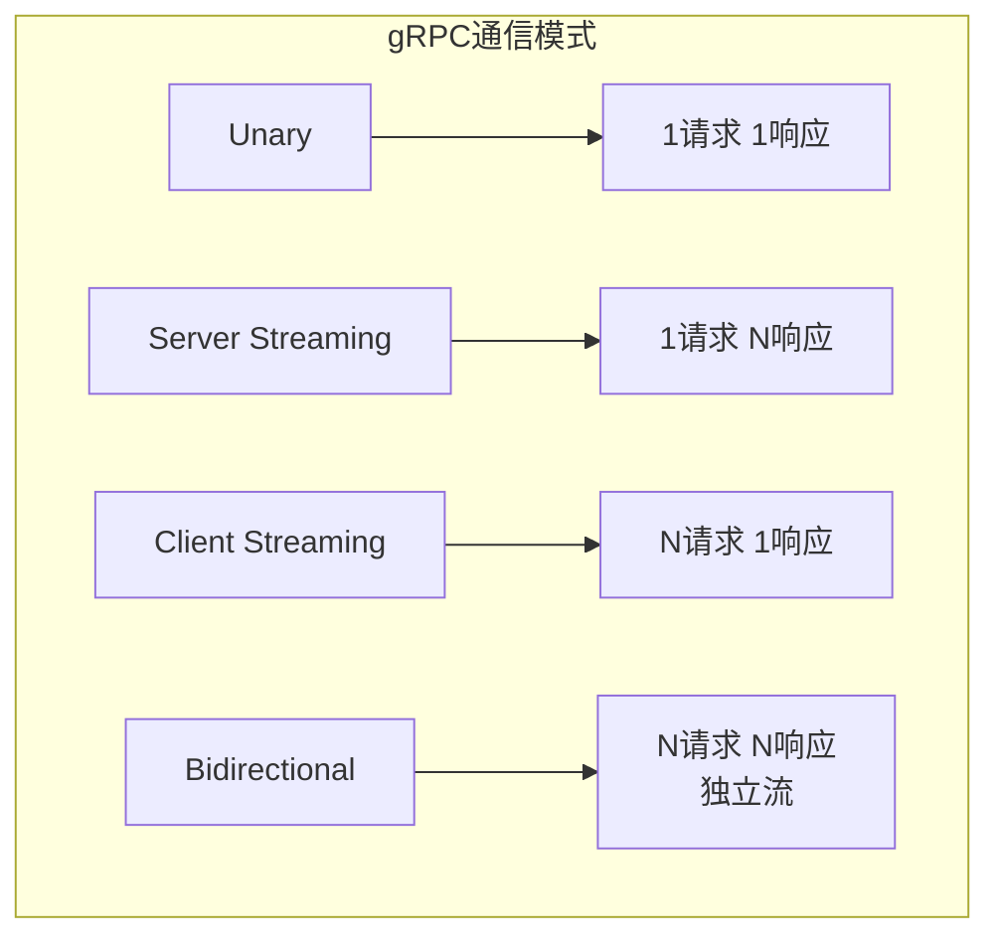

| 模式 | 使用场景 | HTTP/2 特性 |
|------|----------|-------------|
| Unary | 普通 API 调用 | 单个 Stream，半双工 |
| Server Streaming | 实时推送、大结果分批 | 服务器发送多个 DATA 帧 |
| Client Streaming | 文件上传、批量导入 | 客户端发送多个 DATA 帧 |
| Bidirectional | 聊天、游戏、实时控制 | 全双工 Stream |

---

## 第四篇：gRPC 核心机制深度解析

### 4.1 连接管理

gRPC 连接是基于 HTTP/2 的长连接，需要仔细管理。

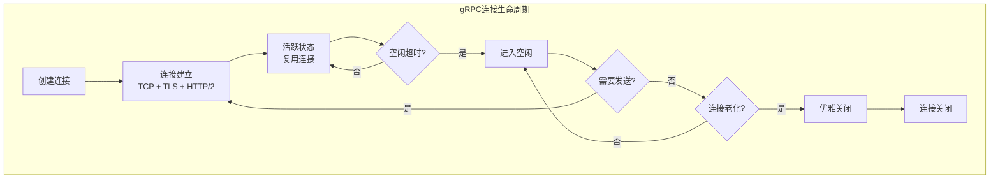

**连接状态：**

| 状态 | 说明 | 转换条件 |
|------|------|----------|
| IDLE | 空闲，无活跃 RPC | 初始状态或空闲超时 |
| CONNECTING | 正在建立连接 | 从 IDLE 发起 RPC |
| READY | 连接就绪，可发送 RPC | 连接建立成功 |
| TRANSIENT_FAILURE | 临时失败，正在重连 | 连接断开 |
| SHUTDOWN | 正在关闭 | 调用 Close() |

**Go 客户端连接配置：**

```go
conn, err := grpc.Dial(
    "localhost:50051",
    grpc.WithTransportCredentials(credentials.NewClientTLSFromCert(nil, "")),
    grpc.WithKeepaliveParams(keepalive.ClientParameters{
        Time:                10 * time.Second,  // 发送 keepalive 间隔
        Timeout:             3 * time.Second,   // keepalive 超时
        PermitWithoutStream: true,              // 无活跃 RPC 也发送
    }),
    grpc.WithDefaultServiceConfig(`{
        "loadBalancingPolicy": "round_robin",
        "healthCheckConfig": {"serviceName": ""}
    }`),
)
```

### 4.2 负载均衡
gRPC 内置多种负载均衡策略：

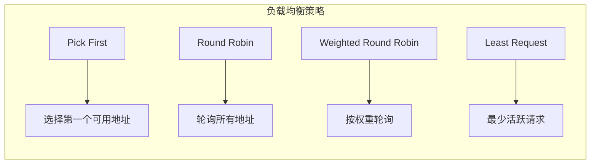

**配置方式：**

```go
// 使用服务配置
conn, _ := grpc.Dial(
    "dns:///example.com",
    grpc.WithDefaultServiceConfig(`{
        "loadBalancingConfig": [{"round_robin": {}}]
    }`),
)
```

**Name Resolution：**

gRPC 支持多种名称解析机制：

| 方案 | 说明 |
|------|------|
| DNS | 默认，支持 SRV 记录 |
| Consul | 服务发现集成 |
| etcd | 服务发现集成 |
| Kubernetes | Headless Service |
| Static | 静态地址列表 |

### 4.3 重试与超时

gRPC 提供了细粒度的重试和超时控制。

**超时（Deadline）：**

```go
// 客户端设置超时
ctx, cancel := context.WithTimeout(context.Background(), 3*time.Second)
defer cancel()

resp, err := client.SayHello(ctx, req)

// 服务端检查超时
func (s *server) SayHello(ctx context.Context, req *pb.HelloRequest) (*pb.HelloReply, error) {
    select {
    case <-ctx.Done():
        return nil, status.Error(codes.DeadlineExceeded, "timeout")
    default:
        // 处理请求
    }
}
```

**重试配置：**

```go
conn, _ := grpc.Dial(
    "localhost:50051",
    grpc.WithDefaultServiceConfig(`{
        "methodConfig": [{
            "name": [{"service": "helloworld.Greeter"}],
            "retryPolicy": {
                "maxAttempts": 4,
                "initialBackoff": "0.1s",
                "maxBackoff": "1s",
                "backoffMultiplier": 2,
                "retryableStatusCodes": ["UNAVAILABLE"]
            }
        }]
    }`),
)
```

**退避策略（Backoff）：**

```
第1次重试: 0.1s + jitter
第2次重试: 0.2s + jitter
第3次重试: 0.4s + jitter
第4次重试: 0.8s + jitter
...
直到 maxBackoff
```

### 4.4 拦截器（Interceptor）

拦截器是 gRPC 的 AOP 机制，用于实现横切关注点。

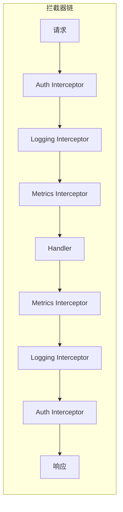

**一元拦截器：**

```go
func unaryInterceptor(ctx context.Context, req interface{}, info *grpc.UnaryServerInfo, handler grpc.UnaryHandler) (interface{}, error) {
    // 前置处理
    start := time.Now()
    log.Printf("Method: %s, Request: %v", info.FullMethod, req)

    // 调用 handler
    resp, err := handler(ctx, req)

    // 后置处理
    log.Printf("Method: %s, Duration: %v, Error: %v", info.FullMethod, time.Since(start), err)
    return resp, err
}

// 注册
server := grpc.NewServer(grpc.UnaryInterceptor(unaryInterceptor))
```

**流拦截器：**

```go
func streamInterceptor(srv interface{}, ss grpc.ServerStream, info *grpc.StreamServerInfo, handler grpc.StreamHandler) error {
    wrapped := &wrappedStream{ServerStream: ss}
    return handler(srv, wrapped)
}

type wrappedStream struct {
    grpc.ServerStream
}

func (w *wrappedStream) RecvMsg(m interface{}) error {
    log.Printf("Receive message: %T", m)
    return w.ServerStream.RecvMsg(m)
}

func (w *wrappedStream) SendMsg(m interface{}) error {
    log.Printf("Send message: %T", m)
    return w.ServerStream.SendMsg(m)
}
```

**常见拦截器用途：**

| 用途 | 实现内容 |
|------|----------|
| 认证 | JWT/OAuth2 验证 |
| 日志 | 请求/响应日志 |
| 监控 | Prometheus 指标 |
| 追踪 | OpenTelemetry/Jaeger |
| 限流 | 令牌桶/漏桶算法 |
| 熔断 | 失败率阈值触发 |

### 4.5 错误处理

gRPC 使用状态码（Status Code）标准化错误处理。

**状态码分类：**

| 类别 | 状态码 | 说明 | 是否重试 |
|------|--------|------|----------|
| 成功 | OK (0) | 成功 | - |
| 客户端错误 | CANCELLED (1) | 调用方取消 | 否 |
| | INVALID_ARGUMENT (3) | 参数错误 | 否 |
| | NOT_FOUND (5) | 资源不存在 | 否 |
| | ALREADY_EXISTS (6) | 资源已存在 | 否 |
| | PERMISSION_DENIED (7) | 权限不足 | 否 |
| | UNAUTHENTICATED (16) | 未认证 | 否 |
| 服务器错误 | DEADLINE_EXCEEDED (4) | 超时 | 是 |
| | RESOURCE_EXHAUSTED (8) | 资源耗尽 | 是 |
| | FAILED_PRECONDITION (9) | 前置条件失败 | 否 |
| | ABORTED (10) | 操作中止 | 是 |
| | UNAVAILABLE (14) | 服务不可用 | 是 |
| 系统错误 | INTERNAL (13) | 内部错误 | 否 |
| | UNIMPLEMENTED (12) | 未实现 | 否 |
| | UNKNOWN (2) | 未知错误 | 否 |

**错误详情（Error Details）：**

```go
import "google.golang.org/genproto/googleapis/rpc/errdetails"

func (s *server) Withdraw(ctx context.Context, req *pb.WithdrawRequest) (*pb.WithdrawResponse, error) {
    if req.Amount > s.balance {
        st := status.New(codes.FailedPrecondition, "insufficient balance")
        ds, _ := st.WithDetails(&errdetails.BadRequest{
            FieldViolations: []*errdetails.BadRequest_FieldViolation{
                {
                    Field:       "amount",
                    Description: fmt.Sprintf("balance only %d, requested %d", s.balance, req.Amount),
                },
            },
        })
        return nil, ds.Err()
    }
    // ...
}

// 客户端解析错误详情
if s, ok := status.FromError(err); ok {
    log.Printf("Status code: %v", s.Code())
    log.Printf("Message: %v", s.Message())
    for _, detail := range s.Details() {
        if br, ok := detail.(*errdetails.BadRequest); ok {
            for _, v := range br.FieldViolations {
                log.Printf("Field: %s, Description: %s", v.Field, v.Description)
            }
        }
    }
}
```

---

## 第五篇：安全与认证

### 5.1 TLS 加密

gRPC 内置 TLS 支持，确保传输安全。

**服务端配置：**

```go
// 加载证书
creds, err := credentials.NewServerTLSFromFile("server.crt", "server.key")
if err != nil {
    log.Fatalf("Failed to load credentials: %v", err)
}

server := grpc.NewServer(grpc.Creds(creds))
```

**客户端配置：**

```go
// 方式1：使用系统 CA
creds := credentials.NewClientTLSFromCert(nil, "")
conn, err := grpc.Dial("localhost:50051", grpc.WithTransportCredentials(creds))

// 方式2：使用自定义 CA
caCert, _ := os.ReadFile("ca.crt")
caCertPool := x509.NewCertPool()
caCertPool.AppendCertsFromPEM(caCert)
creds := credentials.NewTLS(&tls.Config{
    RootCAs:    caCertPool,
    ServerName: "server.example.com",
})
conn, err := grpc.Dial("localhost:50051", grpc.WithTransportCredentials(creds))
```

**mTLS（双向 TLS）：**

```go
// 服务端 mTLS
certificate, _ := tls.LoadX509KeyPair("server.crt", "server.key")
caCert, _ := os.ReadFile("ca.crt")
caCertPool := x509.NewCertPool()
caCertPool.AppendCertsFromPEM(caCert)

tlsConfig := &tls.Config{
    Certificates: []tls.Certificate{certificate},
    ClientCAs:    caCertPool,
    ClientAuth:   tls.RequireAndVerifyClientCert,
}
creds := credentials.NewTLS(tlsConfig)
server := grpc.NewServer(grpc.Creds(creds))
```

### 5.2 认证拦截器

基于 Token 的认证是最常见的方案。

```go
// 定义认证接口
type AuthInterceptor struct {
    validator func(ctx context.Context, token string) (*User, error)
}

func (a *AuthInterceptor) Unary() grpc.UnaryServerInterceptor {
    return func(ctx context.Context, req interface{}, info *grpc.UnaryServerInfo, handler grpc.UnaryHandler) (interface{}, error) {
        // 跳过公开方法
        if isPublicMethod(info.FullMethod) {
            return handler(ctx, req)
        }

        // 提取 token
        token, err := extractToken(ctx)
        if err != nil {
            return nil, status.Error(codes.Unauthenticated, err.Error())
        }

        // 验证 token
        user, err := a.validator(ctx, token)
        if err != nil {
            return nil, status.Error(codes.Unauthenticated, "invalid token")
        }

        // 将用户信息注入 context
        ctx = context.WithValue(ctx, userKey{}, user)
        return handler(ctx, req)
    }
}

func extractToken(ctx context.Context) (string, error) {
    md, ok := metadata.FromIncomingContext(ctx)
    if !ok {
        return "", fmt.Errorf("missing metadata")
    }
    auth := md.Get("authorization")
    if len(auth) == 0 {
        return "", fmt.Errorf("missing authorization header")
    }
    const prefix = "Bearer "
    if !strings.HasPrefix(auth[0], prefix) {
        return "", fmt.Errorf("invalid authorization format")
    }
    return strings.TrimPrefix(auth[0], prefix), nil
}
```

**客户端发送 Token：**

```go
// 方式1：每次调用
ctx := metadata.AppendToOutgoingContext(context.Background(), "authorization", "Bearer "+token)
resp, err := client.SayHello(ctx, req)

// 方式2：使用拦截器自动添加
conn, _ := grpc.Dial(
    "localhost:50051",
    grpc.WithUnaryInterceptor(authInterceptor(token)),
)
```

---

## 第六篇：服务治理与可观测性

### 6.1 健康检查

gRPC 定义了标准的健康检查协议。

```protobuf
syntax = "proto3";

package grpc.health.v1;

message HealthCheckRequest {
    string service = 1;
}

message HealthCheckResponse {
    enum ServingStatus {
        UNKNOWN = 0;
        SERVING = 1;
        NOT_SERVING = 2;
        SERVICE_UNKNOWN = 3;  // Used only by the Watch method.
    }
    ServingStatus status = 1;
}

service Health {
    rpc Check(HealthCheckRequest) returns (HealthCheckResponse);
    rpc Watch(HealthCheckRequest) returns (stream HealthCheckResponse);
}
```

**Go 实现：**

```go
import "google.golang.org/grpc/health"
import "google.golang.org/grpc/health/grpc_health_v1"

// 创建健康检查服务
healthSrv := health.NewServer()
grpc_health_v1.RegisterHealthServer(server, healthSrv)

// 设置服务状态
healthSrv.SetServingStatus("my.service", grpc_health_v1.HealthCheckResponse_SERVING)
healthSrv.SetServingStatus("", grpc_health_v1.HealthCheckResponse_SERVING)  // 整体状态
```

### 6.2 监控指标

使用 Prometheus 收集 gRPC 指标。

```go
import "github.com/grpc-ecosystem/go-grpc-middleware/providers/prometheus"

// 创建监控器
srvMetrics := prometheus.NewServerMetrics()

// 注册拦截器
server := grpc.NewServer(
    grpc.UnaryInterceptor(srvMetrics.UnaryServerInterceptor()),
    grpc.StreamInterceptor(srvMetrics.StreamServerInterceptor()),
)

// 注册 Prometheus 指标
prometheus.MustRegister(srvMetrics)

// 暴露 HTTP 端点
http.Handle("/metrics", promhttp.Handler())
http.ListenAndServe(":9090", nil)
```

**关键指标：**

| 指标 | 说明 |
|------|------|
| `grpc_server_started_total` | 开始处理的 RPC 总数 |
| `grpc_server_handled_total` | 处理完成的 RPC 总数 |
| `grpc_server_msg_received_total` | 接收的消息总数 |
| `grpc_server_msg_sent_total` | 发送的消息总数 |
| `grpc_server_handling_seconds` | RPC 处理耗时分布 |

### 6.3 分布式追踪

使用 OpenTelemetry 实现分布式追踪。

```go
import (
    "go.opentelemetry.io/contrib/instrumentation/google.golang.org/grpc/otelgrpc"
    "go.opentelemetry.io/otel"
)

// 初始化 Tracer
ctx := context.Background()
exp, _ := otlptracegrpc.New(ctx, otlptracegrpc.WithEndpoint("localhost:4317"))
tp := trace.NewTracerProvider(trace.WithBatcher(exp))
otel.SetTracerProvider(tp)

// 服务端注册
server := grpc.NewServer(
    grpc.UnaryInterceptor(otelgrpc.UnaryServerInterceptor()),
    grpc.StreamInterceptor(otelgrpc.StreamServerInterceptor()),
)

// 客户端注册
conn, _ := grpc.Dial(
    "localhost:50051",
    grpc.WithUnaryInterceptor(otelgrpc.UnaryClientInterceptor()),
    grpc.WithStreamInterceptor(otelgrpc.StreamClientInterceptor()),
)
```

**追踪效果：**

```
Trace: abc123
├── Span: Client Call (100ms)
│   ├── Span: DNS Lookup (5ms)
│   ├── Span: TCP Connect (10ms)
│   ├── Span: TLS Handshake (20ms)
│   └── Span: gRPC Request (65ms)
│       └── Span: Server Handler (50ms)
│           ├── Span: Auth Check (5ms)
│           ├── Span: Database Query (30ms)
│           └── Span: Response Encode (5ms)
```

### 6.4 熔断与限流

**熔断器实现：**

```go
type CircuitBreaker struct {
    failureThreshold int
    successThreshold int
    timeout          time.Duration

    state          State
    failures       int
    successes      int
    lastFailureTime time.Time
    mu             sync.Mutex
}

type State int

const (
    StateClosed State = iota    // 正常
    StateOpen                   // 熔断
    StateHalfOpen               // 半开
)

func (cb *CircuitBreaker) Call(ctx context.Context, fn func() error) error {
    cb.mu.Lock()
    state := cb.state
    cb.mu.Unlock()

    if state == StateOpen {
        if time.Since(cb.lastFailureTime) > cb.timeout {
            cb.mu.Lock()
            cb.state = StateHalfOpen
            cb.mu.Unlock()
        } else {
            return errors.New("circuit breaker is open")
        }
    }

    err := fn()

    cb.mu.Lock()
    defer cb.mu.Unlock()

    if err != nil {
        cb.failures++
        cb.successes = 0
        cb.lastFailureTime = time.Now()

        if cb.failures >= cb.failureThreshold {
            cb.state = StateOpen
        }
        return err
    }

    cb.successes++
    if cb.state == StateHalfOpen && cb.successes >= cb.successThreshold {
        cb.state = StateClosed
        cb.failures = 0
    }

    return nil
}
```

---

## 第七篇：gRPC-Web 与浏览器支持

### 7.1 为什么需要 gRPC-Web？

浏览器无法直接使用 gRPC，原因：

1. **HTTP/2 控制**：浏览器对 HTTP/2 的控制有限，无法直接操作 Stream
2. **强制 TLS**：浏览器要求 gRPC 使用 TLS，且证书必须受信任
3. **CORS 限制**：跨域请求需要服务器支持

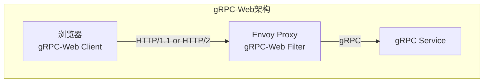

### 7.2 gRPC-Web 协议

gRPC-Web 有两种模式：

| 模式 | 说明 | 使用场景 |
|------|------|----------|
| **grpc-web** | 基于二进制帧 | 支持 HTTP/2 的环境 |
| **grpc-web-text** | Base64 编码 | 只支持 HTTP/1.1 的环境 |

**浏览器客户端：**

```javascript
import { grpc } from '@improbable-eng/grpc-web';
import { Greeter } from './generated/helloworld_pb_service';
import { HelloRequest } from './generated/helloworld_pb';

const request = new HelloRequest();
request.setName('World');

grpc.invoke(Greeter.SayHello, {
    request: request,
    host: 'http://localhost:8080',
    onMessage: (response) => {
        console.log(response.getMessage());
    },
    onEnd: (code, msg, trailers) => {
        if (code !== grpc.Code.OK) {
            console.error('Error:', msg);
        }
    }
});
```

**Envoy 配置：**

```yaml
static_resources:
  listeners:
  - name: listener_0
    address:
      socket_address: { address: 0.0.0.0, port_value: 8080 }
    filter_chains:
    - filters:
      - name: envoy.filters.network.http_connection_manager
        typed_config:
          "@type": type.googleapis.com/envoy.extensions.filters.network.http_connection_manager.v3.HttpConnectionManager
          codec_type: AUTO
          stat_prefix: ingress_http
          route_config:
            name: local_route
            virtual_hosts:
            - name: local_service
              domains: ["*"]
              routes:
              - match: { prefix: "/" }
                route:
                  cluster: greeter_service
                  timeout: 0s
                  max_stream_duration:
                    grpc_timeout_header_max: 0s
          http_filters:
          - name: envoy.filters.http.grpc_web
          - name: envoy.filters.http.cors
          - name: envoy.filters.http.router

  clusters:
  - name: greeter_service
    connect_timeout: 0.25s
    type: LOGICAL_DNS
    http2_protocol_options: {}
    lb_policy: ROUND_ROBIN
    load_assignment:
      cluster_name: greeter_service
      endpoints:
      - lb_endpoints:
        - endpoint:
            address:
              socket_address:
                address: localhost
                port_value: 50051
```

---

## 第八篇：生产环境最佳实践

### 8.1 连接池配置

```go
// 合理的连接配置
conn, err := grpc.Dial(
    "localhost:50051",
    grpc.WithDefaultServiceConfig(`{
        "loadBalancingConfig": [{"round_robin": {}}],
        "healthCheckConfig": {"serviceName": ""}
    }`),
    grpc.WithKeepaliveParams(keepalive.ClientParameters{
        Time:                10 * time.Second,
        Timeout:             3 * time.Second,
        PermitWithoutStream: true,
    }),
    grpc.WithDefaultCallOptions(
        grpc.MaxCallRecvMsgSize(10*1024*1024),  // 10MB
        grpc.MaxCallSendMsgSize(10*1024*1024),
    ),
)
```

### 8.2 优雅关闭

```go
// 服务端优雅关闭
func main() {
    lis, _ := net.Listen("tcp", ":50051")
    server := grpc.NewServer()
    pb.RegisterGreeterServer(server, &server{})

    // 启动服务
    go func() {
        if err := server.Serve(lis); err != nil {
            log.Fatalf("failed to serve: %v", err)
        }
    }()

    // 等待中断信号
    sigCh := make(chan os.Signal, 1)
    signal.Notify(sigCh, os.Interrupt, syscall.SIGTERM)
    <-sigCh

    log.Println("shutting down gracefully...")
    server.GracefulStop()  // 等待现有 RPC 完成
    log.Println("server stopped")
}
```

### 8.3 错误处理最佳实践

```go
// 定义业务错误码
const (
    ErrCodeUserNotFound = 1001
    ErrCodeInvalidInput = 1002
    ErrCodeInsufficientBalance = 1003
)

// 包装错误
func wrapError(err error, code int, msg string) error {
    st := status.New(codes.Internal, msg)
    ds, _ := st.WithDetails(&pb.ErrorDetail{
        Code:    int32(code),
        Message: err.Error(),
    })
    return ds.Err()
}

// 客户端解析
func handleError(err error) {
    if s, ok := status.FromError(err); ok {
        switch s.Code() {
        case codes.NotFound:
            // 处理 404
        case codes.InvalidArgument:
            // 处理 400
        case codes.Internal:
            // 解析业务错误码
            for _, detail := range s.Details() {
                if ed, ok := detail.(*pb.ErrorDetail); ok {
                    handleBusinessError(int(ed.Code))
                }
            }
        }
    }
}
```

### 8.4 测试策略

**单元测试：**

```go
func TestSayHello(t *testing.T) {
    // 创建内存服务器
    srv := grpc.NewServer()
    pb.RegisterGreeterServer(srv, &server{})

    buf := &bufconn.Listener{}
    go func() {
        if err := srv.Serve(buf); err != nil {
            t.Errorf("Server exited with error: %v", err)
        }
    }()
    defer srv.Stop()

    // 创建客户端
    ctx := context.Background()
    conn, _ := grpc.DialContext(ctx, "bufnet",
        grpc.WithContextDialer(func(context.Context, string) (net.Conn, error) {
            return buf.Dial()
        }),
        grpc.WithInsecure(),
    )
    defer conn.Close()

    client := pb.NewGreeterClient(conn)

    // 测试
    resp, err := client.SayHello(ctx, &pb.HelloRequest{Name: "Test"})
    if err != nil {
        t.Fatalf("SayHello failed: %v", err)
    }
    if resp.Message != "Hello Test" {
        t.Errorf("unexpected message: %v", resp.Message)
    }
}
```

**集成测试：**

```go
func TestIntegration(t *testing.T) {
    // 启动真实服务器（或使用 testcontainers）
    ctx := context.Background()
    req := testcontainers.ContainerRequest{
        Image:        "my-grpc-service:latest",
        ExposedPorts: []string{"50051/tcp"},
        WaitingFor:   wait.ForListeningPort("50051/tcp"),
    }
    container, _ := testcontainers.GenericContainer(ctx, testcontainers.GenericContainerRequest{
        ContainerRequest: req,
        Started:          true,
    })
    defer container.Terminate(ctx)

    host, _ := container.Host(ctx)
    port, _ := container.MappedPort(ctx, "50051")

    conn, _ := grpc.Dial(fmt.Sprintf("%s:%s", host, port.Port()), grpc.WithInsecure())
    client := pb.NewGreeterClient(conn)

    // 执行测试...
}
```

---

## 附录：速查手册

### A. gRPC 状态码速查

| 状态码 | 数值 | 含义 | 重试建议 |
|--------|------|------|----------|
| OK | 0 | 成功 | - |
| CANCELLED | 1 | 取消 | 否 |
| UNKNOWN | 2 | 未知 | 否 |
| INVALID_ARGUMENT | 3 | 参数错误 | 否 |
| DEADLINE_EXCEEDED | 4 | 超时 | 是 |
| NOT_FOUND | 5 | 未找到 | 否 |
| ALREADY_EXISTS | 6 | 已存在 | 否 |
| PERMISSION_DENIED | 7 | 权限不足 | 否 |
| RESOURCE_EXHAUSTED | 8 | 资源耗尽 | 是 |
| FAILED_PRECONDITION | 9 | 前置条件失败 | 否 |
| ABORTED | 10 | 中止 | 是 |
| OUT_OF_RANGE | 11 | 超出范围 | 否 |
| UNIMPLEMENTED | 12 | 未实现 | 否 |
| INTERNAL | 13 | 内部错误 | 否 |
| UNAVAILABLE | 14 | 不可用 | 是 |
| DATA_LOSS | 15 | 数据丢失 | 否 |
| UNAUTHENTICATED | 16 | 未认证 | 否 |

### B. 常用拦截器链顺序

```
1. Recovery (恢复 panic)
2. Logging (日志)
3. Metrics (监控)
4. Tracing (追踪)
5. Auth (认证)
6. Rate Limit (限流)
7. Circuit Breaker (熔断)
8. Validator (验证)
9. Handler (业务逻辑)
```

### C. 性能调优检查清单

| 检查项 | 建议 |
|--------|------|
| 连接复用 | 使用长连接，避免频繁创建 |
| 消息大小 | 设置合理的 MaxRecvMsgSize |
| 超时设置 | 始终设置 Deadline |
| 流控窗口 | 根据带宽延迟积调整 |
| Keepalive | 配置合理的 keepalive 参数 |
| 负载均衡 | 使用 round_robin 或 least_request |
| 压缩 | 对大消息启用 gzip |
| 批处理 | 小消息考虑批量发送 |
