# 计算机网络协议发展史：从电报时代到量子网络的技术演进

> 深度解析从最早的通信协议到现代互联网体系结构，探索网络协议如何塑造数字文明

## 一、引言：协议的魔力

协议，这个看似简单的概念，却是人类通信史上最伟大的发明之一。从古代的烽火报警到现代的量子加密通信，协议一直在推动着人类信息交流方式的革命。计算机网络协议不仅是技术规范，更是数字世界的通用语言，它让全球数十亿设备能够无缝协作，构建了我们今天所依赖的互联网生态系统。

## 二、网络协议的起源：电报与早期通信

### 2.1 电报时代的协议雏形

早在计算机网络出现之前，电报系统已经建立了最早的通信协议：

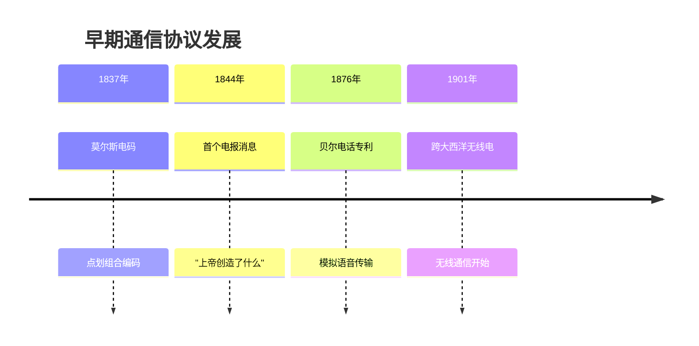

**莫尔斯电码的协议特性**：
- **编码标准**：统一的字符到信号映射
- **时序控制**：点、划、字符间、单词间的标准间隔
- **错误处理**：重复发送重要信息
- **会话管理**：开始信号、结束信号、确认机制

### 2.2 电话网络的电路交换

电话系统建立了电路交换的基本模式：

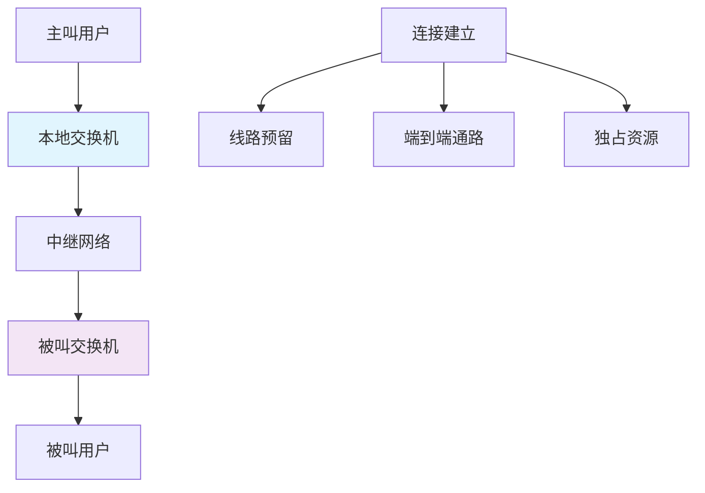

电路交换的特点为后来的分组交换提供了重要的对比基础。

## 三、ARPANET与分组交换革命

### 3.1 分组交换的诞生

1960年代，分组交换技术的出现彻底改变了网络通信模式：


**分组交换 vs 电路交换的关键优势**：

| 特性 | 电路交换 | 分组交换 |
|------|----------|----------|
| 资源利用 | 独占式，效率低 | 共享式，效率高 |
| 延迟特性 | 固定延迟 | 可变延迟 |
| 错误恢复 | 困难 | 内置重传机制 |
| 扩展性 | 有限 | 极好 |

### 3.2 ARPANET的协议栈

ARPANET定义了现代网络协议栈的雏形：

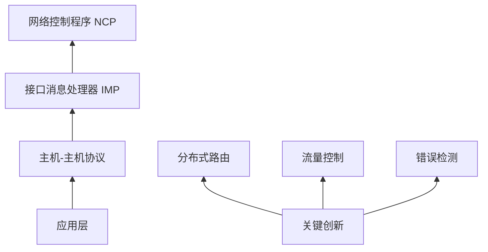

## 四、TCP/IP协议族的崛起

### 4.1 四层模型的确立

TCP/IP协议栈定义了现代互联网的基础架构：

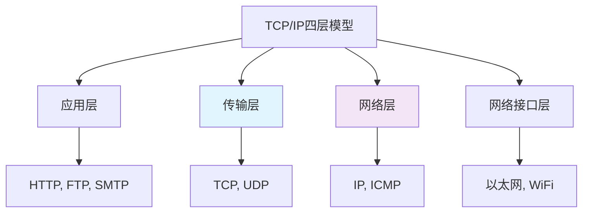

### 4.2 IP协议的演进历程

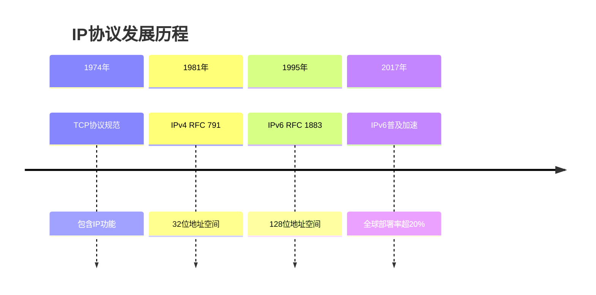

**IPv4 vs IPv6关键差异**：

| 特性 | IPv4 | IPv6 |
|------|------|------|
| 地址长度 | 32位（43亿） | 128位（3.4×10³⁸） |
| 地址表示 | 点分十进制 | 冒号分隔十六进制 |
| 头部大小 | 20-60字节 | 40字节固定 |
| QoS支持 | 有限 | 流标签字段 |
| 安全性 | IPsec可选 | IPsec内置 |

### 4.3 TCP协议的核心机制

TCP通过复杂的机制保证可靠传输：

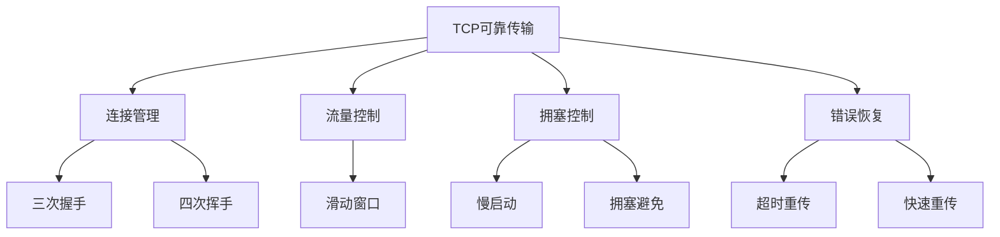

**TCP拥塞控制算法演进**：

```python
class TCPCongestionControl:
    """TCP拥塞控制算法模拟"""
    
    def __init__(self):
        self.cwnd = 1  # 拥塞窗口
        self.ssthresh = 65535  # 慢启动阈值
        self.algorithm = "Tahoe"  # 初始算法
    
    def tahoe_algorithm(self, event):
        """Tahoe算法：基础拥塞控制"""
        if event == "ACK":
            if self.cwnd < self.ssthresh:
                self.cwnd *= 2  # 慢启动阶段
            else:
                self.cwnd += 1  # 拥塞避免阶段
        elif event == "Timeout":
            self.ssthresh = max(self.cwnd // 2, 2)
            self.cwnd = 1
            self.algorithm = "Tahoe"
    
    def reno_algorithm(self, event):
        """Reno算法：快速恢复改进"""
        if event == "ACK":
            # 与Tahoe相同的增长逻辑
            pass
        elif event == "3_Dup_ACK":  # 三个重复ACK
            self.ssthresh = max(self.cwnd // 2, 2)
            self.cwnd = self.ssthresh + 3  # 快速恢复
            self.algorithm = "Reno-Fast-Recovery"
```

## 五、应用层协议的繁荣发展

### 5.1 HTTP协议的演进

HTTP协议从简单文档传输发展为现代Web应用平台：

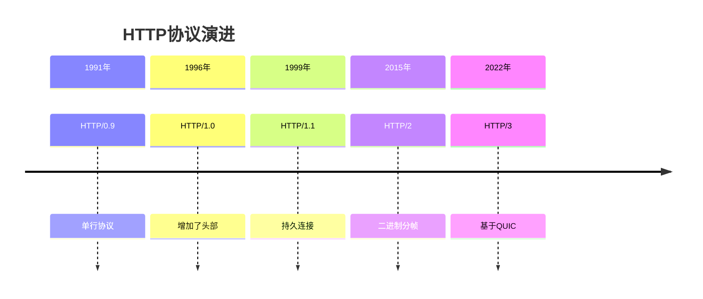

**HTTP各版本性能对比**：

| 特性 | HTTP/1.1 | HTTP/2 | HTTP/3 |
|------|----------|---------|---------|
| 连接方式 | 持久连接 | 多路复用 | 基于UDP |
| 头部压缩 | 无 | HPACK | QPACK |
| 队头阻塞 | 存在 | 流级别 | 连接级别消除 |
| 加密要求 | 可选 | 实际要求 | 强制加密 |
| 连接建立 | TCP握手 | TCP+TLS | 0-RTT/1-RTT |

### 5.2 HTTP/2的革命性设计

HTTP/2引入了二进制分帧层，彻底改变了HTTP的工作方式：

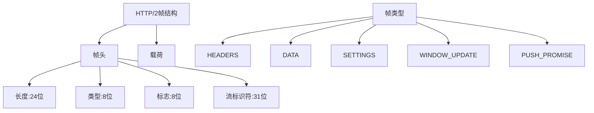

### 5.3 QUIC与HTTP/3的颠覆性创新

HTTP/3基于QUIC协议，在传输层进行了根本性重构：

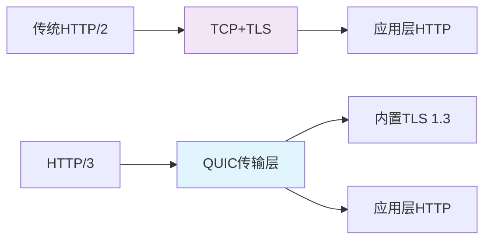

**QUIC协议的核心优势**：

```python
class QUICConnection:
    """QUIC连接特性模拟"""
    
    def __init__(self):
        self.connection_id = self.generate_cid()
        self.streams = {}  # 多流支持
        self.encryption = "TLS 1.3"
        self.migration_support = True
    
    def zero_rtt_handshake(self):
        """0-RTT握手：大幅降低延迟"""
        # 客户端基于先前连接信息立即发送数据
        return {
            "initial_packet": "包含0-RTT数据",
            "connection_resumption": "快速恢复",
            "replay_protection": "重放保护机制"
        }
    
    def connection_migration(self, new_address):
        """连接迁移：IP变化不影响连接"""
        # 基于Connection ID而非IP地址识别连接
        self.current_address = new_address
        return "连接保持活动状态"
```

## 六、无线网络协议的演进

### 6.1 WiFi协议家族

IEEE 802.11标准推动了无线局域网的发展：

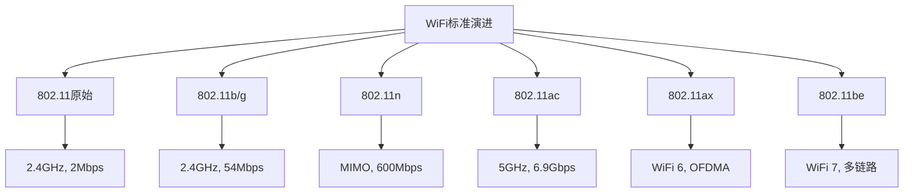

### 6.2 蜂窝移动网络协议

从1G到5G的移动通信革命：


**5G网络三大场景特性**：

| 场景 | eMBB（增强移动宽带） | mMTC（海量机器通信） | uRLLC（超高可靠低延迟） |
|------|---------------------|---------------------|------------------------|
| 速率 | 10-20 Gbps | 低数据率 | 中等数据率 |
| 延迟 | 10-20 ms | 容忍延迟 | <1 ms |
| 连接密度 | 10万/平方公里 | 100万/平方公里 | 中等密度 |
| 应用场景 | 8K视频、VR/AR | 物联网传感器 | 工业自动化、远程手术 |

## 七、网络安全协议的演进

### 7.1 加密协议的发展

从简单的密码学到现代的量子安全加密：

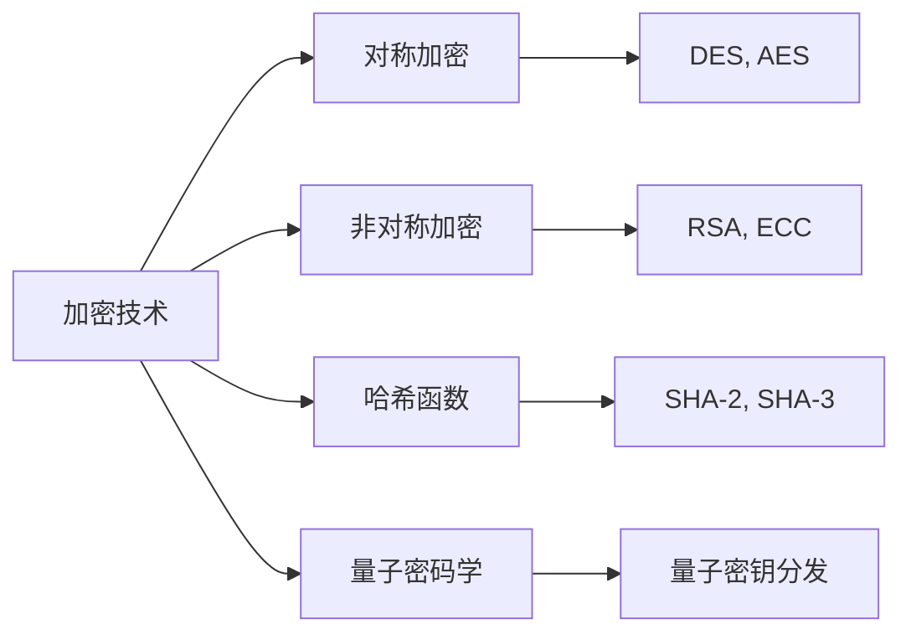

### 7.2 TLS协议的安全演进

TLS协议不断完善以应对新的安全威胁：

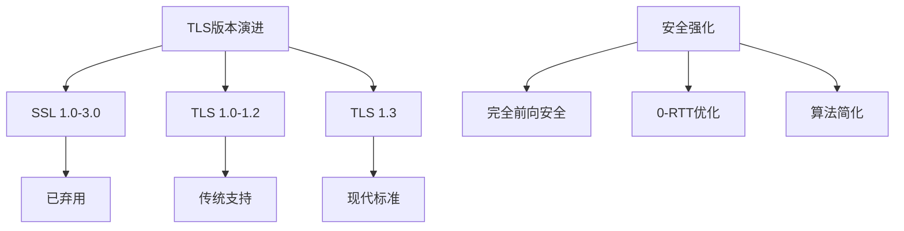

**TLS 1.3的主要改进**：
- 握手过程从2-RTT减少到1-RTT（0-RTT可选）
- 移除了不安全的加密算法（RC4、3DES等）
- 实现完全前向安全性
- 简化协议设计，减少攻击面

## 八、新兴网络协议与技术

### 8.1 物联网协议栈

物联网设备的特殊需求催生了新的协议：

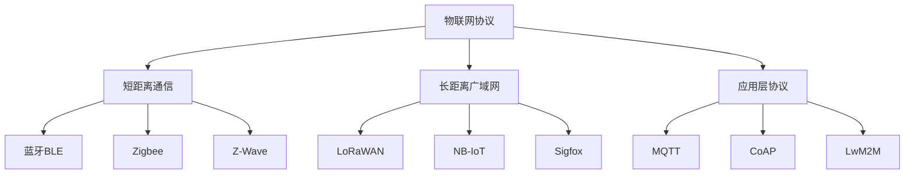

### 8.2 区块链网络协议

区块链技术引入了去中心化的网络通信模式：

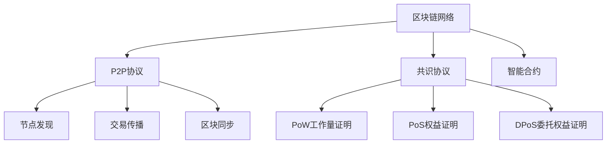

## 九、未来网络协议发展趋势

### 9.1 确定性网络（DetNet）

为工业互联网和自动驾驶提供确定性延迟：

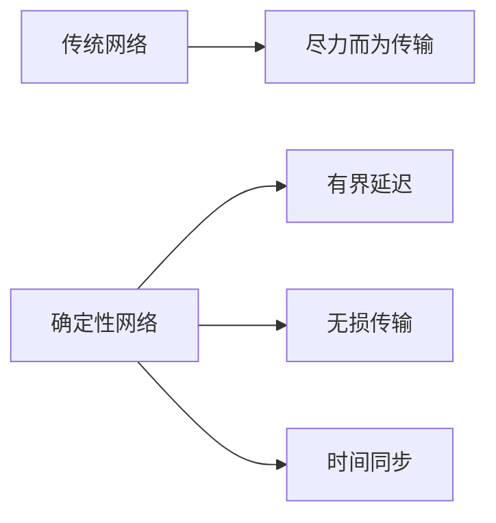

### 9.2 量子网络协议

量子通信将带来全新的安全范式：

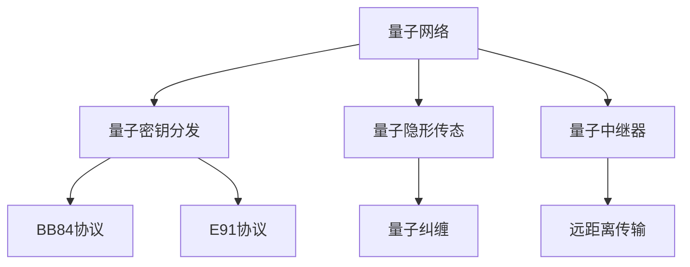

### 9.3 空天地一体化网络

融合卫星、空中、地面网络的新架构：

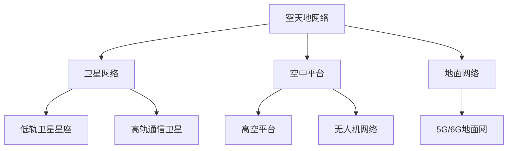

## 十、协议设计的根本原则与启示

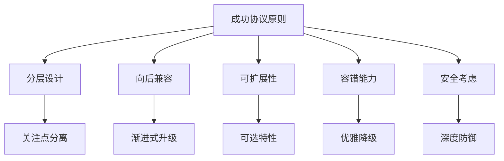

### 10.2 协议演进的动力机制

**技术驱动因素**：
- 硬件性能提升（CPU、带宽、存储）
- 新应用场景需求（视频流、物联网、VR）
- 安全威胁演变（加密算法破解、新攻击方式）

**社会经济因素**：
- 用户规模增长（从千级到数十亿级）
- 商业模式创新（云计算、移动互联网）
- 标准化组织推动（IETF、IEEE、3GPP）


---

# 6G协议深度解析：从万物互联到万物智联的革命性跨越
> 全方位解析第六代移动通信技术，探索从太赫兹通信到AI原生网络的未来蓝图
## 引言：重新定义连接的边界
当我们还在为5G的10Gbps速率和毫秒级延迟惊叹时，6G技术已经在全球范围内悄然布局。6G不仅仅是5G的简单升级，而是从"万物互联"到"万物智联"的根本性变革。预计在2030年左右商用化的6G，将实现亚毫秒级延迟、Tbps级速率，并首次将通信、感知、计算、AI四大能力深度融合。
正如国际电信联盟(ITU)秘书长多琳·博格丹-马丁所言："6G将超越传统的通信边界，成为数字社会的神经中枢。"本文将系统解析6G技术从基础原理到前沿创新的完整图景。
## 一、移动通信技术演进：从1G到6G的百年征程
### 1.1 代际技术演进全景
    A[移动通信技术演进] --> B[第一代 1G]
    A --> C[第二代 2G]
    A --> D[第三代 3G]
    A --> E[第四代 4G]
    A --> F[第五代 5G]
    A --> G[第六代 6G]
    B --> B1[1980年代]
    B --> B2[模拟语音通信]
    B --> B3[仅支持语音]
    C --> C1[1990年代]
    C --> C2[数字通信时代]
    C --> C3[GSM标准]
    D --> D1[2000年代]
    D --> D2[移动互联网雏形]
    D --> D3[WCDMA技术]
    E --> E1[2010年代]
    E --> E2[真正的移动宽带]
    E --> E3[LTE技术]
    F --> F1[2020年代]
    F --> F2[万物互联基础]
    F --> F3[三大场景]
    G --> G1[2030年代]
    G --> G2[万物智联时代]
    G --> G3[通感算AI融合]
    B -.-> C -.-> D -.-> E -.-> F -.-> G
### 1.2 各代技术关键指标对比
**完整技术参数演进表**：
| 代际 | 商用时间 | 最大速率 | 关键技术 | 核心应用 | 标志性突破 |
|------|----------|----------|----------|----------|------------|
| **1G** | 1980年代 | 2.4 kbps | FDMA | 语音通话 | 移动通信开端 |
| **2G** | 1990年代 | 64 kbps | TDMA/CDMA | 短信/低速数据 | 数字通信革命 |
| **3G** | 2000年代 | 2 Mbps | WCDMA | 移动互联网 | 视频通话实现 |
| **4G** | 2010年代 | 100 Mbps | OFDMA/MIMO | 移动宽带 | 智能手机普及 |
| **5G** | 2020年代 | 10 Gbps | Massive MIMO/mmWave | 物联网/VR | 低延迟高可靠 |
| **6G** | 2030年代 | 1 Tbps+ | 太赫兹/AI原生 | 数字孪生/全息通信 | 通信感知融合 |
### 1.3 从5G到6G的技术跨越
5G为6G奠定了重要基础，但6G在多个维度实现了质的飞跃：
    A[5G技术基础] --> B[eMBB增强移动宽带]
    A --> C[mMTC海量机器通信]
    A --> D[URLLC超高可靠低延迟]
    E[6G技术跨越] --> F[内生智能网络]
    E --> G[通感算一体化]
    E --> H[空天地海全覆盖]
    E --> I[绿色可持续]
    B -.-> F
    C -.-> G
    D -.-> H
## 二、6G核心技术突破：物理层革命
### 2.1 太赫兹通信技术
6G将通信频段从5G的毫米波扩展到太赫兹(THz)范围：
    A[频段演进] --> B[Sub-6GHz: 覆盖优先]
    A --> C[毫米波: 容量优先]
    A --> D[太赫兹: 极致性能]
    style D fill:#e8f5e8
**太赫兹通信的技术特性**：
- **频率范围**：100GHz-10THz，介于微波与红外之间
- **带宽优势**：单个信道可达数十GHz，支持Tbps级传输
- **传播特性**：准光学传播，高方向性，易被吸收衰减
**太赫兹信道建模示例**：
class TerahertzChannel:
    """太赫兹信道模型"""
    def __init__(self, frequency, distance, environment):
        self.frequency = frequency  # GHz
        self.distance = distance    # 米
        self.environment = environment
    def path_loss(self):
        """太赫兹路径损耗计算"""
        # 自由空间路径损耗
        fspl = 20 * math.log10(self.distance) + 20 * math.log10(self.frequency) + 92.45
        # 分子吸收损耗（太赫兹特有）
        absorption_loss = self.calculate_absorption()
        # 环境散射损耗
        scattering_loss = self.calculate_scattering()
        total_loss = fspl + absorption_loss + scattering_loss
        return total_loss
    def calculate_capacity(self, bandwidth, snr):
        """计算信道容量"""
        # 香农公式：C = B * log2(1 + SNR)
        capacity = bandwidth * math.log2(1 + snr)
        # 太赫兹特有考虑：分子噪声影响
        molecular_noise_factor = self.calculate_molecular_noise()
        effective_capacity = capacity * molecular_noise_factor
        return effective_capacity  # Gbps
### 2.2 超大规模天线系统
6G将MIMO技术推向极致，实现"超大规模天线"(Extreme Massive MIMO)：
    A[MIMO技术演进] --> B[传统MIMO: 2-8天线]
    A --> C[Massive MIMO: 64-256天线]
    A --> D[超大规模MIMO: 1024+天线]
    B --> B1[空间复用增益]
    C --> C1[波束成形精度提升]
    D --> D1[全息波束成形]
    D --> D2[分布式孔径]
**超大规模天线的技术优势**：
- **空间分辨率革命**：亚波长级波束控制精度
- **能量效率提升**：精准的能量指向性传输
- **干扰消除能力**：近乎完美的多用户隔离
### 2.3 智能频谱共享
6G采用AI驱动的动态频谱接入技术：
sequenceDiagram
    participant AI as AI频谱管理器
    participant Primary as 主用户
    participant Secondary as 次用户
    participant Spectrum as 频谱资源池
    AI->>Spectrum: 实时监测频谱状态
    Spectrum-->>AI: 返回频谱占用情况
    alt 频谱空闲
        AI->>Secondary: 分配频谱资源
        Secondary->>Primary: 感知主用户活动
        Primary-->>Secondary: 无活动信号
        Secondary->>Spectrum: 开始传输
    else 主用户出现
        Secondary->>AI: 检测到主用户
        AI->>Secondary: 立即切换频率
        Secondary->>Spectrum: 释放当前频段
    end
## 三、6G网络架构创新：从集中到分布
### 3.1 空天地一体化网络
6G实现地面、空中、太空网络的无缝融合：
    A[空天地一体化架构] --> B[地面网络层]
    A --> C[空中网络层]
    A --> D[太空网络层]
    B --> B1[微基站/宏基站]
    B --> B2[智能反射表面]
    C --> C1[无人机基站]
    C --> C2[高空平台]
    D --> D1[低轨卫星]
    D --> D2[中轨卫星]
    D --> D3[高轨卫星]
    B1 --> E[无缝切换]
    C1 --> E
    D1 --> E
**各网络层的技术特性**：
| 网络层 | 覆盖范围 | 延迟特性 | 带宽能力 | 典型应用 |
|--------|----------|----------|----------|----------|
| **地面网络** | 局部区域 | 1-10ms | 极高(太赫兹) | 室内外热点 |
| **空中网络** | 区域覆盖 | 10-50ms | 高(毫米波) | 应急通信 |
| **太空网络** | 全球覆盖 | 20-100ms | 中(Sub-6GHz) | 偏远地区 |
### 3.2 分布式智能架构
6G网络从集中式架构向分布式智能演进：
    A[传统集中式] --> B[中心化控制]
    A --> C[资源集中调度]
    A --> D[单点故障风险]
    E[6G分布式智能] --> F[边缘智能节点]
    E --> G[联邦学习协同]
    E --> H[自组织网络]
    E --> I[韧性网络架构]
**分布式智能的关键技术**：
class DistributedAIArchitecture:
    """6G分布式AI架构"""
        self.edge_nodes = []  # 边缘智能节点
        self.cloud_center = None  # 云中心
        self.federation_controller = None  # 联邦学习控制器
    def federated_learning(self, local_models):
        """联邦学习模型聚合"""
        # 各节点本地训练
        local_updates = []
        for node in self.edge_nodes:
            update = node.train_locally()
            local_updates.append(update)
        # 安全聚合（避免原始数据泄露）
        aggregated_model = self.secure_aggregation(local_updates)
        # 分发更新后的全局模型
        for node in self.edge_nodes:
            node.update_model(aggregated_model)
        return aggregated_model
    def intelligent_resource_allocation(self, user_demands):
        """智能资源分配"""
        # 基于AI预测的资源需求
        predicted_demand = self.demand_forecasting(user_demands)
        # 分布式决策
        allocation_plan = {}
        for node in self.edge_nodes:
            # 考虑节点负载、能效、QoS要求
            node_allocation = node.optimize_allocation(predicted_demand)
            allocation_plan[node.id] = node_allocation
        return allocation_plan
### 3.3 网络数字孪生
6G引入网络数字孪生技术，实现物理网络的虚拟映射：
    A[物理网络] --> B[基站设备]
    A --> C[传输链路]
    A --> D[用户终端]
    E[数字孪生网络] --> F[虚拟基站模型]
    E --> G[链路仿真]
    E --> H[用户行为建模]
    B <-.-> F
    C <-.-> G
    D <-.-> H
    I[AI优化引擎] --> J[网络配置优化]
    I --> K[故障预测]
    I --> L[能效管理]
## 四、通信感知计算一体化
### 4.1 集成感知与通信(ISAC)
6G首次实现通信与感知功能的深度集成：
    A[传统分离架构] --> B[通信系统]
    A --> C[感知系统]
    B --> D[资源竞争]
    E[6G ISAC架构] --> F[统一波形设计]
    E --> G[共享硬件平台]
    E --> H[协同信号处理]
    F --> I[资源效率提升]
    G --> I
    H --> I
**ISAC的技术优势**：
- **频谱效率倍增**：通信与感知共享频谱资源
- **硬件成本降低**：复用射频前端和处理单元
- **服务能力增强**：同时提供通信和环境感知服务
### 4.2 感知通信应用场景
class IntegratedSensingCommunication:
    """集成感知通信系统"""
        self.communication_mode = 'active'  # 主动感知
        self.sensing_resolution = 'sub-meter'  # 亚米级分辨率
    def joint_waveform_design(self):
        """联合波形设计"""
        # 通信需求：高数据速率，低误码率
        communication_constraints = {
            'throughput': '1Gbps',
            'ber': '1e-6',
            'latency': '1ms'
        # 感知需求：高分辨率，高精度
        sensing_constraints = {
            'range_resolution': '0.1m',
            'velocity_resolution': '0.1m/s',
            'angular_resolution': '1度'
        # 优化目标：在满足双重约束下最大化综合性能
        optimal_waveform = self.optimize_waveform(
            communication_constraints, 
            sensing_constraints
        )
        return optimal_waveform
    def environmental_mapping(self, signal_measurements):
        """环境地图构建"""
        # 基于通信信号的环境感知
        environment_model = {
            'obstacles': self.detect_obstacles(signal_measurements),
            'moving_objects': self.track_movements(signal_measurements),
            'channel_conditions': self.assess_channel(signal_measurements)
        return environment_model
### 4.3 智能反射表面(IRS)
6G引入可编程的智能反射表面重构无线传播环境：
    A[传统无线环境] --> B[信号衰减]
    A --> C[多径干扰]
    A --> D[覆盖盲区]
    E[IRS增强环境] --> F[信号增强]
    E --> G[干扰消除]
    E --> H[覆盖扩展]
    I[IRS工作原理] --> J[可编程超表面]
    I --> K[动态波束调控]
    I --> L[环境自适应]
## 五、6G性能指标与技术创新
### 5.1 关键性能指标(KPI)跨越
**6G与5G性能全面对比**：
| 性能指标 | 5G标准 | 6G目标 | 提升倍数 | 技术挑战 |
|----------|--------|--------|----------|----------|
| **峰值速率** | 10 Gbps | 1 Tbps | 100倍 | 太赫兹器件 |
| **用户体验速率** | 100 Mbps | 10 Gbps | 100倍 | 网络密度 |
| **空中接口延迟** | 1 ms | 0.1 ms | 10倍 | 协议简化 |
| **连接密度** | 10^6 devices/km² | 10^7 devices/km² | 10倍 | 海量接入 |
| **可靠性** | 99.999% | 99.9999% | 10倍提升 | 冗余架构 |
| **移动性支持** | 500 km/h | 1000 km/h | 2倍 | 波束跟踪 |
| **定位精度** | 米级 | 厘米级 | 100倍 | 通感一体化 |
| **能效** | 1x | 10-100x | 10-100倍 | 绿色技术 |
### 5.2 技术创新突破点
    A[6G技术创新] --> B[新频段开拓]
    A --> C[新架构设计]
    A --> D[新范式引入]
    B --> B1[太赫兹通信]
    B --> B2[可见光通信]
    B --> B3[轨道角动量]
    C --> C1[空天地一体化]
    C --> C2[分布式智能]
    C --> C3[网络孪生]
    D --> D1[通感算一体]
    D --> D2[AI原生设计]
    D --> D3[语义通信]
### 5.3 语义通信革命
6G引入语义通信，从比特传输向信息含义传输演进：
sequenceDiagram
    participant S as 语义编码器
    participant C as 信道
    participant R as 语义解码器
    Note over S,R: 传统通信：比特级传输
    S->>C: 发送原始数据比特流
    C-->>R: 传输过程中可能出错
    R->>R: 纠错解码，恢复比特
    Note over S,R: 语义通信：含义级传输
    S->>S: 提取数据语义信息
    S->>C: 发送语义特征向量
    C-->>R: 语义特征更抗干扰
    R->>R: 基于语义恢复信息
**语义通信的优势**：
- **带宽效率提升**：传输语义特征而非原始数据
- **抗干扰能力强**：语义信息对信道误差更鲁棒
- **智能交互增强**：直接理解和处理信息含义
## 六、6G应用场景展望
### 6.1 全息通信与沉浸式体验
    A[全息通信应用] --> B[远程全息会议]
    A --> C[沉浸式教育]
    A --> D[数字孪生协作]
    B --> B1[真人大小全息投影]
    B --> B2[实时表情动作捕捉]
    C --> C1[虚拟实验室]
    C --> C2[历史场景重现]
    D --> D1[工业设计评审]
    D --> D2[医疗手术指导]
**技术需求分析**：
- **数据传输量**：全息视频需要Tbps级带宽
- **延迟要求**：<1ms确保实时交互
- **计算能力**：边缘智能处理全息渲染
### 6.2 智慧工业与数字孪生
class IndustrialDigitalTwin:
    """工业数字孪生系统"""
    def __init__(self, factory_layout):
        self.physical_factory = factory_layout
        self.digital_twin = self.create_digital_model()
        self.6g_connectivity = None
    def real_time_synchronization(self):
        """实时同步机制"""
        # 6G网络提供的同步能力
        sync_capabilities = {
            'data_rate': '10Gbps',  # 高带宽传输传感器数据
            'latency': '0.1ms',     # 亚毫秒级控制指令
            'reliability': '99.9999%',  # 超高可靠性
            'device_density': '1000 devices/100m²'  # 高密度连接
        # 数字孪生更新频率
        update_interval = 0.001  # 1ms更新一次
        return sync_capabilities
    def predictive_maintenance(self, equipment_data):
        """预测性维护"""
        # 基于6G传输的实时设备数据
        real_time_monitoring = {
            'vibration_sensors': equipment_data['vibration'],
            'thermal_imaging': equipment_data['temperature'],
            'acoustic_analysis': equipment_data['sound']
        # AI算法预测故障
        failure_prediction = self.ai_predictor.predict(real_time_monitoring)
        return failure_prediction
### 6.3 远程医疗与手术机器人
**6G医疗应用的技术要求**：
| 应用场景 | 带宽需求 | 延迟要求 | 可靠性要求 | 6G技术支持 |
|----------|----------|----------|------------|------------|
| **远程诊断** | 1-10 Gbps | <10 ms | 99.9% | 高清医学影像传输 |
| **手术机器人** | 10-100 Gbps | <1 ms | 99.999% | 触觉反馈控制 |
| **急救医疗** | 100 Mbps-1 Gbps | <5 ms | 99.99% | 无人机急救网络 |
| **健康监测** | 1-100 Mbps | <100 ms | 99.9% | 可穿戴设备连接 |
### 6.4 智能交通与车联网
    A[6G智能交通] --> B[自动驾驶协同]
    A --> C[交通流量优化]
    A --> D[紧急车辆优先]
    B --> B1[车车通信V2V]
    B --> B2[车路协同V2I]
    B --> B3[实时高精地图]
    C --> C1[智能信号控制]
    C --> C2[拥堵预测疏导]
    D --> D1[应急通道建立]
    D --> D2[优先通行权]
## 七、技术挑战与解决方案
### 7.1 频谱资源挑战
**太赫兹频段的技术难题**：
    A[太赫兹挑战] --> B[传播损耗大]
    A --> C[器件成本高]
    A --> D[标准不统一]
    B --> B1[解决方案：智能波束成形]
    C --> C1[解决方案：硅基集成]
    D --> D1[解决方案：国际协作]
### 7.2 能源效率挑战
6G面临"性能提升但能耗控制"的矛盾：
class Green6GTechnology:
    """绿色6G技术方案"""
        self.energy_saving_techniques = []
    def energy_harvesting(self):
        """能量收集技术"""
        harvesting_methods = {
            'solar_power': '基站太阳能板',
            'RF_energy': '环境射频能量收集',
            'wind_power': '风力发电补充'
        return harvesting_methods
    def ai_powered_energy_management(self, traffic_pattern):
        """AI驱动的能耗管理"""
        # 基于流量预测的动态节能
        energy_optimization = {
            'sleep_mode': self.predict_low_traffic_periods(),
            'power_control': self.adaptive_power_adjustment(),
            'resource_consolidation': self.intelligent_resource_sharing()
        return energy_optimization
    def calculate_energy_efficiency(self, throughput, power_consumption):
        """计算能效指标"""
        # 比特/焦耳 (bits/Joule)
        energy_efficiency = throughput / power_consumption
        # 6G目标：相比5G提升10-100倍能效
        improvement_factor = energy_efficiency / self.5g_baseline
        return improvement_factor
### 7.3 安全与隐私挑战
6G网络面临新的安全威胁：
    A[6G安全挑战] --> B[AI模型攻击]
    A --> C[通感一体化隐私]
    A --> D[空天地网络安全]
    B --> B1[防御：联邦学习]
    B --> B2[防御：模型水印]
    C --> C1[保护：差分隐私]
    C --> C2[保护：机密计算]
    D --> D1[保障：区块链认证]
    D --> D2[保障：量子加密]
## 八、全球6G研发进展
### 8.1 主要国家战略布局
**全球6G研发格局**：
| 国家/地区 | 启动时间 | 主要项目 | 投资规模 | 技术重点 |
|----------|----------|----------|----------|----------|
| **中国** | 2019年 | IMT-2030推进组 | 数百亿人民币 | 空天地一体化 |
| **美国** | 2020年 | Next G联盟 | 数十亿美元 | AI原生网络 |
| **欧盟** | 2021年 | Hexa-X项目 | 数十亿欧元 | 绿色6G |
| **日本** | 2020年 | Beyond 5G | 数千亿日元 | 太赫兹技术 |
| **韩国** | 2019年 | 6G战略 | 数千亿韩元 | 全息通信 |
### 8.2 企业研发动态
**主要企业的6G技术路线**：
    A[华为] --> B[通感算一体化]
    A --> C[绿色节能技术]
    D[诺基亚] --> E[网络即服务]
    D --> F[云原生架构]
    G[爱立信] --> H[AI原生设计]
    G --> I[语义通信]
    J[三星] --> K[太赫兹器件]
    J --> L[全息技术]
    M[高通] --> N[分布式智能]
    M --> O[边缘计算]
### 8.3 标准化进程
**6G标准化进程**：
    A[愿景研究阶段<br>2023-2025] --> B[技术研究阶段<br>2025-2027]
    B --> C[标准制定阶段<br>2027-2029]
    C --> D[商用部署阶段<br>2030+]
    A --> A1[技术需求定义]
    A --> A2[场景需求分析]
    B --> B1[核心技术攻关]
    B --> B2[原型系统验证]
    C --> C1[国际标准制定]
    C --> C2[技术规范冻结]
    D --> D1[预商用试验]
    D --> D2[规模商用推广]
## 九、6G未来展望与社会影响
### 9.1 技术发展趋势
    A[6G技术趋势] --> B[频段向更高发展]
    A --> C[架构向更分布发展]
    A --> D[智能向更内生发展]
    A --> E[融合向更深度发展]
    B --> B1[太赫兹→光学→量子]
    C --> C1[云边端协同→全域智能]
    D --> D1[AI赋能→AI原生]
    E --> E1[通感算→通感算智一体]
### 9.2 社会经济效益
**6G可能带来的社会变革**：
class SocioEconomicImpact:
    """6G社会经济影响分析"""
        self.impact_areas = {}
    def economic_growth_estimation(self):
        """经济增长估算"""
        # 据ITU估计，6G可能带来的经济价值
        economic_impact = {
            'direct_contribution': '拉动全球GDP增长1-2%',
            'indirect_benefits': '催生万亿级新产业',
            'employment_creation': '创造数百万新工作岗位'
        return economic_impact
    def industry_transformation(self):
        """产业变革预测"""
        transformed_industries = [
            '制造业：全自动化智能工厂',
            '医疗业：远程精准医疗服务',
            '教育业：沉浸式个性化学习',
            '交通业：全自动驾驶网络',
            '农业业：精准智慧农业'
        ]
        return transformed_industries
    def digital_inclusion(self):
        """数字包容性提升"""
        inclusion_improvements = {
            'rural_connectivity': '偏远地区高速网络覆盖',
            'affordable_access': '低成本通信服务普及',
            'disability_support': '辅助通信技术增强'
        return inclusion_improvements