# RTMP协议深度解析：从原理到实践的完整指南

> 本文将从零开始，由浅入深地剖析RTMP协议的设计哲学、技术细节与核心原理，帮助你真正理解这个支撑了直播时代的技术基石。

---

## 一、什么是RTMP？从应用场景说起

在深入技术细节之前，让我们先看看RTMP在我们的日常生活中扮演着什么角色。

当你打开抖音、快手、B站观看直播时，当你使用OBS推流进行游戏直播时，幕后很可能就有RTMP协议在工作。**RTMP（Real-Time Messaging Protocol，实时消息传输协议）** 是Adobe公司开发的一种流媒体传输协议，专门用于在Flash播放器和服务器之间传输音视频数据。

### RTMP的典型应用场景

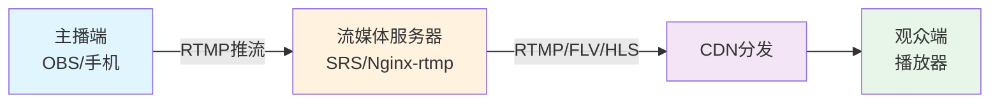

RTMP的核心价值在于：**低延迟、高效率**。在直播场景中，观众希望尽可能实时地看到主播的画面，而RTMP正是为这种需求量身定制的。

---

## 二、RTMP的前世今生：理解设计的根源

要真正理解RTMP，我们需要回到它诞生的时代背景。

### 2.1 Flash时代的产物

2002年，Macromedia公司（后被Adobe收购）推出了Flash Player 6，同时引入了RTMP协议。彼时的互联网正处于从静态页面向富媒体应用转型的关键时期：

- **HTTP协议** 是为传输静态文档设计的，无法满足实时流媒体的需求
- **TCP协议** 虽然可靠，但需要在上层构建合适的应用协议
- **浏览器** 需要一个能够播放流媒体的统一方案

RTMP正是诞生于这样的需求背景之下。它的设计目标非常明确：**在TCP之上构建一个高效的、低延迟的实时消息传输协议**。

### 2.2 设计哲学的演进

理解RTMP的设计，需要抓住一个核心矛盾：

> **如何在保证数据可靠传输的同时，实现最低的延迟？**

这看似是一个悖论——TCP的可靠传输机制本身就意味着一定的延迟。RTMP的设计者们给出了独特的解决方案：

1. **基于TCP但不拘泥于TCP**：利用TCP的可靠性，但在应用层优化传输策略
2. **消息分块机制**：将大消息拆分成小块，降低单次传输延迟
3. **灵活的消息类型**：支持控制消息、数据消息、命令消息等多种类型
4. **高效的编码方式**：采用紧凑的二进制格式，减少带宽开销

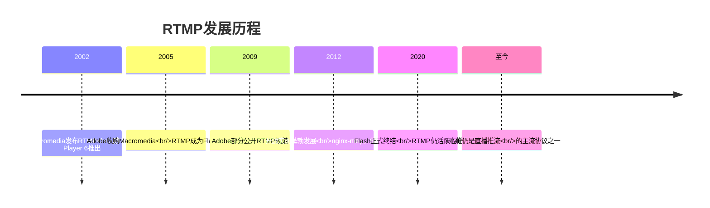

---

## 三、RTMP协议架构：分层设计的智慧

RTMP协议栈是一个典型的分层架构，让我们一层层剥开它的面纱。

### 3.1 协议栈全景图

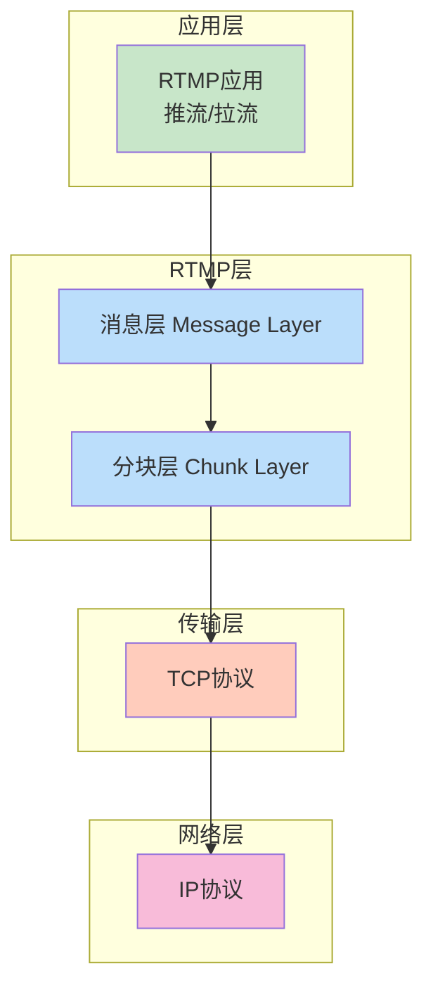

这个架构设计的精妙之处在于：

1. **消息层（Message Layer）**：面向应用，提供语义清晰的消息抽象
2. **分块层（Chunk Layer）**：面向传输，优化网络传输效率
3. **TCP层**：保证数据可靠有序到达

### 3.2 为什么需要分块层？

这是RTMP设计中最核心的优化之一。让我们深入理解其必要性。

**问题场景**：假设有一条直播流包含：
- 视频数据：每帧大小约 10KB
- 音频数据：每帧大小约 100B
- 控制消息：偶尔出现

如果直接按消息传输：

```mermaid
gantt
    title 不使用分块时的传输情况
    dateFormat X
    axisFormat %s

    section 音频帧
    音频帧1 :0, 1
    等待视频帧 :1, 100
    音频帧2 :100, 101
    等待视频帧 :101, 200

    section 视频帧
    视频帧1 :0, 100
    视频帧2 :100, 200
```

**问题**：小的音频消息会被大的视频消息阻塞，导致音频延迟累积。

**分块的解决方案**：

```mermaid
gantt
    title 使用分块后的传输情况
    dateFormat X
    axisFormat %s

    section 音频帧
    音频帧1 :0, 1
    音频帧2 :2, 3
    音频帧3 :4, 5

    section 视频帧
    视频帧-分块1 :1, 2
    视频帧-分块2 :3, 4
    视频帧-分块3 :5, 6
```

通过分块，大消息和小消息可以交替传输，这就是**多路复用**的核心思想。

---

## 四、RTMP握手：建立连接的艺术

每个RTMP连接都以握手开始。握手过程看似简单，实则暗藏玄机。

### 4.1 握手流程详解

RTMP握手涉及三个固定大小的数据包：

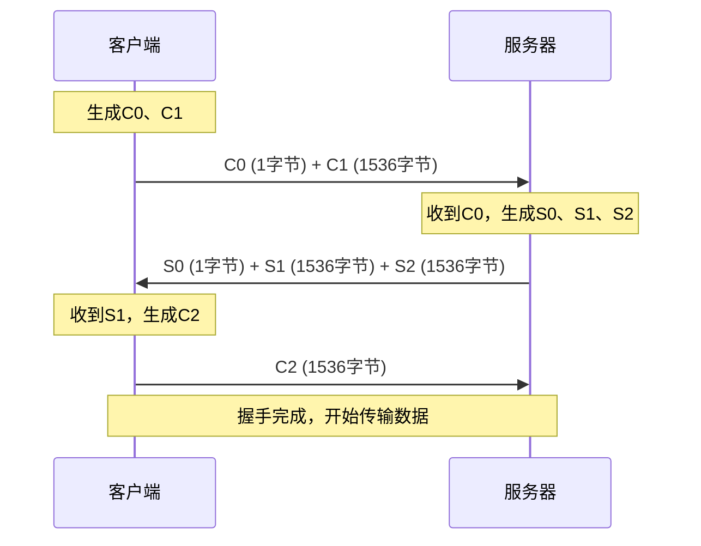

### 4.2 握手包的结构

**C0/S0 包（1字节）**：
```
+--------+
| Version|
+--------+
```
- 版本号通常为3，表示RTMP版本

**C1/S1 包（1536字节）**：
```
+-----------------+-----------------+------------------+
|   Time (4B)     |   Zero (4B)     |  Random (1528B)  |
+-----------------+-----------------+------------------+
```

**C2/S2 包（1536字节）**：
- C2是S1的完整回显
- S2是C1的完整回显

### 4.3 为什么这样设计？深入分析握手的本质

握手过程的设计蕴含了几个关键考量：

**1. 协议版本协商**

C0/S0的版本号交换，为协议升级预留了空间。如果服务器不支持客户端的版本，可以拒绝连接。

**2. 防止欺骗性连接**

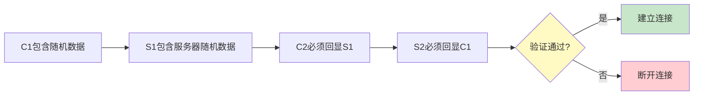

如果客户端无法正确回显S1的数据，说明它可能没有完整接收S1，或者是一个不完整的实现。这是一种**轻量级的连接验证机制**。

**3. 时间戳同步**

C1和S1中都包含时间戳字段，用于后续数据传输的时间基准同步。这对于音视频同步至关重要。

**4. 防止早期连接攻击**

在完全接收C1之前，服务器就可以开始发送S0和S1。但这种设计在某些安全场景下可能存在问题。后来的实现中，很多服务器会选择在收到完整的C1后再发送响应，这是一种安全与效率的权衡。

---

## 五、RTMP消息：数据的语义载体

握手完成后，就可以开始传输消息了。消息是RTMP传输数据的语义单位。

### 5.1 消息的基本结构

```
 0                   1                   2                   3
 0 1 2 3 4 5 6 7 8 9 0 1 2 3 4 5 6 7 8 9 0 1 2 3 4 5 6 7 8 9 0 1
+-+-+-+-+-+-+-+-+-+-+-+-+-+-+-+-+-+-+-+-+-+-+-+-+-+-+-+-+-+-+-+-+
|                     Message Type (1B)                         |
+-+-+-+-+-+-+-+-+-+-+-+-+-+-+-+-+-+-+-+-+-+-+-+-+-+-+-+-+-+-+-+-+
|                 Timestamp (3B) / Extended (4B)                |
+-+-+-+-+-+-+-+-+-+-+-+-+-+-+-+-+-+-+-+-+-+-+-+-+-+-+-+-+-+-+-+-+
|                   Payload Length (3B)                         |
+-+-+-+-+-+-+-+-+-+-+-+-+-+-+-+-+-+-+-+-+-+-+-+-+-+-+-+-+-+-+-+-+
|                   Stream ID (小端序, 4B)                       |
+-+-+-+-+-+-+-+-+-+-+-+-+-+-+-+-+-+-+-+-+-+-+-+-+-+-+-+-+-+-+-+-+
|                         Payload Data                          |
|                            ...                                |
+-+-+-+-+-+-+-+-+-+-+-+-+-+-+-+-+-+-+-+-+-+-+-+-+-+-+-+-+-+-+-+-+
```

### 5.2 消息类型详解

RTMP定义了多种消息类型，每种都有特定的用途：

| 类型ID | 消息类型 | 说明 |
|--------|----------|------|
| 1 | Set Chunk Size | 设置分块大小 |
| 2 | Abort Message | 中止消息 |
| 3 | Acknowledgement | 确认 |
| 5 | Window Acknowledgement Size | 确认窗口大小 |
| 6 | Set Peer Bandwidth | 设置对端带宽 |
| 8 | Audio Message | 音频数据 |
| 9 | Video Message | 视频数据 |
| 15-18 | Data Message | 数据消息(AMF) |
| 20 | Command Message | 命令消息 |

### 5.3 为什么需要Stream ID？

这是一个经常被忽视但极其重要的设计。一个RTMP连接可以承载多个**逻辑流（Stream）**：

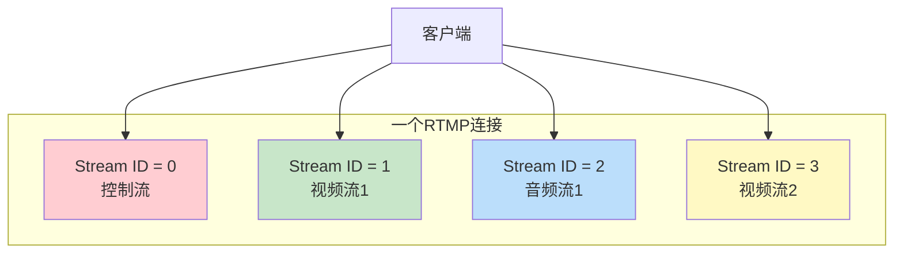

这种设计的优势：

1. **连接复用**：多个流共享一个TCP连接，减少连接开销
2. **独立传输**：每个流可以独立传输，互不干扰
3. **资源隔离**：不同流的带宽、缓冲区可以独立管理

---

## 六、RTMP分块机制：核心优化的精髓

分块机制是RTMP最具特色的设计，也是理解其低延迟特性的关键。

### 6.1 分块的基本概念

消息（Message）是应用层的概念，分块（Chunk）是传输层的概念。一个消息可能被拆分成多个分块，每个分块都有固定的头部。

### 6.2 分块头的结构

RTMP分块头由两部分组成：**基本头**和**消息头**。

**基本头（Basic Header）**：

```
 0 1 2 3 4 5 6 7
+-+-+-+-+-+-+-+-+
|fmt|   cs id   |
+-+-+-+-+-+-+-+-+
```

- `fmt`（2位）：消息头的格式类型，0-3
- `cs id`（6位）：分块流ID，2-63

**消息头格式（Message Header Format）**：

根据fmt的值，消息头有四种格式：

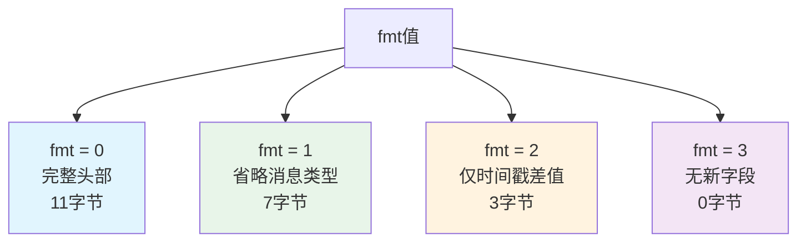

**fmt = 0 的完整消息头（11字节）**：
```
 0                   1                   2                   3
 0 1 2 3 4 5 6 7 8 9 0 1 2 3 4 5 6 7 8 9 0 1 2 3 4 5 6 7 8 9 0 1
+-+-+-+-+-+-+-+-+-+-+-+-+-+-+-+-+-+-+-+-+-+-+-+-+-+-+-+-+-+-+-+-+
|                   timestamp delta             |message length |
+-+-+-+-+-+-+-+-+-+-+-+-+-+-+-+-+-+-+-+-+-+-+-+-+-+-+-+-+-+-+-+-+
|     message length (cont)     |message type id| msg stream id |
+-+-+-+-+-+-+-+-+-+-+-+-+-+-+-+-+-+-+-+-+-+-+-+-+-+-+-+-+-+-+-+-+
|           msg stream id (cont)                |
+-+-+-+-+-+-+-+-+-+-+-+-+-+-+-+-+-+-+-+-+-+-+-+-+
```

### 6.3 为什么有四种头部格式？深度解析

这是RTMP设计的精华所在。理解这一点，需要回到数据传输的本质。

**场景分析**：

假设我们正在传输一个视频流，连续的视频帧有这样的特点：

| 帧 | 类型 | 时间戳 | 大小 | 消息类型 | 流ID |
|----|------|--------|------|----------|------|
| 1 | I帧 | 0 | 50000 | 9 | 1 |
| 2 | P帧 | 33 | 8000 | 9 | 1 |
| 3 | P帧 | 66 | 7500 | 9 | 1 |
| 4 | P帧 | 99 | 8200 | 9 | 1 |

如果每帧都用完整头部传输：

```
总头部大小 = 11 × 4 = 44 字节
```

但仔细观察，后三帧的特点：
- 消息类型相同（都是视频，type=9）
- 流ID相同（都是1）
- 只有时间戳和大小在变化

如果使用优化后的头部格式：

```
帧1：fmt=0，完整头部，11字节
帧2：fmt=1，省略消息类型和流ID，7字节
帧3：fmt=2，仅时间戳差值，3字节
帧4：fmt=2，仅时间戳差值，3字节

总头部大小 = 11 + 7 + 3 + 3 = 24 字节
节省 = 44 - 24 = 20 字节 (45%的压缩率)
```

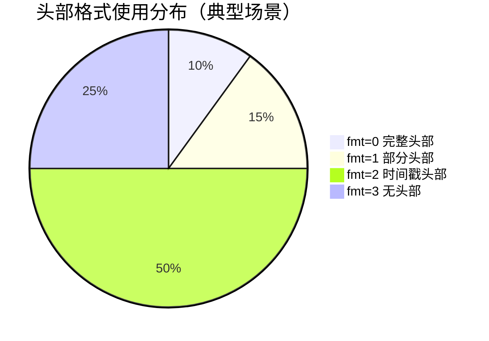

### 6.4 分块大小如何选择？

RTMP默认分块大小为128字节，但这通常不是最优选择。

**选择分块大小的考量因素**：

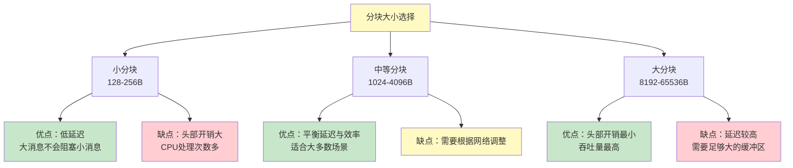

**实际推荐**：

| 场景 | 推荐分块大小 | 理由 |
|------|-------------|------|
| 低延迟直播 | 1024-2048B | 在保证低延迟的同时，减少头部开销 |
| 普通直播 | 4096B | 平衡性能与延迟 |
| 高吞吐量传输 | 8192-32768B | 最大化带宽利用率 |

---

## 七、RTMP命令：交互控制的桥梁

RTMP使用AMF（Action Message Format）编码命令消息，实现客户端与服务器之间的交互控制。

### 7.1 常用命令流程

**推流流程**：

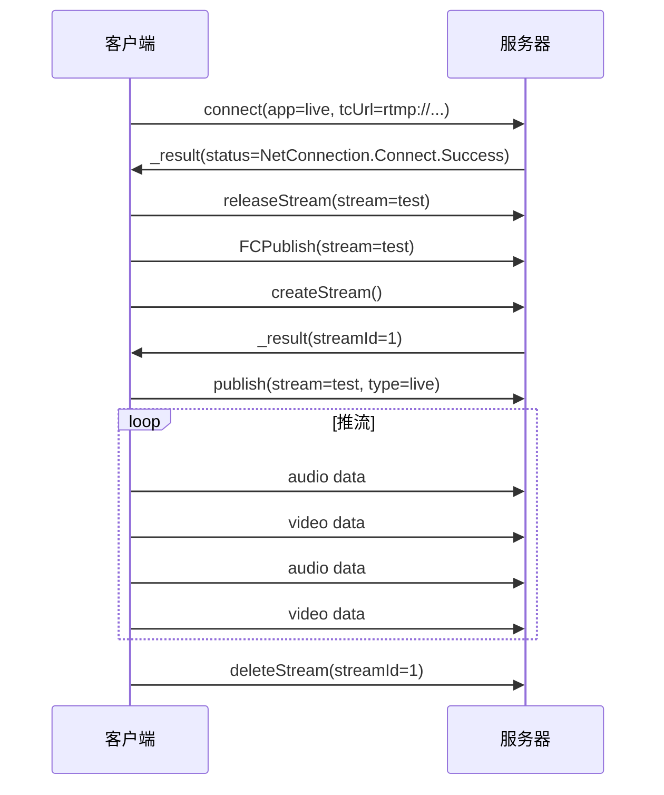

**拉流流程**：

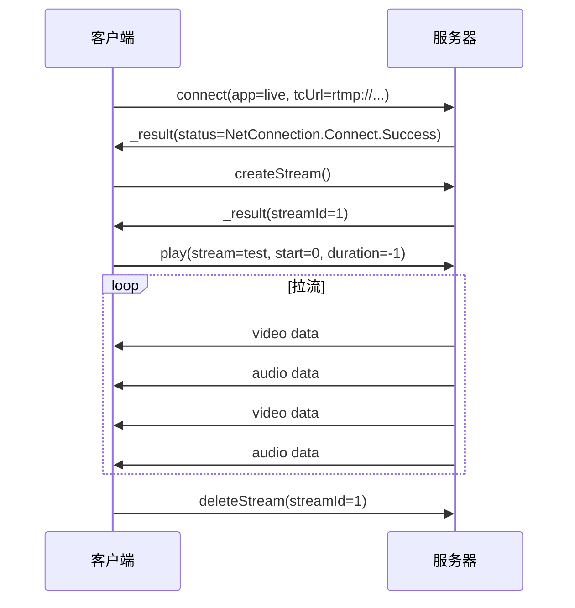

### 7.2 AMF编码简介

AMF是Adobe开发的一种二进制数据序列化格式，类似JSON但更紧凑。

**AMF0基本类型**：

| 类型标记 | 类型 | 说明 |
|----------|------|------|
| 0x00 | Number | 8字节IEEE-754双精度浮点数 |
| 0x01 | Boolean | 1字节，0=false，其他=true |
| 0x02 | String | UTF-8字符串，前缀长度 |
| 0x03 | Object | 键值对集合 |
| 0x05 | Null | 空值 |
| 0x08 | ECMA Array | 关联数组 |
| 0x0A | Array | 索引数组 |

**示例：connect命令的AMF编码**

```
命令名：String "connect"
事务ID：Number 1.0
命令对象：Object {
    "app": "live",
    "tcUrl": "rtmp://example.com/live",
    "flashVer": "FMLE/3.0",
    "type": "nonprivate"
}
```

---

## 八、为什么RTMP低延迟？根本原因分析

这是本文的核心问题。让我们从多个层面深入分析。

### 8.1 协议层面的原因

**1. 基于TCP的可靠传输**

RTMP选择TCP而非UDP，这是一个重要的设计决策。

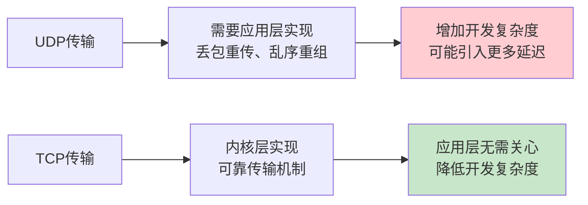

**TCP的延迟来源**：
- 三次握手：建立连接需要1.5个RTT
- 拥塞控制：慢启动阶段吞吐量较低
- Nagle算法：小包延迟合并

**RTMP的应对策略**：
- 连接复用：一个连接传输多个流
- 禁用Nagle：设置TCP_NODELAY
- 大缓冲区：减少ACK等待

**2. 分块机制的多路复用**

这是RTMP低延迟的核心原因。通过分块，大消息不会阻塞小消息：

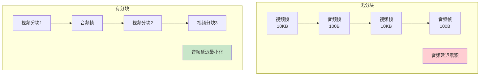

**3. 紧凑的二进制格式**

RTMP采用高效的二进制编码：

| 项目 | RTMP | HTTP-based |
|------|------|------------|
| 协议开销 | ~10-20字节/消息 | ~数百字节头部 |
| 编码效率 | 二进制，无冗余 | 文本，大量冗余 |
| 解析速度 | 直接内存映射 | 字符串解析 |

### 8.2 实现层面的原因

**1. 缓冲区管理**

RTMP使用滑动窗口机制控制数据流量：

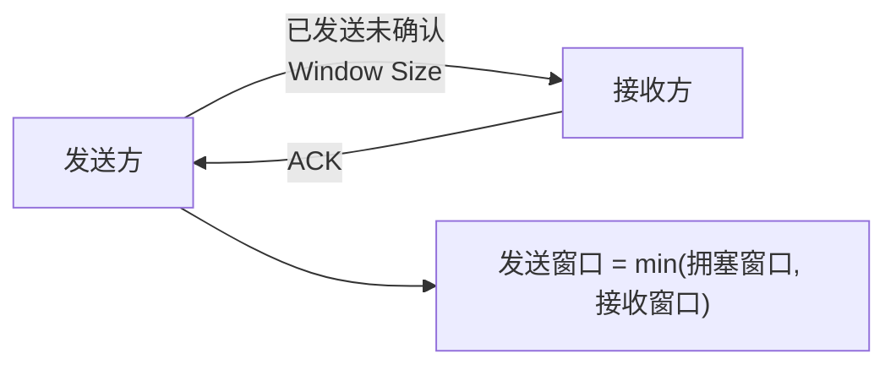

当发送方收到ACK时，窗口滑动，可以发送更多数据。这种机制确保：
- 不会发送过多数据导致接收方缓冲区溢出
- 也不会因为等待而浪费带宽

**2. 时间戳机制**

每个消息都携带时间戳，这是实现音视频同步的基础：

```
消息时间戳 = 采集时刻的绝对时间 或 相对时间
```

播放端根据时间戳进行缓冲和同步显示，避免因网络抖动导致的播放卡顿。

### 8.3 架构层面的原因

**端到端优化**：

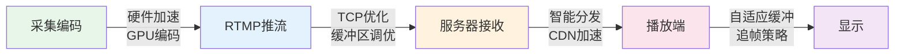

### 8.4 与其他协议的对比

| 特性 | RTMP | HLS | HTTP-FLV | WebRTC |
|------|------|-----|----------|--------|
| 延迟 | 1-3秒 | 10-30秒 | 1-3秒 | <1秒 |
| 传输协议 | TCP | HTTP/TCP | HTTP/TCP | UDP/SRTP |
| 防火墙穿透 | 1935端口可能被阻 | 极佳(80/443) | 极佳(80/443) | 需要TURN |
| 浏览器支持 | 需要插件 | 原生支持 | 需要flv.js | 原生支持 |
| 适用场景 | 推流 | 拉流 | 拉流 | 实时通信 |

---

## 九、RTMP的问题与局限

没有完美的技术，RTMP也有其固有问题。

### 9.1 Flash的消亡

随着Adobe于2020年12月31日正式停止支持Flash Player，RTMP的浏览器播放能力基本消失。

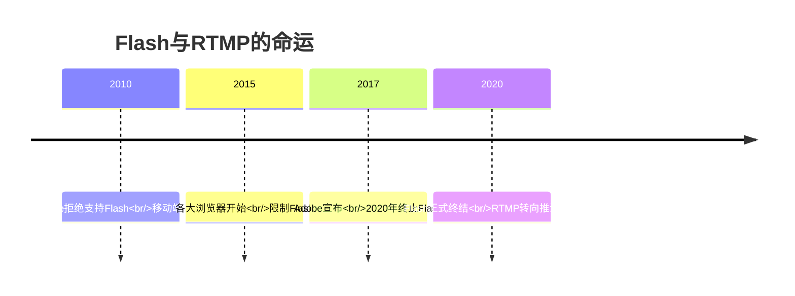

**解决方案**：
- **推流**：RTMP仍是主流选择
- **拉流**：转向HTTP-FLV、HLS、WebRTC

### 9.2 TCP的固有局限

RTMP基于TCP，继承了TCP的所有问题：

**1. 队头阻塞（Head-of-Line Blocking）**

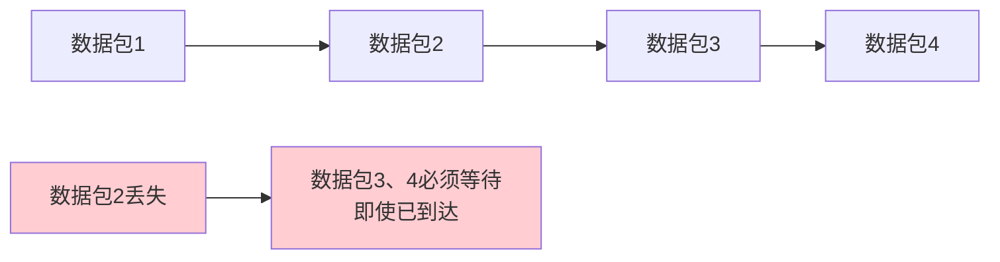

**2. 拥塞控制不适合流媒体**

TCP的拥塞控制是为可靠文件传输设计的，遇到丢包会大幅降低发送速率。但流媒体的特点是：
- 部分丢包可以接受（视频的冗余编码）
- 低延迟比完全可靠更重要

### 9.3 安全性问题

标准RTMP没有加密机制：

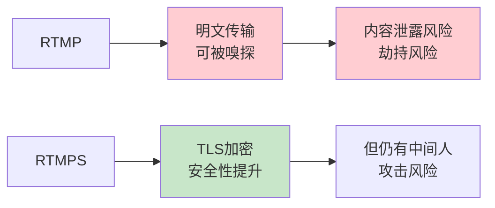

### 9.4 NAT穿透困难

RTMP默认使用1935端口，可能被防火墙阻止。虽然可以使用443端口（RTMPS），但需要证书配置。

---

## 十、RTMP的演进与未来

### 10.1 增强的RTMP

为解决原始RTMP的局限，社区提出了增强版本：

**1. 增强的数据类型**

```
传统RTMP消息类型：
- 音频(8)、视频(9)、数据(15-18)

增强RTMP消息类型：
- 扩展的元数据
- 更多的控制命令
- 支持新的编解码器（H.265/HEVC、AV1）
```

**2. 改进的握手**

新的握手方式提供更好的安全性：
- 支持加密握手
- 支持更复杂的验证机制

### 10.2 与现代技术的融合

```mermaid
flowchart TB
    A[RTMP推流] --> B[流媒体服务器]
    B --> C{转换协议}

    C -->|低延迟| D[WebRTC<br/><1秒]
    C -->|广泛兼容| E[HLS<br/>10-30秒]
    C -->|平衡方案| F[HTTP-FLV<br/>1-3秒]
    C -->|新兴标准| G[DASH/CMAF<br/>自适应]

    style D fill:#c8e6c9
    style E fill:#bbdefb
    style F fill:#fff3e0
    style G fill:#f3e5f5
```

### 10.3 SRT与RIST的挑战

新的传输协议正在挑战RTMP的地位：

| 协议 | 传输层 | 延迟 | 抗丢包 | 部署难度 |
|------|--------|------|--------|----------|
| RTMP | TCP | 中等 | 差 | 低 |
| SRT | UDP | 低 | 优秀 | 中等 |
| RIST | UDP | 低 | 优秀 | 中等 |

**SRT的优势**：
- 基于UDP，没有TCP的队头阻塞问题
- 内置FEC（前向纠错），更强的抗丢包能力
- 支持加密传输

**RTMP仍然活跃的原因**：

1. **分块机制解决了多路复用问题**：大消息不会阻塞小消息，这是实现低延迟的核心技术手段。

2. **二进制协议减少了解析开销**：相比文本协议，二进制格式更紧凑，解析更快。

3. **时间戳机制实现了同步播放**：音视频数据独立传输，通过时间戳实现精确同步。

4. **连接复用减少了开销**：多流共享一个连接，避免频繁建立连接的开销。

**RTMP的问题也源于其设计**：

1. **基于TCP带来的队头阻塞**：这是选择TCP的代价，但在当时的网络环境下是合理的权衡。

2. **Flash生态的消亡**：这是外部环境变化，而非协议本身的问题。

3. **缺乏现代安全机制**：这是时代局限，后来的RTMPS已有所改善。

### 最后的思考

技术没有银弹，RTMP的设计是特定时代背景下的最优解。它将TCP的可靠性与流媒体的实时性需求进行了优雅的平衡。即使在Flash消亡的今天，RTMP凭借其成熟的生态和稳定的性能，仍然是直播推流的主流选择。

理解RTMP，不仅是学习一个协议，更是理解如何在约束条件下做出优秀的系统设计。这种思维方式，才是技术人最宝贵的财富。

---