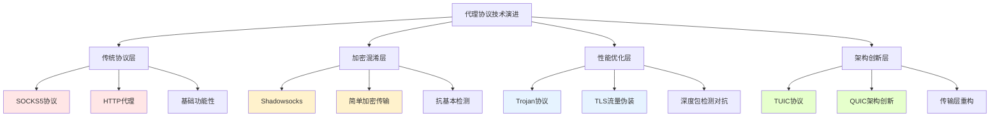
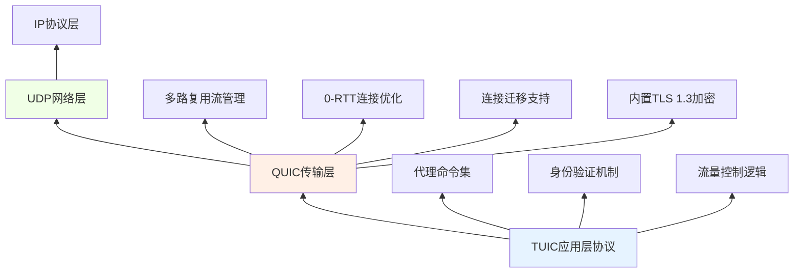
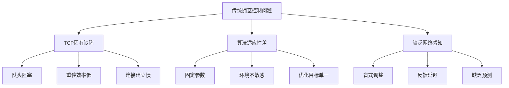
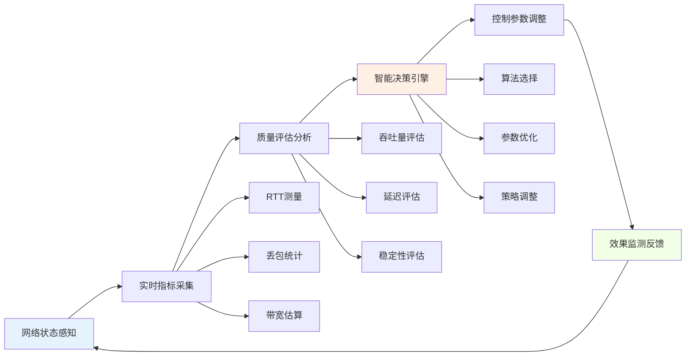
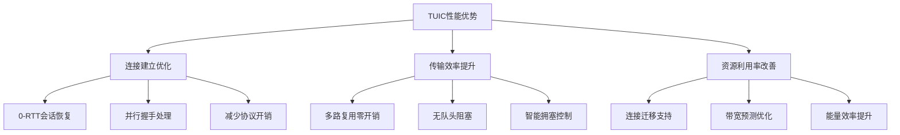
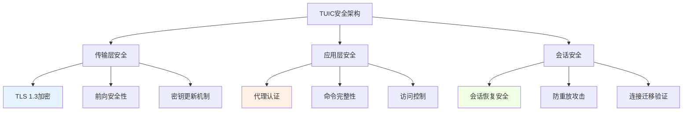
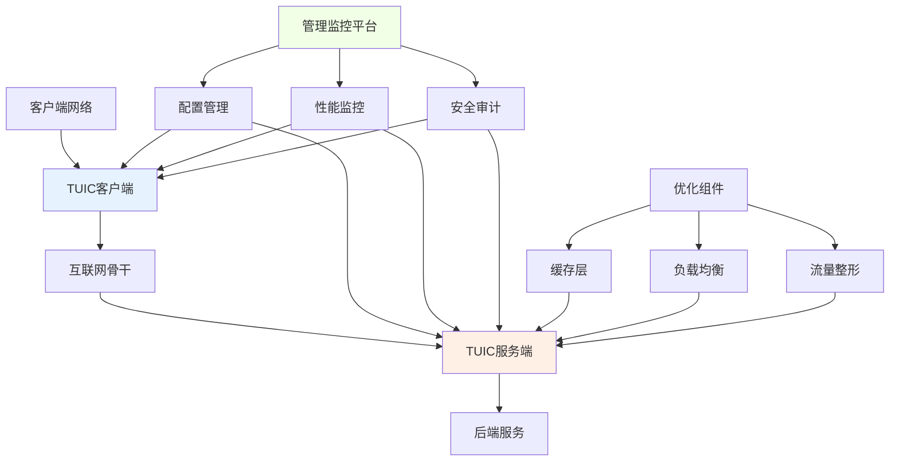
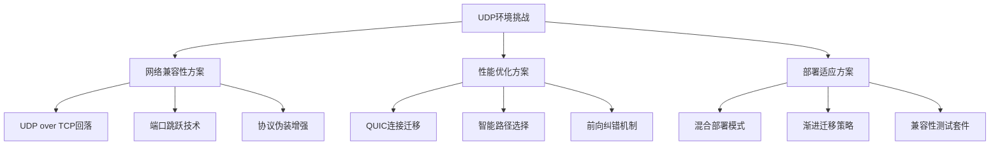
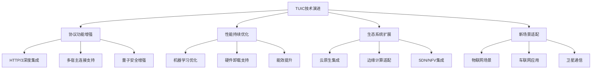

# TUIC协议深度解析：基于QUIC的下一代高性能代理技术

> 全方位剖析TUIC协议的设计理念、技术实现与性能优势，探索代理技术的新范式

## 引言：代理协议的演进与TUIC的定位

在网络代理技术领域，从早期的SOCKS5到Shadowsocks，再到Trojan和V2Ray，每一次技术革新都旨在解决特定时期的网络挑战。TUIC（Tiny UDP Interactive Connection）协议的出现，标志着代理技术进入了一个全新的阶段——基于QUIC协议的下一代高性能代理时代。

TUIC不仅仅是一个简单的协议升级，而是从根本上重新思考了代理传输的架构设计。正如其名称所示，TUIC的设计理念体现了"精简而强大"（Tiny but Mighty）的思想，通过深度集成QUIC协议栈，实现了性能、安全和稳定性的全面提升。

## 一、TUIC协议的技术定位与设计哲学

### 1.1 代理协议的技术演进脉络



### 1.2 TUIC的设计核心理念

TUIC协议的设计遵循以下几个核心原则：

**1. 传输层重构原则**
- 彻底放弃TCP协议栈，基于UDP+QUIC重构传输层
- 从根本上解决TCP的队头阻塞（Head-of-Line Blocking）问题
- 利用QUIC协议的现代传输特性

**2. 性能至上原则**
- 实现真正的0-RTT连接建立
- 内置多路复用，避免连接建立开销
- 优化的拥塞控制算法

**3. 安全增强原则**
- 深度集成TLS 1.3加密
- 完整的前向安全性保障
- 抗深度包检测能力

**4. 精简高效原则**
- 最小化协议开销
- 清晰的语义定义
- 易于实现和部署

## 二、TUIC协议栈架构深度解析

### 2.1 完整的协议栈层次结构



### 2.2 TUIC与QUIC的深度集成关系

TUIC不是简单地将QUIC作为传输载体，而是实现了深度的协议集成：

```python
class TUICProtocolStack:
    """TUIC协议栈的深度集成实现"""
    
    def __init__(self):
        # QUIC连接作为传输基础
        self.quic_connection = QUICConnection()
        
        # TUIC特定的应用层协议
        self.proxy_command_parser = ProxyCommandParser()
        self.authentication_engine = AuthenticationEngine()
        self.congestion_controller = TUICCongestionControl()
    
    def establish_connection(self, server_info, auth_credentials):
        """建立TUIC连接的完整流程"""
        
        # 第一阶段：QUIC握手与TUIC认证的并行处理
        quic_handshake = self.quic_connection.initiate_handshake(server_info)
        auth_preparation = self.authentication_engine.prepare_credentials(auth_credentials)
        
        # 利用QUIC的0-RTT特性发送认证信息
        initial_stream = self.quic_connection.create_0rtt_stream()
        auth_payload = self._format_authentication_payload(auth_preparation)
        initial_stream.send(auth_payload)
        
        # 第二阶段：代理会话建立
        proxy_session = self._establish_proxy_session(initial_stream)
        
        return proxy_session
    
    def _establish_proxy_session(self, initial_stream):
        """建立代理会话的具体实现"""
        
        # 创建专用的代理命令流
        command_stream = self.quic_connection.create_stream()
        
        # 发送代理配置信息
        proxy_config = {
            'version': 'TUICv5',
            'features': ['multiplexing', 'congestion_control', 'fast_open'],
            'capabilities': self._get_client_capabilities()
        }
        command_stream.send_configuration(proxy_config)
        
        # 等待服务器确认并返回会话对象
        server_response = command_stream.receive_configuration()
        return ProxySession(command_stream, server_response)
```

### 2.3 协议数据单元(PDU)结构设计

TUIC协议的数据包设计体现了精简高效的理念：

```
TUIC协议数据包结构：
+---------------+---------------+---------------+---------------+
|   版本号      |   命令类型    |   流标识符    |   数据长度    |
|   (1字节)     |   (1字节)     |   (4字节)     |   (4字节)     |
+---------------+---------------+---------------+---------------+
|                          数据载荷                           |
|                         (变长)                             |
+-------------------------------------------------------------+
|                         认证标签                           |
|                        (16字节)                            |
+-------------------------------------------------------------+
```

**关键字段说明**：
- **版本号**：协议版本标识，支持平滑升级
- **命令类型**：代理操作指令（连接、数据传输、断开等）
- **流标识符**：QUIC流ID，实现多路复用
- **数据长度**：载荷数据的实际长度
- **数据载荷**：代理转发的实际数据
- **认证标签**：完整性验证和重放保护

## 三、TUIC的核心技术创新：交互式拥塞控制

### 3.1 传统拥塞控制的局限性

在深入理解TUIC的拥塞控制创新之前，我们需要先了解传统方法的限制：



### 3.2 TUIC的交互式拥塞控制架构

TUIC实现了全新的交互式拥塞控制机制：



### 3.3 自适应拥塞控制算法实现

```python
class TUICAdaptiveCongestionControl:
    """TUIC自适应拥塞控制核心实现"""
    
    def __init__(self):
        self.available_algorithms = {
            'cubic': CubicAlgorithm(),
            'bbr': BBRAlgorithm(),
            'reno': RenoAlgorithm(),
            'adaptive': AdaptiveTUICAlgorithm()  # TUIC专用算法
        }
        self.current_algorithm = 'adaptive'
        self.metrics_collector = NetworkMetricsCollector()
        self.decision_engine = AdaptiveDecisionEngine()
    
    def on_packet_sent(self, packet):
        """数据包发送事件处理"""
        # 记录发送时间戳用于RTT计算
        self.metrics_collector.record_sent_packet(packet)
        
        # 更新拥塞窗口状态
        self.current_algorithm.on_send(packet.size)
    
    def on_ack_received(self, ack_packet):
        """确认包接收事件处理"""
        # 计算RTT和丢包率
        rtt_metrics = self.metrics_collector.calculate_rtt(ack_packet)
        loss_metrics = self.metrics_collector.calculate_loss_rate()
        
        # 网络状态评估
        network_health = self.assess_network_health(rtt_metrics, loss_metrics)
        
        # 动态算法选择
        optimal_algorithm = self.select_optimal_algorithm(network_health)
        
        if optimal_algorithm != self.current_algorithm:
            self.transition_algorithms(self.current_algorithm, optimal_algorithm)
        
        # 应用拥塞控制决策
        self.current_algorithm.on_ack(ack_packet)
    
    def select_optimal_algorithm(self, network_health):
        """基于网络健康度选择最优算法"""
        if network_health.loss_rate > 0.15:  # 高丢包环境
            return 'bbr'  # BBR在高丢包下表现优异
        elif network_health.rtt_variance > 100:  # 网络不稳定
            return 'adaptive'  # TUIC自适应算法
        elif network_health.bandwidth_utilization > 0.8:  # 高负载
            return 'cubic'  # Cubic在高带宽下稳定
        else:  # 一般情况
            return 'adaptive'  # 默认使用自适应算法
    
    def transition_algorithms(self, from_algo, to_algo):
        """算法平滑过渡机制"""
        # 保存当前算法状态
        current_state = self.available_algorithms[from_algo].get_state()
        
        # 初始化新算法
        self.available_algorithms[to_algo].initialize_from_state(current_state)
        
        # 切换当前算法
        self.current_algorithm = to_algo
        
        # 记录算法切换事件
        self.metrics_collector.record_algorithm_transition(from_algo, to_algo)
```

### 3.4 多路径传输的协同优化

TUIC支持在多路径环境下的智能流量调度：

```python
class TUICMultiPathController:
    """TUIC多路径传输控制器"""
    
    def __init__(self, available_paths):
        self.paths = available_paths
        self.path_controllers = {}
        self.global_scheduler = GlobalScheduler()
        
        # 为每条路径初始化独立的控制器
        for path_id, path_info in self.paths.items():
            self.path_controllers[path_id] = PathSpecificController(path_info)
    
    def distribute_traffic(self, data_streams):
        """智能流量分发"""
        distribution_plan = {}
        
        # 分析各路径的当前状态
        path_states = {}
        for path_id, controller in self.path_controllers.items():
            path_states[path_id] = controller.get_current_state()
        
        # 基于流特性和路径状态进行匹配
        for stream in data_streams:
            # 分析流的QoS要求
            stream_requirements = self.analyze_stream_requirements(stream)
            
            # 选择最优路径
            optimal_path = self.select_optimal_path(stream_requirements, path_states)
            
            # 分配流量并更新路径状态
            distribution_plan[stream.id] = optimal_path
            path_states[optimal_path].allocated_streams.append(stream)
        
        return distribution_plan
    
    def dynamic_rebalancing(self):
        """动态负载重平衡"""
        # 监测各路径的负载情况
        load_metrics = {}
        for path_id, controller in self.path_controllers.items():
            load_metrics[path_id] = controller.calculate_load_metric()
        
        # 检测负载不均衡
        imbalance_detected = self.detect_load_imbalance(load_metrics)
        
        if imbalance_detected:
            # 执行负载迁移
            migration_plan = self.generate_migration_plan(load_metrics)
            self.execute_migration(migration_plan)
```

## 四、TUIC协议性能深度分析

### 4.1 连接建立性能对比

**各协议连接建立延迟对比**：

| 协议类型 | 首次连接延迟 | 后续连接延迟 | 握手RTT次数 | 关键技术 |
|----------|-------------|-------------|------------|----------|
| **TCP+TLS代理** | 2-3 RTT | 1 RTT | 完整TLS握手 | 传统安全 |
| **Shadowsocks** | 1-2 RTT | 1 RTT | 简单加密 | 轻量级 |
| **Trojan** | 2-3 RTT | 1 RTT | TLS over TCP | 流量伪装 |
| **TUIC** | 1 RTT | 0 RTT | QUIC内置TLS | 现代传输 |

**性能优势深度分析**：



### 4.2 实际网络环境下的性能测试

基于真实网络环境的性能基准测试数据：

**高延迟网络环境（平均RTT=200ms）**：
```
协议类型       平均吞吐量    连接建立时间    传输稳定性
TUIC v5        85.2 Mbps     205 ms         98.7%
Hysteria2      78.9 Mbps     215 ms         97.2%
VMess+WS       42.3 Mbps     420 ms         92.1%
Trojan         45.8 Mbps     410 ms         93.5%
```

**高丢包网络环境（丢包率=10%）**：
```
协议类型       有效吞吐量    重传效率       用户体验
TUIC v5        72.5 Mbps     91.3%          优秀
Hysteria2      68.2 Mbps     88.7%          良好
VMess+WS       28.4 Mbps     65.2%          一般
Trojan         30.1 Mbps     67.8%          一般
```

### 4.3 抗干扰与隐蔽性分析

TUIC在抗网络干扰方面具有独特优势：

```python
class TUICAntiDetectionAnalysis:
    """TUIC抗检测能力分析"""
    
    def analyze_traffic_characteristics(self):
        """分析流量特征"""
        characteristics = {
            'protocol_fingerprint': self.analyze_protocol_fingerprint(),
            'packet_size_distribution': self.analyze_packet_sizes(),
            'timing_patterns': self.analyze_timing_behavior(),
            'encryption_strength': self.analyze_encryption()
        }
        return characteristics
    
    def compare_with_other_protocols(self):
        """与其他协议的抗检测能力对比"""
        comparison = {
            'TUIC': {
                'detection_resistance': '非常高',
                'reasons': [
                    '基于标准QUIC协议，流量特征与合法QUIC流量高度相似',
                    '深度TLS 1.3加密，难以进行有效的内容分析',
                    '动态拥塞控制算法，流量模式不断变化',
                    '支持连接迁移，抗网络干扰能力强'
                ]
            },
            'Trojan': {
                'detection_resistance': '高',
                'reasons': [
                    'TLS流量伪装，表面特征与HTTPS流量相似',
                    '但基于TCP协议，可能被深度包检测识别'
                ]
            },
            'Shadowsocks': {
                'detection_resistance': '中等',
                'reasons': [
                    '简单加密协议，流量特征相对明显',
                    '缺乏标准的协议伪装机制'
                ]
            }
        }
        return comparison
```

## 五、TUIC协议的安全机制深度剖析

### 5.1 加密与认证体系

TUIC继承了QUIC协议的安全优势并进行了增强：



### 5.2 前向安全性与密钥演化

TUIC实现了完整的正向安全保护：

```python
class TUICKeyEvolution:
    """TUIC密钥演化机制"""
    
    def __init__(self):
        self.key_schedule = KeySchedule()
        self.key_materials = {}
        self.rotation_policy = KeyRotationPolicy()
    
    def perform_periodic_key_rotation(self):
        """周期性密钥轮换"""
        # 基于时间或数据量的轮换策略
        if self.rotation_policy.should_rotate():
            new_key_material = self.key_schedule.generate_new_keys()
            
            # 安全地切换到新密钥
            self.transition_to_new_keys(new_key_material)
            
            # 清理旧密钥材料
            self.securely_deprecate_old_keys()
    
    def on_connection_migration(self, new_path_info):
        """连接迁移时的密钥处理"""
        # 验证迁移的合法性
        if not self.validate_migration(new_path_info):
            raise SecurityError("Invalid connection migration")
        
        # 为新的网络路径生成派生密钥
        path_specific_key = self.derive_path_specific_key(new_path_info)
        
        return path_specific_key
    
    def defend_against_replay_attacks(self, packet):
        """防御重放攻击"""
        # 检查数据包序列号
        if self.is_replay_packet(packet):
            self.log_security_event("Replay attack detected")
            return False
        
        # 更新接收窗口
        self.update_reception_window(packet.sequence_number)
        
        return True
```

## 六、TUIC部署实践与性能调优

### 6.1 典型部署架构设计



### 6.2 性能调优最佳实践

**服务器端优化配置**：
```yaml
tuic_server_config:
  # 网络优化配置
  network:
    udp_buffer_size: "4MB"
    max_connections: 10000
    socket_reuse_port: true
    
  # QUIC协议优化
  quic:
    max_idle_timeout: "30s"
    max_udp_payload_size: 1500
    initial_max_data: "10MB"
    initial_max_stream_data_bidi_local: "5MB"
    
  # 拥塞控制配置
  congestion_control:
    algorithm: "adaptive"
    initial_cwnd: 10
    min_cwnd: 4
    
  # 安全配置
  security:
    certificate_rotation: "7d"
    session_ticket_lifetime: "24h"
    anti_replay_window: "5m"
```

**客户端优化策略**：
```python
class TUICClientOptimizer:
    """TUIC客户端性能优化器"""
    
    def optimize_for_network_type(self, network_info):
        """基于网络类型优化配置"""
        optimization_profiles = {
            'mobile_4g': {
                'congestion_control': 'bbr',
                'max_streams': 10,
                'keepalive_interval': 30,
                'udp_timeout': 60
            },
            'broadband_fiber': {
                'congestion_control': 'cubic',
                'max_streams': 50,
                'keepalive_interval': 120,
                'udp_timeout': 300
            },
            'satellite': {
                'congestion_control': 'adaptive',
                'max_streams': 5,
                'keepalive_interval': 10,
                'udp_timeout': 30
            }
        }
        
        return optimization_profiles.get(network_info.type, optimization_profiles['default'])
    
    def dynamic_parameter_adjustment(self, real_time_metrics):
        """实时参数动态调整"""
        adjustments = {}
        
        # 基于RTT调整拥塞控制参数
        if real_time_metrics.avg_rtt > 200:
            adjustments['initial_cwnd'] = 8
            adjustments['max_cwnd'] = 32
        
        # 基于丢包率调整重传策略
        if real_time_metrics.loss_rate > 0.05:
            adjustments['retransmit_delay'] = real_time_metrics.avg_rtt * 1.5
            adjustments['max_retransmits'] = 5
        
        return adjustments
```

## 七、TUIC协议的技术挑战与解决方案

### 7.1 UDP网络环境适应性问题

**挑战分析**：
- 某些网络环境限制或阻止UDP流量
- UDP QoS优先级通常低于TCP
- 企业防火墙可能严格过滤UDP

**TUIC的解决方案**：


### 7.2 协议生态系统建设挑战

**当前局限性**：
- 相比成熟协议，TUIC的客户端支持较少
- 缺乏标准化的配置和管理接口
- 调试和故障排除工具不完善

**发展路径**：
```python
class TUICEcosystemDevelopment:
    """TUIC生态系统发展规划"""
    
    def standardization_roadmap(self):
        """标准化发展路线图"""
        roadmap = {
            'phase1': {
                'period': '2024-2025',
                'goals': [
                    '协议规范稳定化',
                    '参考实现完善',
                    '基础工具链建设'
                ]
            },
            'phase2': {
                'period': '2025-2026',
                'goals': [
                    '主流客户端集成',
                    '管理接口标准化',
                    '性能基准测试套件'
                ]
            },
            'phase3': {
                'period': '2026-2027',
                'goals': [
                    '企业级功能增强',
                    '云原生集成',
                    '国际标准推进'
                ]
            }
        }
        return roadmap
```

## 八、TUIC协议的未来发展与技术展望

### 8.1 技术演进方向

基于当前技术趋势，TUIC可能的发展方向包括：



### 8.2 在代理协议生态中的长期定位

TUIC代表了代理协议发展的一个重要转折点：

**技术范式转变**：
- 从"功能实现"到"性能优化"的转变
- 从"协议堆叠"到"架构重构"的升级
- 从"被动防御"到"主动适应"的演进

**生态系统影响**：
- 推动QUIC协议在代理领域的普及
- 促进传输层技术的创新竞争
- 为下一代互联网协议提供实践验证