# Wi-Fi协议完全指南：从802.11到Wi-Fi 7的技术革命

> 深度解析无线局域网协议的演进历程，聚焦Wi-Fi 7如何重新定义无线连接体验

## 一、引言：无线自由的技术基石

Wi-Fi，这个我们日常生活中无处不在的技术，已经从最初的2Mbps低速连接发展到今天的多千兆高速无线。在物联网、VR/AR、8K视频流等新兴应用的推动下，Wi-Fi技术经历了持续的技术革新。Wi-Fi 7（802.11be）作为最新一代标准，正在重新定义无线连接的边界。

## 二、Wi-Fi技术基础：理解无线通信原理

### 2.1 无线频谱与调制技术

Wi-Fi技术建立在射频通信基础之上：

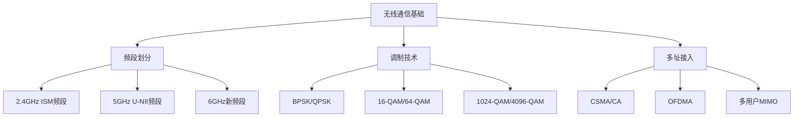

**关键频段特性对比**：

| 频段 | 频率范围 | 信道带宽 | 穿透能力 | 覆盖范围 |
|------|----------|----------|----------|----------|
| 2.4GHz | 2.4-2.4835GHz | 20/40MHz | 强 | 远 |
| 5GHz | 5.15-5.85GHz | 20/40/80/160MHz | 中等 | 中等 |
| 6GHz | 5.925-7.125GHz | 80/160/320MHz | 弱 | 近 |

### 2.2 CSMA/CA：Wi-Fi的媒体访问控制

与传统以太网的CSMA/CD不同，Wi-Fi采用CSMA/CA（载波侦听多路访问/冲突避免）：

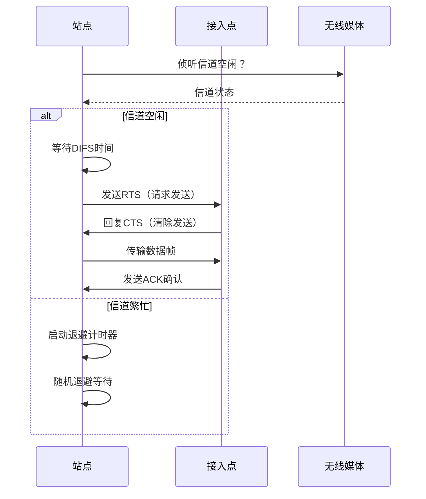

## 三、Wi-Fi协议演进史：从1997到2024

### 3.1 早期标准：奠定基础

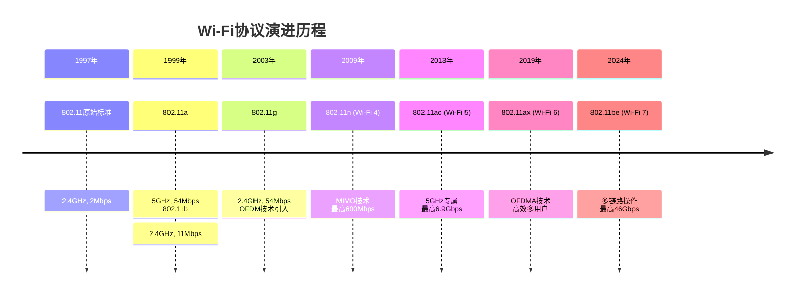

### 3.2 各代Wi-Fi技术关键特性

**完整技术参数对比表**：

| 标准 | 命名 | 发布时间 | 最大速率 | 关键技术 | 频段支持 |
|------|------|----------|----------|----------|----------|
| 802.11 | - | 1997 | 2 Mbps | FHSS/DSSS | 2.4 GHz |
| 802.11b | - | 1999 | 11 Mbps | CCK调制 | 2.4 GHz |
| 802.11a | - | 1999 | 54 Mbps | OFDM | 5 GHz |
| 802.11g | - | 2003 | 54 Mbps | OFDM | 2.4 GHz |
| 802.11n | Wi-Fi 4 | 2009 | 600 Mbps | MIMO, 40MHz | 2.4/5 GHz |
| 802.11ac | Wi-Fi 5 | 2013 | 6.9 Gbps | MU-MIMO, 160MHz | 5 GHz |
| 802.11ax | Wi-Fi 6 | 2019 | 9.6 Gbps | OFDMA, 1024-QAM | 2.4/5/6 GHz |
| 802.11be | Wi-Fi 7 | 2024 | 46 Gbps | MLO, 4096-QAM | 2.4/5/6 GHz |

## 四、Wi-Fi 6关键技术深度解析

### 4.1 OFDMA：正交频分多址

Wi-Fi 6引入的OFDMA技术彻底改变了信道分配方式：

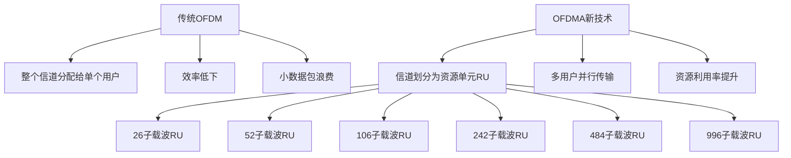

**OFDMA工作流程**：
```python
class OFDMAScheduler:
    """OFDMA调度器模拟"""
    
    def __init__(self):
        self.channel_width = 80  # MHz
        self.subcarriers = 234  # 80MHz信道的子载波数
        self.rus_available = self.calculate_rus()
        self.users = []
    
    def calculate_rus(self):
        """计算可用资源单元"""
        # 标准RU大小：26, 52, 106, 242, 484, 996子载波
        return {
            'RU26': 9,    # 9个26-tone RU
            'RU52': 4,    # 4个52-tone RU  
            'RU106': 2,   # 2个106-tone RU
            'RU242': 1,   # 1个242-tone RU（传统OFDM）
        }
    
    def schedule_transmission(self, user_data):
        """OFDMA调度算法"""
        scheduled_users = []
        
        # 按数据量从小到大排序
        sorted_users = sorted(user_data, key=lambda x: x['data_size'])
        
        for user in sorted_users:
            ru_type = self.select_optimal_ru(user['data_size'])
            if self.rus_available[ru_type] > 0:
                scheduled_users.append({
                    'user': user['id'],
                    'ru_type': ru_type,
                    'data_size': user['data_size']
                })
                self.rus_available[ru_type] -= 1
        
        return scheduled_users
    
    def select_optimal_ru(self, data_size):
        """根据数据量选择最优RU大小"""
        if data_size <= 100:  # 小数据包
            return 'RU26'
        elif data_size <= 200:
            return 'RU52'
        elif data_size <= 500:
            return 'RU106'
        else:  # 大数据量
            return 'RU242'
```

### 4.2 1024-QAM高阶调制

Wi-Fi 6将调制阶数从256-QAM提升到1024-QAM：

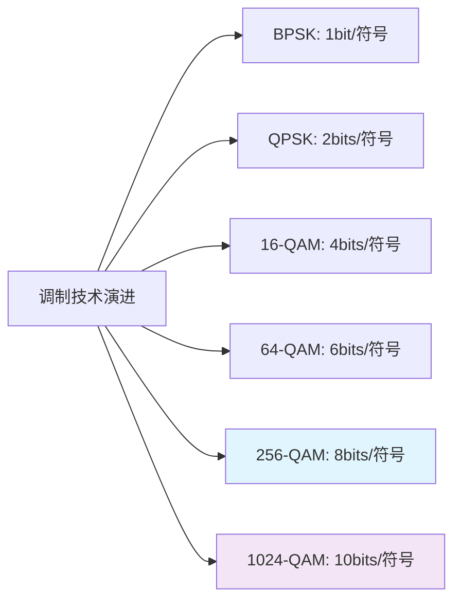

**调制阶数对速率的影响**：
```
理论速率 = 子载波数 × 每个子载波的比特数 × 编码率 × 符号率

示例：80MHz信道，1024-QAM，5/6编码率
子载波数：234
每符号比特：10 bits（1024-QAM）
编码率：5/6
符号率：考虑保护间隔等

速率提升 = 10/8 = 25%（相比256-QAM）
```

## 五、Wi-Fi 7革命性技术深度解析

### 5.1 多链路操作（MLO）

Wi-Fi 7最核心的创新是多链路操作技术：

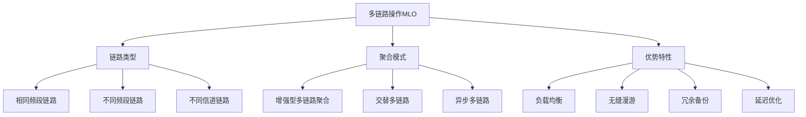

**MLO的三种工作模式**：

1. **异步多链路模式**：不同链路独立运作，各自有MAC实体
2. **同步多链路模式**：多个链路协同工作，共享MAC状态
3. **交替多链路模式**：设备在不同链路间快速切换

### 5.2 320MHz信道带宽

Wi-Fi 7将最大信道带宽扩展到320MHz：

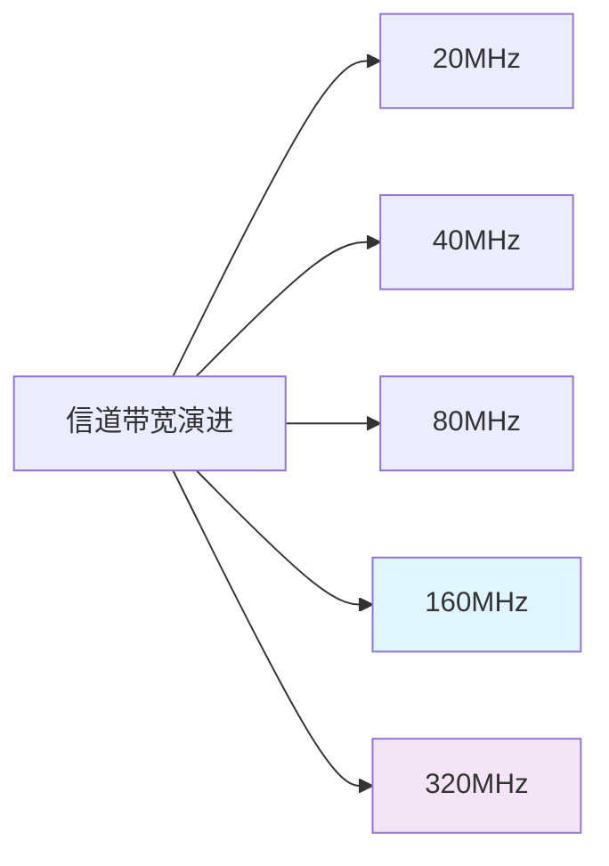

**带宽扩展的技术挑战与解决方案**：

```python
class ChannelBondingManager:
    """信道绑定管理"""
    
    def __init__(self):
        self.available_channels = self.scan_channels()
        self.bonding_modes = ['20MHz', '40MHz', '80MHz', '160MHz', '320MHz']
    
    def scan_channels(self):
        """扫描可用信道"""
        return {
            '2.4GHz': [1, 6, 11],  # 非重叠信道
            '5GHz': [36, 40, 44, 48, 149, 153, 157, 161],
            '6GHz': list(range(1, 233))  # 6GHz大量新信道
        }
    
    def form_320mhz_channel(self):
        """组建320MHz信道"""
        # 在6GHz频段更容易实现连续320MHz
        six_ghz_channels = self.available_channels['6GHz']
        
        # 寻找连续的4个80MHz区块或2个160MHz区块
        potential_bonds = []
        
        # 检查连续信道可用性
        for i in range(0, len(six_ghz_channels) - 3, 4):
            if self.check_channel_continuity(six_ghz_channels[i:i+4]):
                potential_bonds.append(six_ghz_channels[i:i+4])
        
        return potential_bonds
    
    def calculate_throughput_gain(self, old_bw, new_bw):
        """计算带宽扩展带来的吞吐量增益"""
        bw_ratio = new_bw / old_bw
        # 考虑实际环境中的效率损失
        effective_gain = bw_ratio * 0.85  # 15%的效率损失
        return effective_gain
```

### 5.3 4096-QAM超高阶调制

Wi-Fi 7将调制阶数进一步提升到4096-QAM：

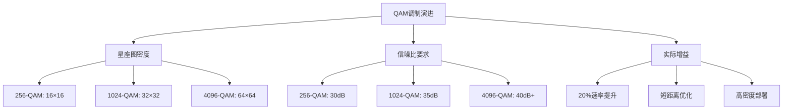

**4096-QAM的技术实现挑战**：
- **相位噪声**：需要更精确的本地振荡器
- **功率放大器线性度**：避免信号失真
- **信道估计精度**：精确的信道状态信息
- **纠错编码**：更强的前向纠错能力

### 5.4 多资源单元（MRU）技术

Wi-Fi 7扩展了OFDMA能力，支持多个非连续RU的绑定：

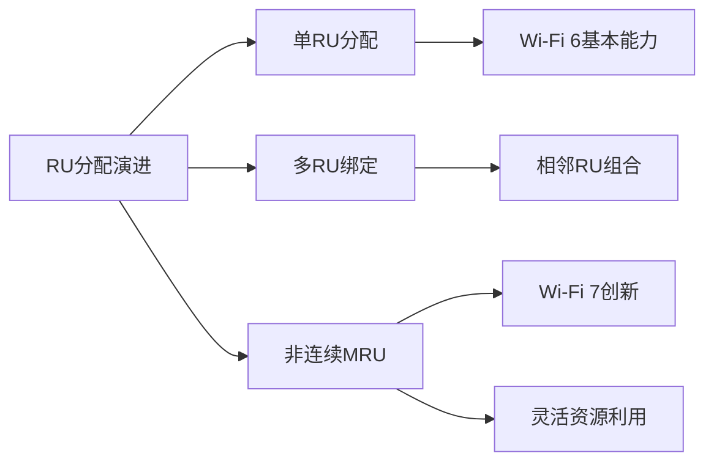

## 六、Wi-Fi 7性能提升量化分析

### 6.1 理论速率计算

**Wi-Fi 7最大理论速率计算**：
```
关键参数：
- 最大带宽：320MHz
- 最高调制：4096-QAM（12bits/符号）
- 空间流：16×16 MIMO
- 编码率：5/6
- 符号时间：考虑保护间隔

计算公式：
速率 = 子载波数 × 每符号比特 × 空间流数 × 编码率 × 符号率

近似计算：
≈ 子载波数 × 12 × 16 × (5/6) × 符号率
≈ 46 Gbps（最大理论值）
```

### 6.2 实际场景性能对比

**各代Wi-Fi在实际环境中的性能表现**：

| 场景类型 | Wi-Fi 5 | Wi-Fi 6 | Wi-Fi 6E | Wi-Fi 7 |
|----------|---------|---------|----------|---------|
| 单设备近距离 | 800 Mbps | 1.2 Gbps | 1.6 Gbps | 2.4 Gbps |
| 多设备高密度 | 200 Mbps | 600 Mbps | 800 Mbps | 1.5 Gbps |
| 隔墙性能 | 150 Mbps | 300 Mbps | 400 Mbps | 800 Mbps |
| 延迟（游戏） | 15-20ms | 8-12ms | 5-8ms | 2-5ms |
| 多用户效率 | 较低 | 中等 | 良好 | 优秀 |

### 6.3 关键性能指标提升

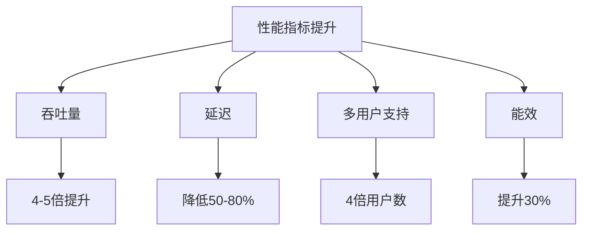

## 七、Wi-Fi 7的应用场景与部署考量

### 7.1 目标应用场景

**Wi-Fi 7专门优化的应用类型**：

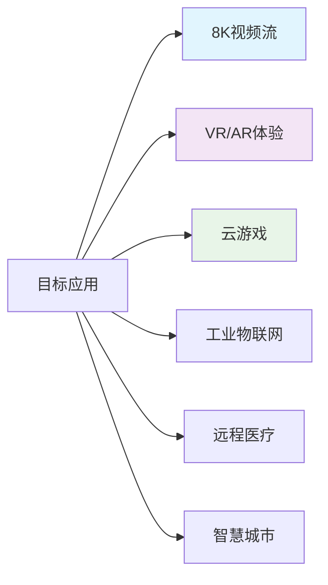

### 7.2 部署实践指南

**企业级Wi-Fi 7部署考量**：

```python
class WiFi7DeploymentPlanner:
    """Wi-Fi 7部署规划器"""
    
    def __init__(self):
        self.requirements = {}
        self.constraints = {}
    
    def assess_environment(self, site_survey):
        """环境评估"""
        assessment = {
            'current_infrastructure': self.check_existing_gear(),
            'spectrum_analysis': self.analyze_rf_environment(),
            'user_density': self.project_user_growth(),
            'application_requirements': self.identify_use_cases()
        }
        return assessment
    
    def plan_ap_placement(self, coverage_area, user_density):
        """AP部署规划"""
        # Wi-Fi 7的覆盖特性
        ap_plan = {
            '2.4GHz_coverage': '广覆盖，高穿透',
            '5GHz_capacity': '主力频段，平衡覆盖与容量',
            '6GHz_performance': '高性能区域，低干扰'
        }
        
        # 考虑多链路操作的AP间协调
        if user_density > 100:  # 高密度场景
            ap_plan['mlo_coordination'] = '需要智能AP间协调'
            ap_plan['channel_reuse'] = '精细规划避免干扰'
        
        return ap_plan
    
    def calculate_roi(self, investment, benefits):
        """投资回报分析"""
        # Wi-Fi 7的ROI考量
        tangible_benefits = benefits.get('productivity_gain', 0) + \
                          benefits.get('ops_efficiency', 0)
        
        intangible_benefits = benefits.get('future_readiness', 0.2) + \
                            benefits.get('competitive_advantage', 0.15)
        
        total_benefit = tangible_benefits * (1 + intangible_benefits)
        roi_period = investment / total_benefit
        
        return {
            'payback_period': f"{roi_period:.1f}年",
            'annual_benefit': total_benefit,
            'strategic_value': '高' if intangible_benefits > 0.3 else '中'
        }
```

## 八、Wi-Fi安全协议演进

### 8.1 WPA3安全增强

Wi-Fi 7强制要求WPA3安全协议：

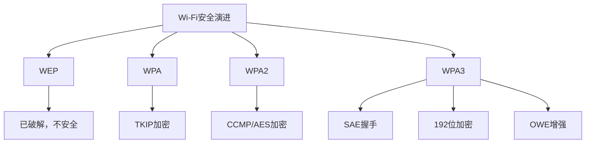

### 8.2 同时认证 equals（SAE）

WPA3的核心改进——抗离线字典攻击的握手协议：

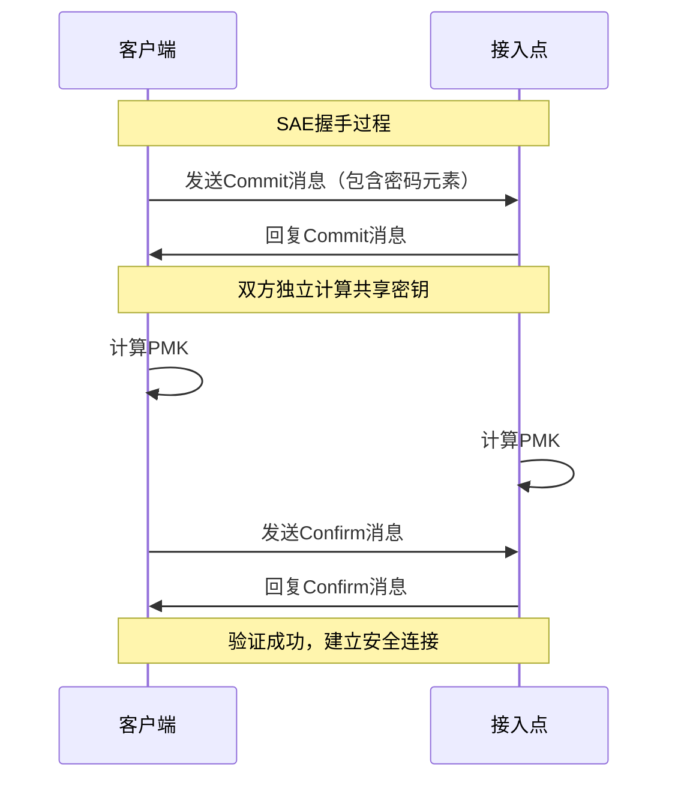

## 九、Wi-Fi 7与5G/6G的协同

### 9.1 无线技术融合趋势

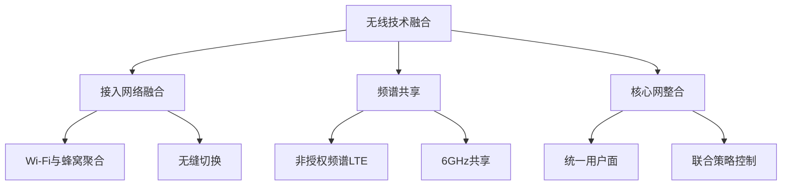

### 9.2 ATSSS（接入流量引导、交换和分裂）

3GPP Release 16引入的多接入技术集成：

```python
class ATSSSController:
    """多接入流量管理"""
    
    def __init__(self):
        self.available_access = ['5G', 'Wi-Fi7', '有线']
        self.policies = {}
    
    def determine_routing(self, traffic_flow):
        """根据流量特性决定路由策略"""
        flow_characteristics = self.analyze_flow(traffic_flow)
        
        if flow_characteristics['latency_sensitive']:
            # 低延迟流量优先选择5G或Wi-Fi 7低延迟链路
            return self.low_latency_routing(flow_characteristics)
        elif flow_characteristics['high_throughput']:
            # 高吞吐量流量使用Wi-Fi 7聚合
            return self.high_throughput_routing(flow_characteristics)
        else:
            # 一般流量负载均衡
            return self.load_balanced_routing(flow_characteristics)
    
    def multi_link_aggregation(self, wifi7_links):
        """Wi-Fi 7多链路聚合"""
        aggregated_capacity = sum(link['capacity'] for link in wifi7_links)
        
        # 考虑各链路的信号质量和负载
        effective_capacity = 0
        for link in wifi7_links:
            # 信号质量权重
            quality_factor = link['snr'] / 40  # 标准化到0-1
            load_factor = 1 - (link['utilization'] / 100)
            effective_capacity += link['capacity'] * quality_factor * load_factor
        
        return effective_capacity
```

## 十、未来展望：Wi-Fi 8与无线技术趋势

### 10.1 Wi-Fi 8技术前瞻

基于IEEE 802.11bn（Wi-Fi 8）的早期讨论：

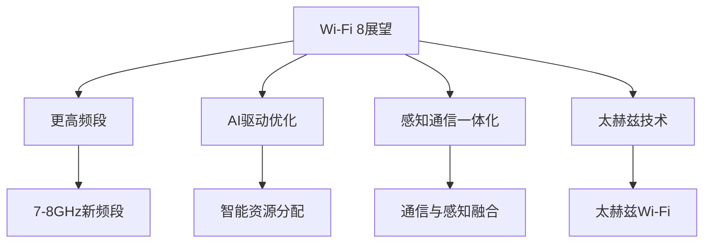

### 10.2 关键发展趋势

**技术融合方向**：
#### 感知与通信融合
- **Wi-Fi Sensing**：利用Wi-Fi信号进行手势识别、人员检测
- **环境感知**：通过信道状态信息感知环境变化
- **定位增强**：亚米级精度的室内定位

#### 人工智能赋能
10.3 AI驱动的Wi-Fi优化

```python
class AIWiFiOptimizer:
    """AI驱动的Wi-Fi优化器"""
    
    def __init__(self):
        self.ml_models = {}
        self.historical_data = []
    
    def predictive_optimization(self, network_state):
        """预测性优化"""
        # 基于历史数据的模式识别
        patterns = self.identify_usage_patterns()
        
        # 预测未来流量需求
        traffic_forecast = self.forecast_traffic(patterns)
        
        # 自适应参数调整
        optimization_decisions = {
            'channel_selection': self.ai_channel_selection(),
            'power_control': self.ai_power_management(),
            'beamforming': self.ai_beamforming_optimization(),
            'mlo_strategy': self.dynamic_mlo_management()
        }
        
        return optimization_decisions
    
    def self_healing_network(self, fault_detection):
        """自愈网络能力"""
        if fault_detection['type'] == 'interference':
            return self.mitigate_interference(fault_detection)
        elif fault_detection['type'] == 'congestion':
            return self.alleviate_congestion(fault_detection)
        elif fault_detection['type'] == 'coverage_hole':
            return self.coverage_optimization(fault_detection)
```


---

# Wi-Fi技术参数详细对比表
## Wi-Fi各代标准全面技术参数
### 物理层参数对比
| 技术标准 | 发布时间 | 频段支持 | 最大信道带宽 | 子载波间隔 | 最大空间流 | 调制方式 | 最大数据速率 |
|----------|----------|----------|--------------|------------|------------|----------|--------------|
| **802.11** | 1997 | 2.4GHz | 20MHz | 312.5kHz | 1 | BPSK/QPSK | 2 Mbps |
| **802.11b** | 1999 | 2.4GHz | 20MHz | 312.5kHz | 1 | CCK | 11 Mbps |
| **802.11a** | 1999 | 5GHz | 20MHz | 312.5kHz | 1 | BPSK-64QAM | 54 Mbps |
| **802.11g** | 2003 | 2.4GHz | 20MHz | 312.5kHz | 1 | BPSK-64QAM | 54 Mbps |
| **802.11n (Wi-Fi 4)** | 2009 | 2.4/5GHz | 40MHz | 312.5kHz | 4 | BPSK-64QAM | 600 Mbps |
| **802.11ac Wave1 (Wi-Fi 5)** | 2013 | 5GHz | 80MHz | 312.5kHz | 8 | BPSK-256QAM | 3.47 Gbps |
| **802.11ac Wave2 (Wi-Fi 5)** | 2015 | 5GHz | 160MHz | 312.5kHz | 8 | BPSK-256QAM | 6.93 Gbps |
| **802.11ax (Wi-Fi 6)** | 2019 | 2.4/5/6GHz | 160MHz | 78.125kHz | 8 | BPSK-1024QAM | 9.6 Gbps |
| **802.11be (Wi-Fi 7)** | 2024 | 2.4/5/6GHz | 320MHz | 78.125kHz | 16 | BPSK-4096QAM | 46 Gbps |
### 调制与编码方案(MCS)索引表
#### Wi-Fi 6 (802.11ax) MCS表 (80MHz信道示例)
| MCS索引 | 调制方式 | 编码率 | 数据子载波 | 每符号数据比特 | 理论速率(80MHz) |
|---------|----------|--------|------------|----------------|-----------------|
| MCS 0 | BPSK | 1/2 | 234 | 117 | 58.5 Mbps |
| MCS 1 | QPSK | 1/2 | 234 | 234 | 117 Mbps |
| MCS 2 | QPSK | 3/4 | 234 | 351 | 175.5 Mbps |
| MCS 3 | 16-QAM | 1/2 | 234 | 468 | 234 Mbps |
| MCS 4 | 16-QAM | 3/4 | 234 | 702 | 351 Mbps |
| MCS 5 | 64-QAM | 2/3 | 234 | 936 | 468 Mbps |
| MCS 6 | 64-QAM | 3/4 | 234 | 1053 | 526.5 Mbps |
| MCS 7 | 64-QAM | 5/6 | 234 | 1170 | 585 Mbps |
| MCS 8 | 256-QAM | 3/4 | 234 | 1404 | 702 Mbps |
| MCS 9 | 256-QAM | 5/6 | 234 | 1560 | 780 Mbps |
| MCS 10 | 1024-QAM | 3/4 | 234 | 1755 | 877.5 Mbps |
| MCS 11 | 1024-QAM | 5/6 | 234 | 1950 | 975 Mbps |
#### Wi-Fi 7 (802.11be) 扩展MCS表
| MCS索引 | 调制方式 | 编码率 | 每符号数据比特 | 相对Wi-Fi 6增益 |
|---------|----------|--------|----------------|------------------|
| MCS 12 | 4096-QAM | 2/3 | 3120 | 60% |
| MCS 13 | 4096-QAM | 3/4 | 3510 | 80% |
| MCS 14 | 4096-QAM | 5/6 | 3900 | 100% |
### 频段与信道规划详细表
#### 2.4GHz频段信道分配
| 信道 | 中心频率(MHz) | 使用地区 | 备注 |
|------|---------------|----------|------|
| 1 | 2412 | 全球 | 非重叠信道1 |
| 2 | 2417 | 全球 | 与信道1,3,4重叠 |
| 3 | 2422 | 全球 | 非重叠信道2 |
| 4 | 2427 | 全球 | 与信道2,3,5重叠 |
| 5 | 2432 | 全球 | 非重叠信道3 |
| 6 | 2437 | 全球 | 与信道4,5,7重叠 |
| 7 | 2442 | 全球 | 非重叠信道4 |
| 8 | 2447 | 全球 | 与信道6,7,9重叠 |
| 9 | 2452 | 全球 | 非重叠信道5 |
| 10 | 2457 | 全球 | 与信道8,9,11重叠 |
| 11 | 2462 | 全球 | 非重叠信道6 |
| 12 | 2467 | 除北美外 | 限制使用 |
| 13 | 2472 | 除北美外 | 限制使用 |
| 14 | 2484 | 日本 | 特殊用途 |
#### 5GHz频段信道分配(U-NII频段)
| 频段 | 频率范围(GHz) | 信道数量 | 最大功率 | 使用场景 |
|------|---------------|----------|----------|----------|
| U-NII-1 | 5.150-5.250 | 4 | 200mW | 室内 |
| U-NII-2A | 5.250-5.350 | 4 | 200mW | 室内/室外 |
| U-NII-2C | 5.470-5.725 | 11 | 200mW | 室内/室外 |
| U-NII-3 | 5.725-5.850 | 5 | 800mW | 室外 |
#### 6GHz频段信道分配
| 子频段 | 频率范围(GHz) | 信道数量 | 最大功率 | 使用规则 |
|--------|---------------|----------|----------|----------|
| LPI (低功率室内) | 5.925-6.425 | 59 | 250mW | 室内专用 |
| Standard Power | 6.425-6.525 | 12 | 4W | AFC控制 |
| Very Low Power | 6.525-6.875 | 74 | 14dBm | 短距离 |
### Wi-Fi 7多链路操作(MLO)配置模式
| MLO模式 | 链路类型 | 同步要求 | 应用场景 | 优势 |
|---------|----------|----------|----------|------|
| **异步MLO** | 异频段 | 异步 | 负载均衡 | 高可靠性 |
| **同步MLO** | 同频段 | 严格同步 | 低延迟 | 超低延迟 |
| **交替MLO** | 任意组合 | 灵活切换 | 节能优化 | 功耗优化 |
### 性能测试基准数据
#### 实际环境吞吐量测试(单客户端)
| 测试条件 | Wi-Fi 5 | Wi-Fi 6 | Wi-Fi 6E | Wi-Fi 7 |
| **1米视线内** | 
| - 80MHz信道 | 650 Mbps | 850 Mbps | 950 Mbps | 1.8 Gbps |
| - 160MHz信道 | 1.3 Gbps | 1.7 Gbps | 2.1 Gbps | 3.8 Gbps |
| - 320MHz信道 | N/A | N/A | N/A | 7.2 Gbps |
| **5米隔一墙** | 
| - 80MHz信道 | 450 Mbps | 600 Mbps | 700 Mbps | 1.2 Gbps |
| - 160MHz信道 | 800 Mbps | 1.1 Gbps | 1.4 Gbps | 2.5 Gbps |
| - 320MHz信道 | N/A | N/A | N/A | 4.5 Gbps |
| **10米隔两墙** | 
| - 80MHz信道 | 200 Mbps | 300 Mbps | 400 Mbps | 600 Mbps |
| - 160MHz信道 | 350 Mbps | 500 Mbps | 650 Mbps | 1.1 Gbps |
| - 320MHz信道 | N/A | N/A | N/A | 2.0 Gbps |
#### 多用户性能测试(4个并发客户端)
| 场景描述 | Wi-Fi 5总吞吐量 | Wi-Fi 6总吞吐量 | Wi-Fi 7总吞吐量 | 效率提升 |
|----------|----------------|----------------|----------------|----------|
| **均匀负载** | 1.2 Gbps | 2.4 Gbps | 4.8 Gbps | 400% |
| **不均匀负载** | 0.9 Gbps | 2.1 Gbps | 4.2 Gbps | 467% |
| **混合流量** | 1.0 Gbps | 2.3 Gbps | 4.5 Gbps | 450% |
### 延迟性能对比表
| 应用类型 | 延迟要求 | Wi-Fi 5延迟 | Wi-Fi 6延迟 | Wi-Fi 7延迟 |
|----------|----------|-------------|-------------|-------------|
| **网页浏览** | <100ms | 15-30ms | 8-15ms | 2-5ms |
| **视频会议** | <50ms | 20-40ms | 10-20ms | 3-7ms |
| **在线游戏** | <20ms | 15-25ms | 8-12ms | 2-4ms |
| **VR/AR应用** | <10ms | 20-30ms | 10-15ms | 1-3ms |
| **工业控制** | <5ms | 25-35ms | 12-18ms | 1-2ms |
### 功耗效率对比
| 工作模式 | Wi-Fi 5功耗 | Wi-Fi 6功耗 | Wi-Fi 7功耗 | 能效提升 |
|----------|------------|------------|------------|----------|
| **传输状态** | 2.5W | 1.8W | 1.2W | 52% |
| **接收状态** | 1.2W | 0.9W | 0.6W | 50% |
| **空闲状态** | 0.8W | 0.5W | 0.3W | 62% |
| **睡眠状态** | 0.1W | 0.05W | 0.02W | 80% |
### 安全协议演进对比
| 安全标准 | 加密算法 | 密钥长度 | 认证方式 | 主要弱点 |
|----------|----------|----------|----------|----------|
| **WEP** | RC4 | 64/128位 | 开放/共享密钥 | 易破解 |
| **WPA** | TKIP | 128位 | PSK/802.1X | TKIP漏洞 |
| **WPA2** | AES-CCMP | 128位 | PSK/802.1X | KRACK攻击 |
| **WPA3** | AES-GCMP | 128/192位 | SAE/802.1X | 前向安全 |
### 部署成本分析
| 部署规模 | Wi-Fi 5成本 | Wi-Fi 6成本 | Wi-Fi 7成本 | ROI周期 |
|----------|------------|------------|------------|----------|
| **小型办公室(10用户)** | ¥8,000 | ¥12,000 | ¥18,000 | 2-3年 |
| **中型企业(100用户)** | ¥50,000 | ¥80,000 | ¥120,000 | 1.5-2年 |
| **大型园区(1000用户)** | ¥300,000 | ¥500,000 | ¥800,000 | 1-1.5年 |
| **高密度场所(5000用户)** | ¥1,200,000 | ¥2,000,000 | ¥3,500,000 | 0.8-1.2年 |

---

# 同一个WiFi名字，怎样实现“不同人用不同密码”？
> 家里来客人了，不想让他们用你的主WiFi密码？孩子想上网，但想限制他们的上网时间和内容？公司里员工和访客需要不同的上网权限？
这些场景，你一定遇到过。今天这篇文章，就来彻底讲清楚：**怎么让同一个WiFi名字下，实现不同用户名和密码登录，甚至不同的上网权限。**
## 一、先搞明白几个基本概念
在开始操作之前，我们先来认识几个关键名词，不然接下来你看配置界面时会一脸懵。
### 1. SSID 是什么？
**SSID 就是你WiFi的名字。**
你手机搜到的那个"TP-LINK_1234"或者"Mike的WiFi"，就是SSID。
### 2. 什么是多SSID？
**一个路由器可以同时发射多个WiFi信号，这就是多SSID。**
比如：
- 你的主WiFi：`MyHome_5G`
- 访客WiFi：`MyHome_Guest`
- 孩子的专属WiFi：`MyHome_Kids`
每个SSID可以设置**独立的密码**和**不同的权限**。
### 3. 802.1X 认证 / RADIUS 认证（了解一下就行）
这是企业级别的高级玩法——**不同用户名和密码，连接同一个WiFi，但分配到不同的网络**。
比如公司里：
- 员工用 `员工工号` 登录 → 访问内网和互联网
- 访客用 `visitor` 登录 → 只能上外网
这个需要专业的RADIUS服务器配合，我们后面会简单提到，**家用路由器一般用不到**。
## 二、家用路由器最简单的方案：多SSID + 独立密码
这是最实用、绝大多数人都能用的方案。
### 场景一：我想给访客开一个独立的WiFi
**需求**：家里来客人了，不想告诉他们主WiFi密码，但又想让客人能上网。
**解决方案**：开启路由器的「访客网络」功能。
**操作步骤**（以常见TP-Link、小米、华为路由器为例）：
> **第一步：登录路由器后台**
打开浏览器，输入路由器地址：
- TP-Link 常见是 `tplogin.cn`
- 小米是 `miwifi.com`
- 华为是 `192.168.3.1`
> **第二步：找到「访客网络」或「无线网络设置」**
大多数路由器在「无线设置」或者「高级设置」里能找到。
> **第三步：创建访客WiFi**
flowchart LR
    A[登录路由器后台] --> B[找到访客网络设置]
    B --> C[设置访客WiFi名称]
    C --> D[设置访客WiFi密码]
    D --> E[设置访问权限]
    E --> F[保存生效]
设置选项通常包括：
| 设置项 | 推荐值 | 说明 |
|--------|--------|------|
| 访客SSID | `XXX_Guest` | 加个_Guest后缀方便识别 |
| 访客密码 | `12345678` | 可以设置简单点 |
| 能否访问内网 | ❌ 关闭 | 强烈建议关闭，保障安全 |
| 能否访问主网络 | ❌ 关闭 | 防止客人看到你的共享文件 |
**搞定！** 现在客人连接`XXX_Guest`这个WiFi，用你给的密码就能上网，但他们**看不到你的电脑、NAS、智能家居设备**，完全隔离，安全感满满。
### 场景二：我想给孩子单独开一个WiFi，限制上网时间
**需求**：给孩子单独设一个WiFi，想控制上网时间，防止沉迷。
**解决方案**：开启「儿童上网保护」或者「家长控制」功能，现在主流路由器都自带这个功能。
**操作步骤**（以小米路由器为例）：
> **第一步：进入路由器APP或后台**
> **第二步：找到「儿童上网保护」或「上网守护」**
> **第三步：添加孩子的设备**
选择孩子常用的手机、平板，绑定设备。
> **第四步：设置管控规则**
你可以设置：
- 📅 **上网时间限制**：比如周一到周五每天只能上1小时，周末可以多玩会儿
- 🌐 **应用限制**：禁止游戏类APP、限制视频APP
- ⏰ **夜间断网**：比如晚上10点后自动断网
flowchart TB
    A[设置儿童上网保护] --> B[添加孩子设备]
    B --> C[设置上网时间段]
    C --> D[设置允许/禁止的应用]
    D --> E[设置是否开启夜间断网]
    E --> F[保存生效]
**效果**：孩子连接专属WiFi后，系统自动按照你设定的规则管控，再也不用天天盯着孩子玩手机了。
## 三、高级方案：同一个WiFi，不同用户名密码，分配不同网络
这个是企业级玩法，但如果你感兴趣，也可以了解下。
### 场景三：公司里，员工和访客用不同账号连接同一个WiFi
**需求**：公司只有一台AP（无线接入点），但希望：
- 员工用自己的工号密码登录 → 能访问公司内网
- 访客用统一密码登录 → 只能上外网
**实现方式**：RADIUS服务器 + 802.1X认证
### 这个方案需要什么设备？
| 设备 | 作用 |
| **支持802.1X的AP/路由器** | 发射WiFi，认证用户 |
| **RADIUS服务器** | 存储用户账号密码，验证身份，返回权限 |
| **交换机（可选）** | 连接AP和服务器 |
### 工作原理是这样的：
    participant 用户 as 用户设备
    participant AP as 无线AP
    participant RADIUS as RADIUS服务器
    participant 内网 as 公司内网资源
    用户->>AP: 连接WiFi，输入用户名密码
    AP->>RADIUS: 转发认证请求
    RADIUS->>RADIUS: 验证账号密码
    RADIUS->>AP: 返回认证结果+VLAN ID
    alt 员工账号
        AP->>内网: 分配到员工网络 VLAN 10
    else 访客账号
        AP->>外网: 分配到访客网络 VLAN 20
    AP->>用户: 认证成功，允许上网
### 简化版：不用RADIUS，用AP的本地认证
有些企业AP支持**本地账号**功能，可以直接在AP后台创建多个账号：
- `employee01` / `密码A` → 员工权限
- `visitor` / `密码B` → 访客权限
**配置步骤（以华为企业AP为例）：**
> **第一步：创建SSID，启用802.1X**
> **第二步：在AP或AC控制器上创建本地用户**
用户名：employee01
密码：***
用户组：employee（可访问内网）
用户名：visitor
密码：***
用户组：guest（仅可上网）
> **第三步：配置VLAN映射**
- employee组 → VLAN 10（公司内网）
- guest组 → VLAN 20（访客网络，仅通外网）
> **第四步：保存配置**
## 四、还有一个常见问题：两个WiFi同名同密码，能自动切换吗？
很多人问我：**“我家有两个路由器，WiFi名字和密码都设成一样的，手机会自动切换吗？”**
答案是：**会连上，但不会自动无缝切换。**
### 什么是无缝漫游？
真正的「无缝漫游」需要满足：
1. **相同的SSID和密码** ✅
2. **支持802.11k/v/r协议** ❌（大多数家用路由器不支持）
3. **由同一台AC（无线控制器）管理** ❌（企业设备才有的）
### 家用简单方案
如果你只是想让家里到处都有信号，更实用的做法是：
| 方案 | 优点 | 缺点 | 适用场景 |
|------|------|------|----------|
| **Mesh组网** | 自动切换，体验好 | 需购买Mesh设备 | 大户型、复式 |
| **无线桥接/WDS** | 不用布线 | 速度有损失 | 已装修无法布线 |
| **电力猫** | 通过电线传信号 | 受电线质量影响 | 房间分散 |
**Mesh组网是现在最推荐的方案**，买同品牌的两三台Mesh路由器组网，全屋一个WiFi名字，走到哪里自动连上最强的节点，体验很棒。
mindmap
  root((WiFi多密码方案))
    家用场景
      访客网络
        独立SSID
        独立密码
        隔离内网
      儿童上网保护
        单独SSID
        时间限制
        应用管控
      多SSID常规用法
        员工用5G高速
        老人用2.4G兼容
    企业场景
      802.1X认证
        RADIUS服务器
        不同用户名
        不同VLAN权限
      本地账号认证
        AP本地创建账号
        简单场景可用
    进阶知识
      无缝漫游
        Mesh组网
        802.11k/v/r
      多SSID+VLAN
        适合较复杂网络
## 六、常见问题 FAQ
> **Q1：我的路由器没有访客网络功能怎么办？**
> A：可以尝试刷第三方固件（如OpenWrt），或者直接买一个新的——现在入门路由器都带访客网络功能，一百多块钱就能搞定。
> **Q2：访客网络安全吗？**
> A：大多数路由器的访客网络默认是隔离主网络的，访客无法访问你的私人设备。但建议访客网络不要开启「访问内网」功能。
> **Q3：孩子知道密码了怎么办？**
> A：定期换密码，或者用路由器的「设备拉黑」功能直接把孩子的设备禁掉。
> **Q4：公司想用这个方案，但不懂技术怎么办？**
> A：建议找网络集成商来处理。企业级方案涉及交换机、AP、RADIUS服务器等，专业性较强。
今天我们聊了这么多种方案，最后帮大家理一理：
| 你的需求 | 推荐方案 |
| 家里来客人，不想给主密码 | 开启**访客网络** |
| 想控制孩子上网时间 | 用路由器的**儿童上网保护** |
| 公司员工和访客不同权限 | **802.1X + RADIUS**（或AP本地账号） |
| 全屋一个WiFi无缝漫游 | **Mesh组网** |