# 区块链技术全景深度解析：从原理到应用，从挑战到未来

## 引言：区块链——信任机器与价值互联网

2008年，一个化名为中本聪的人（或团队）发布了一篇题为《比特币：一种点对点的电子现金系统》的论文，这篇论文不仅创造了一种新的数字货币，更重要的是提出了一种全新的技术范式——区块链。

区块链被称为"信任机器"，它通过技术手段解决了陌生人之间的信任问题，被誉为继互联网之后的又一次技术革命。如果说互联网实现了信息的自由流动，那么区块链则实现了价值的自由流动。

2025年，全球Web 3.0区块链市场规模已超过28亿美元，预计2025年至2034年期间的复合年增长率将达到33.5%。区块链技术正在从概念走向实用，从金融领域扩展到实体经济，深刻改变着我们的经济和社会。

本文将从基本概念出发，由浅入深地全面解析区块链技术的原理、架构、应用、挑战与未来趋势，帮助读者深入理解这项革命性的技术。

## 一、区块链的基本概念

### 1.1 什么是区块链？

区块链是一种去中心化的分布式账本技术，通过密码学、共识机制和智能合约等技术手段，在不依赖第三方中介的情况下，实现安全、透明、不可篡改的数据存储和价值转移。

**区块链的核心特征**：

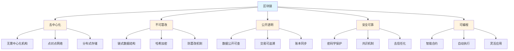

### 1.2 区块链的基本结构

区块链是由一系列按照时间顺序相连的区块组成的链式数据结构。每个区块包含以下内容：

**区块的基本组成**：

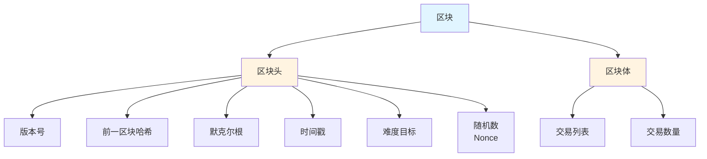

**链式结构**：

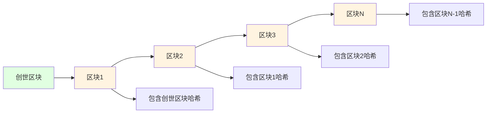

### 1.3 区块链的分类

根据不同的标准，区块链可以分为多种类型：

**按访问权限分类**：

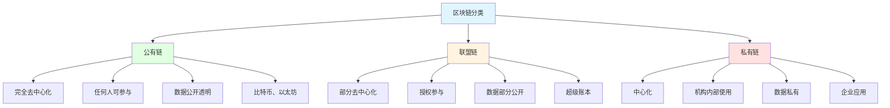

**按用途分类**：

- **货币型区块链**：主要用于数字货币发行和转移，如比特币
- **应用型区块链**：支持智能合约和去中心化应用，如以太坊
- **混合型区块链**：兼具货币和应用功能

## 二、区块链技术架构

### 2.1 区块链技术层次架构

区块链技术是一个复杂的技术集合，包含多个技术层次：

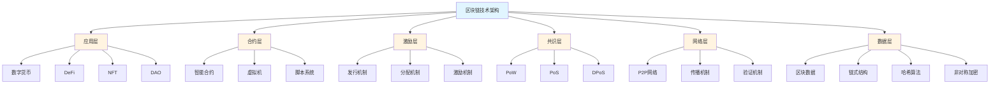

### 2.2 核心技术组件

**1. 分布式账本**

分布式账本是区块链的核心，它是一个在多个节点之间同步的数据库，每个节点都保存完整的账本副本。

**2. 密码学技术**

区块链使用了多种密码学技术：
- **哈希算法**：确保数据完整性
- **非对称加密**：确保交易安全
- **数字签名**：验证交易发起者身份

**3. P2P网络**

区块链网络是一个对等网络，所有节点地位平等，共同维护网络安全。

**4. 共识机制**

共识机制确保所有节点对账本状态达成一致，是区块链安全性的关键。

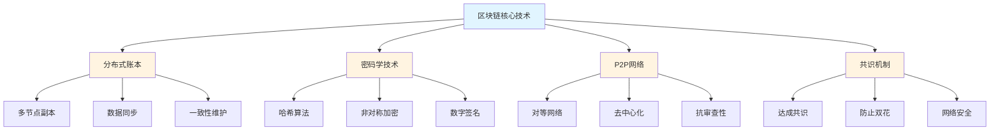

## 三、共识机制详解

共识机制是区块链的核心，它确保所有节点对账本状态达成一致，防止双花攻击。

### 3.1 工作量证明（PoW）

工作量证明是最早的共识机制，由比特币率先采用。

**PoW工作原理**：

1. 矿工竞争解决复杂的数学难题
2. 最先解出难题的矿工获得记账权
3. 矿工打包交易创建新区块
4. 其他节点验证新区块并添加到链上

**PoW优缺点**：

| 优点 | 缺点 |
|------|------|
| 安全性高 | 能源消耗大 |
| 去中心化程度高 | 处理速度慢 |
| 算法简单 | 矿工集中化风险 |

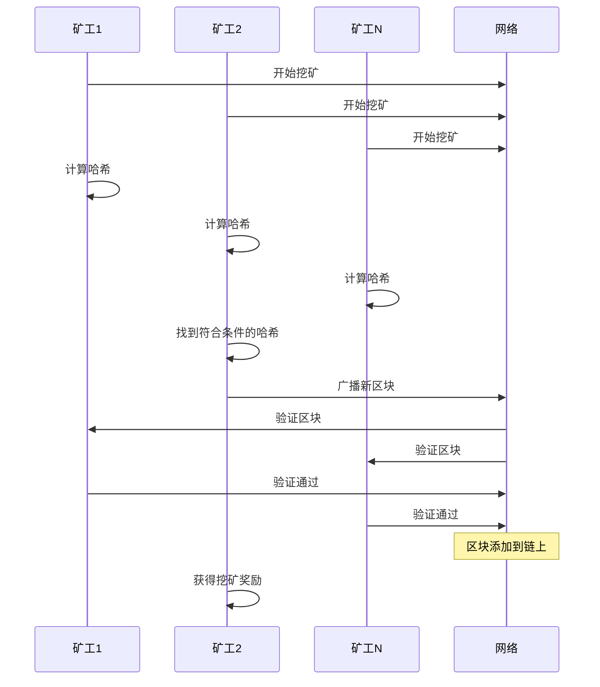

### 3.2 权益证明（PoS）

权益证明是为了解决PoW的高能耗问题而提出的共识机制。

**PoS工作原理**：

1. 验证者质押代币成为验证节点
2. 根据质押数量和时间随机选择验证者
3. 被选中的验证者打包交易创建新区块
4. 其他节点验证并达成共识

**PoS优缺点**：

| 优点 | 缺点 |
|------|------|
| 能源消耗低 | 富者愈富问题 |
| 处理速度快 | 安全性待验证 |
| 抗量子计算 | 可能中心化 |

### 3.3 委托权益证明（DPoS）

DPoS是PoS的改进版本，通过代币持有人投票选举代理人来达成共识。

**DPoS工作原理**：

1. 代币持有人投票选举代理人（见证人）
2. 选出的代理人轮流负责打包区块
3. 代理人必须诚实守信，否则会被投票淘汰
4. 通过社区治理更新代理人列表

**DPoS优缺点**：

| 优点 | 缺点 |
|------|------|
| 处理速度快 | 中心化风险 |
| 能源消耗低 | 代理人可能作恶 |
| 可扩展性好 | 治理复杂 |

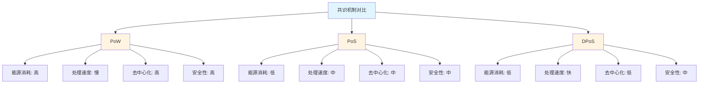

### 3.4 其他共识机制

除了上述三种主要共识机制外，还有多种其他共识机制：

**PoA（权威证明）**：预先授权的验证者负责打包区块，适用于联盟链。

**PBFT（实用拜占庭容错）**：通过多轮投票达成共识，适用于私有链和联盟链。

**Hedera Hashgraph**：使用有向无环图（DAG）结构，实现高吞吐量。

## 四、主要区块链平台

### 4.1 比特币（Bitcoin）

比特币是第一个也是市值最大的区块链平台，由中本聪于2009年创建。

**比特币核心数据**（2025年）：

| 指标 | 数值 |
|------|------|
| 市值 | 约2万亿美元 |
| 价格 | 约10.7万美元 |
| 区块大小 | 1-4MB |
| 区块时间 | 约10分钟 |
| 最大供应量 | 2100万枚 |
| 已发行量 | 约1950万枚 |

**比特币特点**：

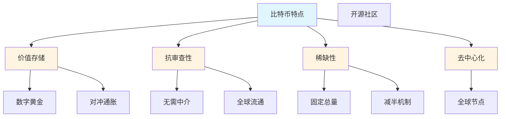

### 4.2 以太坊（Ethereum）

以太坊是第一个支持智能合约的区块链平台，被誉为"世界计算机"。

**以太坊核心数据**（2025年）：

| 指标 | 数值 |
|------|------|
| 市值 | 约4000亿美元 |
| 价格 | 约3900美元 |
| 共识机制 | PoS（合并后） |
| 区块时间 | 约12秒 |
| Gas机制 | 用于交易费用 |

**以太坊特点**：

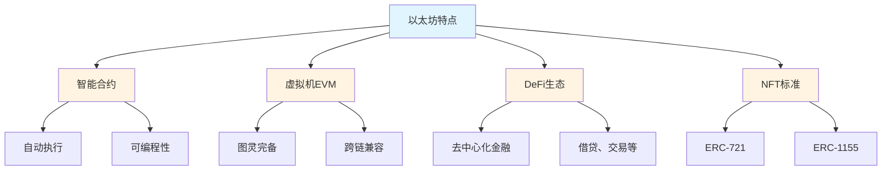

### 4.3 其他重要平台

**1. Solana**

- 高性能区块链，TPS可达65000+
- 采用PoH（历史证明）机制
- 支持智能合约

**2. Cardano**

- 学术研究驱动
- 采用Ouroboros PoS共识
- 支持多资产和智能合约

**3. Polkadot**

- 跨链互操作性平台
- 采用NPoS（提名权益证明）
- 支持平行链

**4. BNB Chain**

- 币安生态链
- 高性能低成本
- 支持智能合约和DeFi

```mermaid
bar
    title 主要区块链平台对比
    "比特币" : 20000
    "以太坊" : 4000
    "Solana" : 800
    "Cardano" : 400
    "Polkadot" : 300
    "BNB Chain" : 600
```

## 五、区块链应用场景

### 5.1 去中心化金融（DeFi）

DeFi是区块链最重要的应用之一，它利用智能合约构建去中心化的金融系统。

**DeFi主要应用**：

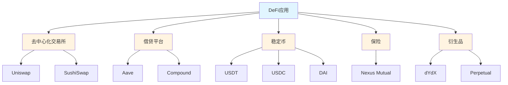

**DeFi市场规模**（2025年）：

- 总锁仓量（TVL）：约800亿美元
- 交易量：日交易量约100亿美元
- 用户数：约1000万活跃用户

### 5.2 NFT（非同质化代币）

NFT是区块链上独一无二的数字资产，代表了所有权和稀缺性。

**NFT主要应用**：

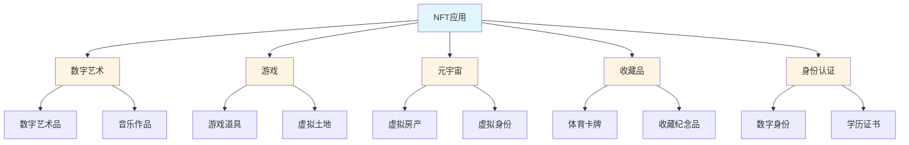

**NFT市场规模**（2025年）：

- 总交易量：约250亿美元
- 活跃钱包数：约500万
- 主要平台：OpenSea、Magic Eden等

### 5.3 Web3与元宇宙

Web3是下一代互联网，基于区块链技术构建去中心化的网络。

**Web3核心特征**：

- 去中心化
- 用户拥有数据
- 代币经济
- 互操作性

**元宇宙是Web3的重要应用**：

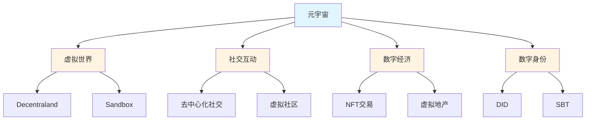

### 5.4 供应链与溯源

区块链技术在供应链管理中具有天然优势：

**供应链应用场景**：

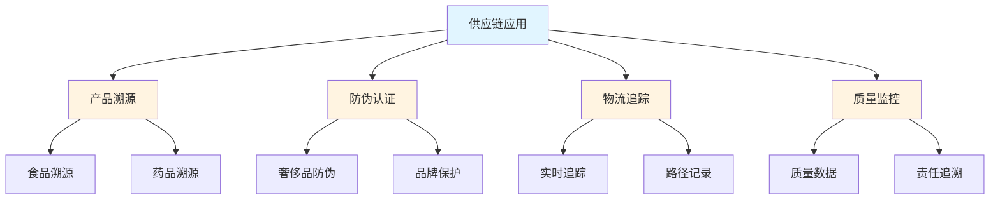

### 5.5 其他应用场景

**1. 数字身份（DID）**

- 去中心化身份
- 自主管理
- 跨平台使用

**2. 版权保护**

- 数字版权登记
- 版税分配
- 版权追踪

**3. 投票系统**

- 去中心化投票
- 透明可验证
- 防篡改

**4. 医疗健康**

- 病历管理
- 药品溯源
- 医疗数据共享

## 六、区块链面临的挑战

### 6.1 可扩展性问题

可扩展性是区块链面临的最大挑战之一。

**三难困境**：

区块链无法同时实现去中心化、安全性和可扩展性，这就是著名的"区块链三难困境"。

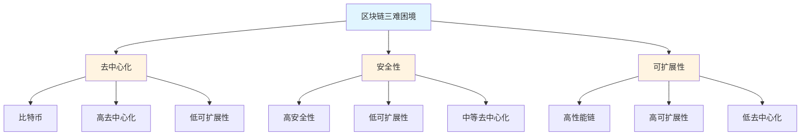

**解决方案**：

1. **Layer 2解决方案**
   - 闪电网络（比特币）
   - Rollup（以太坊）
   - 状态通道

2. **分片技术**
   - 状态分片
   - 交易分片
   - 网络分片

3. **侧链**
   - 独立链
   - 跨链桥接
   - 资产转移

### 6.2 互操作性问题

不同区块链之间缺乏互操作性，导致数据和资产无法自由流动。

**互操作性挑战**：

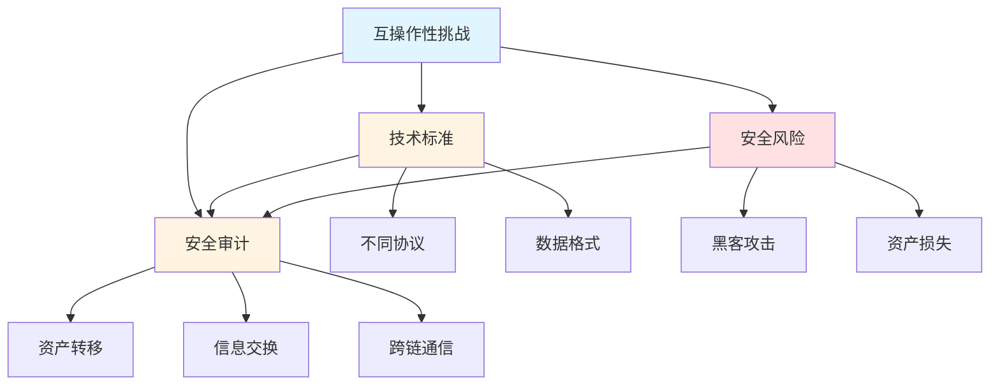

**解决方案**：

1. **跨链协议**
   - Cosmos（IBC）
   - Polkadot（XCM）
   - Chainlink（CCIP）

2. **原子交换**
   - 哈希时间锁定合约
   - 去信任化交换
   - 点对点交易

3. **中继链**
   - Polkadot中继链
   - Cosmos Hub
   - 跨链消息传递

### 6.3 监管挑战

区块链技术的匿名性和去中心化特征给监管带来了巨大挑战。

**监管挑战**：

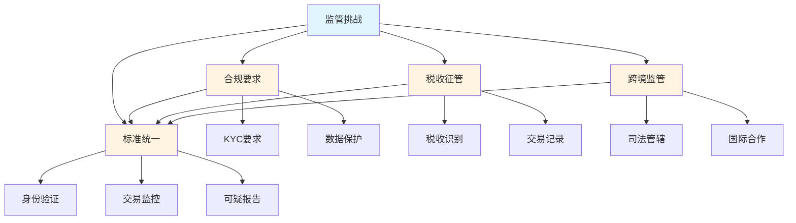

### 6.4 安全挑战

区块链虽然号称安全，但仍面临多种安全威胁。

**主要安全威胁**：

1. **51%攻击**：控制超过51%的算力或权益
2. **智能合约漏洞**：代码漏洞导致资产损失
3. **私钥泄露**：私钥丢失或被盗
4. **钓鱼攻击**：用户被骗取私钥
5. **跨链桥攻击**：跨链协议被黑客攻击

**2025年重大安全事件**：

- 某DeFi协议被黑客攻击，损失超过1亿美元
- 多个跨链桥遭遇安全漏洞
- 交易所钱包被盗事件

## 七、中国区块链发展现状

### 7.1 政策环境

中国对区块链技术采取"支持链、禁币"的政策。

**政策态度**：

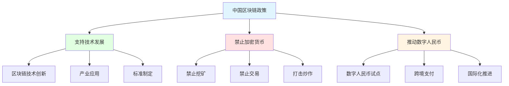

**重要政策文件**：

- 2019年：习近平总书记强调区块链技术重要性
- 2021年：禁止加密货币挖矿和交易
- 2022年：发布"十四五"区块链发展规划
- 2025年：推进数字人民币试点

### 7.2 数字人民币

数字人民币（e-CNY）是中国人民银行发行的法定数字货币。

**数字人民币核心数据**（2025年）：

| 指标 | 数值 |
|------|------|
| 累计交易笔数 | 34.8亿笔 |
| 累计交易金额 | 16.7万亿元 |
| 个人钱包数 | 2.3亿个 |
| 单位钱包数 | 超过千万个 |
| 试点城市 | 超过20个 |

**数字人民币特点**：

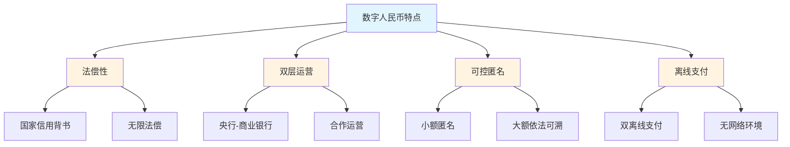

### 7.3 产业应用

中国区块链技术在实体经济中的应用不断深化。

**主要应用领域**：

```mermaid
graph TB
    A[中国区块链应用] --> B[金融领域]
    A --> C[政务服务]
    A --> D[供应链]
    A --> E[医疗健康]
    
    B --> B1[跨境支付]
    B --> B2[供应链金融]
    B --> B3[贸易融资]
    
    C --> C1[电子证照]
    C --> C2[数据共享]
    C --> C3[政务协同]
    
    D --> D1[产品溯源]
    D --> D2[物流追踪]
    D --> C[防伪认证]
    
    E --> E1[病历管理]
    E --> E2[药品溯源]
    E --> C[医疗数据共享]
    
    style A fill:#e1f5ff
    style B fill:#fff4e1
    style C fill:#fff4e1
    style D fill:#fff4e1
    style E fill:#fff4e1
```

### 7.4 香港Web3发展

香港积极发展Web3，成为连接中国内地与全球的桥梁。

**香港Web3政策**：

- 2023年：发布虚拟资产发展政策宣言
- 2024年：批准比特币ETF和以太坊ETF
- 2025年：推出稳定币监管框架

**香港Web3生态**：

- 超过200家Web3企业落户
- 多家加密货币交易所
- 丰富的投资和人才资源

## 八、区块链未来发展趋势

### 8.1 技术发展趋势

**1. 模块化架构**

区块链将向模块化方向发展，实现执行、数据、共识、结算的分层解耦。

**2. Layer 2爆发**

Layer 2解决方案将大规模应用，解决可扩展性问题。

**3. 跨链互操作性**

跨链技术将更加成熟，实现不同区块链之间的无缝互通。

**4. 零知识证明**

ZK技术将更加普及，提供更好的隐私保护。

```mermaid
graph TB
    A[区块链技术趋势] --> B[模块化]
    A --> C[Layer 2]
    A --> D[跨链]
    A --> E[零知识证明]
    
    B --> B1[执行层]
    B --> B2[数据层]
    B --> B3[共识层]
    
    C --> C1[Rollup]
    C --> C2[状态通道]
    C --> C3[侧链]
    
    D --> D1[Cosmos IBC]
    D --> D2[Polkadot XCM]
    D --> D3[Chainlink CCIP]
    
    E --> E1[ZK-Rollup]
    E --> E2[隐私交易]
    E --> C[身份验证]
    
    style A fill:#e1f5ff
    style B fill:#fff4e1
    style C fill:#fff4e1
    style D fill:#fff4e1
    style E fill:#fff4e1
```

### 8.2 应用发展趋势

**1. DeFi走向主流**

DeFi将更加成熟，吸引更多传统金融用户。

**2. RWA（现实世界资产）代币化**

传统资产将上链代币化，包括房地产、债券、股票等。

**3. AI+区块链**

人工智能与区块链结合，创造新的应用场景。

**4. Web3游戏**

GameFi将更加成熟，吸引更多玩家。

### 8.3 监管发展趋势

**1. 监管框架完善**

全球监管框架将更加清晰和统一。

**2. 合规化趋势**

加密货币将更加合规化，走向主流。

**3. 国际合作**

各国将加强国际合作，共同应对挑战。

### 8.4 市场发展趋势

**市场规模预测**：

```mermaid
timeline
    title 区块链市场规模预测
    section 2025年
        Web3市场 : 28亿美元
        加密总市值 : 4万亿美元
    section 2026年
        Web3市场 : 40亿美元
        加密总市值 : 5万亿美元
    section 2030年
        Web3市场 : 200亿美元
        加密总市值 : 10万亿美元
    section 2035年
        Web3市场 : 500亿美元
        加密总市值 : 20万亿美元
```