# 支付技术全景：从现金到数字货币的技术演进

> 支付，是人类经济活动最基础的环节之一。从贝壳到金银，从纸币到电子账户，每一次支付方式的变革，都深刻影响着我们的生活方式和商业模式。今天，让我们一起走进支付技术的世界，看看那些看不见的"钱"是如何在数字世界中流动的。

---

## 一、支付的本质：什么是支付？

在深入技术细节之前，我们需要先理解支付的本质。

### 1.1 支付的定义

支付，简单来说，就是**价值的转移**。当你在便利店买一瓶水，你将3元的价值转移给商家，商家将一瓶水的价值转移给你。这个过程中，有三个核心要素：

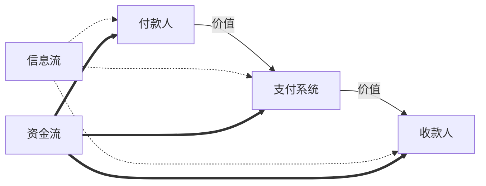
```mermaid
graph LR
    A[付款人] -->|价值| B[支付系统]
    B -->|价值| C[收款人]
    D[信息流] -.-> A
    D -.-> B
    D -.-> C
    E[资金流] ==> A
    E ==> B
    E ==> C
```

- **付款人**：发起支付的一方
- **收款人**：接收支付的一方
- **支付中介**：完成价值转移的机构（银行、支付公司等）

### 1.2 支付的三个层次

一个完整的支付过程，实际上包含三个层次的活动：

| 层次 | 名称 | 含义 | 参与者 |
|------|------|------|--------|
| 第一层 | 交易 | 买卖双方的商业行为 | 消费者、商家 |
| 第二层 | 清算 | 支付指令的传递和计算 | 银行、支付机构、清算组织 |
| 第三层 | 结算 | 资金的最终转移 | 央行、商业银行 |

用生活中的例子来理解：

> 小明用招商银行卡在淘宝上买了一台手机，卖家使用的是工商银行账户。
>
> - **交易层**：小明下单，确认付款
> - **清算层**：支付宝告诉招行"小明要付5000元"，告诉工行"收5000元"，网联负责记账和核对
> - **结算层**：招行真的把5000元划给工行，资金完成转移

---

## 二、传统支付方式：从现金到银行卡

### 2.1 现金支付：最原始的价值转移

现金支付是最直接的支付方式，它的特点是"一手交钱，一手交货"，不需要任何中介参与。

**现金支付的优点：**
- 即时完成，无需等待
- 不需要技术基础设施
- 匿名性强

**现金支付的缺点：**
- 携带不便，大额交易风险高
- 无法追溯，容易被用于非法活动
- 发行和流通成本高

### 2.2 银行卡支付：电子化的起点

银行卡的出现，标志着支付开始走向电子化。银行卡支付的核心是**账户体系**——钱不再以纸币形式存在，而是以数字形式记录在银行账户中。

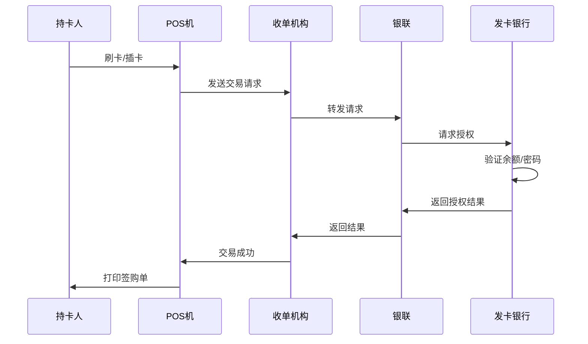
```mermaid
sequenceDiagram
    participant 持卡人
    participant POS机
    participant 收单机构
    participant 银联
    participant 发卡银行

    持卡人->>POS机: 刷卡/插卡
    POS机->>收单机构: 发送交易请求
    收单机构->>银联: 转发请求
    银联->>发卡银行: 请求授权
    发卡银行->>发卡银行: 验证余额/密码
    发卡银行->>银联: 返回授权结果
    银联->>收单机构: 返回结果
    收单机构->>POS机: 交易成功
    POS机->>持卡人: 打印签购单
```

#### 银行卡的分类

**按功能分：**
- **借记卡**：先存款后消费，不能透支
- **信用卡**：可以先消费后还款，银行给予一定信用额度
- **准贷记卡**：兼具借记卡和信用卡特点

**按信息存储方式分：**
- **磁条卡**：信息存储在磁条中，安全性较低
- **IC卡（芯片卡）**：信息存储在芯片中，安全性高
- **复合卡**：同时具有磁条和芯片

#### 银行卡支付的关键技术

**1. 卡号编码规则（ISO 7812标准）**

银行卡号通常是16位，遵循特定的编码规则：

```
举例：6225 8888 1234 5678

前6位（BIN号）：622588
- 识别发卡银行和卡种
- 由银联分配

中间位：88123456
- 银行自定义的账户标识

最后1位：校验码
- 根据Luhn算法计算得出
```

**2. 安全验证机制**

银行卡支付的安全验证主要通过以下方式：

- **密码验证**：持卡人输入6位密码
- **签名验证**：核对签购单上的签名
- **CVV/CVC验证**：卡片背面的3位数字（线上支付）
- **3D Secure验证**：发卡行的二次验证（线上支付）

---

## 三、电子支付时代：网银与第三方支付

### 3.1 网上银行：支付的网络化

网上银行让用户可以通过互联网完成转账、支付等操作，实现了"足不出户办理银行业务"。

**网银支付的核心流程：**

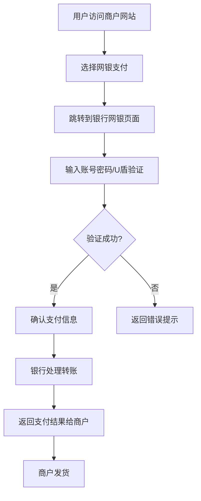
```mermaid
flowchart TD
    A[用户访问商户网站] --> B[选择网银支付]
    B --> C[跳转到银行网银页面]
    C --> D[输入账号密码/U盾验证]
    D --> E{验证成功?}
    E -->|是| F[确认支付信息]
    E -->|否| G[返回错误提示]
    F --> H[银行处理转账]
    H --> I[返回支付结果给商户]
    I --> J[商户发货]
```

**网银支付的安全技术：**

| 技术 | 作用 | 说明 |
|------|------|------|
| SSL/TLS加密 | 传输加密 | 防止数据在传输过程中被窃取 |
| U盾/动态口令 | 身份认证 | 双因素认证，提高安全性 |
| 数字证书 | 身份验证 | 确保访问的是真实的银行网站 |
| 验证码 | 防止机器人 | 防止自动化攻击 |

### 3.2 第三方支付：支付中介的崛起

第三方支付是指具备一定实力和信誉保障的独立机构，通过与各大银行签约，为用户提供支付服务。

**第三方支付的出现解决了什么问题？**

1. **商户对接多家银行的麻烦**：一个商户要同时支持多家银行的网银，需要与每家银行分别对接，成本高、周期长。第三方支付作为"聚合器"，商户只需要对接一次即可。

2. **买卖双方的信任问题**：在电商交易中，买家担心付款后收不到货，卖家担心发货后收不到款。第三方支付的"担保交易"模式解决了这个信任难题。

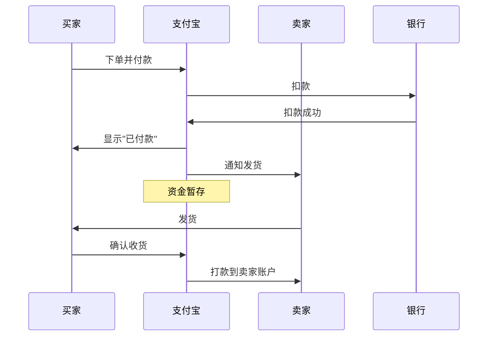
```mermaid
sequenceDiagram
    participant 买家
    participant 支付宝
    participant 卖家
    participant 银行

    买家->>支付宝: 下单并付款
    支付宝->>银行: 扣款
    银行->>支付宝: 扣款成功
    支付宝->>买家: 显示"已付款"
    支付宝->>卖家: 通知发货
    Note over 支付宝: 资金暂存
    卖家->>买家: 发货
    买家->>支付宝: 确认收货
    支付宝->>卖家: 打款到卖家账户
```

**第三方支付的账户体系：**

第三方支付建立了自己的账户体系，用户在支付机构开设虚拟账户：

```
用户A在支付宝的账户
├── 余额账户：100.00元
├── 余额宝账户：1000.00元
├── 银行卡绑定：
│   ├── 工商银行(尾号1234)
│   └── 招商银行(尾号5678)
└── 花呗额度：5000.00元
```

### 3.3 中国支付清算体系

中国的支付清算体系是一个复杂的网络，涉及多个参与方：

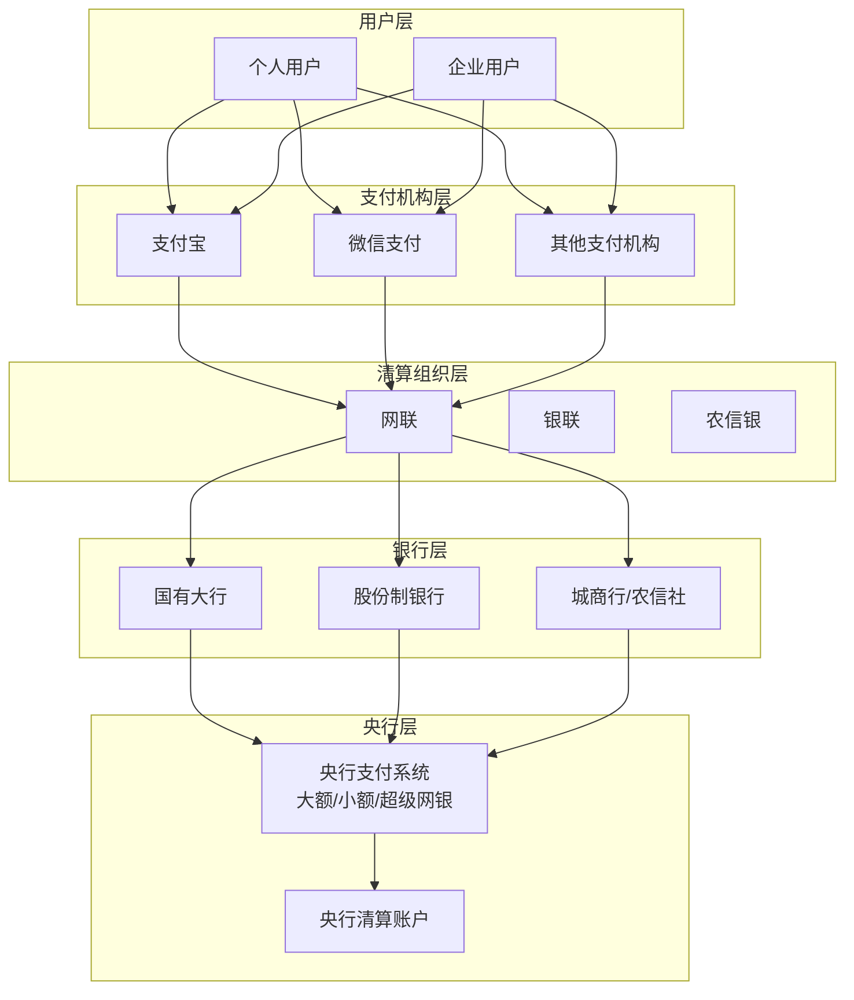
```mermaid
graph TB
    subgraph 用户层
        A[个人用户]
        B[企业用户]
    end

    subgraph 支付机构层
        C[支付宝]
        D[微信支付]
        E[其他支付机构]
    end

    subgraph 银行层
        F[国有大行]
        G[股份制银行]
        H[城商行/农信社]
    end

    subgraph 清算组织层
        I[网联]
        J[银联]
        K[农信银]
    end

    subgraph 央行层
        L[央行支付系统<br/>大额/小额/超级网银]
        M[央行清算账户]
    end

    A --> C & D & E
    B --> C & D & E
    C & D & E --> I
    I --> F & G & H
    F & G & H --> L
    L --> M
```

**网联的作用：**

2017年，网联平台正式上线，要求第三方支付机构的网络支付业务必须通过网联处理。这解决了什么问题？

- **断直连**：此前，支付机构可以直接与各银行对接，资金流向不透明
- **资金监控**：所有交易都必须经过网联，央行可以实时监控
- **风险防范**：防止支付机构挪用备付金、洗钱等风险

---

## 四、移动支付革命：扫码与NFC

### 4.1 扫码支付：中国的创新名片

扫码支付是中国移动支付的代表形式，它巧妙地利用了智能手机的普及和二维码技术，创造了一种便捷、低成本的支付方式。

#### 二维码的技术原理

二维码是在二维空间上记录信息的条码技术。与传统的一维码相比，它可以存储更多信息，包括汉字、网址等。

```
二维码的结构示意：
┌─────────────────────┐
│ ▓▓ ▓▓ ▓▓ ▓▓ ▓▓ ▓▓ │ ← 定位图形
│ ▓▓    ▓▓    ▓▓    ▓▓ │
│ ▓▓ ▓▓ ▓▓ ▓▓ ▓▓ ▓▓ │ ← 功能图形
│                      │
│    数据区域         │ ← 存储实际数据
│    ████████████     │
│                      │
│ ▓▓ ▓▓ ▓▓ ▓▓ ▓▓ ▓▓ │
│ ▓▓    ▓▓    ▓▓    ▓▓ │
└─────────────────────┘
```

二维码的编码容量：
- 数字：最多7089字符
- 字母：最多4296字符
- 汉字：最多984个（UTF-8编码）

#### 扫码支付的两种模式

**模式一：主扫（用户扫商家）**

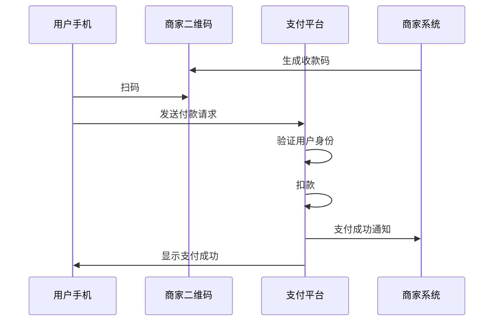
```mermaid
sequenceDiagram
    participant 用户手机
    participant 商家二维码
    participant 支付平台
    participant 商家系统

    商家系统->>商家二维码: 生成收款码
    用户手机->>商家二维码: 扫码
    用户手机->>支付平台: 发送付款请求
    支付平台->>支付平台: 验证用户身份
    支付平台->>支付平台: 扣款
    支付平台->>商家系统: 支付成功通知
    支付平台->>用户手机: 显示支付成功
```

**模式二：被扫（商家扫用户）**

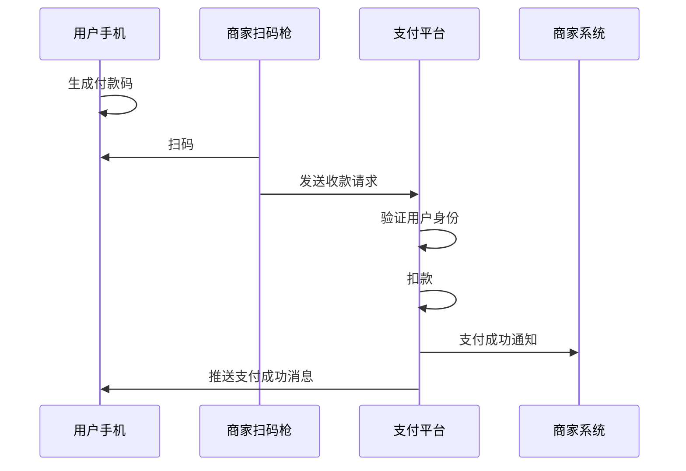
```mermaid
sequenceDiagram
    participant 用户手机
    participant 商家扫码枪
    participant 支付平台
    participant 商家系统

    用户手机->>用户手机: 生成付款码
    商家扫码枪->>用户手机: 扫码
    商家扫码枪->>支付平台: 发送收款请求
    支付平台->>支付平台: 验证用户身份
    支付平台->>支付平台: 扣款
    支付平台->>商家系统: 支付成功通知
    支付平台->>用户手机: 推送支付成功消息
```

#### 扫码支付的安全机制

扫码支付看似简单，背后却有多重安全保障：

| 安全机制 | 说明 |
|----------|------|
| 二维码有效期 | 付款码通常有效期60秒，过期自动失效 |
| 动态码 | 付款码每分钟自动变化，防止截屏盗刷 |
| 支付密码/指纹 | 大额支付需要二次验证 |
| 风控系统 | 实时监测异常交易 |
| 支付提醒 | 即时推送支付通知 |

### 4.2 NFC支付：近距离无线通信

NFC（Near Field Communication）是一种短距离无线通信技术，工作频率13.56MHz，有效距离约10厘米。

**NFC的三种工作模式：**

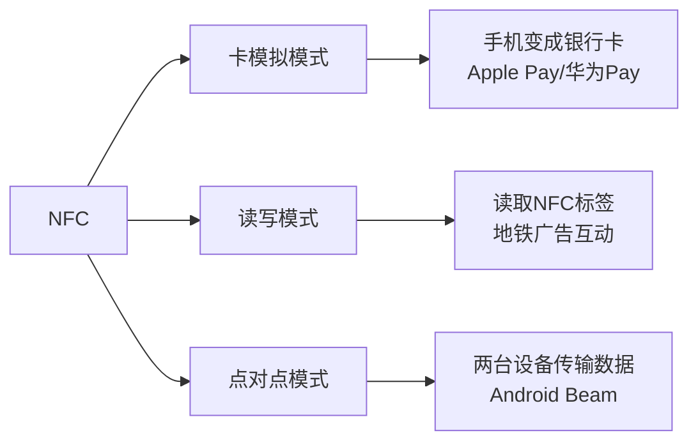
```mermaid
graph LR
    A[NFC] --> B[卡模拟模式]
    A --> C[读写模式]
    A --> D[点对点模式]

    B --> B1[手机变成银行卡<br/>Apple Pay/华为Pay]
    C --> C1[读取NFC标签<br/>地铁广告互动]
    D --> D1[两台设备传输数据<br/>Android Beam]
```

**NFC支付流程：**

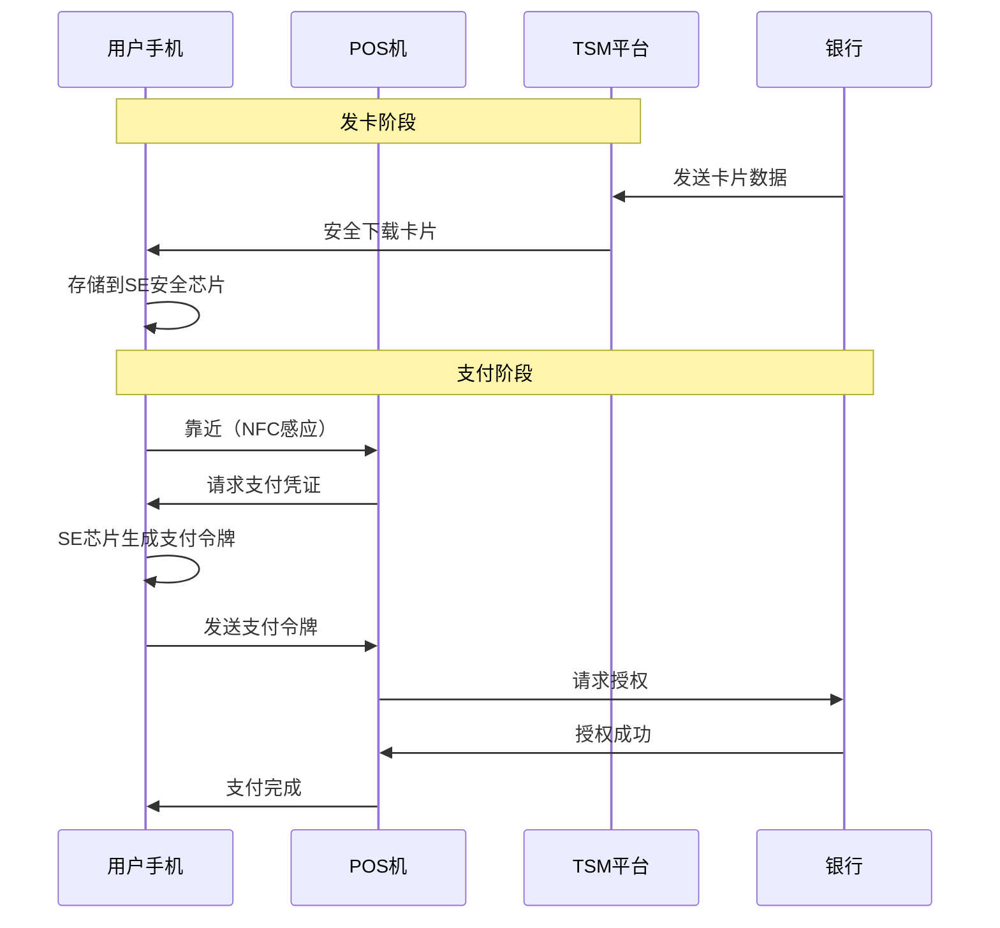
```mermaid
sequenceDiagram
    participant 用户手机
    participant POS机
    participant TSM平台
    participant 银行

    Note over 用户手机,TSM平台: 发卡阶段
    银行->>TSM平台: 发送卡片数据
    TSM平台->>用户手机: 安全下载卡片
    用户手机->>用户手机: 存储到SE安全芯片

    Note over 用户手机,银行: 支付阶段
    用户手机->>POS机: 靠近（NFC感应）
    POS机->>用户手机: 请求支付凭证
    用户手机->>用户手机: SE芯片生成支付令牌
    用户手机->>POS机: 发送支付令牌
    POS机->>银行: 请求授权
    银行->>POS机: 授权成功
    POS机->>用户手机: 支付完成
```

**NFC支付 vs 扫码支付：**

| 特性 | NFC支付 | 扫码支付 |
|------|---------|----------|
| 依赖设备 | 需要NFC芯片 | 只需要摄像头 |
| 网络依赖 | 可离线（令牌模式） | 需要网络 |
| 支付速度 | 更快（1秒内） | 较慢（3-5秒） |
| 安全性 | 更高（SE芯片加密） | 较高 |
| 普及程度 | 国内较低 | 国内极高 |
| 商家成本 | 需要NFC POS机 | 只需二维码 |

### 4.3 生物识别支付：你就是支付密码

生物识别技术正在被越来越多的支付场景采用：

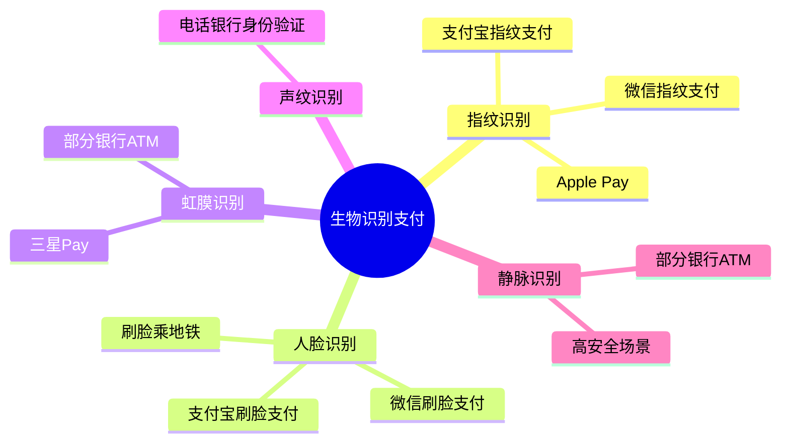
```mermaid
mindmap
  root((生物识别支付))
    指纹识别
      支付宝指纹支付
      微信指纹支付
      Apple Pay
    人脸识别
      支付宝刷脸支付
      微信刷脸支付
      刷脸乘地铁
    虹膜识别
      三星Pay
      部分银行ATM
    声纹识别
      电话银行身份验证
    静脉识别
      部分银行ATM
      高安全场景
```

**刷脸支付的技术原理：**

刷脸支付不是简单地"看一眼就付钱"，它包含复杂的技术流程：

1. **人脸检测**：从图像中定位人脸位置
2. **特征提取**：提取人脸的关键特征点（通常128-512个）
3. **活体检测**：确保是真人而非照片/视频（通过眨眼、点头等动作）
4. **特征比对**：与数据库中的特征进行匹配
5. **支付授权**：匹配成功后完成支付

```
人脸特征提取示例：

原始图像          特征点标记           特征向量
┌─────────┐      ┌─────────┐
│  (o o)  │  →   │  ● ● ●  │   →   [0.12, 0.34, 0.56, ...]
│    △    │      │  ● △ ●  │       共128-512维向量
│   ───   │      │  ●───●  │
└─────────┘      └─────────┘

特征点：眼角、鼻尖、嘴角、眉毛等关键位置
```

---

## 五、支付系统架构：技术实现的核心

### 5.1 支付系统的整体架构

一个完整的支付系统，通常包含以下核心模块：

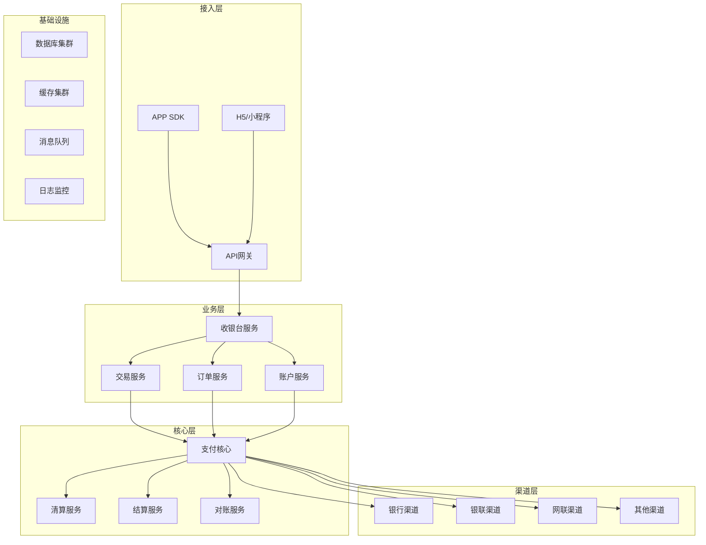
```mermaid
graph TB
    subgraph 接入层
        A1[APP SDK]
        A2[H5/小程序]
        A3[API网关]
    end

    subgraph 业务层
        B1[收银台服务]
        B2[交易服务]
        B3[订单服务]
        B4[账户服务]
    end

    subgraph 核心层
        C1[支付核心]
        C2[清算服务]
        C3[结算服务]
        C4[对账服务]
    end

    subgraph 渠道层
        D1[银行渠道]
        D2[银联渠道]
        D3[网联渠道]
        D4[其他渠道]
    end

    subgraph 基础设施
        E1[数据库集群]
        E2[缓存集群]
        E3[消息队列]
        E4[日志监控]
    end

    A1 & A2 --> A3
    A3 --> B1
    B1 --> B2 & B3 & B4
    B2 & B3 & B4 --> C1
    C1 --> C2 & C3 & C4
    C1 --> D1 & D2 & D3 & D4
```

### 5.2 支付核心的数据模型

支付系统需要管理多种核心数据：

**1. 账户模型**

```
账户表(account)
├── account_id        -- 账户ID（主键）
├── user_id           -- 用户ID
├── account_type      -- 账户类型（余额/红包/积分）
├── currency          -- 币种
├── balance           -- 余额
├── frozen_amount     -- 冻结金额
├── status            -- 状态（正常/冻结/注销）
└── created_at        -- 创建时间

账户流水表(account_journal)
├── journal_id        -- 流水ID
├── account_id        -- 账户ID
├── trans_id          -- 交易ID
├── amount            -- 变动金额
├── balance_before    -- 变动前余额
├── balance_after     -- 变动后余额
├── direction         -- 方向（收入/支出）
└── created_at        -- 时间
```

**2. 交易模型**

```
交易表(transaction)
├── trans_id          -- 交易流水号（全局唯一）
├── order_id          -- 关联订单号
├── payer_id          -- 付款人
├── payee_id          -- 收款人
├── amount            -- 交易金额
├── currency          -- 币种
├── status            -- 状态（待支付/成功/失败）
├── channel           -- 渠道（支付宝/微信/银行卡）
├── scene             -- 场景（商品购买/转账/充值）
└── created_at        -- 创建时间
```

### 5.3 支付系统的关键设计

**1. 幂等性设计**

支付系统必须保证幂等性，即同一个请求执行多次与执行一次的效果相同。这是防止重复扣款的关键。

```
实现幂等性的方法：

1. 唯一流水号
   - 每个交易请求携带唯一的trans_id
   - 系统根据trans_id判断是否已处理

2. 状态机约束
   - 交易状态只能单向流转
   - 已成功的交易不能再次成功

状态流转：
┌─────────┐    ┌─────────┐    ┌─────────┐
│  创建   │ →  │  处理中  │ →  │  成功   │
└─────────┘    └─────────┘    └─────────┘
                    ↓
               ┌─────────┐
               │  失败   │
               └─────────┘
```

**2. 分布式事务处理**

支付涉及多个账户和系统，需要保证数据一致性。常用方案：

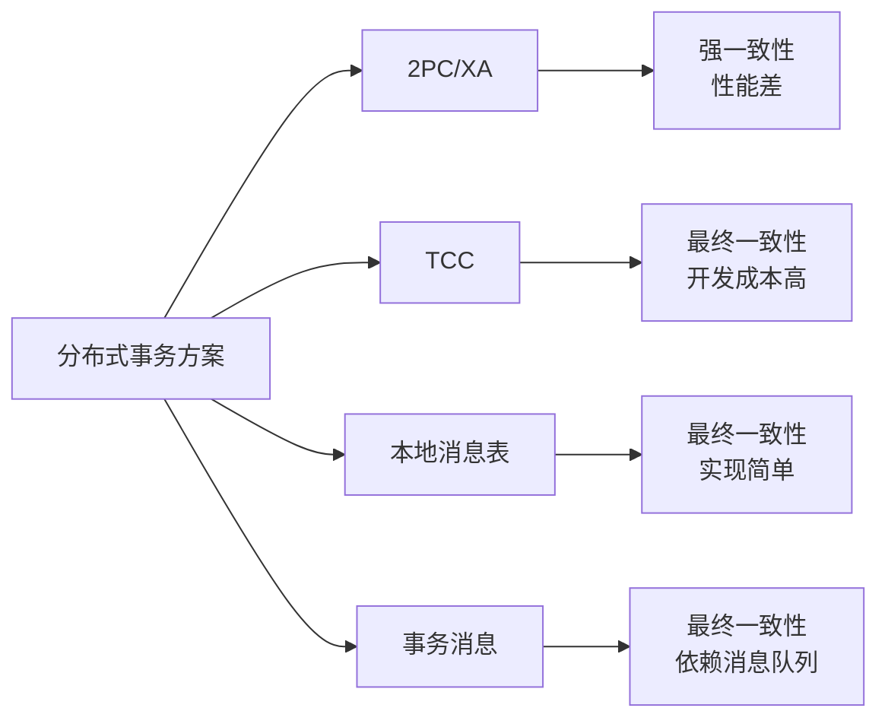
```mermaid
graph LR
    A[分布式事务方案] --> B[2PC/XA]
    A --> C[TCC]
    A --> D[本地消息表]
    A --> E[事务消息]

    B --> B1[强一致性<br/>性能差]
    C --> C1[最终一致性<br/>开发成本高]
    D --> D1[最终一致性<br/>实现简单]
    E --> E1[最终一致性<br/>依赖消息队列]
```

**TCC模式详解：**

TCC（Try-Confirm-Cancel）是一种柔性事务方案：

```
以转账场景为例：

Try阶段（尝试）
- 检查账户A余额是否充足
- 冻结账户A 100元
- 预增加账户B 100元（待确认）

Confirm阶段（确认）
- 扣减账户A冻结的100元
- 将账户B预增的100元变为正常余额

Cancel阶段（取消）
- 解冻账户A的100元
- 删除账户B的预增记录
```

**3. 高可用设计**

支付系统对可用性要求极高，通常要求99.99%以上：

```
高可用架构设计：

                    ┌─────────────────┐
                    │   负载均衡 LB    │
                    └────────┬────────┘
                             │
              ┌──────────────┼──────────────┐
              ↓              ↓              ↓
        ┌─────────┐    ┌─────────┐    ┌─────────┐
        │ 服务节点1 │    │ 服务节点2 │    │ 服务节点3 │
        └────┬────┘    └────┬────┘    └────┬────┘
             │              │              │
              └──────────────┼──────────────┘
                             │
              ┌──────────────┼──────────────┐
              ↓              ↓              ↓
        ┌─────────┐    ┌─────────┐    ┌─────────┐
        │ 数据库主 │ ←→ │ 数据库从1│    │ 数据库从2│
        └─────────┘    └─────────┘    └─────────┘

容灾策略：
- 多机房部署
- 数据主从同步
- 故障自动切换
- 灰度发布
```

### 5.4 支付系统的安全架构

支付系统面临多种安全威胁，需要建立多层防御体系：

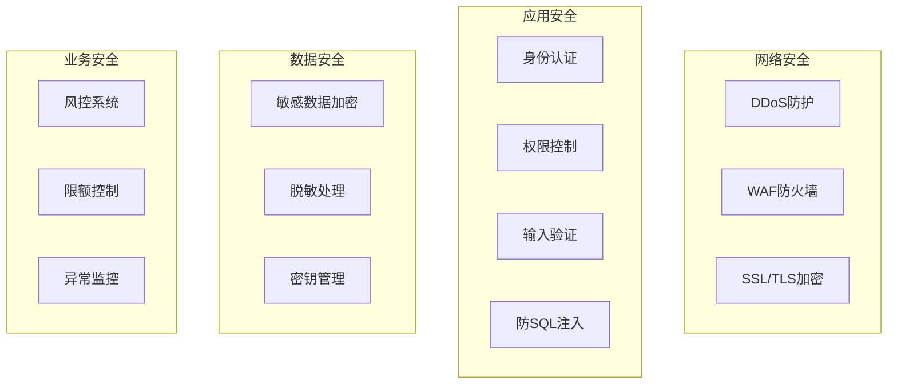
```mermaid
graph TB
    subgraph 网络安全
        A1[DDoS防护]
        A2[WAF防火墙]
        A3[SSL/TLS加密]
    end

    subgraph 应用安全
        B1[身份认证]
        B2[权限控制]
        B3[输入验证]
        B4[防SQL注入]
    end

    subgraph 数据安全
        C1[敏感数据加密]
        C2[脱敏处理]
        C3[密钥管理]
    end

    subgraph 业务安全
        D1[风控系统]
        D2[限额控制]
        D3[异常监控]
    end
```

**数据加密策略：**

| 数据类型 | 存储加密 | 传输加密 | 示例 |
|----------|----------|----------|------|
| 密码 | 哈希（bcrypt） | SSL/TLS | 登录密码 |
| 银行卡号 | AES加密 | SSL/TLS | 6225****5678 |
| CVV | 不存储 | SSL/TLS | 安全考虑，禁止存储 |
| 身份证号 | AES加密 | SSL/TLS | 310***********1234 |
| 手机号 | AES加密 | SSL/TLS | 138****8888 |

---

## 六、支付风控：守护资金安全

### 6.1 支付风险的类型

支付系统面临多种风险，需要针对性防范：

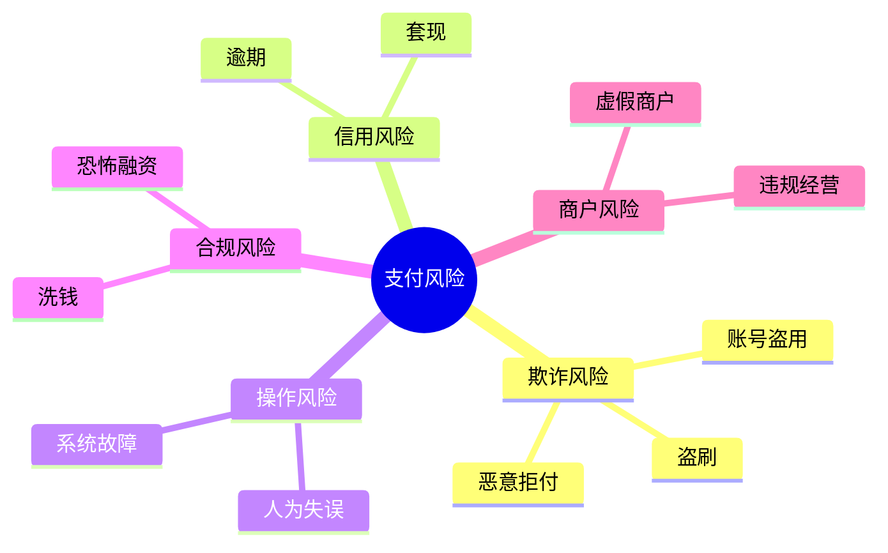
```mermaid
mindmap
  root((支付风险))
    欺诈风险
      盗刷
      账号盗用
      恶意拒付
    信用风险
      逾期
      套现
    操作风险
      系统故障
      人为失误
    合规风险
      洗钱
      恐怖融资
    商户风险
      虚假商户
      违规经营
```

### 6.2 风控系统的架构

现代支付系统都配备了智能风控系统：

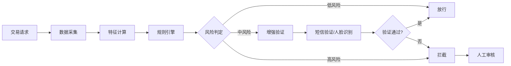
```mermaid
flowchart LR
    A[交易请求] --> B[数据采集]
    B --> C[特征计算]
    C --> D[规则引擎]
    D --> E{风险判定}
    E -->|低风险| F[放行]
    E -->|中风险| G[增强验证]
    E -->|高风险| H[拦截]
    G --> I[短信验证/人脸识别]
    I --> J{验证通过?}
    J -->|是| F
    J -->|否| H
    H --> K[人工审核]
```

**风控特征示例：**

```
用户特征：
- 注册时长：365天
- 历史交易次数：128次
- 历史交易金额：52,300元
- 账户等级：金卡会员

设备特征：
- 设备指纹：a1b2c3d4e5f6
- 常用设备：是
- Root/越狱：否
- 模拟器：否

交易特征：
- 交易金额：5,000元
- 交易时间：14:30（工作日）
- 收款方：新收款人
- 交易地点：常用城市

行为特征：
- 操作间隔：正常
- 输入速度：正常
- 网络环境：WiFi
- IP归属地：与常用地址一致
```

### 6.3 风控规则示例

风控系统使用多种规则来判断风险：

```
规则1：大额交易验证
IF 交易金额 > 5000元
THEN 要求短信验证码

规则2：异地登录预警
IF 登录地点 != 常用地点
AND 登录地点 != 上次登录地点
THEN 触发安全提醒

规则3：新设备限制
IF 设备是新设备
AND 交易金额 > 1000元
THEN 要求人脸验证

规则4：频率限制
IF 1小时内交易次数 > 5次
THEN 拦截并触发人工审核

规则5：黑名单拦截
IF 收款方在黑名单
THEN 直接拦截
```

### 6.4 机器学习在风控中的应用

传统规则引擎存在局限性，机器学习可以更好地识别复杂模式：

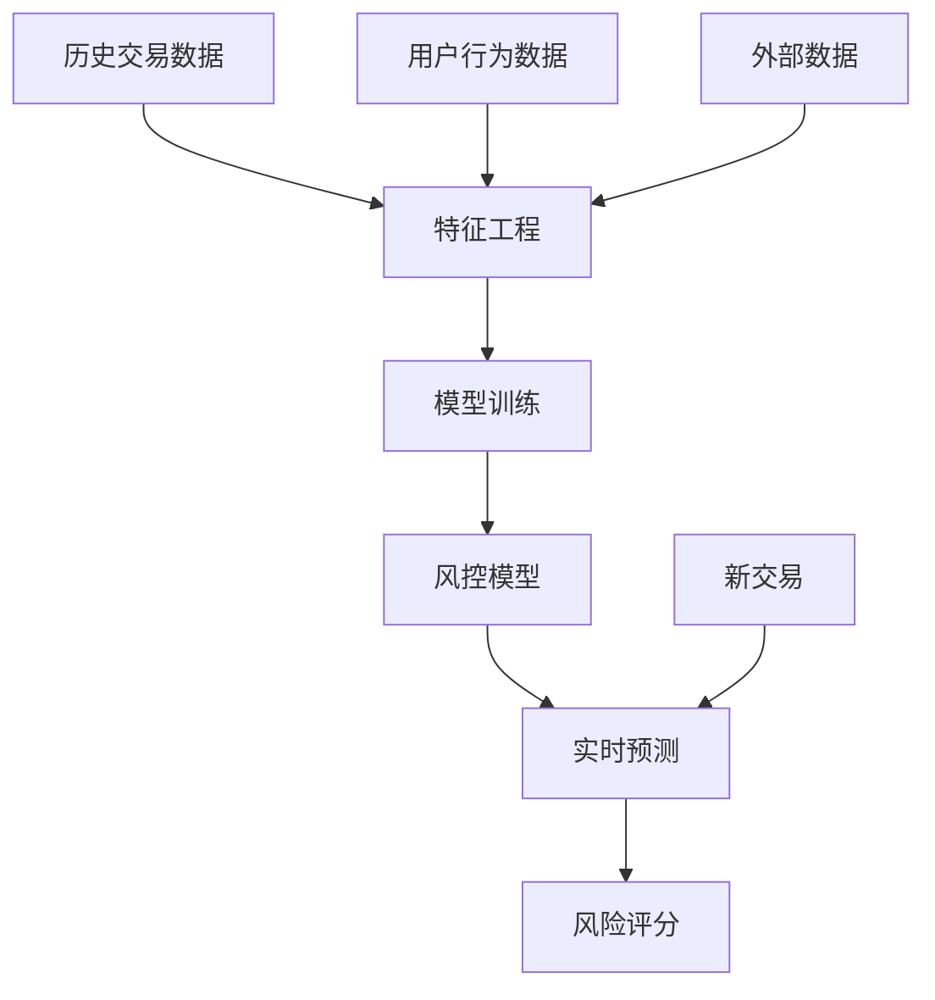
```mermaid
graph TB
    A[历史交易数据] --> B[特征工程]
    B --> C[模型训练]
    C --> D[风控模型]
    D --> E[实时预测]
    E --> F[风险评分]

    G[用户行为数据] --> B
    H[外部数据] --> B

    I[新交易] --> E
```

**常用算法：**

| 算法 | 应用场景 | 优势 |
|------|----------|------|
| 逻辑回归 | 信用评分 | 可解释性强 |
| 随机森林 | 欺诈检测 | 处理非线性关系 |
| XGBoost | 风险评分 | 准确率高 |
| 神经网络 | 复杂模式识别 | 处理高维特征 |
| 图算法 | 团伙识别 | 发现关联关系 |

---

## 七、清算与结算：资金如何流转

### 7.1 清算与结算的区别

很多人容易混淆清算和结算，它们是不同的概念：

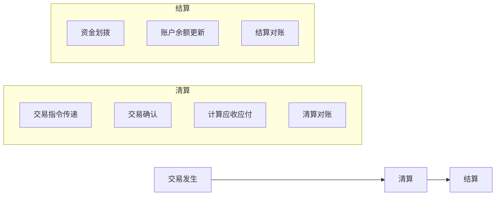
```mermaid
graph LR
    A[交易发生] --> B[清算]
    B --> C[结算]

    subgraph 清算
        B1[交易指令传递]
        B2[交易确认]
        B3[计算应收应付]
        B4[清算对账]
    end

    subgraph 结算
        C1[资金划拨]
        C2[账户余额更新]
        C3[结算对账]
    end
```

**举例说明：**

> 小明用支付宝（绑定招行卡）在淘宝商家（工行账户）购买了一台手机5000元。

**清算过程：**
1. 支付宝记录：小明应付5000元，淘宝商家应收5000元
2. 支付宝通知网联清算信息
3. 网联计算：招行应付5000元，工行应收5000元
4. 网联通知招行和工行确认

**结算过程：**
1. 招行从小明账户扣除5000元
2. 招行将5000元划转到其在央行的清算账户
3. 央行将5000元从招行清算账户划转到工行清算账户
4. 工行将5000元记入淘宝商家账户

### 7.2 批量清算与实时清算

清算有两种模式：

**批量清算：** 积累一定时间或数量的交易后，统一处理

```
批量清算时间窗口：
T日 23:00  收集所有交易
T日 23:30  进行清算计算
T+1日 00:00  生成清算文件
T+1日 01:00  发送给参与机构
```

**实时清算：** 每笔交易实时处理

```
实时清算流程：
交易发生 → 立即清算 → 即时结算
（适用于大额支付、紧急支付）
```

### 7.3 对账系统

对账是确保各方数据一致的关键环节：

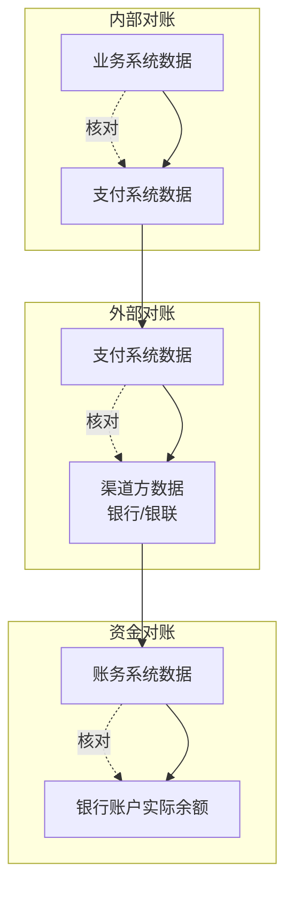
```mermaid
graph TB
    subgraph 内部对账
        A1[业务系统数据]
        A2[支付系统数据]
        A1 -.->|核对| A2
    end

    subgraph 外部对账
        B1[支付系统数据]
        B2[渠道方数据<br/>银行/银联]
        B1 -.->|核对| B2
    end

    subgraph 资金对账
        C1[账务系统数据]
        C2[银行账户实际余额]
        C1 -.->|核对| C2
    end

    A1 --> A2 --> B1 --> B2 --> C1 --> C2
```

**对账差异处理：**

```
对账差异类型：
1. 长款：我方有记录，对方无记录
   - 可能原因：对方处理失败、数据丢失
   - 处理：联系对方核实，补录或冲正

2. 短款：我方无记录，对方有记录
   - 可能原因：我方处理失败、数据丢失
   - 处理：核实交易真实性，补录或退回

3. 金额不一致：双方记录金额不同
   - 可能原因：计算错误、费率差异
   - 处理：逐笔核实，调整差异
```

---

## 八、新兴支付技术：面向未来

### 8.1 数字货币：央行数字货币（CBDC）

央行数字货币（Central Bank Digital Currency）是由央行发行的数字化法币。

**数字人民币的特点：**

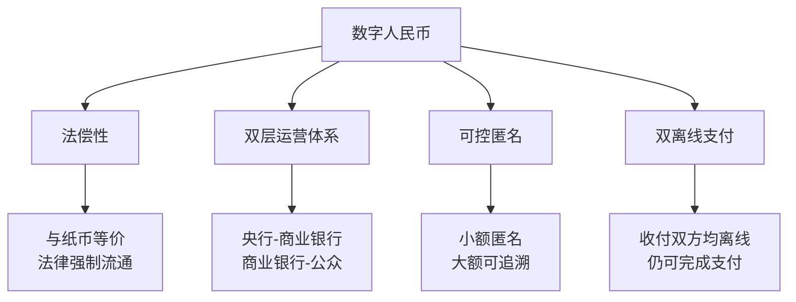
```mermaid
graph TB
    A[数字人民币] --> B[法偿性]
    A --> C[双层运营体系]
    A --> D[可控匿名]
    A --> E[双离线支付]

    B --> B1[与纸币等价<br/>法律强制流通]
    C --> C1[央行-商业银行<br/>商业银行-公众]
    D --> D1[小额匿名<br/>大额可追溯]
    E --> E1[收付双方均离线<br/>仍可完成支付]
```

**数字人民币 vs 微信/支付宝：**

| 特性 | 数字人民币 | 微信/支付宝 |
|------|------------|-------------|
| 法律地位 | 法定货币 | 支付工具 |
| 发行方 | 央行 | 企业 |
| 信用风险 | 无（央行信用） | 有（企业信用） |
| 隐私保护 | 更高 | 一般 |
| 离线支付 | 支持 | 不支持 |
| 利息 | 有（活期利率） | 余额无利息 |

**数字人民币的支付流程：**

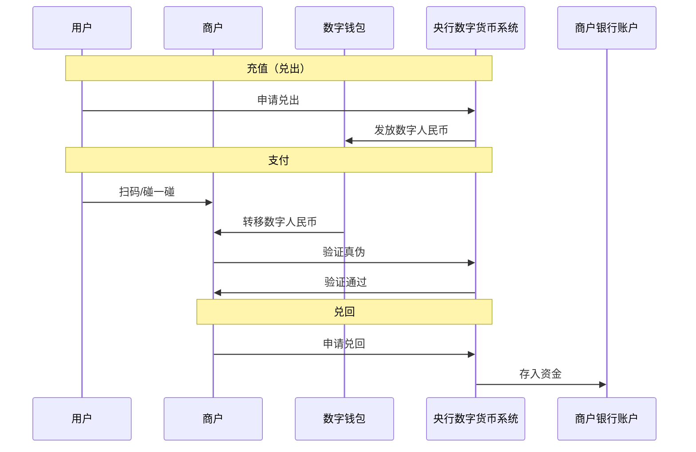
```mermaid
sequenceDiagram
    participant 用户
    participant 商户
    participant 数字钱包
    participant 央行数字货币系统

    Note over 用户,央行数字货币系统: 充值（兑出）
    用户->>央行数字货币系统: 申请兑出
    央行数字货币系统->>数字钱包: 发放数字人民币

    Note over 用户,央行数字货币系统: 支付
    用户->>商户: 扫码/碰一碰
    数字钱包->>商户: 转移数字人民币
    商户->>央行数字货币系统: 验证真伪
    央行数字货币系统->>商户: 验证通过

    Note over 商户,央行数字货币系统: 兑回
    商户->>央行数字货币系统: 申请兑回
    央行数字货币系统->>商户银行账户: 存入资金
```

### 8.2 跨境支付：走向全球化

跨境支付面临更多挑战：多币种、多时区、多法规。

**传统跨境支付的问题：**

```
传统SWIFT跨境支付流程：

汇款人 → 汇款银行 → SWIFT → 中间银行1
→ 中间银行2 → 收款银行 → 收款人

问题：
- 链路长，时效差（1-5天）
- 费用高（每笔15-50美元）
- 信息不透明
- 汇率损失
```

**新兴跨境支付技术：**

```mermaid
graph TB
    A[跨境支付创新] --> B[区块链跨境支付]
    A --> C[央行数字货币桥]
    A --> D[即时跨境支付网络]

    B --> B1[利用分布式账本<br/>降低中间环节]
    C --> C1[多国央行合作<br/>实现即时结算]
    D --> D1[统一标准<br/>提升效率]

    B1 --> E[成本降低50%以上<br/>时效提升至分钟级]
    C1 --> F[预计成本降低80%<br/>时效提升至秒级]
    D1 --> G[已有ISO 20022标准<br/>逐步推广中]
```

**多边央行数字货币桥（mBridge）：**

这是一个由中国人民银行、香港金管局、泰国央行、阿联酋央行等共同参与的项目，旨在实现跨境数字货币支付：

```
传统模式：
A国银行 → A国央行 → 代理行 → SWIFT → 代理行 → B国央行 → B国银行
（6个环节，T+1到T+5）

mBridge模式：
A国银行 → A国央行 → mBridge平台 → B国央行 → B国银行
（4个环节，实时）
```

### 8.3 开放银行：银行服务的API化

开放银行（Open Banking）理念是将银行的服务封装成API，开放给第三方开发者调用：

```mermaid
graph LR
    subgraph 银行
        A1[账户服务]
        A2[支付服务]
        A3[信贷服务]
    end

    subgraph 开放平台
        B[API网关]
    end

    subgraph 第三方应用
        C1[记账APP]
        C2[理财平台]
        C3[电商网站]
    end

    A1 & A2 & A3 --> B
    B --> C1 & C2 & C3
```

**开放银行API示例：**

```
获取账户余额
GET /api/v1/accounts/{account_id}/balance
Authorization: Bearer {access_token}

Response:
{
  "account_id": "6225****5678",
  "currency": "CNY",
  "available_balance": 10000.00,
  "current_balance": 10500.00,
  "frozen_amount": 500.00
}

发起转账
POST /api/v1/transfers
Authorization: Bearer {access_token}

Request:
{
  "from_account": "6225****5678",
  "to_account": "6228****1234",
  "amount": 1000.00,
  "currency": "CNY",
  "purpose": "还款"
}
```

### 8.4 嵌入式金融：支付无处不在

嵌入式金融是指将金融服务嵌入到非金融场景中：

```mermaid
mindmap
  root((嵌入式金融))
    电商场景
      分期付款
      白条/花呗
      商家贷款
    出行场景
      打车免密支付
      地铁刷码
      加油站无感支付
    生活场景
      自动售货机
      智能快递柜
      共享单车
    企业场景
      SaaS内嵌支付
      供应链金融
      工资代发
```

**无感支付示例：**

```
高速公路ETC支付流程：

1. 车辆进入高速
   - ETC天线识别OBU设备
   - 记录入口信息

2. 车辆离开高速
   - ETC天线再次识别
   - 计算通行费

3. 自动扣费
   - 从绑定账户自动扣款
   - 推送扣费通知

全程无需停车，无需操作，真正"无感"
```

---

## 九、支付合规：不可逾越的红线

### 9.1 支付行业的主要法规

在中国从事支付业务，必须严格遵守相关法规：

```mermaid
timeline
    title 中国支付行业法规演进
    2010 : 非金融机构支付服务管理办法
         : 支付业务许可证制度建立
    2015 : 非银行支付机构网络支付业务管理办法
         : 支付账户分类管理
    2017 : 关于规范支付机构客户备付金存管工作通知
         : 备付金集中存管
    2018 : 条码支付业务规范
         : 扫码支付监管
    2020 : 电子商务法实施
         : 规范电商支付
    2021 : 非银行支付机构条例
         : 分类监管，重罚违规
```

### 9.2 支付牌照

在中国，从事支付业务必须获得支付牌照：

```
支付牌照类型：

┌─────────────────────────────────────┐
│           支付业务许可证              │
├─────────────────────────────────────┤
│ 1. 储值账户运营（预付卡发行）          │
│    - 单用途预付卡                    │
│    - 多用途预付卡                    │
│                                     │
│ 2. 支付交易处理                      │
│    - 网络支付（互联网支付）           │
│    - 移动电话支付                    │
│    - 固定电话支付                    │
│    - 数字电视支付                    │
│                                     │
│ 3. 银行卡收单                        │
│    - 实体卡收单                      │
│    - 网络收单                       │
└─────────────────────────────────────┘
```

### 9.3 反洗钱要求

支付机构必须履行反洗钱义务：

```
反洗钱工作要求：

1. 客户身份识别
   - 实名认证
   - 受益所有人识别
   - 风险等级划分

2. 大额和可疑交易报告
   - 单笔或当日累计人民币5万元以上
   - 或外币等值1万美元以上
   - 需向反洗钱监测中心报告

3. 客户资料和交易记录保存
   - 客户身份资料保存5年
   - 交易记录保存5年

4. 黑名单监控
   - 联合国制裁名单
   - 公安部发布的恐怖活动组织名单
```

---

## 十、结语：支付的未来在哪里？

回顾支付技术的发展历程，我们可以看到清晰的演进脉络：

```mermaid
timeline
    title 支付技术演进历程
    section 实物支付时代
        公元前6000年 : 贝壳货币
        公元前1000年 : 金属货币
        公元10世纪 : 纸币诞生（中国）
    section 电子支付时代
        1960年代 : 信用卡普及
        1990年代 : 网上银行出现
        2000年代 : 第三方支付崛起
    section 移动支付时代
        2010年代 : 扫码支付普及
        2010年代 : NFC支付推广
        2020年代 : 刷脸支付应用
    section 数字货币时代
        2020年代 : 央行数字货币试点
        未来 : 数字法币全面流通？
```