# 计算机组件完全指南：从晶体管到云架构的深度解析

> 深入探索计算机系统的核心构成要素，理解硬件组件如何协同工作支撑现代计算世界

## 一、引言：计算机系统的宇宙观

计算机，这个人类智慧的结晶，已经从最初的庞大机器演变为遍布我们生活每个角落的智能设备。从口袋里的智能手机到横跨洲际的数据中心，计算机组件构成了数字文明的基础设施。深入理解计算机组件，不仅是技术人员的必修课，更是理解现代科技世界的钥匙。

计算机系统按照冯·诺依曼体系结构，本质上由五大核心组件构成：

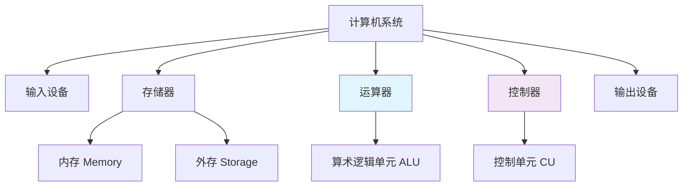

## 二、基础组件：从物理到逻辑的跨越

### 2.1 晶体管：信息的原子

晶体管是计算机世界的基石，是现代电子设备的基本构建块。一个典型的MOSFET晶体管工作原理：

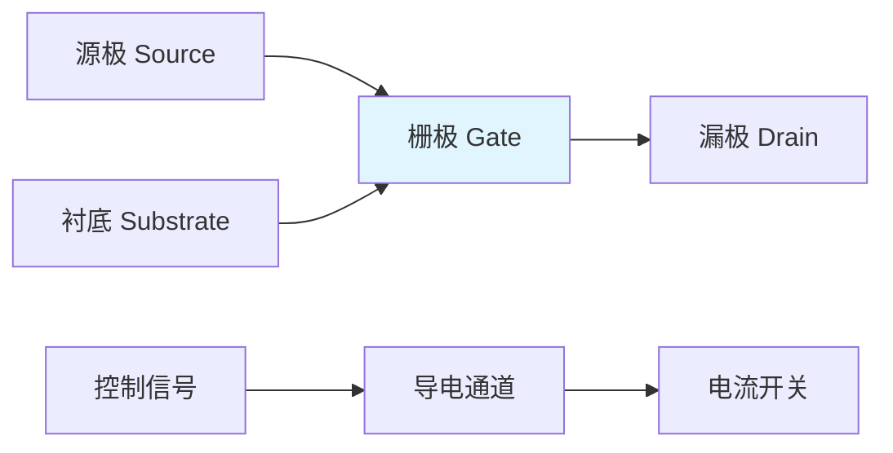

**晶体管的关键特性**：
- **尺寸**：现代处理器包含数十亿个晶体管，单个晶体管尺寸已达纳米级别
- **开关速度**：GHz级别的开关频率，每秒可切换数十亿次
- **功耗**：从早期的数瓦到现在的微瓦级别，功耗大幅降低

**晶体管尺寸演进（摩尔定律）**：
| 年代 | 工艺节点 | 晶体管数量 | 性能提升 |
|------|----------|------------|----------|
| 1970s | 10μm | 数千 | 基础计算 |
| 1980s | 1μm | 数万 | 个人计算机 |
| 1990s | 0.35μm | 数百万 | 多媒体处理 |
| 2000s | 90nm | 数亿 | 互联网时代 |
| 2010s | 22nm | 数十亿 | 移动计算 |
| 2020s | 5nm | 数百亿 | AI计算 |

### 2.2 逻辑门：布尔代数的物理实现

晶体管组合形成逻辑门，实现基本的布尔运算：

**基本逻辑门及其真值表**：

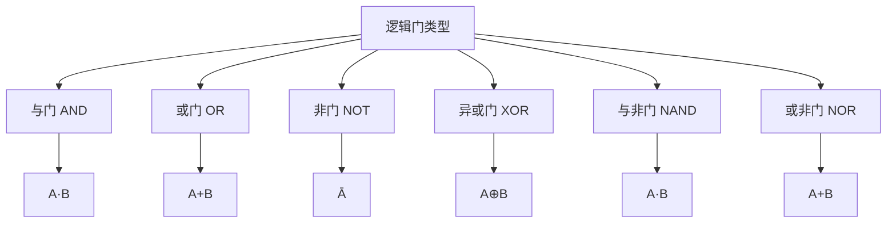

**逻辑门的晶体管实现**：
```
# 与非门(NAND)的CMOS实现（最基础的逻辑门）
输入A --- PMOS1 ---- 输出Y
        |
输入B --- PMOS2
        |
      NMOS1
        |
输入A --- NMOS2 --- 地
```

NAND门是通用逻辑门，所有其他逻辑功能都可以通过NAND门组合实现。

## 三、中央处理器（CPU）：计算机的大脑

### 3.1 CPU架构演进历程

CPU架构经历了从简单到复杂的演进：


### 3.2 现代CPU内部结构

一个典型的现代CPU包含多个功能单元：

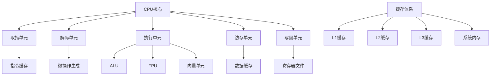

### 3.3 指令流水线技术

**经典5级流水线**：
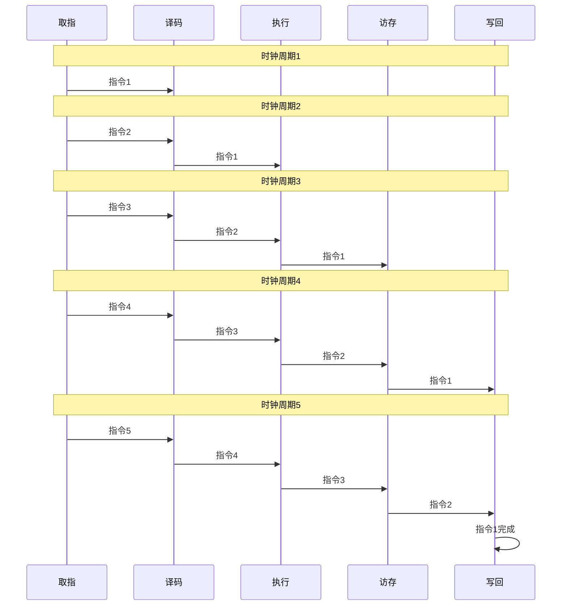

**流水线性能优势**：
- **吞吐量**：理想情况下每个时钟周期完成一条指令
- **并行性**：多条指令在不同阶段同时执行
- **效率**：硬件利用率显著提高

### 3.4 超标量架构与乱序执行

现代CPU采用超标量设计，每个时钟周期可以发射多条指令：

```python
# 超标量处理器的指令发射示例
class SuperscalarProcessor:
    def __init__(self):
        self.issue_width = 4  # 每个周期可发射4条指令
        self.execution_units = {
            'alu': 2,      # 2个ALU单元
            'fpu': 1,      # 1个浮点单元
            'mem': 2,      # 2个访存单元
            'branch': 1    # 1个分支单元
        }
    
    def execute_instructions(self, instruction_stream):
        """超标量指令执行模拟"""
        completed = 0
        cycle = 0
        
        while instruction_stream:
            # 每个周期发射多条指令
            issued = min(self.issue_width, len(instruction_stream))
            current_batch = instruction_stream[:issued]
            instruction_stream = instruction_stream[issued:]
            
            # 乱序执行：根据依赖关系重新排序
            reordered = self.reorder_instructions(current_batch)
            
            # 并行执行
            for instr in reordered:
                if self.can_execute(instr):
                    self.execute(instr)
                    completed += 1
            
            cycle += 1
            
        return completed, cycle
```

## 四、存储器体系：数据的金字塔

### 4.1 存储器层次结构

计算机存储器按照速度、容量和成本形成金字塔结构：

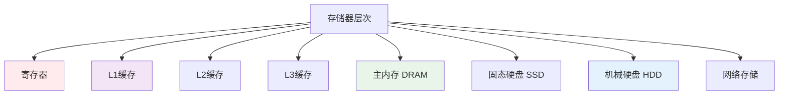

**存储器性能参数对比**：

| 存储类型 | 访问时间 | 容量 | 成本/GB | 技术特点 |
|----------|----------|------|---------|----------|
| 寄存器 | ~0.1ns | 数KB | 极高 | CPU内部，最快 |
| L1缓存 | ~1ns | 32-64KB | 很高 | SRAM，分指令/数据 |
| L2缓存 | ~5ns | 256KB-1MB | 高 | 共享或私有 |
| L3缓存 | ~20ns | 8-64MB | 中等 | 多核共享 |
| 主内存 | ~100ns | 8-128GB | 低 | DRAM，易失性 |
| SSD | ~100μs | 256GB-8TB | 较低 | 非易失，快速 |
| HDD | ~10ms | 1-20TB | 最低 | 机械，大容量 |

### 4.2 缓存一致性协议

多核处理器中，缓存一致性至关重要：

**MESI协议状态转换**：
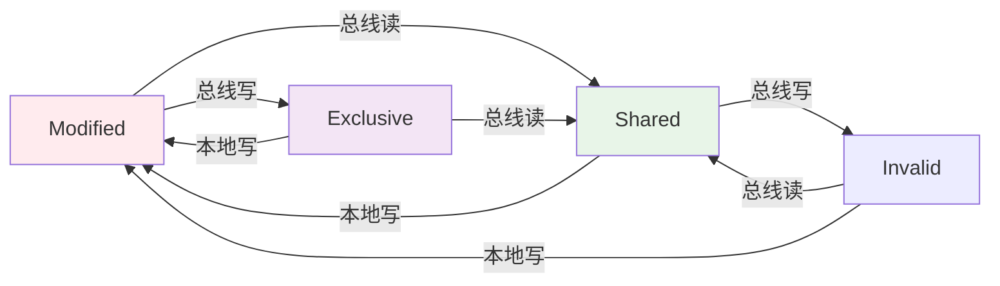

**MESI状态含义**：
- **Modified**：缓存行已被修改，与主内存不一致
- **Exclusive**：缓存行独占，与主内存一致
- **Shared**：缓存行被多个核心共享
- **Invalid**：缓存行无效，需要重新读取

### 4.3 虚拟内存与页表

虚拟内存将物理内存和磁盘存储统一管理：

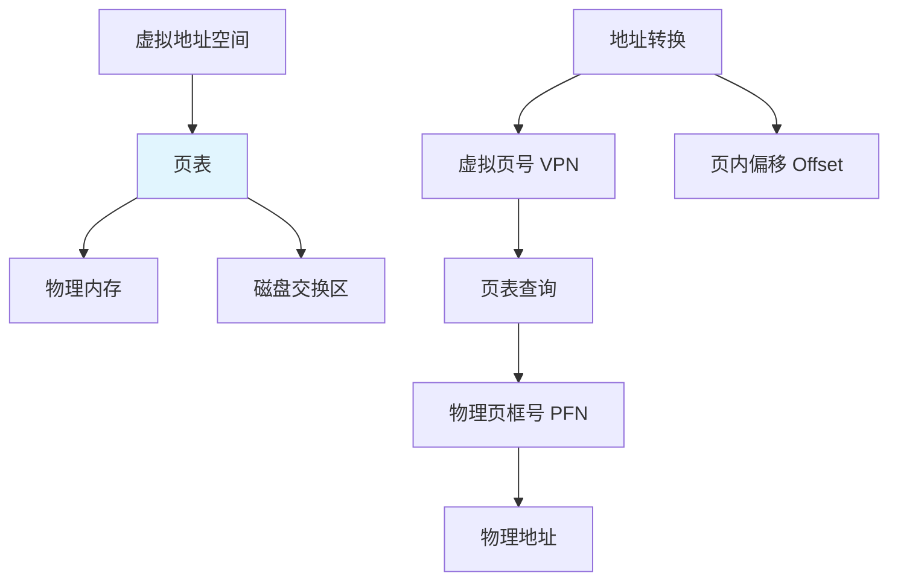

**页表项结构示例**：
```
63                12 11       0
+------------------+----------+
| 物理页框号 PFN   | 控制位   |
+------------------+----------+

控制位包含：
- P（存在位）：页面是否在内存中
- R/W（读写权限）：页面访问权限
- U/S（用户/内核）：特权级别
- A（访问位）：页面是否被访问
- D（脏位）：页面是否被修改
```

## 五、输入输出系统：与世界的接口

### 5.1 I/O体系结构演进

计算机I/O系统经历了重要变革：


### 5.2 现代I/O总线架构

**PCIe总线层次结构**：
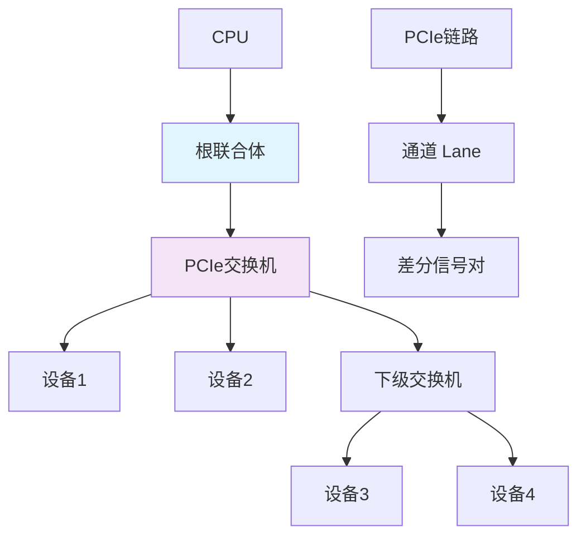

**PCIe性能规格**：
| 版本 | 单通道速率 | x16带宽 | 推出时间 |
|------|------------|---------|----------|
| PCIe 1.0 | 2.5 GT/s | 8 GB/s | 2003年 |
| PCIe 2.0 | 5.0 GT/s | 16 GB/s | 2007年 |
| PCIe 3.0 | 8.0 GT/s | 32 GB/s | 2010年 |
| PCIe 4.0 | 16.0 GT/s | 64 GB/s | 2017年 |
| PCIe 5.0 | 32.0 GT/s | 128 GB/s | 2019年 |
| PCIe 6.0 | 64.0 GT/s | 256 GB/s | 2021年 |

### 5.3 存储接口技术

**NVMe协议栈**：
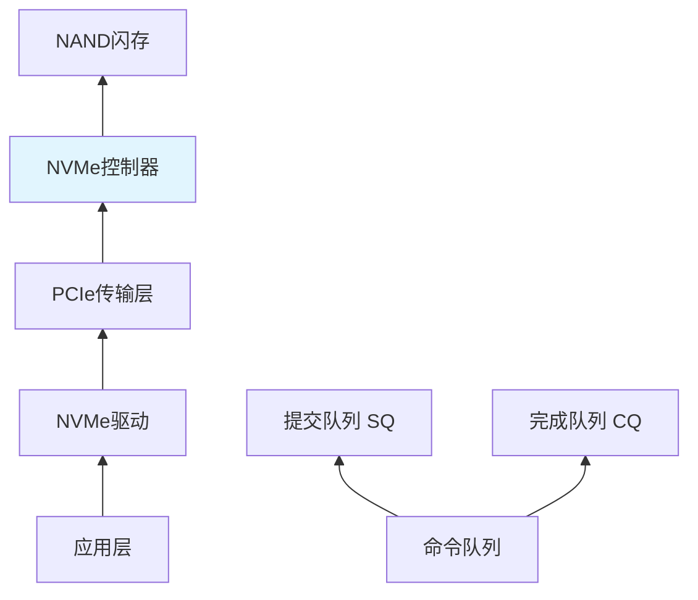

**NVMe与传统SATA对比**：
- **队列深度**：NVMe支持64K队列深度，SATA仅32
- **并行性**：NVMe多队列并行处理，SATA单队列
- **延迟**：NVMe延迟<10μs，SATA延迟>100μs
- **协议开销**：NVMe协议栈更精简高效

## 六、GPU与专用加速器

### 6.1 GPU架构革命

GPU从图形处理器演变为通用计算加速器：

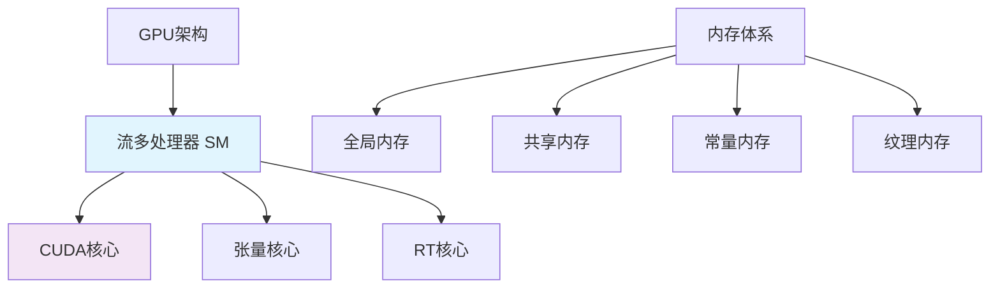

### 6.2 CUDA编程模型

**GPU线程层次结构**：
```c++
// CUDA内核函数示例
__global__ void vectorAdd(float* A, float* B, float* C, int N) {
    // 计算线程全局索引
    int i = blockIdx.x * blockDim.x + threadIdx.x;
    
    if (i < N) {
        C[i] = A[i] + B[i];  // 并行执行
    }
}

// 主机端调用
int main() {
    int N = 1000000;
    int blockSize = 256;
    int numBlocks = (N + blockSize - 1) / blockSize;
    
    vectorAdd<<<numBlocks, blockSize>>>(d_A, d_B, d_C, N);
    
    return 0;
}
```

**线程组织层次**：
- **Thread**：最基本的执行单元
- **Block**：线程块，共享内存的线程组
- **Grid**：线程网格，包含多个线程块
- **Warp**：32个线程的调度单元

## 七、电源管理与热设计

### 7.1 现代电源管理技术

**ACPI电源状态**：
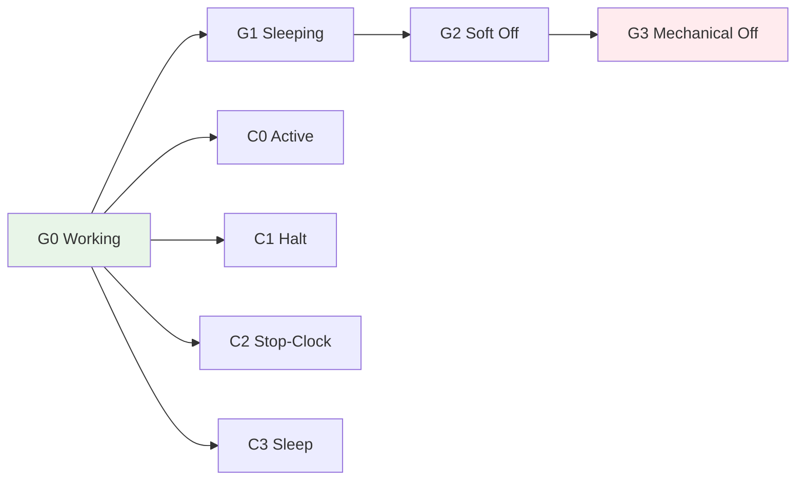

### 7.2 动态电压频率缩放（DVFS）

现代处理器根据负载动态调整电压和频率：

```python
class DVFSController:
    def __init__(self):
        self.available_freqs = [800, 1200, 1600, 2000, 2400, 2800]  # MHz
        self.current_freq = 1600
        self.utilization_thresholds = [0.2, 0.4, 0.6, 0.8]
    
    def adjust_frequency(self, current_utilization):
        """根据利用率调整频率"""
        if current_utilization < 0.2:
            new_freq = 800  # 低负载，降频节能
        elif current_utilization < 0.4:
            new_freq = 1200
        elif current_utilization < 0.6:
            new_freq = 1600
        elif current_utilization < 0.8:
            new_freq = 2000
        else:
            new_freq = 2800  # 高负载，升频提性能
        
        # 频率切换逻辑
        if new_freq != self.current_freq:
            self.apply_frequency_change(new_freq)
            self.current_freq = new_freq
        
        return new_freq
    
    def apply_frequency_change(self, new_freq):
        """实际应用频率变化"""
        # 这里会有电压同步调整
        voltage = self.calculate_voltage(new_freq)
        print(f"频率调整: {self.current_freq}MHz -> {new_freq}MHz")
        print(f"电压调整: {voltage}V")
```

## 八、主板与芯片组：系统的骨架

### 8.1 现代主板架构

**典型主板组件布局**：
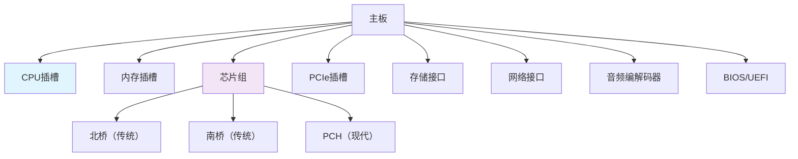

### 8.2 UEFI与传统BIOS

**UEFI启动流程**：
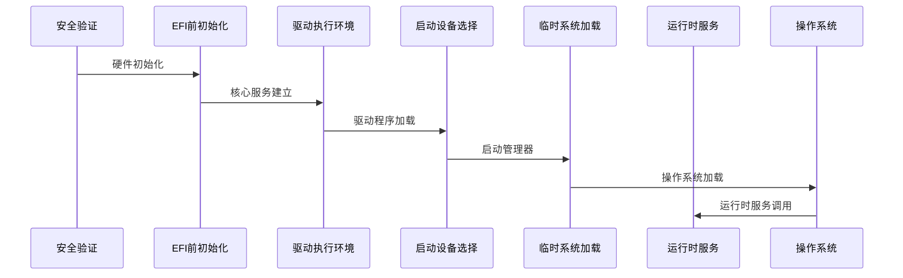

## 九、新兴计算架构

### 9.1 异构计算与XPU

现代计算趋向于专用化加速：

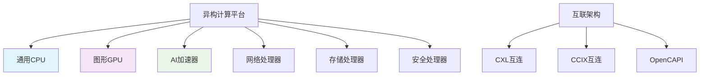

### 9.2 量子计算组件

**量子比特（Qubit）实现技术**：
- **超导量子比特**：基于约瑟夫森结，IBM、Google采用
- **离子阱量子比特**：捕获离子精确控制，IonQ采用
- **光子量子比特**：基于光子偏振，适合量子通信
- **拓扑量子比特**：理论上有更好的纠错能力

## 十、系统集成与性能优化

### 10.1 内存带宽计算

**理论带宽公式**：
```
带宽 = 频率 × 位宽 × 通道数 × 倍增系数
```

**DDR5-4800双通道示例**：
```
频率 = 4800 MT/s (百万传输/秒)
位宽 = 64位 = 8字节
通道数 = 2
倍增系数 = 2 (DDR双倍数据速率)

理论带宽 = 4800 × 8 × 2 × 2 / 8 = 38.4 GB/s
```

### 10.2 缓存命中率优化

**优化代码的数据局部性**：
```c++
// 不好的访问模式（缓存不友好）
for (int i = 0; i < N; i++) {
    for (int j = 0; j < M; j++) {
        sum += matrix[j][i];  // 列优先访问，缓存miss率高
    }
}

// 好的访问模式（缓存友好）
for (int i = 0; i < N; i++) {
    for (int j = 0; j < M; j++) {
        sum += matrix[i][j];  // 行优先访问，缓存命中率高
    }
}
```