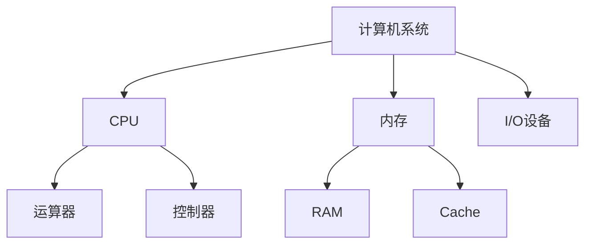

# 计算机科学

> 计算机组成原理、数学基础等核心知识

---

## 🖥️ 计算机组成

| 主题 | 说明 | 链接 |
|------|------|------|
| 计算机组件完全指南 | CPU、内存、I/O系统 | [查看 →](computer-components-complete.md) |
| 数字系统完全指南 | 二进制、浮点数表示 | [查看 →](numbers-complete.md) |
| 声音原理深度解析 | 音频数字化原理 | [查看 →](声音原理.md) |

---

## 📐 核心概念

