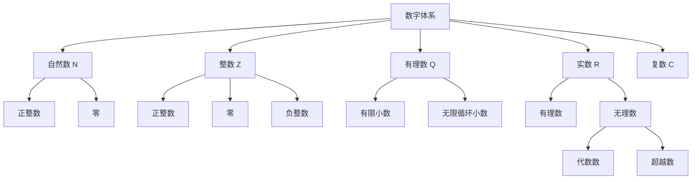
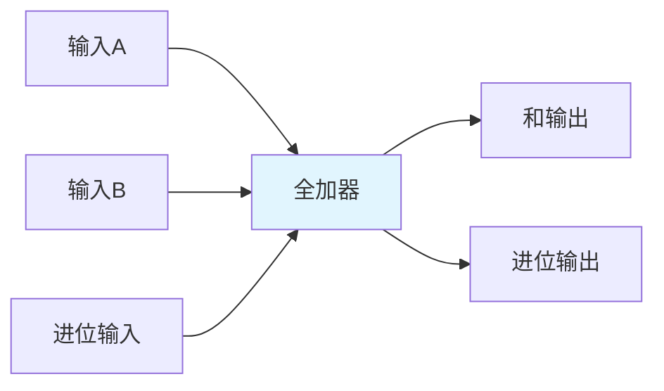
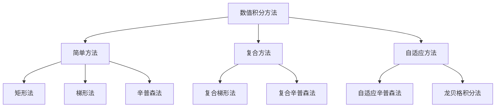
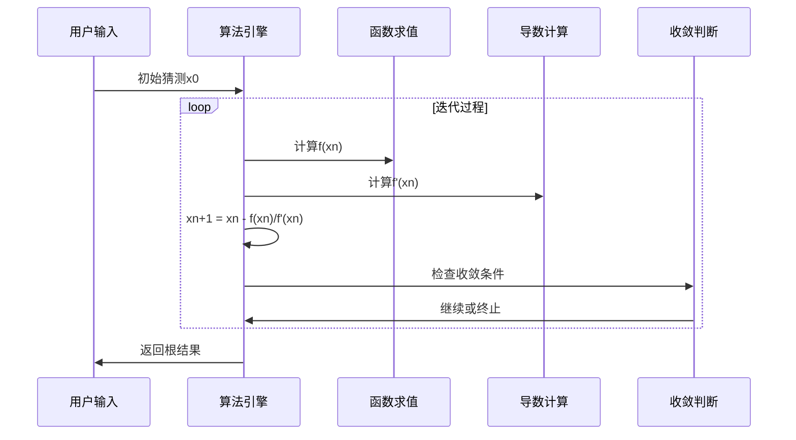
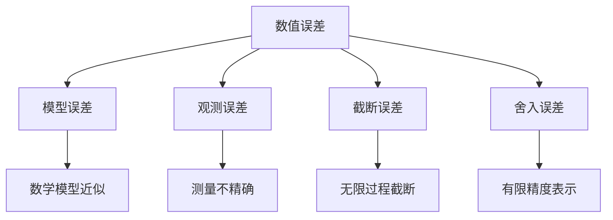
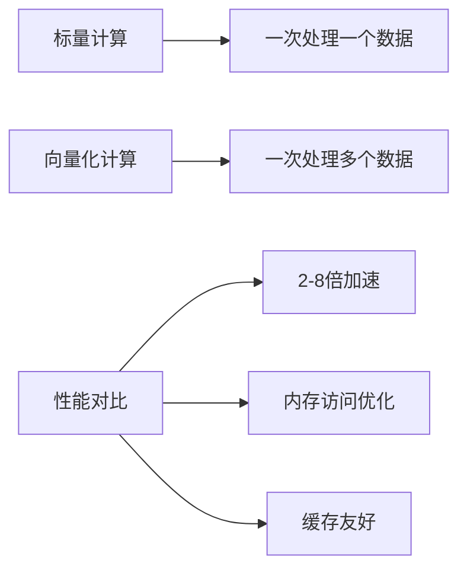
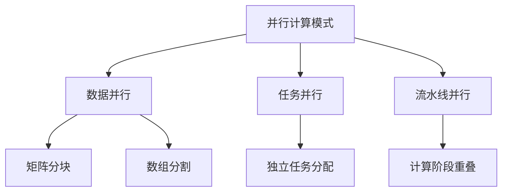
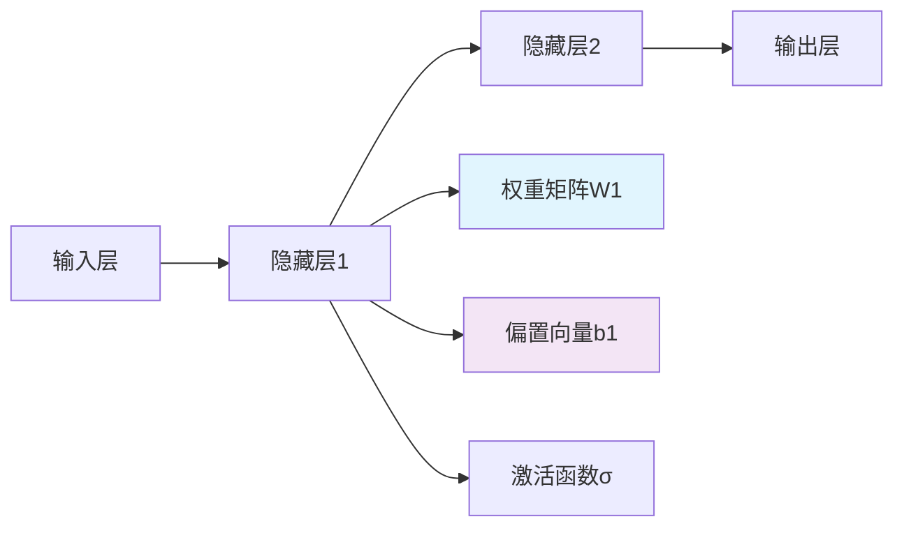
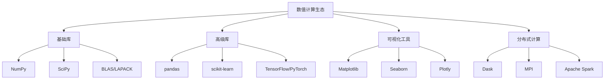
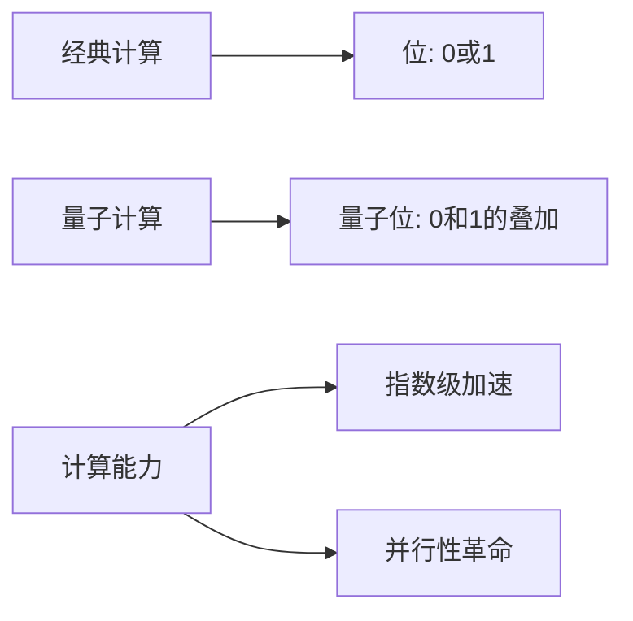

# Numbers完全指南：从数学基础到高级数值计算的深度解析

> 深入探索数字的本质、计算机表示、算法优化与应用实践，掌握现代数值计算的核心技术

## 一、引言：数字的宇宙观

数字，这个看似简单的概念，却是人类文明和计算机科学中最基础、最核心的元素。从古埃及人的计数符号到现代量子计算机的量子比特，数字承载着人类认知世界、探索未知的全部智慧。在信息爆炸的时代，对数字的深入理解不再是数学家的专利，而是每一位技术从业者必备的基础素养。

数字不仅仅是用于计算的符号，它们是：
- **信息表达的载体** - 所有数据最终都转换为数字
- **算法设计的基础** - 计算复杂度和性能优化的核心
- **系统架构的支柱** - 从内存管理到网络协议的数字表示
- **人工智能的燃料** - 深度学习中的张量运算

## 二、数字的基本概念与数学基础

### 2.1 数字的分类体系

数字世界按照数学性质可以划分为完整的分层结构：



### 2.2 重要的数学常数及其意义

**基本数学常数在计算机科学中的应用**：

| 常数 | 符号 | 近似值 | 应用场景 |
|------|------|--------|----------|
| π | π | 3.14159 | 图形学、信号处理、加密算法 |
| e | e | 2.71828 | 概率统计、机器学习、复利计算 |
| φ | φ | 1.61803 | 算法设计、数据结构、美学优化 |
| √2 | √2 | 1.41421 | 图像压缩、数值分析、几何计算 |

**欧拉公式的计算机意义**：
```
e^(iπ) + 1 = 0
```
这个被誉为"数学中最美的公式"在信号处理中有着重要应用，建立了实数域和复数域之间的桥梁。

## 三、计算机中的数字表示

### 3.1 二进制系统：计算机的语言

计算机使用二进制系统表示数字，这是由电子器件的物理特性决定的：


**二进制转换原理**：
```python
# 十进制转二进制算法实现
def decimal_to_binary(n):
    if n == 0:
        return "0"
    binary = ""
    while n > 0:
        binary = str(n % 2) + binary
        n = n // 2
    return binary

# 示例：255的二进制表示
print(decimal_to_binary(255))  # 输出: "11111111"
```

### 3.2 整数表示：原码、反码与补码

计算机使用补码表示有符号整数，这是现代计算机体系结构的基础：

**三种表示方法的对比**：

| 数值 | 原码 | 反码 | 补码 |
|------|------|------|------|
| +7 | 0111 | 0111 | 0111 |
| +0 | 0000 | 0000 | 0000 |
| -0 | 1000 | 1111 | 0000 |
| -7 | 1111 | 1000 | 1001 |

**补码的优势**：
- 统一的零表示（没有+0和-0之分）
- 简化加法器设计（减法可以转换为加法）
- 便于溢出检测

### 3.3 浮点数表示：IEEE 754标准

现代计算机使用IEEE 754标准表示浮点数，其结构如下：

```mermaid
graph TD
    A[IEEE 754浮点数] --> B[符号位 S]
    A --> C[指数位 E]
    A --> D[尾数位 M]
    
    B --> B1[1位: 0正1负]
    C --> C1[8位: 偏移127]
    D --> D1[23位: 隐含前导1]
    
    E1[计算公式] --> F[(-1)^S × 1.M × 2^(E-127)]
```

**特殊值的表示**：
- **零**：指数和尾数全为0
- **无穷大**：指数全1，尾数全0
- **NaN**：指数全1，尾数非0

**浮点数精度问题示例**：
```python
# 浮点数精度丢失示例
print(0.1 + 0.2)  # 输出: 0.30000000000000004
print(0.1 + 0.2 == 0.3)  # 输出: False

# 使用decimal模块解决精度问题
from decimal import Decimal
print(Decimal('0.1') + Decimal('0.2') == Decimal('0.3'))  # 输出: True
```

## 四、数值计算的基础算法

### 4.1 基本算术运算的实现

**加法运算的硬件实现**：


**乘法运算的优化算法**：

1. **竖式乘法**：时间复杂度O(n²)
2. **Karatsuba算法**：时间复杂度O(n^log₂3) ≈ O(n^1.585)
3. **快速傅里叶变换(FFT)**：时间复杂度O(n log n)

```python
def karatsuba_multiply(x, y):
    """Karatsuba快速乘法算法"""
    if x < 10 or y < 10:
        return x * y
    
    # 计算数字长度
    n = max(len(str(x)), len(str(y)))
    m = n // 2
    
    # 分割数字
    high1, low1 = divmod(x, 10**m)
    high2, low2 = divmod(y, 10**m)
    
    # 递归计算
    z0 = karatsuba_multiply(low1, low2)
    z1 = karatsuba_multiply((low1 + high1), (low2 + high2))
    z2 = karatsuba_multiply(high1, high2)
    
    return z2 * 10**(2*m) + (z1 - z2 - z0) * 10**m + z0
```

### 4.2 数值积分方法

**常用数值积分算法的比较**：



**梯形法的Python实现**：
```python
def trapezoidal_rule(f, a, b, n=1000):
    """梯形法数值积分"""
    h = (b - a) / n
    result = 0.5 * (f(a) + f(b))
    
    for i in range(1, n):
        x = a + i * h
        result += f(x)
    
    return result * h

# 计算∫sin(x)dx从0到π，理论值应为2
import math
result = trapezoidal_rule(math.sin, 0, math.pi)
print(f"梯形法结果: {result}")  # 输出: 约2.000
```

### 4.3 数值求解方程

**牛顿迭代法求解方程根**：



**牛顿法的Python实现**：
```python
def newton_method(f, df, x0, tol=1e-10, max_iter=100):
    """牛顿法求解方程根"""
    x = x0
    for i in range(max_iter):
        fx = f(x)
        dfx = df(x)
        
        if abs(dfx) < 1e-15:  # 避免除零
            raise ValueError("导数为零，无法继续迭代")
        
        x_new = x - fx / dfx
        
        if abs(x_new - x) < tol:
            return x_new, i + 1
        
        x = x_new
    
    raise ValueError("未在最大迭代次数内收敛")

# 求解x² - 2 = 0的根（√2）
f = lambda x: x**2 - 2
df = lambda x: 2*x
root, iterations = newton_method(f, df, 1.0)
print(f"根: {root}, 迭代次数: {iterations}")
```

## 五、数值精度与误差分析

### 5.1 误差类型与来源

数值计算中的误差主要分为四类：



### 5.2 条件数与数值稳定性

**矩阵条件数的概念**：
```
cond(A) = ||A|| · ||A⁻¹||
```

条件数反映了线性方程组求解对输入误差的敏感程度：

| 条件数范围 | 系统性质 | 求解稳定性 |
|-----------|----------|------------|
| cond(A) ≈ 1 | 良态系统 | 非常稳定 |
| 1 < cond(A) < 10³ | 中等条件 | 相对稳定 |
| cond(A) > 10³ | 病态系统 | 不稳定 |
| cond(A) → ∞ | 奇异系统 | 无法求解 |

### 5.3 数值稳定性的改进技术

**避免大数吃小数的技巧**：
```python
# 不稳定的计算方法
def unstable_sum(numbers):
    result = 0.0
    for num in numbers:
        result += num  # 大数可能吃掉小数
    return result

# 稳定的Kahan求和算法
def kahan_sum(numbers):
    total = 0.0
    compensation = 0.0  # 补偿项
    
    for num in numbers:
        y = num - compensation  # 加上补偿
        t = total + y
        compensation = (t - total) - y  # 计算丢失的精度
        total = t
    
    return total

# 测试
numbers = [1e16, 1.0, -1e16]
print("直接求和:", unstable_sum(numbers))  # 可能为0.0
print("Kahan求和:", kahan_sum(numbers))     # 正确为1.0
```

## 六、高性能数值计算

### 6.1 向量化计算

现代CPU的SIMD（单指令多数据）架构支持向量化计算：



**NumPy向量化示例**：
```python
import numpy as np
import time

# 标量计算（慢）
def scalar_compute():
    result = 0
    for i in range(1000000):
        result += i * i
    return result

# 向量化计算（快）
def vectorized_compute():
    arr = np.arange(1000000)
    return np.sum(arr * arr)

# 性能对比
t1 = time.time()
scalar_result = scalar_compute()
t2 = time.time()

vector_result = vectorized_compute()
t3 = time.time()

print(f"标量计算时间: {t2-t1:.4f}s")
print(f"向量计算时间: {t3-t2:.4f}s")
print(f"加速比: {(t2-t1)/(t3-t2):.1f}x")
```

### 6.2 并行计算与多线程

**数值计算的并行化策略**：



**多线程数值积分示例**：
```python
import threading
import math

class ParallelIntegrator:
    def __init__(self, f, a, b, num_threads=4):
        self.f = f
        self.a = a
        self.b = b
        self.num_threads = num_threads
        self.results = [0] * num_threads
    
    def integrate_segment(self, thread_id, a_seg, b_seg):
        """每个线程计算一个区间的积分"""
        n = 1000  # 每个线程的梯形数
        h = (b_seg - a_seg) / n
        result = 0.5 * (self.f(a_seg) + self.f(b_seg))
        
        for i in range(1, n):
            x = a_seg + i * h
            result += self.f(x)
        
        self.results[thread_id] = result * h
    
    def compute(self):
        threads = []
        segment_width = (self.b - self.a) / self.num_threads
        
        for i in range(self.num_threads):
            a_seg = self.a + i * segment_width
            b_seg = a_seg + segment_width
            
            thread = threading.Thread(
                target=self.integrate_segment, 
                args=(i, a_seg, b_seg)
            )
            threads.append(thread)
            thread.start()
        
        for thread in threads:
            thread.join()
        
        return sum(self.results)

# 测试并行积分
integrator = ParallelIntegrator(math.sin, 0, math.pi)
result = integrator.compute()
print(f"并行积分结果: {result}")
```

## 七、数值计算在人工智能中的应用

### 7.1 深度学习中的数值计算

深度学习本质上是大规模的数值计算问题：

**神经网络的前向传播**：


**数学表示**：
```
z⁽ˡ⁾ = W⁽ˡ⁾ · a⁽ˡ⁻¹⁾ + b⁽ˡ⁾
a⁽ˡ⁾ = σ(z⁽ˡ⁾)
```

### 7.2 梯度下降算法的数值实现

**随机梯度下降的核心计算**：
```python
import numpy as np

class SGD:
    def __init__(self, learning_rate=0.01):
        self.lr = learning_rate
    
    def update(self, params, grads):
        """参数更新：θ = θ - η·∇J(θ)"""
        for key in params:
            params[key] -= self.lr * grads[key]

def numerical_gradient(f, x):
    """数值梯度计算"""
    h = 1e-4
    grad = np.zeros_like(x)
    
    for idx in range(x.size):
        tmp_val = x[idx]
        
        # f(x+h)
        x[idx] = tmp_val + h
        fxh1 = f(x)
        
        # f(x-h)  
        x[idx] = tmp_val - h
        fxh2 = f(x)
        
        grad[idx] = (fxh1 - fxh2) / (2 * h)
        x[idx] = tmp_val  # 恢复值
    
    return grad

# 测试梯度计算
def quadratic_function(x):
    return x[0]**2 + x[1]**2

x = np.array([3.0, 4.0])
grad = numerical_gradient(quadratic_function, x)
print(f"梯度: {grad}")  # 应该接近[6, 8]
```

## 八、数值计算库与工具链

### 8.1 科学计算生态系统

现代数值计算依赖于完整的工具链：



### 8.2 NumPy核心功能深度解析

**NumPy数组的内存布局**：
```python
import numpy as np

# 创建数组并查看内存信息
arr = np.array([[1, 2, 3], [4, 5, 6]])
print("数组形状:", arr.shape)
print("数组维度:", arr.ndim)
print("数组大小:", arr.size)
print("数据类型:", arr.dtype)
print("内存占用:", arr.nbytes, "bytes")

# 内存布局分析
print("步长(stride):", arr.strides)  # 每个维度移动的字节数
print("C连续:", arr.flags['C_CONTIGUOUS'])
print("F连续:", arr.flags['F_CONTIGUOUS'])
```

**广播机制的工作原理**：
```python
# 广播示例
a = np.array([[1, 2, 3]])  # 形状: (1, 3)
b = np.array([[10], [20]]) # 形状: (2, 1)

# 广播规则：从尾部维度开始匹配
result = a + b  # 形状: (2, 3)
print("广播结果:\n", result)
"""
输出:
[[11 12 13]
 [21 22 23]]
"""
```

## 九、数值计算的实践应用

### 9.1 金融数值计算

**Black-Scholes期权定价模型**：
```python
import numpy as np
from scipy.stats import norm

def black_scholes_call(S, K, T, r, sigma):
    """欧式看涨期权定价"""
    d1 = (np.log(S / K) + (r + 0.5 * sigma**2) * T) / (sigma * np.sqrt(T))
    d2 = d1 - sigma * np.sqrt(T)
    
    call_price = S * norm.cdf(d1) - K * np.exp(-r * T) * norm.cdf(d2)
    return call_price

# 示例计算
S = 100  # 标的资产价格
K = 105  # 行权价
T = 0.25 # 到期时间（年）
r = 0.05 # 无风险利率
sigma = 0.2  # 波动率

price = black_scholes_call(S, K, T, r, sigma)
print(f"看涨期权价格: {price:.2f}")
```

### 9.2 工程数值模拟

**有限元法求解热传导方程**：
```python
import numpy as np

def finite_element_heat():
    """一维热传导方程的有限元求解"""
    # 网格划分
    n_nodes = 11
    L = 1.0  # 杆长度
    nodes = np.linspace(0, L, n_nodes)
    
    # 刚度矩阵组装
    K = np.zeros((n_nodes, n_nodes))
    for i in range(n_nodes - 1):
        h = nodes[i+1] - nodes[i]
        K[i,i] += 1/h
        K[i,i+1] += -1/h
        K[i+1,i] += -1/h
        K[i+1,i+1] += 1/h
    
    # 边界条件处理（两端固定温度）
    K[0,:] = 0; K[0,0] = 1
    K[-1,:] = 0; K[-1,-1] = 1
    
    # 载荷向量
    F = np.zeros(n_nodes)
    F[0] = 100  # 左端温度100°C
    F[-1] = 0   # 右端温度0°C
    
    # 求解线性方程组
    T = np.linalg.solve(K, F)
    return nodes, T

nodes, temperatures = finite_element_heat()
print("节点温度分布:")
for i, (node, temp) in enumerate(zip(nodes, temperatures)):
    print(f"节点{i}: x={node:.2f}, T={temp:.2f}°C")
```

## 十、数值计算的未来趋势

### 10.1 量子数值计算

量子计算将彻底改变数值计算的方式：



### 10.2 自动微分与可微编程

现代数值计算正在向可微编程演进：

**传统数值微分**：有限差分，精度受步长限制
**符号微分**：表达式求导，但无法处理控制流
**自动微分**：结合数值和符号方法的优势

### 10.3 异构计算与专用硬件

- **GPU计算**：大规模并行数值运算
- **TPU专用芯片**：为矩阵运算优化的硬件
- **神经处理器**：为AI计算定制的架构
- **量子处理器**：基于量子力学原理的计算

---