# 声音原理深度解析：从振动到听见，一个困扰人类千年的谜题

> **引言**：为什么物体振动会产生声音？为什么我们在月球上听不到任何声音？为什么同样的声音在不同房间里听起来不一样？这些问题看似简单，背后却隐藏着物理学最深刻的原理。本文将带你由浅入深，一步步揭开声音的神秘面纱。

## 第一章：声音是什么？——从生活现象到科学定义

### 1.1 我们每天都在接触声音

清晨，闹钟的铃声将你从睡梦中唤醒；白天，汽车的喇叭声、行人的交谈声、键盘的敲击声不绝于耳；夜晚，蛙鸣、虫唱、风声伴随着你进入梦乡。声音无处不在，如同空气一般包裹着我们。

但你是否想过：**声音究竟是什么？**

### 1.2 声音是一种波

要回答这个问题，让我们先做一个简单的实验。

找一把吉他，轻轻拨动其中一根弦。当你拨动弦的瞬间，弦开始**振动**。你可以用手指轻轻触摸弦，感受它的颤动。与此同时，你听到了声音。

现在，让我们思考这个过程中的因果关系：

```
振动 → 声音
```

但这中间发生了什么？振动的声音是如何从吉他传播到你的耳朵的？

答案就是：**声音是一种波**——一种机械波。

### 1.3 波的定义：振动的传播

要理解波，我们首先需要理解**振动**。

**振动**是指物体在某个平衡位置附近来回往复的运动。最简单的振动是**简谐运动**，即物体受力大小与位移成正比、方向指向平衡点的运动。弹簧振子就是最经典的例子。


当我们拨动吉他弦时，弦开始振动。弦上的每个点都在做往复运动。但弦的振动本身并不能直接传到你的耳朵——它需要一种“中介”，那就是**介质**。

**波**就是振动在介质中的传播。振动的能量通过介质中相邻粒子之间的相互作用，依次传递出去。就像多米诺骨牌一样，第一个粒子振动，带动第二个，第二个带动第三个……能量就这样传播开来。

### 1.4 声音的本质：疏密波

现在我们需要进一步理解声音波的特殊性质。

声音是一种**纵波**。为了理解纵波，我们先介绍它的对立面——**横波**。

**横波**：振动方向与传播方向垂直。比如你抖动一根绳子，绳子的振动方向是上下，而波的传播方向是水平，这就是横波。

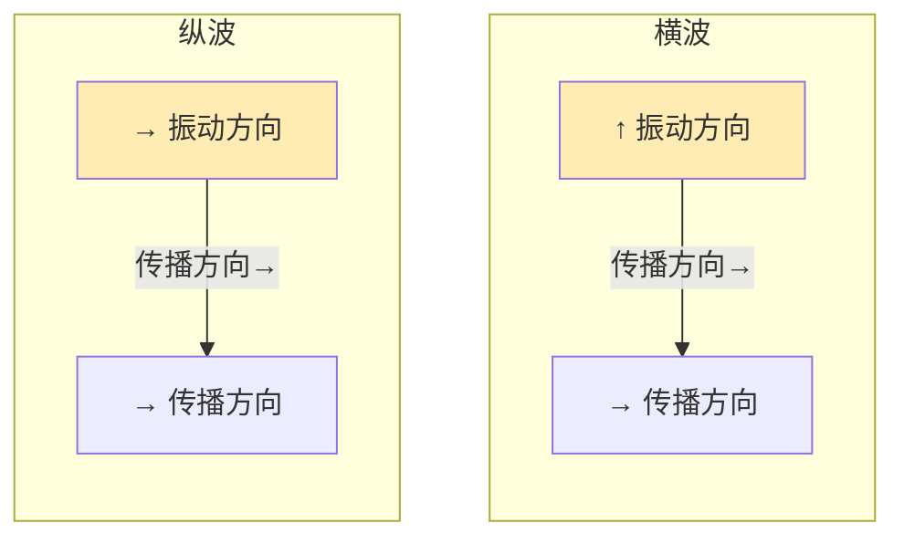

**纵波**：振动方向与传播方向相同。声音就是纵波。

想象一下：你拿着一根弹簧，用力推一下然后松开。弹簧会形成一密一疏的“波浪”，向前传播。这就是纵波的形象展示。

当扬声器振动时，它不断地向前推动空气，形成**压缩区**（密部）；然后向后移动，形成**稀疏区**（疏部）。这种**疏密交替**的波就是声波。


所以，**声音的本质是：振动在介质中传播形成的疏密波。**

---

## 第二章：声音是如何产生的？——一切源于振动

### 2.1 声音产生的三要素

我们已经知道声音源于振动，但并不是所有振动都能产生声音。要产生可听的声音，需要满足三个条件：

1. **振动源**：必须有物体在振动
2. **介质**：必须有传播振动的物质
3. **频率范围**：振动频率必须在人耳可听范围内（20Hz - 20000Hz）

这三个条件缺一不可。

### 2.2 振动源：一切发声的根源

所有的声音都来源于物体的振动。让我们列举一些典型的振动源：

**固体振动**：

- 吉他弦：弦的来回振动
- 鼓面：皮革的上下振动
- 音叉：金属叉的固有振动
- 喉咙：声带的周期性开闭

**液体振动**：

- 波浪：水面周期性的起伏
- 滴水：水滴落入水面的振动

**气体振动**：

- 喇叭：空气在管道中的周期性振动
- 吹笛：气流在管道中产生的振动

### 2.3 频率：决定声音高低的根本因素

**频率**是单位时间内周期性变化的次数，单位是**赫兹（Hz）**，1Hz表示每秒振动一次。

人耳能听到的频率范围是**20Hz到20000Hz**。低于20Hz的称为**次声波**，高于20000Hz的称为**超声波**。

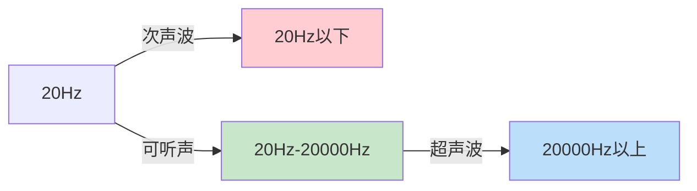

为什么频率决定了音高？这需要从物理本质来解释。

当我们拨动一根弦时，弦的振动是周期性的。频率越高，振动越快，产生的声波周期越短，我们感知到的音高就越高。

**音高与频率的正相关关系是声音学最基本的规律之一。**

有趣的是，音高的变化并不是线性的，而是**对数关系**。这意味着，要让音高升高一个八度，频率需要翻倍。例如：

- A4（标准音高）的频率是440Hz
- A5（高八度）的频率是880Hz
- A3（低八度）的频率是220Hz

这种对数关系源于人耳对声音的感知特性——人耳对频率的感知接近对数刻度。

### 2.4 振幅：决定声音强弱的根本因素

**振幅**是振动过程中偏离平衡位置的最大距离。在声音学中，振幅决定了声音的**响度**。

振幅越大，声音越响；振幅越小，声音越轻。

```mermaid
graph TD
    subgraph 大振幅 = 大声音
        A[大振幅] --> B[大响度]
    end
    
    subgraph 小振幅 = 小声音
        C[小振幅] --> D[小响度]
    end
    
    style B fill:#ffcdd2
    style D fill:#c8e6c9
```

但这里有一个重要的细节：**振幅和响度不是简单的线性关系**。

人耳对响度的感知是**对数关系**。如果振幅增加10倍，响度大约增加10分贝（dB）。分贝是描述声级的常用单位。

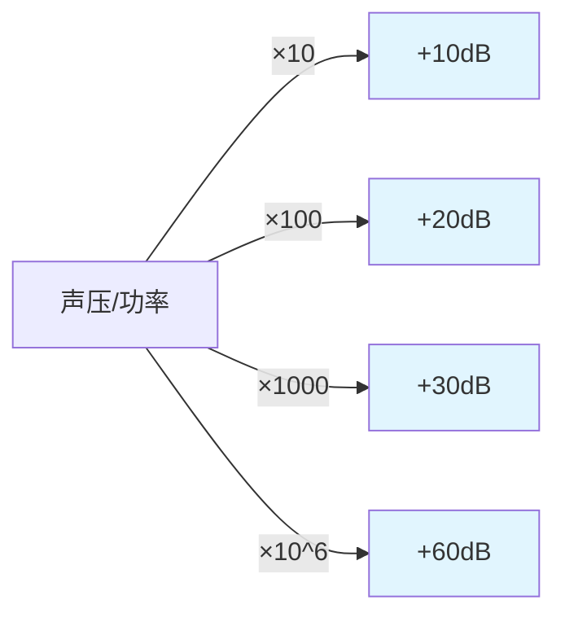

这意味着：
- 10分贝的声音比0分贝（人耳能感知的最弱声音）响10倍
- 20分贝的声音比0分贝响100倍
- 30分贝的声音比0分贝响1000倍

因此，分贝刻度能够更好地描述人耳感知到的响度变化。

### 2.5 音色：区分不同声音的根本因素

为什么你能区分钢琴和小提琴演奏的同一音符？为什么你能听出不同人说话的声音？

答案在于**音色**（或称音质、音色）。

**音色**是指声音的品质和特色，它决定了我们区分不同声源的能力。

那么，音色的本质是什么？

答案是：**谐波**（也称为泛音）。

现实世界中的振动几乎都不是纯粹的简谐运动，而是**多个不同频率的振动叠加**的结果。

例如，当钢琴演奏中央C（261.6Hz）时，除了基频261.6Hz这个“第一谐波”外，还会同时产生：

- 第二谐波：523.2Hz（基频的2倍）
- 第三谐波：784.8Hz（基频的3倍）
- 第四谐波：1046.4Hz（基频的4倍）
- ……以此类推

```mermaid
graph TD
    subgraph 基频 + 谐波 = 音色
        A[基频<br/>261.6Hz] -->|叠加| D[复合波形]
        B[第二谐波<br/>523.2Hz] --> D
        C[第三谐波<br/>784.8Hz] --> D
        E[第四谐波<br/>1046.4Hz] --> D
    end
    
    style D fill:#fff9c4
```

每种乐器、每个人的声音，都有其独特的**谐波组成比例**。正是这种独特的谐波“配方”，让我们能够区分不同的声音。

小提琴的谐波中，高次谐波比较丰富，所以声音听起来比较“尖锐”、“明亮”；而钢琴的谐波组成则比较复杂均匀。

这就是音色的物理本质。

---

## 第三章：声音是如何传播的？——介质的核心作用

### 3.1 传播介质：声音不能真空传播

我们之前提到，声音的产生需要三个要素，其中之一就是**介质**。

这是一个关键点：**声音不能在真空中传播**。

想象一下：如果把一个闹钟放在一个完全抽真空的玻璃罩里，你会听到什么？答案是：**什么也听不到**。因为没有空气分子来传递振动。

这就是为什么在月球上——一个几乎没有大气的地方——即使宇航员面对面站着，也需要通过无线电通讯才能对话。月球表面的安静是“震耳欲聋”的，因为没有空气传播声音。

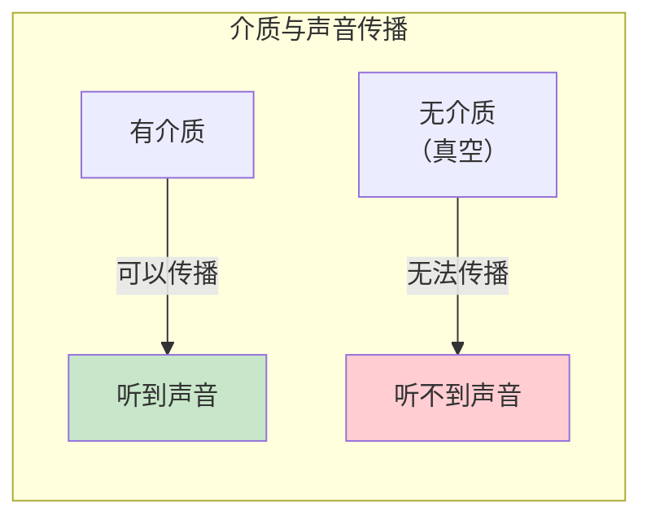

### 3.2 声音在不同介质中的传播

声音可以在**固体、液体、气体**三种介质中传播，而且在不同介质中的传播速度差异巨大。

**声音在常见介质中的传播速度**：

| 介质 | 声速（m/s，20℃） | 特点 |
|------|-----------------|------|
| 空气 | 343 | 最常见 |
| 水 | 1480 | 约为空气的4倍 |
| 钢铁 | 5000 | 约为空气的15倍 |
| 玻璃 | 5200 | 约为空气的15倍 |

为什么声音在不同介质中传播速度不同？

根本原因在于**介质的弹性模量**和**密度**。

**弹性模量**（或称弹性系数）描述介质抵抗形变的能力。弹性模量越大，介质越“硬”，声音传播越快。

**密度**则相反，密度越大，介质越“重”，声音传播越慢。

综合这两个因素，声速可以用以下公式近似表示：

$$v \propto \sqrt{\frac{E}{\rho}}$$

其中：
- $v$ 是声速
- $E$ 是弹性模量
- $\rho$ 是密度

这就解释了为什么钢铁中声音传播比空气快得多——虽然钢铁密度大，但它的弹性模量更是大得惊人。

### 3.3 气体中的声速公式

对于气体，声速的公式更为具体：

$$v = \sqrt{\frac{\gamma \cdot R \cdot T}{M}}$$

其中：
- $\gamma$ 是气体的绝热指数（空气约为1.4）
- $R$ 是气体常数
- $T$ 是绝对温度（单位：开尔文）
- $M$ 是气体的摩尔质量

从这个公式可以得出几个重要结论：

**1. 温度越高，声速越快**

每升高1℃，空气中的声速约增加0.6m/s。这就是为什么夏天蝉鸣声音传得更远、更响亮的原因之一。

**2. 分子量越小，声速越快**

氢气的分子量比空气小得多，所以氢气中声速约为1280m/s，是空气的近4倍。这就是为什么吸入氦气后声音会变得尖锐——不是声音真的变快了，而是氦气改变了声音的共振特性。

### 3.4 声音的吸收与衰减

声音在传播过程中会逐渐减弱，这称为**衰减**。

衰减的原因主要有：

**1. 几何衰减（球面扩散）**

声音从声源向四面八方传播，形成球面波。随着距离增加，波的表面积按平方规律扩大，能量密度按平方规律衰减。

这就是**平方反比定律**：每增加一倍距离，声压减半（衰减6分贝）。

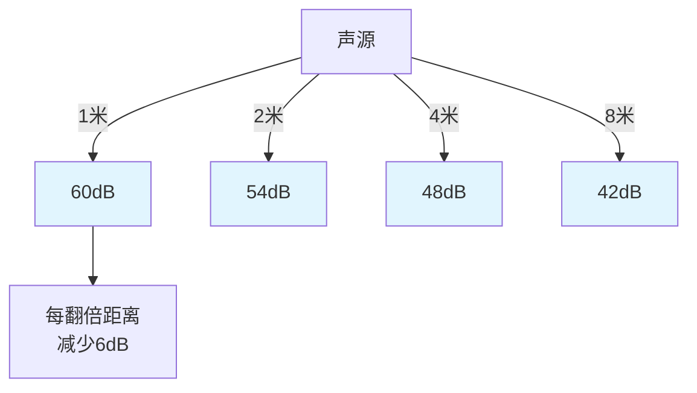

**2. 介质吸收**

声音在传播过程中，一部分能量转化为介质的内能（主要是热能）。这种吸收在高频声音中尤为明显。

这就是为什么高频声音听起来往往没有低频声音传得远——高频声波的能量更容易被空气吸收。

**3. 散射和反射**

当声音遇到障碍物或不均匀介质时，会发生散射和反射，导致能量分散。

---

## 第四章：人耳是如何接收声音的？——自然界最精密的传感器之一

### 4.1 人耳的结构

人耳是自然界最复杂、最精密的器官之一。它的结构可以分为三大部分：

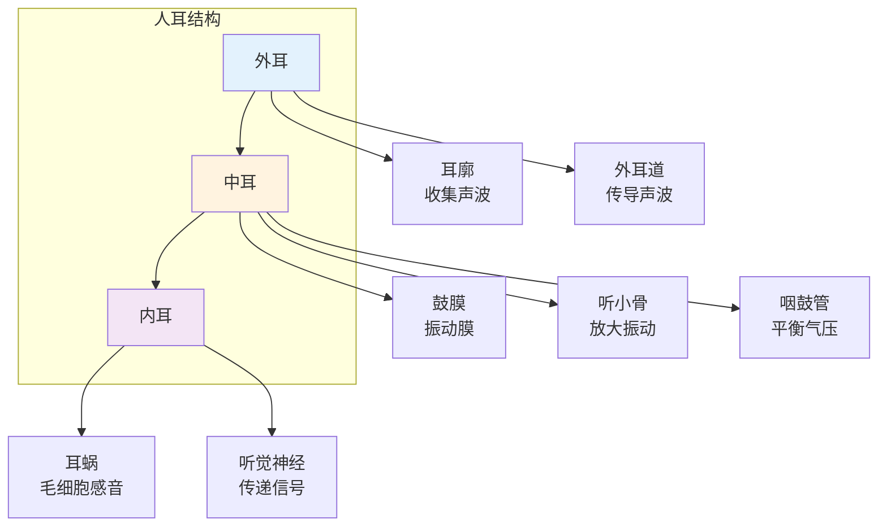

### 4.2 声音接收的物理过程

**第一步：外耳收集声波**

耳廓的形状经过进化优化，能够有效地收集空气中的声波，并将其导入外耳道。耳廓的形状还有助于判断声源的方向。

**第二步：中耳放大声音**

声波到达鼓膜后，引起鼓膜振动。但空气的阻抗与内耳淋巴液的阻抗差异很大——直接传递会导致大部分能量被反射。

这就需要**中耳的放大作用**。

中耳有三块听小骨：**锤骨、砧骨、镫骨**。它们组成一个杠杆系统，将鼓膜的振动放大约1.3倍；同时，鼓膜面积与镫骨底板面积的比值（约17倍）使声压进一步放大。

总体而言，中耳将声压放大约**22倍**，有效地解决了阻抗匹配问题。


**第三步：内耳感受声音**

内耳的核心是**耳蜗**。耳蜗是一个充满淋巴液的螺旋管，长约35mm，分为三个管腔（前庭阶、鼓阶、中阶）。

当镫骨底板振动时，淋巴液随之振动，引起基底膜的波动。基底膜上分布着约15000个**毛细胞**，它们是真正的听觉感受器。

**关键物理原理：行波学说**

不同频率的声音会在基底膜的不同位置产生最大振幅：

- **高频声音**：在基底膜底部（靠近镫骨）产生最大振幅
- **低频声音**：在基底膜顶部（远离镫骨）产生最大振幅

这种**频率-位置对应关系**是理解听觉机制的关键。

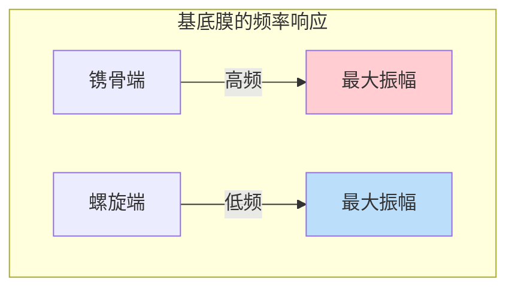

每个毛细胞顶部有数十根静纤毛，它们随淋巴液摆动时，会打开离子通道，产生神经信号。这种机械-电转换是听觉的**根本机制**。

### 4.3 听觉的频率范围与敏感度

人耳能听到的频率范围是**20Hz到20000Hz**，但这只是一个大致范围，实际因人而异，且随年龄增长而缩小。

人耳对**1000Hz到4000Hz**范围的声音最为敏感。这个频段恰好是人类语言的核心频率范围——这是进化的结果，让我们能够更有效地进行语言交流。

人耳能感知的声音强度范围极为宽广：从约0dB（人耳能感知的最弱声音）到约140dB（痛觉阈值）。这个范围达**140分贝**之巨！

由于人耳对响度的感知是对数的，为了更方便地表示，我们引入了**分贝（dB）**的概念：

$$L_p = 20 \log_{10}\frac{p}{p_0}$$

其中 $p$ 是实际声压，$p_0$ 是参考声压（20μPa，人耳在1000Hz的听阈）。

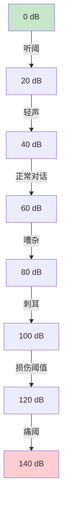

---

## 第五章：声音的各种现象——从物理到感知

### 5.1 共振：声音世界的“魔法”

**共振**是物理学中最重要的现象之一，它在声音学中扮演着核心角色。

**共振的定义**：当外加振动的频率接近物体的固有频率时，振幅急剧增大的现象。

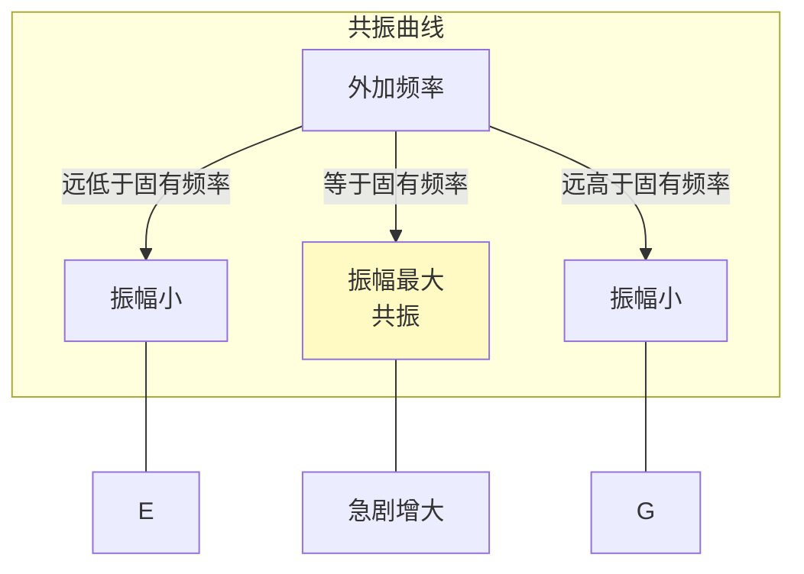

为什么共振会发生？

每个物体都有自己的**固有频率**（或称自然频率、谐振频率），这是由物体的质量、形状、材料等因素决定的。当外加振动的频率与固有频率相同时，能量传递的效率最高，振动被不断“放大”，导致振幅急剧增加。

**声音与共振的关系无处不在**：

**1. 乐器的共鸣腔**

吉他、小提琴等乐器都有一个**共鸣箱**。共鸣箱的空气体积和形状决定了它的固有频率。当弦振动时，如果某个泛音的频率与共鸣箱的固有频率相匹配，这个泛音就会被放大，使乐器声音更加洪亮、丰富。

**2. 音叉的共振**

音叉的振动频率是固定的。当你敲击一个音叉，另一个相同频率的音叉也会开始振动——这就是**共鸣**现象。它们的固有频率相同发生了共振。

**3. 建筑物的共振**

1940年，美国华盛顿州的塔科马海峡大桥在微风中倒塌。原因是：大风的频率恰好接近了大桥的固有频率，引发了剧烈的共振。这次事故成为工程学的重要教训。

### 5.2 反射与回声

当声音遇到障碍物时，会发生**反射**。这是我们日常生活中最熟悉的声音现象之一。

在空旷的山谷中大喊一声，你会听到**回声**——这是声音在山谷壁上反射后回来的结果。


回声返回的时间取决于障碍物的距离：

$$t = \frac{2d}{v}$$

其中 $d$ 是到障碍物的距离，$v$ 是声速。

在室内，我们通常感觉不到明显的回声，因为：
1. 墙壁、天花板、地板都会吸收一部分声音能量
2. 室内各种物体使声音发生多次反射、散射，形成**混响**

**混响**是指声音在室内多次反射、持续衰减的效果。它让音乐更加丰满、动听，也是录音师需要精心处理的重要因素。

### 5.3 折射与声音的“拐弯”

声音和光一样，也会发生**折射**——即声音在不同介质或同介质不同区域中传播速度变化时，传播方向发生偏折的现象。

最常见的例子是**声音在空气中的折射**。

白天，接近地面的空气温度较高，声速较快；较高空的空气温度较低，声速较慢。这导致声音向上折射，向上传播的能量较多，向下传播的能量较少。所以白天声音传得较近。

夜晚，情况相反。地面辐射冷却，接近地面的空气温度较低，声速较慢，声音向下折射。所以夜晚声音能传得更远——这也是“夜半钟声到客船”的科学解释。

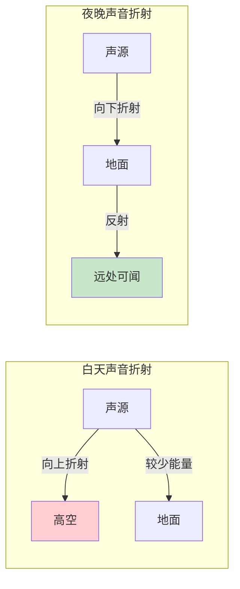

### 5.4 衍射：声音能“绕墙”

**衍射**是指波遇到障碍物或孔洞时，能够绕过障碍物继续传播的现象。

声音具有明显的衍射特性——你能在墙的另一侧听到声音，就是声音衍射的结果。

为什么光没有这种现象？因为光波波长很短（约500nm），远小于日常物体的尺寸；而声波波长较长（从1.7cm到17m），与日常物体的尺寸相当，因此更容易发生衍射。

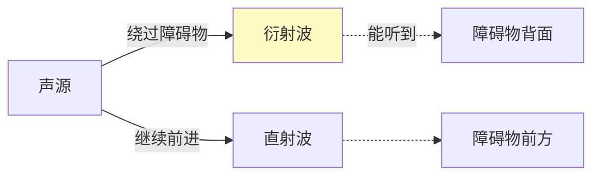

这也是为什么低频声音（波长更长）比高频声音更容易衍射、传播得更远的原因。

### 5.5 干涉：声音的叠加与抵消

**波的干涉**是指两列或几列波相遇时，在某些区域振动加强、在某些区域振动减弱的现象。

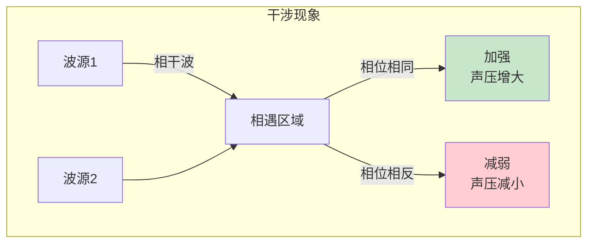

在噪声控制中，干涉原理有重要应用：

**主动降噪耳机**就是利用干涉原理工作的。它先检测环境噪声，然后产生一个与噪声**相位相反**的声波。两个声波相遇时相互抵消，从而达到降噪的效果。

### 5.6 多普勒效应：声音也会“变色”

当声源或听者相对于介质运动时，听者感知到的频率会发生变化，这就是**多普勒效应**。

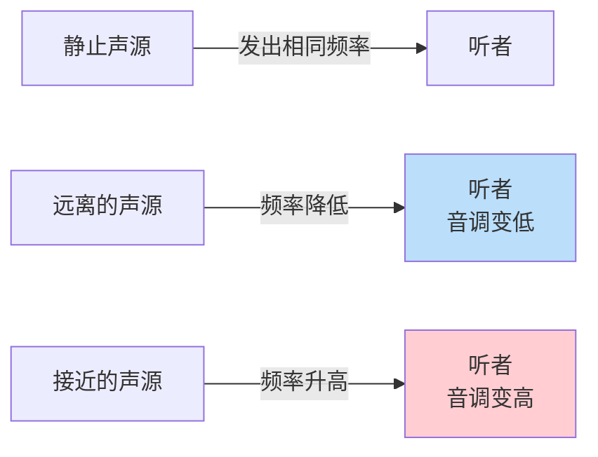

你一定有这种体验：当救护车从远处驶近时，警笛声音调较高（频率较高）；当它远离时，音调变低。这种“声音变色”的现象就是多普勒效应。

多普勒效应的公式是：

$$f' = f \cdot \frac{v \pm v_r}{v \mp v_s}$$

其中：
- $f'$ 是观察者接收到的频率
- $f$ 是声源发出的频率
- $v$ 是声速
- $v_r$ 是观察者相对介质的速度（靠近为正）
- $v_s$ 是声源相对介质的速度（靠近为负）

多普勒效应不仅适用于声波，也适用于光波、电磁波。天文学家利用光的多普勒效应测量天体运动——这就是著名的“红移”现象。

---

## 第六章：深入原理——从波动方程到量子声学

### 6.1 声波方程：数学描述的精髓

要深入理解声音，我们需要用数学语言来描述它。

声波可以用**波动方程**来描述：

$$\frac{\partial^2 p}{\partial t^2} = c^2 \nabla^2 p$$

其中：
- $p$ 是声压
- $t$ 是时间
- $c$ 是声速
- $\nabla^2$ 是拉普拉斯算子

这个方程告诉我们：**声压随时间的变化（加速度）正比于空间上的二阶导数**。

解这个方程，我们可以得到声波的几种基本形式：

**1. 平面波**：在无限大均匀介质中传播的波，波前是平面

$$p(x,t) = P_0 \cos(kx - \omega t)$$

其中 $k = \omega/c$ 是波数，$\omega = 2\pi f$ 是角频率。

**2. 球面波**：从点声源发出的波，波前是球面

$$p(r,t) = \frac{P_0}{r} \cos(kr - \omega t)$$

注意到这里有一个 $1/r$ 的衰减因子，这就是为什么点声源在自由场中每增加一倍距离声压衰减6dB。

### 6.2 阻抗：理解声音传播的关键

**声阻抗**是描述介质对声波“阻力”的物理量，定义为声压与体积速度的比值。

$$Z = \frac{p}{U}$$

其中 $U$ 是体积速度（单位时间内通过截面的体积）。

声阻抗的单位是**瑞利（Rayl）**，1 Rayl = 1 Pa·s/m³。

介质的特性阻抗定义为：

$$Z_0 = \rho \cdot c$$

其中 $\rho$ 是介质密度，$c$ 是声速。

**为什么阻抗匹配如此重要？**

当声波从一种介质传入另一种介质时，如果两者的阻抗差异很大，大部分能量会被反射，只有少部分能透射。

这就是为什么：
- 中耳需要放大22倍来匹配空气和淋巴液的阻抗
- 超声检查需要在皮肤上涂耦合剂来排除空气
- 隔音玻璃需要特殊设计来减少声能透射

### 6.3 瑞利散射：天空为什么是蓝色的？

你可能没想到，声音的散射原理可以用来解释天空的颜色。

**瑞利散射**是指当散射体尺寸远小于波长时，散射强度与波长的四次方成反比：

$$I \propto \frac{1}{\lambda^4}$$

这意味着：
- 短波（蓝紫光）散射强
- 长波（红光）散射弱

白天，阳光穿过大气层，蓝光被强烈散射，使整个天空呈现蓝色。傍晚，阳光需要穿过更厚的大气层，蓝光被大量散射减弱，剩下红光到达人眼，所以夕阳呈现红色。

有趣的是，声音也存在类似的散射规律——**高频声音更容易被散射**，这导致高频声音在复杂环境中更容易衰减、方向性更强。

### 6.4 非线性声学：声音的“变形”

前面我们讨论的都是线性声学，即假设声压很小，波动方程是线性的。但在**高强度声波**或**大振幅振动**的情况下，会出现非线性效应。

**1. 声波畸变**

当声波振幅较大时，波形不再保持正弦形，而是逐渐“变形”。这种畸变会产生谐波和泛音，导致音色改变。

**2. 声辐射压力**

强声波对障碍物会产生恒定的推力，这就是**声辐射压力**。它虽然微弱，但在超声悬浮、声学焊接等应用中很重要。

**3. 超声空化**

当超声波在液体中传播时，会产生气泡的形成、膨胀、坍缩过程，这就是**空化**。空化产生的高温、高压、冲击波可以用于清洗、碎石等。

### 6.5 量子声学：声音的粒子性

在量子层面，声音也表现出粒子性——**声子**（phonon）。

声子是晶格振动的量子化激发，就像光子是电磁波的量子化激发一样。

声子的概念在**固体物理**、**凝聚态物理**中非常重要，它帮助我们理解：

- 固体的热传导
- 超导的BCS理论
- 量子声学制冷

在极低温条件下，科学家甚至实现了**声子激光器**（saser），它可能应用于量子计算和精密测量。

---

## 第七章：声音的应用——从日常生活到前沿科技

### 7.1 医学超声：看不见的“眼睛”

超声波在医学诊断中发挥着不可替代的作用。

**超声成像的原理**：
- 超声探头发射高频声波（通常1-20MHz）
- 声波在人体组织界面反射
- 接收反射信号，计算距离，形成图像


不同组织对超声波的反射特性不同：

| 组织类型 | 回声特性 |
|---------|---------|
| 水/血液 | 无回声（黑色） |
| 脂肪 | 低回声（较暗） |
| 肌肉 | 中等回声（灰色） |
| 骨骼 | 强回声（白色） |

超声检查不仅安全无辐射，而且实时性好、成本低廉，是产检、腹部检查、心脏检查的首选方法。

### 7.2 声学乐器：物理与艺术的结合

乐器是声音原理的完美应用。不同乐器之所以有独特的音色，正是因为它们各自独特的振动模式和谐波组成。

**弦乐器**（吉他、小提琴）：

- 弦振动产生基频和谐波
- 共鸣箱放大特定频率
- 琴码、琴弦的材质影响音色

**管乐器**（笛子、萨克斯）：

- 空气柱的振动
- 通过按键改变空气柱长度，改变基频
- 管壁材质影响泛音特性

**打击乐器**（鼓、锣）：

- 膜或板的振动
- 面板的固有频率决定音高
- 材质和形状决定音色

### 7.3 主动降噪：与噪声的斗争

城市生活中，噪声污染是一个严重问题。**主动降噪**技术为我们提供了对抗噪声的新武器。

主动降噪的原理是**声波干涉**：

1. 麦克风采集环境噪声
2. 电子系统分析噪声的频率、相位
3. 扬声器发出与噪声**反相**的声波
4. 两列波相遇时相互抵消

```mermaid
flowchart LR
    A[环境噪声] -->|采集| B[信号处理器]
    B -->|生成反相声波| C[扬声器]
    C -->|抵消| D[安静区域]
    
    style D fill:#c8e6c9
```

主动降噪对于**低频噪声**效果显著，对于高频噪声则需要结合被动降噪（隔声、吸声）。

### 7.4 超声波应用：超越可听范围

超声波（频率>20kHz）有着广泛的应用：

**工业领域**：

- 超声清洗：利用空化效应去除污物
- 超声焊接：塑料、金属的快速连接
- 超声测厚：不接触测量材料厚度

**医疗领域**：

- 超声诊断：产检、器官检查
- 超声治疗：物理治疗、碎石
- 超声手术：无创或微创手术

**其他领域**：

- 超声波驱鼠器
- 超声波雾化（加湿器）
- 超声波测距（倒车雷达）

---

## 结语：声音——连接物理与感知的桥梁

从本文的分析我们可以看到，声音的本质是**振动在介质中的传播**，它涉及力学、声学、热学、生理学的交叉领域。

声音研究的几个关键原理：

1. **振动是根本**：一切声音源于振动
2. **介质是必要条件**：声音不能在真空中传播
3. **频率决定音高**：人耳能感知20-20000Hz
4. **振幅影响响度**：人耳感知是对数关系
5. **谐波构成音色**：不同的谐波组成区分不同声音
6. **介质性质决定声速**：弹性模量越大、密度越小，声速越快
7. **人耳是精密传感器**：从外耳到内耳，层层放大和筛选

声音学不仅是一门基础科学，更是一门应用广泛的工程技术。从音乐到通讯，从医学到环保，声音原理无处不在。

---