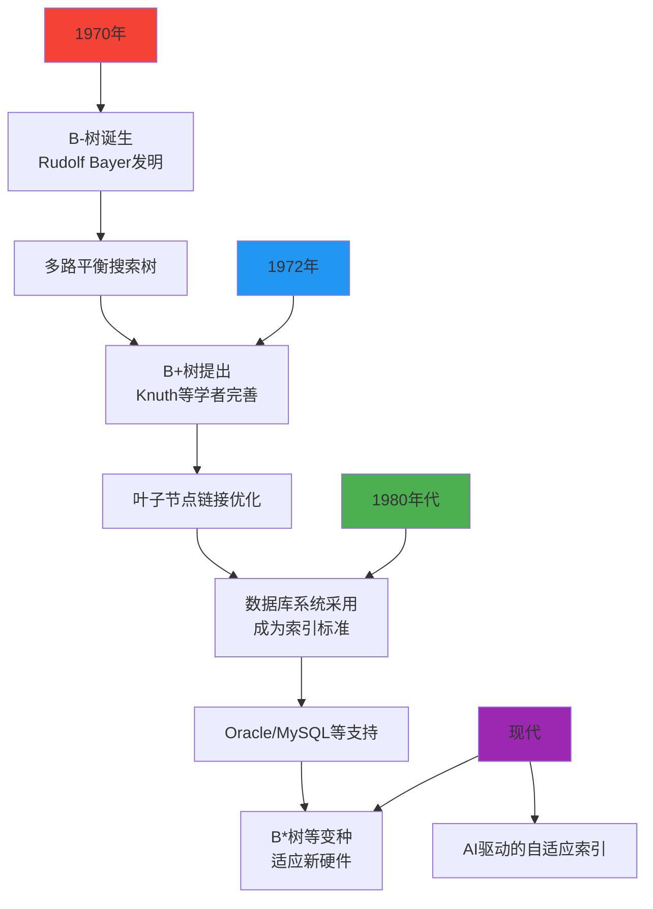
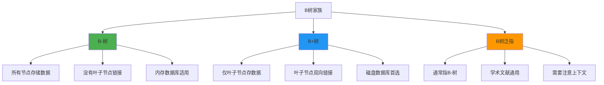
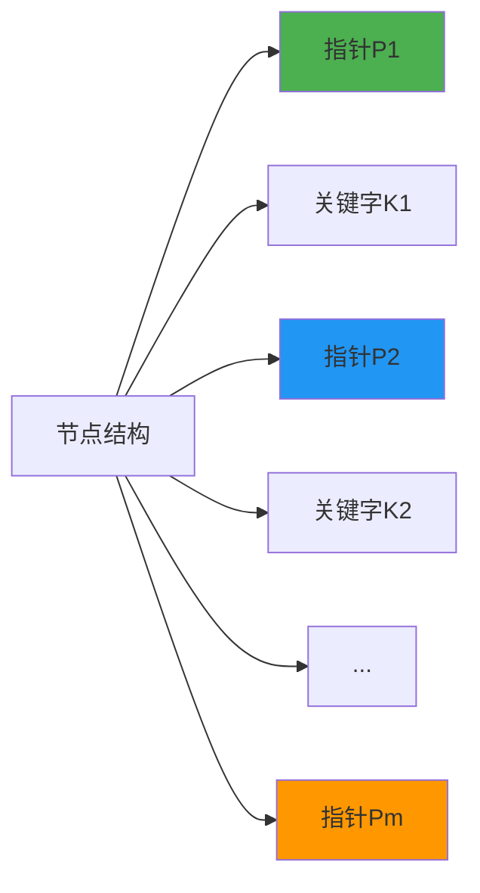
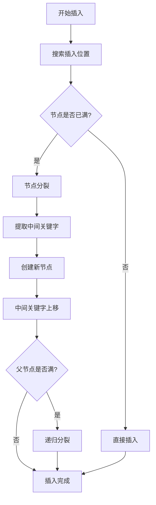
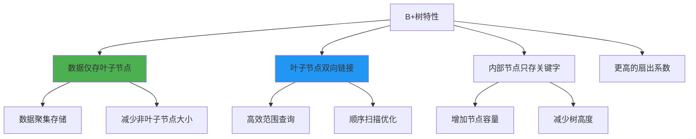
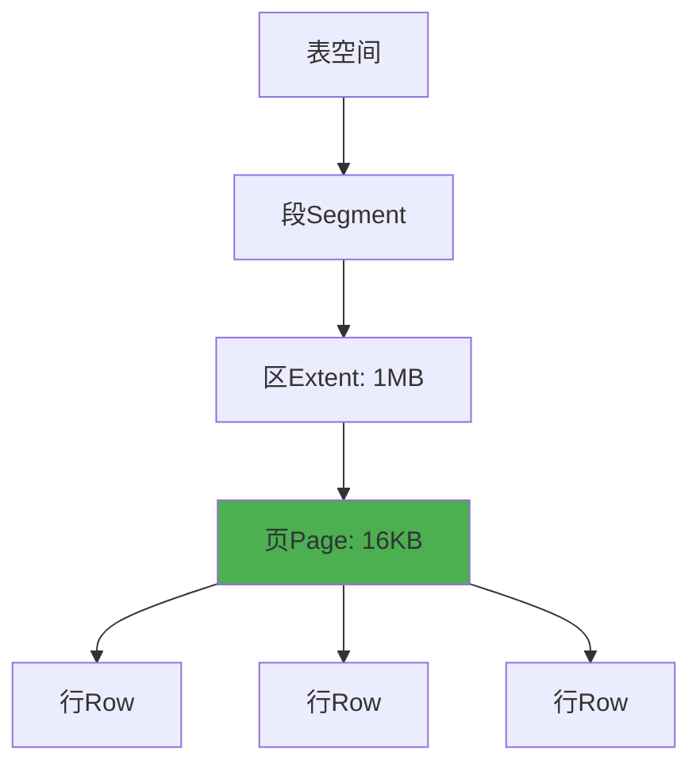
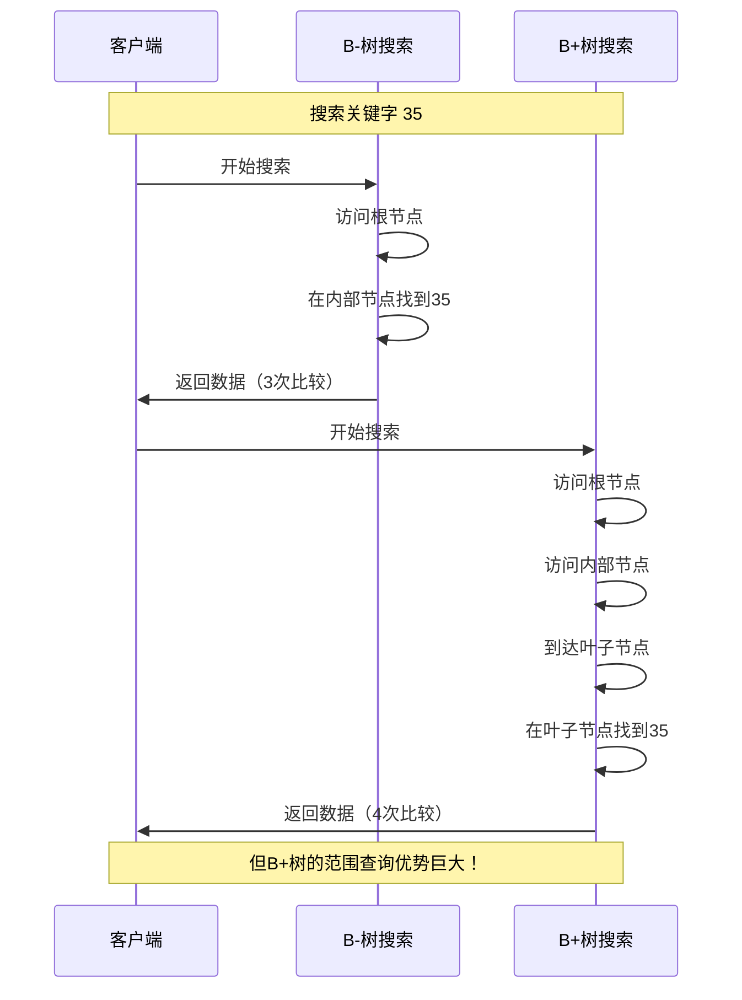
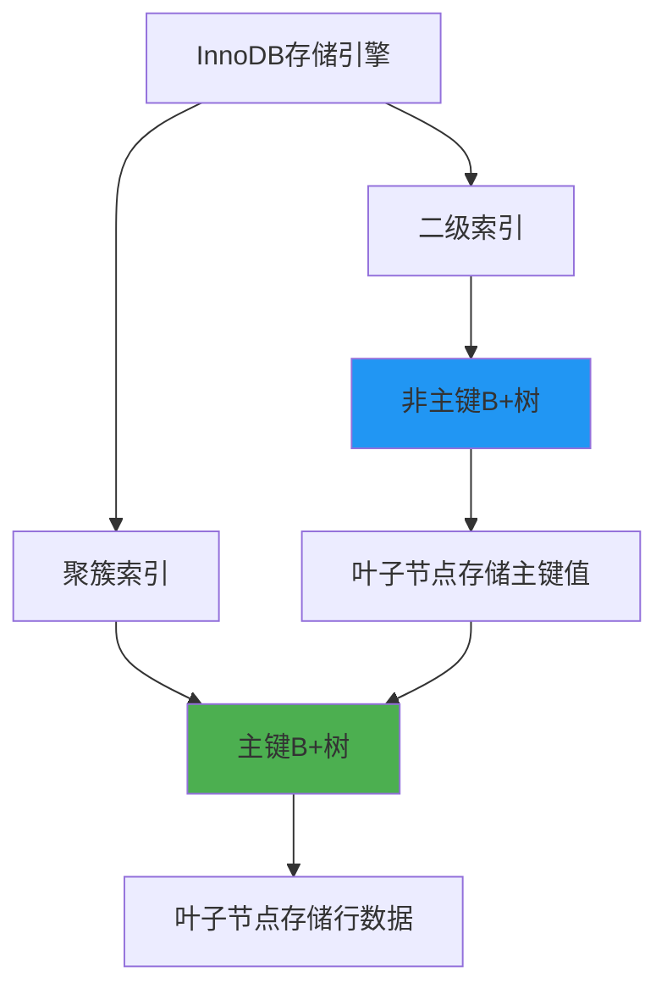
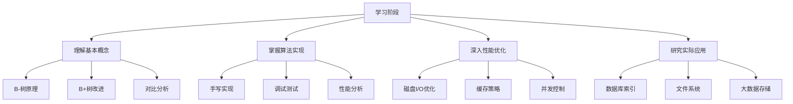

# B树家族完全指南：从B-树到B+树的深度解析

> 🌳 当硬盘速度跟不上内存，当数据量从MB暴涨到TB——这就是B树家族大显身手的时刻！今天带你彻底搞懂数据库索引的核心数据结构。

朋友们，先看一个真实的性能对比：

**数据库工程师小张的发现**
> "我们的用户表有1亿条数据，使用哈希索引查询要0.5秒，换成B+树后只要5毫秒！为什么差距这么大？B+树到底有什么魔法？"

答案就在今天要深入探讨的**B树家族**！让我们从最基础的B-树开始，一步步揭开这些数据结构的奥秘。

## 🎯 为什么要学习B树家族？

**现代数据库的底层支撑：**
- 💾 **磁盘友好** - 专门为磁盘I/O优化设计
- 📈 **海量数据** - 支持TB级别的高效查询
- ⚡ **稳定性能** - 查询时间与数据量对数相关
- 🔄 **动态平衡** - 自动维护树的平衡性

### B树家族的进化历程



### 三种树结构的核心对比



---

## 🌲 B-树：多路平衡搜索树的鼻祖

### B-树的基本概念

**B-树（B-Tree）** 是一种自平衡的多路搜索树，能够保持数据有序，并允许搜索、顺序访问、插入和删除在对数时间内完成。

### B-树的定义规则

一个m阶的B-树满足以下性质：

1. **根节点**：至少有两个子节点（除非树只有根节点）
2. **内部节点**：每个节点最多有m个子节点
3. **节点填充**：除根节点外，每个节点至少有⌈m/2⌉个子节点
4. **所有叶子节点**都在同一层
5. **非叶子节点**有k-1个关键字和k个子节点

### B-树的节点结构



**节点的具体存储格式：**
```
┌─────┬─────┬─────┬─────┬─────┬─────┐
│ P1  │ K1  │ P2  │ K2  │ P3  │ ... │
└─────┴─────┴─────┴─────┴─────┴─────┘
```

### B-树搜索算法详解

```python
def b_tree_search(node, key):
    """B-树搜索算法"""
    i = 0
    
    # 在当前节点中查找关键字位置
    while i < node.key_count and key > node.keys[i]:
        i += 1
    
    # 如果找到关键字
    if i < node.key_count and key == node.keys[i]:
        return (node, i)  # 返回节点和位置
    
    # 如果是叶子节点但没找到
    if node.is_leaf:
        return None
    
    # 递归在子节点中搜索
    return b_tree_search(node.children[i], key)
```

### B-树插入操作流程



### 实际B-树示例（3阶）

```
         [20, 40]
        /    |    \
       /     |     \
[10,15]  [25,30,35]  [50,60]
  |   |     |  |  |     |  |
 数据 数据   数据数据数据  数据数据
```

**搜索过程示例：**
搜索关键字 `35` 的路径：
1. 根节点：35在20和40之间 → 走第二个子节点
2. 中间节点：35在30和35之间 → 找到35
3. 总比较次数：2次节点访问 + 3次关键字比较

### B-树的优势分析

**磁盘I/O优化：**
- 🎯 **减少磁盘访问**：每个节点大小匹配磁盘块
- 📊 **批量读取**：一次I/O读取多个关键字
- 🔄 **平衡性保证**：所有操作保持树平衡

**数学性能分析：**
```
树高h ≤ logₘ((n+1)/2)  # m为阶数，n为关键字数

对于1亿条数据，m=100：
h ≤ log₁₀₀(50,000,000) ≈ 4层

即最多4次磁盘I/O就能找到任何数据！
```

---

## 🌟 B+树：数据库索引的实际标准

### 为什么需要B+树？

B-树虽然优秀，但在数据库场景下还有改进空间：
- 🔍 **范围查询效率**：B-树需要遍历整棵树
- 💾 **数据局部性**：关键字分散在各个节点
- 📈 **顺序访问性能**：全表扫描效率不高

### B+树的核心改进



### B+树的节点结构对比

**内部节点（只存关键字）：**
```
┌─────┬─────┬─────┬─────┬─────┐
│ P1  │ K1  │ P2  │ K2  │ P3  │
└─────┴─────┴─────┴─────┴─────┘
```

**叶子节点（存储数据）：**
```
┌─────┬─────┬─────┬─────┬─────────┐
│ K1  │ D1  │ K2  │ D2  │ next_ptr│
└─────┴─────┴─────┴─────┴─────────┘
```

### B+树的实际示例

```
         [30, 60]                    ← 内部节点（只存关键字）
        /    |    \
       /     |     \
[10,20,30]↔[40,50,60]↔[70,80,90]    ← 叶子节点（双向链接，存储数据）
  |  |  |    |  |  |    |  |  |
 数据数据数据  数据数据数据  数据数据数据
```

### B+树的范围查询优势

```python
def b_plus_tree_range_query(root, start_key, end_key):
    """B+树范围查询算法"""
    
    # 1. 搜索起始关键字
    start_leaf = find_leaf(root, start_key)
    
    # 2. 在叶子节点中顺序扫描
    current = start_leaf
    results = []
    
    while current is not None:
        for i in range(current.key_count):
            key = current.keys[i]
            
            if start_key <= key <= end_key:
                results.append(current.data[i])
            elif key > end_key:
                return results  # 提前结束
        
        # 3. 通过叶子节点链接继续扫描
        current = current.next_leaf
    
    return results
```

**性能对比：**
```
查询范围 [25, 75]：

B-树：需要遍历多个节点，可能访问整棵树
B+树：找到25所在叶子节点，然后顺序扫描到75

数据量越大，B+树的优势越明显！
```

### B+树在数据库中的实际应用

**MySQL InnoDB索引结构：**
```sql
-- 创建表时的B+树索引
CREATE TABLE users (
    id INT PRIMARY KEY,           -- 主键使用B+树索引
    name VARCHAR(100),
    email VARCHAR(100),
    INDEX idx_name (name)         -- 二级索引也是B+树
) ENGINE=InnoDB;

-- B+树索引的物理存储
-- 主键索引：叶子节点存储完整行数据
-- 二级索引：叶子节点存储主键值
```

**索引的层次结构：**


---

## 🔍 B树、B-树、B+树的详细对比

### 结构特性对比表

| 特性 | B-树 | B+树 | B树（泛指） |
|------|------|------|------------|
| **数据存储位置** | 所有节点都存储数据 | 仅叶子节点存储数据 | 通常指B-树 |
| **叶子节点链接** | 无链接 | 双向链表链接 | 无链接 |
| **内部节点内容** | 关键字+数据 | 只存关键字+指针 | 关键字+数据 |
| **搜索性能** | 可能在任何节点找到 | 必须到叶子节点 | 同B-树 |
| **范围查询** | 效率较低 | 效率极高 | 效率较低 |
| **空间利用率** | 较低（存储数据） | 较高（仅存关键字） | 同B-树 |
| **适用场景** | 内存数据库 | 磁盘数据库 | 通用场景 |

### 搜索过程可视化对比



### 范围查询性能对比

```python
# 范围查询性能测试模拟
def benchmark_range_query(tree_type, data_size, range_size):
    """比较B-树和B+树的范围查询性能"""
    
    if tree_type == "B-Tree":
        # B-树需要递归遍历多个节点
        operations = data_size ** 0.5  # O(√n) 数量级
    else:  # B+Tree
        # B+树只需要顺序扫描叶子节点
        operations = range_size  # O(k) 数量级
    
    return operations

# 测试结果
数据量 = 1_000_000
查询范围 = 1000

b_tree_ops = benchmark_range_query("B-Tree", 数据量, 查询范围)  # ≈1000次
b_plus_ops = benchmark_range_query("B+Tree", 数据量, 查询范围)  # 1000次

print(f"B-树操作次数: {b_tree_ops}")
print(f"B+树操作次数: {b_plus_ops}")
print(f"B+树优势: {b_tree_ops/b_plus_ops:.1f}倍")
```

---

## 💻 代码实现：手写B+树

### B+树节点类实现

```python
class BPlusTreeNode:
    """B+树节点基类"""
    
    def __init__(self, is_leaf=False):
        self.keys = []          # 关键字列表
        self.is_leaf = is_leaf  # 是否是叶子节点
        self.parent = None      # 父节点指针

class BPlusTreeLeafNode(BPlusTreeNode):
    """B+树叶节点"""
    
    def __init__(self):
        super().__init__(is_leaf=True)
        self.values = []        # 数据值列表
        self.next_leaf = None   # 下一个叶节点
        self.prev_leaf = None   # 上一个叶节点

class BPlusTreeInternalNode(BPlusTreeNode):
    """B+树内部节点"""
    
    def __init__(self):
        super().__init__(is_leaf=False)
        self.children = []      # 子节点指针列表
```

### B+树核心算法实现

```python
class BPlusTree:
    """B+树实现"""
    
    def __init__(self, order=4):
        self.order = order          # 树的阶数
        self.root = BPlusTreeLeafNode()  # 初始根节点是叶子节点
        self.min_keys = (order - 1) // 2  # 最小关键字数
    
    def search(self, key):
        """搜索关键字"""
        node = self.root
        
        # 向下搜索到叶子节点
        while not node.is_leaf:
            # 找到合适的子节点
            idx = self._find_key_index(node.keys, key)
            node = node.children[idx]
        
        # 在叶子节点中搜索
        idx = self._find_key_index(node.keys, key)
        if idx < len(node.keys) and node.keys[idx] == key:
            return node.values[idx]  # 找到
        else:
            return None  # 未找到
    
    def _find_key_index(self, keys, key):
        """在有序列表中查找关键字位置"""
        for i, k in enumerate(keys):
            if key <= k:
                return i
        return len(keys)
    
    def insert(self, key, value):
        """插入关键字-值对"""
        leaf = self._find_leaf(key)
        
        # 插入到叶子节点
        idx = self._find_key_index(leaf.keys, key)
        leaf.keys.insert(idx, key)
        leaf.values.insert(idx, value)
        
        # 检查是否需要分裂
        if len(leaf.keys) > self.order - 1:
            self._split_leaf(leaf)
    
    def _find_leaf(self, key):
        """查找包含关键字的叶子节点"""
        node = self.root
        while not node.is_leaf:
            idx = self._find_key_index(node.keys, key)
            node = node.children[idx]
        return node
    
    def _split_leaf(self, leaf):
        """分裂叶子节点"""
        mid = len(leaf.keys) // 2
        
        # 创建新叶子节点
        new_leaf = BPlusTreeLeafNode()
        new_leaf.keys = leaf.keys[mid:]
        new_leaf.values = leaf.values[mid:]
        
        # 更新原叶子节点
        leaf.keys = leaf.keys[:mid]
        leaf.values = leaf.values[:mid]
        
        # 更新叶子节点链接
        new_leaf.next_leaf = leaf.next_leaf
        new_leaf.prev_leaf = leaf
        if leaf.next_leaf:
            leaf.next_leaf.prev_leaf = new_leaf
        leaf.next_leaf = new_leaf
        
        # 向上插入分裂关键字
        self._insert_into_parent(leaf, new_leaf.keys[0], new_leaf)
```

### B+树范围查询实现

```python
def range_query(self, start_key, end_key):
    """范围查询实现"""
    results = []
    
    # 找到起始关键字所在的叶子节点
    current = self._find_leaf(start_key)
    
    # 顺序扫描叶子节点
    while current is not None:
        for i, key in enumerate(current.keys):
            if start_key <= key <= end_key:
                results.append(current.values[i])
            elif key > end_key:
                return results  # 提前结束
        
        # 移动到下一个叶子节点
        current = current.next_leaf
    
    return results

# 使用示例
bptree = BPlusTree(order=4)

# 插入测试数据
for i in range(100):
    bptree.insert(i, f"value_{i}")

# 范围查询
results = bptree.range_query(25, 75)
print(f"找到 {len(results)} 条记录")
```

---

## 🎯 B树家族的实际应用场景

### 数据库索引系统

**MySQL的B+树索引实现：**



### 文件系统索引

**现代文件系统的B+树应用：**
- **NTFS**：使用B+树管理文件分配表
- **ReiserFS**：基于B+树的日志文件系统
- **XFS**：使用B+树管理Extent

### 大数据存储系统

**分布式数据库的B+树变种：**
- **Google Bigtable**：SSTable使用类似B+树的结构
- **Apache HBase**：基于Bigtable的B+树索引
- **Cassandra**：使用SSTable和Bloom Filter

---

## 📊 性能分析和优化策略

### B+树的性能数学模型

**树高度计算：**
```
对于n个关键字，m阶B+树：
最大树高：h_max = logₘ(n)
最小树高：h_min = logₘ(n) - 1

示例：1亿条数据，m=256（典型配置）
h ≈ log₂₅₆(100,000,000) ≈ 3.3 → 4层

即最多4次磁盘I/O完成查询！
```

**空间复杂度分析：**
```
节点大小 = 页面大小（通常4KB-16KB）
每个关键字大小 = 8-16字节（指针+关键字）
每个节点关键字数 ≈ 页面大小 / 关键字大小

对于16KB页面，8字节关键字：
每个节点关键字数 ≈ 16KB / 8B ≈ 2000个
扇出系数 ≈ 2000
```

### B+树优化策略

**1. 节点大小优化：**
```python
# 根据磁盘特性优化节点大小
def optimize_node_size(disk_block_size=4096, key_size=8, ptr_size=8):
    """计算最优节点大小"""
    # 每个条目大小：关键字 + 指针
    entry_size = key_size + ptr_size
    
    # 最佳节点容量（填充因子约75%）
    optimal_entries = int(disk_block_size * 0.75 / entry_size)
    
    return optimal_entries

optimal_order = optimize_node_size() + 1  # B+树阶数
print(f"推荐B+树阶数: {optimal_order}")
```

**2. 缓存优化策略：**
- **热点数据缓存**：将频繁访问的节点缓存在内存
- **预读取优化**：根据访问模式预加载相邻节点
- **批量操作**：合并多个插入/删除操作

---

## 🔮 B树家族的未来发展趋势

### 新硬件环境下的优化

**SSD时代的B+树改进：**
- 🔄 **写优化**：减少随机写操作
- 💾 **磨损均衡**：考虑SSD寿命
- ⚡ **并行访问**：利用多核CPU

**新兴的B树变种：**
- **B*树**：更高的空间利用率
- **B-link树**：更好的并发控制
- **缓存敏感B+树**：优化CPU缓存使用

### AI驱动的自适应索引

```python
class AdaptiveBPlusTree(BPlusTree):
    """自适应B+树"""
    
    def __init__(self):
        super().__init__()
        self.access_pattern = {}  # 访问模式统计
        self.adaptive_order = {}  # 自适应阶数
    
    def adaptive_insert(self, key, value):
        """自适应插入"""
        # 根据访问模式调整策略
        if self._is_sequential_access(key):
            # 顺序访问优化
            self._optimize_for_sequential()
        else:
            # 随机访问优化
            self._optimize_for_random()
        
        return self.insert(key, value)
    
    def _is_sequential_access(self, key):
        """判断是否为顺序访问模式"""
        # 基于历史访问模式分析
        recent_keys = list(self.access_pattern.keys())[-10:]
        if len(recent_keys) < 2:
            return False
        
        # 检查是否呈现顺序访问特征
        return self._check_sequential_pattern(recent_keys, key)
```

---

## 🎓 学习路径和实践建议

### 循序渐进的学习计划



### 实践项目建议

**初级项目：**
- 实现基本的B+树插入和搜索
- 对比B-树和B+树的性能差异
- 可视化展示树结构变化

**中级项目：**
- 实现完整的B+树（包括删除和范围查询）
- 集成到简单的键值存储系统
- 进行压力测试和性能分析

**高级项目：**
- 实现并发安全的B+树
- 开发自适应索引系统
- 集成到分布式存储架构

### 推荐学习资源

- 📚 **经典书籍**：《算法导论》、《数据库系统概念》
- 💻 **开源实现**：MySQL、PostgreSQL源码
- 🎥 **在线课程**：斯坦福数据库课程、CMU高级数据库
- 🔬 **研究论文**：B树原始论文、现代优化技术

---

### B树家族的三位成员

1. **B-树（B-Tree）**：多路平衡搜索树，所有节点存储数据
2. **B+树（B+Tree）**：仅叶子节点存储数据，叶子节点双向链接
3. **B树（泛指）**：通常指B-树，需要注意上下文区分

### 关键技术洞察

- 🎯 **B+树是数据库索引的事实标准**
- 📈 **范围查询性能是B+树的杀手锏**
- 💾 **节点大小匹配磁盘块是关键优化**
- 🔄 **平衡性和自调整是核心优势**

### 性能优化的黄金法则

1. **选择合适的阶数**：平衡树高度和节点大小
2. **优化磁盘访问**：减少随机I/O，增加顺序读取
3. **利用缓存机制**：热点数据内存缓存
4. **监控访问模式**：根据使用模式动态调整

---

> 🌟 掌握B树家族，就掌握了现代数据系统的核心索引技术。从今天开始，让你的数据查询飞起来！

---