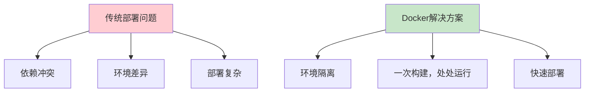
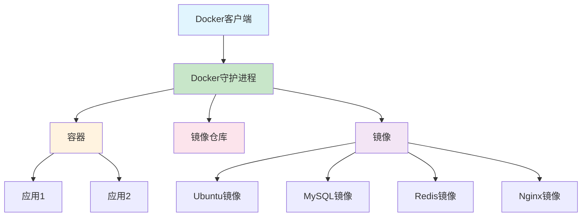
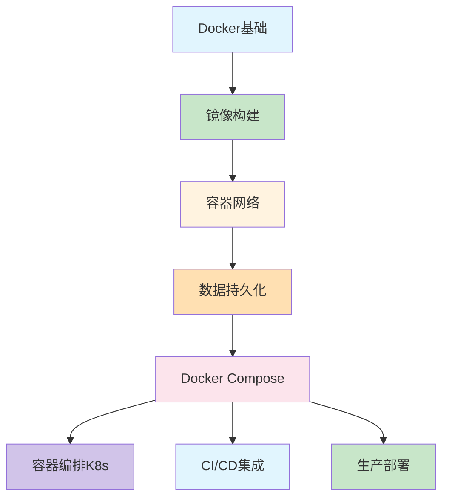

# Docker入门完全指南：从零开始掌握容器技术

> 🐳 还在为"在我机器上能跑"的问题头疼吗？今天我们来聊聊Docker这个革命性的技术，让你告别环境配置的烦恼！

## 🤔 什么是Docker？为什么你应该学习它？

想象一下这个场景：

**开发小明的故事**
> "这个功能在我的Mac上测试没问题啊！"  
> "为什么到了测试环境就不行了？"  
> "生产环境的配置和本地不一样？"

**解决方案来了：Docker**

Docker就像是一个**标准化的软件打包箱**，把应用程序和它需要的所有依赖（库、配置文件、环境变量）打包在一起。这样你的代码在任何地方运行都能得到**完全一样的环境**！

### Docker为什么这么火？



**核心优势**：
- ✅ **环境一致性** - 开发、测试、生产环境完全一致
- ✅ **快速部署** - 秒级启动，毫秒级停止
- ✅ **资源隔离** - 每个容器都是独立的沙箱
- ✅ **易于扩展** - 轻松实现水平扩展
- ✅ **版本控制** - 镜像版本化管理

## 🔧 环境准备：Docker安装（避开第一个坑）

### 不同系统的安装方式

```bash
# macOS - 最简单的方式
# 安装Docker Desktop，双击安装包即可
# 或者使用Homebrew
brew install --cask docker

# Windows - Windows 10/11 专业版
# 下载Docker Desktop安装包
# 或者使用WSL2

# Linux (Ubuntu为例)
sudo apt update
sudo apt install docker.io
sudo systemctl start docker
sudo systemctl enable docker

# 验证安装是否成功
docker --version
# 应该输出: Docker version 20.10.x, build xxxxx
```

### 常见错误1：安装后docker命令找不到

```bash
# ❌ 错误：安装后无法执行docker命令
$ docker --version
-bash: docker: command not found

# ➡️ 解决方法1：检查Docker服务是否启动
# macOS/Linux
ps aux | grep docker
# Windows 检查Docker Desktop是否运行

# ➡️ 解决方法2：重启Docker服务
# Linux
sudo systemctl restart docker

# ➡️ 解决方法3：重新加载shell配置
source ~/.bashrc  # 或 ~/.zshrc

# ✅ 正确安装后的验证
docker --version
docker run hello-world  # 运行测试容器
```

### 常见错误2：权限问题（Linux环境）

```bash
# ❌ 错误：权限拒绝
docker: permission denied while trying to connect to the Docker daemon socket

# ✅ 解决方法：将用户添加到docker组
sudo usermod -aG docker $USER
# 重新登录或执行以下命令生效
newgrp docker

# 验证权限
docker run hello-world  # 应该能正常运行
```

## 🐳 Docker核心概念：3分钟搞懂

### Docker架构图



### 核心概念解释

**1. 镜像（Image）** - 就像软件的"安装包"
- 只读的模板，包含运行应用所需的一切
- 可以从Docker Hub下载，也可以自己构建

**2. 容器（Container）** - 镜像的运行实例
- 轻量级的虚拟机（但不是虚拟机）
- 每个容器都是独立隔离的环境

**3. 仓库（Registry）** - 镜像的存储中心
- Docker Hub是最大的公共仓库
- 也可以搭建私有仓库

## 🚀 第一个Docker容器：Hello World！

### 最简单的起点

```bash
# 运行你的第一个容器！
docker run hello-world

# 输出示例：
# Hello from Docker!
# This message shows that your installation appears to be working correctly.
```

### 查看运行中的容器

```bash
# 查看正在运行的容器
docker ps

# 查看所有容器（包括已停止的）
docker ps -a

# 查看容器详细信息
docker inspect <容器ID>

# 查看容器日志
docker logs <容器ID>
```

### 常见错误3：镜像下载失败

```bash
# ❌ 错误：网络问题导致镜像下载失败
docker run hello-world
Unable to find image 'hello-world:latest' locally
docker: Error response from daemon: Get "https://registry-1.docker.io/v2/": net/http: request canceled while waiting for connection (Client.Timeout exceeded while awaiting headers).

# ✅ 解决方法1：配置镜像加速器（国内网络推荐）
# 创建或编辑 /etc/docker/daemon.json
sudo tee /etc/docker/daemon.json <<-'EOF'
{
  "registry-mirrors": [
    "https://docker.mirrors.ustc.edu.cn",
    "https://hub-mirror.c.163.com"
  ]
}
EOF

# 重启Docker服务
sudo systemctl restart docker

# ✅ 解决方法2：手动拉取镜像
docker pull hello-world
docker run hello-world
```

## 📦 构建自己的镜像：Dockerfile实战

### 创建一个简单的Node.js应用

**项目结构：**
```
my-app/
├── Dockerfile          # Docker构建文件
├── package.json        # Node.js依赖配置
└── app.js              # 应用代码
```

**app.js内容：**
```javascript
const http = require('http');

const server = http.createServer((req, res) => {
  res.writeHead(200, { 'Content-Type': 'text/plain' });
  res.end('Hello from Docker! 🐳\n');
});

const port = 3000;
server.listen(port, () => {
  console.log(`Server running at http://localhost:${port}/`);
});
```

**package.json内容：**
```json
{
  "name": "my-docker-app",
  "version": "1.0.0",
  "description": "A simple Node.js Docker app",
  "main": "app.js",
  "scripts": {
    "start": "node app.js"
  },
  "dependencies": {}
}
```

### 编写Dockerfile

```dockerfile
# Dockerfile - 构建你的第一个镜像

# 第1步：选择基础镜像
FROM node:16-alpine

# 第2步：设置工作目录
WORKDIR /app

# 第3步：复制依赖文件
COPY package*.json ./

# 第4步：安装依赖
RUN npm install

# 第5步：复制应用代码
COPY . .

# 第6步：暴露端口
EXPOSE 3000

# 第7步：定义启动命令
CMD ["npm", "start"]
```

### 构建和运行

```bash
# 构建镜像（注意最后的点 . 表示当前目录）
docker build -t my-node-app .

# 运行容器
docker run -d -p 3000:3000 --name my-app my-node-app

# 测试应用
curl http://localhost:3000
# 输出: Hello from Docker! 🐳

# 查看运行状态
docker ps
```

### 常见错误4：Dockerfile语法错误

```dockerfile
# ❌ 错误示例：
FROM node 16 alpine      # 缺少冒号
WORKDIR /app           
COPY package.json       # 缺少目标路径
RUN npm install        
CMD node app.js         # 应该使用数组格式

# ✅ 正确示例：
FROM node:16-alpine
WORKDIR /app
COPY package.json ./
RUN npm install
CMD ["node", "app.js"]
```

**Dockerfile最佳实践：**
- 使用`.dockerignore`文件忽略不必要的文件
- 多阶段构建减少镜像体积
- 使用非root用户运行应用
- 定期更新基础镜像安全补丁

## 🔄 Docker开发工作流

### 开发到部署的完整流程


### 实用命令大全

```bash
# 镜像管理
docker images                    # 查看本地镜像
docker rmi <镜像名>              # 删除镜像
docker pull <镜像名>             # 拉取镜像
docker push <镜像名>             # 推送镜像

# 容器管理
docker run -d --name <容器名> <镜像>  # 后台运行
docker stop <容器名>              # 停止容器
docker start <容器名>             # 启动容器
docker rm <容器名>                # 删除容器
docker exec -it <容器名> bash     # 进入容器

# 网络和存储
docker network ls                # 查看网络
docker volume ls                 # 查看数据卷

# 系统信息
docker info                      # Docker信息
docker stats                     # 资源使用统计
```

### 常见错误5：端口冲突

```bash
# ❌ 错误：端口已被占用
docker run -p 80:80 nginx
docker: Error response from daemon: driver failed programming external connectivity on endpoint: Bind for 0.0.0.0:80 failed: port is already allocated.

# ✅ 解决方法1：使用其他端口
docker run -p 8080:80 nginx

# ✅ 解决方法2：停止占用端口的容器
docker ps  # 查看运行中的容器
docker stop <容器ID>  # 停止冲突容器

# ✅ 解决方法3：检查系统进程占用
# Linux
sudo netstat -tulpn | grep :80
# macOS
lsof -i :80
```

## 💡 进阶技巧：让你的Docker更专业

### 1. 多阶段构建（优化镜像体积）

```dockerfile
# 多阶段构建示例 - 显著减少镜像体积

# 第一阶段：构建阶段
FROM node:16-alpine AS builder
WORKDIR /app
COPY package*.json ./
RUN npm ci --only=production
COPY . .
RUN npm run build

# 第二阶段：运行阶段
FROM node:16-alpine
WORKDIR /app
COPY --from=builder /app/dist ./dist
COPY --from=builder /app/node_modules ./node_modules
COPY package.json ./

# 使用非root用户增强安全性
RUN addgroup -g 1001 -S nodejs
RUN adduser -S nextjs -u 1001
USER nextjs

EXPOSE 3000
CMD ["node", "dist/app.js"]
```

### 2. Docker Compose（多容器应用）

**docker-compose.yml：**
```yaml
version: '3.8'
services:
  web:
    build: .
    ports:
      - "3000:3000"
    depends_on:
      - db
    environment:
      - DATABASE_URL=postgres://user:pass@db:5432/mydb
  
  db:
    image: postgres:13
    environment:
      POSTGRES_DB: mydb
      POSTGRES_USER: user
      POSTGRES_PASSWORD: pass
    volumes:
      - db_data:/var/lib/postgresql/data

volumes:
  db_data:
```

**使用Compose：**
```bash
# 启动所有服务
docker-compose up -d

# 查看服务状态
docker-compose ps

# 停止服务
docker-compose down
```

### 3. 数据持久化（避免数据丢失）

```bash
# 使用数据卷持久化数据
docker volume create mydata

docker run -d \
  --name mysql-container \
  -v mydata:/var/lib/mysql \
  -e MYSQL_ROOT_PASSWORD=secret \
  mysql:8.0

# 或者使用绑定挂载（开发时推荐）
docker run -d \
  --name nginx-container \
  -v $(pwd)/html:/usr/share/nginx/html \
  -p 80:80 \
  nginx
```

## 🚨 常见陷阱和解决方案

### 陷阱1：容器内应用日志看不到

**问题**：应用在容器内运行，但日志输出看不到

**解决方案**：
```bash
# 查看容器日志
docker logs <容器名>

# 实时查看日志
docker logs -f <容器名>

# 在Dockerfile中确保应用输出到标准输出
# 而不是写入文件
```

### 陷阱2：容器停止后数据丢失

**问题**：容器删除后，所有数据都丢失了

**解决方案**：使用数据卷或绑定挂载
```bash
# 创建数据卷
docker volume create app_data

# 运行容器时挂载数据卷
docker run -v app_data:/app/data my-app
```

### 陷阱3：镜像体积过大

**问题**：构建的镜像几百MB甚至几个GB

**解决方案**：
- 使用Alpine等轻量级基础镜像
- 多阶段构建分离构建和运行环境
- 使用.dockerignore忽略不必要的文件
- 合并RUN指令减少镜像层数

## 📊 Docker学习路径建议

### 学习路线图

