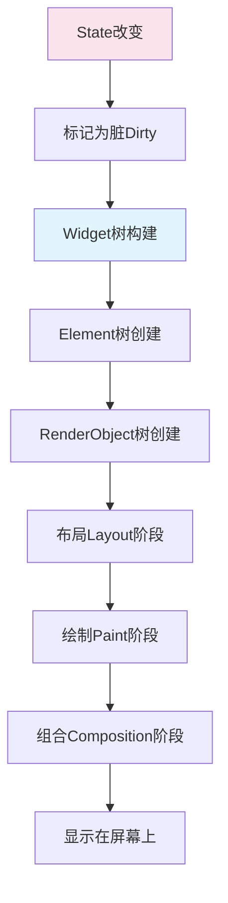
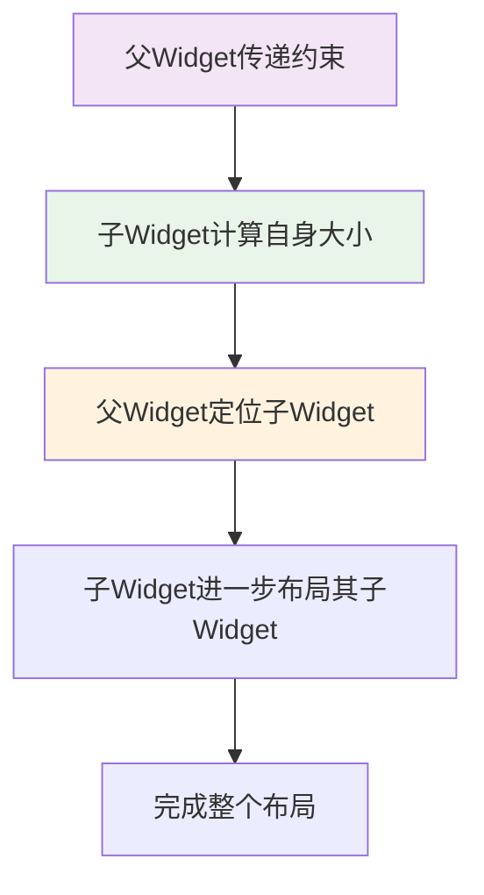
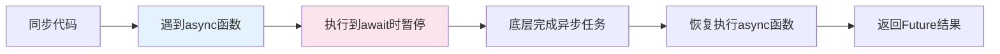
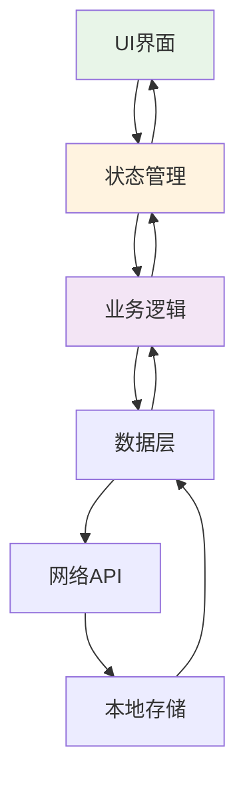
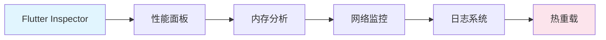

# Flutter初学者完全指南：避开这些坑，让跨平台开发更轻松

> 作为一名Flutter初学者，你是不是经常被各种错误提示搞得一头雾水？今天我们来聊聊Flutter开发中那些常见的"坑"，带你轻松避开它们！

## 🤔 为什么选Flutter？

首先，很多初学者会问：为什么要学Flutter？简单说，**一套代码，多端运行**就是这个框架最吸引人的地方。无论是iOS、Android、Web还是桌面端，都能用Dart语言统一开发。

```dart
import 'package:flutter/material.dart';

void main() => runApp(const MyApp());

class MyApp extends StatelessWidget {
  const MyApp({super.key});

  @override
  Widget build(BuildContext context) {
    return MaterialApp(
      home: Scaffold(
        appBar: AppBar(title: const Text('我的第一个App')),
        body: const Center(child: Text('Hello Flutter!')),
      ),
    );
  }
}
```

看起来简单对吧？但现实往往是...代码能跑起来，但我们不知道它在干什么。别急，我们一步步来！

## 🚧 环境搭建的"第一道坎"

### 错误1：环境变量配置不当

```bash
# ❌ 错误做法
export PATH=/usr/local/bin:$PATH
# 这样可能会导致系统找不到其他重要工具

# ✅ 正确做法
export PATH=/usr/local/flutter/bin:$PATH
export PUB_HOSTED_URL=https://pub.flutter-io.cn
export FLUTTER_STORAGE_BASE_URL=https://storage.flutter-io.cn
```

**重要提示**：国内开发者一定要配置镜像源，否则下载依赖会非常慢！

### 错误2：依赖版本冲突

这是初学者最容易掉进的坑。我们来看一个典型的`pubspec.yaml`文件：

```yaml
# ❌ 错误示例
name: my_app
description: 我的Flutter应用

dependencies:
  flutter:
    sdk: flutter
  cupertino_icons: ^1.0.0
  http: ^0.13.0
  provider: ^6.0.0

# ✅ 正确做法
name: my_app
description: 我的Flutter应用

environment:
  sdk: '>=2.18.0 <3.0.0'
  flutter: '>=3.0.0'

dependencies:
  flutter:
    sdk: flutter
  cupertino_icons: ^1.0.5
  http: ^1.1.0
  provider: ^6.1.1

dev_dependencies:
  flutter_test:
    sdk: flutter
```

**关键点**：
- 指定SDK版本范围
- 使用最新稳定版本的包
- 区分依赖和开发依赖

## 🧩 Widget系统：理解Flutter的核心

很多初学者最大的困惑就是：**为什么我的界面不显示？** 这通常是因为不理解Widget的渲染流程。

### Flutter渲染流程



### 常见Widget类型错误

**错误3：混淆StatelessWidget和StatefulWidget**

```dart
// ❌ 错误：在StatelessWidget中试图改变状态
class CounterWidget extends StatelessWidget {
  int count = 0; // 这不会触发重新构建
  
  @override
  Widget build(BuildContext context) {
    return ElevatedButton(
      onPressed: () {
        count++; // 不会刷新界面！
      },
      child: Text('点击次数: $count'),
    );
  }
}

// ✅ 正确：使用StatefulWidget
class CounterWidget extends StatefulWidget {
  @override
  _CounterWidgetState createState() => _CounterWidgetState();
}

class _CounterWidgetState extends State<CounterWidget> {
  int count = 0;
  
  void _incrementCounter() {
    setState(() {
      count++; // 这会触发重新构建！
    });
  }
  
  @override
  Widget build(BuildContext context) {
    return ElevatedButton(
      onPressed: _incrementCounter,
      child: Text('点击次数: $count'),
    );
  }
}
```

**错误4：过度使用StatefulWidget**

不是所有情况都需要状态管理。如果没有需要改变的状态，应该使用StatelessWidget：

```dart
// ✅ 正确：使用StatelessWidget
class WelcomeText extends StatelessWidget {
  final String userName;
  
  const WelcomeText({super.key, required this.userName});
  
  @override
  Widget build(BuildContext context) {
    return Text('欢迎, $userName!');
  }
}
```

## 📱 布局系统的"玄学"问题

初学者经常遇到布局超出边界、控件显示不全等问题。核心是理解约束系统。

### Flutter布局流程



### 常见布局错误

**错误5：不理解约束传递**

```dart
// ❌ 错误：在无限约束中尝试无限高度
Widget build(BuildContext context) {
  return Column(
    children: [
      Container(
        width: double.infinity,  // 没问题
        height: double.infinity, // 错误！Column高度未知
        color: Colors.red,
      ),
    ],
  );
}

// ✅ 正确：使用Expanded或具体尺寸
Widget build(BuildContext context) {
  return Column(
    children: [
      Expanded(  // 使用Expanded来占用可用空间
        child: Container(
          color: Colors.red,
        ),
      ),
    ],
  );
}
```

**错误6：布局嵌套过深**

```dart
// ❌ 错误：过度嵌套
Widget build(BuildContext context) {
  return Container(
    child: Column(
      children: [
        Container(
          child: Row(
            children: [
              Container(
                child: Text('Hello'),
              ),
            ],
          ),
        ),
      ],
    ),
  );
}

// ✅ 正确：简化嵌套
Widget build(BuildContext context) {
  return Column(
    children: [
      Row(
        children: [
          Text('Hello'),
        ],
      ),
    ],
  );
}
```

## 🔄 异步编程的"陷阱"

Flutter开发离不开异步操作，这是很多初学者的痛点。

### Dart异步编程模型



### 常见异步错误

**错误7：在build方法中使用setState**

```dart
// ❌ 错误做法
@override
Widget build(BuildContext context) {
  // 异步获取数据并更新状态
  fetchData().then((data) {
    setState(() {
      this.data = data;  // 危险！可能在build过程中调用setState
    });
  });
  
  return Text(data ?? '加载中...');
}

// ✅ 正确做法
class MyWidget extends StatefulWidget {
  @override
  _MyWidgetState createState() => _MyWidgetState();
}

class _MyWidgetState extends State<MyWidget> {
  String? data;
  
  @override
  void initState() {
    super.initState();
    _loadData();
  }
  
  Future<void> _loadData() async {
    final result = await fetchData();
    setState(() {
      data = result;
    });
  }
  
  @override
  Widget build(BuildContext context) {
    return Text(data ?? '加载中...');
  }
}
```

**错误8：未处理异步错误**

```dart
// ❌ 错误：忽略异步错误
Future<void> loadUserData() async {
  final response = await http.get(Uri.parse('api/user'));
  setState(() {
    userData = json.decode(response.body);
  });
}

// ✅ 正确：处理异步错误
Future<void> loadUserData() async {
  try {
    final response = await http.get(Uri.parse('api/user'));
    if (response.statusCode == 200) {
      setState(() {
        userData = json.decode(response.body);
      });
    } else {
      throw Exception('请求失败: ${response.statusCode}');
    }
  } catch (e) {
    // 显示错误信息
    ScaffoldMessenger.of(context).showSnackBar(
      SnackBar(content: Text('加载失败: $e')),
    );
  }
}
```

## 🌐 网络请求和数据处理

### 数据流管理架构



### 常见数据错误

**错误9：直接在UI中处理业务逻辑**

```dart
// ❌ 错误：UI层包含太多业务逻辑
Widget build(BuildContext context) {
  return FutureBuilder<List<User>>(
    future: http.get('api/users').then((response) {
      return (json.decode(response.body) as List)
          .map((userJson) => User.fromJson(userJson))
          .toList();
    }),
    builder: (context, snapshot) {
      // 这里还有更多业务逻辑...
    },
  );
}

// ✅ 正确：分离关注点
class UserService {
  Future<List<User>> getUsers() async {
    final response = await http.get(Uri.parse('api/users'));
    final List<dynamic> data = json.decode(response.body);
    return data.map((json) => User.fromJson(json)).toList();
  }
}

// 在UI中
FutureBuilder<List<User>>(
  future: userService.getUsers(),
  builder: (context, snapshot) {
    // 只负责显示逻辑
  },
)
```

## 🔧 调试和性能优化

### Flutter调试工具链



### 常见性能错误

**错误10：忽略Widget重建优化**

```dart
// ❌ 错误：每次重建都创建新对象
Widget build(BuildContext context) {
  return ListView.builder(
    itemCount: 1000,
    itemBuilder: (context, index) {
      return ListTile(
        leading: Icon(Icons.person),  // 每次都创建新Icon
        title: Text('用户 $index'),
      );
    },
  );
}

// ✅ 正确：使用const和缓存
class MyListView extends StatelessWidget {
  static const Icon personIcon = Icon(Icons.person);
  
  @override
  Widget build(BuildContext context) {
    return ListView.builder(
      itemCount: 1000,
      itemBuilder: (context, index) {
        return const ListTile(
          leading: Icon(Icons.person),  // 使用const
          title: Text('用户'),  // 文本内容相同
        );
      },
    );
  }
}
```

## 🎯 实战案例：构建一个完整的待办应用

让我们通过一个实际案例来巩固所学知识：

### 项目结构
```
lib/
├── main.dart
├── models/
│   └── todo.dart
├── services/
│   └── todo_service.dart
├── widgets/
│   ├── todo_list.dart
│   └── add_todo_dialog.dart
└── pages/
    └── home_page.dart
```

### 核心代码实现

```dart
// models/todo.dart
class Todo {
  final String id;
  final String title;
  final bool completed;
  final DateTime createdAt;
  
  Todo({
    required this.id,
    required this.title,
    this.completed = false,
    required this.createdAt,
  });
  
  Todo copyWith({
    String? id,
    String? title,
    bool? completed,
    DateTime? createdAt,
  }) {
    return Todo(
      id: id ?? this.id,
      title: title ?? this.title,
      completed: completed ?? this.completed,
      createdAt: createdAt ?? this.createdAt,
    );
  }
}

// widgets/todo_list.dart
class TodoList extends StatelessWidget {
  final List<Todo> todos;
  final Function(Todo) onTodoToggle;
  final Function(Todo) onTodoDelete;
  
  const TodoList({
    super.key,
    required this.todos,
    required this.onTodoToggle,
    required this.onTodoDelete,
  });
  
  @override
  Widget build(BuildContext context) {
    return ListView.builder(
      itemCount: todos.length,
      itemBuilder: (context, index) {
        final todo = todos[index];
        return Dismissible(
          key: Key(todo.id),
          direction: DismissDirection.endToStart,
          onDismissed: (direction) => onTodoDelete(todo),
          background: Container(color: Colors.red),
          child: ListTile(
            leading: Checkbox(
              value: todo.completed,
              onChanged: (_) => onTodoToggle(todo),
            ),
            title: Text(
              todo.title,
              style: todo.completed 
                  ? TextStyle(decoration: TextDecoration.lineThrough)
                  : null,
            ),
            subtitle: Text(
              '创建时间: ${DateFormat('yyyy-MM-dd HH:mm').format(todo.createdAt)}',
            ),
          ),
        );
      },
    );
  }
}
```