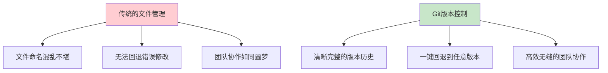
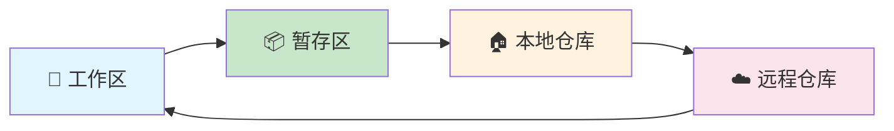
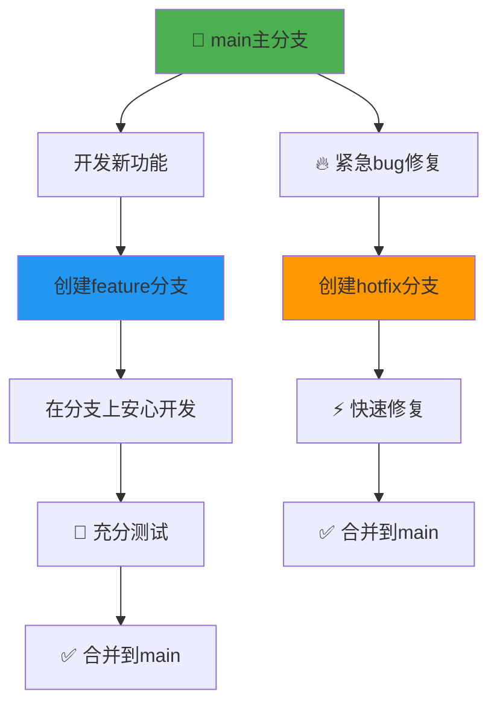
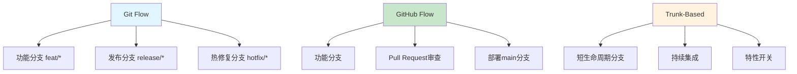
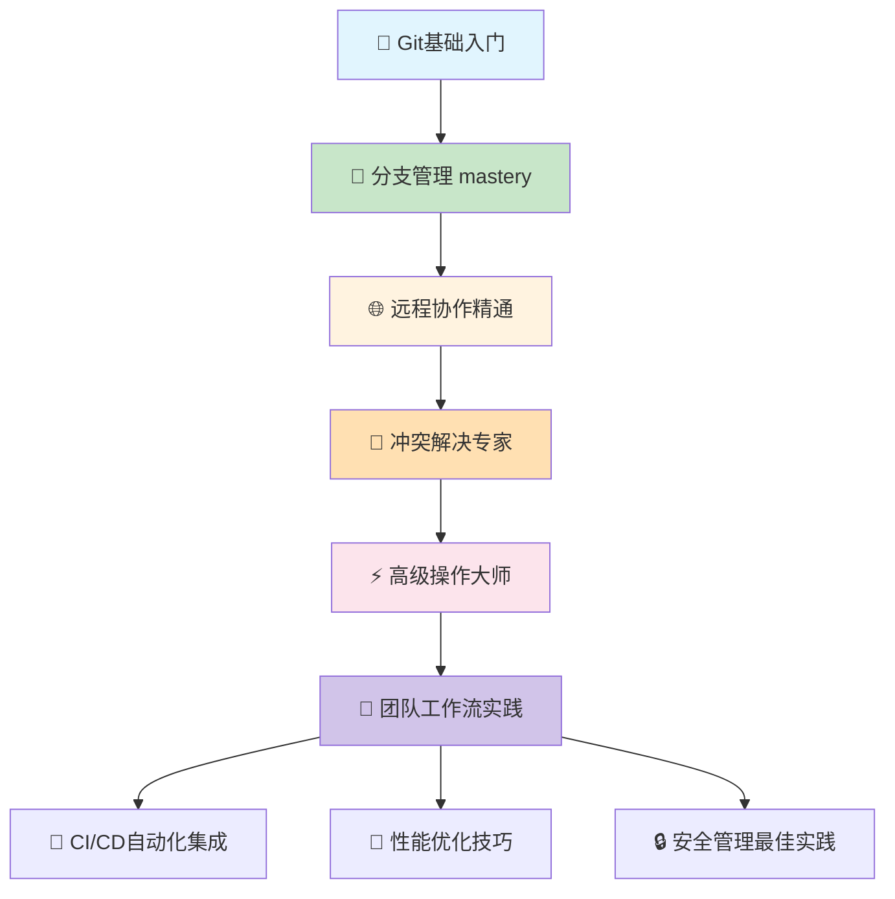

# GitHub入门完全指南：程序员必备的版本控制超级技能

> 🔥 还在为"最终版_v2_修订版_终极版"的文件命名头疼吗？这篇万字长文带你从零开始，彻底告别版本混乱的时代！

朋友们，你是否经历过这样的痛苦场景？

**程序员小王的悲惨故事**
> "我不小心删错了代码，现在整个功能都无法运行了！"  
> "团队里谁偷偷修改了这段代码？为什么没有通知我？"  
> "这个bug是哪个版本引入的？我现在要怎么回退到稳定版本？"

如果你也曾经被这些问题困扰，那么恭喜你，今天就是你告别这些烦恼的日子！Git和GitHub，这两个程序员必备的超级技能，将彻底改变你的开发生活。

## 🌟 为什么Git和GitHub如此重要？

**数据说话，惊人影响力：**
- 💻 **95%以上的专业开发者**在使用Git进行版本控制
- 🌍 **GitHub拥有超过2亿个代码仓库**，是全球最大的开发者社区
- 🏢 **几乎所有科技巨头**都在使用GitHub进行团队协作
- 🚀 **从个人小项目到Linux内核**，Git无处不在

### Git vs 传统版本管理的对比



**Git的五大核心优势：**
- ✅ **版本追踪** - 记录每一次代码变更，永不丢失
- ✅ **分支管理** - 多人并行开发，互不干扰
- ✅ **团队协作** - 代码审查、合并请求，流程规范
- ✅ **代码回退** - 轻松撤销错误，降低风险
- ✅ **备份安全** - 分布式存储，数据永不丢失

---

## 🛠️ 第一步：安装和配置Git环境

### 不同系统的安装方式（超级详细）

**Windows系统（推荐Git for Windows）**
```bash
# 1. 访问 https://git-scm.com/download/win 下载安装包
# 2. 双击安装，一路点击"下一步"即可
# 3. 安装完成后，在开始菜单找到"Git Bash"
# 4. 输入命令验证安装：git --version
```

**macOS系统（两种方法任选其一）**
```bash
# 方法1：使用Homebrew（强烈推荐）
/bin/bash -c "$(curl -fsSL https://raw.githubusercontent.com/Homebrew/install/HEAD/install.sh)"
brew install git

# 方法2：安装Xcode Command Line Tools
xcode-select --install
```

**Linux系统（以Ubuntu为例）**
```bash
# Ubuntu/Debian系统
sudo apt update
sudo apt install git

# CentOS/RHEL系统  
sudo yum install git
```

### 验证安装是否成功

```bash
# 检查Git版本
git --version
# 正确输出示例：git version 2.39.2

# 查看Git配置信息
git config --list
```

### 常见安装问题解决

**问题1：git命令找不到**
```bash
# ❌ 错误提示
bash: git: command not found

# ✅ 解决方案
# Windows：检查Git Bash是否安装正确
# macOS/Linux：运行 which git 查看命令位置
# 如果找不到，按照上述步骤重新安装
```

**问题2：权限问题**
```bash
# ❌ 错误提示：Permission denied
# ✅ 解决方案：使用sudo权限安装
sudo apt install git  # Linux系统
```

### Git基本配置（这一步很重要！）

```bash
# 配置全局用户信息（必须设置）
git config --global user.name "你的真实姓名"
git config --global user.email "你的常用邮箱"

# 配置默认文本编辑器
git config --global core.editor "code --wait"  # VS Code用户
git config --global core.editor "vim"          # Vim用户

# 验证配置是否生效
git config --list
```

**为什么要配置用户信息？**
- 每次提交代码时都会记录作者信息
- 团队成员可以清楚知道每行代码是谁写的
- 这是Git的基本要求，不配置无法提交代码

---

## 📁 核心概念：3分钟搞懂Git工作原理

很多初学者觉得Git很难，其实是因为没有理解它的核心概念。让我们用生活中的例子来理解：

### Git工作流程（像存钱罐一样简单）



### 四区域详细解释

**1. 工作区 (Working Directory)**
- 就是你电脑上看到的项目文件夹
- 所有的代码文件都在这里编辑
- 相当于你的"工作桌面"

**2. 暂存区 (Staging Area)**
- 准备提交的文件临时存放区
- 可以挑选部分修改进行提交
- 相当于"购物车"，选好商品再结账

**3. 本地仓库 (Local Repository)**
- 存储完整版本历史的地方
- 位于项目根目录的隐藏文件夹`.git`
- 相当于你的"私人保险柜"

**4. 远程仓库 (Remote Repository)**
- GitHub、GitLab等平台上的仓库
- 团队协作和备份的中心
- 相当于"银行金库"，大家共享

---

## 🚀 实战开始：创建你的第一个Git项目

### 方法1：初始化新项目（从零开始）

```bash
# 1. 创建项目文件夹
mkdir my-awesome-project
cd my-awesome-project

# 2. 初始化Git仓库
git init
# 输出：Initialized empty Git repository in /path/to/my-awesome-project/.git/

# 3. 查看仓库状态
git status
# 输出：On branch main，No commits yet
```

### 方法2：克隆现有项目（学习他人代码）

```bash
# 克隆GitHub上的开源项目
git clone https://github.com/username/cool-project.git
cd cool-project

# 或者使用SSH方式（更安全）
git clone git@github.com:username/cool-project.git
```

### 常见错误：在错误目录初始化

```bash
# ❌ 危险操作：在系统根目录初始化
cd /
git init  # 这会在整个系统创建.git文件夹！

# ✅ 正确做法：在专门的项目目录
cd ~/Documents/projects/my-app
git init

# ✅ 检查当前目录
echo "当前目录：" && pwd
ls -la | grep .git  # 检查是否已有.git文件夹
```

---

## 📝 Git基本操作：添加和提交更改

### 完整的日常工作流程

```bash
# 场景：开发一个新功能

# 1. 创建新文件或修改现有文件
echo "# 我的第一个项目" > README.md
echo "print('Hello, Git!')" > main.py

# 2. 查看当前状态
git status
# 输出：
# Untracked files:
#   README.md
#   main.py

# 3. 添加文件到暂存区
git add README.md main.py
# 或者添加所有更改：git add .

# 4. 再次查看状态
git status  
# 输出：Changes to be committed: new file: README.md, new file: main.py

# 5. 提交更改（附上有意义的提交信息）
git commit -m "feat: 初始化项目结构和Hello World功能"
# 输出：[main (root-commit) abc1234] feat: 初始化项目...

# 6. 查看提交历史
git log
# 显示所有提交记录，包括作者、时间、提交信息
```

### 提交信息规范（专业习惯从小养成）

**❌ 不好的提交信息：**
```bash
git commit -m "fix"        # 太模糊
git commit -m "update"     # 没有具体内容
git commit -m "asdf"       # 毫无意义
```

**✅ 好的提交信息：**
```bash
# 使用约定式提交格式
git commit -m "feat: 添加用户登录功能"
git commit -m "fix: 修复密码验证逻辑错误"
git commit -m "docs: 更新API接口文档"
```

**更规范的多行提交信息：**
```bash
git commit -m "feat: 实现完整的用户注册流程

- 添加手机号验证码注册
- 实现密码强度实时验证  
- 完善错误提示和用户体验
- 添加注册成功后的跳转逻辑"
```

**常用提交类型前缀：**
- `feat:` - 新功能
- `fix:` - 修复bug  
- `docs:` - 文档更新
- `style:` - 代码格式调整
- `refactor:` - 代码重构
- `test:` - 测试相关
- `chore:` - 构建工具变动

---

## 🌿 分支管理：Git的真正超能力

分支是Git最强大的功能之一，让你可以：
- 同时开发多个功能而不互相干扰
- 实验新想法而不会影响主代码
- 安全地修复bug而不破坏现有功能

### Git分支模型图解



### 分支操作完整示例

```bash
# 1. 查看所有分支（刚开始只有main分支）
git branch
# 输出：* main  （*表示当前所在分支）

# 2. 创建新分支
git branch feature-user-login

# 3. 切换到新分支
git checkout feature-user-login
# 或者使用更简单的命令：git switch feature-user-login

# 4. 一步完成创建并切换（推荐）
git checkout -b feature-user-profile

# 5. 在新分支上开发
echo "用户个人资料页面" > profile.html
git add profile.html
git commit -m "feat: 添加用户个人资料页面"

# 6. 切换回main分支
git checkout main

# 7. 合并功能分支
git merge feature-user-login

# 8. 删除已合并的分支（保持整洁）
git branch -d feature-user-login
```

### 分支管理最佳实践

```bash
# 正确的分支工作流程

# 1. 确保在main分支开始
git checkout main

# 2. 拉取最新代码（团队协作时很重要）
git pull origin main

# 3. 为每个功能创建独立分支
git checkout -b feature-payment-integration

# 4. 在功能分支上专心开发
echo "支付接口代码" > payment.py
git add payment.py
git commit -m "feat: 集成支付宝支付接口"

# 5. 完成开发后合并回main
git checkout main
git merge feature-payment-integration

# 6. 删除已合并的功能分支
git branch -d feature-payment-integration
```

---

## 🌐 GitHub入门：连接远程仓库

GitHub是Git的远程托管平台，让你的代码：
- 有安全的云端备份
- 可以与他人协作开发
- 参与开源项目贡献
- 展示个人技术能力

### 第一步：创建GitHub账户

1. 访问 https://github.com
2. 点击"Sign up"注册账户
3. 验证邮箱完成注册
4. 完善个人资料

### 第二步：创建SSH密钥（安全连接）

```bash
# 生成SSH密钥对
ssh-keygen -t ed25519 -C "your_email@example.com"

# 一路按回车使用默认设置
# 生成的密钥在：~/.ssh/id_ed25519（私钥）和 ~/.ssh/id_ed25519.pub（公钥）

# 查看公钥内容
cat ~/.ssh/id_ed25519.pub
# 复制全部内容（从ssh-ed25519开始到邮箱结束）
```

**在GitHub添加SSH密钥：**
1. 登录GitHub，点击右上角头像 → Settings
2. 左侧菜单选择"SSH and GPG keys"
3. 点击"New SSH key"
4. 标题随便写（如：My Laptop）
5. 粘贴刚才复制的公钥内容
6. 点击"Add SSH key"

### 第三步：配置远程仓库

```bash
# 查看当前远程仓库配置
git remote -v
# 初始状态：没有配置任何远程仓库

# 添加远程仓库（替换为你的仓库地址）
git remote add origin git@github.com:你的用户名/你的仓库名.git

# 再次查看确认
git remote -v
# 正确输出：
# origin  git@github.com:你的用户名/你的仓库名.git (fetch)
# origin  git@github.com:你的用户名/你的仓库名.git (push)
```

### 第四步：推送到GitHub

```bash
# 第一次推送（设置上游分支）
git push -u origin main
# -u 参数表示设置上游分支，以后只需要git push即可

# 后续推送（简单多了）
git push

# 推送其他分支
git push origin feature-branch-name

# 拉取远程更新
git pull origin main
```

### 常见推送问题解决

**问题：权限被拒绝 (Permission denied)**
```bash
# ❌ 错误信息
fatal: unable to access 'https://github.com/...': The requested URL returned error: 403

# ✅ 解决方案
# 1. 检查远程地址是否正确：git remote -v
# 2. 使用SSH方式（推荐）：git remote set-url origin git@github.com:username/repo.git
# 3. 或者使用个人访问令牌
```

---

## 🔄 高级技巧：解决冲突和撤销操作

### 处理合并冲突（团队协作必会技能）

```bash
# 当两个人修改了同一文件时会发生冲突
git merge feature-branch
# 输出：Auto-merging file.txt
# CONFLICT (content): Merge conflict in file.txt
# Automatic merge failed; fix conflicts and then commit the result.

# 查看冲突文件内容
cat file.txt
# 显示冲突标记：
# <<<<<<< HEAD
# 当前分支的内容（你的修改）
# =======
# 要合并的分支的内容（别人的修改）  
# >>>>>>> feature-branch

# 手动解决冲突：选择保留哪些内容，删除冲突标记
# 然后标记冲突已解决
git add file.txt
git commit -m "解决与feature-branch的合并冲突"
```

### 撤销操作的多种方式

```bash
# 1. 撤销工作区的修改（慎用！不可恢复）
git checkout -- filename.txt

# 2. 撤销暂存区的修改（放回工作区）
git reset HEAD filename.txt

# 3. 撤销最近一次提交（保留修改在工作区）
git reset --soft HEAD~1

# 4. 完全撤销最近一次提交（丢弃所有修改）
git reset --hard HEAD~1

# 5. 安全撤销：创建新的撤销提交（推荐）
git revert HEAD
```

### 误操作挽回技巧

```bash
# 如果不小心删除了重要文件或提交
git reflog  # 查看所有操作记录
# 找到误删的提交哈希值，如：abc1234

git checkout abc1234  # 切换到那个提交
# 或者创建新分支保存：git branch recovery-branch abc1234
```

---

## 💡 效率提升：Git实用技巧大全

### 配置命令别名（大幅提升效率）

```bash
# 编辑Git全局配置
git config --global alias.st status
git config --global alias.ci commit  
git config --global alias.co checkout
git config --global alias.br branch

# 现在可以使用简写命令
git st    # 相当于 git status
git ci -m "message"  # 相当于 git commit -m "message"

# 更高级的别名
git config --global alias.lg "log --oneline --graph --decorate"
git config --global alias.unstage "reset HEAD --"
```

### 创建.gitignore文件（忽略不需要版本控制的文件）

在项目根目录创建`.gitignore`文件：

```gitignore
# 编译输出文件
*.class
*.exe
*.dll
*.so
*.dylib

# 日志文件
*.log
logs/

# 依赖目录（不要提交第三方库）
node_modules/
vendor/

# 环境配置文件（包含敏感信息）
.env
config.ini
*.key

# 系统文件
.DS_Store
Thumbs.db

# IDE配置文件
.vscode/
.idea/
*.swp
*.swo
```

### Git图形化工具推荐

**初学者推荐：**
- **GitHub Desktop** - 界面简洁，与GitHub完美集成
- **SourceTree** - 功能全面，免费使用
- **GitKraken** - 界面美观，跨平台支持

**高级用户推荐：**
- 命令行 + VS Code Git扩展
- Git自带的gitk和git-gui工具
- 各种IDE内置的Git功能

---

## 📊 团队协作：Git工作流最佳实践

### 三种常见的工作流模式



### GitHub Flow（适合大多数团队）

```bash
# 1. 确保main分支是最新的
git checkout main
git pull origin main

# 2. 创建功能分支
git checkout -b feature-awesome-feature

# 3. 开发并提交代码
echo "实现酷炫功能" > awesome.py
git add awesome.py
git commit -m "feat: 实现酷炫新功能"

# 4. 推送到远程
git push origin feature-awesome-feature

# 5. 在GitHub网站创建Pull Request
# 6. 团队成员代码审查和讨论
# 7. 通过后合并到main分支
# 8. 删除已合并的功能分支
```

---

## 🚨 常见问题快速解决方案

### 问题1：提交了错误的内容

```bash
# 修改最后一次提交
git add corrected-file.txt
git commit --amend -m "正确的提交信息"

# 注意：如果已经推送到远程，需要使用强制推送（慎用！）
git push --force-with-lease origin main
```

### 问题2：拆分一个大提交

```bash
# 交互式重置（保留修改在工作区）
git reset --soft HEAD~3

# 然后分多次提交
git add file1.txt
git commit -m "功能A：实现基础框架"

git add file2.txt  
git commit -m "功能A：添加业务逻辑"

git add file3.txt
git commit -m "功能A：完善测试用例"
```

### 问题3：临时保存工作进度

```bash
# 保存当前工作进度（适用于临时切换任务）
git stash

# 查看保存的进度列表
git stash list

# 恢复最近保存的进度（并删除stash）
git stash pop

# 应用特定进度（不删除stash）
git stash apply stash@{1}
```

---

## 📈 Git学习路径：从新手到专家

### 循序渐进的学习路线图

