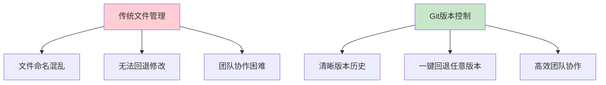
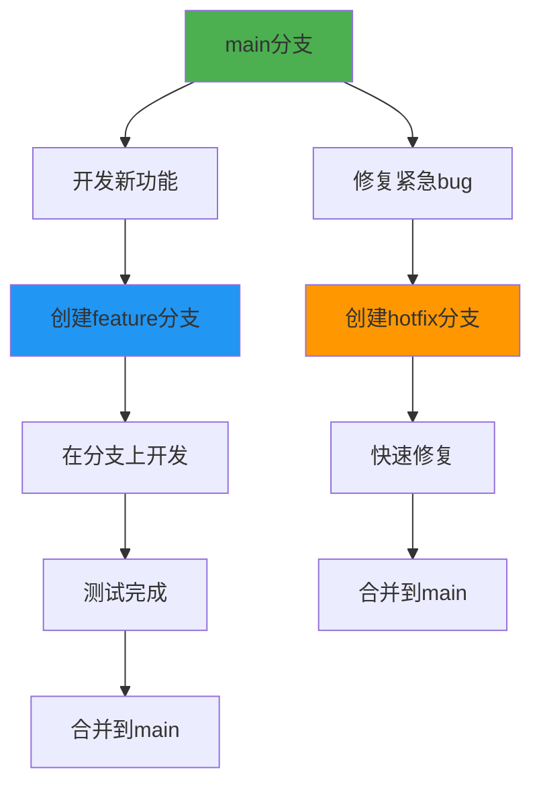
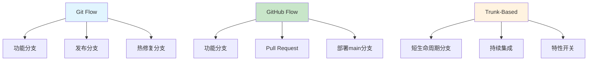
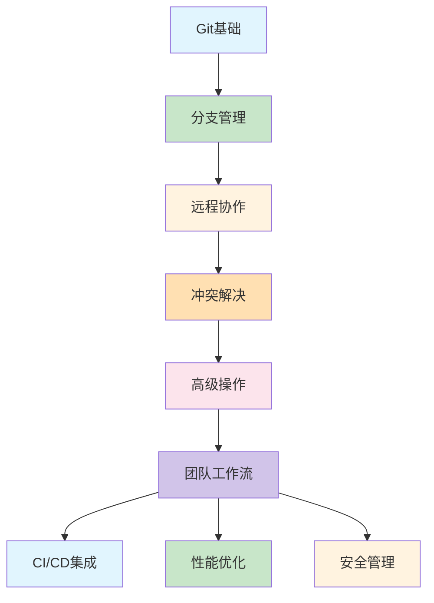

# Git入门完全指南：从零开始的版本控制大师之路

> 🔧 还在为"最终版_v2_真的最终版_修订版"的文件命名头疼吗？今天我们来聊聊Git这个神奇的工具，让你彻底告别版本混乱的时代！

## 🌟 为什么Git如此重要？

想象一下这些让人崩溃的场景：

**程序员小王的悲惨故事**
> "我不小心删错了代码，现在功能无法运行了！"  
> "团队里谁修改了这段代码？为什么没有告诉我？"  
> "这个bug是哪个版本引入的？我现在要怎么回退？"

**解决方案来了：Git！**

**Git在开发者世界的重要性：**
- 💻 **90%以上的开发者**在使用Git进行版本控制
- 🌍 **GitHub拥有超过1亿个仓库**，是全球最大的代码托管平台
- 🏢 **几乎所有科技公司**都在使用Git进行团队协作
- 🚀 **从个人项目到大型开源项目**，Git无处不在

### Git vs 传统版本管理的对比



**Git的核心优势：**
- ✅ **版本追踪** - 记录每一次代码变更
- ✅ **分支管理** - 并行开发不同功能
- ✅ **团队协作** - 多人同时工作不冲突
- ✅ **代码回退** - 轻松撤销错误修改
- ✅ **备份安全** - 分布式存储，数据不丢失

## 🛠️ 环境准备：安装和配置Git

### 不同系统的安装方式

```bash
# Windows系统
# 1. 下载Git for Windows安装包
# 2. 双击安装，一路下一步即可
# 3. 安装完成后在命令行输入 git --version 验证

# macOS系统
# 方法1：使用Homebrew（推荐）
brew install git

# 方法2：安装Xcode Command Line Tools
xcode-select --install

# Linux系统 (Ubuntu/Debian)
sudo apt update
sudo apt install git

# Linux系统 (CentOS/RHEL)
sudo yum install git
```

### 验证安装是否成功

```bash
# 检查Git版本
git --version
# 应该输出类似: git version 2.39.2

# 查看Git配置
git config --list
```

### 常见错误1：git命令找不到

```bash
# ❌ 错误：command not found
git --version
# bash: git: command not found

# ✅ 解决方法1：检查安装路径
# Windows: 检查Git Bash是否安装正确
# macOS/Linux: which git 查看命令位置

# ✅ 解决方法2：重新安装
# 按照上述安装步骤重新操作

# ✅ 解决方法3：环境变量配置
# Windows: 检查PATH环境变量是否包含Git安装路径
# macOS/Linux: echo $PATH 查看PATH变量
```

### 基本配置（重要！）

```bash
# 配置用户信息（必须设置！）
git config --global user.name "你的姓名"
git config --global user.email "你的邮箱"

# 配置默认文本编辑器
git config --global core.editor "code --wait"  # VS Code
git config --global core.editor "vim"          # Vim

# 查看配置信息
git config --list
```

## 📁 Git核心概念：3分钟搞懂工作原理

### Git工作流程


### 核心概念解释

**1. 工作区 (Working Directory)**
- 你正在编辑的文件所在目录
- 肉眼可见的代码文件

**2. 暂存区 (Staging Area)**
- 准备提交的文件临时存放区
- 可以选择性地提交部分修改

**3. 本地仓库 (Local Repository)**
- 存储完整版本历史的地方
- 位于项目根目录的`.git`文件夹

**4. 远程仓库 (Remote Repository)**
- GitHub、GitLab等平台上的仓库
- 团队协作和备份的中心

## 🚀 第一个Git项目：开始版本控制之旅

### 初始化Git仓库

```bash
# 方法1：初始化新项目
mkdir my-project
cd my-project
git init
# 输出: Initialized empty Git repository in /path/to/my-project/.git/

# 方法2：克隆现有项目
git clone https://github.com/username/repository.git
cd repository
```

### 查看仓库状态

```bash
# 查看当前仓库状态
git status

# 初始状态输出示例:
# On branch main
# No commits yet
# nothing to commit (create/copy files and use "git add" to track)
```

### 常见错误2：在错误目录初始化

```bash
# ❌ 错误：在系统目录初始化Git
cd /
git init
# 这会在根目录创建.git文件夹，可能导致系统问题

# ✅ 正确做法：在项目目录初始化
cd ~/projects/my-app
git init

# ✅ 检查当前目录是否正确
pwd  # 打印当前目录路径
ls -la  # 查看是否有.git文件夹（不应该有）
```

## 📝 Git基本操作：添加和提交更改

### 完整的工作流程

```bash
# 1. 创建或修改文件
echo "# My Project" > README.md

# 2. 查看状态（文件显示为未跟踪）
git status
# Untracked files:
#   README.md

# 3. 添加到暂存区
git add README.md
# 或添加所有更改: git add .

# 4. 再次查看状态（文件显示为已暂存）
git status
# Changes to be committed:
#   new file:   README.md

# 5. 提交更改
git commit -m "添加项目说明文档"
# 输出: [main (root-commit) abc1234] 添加项目说明文档
#       1 file changed, 1 insertion(+)
#       create mode 100644 README.md

# 6. 查看提交历史
git log
# 显示所有提交记录
```

### 常见错误3：提交信息不规范

```bash
# ❌ 错误：提交信息过于简单或无意义
git commit -m "fix"
git commit -m "update"
git commit -m "asdf"

# ✅ 正确：使用有意义的提交信息
git commit -m "修复用户登录验证逻辑"
git commit -m "添加商品搜索功能"
git commit -m "优化数据库查询性能"

# ✅ 更规范的提交信息格式：
git commit -m "feat: 添加用户注册功能

- 实现手机号验证注册
- 添加密码强度验证
- 完善错误提示信息"
```

**提交信息规范建议：**
- `feat:` 新功能
- `fix:` 修复bug
- `docs:` 文档更新
- `style:` 代码格式调整
- `refactor:` 代码重构
- `test:` 测试相关
- `chore:` 构建过程或辅助工具变动

## 🌿 分支管理：Git的超能力

### Git分支模型



### 分支操作命令

```bash
# 查看所有分支
git branch
# 输出: * main  （*表示当前所在分支）

# 创建新分支
git branch feature-login

# 切换分支
git checkout feature-login
# 或使用更简单的命令: git switch feature-login

# 创建并切换分支（一步完成）
git checkout -b feature-user-profile

# 在分支上开发并提交
echo "用户资料页面" > user-profile.html
git add .
git commit -m "feat: 添加用户资料页面"

# 切换回main分支
git checkout main

# 合并分支
git merge feature-login

# 删除分支（合并后）
git branch -d feature-login
```

### 常见错误4：在错误的分支上开发

```bash
# ❌ 错误：直接在main分支开发新功能
# 可能导致不稳定的代码影响主分支

# ✅ 正确做法：为每个功能创建独立分支
# 1. 确保在main分支
git checkout main

# 2. 拉取最新代码
git pull origin main

# 3. 创建功能分支
git checkout -b feature-payment

# 4. 在功能分支上开发
echo "支付功能代码" > payment.py
git add .
git commit -m "feat: 添加支付功能"

# 5. 完成后合并到main
git checkout main
git merge feature-payment
```

## 🌐 远程协作：连接GitHub/GitLab

### 配置远程仓库

```bash
# 查看当前远程仓库配置
git remote -v
# 初始状态没有配置

# 添加远程仓库
git remote add origin https://github.com/username/my-project.git

# 再次查看
git remote -v
# origin  https://github.com/username/my-project.git (fetch)
# origin  https://github.com/username/my-project.git (push)
```

### 推送到远程仓库

```bash
# 第一次推送（设置上游分支）
git push -u origin main
# 后续推送只需要: git push

# 推送其他分支
git push origin feature-branch

# 拉取远程更新
git pull origin main

# 获取远程更新（不自动合并）
git fetch origin
```

### 常见错误5：推送权限被拒绝

```bash
# ❌ 错误：权限被拒绝
git push origin main
# fatal: unable to access 'https://github.com/username/repo.git/': 
# The requested URL returned error: 403

# ✅ 解决方法1：检查远程地址是否正确
git remote -v
# 确保URL格式正确

# ✅ 解决方法2：使用SSH密钥（推荐）
# 生成SSH密钥
ssh-keygen -t ed25519 -C "your_email@example.com"
# 将公钥(~/.ssh/id_ed25519.pub)添加到GitHub

# 修改远程地址为SSH
git remote set-url origin git@github.com:username/repo.git

# ✅ 解决方法3：使用个人访问令牌
# 在GitHub设置中生成token
# 然后在URL中使用token
git remote set-url origin https://token@github.com/username/repo.git
```

## 🔄 高级操作：解决冲突和撤销更改

### 处理合并冲突

```bash
# 当合并时出现冲突
git merge feature-branch
# Auto-merging file.txt
# CONFLICT (content): Merge conflict in file.txt
# Automatic merge failed; fix conflicts and then commit the result.

# 查看冲突文件
cat file.txt
# <<<<<<< HEAD
# 当前分支的内容
# =======
# 要合并的分支的内容
# >>>>>>> feature-branch

# 手动解决冲突后
git add file.txt
git commit -m "解决合并冲突"
```

### 撤销更改的多种方式

```bash
# 1. 撤销工作区的修改（危险！不可恢复）
git checkout -- file.txt

# 2. 撤销暂存区的修改（放回工作区）
git reset HEAD file.txt

# 3. 撤销最近的一次提交（保留修改在工作区）
git reset --soft HEAD~1

# 4. 撤销最近的一次提交（丢弃修改）
git reset --hard HEAD~1

# 5. 使用revert创建新的撤销提交（推荐）
git revert HEAD
```

### 常见错误6：误删重要文件或提交

```bash
# ❌ 错误：误删文件或错误重置
rm important-file.txt
git reset --hard HEAD~3  # 不小心删除了重要提交

# ✅ 解决方法1：找回误删的文件
git checkout HEAD -- important-file.txt

# ✅ 解决方法2：查看历史记录找回提交
git reflog
# 显示所有操作历史，找到误删的提交哈希
git checkout abc1234  # 切换到丢失的提交

# ✅ 解决方法3：创建备份分支
git branch backup-branch  # 在操作前创建备份
git checkout backup-branch  # 万一出错可以回到备份
```

## 💡 实用技巧：提升Git使用效率

### 别名配置（强烈推荐）

```bash
# 编辑Git配置文件
git config --global alias.st status
git config --global alias.ci commit
git config --global alias.co checkout
git config --global alias.br branch

# 现在可以使用简写命令
git st    # 相当于 git status
git ci -m "message"  # 相当于 git commit -m "message"

# 更高级的别名
git config --global alias.lg "log --oneline --graph --decorate"
git config --global alias.unstage "reset HEAD --"
```

### 忽略文件配置

创建`.gitignore`文件：
```gitignore
# 编译输出
*.class
*.exe
*.dll

# 日志文件
*.log
logs/

# 依赖目录
node_modules/
vendor/

# 配置文件（包含敏感信息）
config.ini
.env

# 系统文件
.DS_Store
Thumbs.db
```

### Git图形化工具推荐

**初学者友好：**
- **GitHub Desktop** - 界面简洁，适合入门
- **SourceTree** - 功能全面，免费使用
- **GitKraken** - 界面美观，跨平台

**高级用户：**
- 命令行 + VS Code Git扩展
- Git自带的gitk和git-gui
- IDE内置的Git工具

## 📊 Git工作流：团队协作最佳实践

### 常见的工作流模式



### GitHub Flow（推荐给初创团队）

```bash
# 1. 从main分支创建功能分支
git checkout -b feature-new-feature

# 2. 开发并提交代码
echo "新功能代码" > feature.py
git add .
git commit -m "feat: 实现新功能"

# 3. 推送到远程
git push origin feature-new-feature

# 4. 在GitHub创建Pull Request
# 5. 代码审查和讨论
# 6. 合并到main分支
# 7. 删除功能分支
```

## 🚨 常见问题快速解决

### 问题1：提交了错误的内容

```bash
# 修改最后一次提交
git add corrected-file.txt
git commit --amend -m "正确的提交信息"

# 注意：如果已经推送到远程，需要使用强制推送（慎用！）
git push --force-with-lease origin main
```

### 问题2：想拆分一个大提交

```bash
# 交互式重置
git reset --soft HEAD~3

# 然后分多次提交
git add file1.txt
git commit -m "功能A：实现基础框架"

git add file2.txt
git commit -m "功能A：添加业务逻辑"
```

### 问题3：临时保存工作进度

```bash
# 保存当前工作进度
git stash

# 查看保存的进度列表
git stash list

# 恢复最近保存的进度
git stash pop

# 应用特定进度（不删除）
git stash apply stash@{1}
```

## 📈 Git学习路径建议

### 学习路线图

