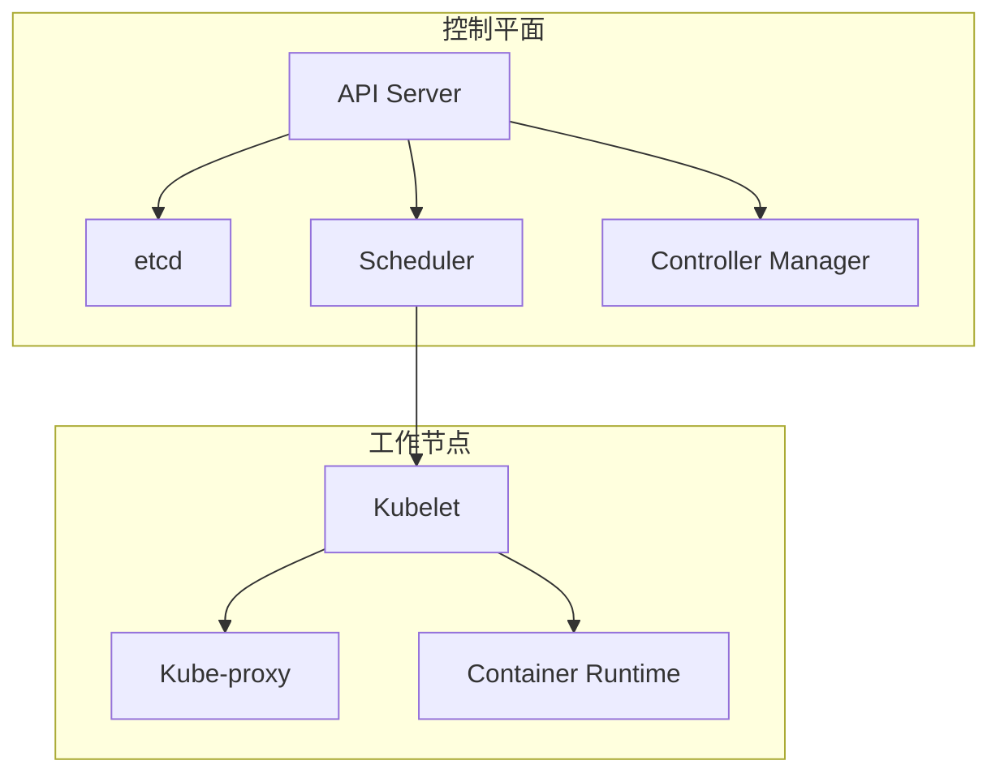

# K8s核心概念

## 一、核心载体：容器与Pod

### Pod

**定义**：K8s中最小的可部署单元，不是容器，而是一组紧密关联的容器的集合（通常1个Pod里跑1个主容器+若干辅助容器）。

**特点**：

- 同一个Pod内的容器共享网络命名空间（可以用localhost互相通信）和存储卷
- Pod是临时性的，被删除或故障后不会恢复，而是由控制器重新创建

**实例YAML（精简）**：

```yaml
apiVersion: v1
kind: Pod
metadata:
  name: my-pod
spec:
  containers:
  - name: main-container
    image: nginx
    ports:
    - containerPort: 80
  - name: sidecar-container
    image: log-collector
```

### 容器（Container）

**定义**：就是Docker这类容器技术打包的应用，Pod是容器的“外壳”，K8s通过管理Pod来间接管理容器。

## 二、调度与管理：控制器（Controller）

控制器是K8s的“调度大脑”，负责确保Pod的实际状态和你声明的期望状态一致。

### 1. Deployment

**最常用的控制器**，用于管理无状态应用（比如前端、后端API）。

**核心功能**：支持滚动更新（逐个替换旧Pod，不中断服务）、回滚（更新出问题时一键退回旧版本）、扩缩容。

**常用操作**：

```bash
# 扩缩容
kubectl scale deployment nginx-deploy --replicas=5

# 滚动更新
kubectl set image deployment nginx-deploy nginx=nginx:1.26

# 查看状态
kubectl rollout status deployment nginx-deploy
```

### 2. StatefulSet

用于管理**有状态应用**（比如数据库、Redis集群）。

**核心特点**：Pod有固定的名称和网络标识，存储卷和Pod绑定，重启后身份不变，适合需要持久化状态的应用。

### 3. DaemonSet

确保集群中**每一个节点**（或指定节点）都运行一个Pod副本。

**典型场景**：日志收集（比如Fluentd）、监控代理（比如Prometheus Node Exporter）。

### 4. Job / CronJob

- **Job**：用于运行**一次性任务**（比如数据备份、批量计算），任务完成后Pod自动结束
- **CronJob**：基于时间的**定时任务**（类似Linux的crontab），比如每天凌晨备份数据库

### 5. ReplicaSet（RS）

直接管理Pod的副本数量，确保集群中始终有指定数量的Pod在运行。**Deployment就是基于ReplicaSet实现的**，日常使用中一般直接用Deployment即可。

## 三、服务访问：Service & Ingress

Pod的IP是动态的（重启后会变），这两类概念解决“如何稳定访问Pod”的问题。

### 1. Service

**定义**：为一组相同功能的Pod提供固定的访问入口和负载均衡。

**核心类型**：

| 类型 | 说明 | 适用场景 |
|------|------|----------|
| **ClusterIP** | 默认类型，仅在集群内部可访问 | 集群内服务间通信 |
| **NodePort** | 在集群每个节点上开放一个固定端口 | 测试环境 |
| **LoadBalancer** | 结合云厂商的负载均衡器，自动分配公网IP | 生产环境暴露服务 |

### 2. Ingress

相当于K8s的“智能反向代理”，解决Service无法满足的复杂HTTP/HTTPS路由需求。

**核心功能**：域名路由、SSL证书管理、路径匹配

**注意**：Ingress本身只是规则，需要部署Ingress Controller（比如Nginx Ingress Controller）才能生效。

```yaml
apiVersion: networking.k8s.io/v1
kind: Ingress
metadata:
  name: my-ingress
spec:
  rules:
  - host: api.example.com
    http:
      paths:
      - path: /
        pathType: Prefix
        backend:
          service:
            name: api-service
            port:
              number: 80
```

## 四、配置与存储：ConfigMap、Secret、Volume、PV/PVC

### 1. ConfigMap

用于存储**非敏感**的配置数据（比如配置文件、环境变量、命令行参数）。

**特点**：可以和Pod解耦，修改ConfigMap后可以热更新Pod的配置。

### 2. Secret

用于存储**敏感信息**（比如密码、Token、SSL证书）。

**特点**：数据会被Base64编码存储（注意：不是加密），可以挂载到Pod里作为文件或环境变量。

### 3. Volume

用于Pod内的容器**共享存储**，或临时存储数据。

**常见类型**：

- **emptyDir**：Pod生命周期内的临时存储，Pod删除后数据丢失
- **hostPath**：挂载节点的本地目录，适合单节点测试

### 4. PersistentVolume（PV）& PersistentVolumeClaim（PVC）

这是一套“存储资源池”机制，解决Pod数据持久化的问题。

- **PV**：集群管理员创建的持久化存储资源（比如云硬盘、NFS共享存储）
- **PVC**：用户（开发者）申请存储的“请求单”，声明需要的存储大小、访问模式

## 五、基础架构核心组件



### 控制平面（Control Plane）

| 组件 | 功能 |
|------|------|
| **API Server** | 所有操作统一入口，接收kubectl命令调用 |
| **etcd** | 分布式键值存储，保存集群所有状态 |
| **Scheduler** | 按资源情况、亲和性规则，将Pod调度到合适Node |
| **Controller Manager** | 包含多种控制器，自动修复故障Pod、维持集群状态 |

### 工作节点（Node）

| 组件 | 功能 |
|------|------|
| **Kubelet** | 与API Server通信，确保Pod按规格运行 |
| **Kube-proxy** | 实现Service网络规则，将请求转发到后端Pod |
| **Container Runtime** | 容器运行时（如Docker、Containerd） |

## 六、补充核心概念：Namespace & Label/Selector

### 1. Namespace

集群的逻辑隔离单元，可以把不同的应用、环境（开发/测试/生产）隔离开。

**常用操作**：

```bash
# 创建命名空间
kubectl create namespace prod

# 指定命名空间部署
kubectl apply -f xxx.yaml -n prod
```

### 2. Label & Selector

K8s的“分组和筛选”机制，是实现“松耦合管理”的核心。

- **Label**：给资源（Pod、Service等）打标签，比如 `app=web`、`env=prod`
- **Selector**：通过标签筛选资源

| 分类 | 核心概念 |
|------|----------|
| **核心载体** | Pod是最小部署单元，容器是应用载体 |
| **调度管理** | Deployment（无状态）、StatefulSet（有状态）、Job/CronJob（定时任务） |
| **服务访问** | Service提供稳定入口，Ingress解决HTTP/HTTPS路由 |
| **配置存储** | ConfigMap/Secret管理配置，PV/PVC实现数据持久化 |
| **架构支撑** | 控制平面决策调度，Node节点执行运行 |

>